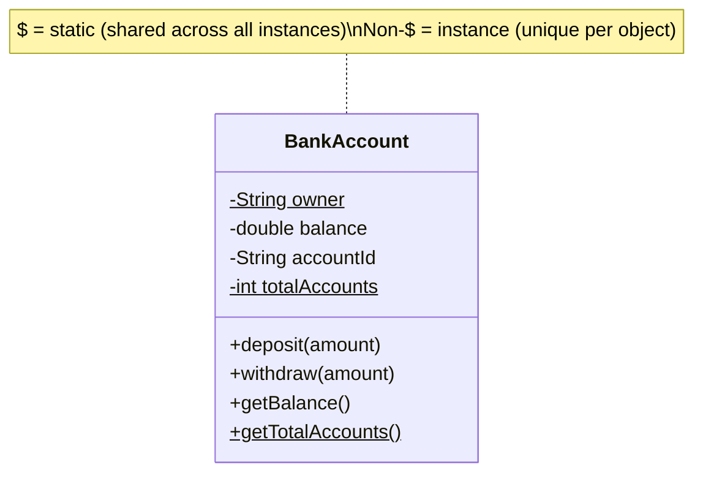
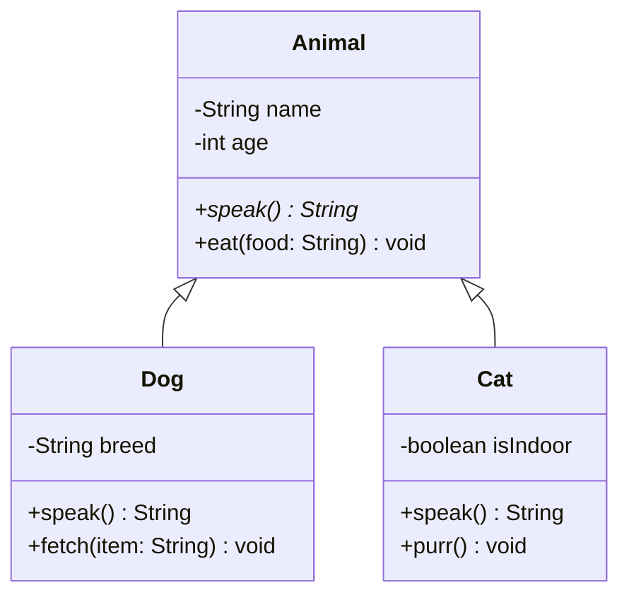
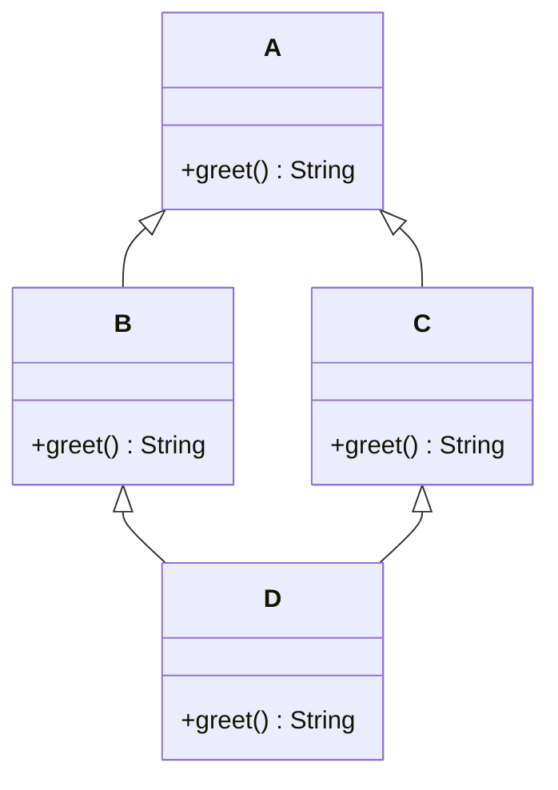
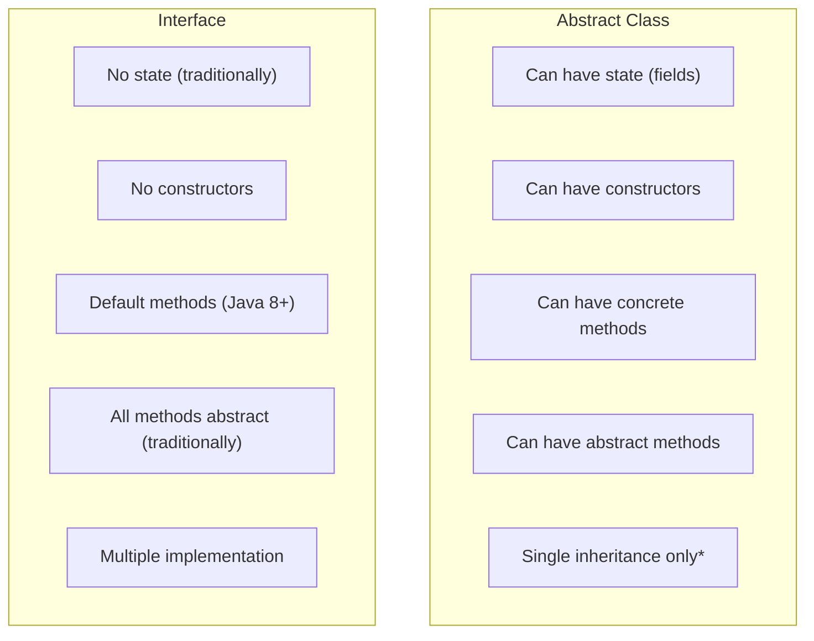
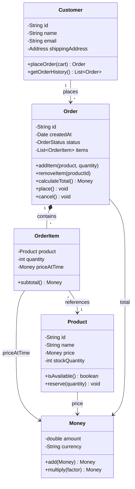
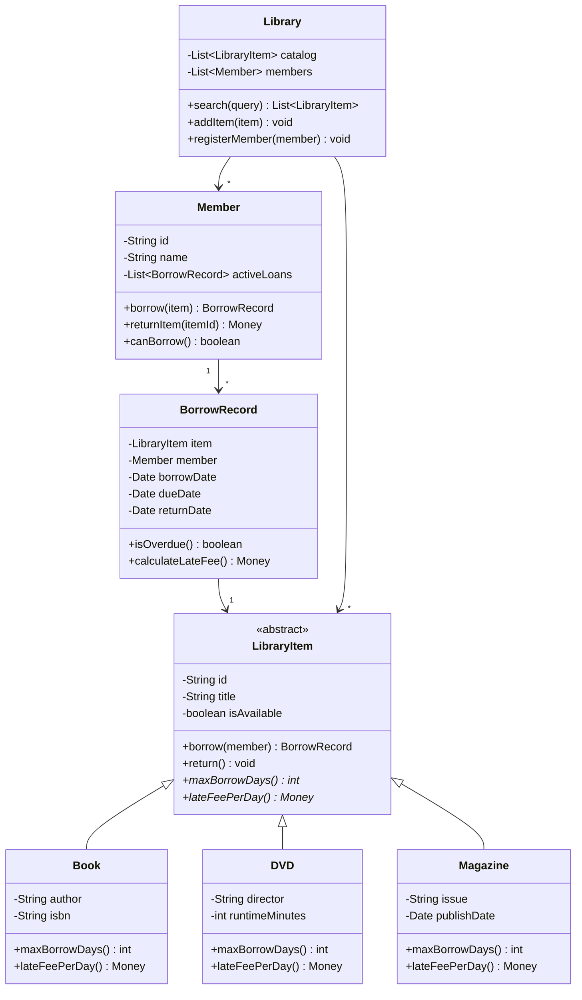

# Object-Oriented Programming

::: tip Key Takeaway
- OOP organizes code around **objects** (data + behavior) rather than functions and logic — objects are nouns, methods are verbs, properties are adjectives
- The four pillars — **encapsulation, inheritance, polymorphism, abstraction** — are tools, not goals; use them when they reduce complexity, not because a textbook said so
- Real mastery is knowing **when NOT to use OOP** — data pipelines, simple scripts, and pure transformations are often better served by functional or procedural approaches
:::

## One-Liner Summary

> OOP models software as interacting objects that bundle data with the operations that act on that data, enabling you to manage complexity through encapsulation, reuse through polymorphism, and structure through abstraction.

---

## 1. What is Object-Oriented Programming?

Object-Oriented Programming is a **programming paradigm** — a way of thinking about and structuring code — that organizes software around **objects** rather than functions or logic. An object is a self-contained unit that combines **state** (data, fields, properties) with **behavior** (methods, functions that operate on that state).

### The Mental Model

Think of the real world. You do not think about "driving" as a free-floating function. You think about a **car** (an object) that **has** an engine, wheels, and fuel level (properties) and **can** accelerate, brake, and turn (methods). The car **encapsulates** the horrific complexity of internal combustion — you press the gas pedal and the car figures out the rest.

| OOP Concept | Real-World Analogy | Grammar |
|---|---|---|
| **Object** | A specific car (your 2024 Toyota Camry) | Noun (proper) |
| **Class** | The blueprint for a Toyota Camry | Noun (common) |
| **Method** | Accelerate, brake, turn | Verb |
| **Property** | Color, fuel level, speed | Adjective/Attribute |
| **Message** | "Hey car, accelerate to 60mph" | Sentence |

### A Brief History

OOP did not appear overnight. It was forged across decades of software engineering:

| Year | Milestone | Significance |
|------|-----------|--------------|
| **1967** | **Simula** (Ole-Johan Dahl, Kristen Nygaard) | First language with classes and objects. Created for simulation problems in Norway. |
| **1972** | **Smalltalk** (Alan Kay, Xerox PARC) | Coined "object-oriented." Everything is an object — even numbers and booleans. Message-passing paradigm. |
| **1979** | **C++** (Bjarne Stroustrup) | "C with Classes." Brought OOP to systems programming. Introduced multiple inheritance, templates. |
| **1991** | **Python** (Guido van Rossum) | Multiparadigm but deeply OO — everything is an object. Clean syntax lowered the OOP learning curve. |
| **1995** | **Java** (James Gosling, Sun Microsystems) | "Write once, run anywhere." Forced OOP (everything in a class). Became the enterprise standard. |
| **1995** | **JavaScript** (Brendan Eich) | Prototype-based OOP — no classes originally. ES6 (2015) added class syntax as sugar over prototypes. |
| **2012** | **TypeScript** (Anders Hejlsberg, Microsoft) | Added static types and classical OOP features to JavaScript. |
| **2010** | **Go** (Google) | OOP without classes — structs, methods, implicit interfaces. Rejected inheritance entirely. |
| **2015** | **Rust** (Mozilla) | Traits instead of inheritance. Proved you can have polymorphism without class hierarchies. |

Alan Kay, who coined "object-oriented programming," later said:

> "I made up the term object-oriented, and I can tell you I did not have C++ in mind." — Alan Kay

Kay's vision was about **message passing** between autonomous objects, not about inheritance hierarchies. Modern OOP has drifted from this vision, but the core insight remains: organize code around the things it models.

### Why OOP Became Dominant

OOP dominated from the mid-1990s to the 2010s for several reasons:

1. **Mirrors human cognition** — we naturally think in terms of objects and categories
2. **Manages complexity** — encapsulation lets teams work on different objects independently
3. **Enables code reuse** — inheritance and polymorphism let you extend without rewriting
4. **Supports large teams** — interfaces and access modifiers create clear contracts between team boundaries
5. **GUI mapping** — windowed UIs (buttons, text fields, panels) map naturally to objects

---

## 2. Classes and Objects

A **class** is a blueprint. An **object** is a house built from that blueprint. You can build many houses (objects) from one blueprint (class), and each house has its own paint color (state) while sharing the same floor plan (structure and behavior).

### Class Anatomy

```java
// Java — the classic OOP class
public class BankAccount {
    // Fields (state)
    private String owner;
    private double balance;
    private final String accountId;
    private static int totalAccounts = 0;  // shared across ALL instances

    // Constructor — called when object is created
    public BankAccount(String owner, double initialBalance) {
        this.owner = owner;                 // 'this' refers to the current instance
        this.balance = initialBalance;
        this.accountId = generateId();
        totalAccounts++;                    // modify class-level state
    }

    // Instance method — operates on this specific account
    public void deposit(double amount) {
        if (amount <= 0) throw new IllegalArgumentException("Deposit must be positive");
        this.balance += amount;
    }

    // Instance method
    public boolean withdraw(double amount) {
        if (amount > this.balance) return false;
        this.balance -= amount;
        return true;
    }

    // Getter — controlled access to private state
    public double getBalance() {
        return this.balance;
    }

    // Static method — belongs to the CLASS, not any instance
    public static int getTotalAccounts() {
        return totalAccounts;
    }

    // Private helper — internal implementation detail
    private String generateId() {
        return "ACC-" + System.currentTimeMillis();
    }
}
```

```python
# Python — same concept, different syntax
class BankAccount:
    total_accounts = 0  # Class variable — shared across all instances

    def __init__(self, owner: str, initial_balance: float):
        # Instance variables — unique to each object
        self.owner = owner
        self._balance = initial_balance          # _ convention = "private"
        self._account_id = self._generate_id()
        BankAccount.total_accounts += 1

    def deposit(self, amount: float) -> None:
        if amount <= 0:
            raise ValueError("Deposit must be positive")
        self._balance += amount

    def withdraw(self, amount: float) -> bool:
        if amount > self._balance:
            return False
        self._balance -= amount
        return True

    @property
    def balance(self) -> float:
        return self._balance

    @classmethod
    def get_total_accounts(cls) -> int:
        return cls.total_accounts

    def _generate_id(self) -> str:
        import time
        return f"ACC-{int(time.time() * 1000)}"
```

```typescript
// TypeScript — modern OOP with type safety
class BankAccount {
  private static totalAccounts = 0;

  private balance: number;
  private readonly accountId: string;

  constructor(
    private readonly owner: string,
    initialBalance: number,
  ) {
    this.balance = initialBalance;
    this.accountId = this.generateId();
    BankAccount.totalAccounts++;
  }

  deposit(amount: number): void {
    if (amount <= 0) throw new Error("Deposit must be positive");
    this.balance += amount;
  }

  withdraw(amount: number): boolean {
    if (amount > this.balance) return false;
    this.balance -= amount;
    return true;
  }

  getBalance(): number {
    return this.balance;
  }

  static getTotalAccounts(): number {
    return BankAccount.totalAccounts;
  }

  private generateId(): string {
    return `ACC-${Date.now()}`;
  }
}
```

### Constructors and Destructors

**Constructors** initialize an object's state when it is created. **Destructors** (or finalizers) clean up when the object is destroyed. In garbage-collected languages (Java, Python, TypeScript), destructors are rarely used because memory management is automatic.

```python
class DatabaseConnection:
    def __init__(self, connection_string: str):
        """Constructor — acquire the resource"""
        self._conn = create_connection(connection_string)
        print(f"Connection opened: {connection_string}")

    def __del__(self):
        """Destructor — release the resource (unreliable in Python!)"""
        self._conn.close()
        print("Connection closed")

    # Better pattern: context manager
    def __enter__(self):
        return self

    def __exit__(self, exc_type, exc_val, exc_tb):
        self._conn.close()
        return False

# Usage with context manager (preferred)
with DatabaseConnection("postgres://localhost/mydb") as db:
    db.query("SELECT * FROM users")
# Connection is guaranteed to close here
```

### Static vs Instance Members



| Aspect | Instance Members | Static Members |
|--------|-----------------|----------------|
| **Belongs to** | A specific object | The class itself |
| **Access** | `this.balance` / `self._balance` | `BankAccount.totalAccounts` |
| **Memory** | One copy per object | One copy total |
| **Can access** | Both instance and static members | Only static members |
| **Use case** | Object-specific data | Shared counters, factory methods, utilities |

### Memory Layout

When you create objects, memory is allocated for each instance's fields, but methods are shared:

```
Heap Memory:
┌──────────────────────────────────────┐
│  BankAccount Class Metadata          │
│  ├── totalAccounts: 2                │  ← static (one copy)
│  ├── deposit() method code           │  ← shared
│  ├── withdraw() method code          │  ← shared
│  └── getBalance() method code        │  ← shared
├──────────────────────────────────────┤
│  Object #1 (alice's account)         │
│  ├── owner: "Alice"                  │  ← instance (unique)
│  ├── balance: 5000.00                │  ← instance (unique)
│  └── accountId: "ACC-1712345"        │  ← instance (unique)
├──────────────────────────────────────┤
│  Object #2 (bob's account)           │
│  ├── owner: "Bob"                    │  ← instance (unique)
│  ├── balance: 3200.00                │  ← instance (unique)
│  └── accountId: "ACC-1712346"        │  ← instance (unique)
└──────────────────────────────────────┘
```

---

## 3. Encapsulation

Encapsulation is the bundling of data with the methods that operate on that data, **and** the restriction of direct access to some of that data. It is the single most important OOP concept — the one that delivers the most practical value in real codebases.

### The Car Dashboard Analogy

When you drive a car, the dashboard gives you a **simplified interface** to a horrifically complex machine. You see speed, fuel level, and engine temperature. You interact through the steering wheel, pedals, and gear shift. You never directly manipulate the fuel injectors, the camshaft, or the transmission gears.

The dashboard **hides** the engine complexity (information hiding) and **protects** the engine from invalid states (data protection). You cannot set the engine temperature to -500 degrees through the dashboard. The car exposes a **safe, controlled interface** and keeps its internals private.

Encapsulation does the same for code.

### Access Modifiers

| Modifier | Java | Python | TypeScript | Accessible From |
|----------|------|--------|------------|-----------------|
| **Public** | `public` | (default) | `public` (default) | Anywhere |
| **Protected** | `protected` | `_prefix` (convention) | `protected` | Class + subclasses |
| **Private** | `private` | `__prefix` (name mangling) | `private` | Class only |
| **Package-private** | (default, no keyword) | N/A | N/A | Same package/module |

```java
// Java — all four access levels
public class Employee {
    public String name;              // Anyone can access
    protected String department;     // This class + subclasses + same package
    String building;                 // Same package only (package-private)
    private double salary;           // This class only

    public double getSalary() {      // Controlled access
        return salary;
    }

    public void raiseSalary(double percentage) {
        if (percentage < 0 || percentage > 50) {
            throw new IllegalArgumentException("Invalid raise percentage");
        }
        this.salary *= (1 + percentage / 100);
    }
}
```

```typescript
// TypeScript — ES2022 private fields with #
class Employee {
  public name: string;
  protected department: string;
  #salary: number;  // true runtime private (ES2022)

  constructor(name: string, department: string, salary: number) {
    this.name = name;
    this.department = department;
    this.#salary = salary;
  }

  get salary(): number {
    return this.#salary;
  }

  raiseSalary(percentage: number): void {
    if (percentage < 0 || percentage > 50) {
      throw new Error("Invalid raise percentage");
    }
    this.#salary *= (1 + percentage / 100);
  }
}
```

### The Getters/Setters Debate

A common misconception: "encapsulation means add getters and setters for every field." This is wrong. Blindly adding `getX()` and `setX()` for every private field is the same as making it public — you gain nothing.

```java
// BAD — "encapsulation theater"
// This is functionally identical to a public field
public class BadAccount {
    private double balance;

    public double getBalance() { return balance; }
    public void setBalance(double balance) { this.balance = balance; }
    // Anyone can set balance to -999999. What did we protect?
}

// GOOD — real encapsulation
// The class protects its own invariants
public class GoodAccount {
    private double balance;

    public double getBalance() { return balance; }
    // No setBalance! Instead, domain operations:

    public void deposit(double amount) {
        if (amount <= 0) throw new IllegalArgumentException("Must be positive");
        this.balance += amount;
    }

    public void withdraw(double amount) {
        if (amount <= 0) throw new IllegalArgumentException("Must be positive");
        if (amount > balance) throw new InsufficientFundsException();
        this.balance -= amount;
    }
}
```

**Rule of thumb**: Expose **behaviors** (what the object can do), not **data** (what the object contains). Ask "what operations make sense for this object?" not "what fields need getters?"

### Immutable Objects

The ultimate form of encapsulation — an object whose state cannot change after creation:

```java
// Java — immutable value object
public final class Money {
    private final double amount;
    private final String currency;

    public Money(double amount, String currency) {
        this.amount = amount;
        this.currency = currency;
    }

    public Money add(Money other) {
        if (!this.currency.equals(other.currency)) {
            throw new IllegalArgumentException("Currency mismatch");
        }
        return new Money(this.amount + other.amount, this.currency);
        // Returns NEW object — does not modify this one
    }

    public double getAmount() { return amount; }
    public String getCurrency() { return currency; }
}
```

```python
# Python — immutable with dataclass
from dataclasses import dataclass

@dataclass(frozen=True)  # frozen=True makes it immutable
class Money:
    amount: float
    currency: str

    def add(self, other: "Money") -> "Money":
        if self.currency != other.currency:
            raise ValueError("Currency mismatch")
        return Money(self.amount + other.amount, self.currency)

price = Money(29.99, "USD")
# price.amount = 0  # Raises FrozenInstanceError!
total = price.add(Money(10.00, "USD"))  # Returns new Money(39.99, "USD")
```

Immutable objects are inherently thread-safe, easier to reason about, and eliminate entire categories of bugs.

---

## 4. Inheritance

Inheritance lets a class (the **child**, **subclass**, or **derived class**) acquire the fields and methods of another class (the **parent**, **superclass**, or **base class**). The child can then add new behavior or override existing behavior.

### When Inheritance Is Appropriate

Use the **"is-a" test**: does it make sense to say "a [Child] **is a** [Parent]"?

- "A Dog **is an** Animal" — yes, inheritance makes sense
- "A Car **has an** Engine" — no, this is composition (an engine is a part, not a type)
- "A Square **is a** Rectangle" — careful! Mathematically yes, but in OOP this violates Liskov Substitution



### Inheritance in Three Languages

```java
// Java — single inheritance with abstract classes
public abstract class Animal {
    protected String name;
    protected int age;

    public Animal(String name, int age) {
        this.name = name;
        this.age = age;
    }

    // Abstract method — subclasses MUST implement
    public abstract String speak();

    // Concrete method — subclasses inherit as-is
    public void eat(String food) {
        System.out.println(name + " eats " + food);
    }
}

public class Dog extends Animal {
    private String breed;

    public Dog(String name, int age, String breed) {
        super(name, age);     // Call parent constructor
        this.breed = breed;
    }

    @Override
    public String speak() {
        return "Woof!";
    }

    public void fetch(String item) {
        System.out.println(name + " fetches the " + item);
    }
}
```

```python
# Python — supports multiple inheritance
class Animal:
    def __init__(self, name: str, age: int):
        self.name = name
        self.age = age

    def speak(self) -> str:
        raise NotImplementedError("Subclasses must implement speak()")

    def eat(self, food: str) -> None:
        print(f"{self.name} eats {food}")


class Dog(Animal):
    def __init__(self, name: str, age: int, breed: str):
        super().__init__(name, age)  # Call parent constructor
        self.breed = breed

    def speak(self) -> str:
        return "Woof!"

    def fetch(self, item: str) -> None:
        print(f"{self.name} fetches the {item}")
```

```typescript
// TypeScript
abstract class Animal {
  constructor(
    protected name: string,
    protected age: number,
  ) {}

  abstract speak(): string;

  eat(food: string): void {
    console.log(`${this.name} eats ${food}`);
  }
}

class Dog extends Animal {
  constructor(
    name: string,
    age: number,
    private breed: string,
  ) {
    super(name, age);
  }

  speak(): string {
    return "Woof!";
  }

  fetch(item: string): void {
    console.log(`${this.name} fetches the ${item}`);
  }
}
```

### The Diamond Problem

When a class inherits from two classes that share a common ancestor, which version of the ancestor's method does it get? This is the **diamond problem**.



```python
# Python handles the diamond problem with MRO (Method Resolution Order)
class A:
    def greet(self):
        return "Hello from A"

class B(A):
    def greet(self):
        return "Hello from B"

class C(A):
    def greet(self):
        return "Hello from C"

class D(B, C):
    pass

d = D()
print(d.greet())           # "Hello from B" — MRO: D -> B -> C -> A
print(D.__mro__)           # (D, B, C, A, object)
# Python uses C3 linearization to determine a consistent order
```

Java avoids the diamond problem entirely by **disallowing multiple class inheritance** — you can only extend one class but implement many interfaces (and since Java 8, interfaces can have default methods, reintroducing a limited form of the problem).

### The Fragile Base Class Problem

Changes to a parent class can inadvertently break child classes — even if the parent's public interface does not change:

```java
// Parent class — version 1
public class Collection {
    protected List<Object> items = new ArrayList<>();

    public void add(Object item) {
        items.add(item);
    }

    public void addAll(List<Object> newItems) {
        for (Object item : newItems) {
            add(item);  // Calls add() for each item
        }
    }
}

// Child class — counts items added
public class CountingCollection extends Collection {
    private int addCount = 0;

    @Override
    public void add(Object item) {
        addCount++;
        super.add(item);
    }

    public int getAddCount() { return addCount; }
}

// BUG: addAll calls add() internally, so addCount is incremented TWICE per item!
CountingCollection c = new CountingCollection();
c.addAll(List.of("a", "b", "c"));
System.out.println(c.getAddCount());  // 3? No — it prints 3 correctly here,
// but if parent changes addAll() to use items.addAll() directly, child breaks.
// The child depends on INTERNAL implementation details of the parent.
```

This is why Joshua Bloch in *Effective Java* recommends: **"Design and document for inheritance or else prohibit it"** (use `final` in Java, `sealed` in Kotlin/C#).

---

## 5. Polymorphism

Polymorphism means "many forms." It is the ability to treat objects of different types through a **uniform interface**. It is arguably the most powerful OOP concept — the one that enables truly flexible, extensible software.

### The USB Port Analogy

A USB port on your laptop is polymorphic. It accepts a mouse, a keyboard, an external drive, a phone charger — wildly different devices with wildly different purposes. The port does not care about the specific device. It only cares that the device conforms to the **USB interface** (specific pin layout, data protocol, power requirements).

Your code can do the same. Write functions that accept an **interface**, and any object implementing that interface can be plugged in.

### Compile-Time Polymorphism (Static)

Resolved by the compiler before the program runs.

**Method Overloading** — same method name, different parameter types:

```java
// Java — method overloading
public class Calculator {
    public int add(int a, int b) {
        return a + b;
    }

    public double add(double a, double b) {
        return a + b;
    }

    public String add(String a, String b) {
        return a + b;  // String concatenation
    }
}

Calculator calc = new Calculator();
calc.add(1, 2);          // Calls int version → 3
calc.add(1.5, 2.5);      // Calls double version → 4.0
calc.add("Hello ", "OOP"); // Calls String version → "Hello OOP"
// Compiler decides WHICH method to call based on argument types
```

**Operator Overloading** — redefining what operators like `+`, `==`, `<` do for custom types:

```python
# Python — operator overloading via dunder methods
class Vector:
    def __init__(self, x: float, y: float):
        self.x = x
        self.y = y

    def __add__(self, other: "Vector") -> "Vector":
        return Vector(self.x + other.x, self.y + other.y)

    def __mul__(self, scalar: float) -> "Vector":
        return Vector(self.x * scalar, self.y * scalar)

    def __eq__(self, other: object) -> bool:
        if not isinstance(other, Vector):
            return NotImplemented
        return self.x == other.x and self.y == other.y

    def __repr__(self) -> str:
        return f"Vector({self.x}, {self.y})"

v1 = Vector(1, 2)
v2 = Vector(3, 4)
print(v1 + v2)       # Vector(4, 6)
print(v1 * 3)        # Vector(3, 6)
print(v1 == v2)      # False
```

### Runtime Polymorphism (Dynamic)

Resolved at runtime based on the actual object type.

**Method Overriding** — a subclass provides its own implementation of a parent method:

```typescript
// TypeScript — runtime polymorphism via method overriding
abstract class Shape {
  abstract area(): number;
  abstract perimeter(): number;

  describe(): string {
    return `Shape with area ${this.area().toFixed(2)} and perimeter ${this.perimeter().toFixed(2)}`;
  }
}

class Circle extends Shape {
  constructor(private radius: number) {
    super();
  }
  area(): number {
    return Math.PI * this.radius ** 2;
  }
  perimeter(): number {
    return 2 * Math.PI * this.radius;
  }
}

class Rectangle extends Shape {
  constructor(private width: number, private height: number) {
    super();
  }
  area(): number {
    return this.width * this.height;
  }
  perimeter(): number {
    return 2 * (this.width + this.height);
  }
}

// Polymorphism in action — same code handles ANY shape
function printShapeReport(shapes: Shape[]): void {
  for (const shape of shapes) {
    console.log(shape.describe());
    // At runtime, JavaScript looks up the ACTUAL type of each shape
    // and calls the correct area() and perimeter() implementations
  }
}

printShapeReport([
  new Circle(5),
  new Rectangle(3, 4),
  new Circle(10),
]);
```

### Duck Typing (Python)

Python does not require formal interface declarations. If an object has the right methods, it works — "if it walks like a duck and quacks like a duck, it is a duck."

```python
# Python — duck typing, no inheritance needed
class Duck:
    def speak(self) -> str:
        return "Quack!"

class Person:
    def speak(self) -> str:
        return "Hello!"

class Robot:
    def speak(self) -> str:
        return "Beep boop!"

# This function works with ANY object that has a speak() method
def make_it_speak(thing) -> None:
    print(thing.speak())

make_it_speak(Duck())    # "Quack!"
make_it_speak(Person())  # "Hello!"
make_it_speak(Robot())   # "Beep boop!"
# No common base class. No interface. Just the method.
```

### Interface-Based Polymorphism

The most practical and common form of polymorphism in production code:

```java
// Java — interface-based polymorphism
public interface PaymentProcessor {
    PaymentResult process(Payment payment);
    void refund(String transactionId, double amount);
}

public class StripeProcessor implements PaymentProcessor {
    @Override
    public PaymentResult process(Payment payment) {
        // Stripe-specific implementation
        return stripeApi.charge(payment.getAmount(), payment.getToken());
    }

    @Override
    public void refund(String transactionId, double amount) {
        stripeApi.refund(transactionId, amount);
    }
}

public class PayPalProcessor implements PaymentProcessor {
    @Override
    public PaymentResult process(Payment payment) {
        // PayPal-specific implementation
        return paypalApi.createPayment(payment.getAmount());
    }

    @Override
    public void refund(String transactionId, double amount) {
        paypalApi.issueRefund(transactionId, amount);
    }
}

// The checkout service does not know or care which processor it uses
public class CheckoutService {
    private final PaymentProcessor processor;

    public CheckoutService(PaymentProcessor processor) {
        this.processor = processor;  // Injected at construction time
    }

    public void checkout(Cart cart) {
        Payment payment = cart.toPayment();
        PaymentResult result = processor.process(payment);
        // Works identically for Stripe, PayPal, or any future processor
    }
}
```

### Generic/Template Polymorphism

Type parameters let you write code that works with any type while maintaining type safety:

```typescript
// TypeScript — generic polymorphism
class Stack<T> {
  private items: T[] = [];

  push(item: T): void {
    this.items.push(item);
  }

  pop(): T | undefined {
    return this.items.pop();
  }

  peek(): T | undefined {
    return this.items[this.items.length - 1];
  }

  get size(): number {
    return this.items.length;
  }
}

const numberStack = new Stack<number>();
numberStack.push(42);
numberStack.push(17);
// numberStack.push("hello");  // Compile error! Type safety preserved.

const stringStack = new Stack<string>();
stringStack.push("hello");
stringStack.push("world");
```

---

## 6. Abstraction

Abstraction is about exposing **only what matters** and hiding **how it works**. Encapsulation is the mechanism; abstraction is the goal.

### The Remote Control Analogy

A TV remote control is an abstraction of the TV. You press "Volume Up" — you do not need to know about signal processing, amplifier circuits, or speaker impedance. The remote provides a simplified model of the TV that contains only the operations you care about.

### Abstract Classes vs Interfaces



**Decision Flowchart** — when to use which:

```
Do you need to share state (fields) across subclasses?
├── YES → Abstract Class
└── NO → Do you need to share method implementations?
         ├── YES → Could be either, but prefer Interface with default methods
         └── NO → Do you need multiple inheritance of type?
                  ├── YES → Interface
                  └── NO → Either works; prefer Interface for flexibility
```

```java
// Java — abstract class provides shared state and behavior
public abstract class HttpHandler {
    protected final Logger logger;    // Shared state
    protected final MetricsClient metrics;

    protected HttpHandler(Logger logger, MetricsClient metrics) {
        this.logger = logger;
        this.metrics = metrics;
    }

    // Template method — defines the algorithm skeleton
    public final HttpResponse handle(HttpRequest request) {
        logger.info("Handling: " + request.getPath());
        long start = System.nanoTime();
        try {
            validateRequest(request);           // Hook — subclass can override
            HttpResponse response = doHandle(request);  // Abstract — must implement
            metrics.recordSuccess(System.nanoTime() - start);
            return response;
        } catch (Exception e) {
            metrics.recordFailure(System.nanoTime() - start);
            return handleError(e);              // Hook — subclass can override
        }
    }

    protected void validateRequest(HttpRequest request) {
        // Default validation — subclasses can override
        if (request.getBody() == null) {
            throw new BadRequestException("Body required");
        }
    }

    protected abstract HttpResponse doHandle(HttpRequest request);

    protected HttpResponse handleError(Exception e) {
        // Default error handling — subclasses can override
        return new HttpResponse(500, "Internal Server Error");
    }
}
```

```java
// Java — interface defines a pure contract
public interface Serializable<T> {
    byte[] serialize(T object);
    T deserialize(byte[] data);

    // Default method (Java 8+) — optional convenience method
    default String serializeToBase64(T object) {
        return Base64.getEncoder().encodeToString(serialize(object));
    }
}
```

---

## 7. SOLID Principles

SOLID is a set of five design principles that make OOP code more maintainable, flexible, and understandable. Each principle addresses a specific type of design problem. (For a dedicated deep dive, see the [SOLID Principles section](/architecture-patterns/solid-principles/).)

### S — Single Responsibility Principle

> A class should have only one reason to change.

```typescript
// VIOLATION — this class has THREE responsibilities
class UserService {
  async createUser(data: CreateUserDTO): Promise<User> {
    // 1. Validation logic
    if (!data.email.includes("@")) throw new Error("Invalid email");
    if (data.password.length < 8) throw new Error("Password too short");

    // 2. Database logic
    const user = await db.query("INSERT INTO users ...", [data.email, data.password]);

    // 3. Email logic
    await sendgrid.send({
      to: data.email,
      subject: "Welcome!",
      body: "Thanks for signing up.",
    });

    return user;
  }
}
```

```typescript
// FIX — each class has ONE reason to change
class UserValidator {
  validate(data: CreateUserDTO): void {
    if (!data.email.includes("@")) throw new Error("Invalid email");
    if (data.password.length < 8) throw new Error("Password too short");
  }
}

class UserRepository {
  async create(data: CreateUserDTO): Promise<User> {
    return db.query("INSERT INTO users ...", [data.email, data.password]);
  }
}

class WelcomeEmailSender {
  async send(user: User): void {
    await sendgrid.send({
      to: user.email,
      subject: "Welcome!",
      body: "Thanks for signing up.",
    });
  }
}

class UserRegistrationService {
  constructor(
    private validator: UserValidator,
    private repository: UserRepository,
    private emailSender: WelcomeEmailSender,
  ) {}

  async register(data: CreateUserDTO): Promise<User> {
    this.validator.validate(data);
    const user = await this.repository.create(data);
    await this.emailSender.send(user);
    return user;
  }
}
```

### O — Open/Closed Principle

> Software entities should be open for extension but closed for modification.

```python
# VIOLATION — adding a new discount type requires modifying existing code
class DiscountCalculator:
    def calculate(self, order, discount_type: str) -> float:
        if discount_type == "percentage":
            return order.total * 0.1
        elif discount_type == "fixed":
            return 10.0
        elif discount_type == "buy_one_get_one":
            return order.total * 0.5
        # Every new discount type = modify this method
```

```python
# FIX — Strategy pattern: open for extension, closed for modification
from abc import ABC, abstractmethod

class DiscountStrategy(ABC):
    @abstractmethod
    def calculate(self, order) -> float:
        pass

class PercentageDiscount(DiscountStrategy):
    def __init__(self, percentage: float):
        self.percentage = percentage

    def calculate(self, order) -> float:
        return order.total * self.percentage

class FixedDiscount(DiscountStrategy):
    def __init__(self, amount: float):
        self.amount = amount

    def calculate(self, order) -> float:
        return min(self.amount, order.total)

class BuyOneGetOneDiscount(DiscountStrategy):
    def calculate(self, order) -> float:
        return order.total * 0.5

# Adding a new discount? Just create a new class. No existing code modified.
class LoyaltyDiscount(DiscountStrategy):
    def calculate(self, order) -> float:
        years = order.customer.membership_years
        return order.total * min(years * 0.02, 0.20)

class DiscountCalculator:
    def calculate(self, order, strategy: DiscountStrategy) -> float:
        return strategy.calculate(order)
```

### L — Liskov Substitution Principle

> Subtypes must be substitutable for their base types without altering correctness.

```java
// CLASSIC VIOLATION — the Rectangle/Square problem
public class Rectangle {
    protected int width;
    protected int height;

    public void setWidth(int width) { this.width = width; }
    public void setHeight(int height) { this.height = height; }
    public int getArea() { return width * height; }
}

public class Square extends Rectangle {
    @Override
    public void setWidth(int width) {
        this.width = width;
        this.height = width;  // Must keep width == height
    }

    @Override
    public void setHeight(int height) {
        this.width = height;
        this.height = height;  // Must keep width == height
    }
}

// This test PASSES for Rectangle but FAILS for Square
void testRectangle(Rectangle r) {
    r.setWidth(5);
    r.setHeight(4);
    assert r.getArea() == 20;  // Fails for Square! Area is 16 (4 * 4)
}
// Square is NOT substitutable for Rectangle — LSP violated!
```

### I — Interface Segregation Principle

> No client should be forced to depend on methods it does not use.

```typescript
// VIOLATION — fat interface forces unnecessary implementations
interface Worker {
  work(): void;
  eat(): void;
  sleep(): void;
  attendMeeting(): void;
  writeReport(): void;
}

// A Robot worker has to implement eat() and sleep()... nonsense
class RobotWorker implements Worker {
  work(): void { /* ... */ }
  eat(): void { throw new Error("Robots don't eat"); }  // Forced to implement!
  sleep(): void { throw new Error("Robots don't sleep"); }
  attendMeeting(): void { /* ... */ }
  writeReport(): void { /* ... */ }
}
```

```typescript
// FIX — segregated interfaces
interface Workable {
  work(): void;
}

interface Feedable {
  eat(): void;
}

interface Restable {
  sleep(): void;
}

interface MeetingAttendee {
  attendMeeting(): void;
}

class HumanWorker implements Workable, Feedable, Restable, MeetingAttendee {
  work(): void { /* ... */ }
  eat(): void { /* ... */ }
  sleep(): void { /* ... */ }
  attendMeeting(): void { /* ... */ }
}

class RobotWorker implements Workable, MeetingAttendee {
  work(): void { /* ... */ }
  attendMeeting(): void { /* ... */ }
  // No eat(), no sleep() — clean!
}
```

### D — Dependency Inversion Principle

> High-level modules should not depend on low-level modules. Both should depend on abstractions.

```typescript
// VIOLATION — high-level OrderService depends directly on low-level MySQLDatabase
class MySQLDatabase {
  query(sql: string): any[] { /* ... */ }
}

class OrderService {
  private db = new MySQLDatabase();  // Hardcoded dependency!

  getOrders(): Order[] {
    return this.db.query("SELECT * FROM orders");
    // Cannot test without a real MySQL database
    // Cannot switch to PostgreSQL without modifying this class
  }
}
```

```typescript
// FIX — both depend on an abstraction
interface OrderRepository {
  findAll(): Promise<Order[]>;
  findById(id: string): Promise<Order | null>;
  save(order: Order): Promise<void>;
}

class MySQLOrderRepository implements OrderRepository {
  async findAll(): Promise<Order[]> { /* MySQL-specific */ }
  async findById(id: string): Promise<Order | null> { /* MySQL-specific */ }
  async save(order: Order): Promise<void> { /* MySQL-specific */ }
}

class InMemoryOrderRepository implements OrderRepository {
  private orders: Map<string, Order> = new Map();
  async findAll(): Promise<Order[]> { return [...this.orders.values()]; }
  async findById(id: string): Promise<Order | null> { return this.orders.get(id) ?? null; }
  async save(order: Order): Promise<void> { this.orders.set(order.id, order); }
}

class OrderService {
  constructor(private repository: OrderRepository) {}  // Depends on abstraction!

  async getOrders(): Promise<Order[]> {
    return this.repository.findAll();
    // Easy to test with InMemoryOrderRepository
    // Easy to switch databases — just inject a different implementation
  }
}
```

---

## 8. Composition vs Inheritance

> "Favor composition over inheritance." — Gang of Four, *Design Patterns* (1994)

This is the single most important OOP design guideline, and also the most frequently ignored by beginners.

### The "is-a" vs "has-a" Test

- **Inheritance (is-a)**: "A Dog **is an** Animal" — the child IS a more specific version of the parent
- **Composition (has-a)**: "A Car **has an** Engine" — the parent CONTAINS the other object

```typescript
// INHERITANCE — is-a relationship
// A Dog IS an Animal
class Animal {
  eat(): void { console.log("Eating..."); }
}
class Dog extends Animal {
  bark(): void { console.log("Woof!"); }
}

// COMPOSITION — has-a relationship
// A Car HAS an Engine (an engine is not a type of car)
class Engine {
  start(): void { console.log("Engine started"); }
  stop(): void { console.log("Engine stopped"); }
}

class Car {
  private engine: Engine;  // Composition: Car contains an Engine

  constructor(engine: Engine) {
    this.engine = engine;
  }

  start(): void {
    this.engine.start();
    console.log("Car is ready to drive");
  }
}
```

### Why Composition Often Wins

```typescript
// INHERITANCE APPROACH — rigid hierarchy
class Bird {
  fly(): void { console.log("Flying"); }
  eat(): void { console.log("Eating"); }
}

class Penguin extends Bird {
  fly(): void {
    throw new Error("Penguins can't fly!");
    // LSP violation! Penguin IS-A Bird but can't do what birds do.
  }
  swim(): void { console.log("Swimming"); }
}

// COMPOSITION APPROACH — flexible mix-and-match
interface CanFly {
  fly(): void;
}

interface CanSwim {
  swim(): void;
}

interface CanEat {
  eat(): void;
}

class FlyingAbility implements CanFly {
  fly(): void { console.log("Flying"); }
}

class SwimmingAbility implements CanSwim {
  swim(): void { console.log("Swimming"); }
}

class EatingAbility implements CanEat {
  eat(): void { console.log("Eating"); }
}

class Eagle {
  constructor(
    private flyer: CanFly = new FlyingAbility(),
    private eater: CanEat = new EatingAbility(),
  ) {}
  fly(): void { this.flyer.fly(); }
  eat(): void { this.eater.eat(); }
}

class Penguin {
  constructor(
    private swimmer: CanSwim = new SwimmingAbility(),
    private eater: CanEat = new EatingAbility(),
  ) {}
  swim(): void { this.swimmer.swim(); }
  eat(): void { this.eater.eat(); }
  // No fly() — not forced to throw an exception
}
```

### When Inheritance IS Correct

Inheritance is the right choice when:

1. **True "is-a" relationship** — a Square is a Shape, an HttpError is an Error
2. **Shared state and behavior** — subclasses genuinely need the parent's fields and methods
3. **Framework requirements** — many frameworks expect you to extend base classes (e.g., React.Component, Django's View)
4. **Template Method pattern** — define algorithm skeleton in parent, let children fill in steps

---

## 9. Law of Demeter

> "Only talk to your immediate friends. Don't talk to strangers."

The Law of Demeter (LoD) says an object should only call methods on:
1. Itself
2. Its fields
3. Objects passed as arguments
4. Objects it creates

### Train Wreck Code

```typescript
// VIOLATION — "train wreck" code, deep coupling
function getCustomerCity(order: Order): string {
  return order.getCustomer().getAddress().getCity().getName();
  // This function now depends on Order, Customer, Address, City
  // If ANY of those classes change their structure, this breaks
}
```

```typescript
// FIX — ask, don't dig
// Option 1: Add a method to Order
class Order {
  getShippingCity(): string {
    return this.customer.getShippingCity();
  }
}

class Customer {
  getShippingCity(): string {
    return this.address.getCityName();
  }
}

// Option 2: Pass what you need
function getCustomerCity(cityName: string): string {
  return cityName;
  // Only depends on a string — zero coupling
}
```

---

## 10. Tell, Don't Ask

Instead of **asking** an object for its data and making decisions outside, **tell** the object what to do and let it make the decision internally.

```typescript
// ASK (bad) — pulling data out and making decisions externally
function applyDiscount(product: Product): void {
  if (product.getPrice() > 100 && product.getCategory() === "electronics") {
    product.setPrice(product.getPrice() * 0.9);
  }
}
// The discount logic lives OUTSIDE the Product — scattered business logic

// TELL (good) — commanding the object and letting it decide
class Product {
  #price: number;
  #category: string;

  applyDiscount(): void {
    if (this.#price > 100 && this.#category === "electronics") {
      this.#price *= 0.9;
    }
  }
}

product.applyDiscount();
// The Product knows its own discount rules — cohesive, encapsulated
```

---

## 11. Design Patterns Overview

Design patterns are reusable solutions to common OOP problems. They were catalogued by the "Gang of Four" (Gamma, Helm, Johnson, Vlissides) in 1994. For complete implementations, see the [Design Patterns section](/architecture-patterns/design-patterns/).

### Creational Patterns

**Factory Method** — delegate object creation to subclasses:

```python
class NotificationFactory(ABC):
    @abstractmethod
    def create(self) -> "Notification":
        pass

class EmailNotificationFactory(NotificationFactory):
    def create(self) -> "Notification":
        return EmailNotification(smtp_client)

class SMSNotificationFactory(NotificationFactory):
    def create(self) -> "Notification":
        return SMSNotification(twilio_client)
```

**Builder** — construct complex objects step by step:

```typescript
const query = new QueryBuilder()
  .select("name", "email")
  .from("users")
  .where("age > 18")
  .orderBy("name")
  .limit(10)
  .build();
```

**Singleton** — ensure only one instance exists (use with caution):

```python
class DatabasePool:
    _instance = None

    def __new__(cls):
        if cls._instance is None:
            cls._instance = super().__new__(cls)
            cls._instance._pool = create_pool()
        return cls._instance

# Better alternative: just use dependency injection
```

### Structural Patterns

**Adapter** — make incompatible interfaces work together:

```typescript
// Old interface your code expects
interface Logger {
  log(message: string): void;
}

// Third-party library with different interface
class FancyThirdPartyLogger {
  writeLog(level: string, msg: string, timestamp: Date): void { /* ... */ }
}

// Adapter bridges the gap
class ThirdPartyLoggerAdapter implements Logger {
  constructor(private fancy: FancyThirdPartyLogger) {}

  log(message: string): void {
    this.fancy.writeLog("INFO", message, new Date());
  }
}
```

**Decorator** — add behavior without modifying existing classes:

```python
class LoggingRepository:
    """Decorator that adds logging to any repository."""
    def __init__(self, inner: Repository, logger: Logger):
        self._inner = inner
        self._logger = logger

    def find_by_id(self, id: str):
        self._logger.info(f"Finding entity: {id}")
        result = self._inner.find_by_id(id)
        self._logger.info(f"Found: {result is not None}")
        return result
```

**Facade** — provide a simplified interface to a complex subsystem:

```typescript
// Complex subsystem with many classes
class VideoDecoder { decode(file: string): RawVideo { /* ... */ } }
class AudioDecoder { decode(file: string): RawAudio { /* ... */ } }
class SubtitleParser { parse(file: string): Subtitles { /* ... */ } }
class Renderer { render(video: RawVideo, audio: RawAudio, subs: Subtitles): void { /* ... */ } }

// Facade — one simple method
class MediaPlayerFacade {
  play(file: string): void {
    const video = new VideoDecoder().decode(file);
    const audio = new AudioDecoder().decode(file);
    const subs = new SubtitleParser().parse(file);
    new Renderer().render(video, audio, subs);
  }
}

// Client code is blissfully simple
const player = new MediaPlayerFacade();
player.play("movie.mkv");
```

### Behavioral Patterns

**Strategy** — swap algorithms at runtime (shown in the OCP section above).

**Observer** — notify subscribers when state changes:

```typescript
interface Observer<T> {
  update(data: T): void;
}

class EventEmitter<T> {
  private observers: Observer<T>[] = [];

  subscribe(observer: Observer<T>): () => void {
    this.observers.push(observer);
    return () => {
      this.observers = this.observers.filter((o) => o !== observer);
    };
  }

  emit(data: T): void {
    for (const observer of this.observers) {
      observer.update(data);
    }
  }
}
```

**State** — change behavior based on internal state:

```python
class OrderState(ABC):
    @abstractmethod
    def cancel(self, order: "Order") -> None: ...
    @abstractmethod
    def ship(self, order: "Order") -> None: ...

class PendingState(OrderState):
    def cancel(self, order):
        order.refund()
        order.state = CancelledState()

    def ship(self, order):
        order.notify_customer("Your order shipped!")
        order.state = ShippedState()

class ShippedState(OrderState):
    def cancel(self, order):
        raise InvalidOperationError("Cannot cancel a shipped order")

    def ship(self, order):
        raise InvalidOperationError("Already shipped")
```

---

## 12. Mixins and Traits

Mixins and traits provide reusable behavior that can be "mixed in" to classes without inheritance hierarchies.

### Python Mixins

```python
class JsonSerializableMixin:
    """Mixin that adds JSON serialization to any class."""
    def to_json(self) -> str:
        import json
        return json.dumps(self.__dict__)

    @classmethod
    def from_json(cls, data: str):
        import json
        return cls(**json.loads(data))


class TimestampMixin:
    """Mixin that adds created_at/updated_at tracking."""
    def __init_subclass__(cls, **kwargs):
        super().__init_subclass__(**kwargs)
        original_init = cls.__init__

        def new_init(self, *args, **kw):
            from datetime import datetime
            self.created_at = datetime.utcnow()
            self.updated_at = datetime.utcnow()
            original_init(self, *args, **kw)

        cls.__init__ = new_init


class User(JsonSerializableMixin, TimestampMixin):
    def __init__(self, name: str, email: str):
        self.name = name
        self.email = email

user = User("Alice", "alice@example.com")
print(user.to_json())       # {"name": "Alice", "email": "alice@example.com", ...}
print(user.created_at)      # 2026-04-04 12:00:00
```

### TypeScript Mixins

TypeScript does not have native mixins but supports them via a pattern:

```typescript
type Constructor<T = {}> = new (...args: any[]) => T;

function Timestamped<TBase extends Constructor>(Base: TBase) {
  return class extends Base {
    createdAt = new Date();
    updatedAt = new Date();

    touch() {
      this.updatedAt = new Date();
    }
  };
}

function SoftDeletable<TBase extends Constructor>(Base: TBase) {
  return class extends Base {
    deletedAt: Date | null = null;

    softDelete() {
      this.deletedAt = new Date();
    }

    restore() {
      this.deletedAt = null;
    }

    get isDeleted(): boolean {
      return this.deletedAt !== null;
    }
  };
}

class BaseEntity {
  id: string = crypto.randomUUID();
}

// Compose mixins
const TimestampedDeletableEntity = SoftDeletable(Timestamped(BaseEntity));

class User extends TimestampedDeletableEntity {
  constructor(public name: string) {
    super();
  }
}

const user = new User("Alice");
user.touch();        // From Timestamped
user.softDelete();   // From SoftDeletable
console.log(user.isDeleted);  // true
```

---

## 13. Metaclasses and Reflection

### Python Metaclasses

A metaclass is a "class of a class." In Python, `type` is the default metaclass — it is what creates class objects.

```python
# A metaclass that enforces all methods have docstrings
class DocumentedMeta(type):
    def __new__(mcs, name, bases, namespace):
        for key, value in namespace.items():
            if callable(value) and not key.startswith("_"):
                if not value.__doc__:
                    raise TypeError(
                        f"Method '{key}' in class '{name}' must have a docstring"
                    )
        return super().__new__(mcs, name, bases, namespace)


class APIEndpoint(metaclass=DocumentedMeta):
    def get(self):
        """Handle GET requests."""
        pass

    def post(self):
        """Handle POST requests."""
        pass

    # This would raise TypeError at class definition time:
    # def delete(self):
    #     pass  # No docstring!
```

### Java Reflection

```java
// Java — inspect and invoke methods at runtime
Class<?> clazz = Class.forName("com.example.UserService");
Object instance = clazz.getDeclaredConstructor().newInstance();

// Get all methods
for (Method method : clazz.getDeclaredMethods()) {
    System.out.println(method.getName() + " -> " + method.getReturnType());
}

// Invoke a method dynamically
Method method = clazz.getMethod("findById", String.class);
Object result = method.invoke(instance, "user-123");
```

### TypeScript Decorators

```typescript
// TypeScript decorators — metadata-driven behavior
function Log(target: any, propertyKey: string, descriptor: PropertyDescriptor) {
  const original = descriptor.value;
  descriptor.value = function (...args: any[]) {
    console.log(`Calling ${propertyKey} with`, args);
    const result = original.apply(this, args);
    console.log(`${propertyKey} returned`, result);
    return result;
  };
}

function Validate(target: any, propertyKey: string, descriptor: PropertyDescriptor) {
  const original = descriptor.value;
  descriptor.value = function (...args: any[]) {
    for (const arg of args) {
      if (arg === null || arg === undefined) {
        throw new Error(`${propertyKey}: arguments cannot be null/undefined`);
      }
    }
    return original.apply(this, args);
  };
}

class UserService {
  @Log
  @Validate
  findById(id: string): User {
    return database.findUser(id);
  }
}
```

---

## 14. Generics and Templates

Generics let you write type-safe code that works with any type — parameterized polymorphism.

### Bounded Types

```java
// Java — bounded type parameter
// T must be Comparable — so we can safely call compareTo()
public class SortedList<T extends Comparable<T>> {
    private List<T> items = new ArrayList<>();

    public void add(T item) {
        items.add(item);
        Collections.sort(items);  // Works because T is Comparable
    }

    public T getMin() {
        return items.isEmpty() ? null : items.get(0);
    }

    public T getMax() {
        return items.isEmpty() ? null : items.get(items.size() - 1);
    }
}

SortedList<Integer> numbers = new SortedList<>();
numbers.add(5);
numbers.add(2);
numbers.add(8);
numbers.getMin();  // 2
numbers.getMax();  // 8

// SortedList<Object> bad = new SortedList<>();  // Compile error! Object is not Comparable
```

### Covariance and Contravariance

```typescript
// TypeScript — variance in generics
interface Producer<out T> {  // Covariant — produces T values
  get(): T;
}

interface Consumer<in T> {   // Contravariant — consumes T values
  accept(item: T): void;
}

// If Dog extends Animal:
// Producer<Dog> is assignable to Producer<Animal>     (covariance — "out")
// Consumer<Animal> is assignable to Consumer<Dog>     (contravariance — "in")
```

### Java Type Erasure

Java generics are implemented via **type erasure** — generic type information is removed at compile time. This has practical consequences:

```java
// At compile time: List<String> and List<Integer> are different types
List<String> strings = new ArrayList<>();
List<Integer> numbers = new ArrayList<>();

// At runtime: both become just List (raw type)
// This means you CANNOT do:
// if (obj instanceof List<String>)   // Compile error!
// new T()                            // Compile error! T is erased
// T[] array = new T[10];             // Compile error!
```

---

## 15. Object-Oriented Modeling

### UML Class Diagrams

UML class diagrams are the standard way to visualize OOP designs:



### CRC Cards (Class-Responsibility-Collaboration)

A lightweight modeling technique. For each class, list:

| Class | Responsibilities | Collaborators |
|-------|-----------------|---------------|
| **Order** | Track items, calculate total, manage status transitions | OrderItem, Customer, Money |
| **OrderItem** | Link product to quantity and historical price | Product, Money |
| **Product** | Track name/price/stock, reserve inventory | Money |
| **Customer** | Place orders, maintain shipping address | Order, Address |

---

## 16. OOP in Java

Java is the canonical OOP language — almost everything is a class (except primitives: `int`, `boolean`, `char`, etc.).

```java
// Java 17+ — sealed classes restrict who can extend
public sealed interface Shape permits Circle, Rectangle, Triangle {
    double area();
    double perimeter();
}

public record Circle(double radius) implements Shape {
    public double area() { return Math.PI * radius * radius; }
    public double perimeter() { return 2 * Math.PI * radius; }
}

public record Rectangle(double width, double height) implements Shape {
    public double area() { return width * height; }
    public double perimeter() { return 2 * (width + height); }
}

public final class Triangle implements Shape {
    private final double a, b, c;

    public Triangle(double a, double b, double c) {
        if (a + b <= c || b + c <= a || a + c <= b)
            throw new IllegalArgumentException("Invalid triangle sides");
        this.a = a; this.b = b; this.c = c;
    }

    public double area() {
        double s = (a + b + c) / 2;
        return Math.sqrt(s * (s - a) * (s - b) * (s - c));
    }

    public double perimeter() { return a + b + c; }
}

// Java 21+ — pattern matching with sealed hierarchies
public String describeShape(Shape shape) {
    return switch (shape) {
        case Circle c    -> "Circle with radius " + c.radius();
        case Rectangle r -> "Rectangle " + r.width() + "x" + r.height();
        case Triangle t  -> "Triangle with area " + t.area();
    };
    // Compiler ensures ALL cases are handled — exhaustive checking
}
```

---

## 17. OOP in Python

Python is "everything is an object" taken to the extreme — even `int`, `str`, `None`, functions, and classes themselves are objects.

```python
# Python's MRO (Method Resolution Order) — C3 linearization
class A:
    def method(self):
        return "A"

class B(A):
    def method(self):
        return "B"

class C(A):
    def method(self):
        return "C"

class D(B, C):
    pass

# D -> B -> C -> A -> object
print(D.__mro__)
# D.method() returns "B" because B comes before C in MRO

# Protocols — structural typing (Python 3.8+)
from typing import Protocol

class Drawable(Protocol):
    def draw(self) -> None: ...

class Circle:
    def draw(self) -> None:
        print("Drawing circle")

class Square:
    def draw(self) -> None:
        print("Drawing square")

def render(shape: Drawable) -> None:
    shape.draw()
# Circle and Square satisfy Drawable WITHOUT inheriting from it
# This is structural typing — Python's version of Go-style implicit interfaces

# Dataclasses — modern Python OOP
from dataclasses import dataclass, field

@dataclass
class Point:
    x: float
    y: float

    def distance_to(self, other: "Point") -> float:
        return ((self.x - other.x) ** 2 + (self.y - other.y) ** 2) ** 0.5

@dataclass
class Polygon:
    vertices: list[Point] = field(default_factory=list)

    def perimeter(self) -> float:
        total = 0.0
        for i in range(len(self.vertices)):
            total += self.vertices[i].distance_to(
                self.vertices[(i + 1) % len(self.vertices)]
            )
        return total

# Dunder methods — Python's operator overloading
class Matrix:
    def __init__(self, rows: list[list[float]]):
        self.rows = rows

    def __add__(self, other: "Matrix") -> "Matrix":
        return Matrix([
            [a + b for a, b in zip(row_a, row_b)]
            for row_a, row_b in zip(self.rows, other.rows)
        ])

    def __repr__(self) -> str:
        return f"Matrix({self.rows})"

    def __eq__(self, other: object) -> bool:
        return isinstance(other, Matrix) and self.rows == other.rows

    def __len__(self) -> int:
        return len(self.rows)

    def __getitem__(self, index: int) -> list[float]:
        return self.rows[index]
```

---

## 18. OOP in TypeScript

TypeScript adds classical OOP features on top of JavaScript's prototypal system:

```typescript
// TypeScript — full OOP with type safety
abstract class Repository<T extends { id: string }> {
  protected items: Map<string, T> = new Map();

  abstract validate(item: T): void;

  async save(item: T): Promise<T> {
    this.validate(item);
    this.items.set(item.id, item);
    return item;
  }

  async findById(id: string): Promise<T | undefined> {
    return this.items.get(id);
  }

  async findAll(): Promise<T[]> {
    return [...this.items.values()];
  }

  async delete(id: string): Promise<boolean> {
    return this.items.delete(id);
  }
}

interface User {
  id: string;
  name: string;
  email: string;
}

class UserRepository extends Repository<User> {
  validate(user: User): void {
    if (!user.email.includes("@")) {
      throw new Error("Invalid email");
    }
    if (user.name.length < 2) {
      throw new Error("Name too short");
    }
  }
}

// Interfaces with declaration merging
interface Printable {
  print(): string;
}

interface Loggable {
  log(): void;
}

// A class can implement multiple interfaces
class Report implements Printable, Loggable {
  constructor(private title: string, private data: string[]) {}

  print(): string {
    return `${this.title}\n${this.data.join("\n")}`;
  }

  log(): void {
    console.log(this.print());
  }
}
```

---

## 19. OOP in Go

Go has no classes and no inheritance. Instead, it uses **structs** for data, **methods** attached to types, and **implicit interfaces**.

```go
// Go — OOP without classes
package main

// "Class" = struct
type Rectangle struct {
    Width  float64
    Height float64
}

// "Method" = function with receiver
func (r Rectangle) Area() float64 {
    return r.Width * r.Height
}

func (r Rectangle) Perimeter() float64 {
    return 2 * (r.Width + r.Height)
}

// Interface — satisfied IMPLICITLY (no "implements" keyword)
type Shape interface {
    Area() float64
    Perimeter() float64
}

type Circle struct {
    Radius float64
}

func (c Circle) Area() float64 {
    return 3.14159 * c.Radius * c.Radius
}

func (c Circle) Perimeter() float64 {
    return 2 * 3.14159 * c.Radius
}

// Both Rectangle and Circle satisfy Shape — no inheritance needed
func PrintShape(s Shape) {
    fmt.Printf("Area: %.2f, Perimeter: %.2f\n", s.Area(), s.Perimeter())
}

// Composition via embedding — Go's alternative to inheritance
type Animal struct {
    Name string
}

func (a Animal) Speak() string {
    return a.Name + " speaks"
}

type Dog struct {
    Animal  // Embedded — Dog "inherits" Speak() from Animal
    Breed string
}

func (d Dog) Fetch(item string) string {
    return d.Name + " fetches " + item  // Can access Animal's Name directly
}
```

---

## 20. OOP in Rust

Rust has no inheritance at all — by design. It uses **traits** for polymorphism and **impl blocks** for methods.

```rust
// Rust — traits instead of inheritance
trait Shape {
    fn area(&self) -> f64;
    fn perimeter(&self) -> f64;

    // Default method — like Java's default interface methods
    fn describe(&self) -> String {
        format!("Shape: area={:.2}, perimeter={:.2}", self.area(), self.perimeter())
    }
}

struct Circle {
    radius: f64,
}

impl Shape for Circle {
    fn area(&self) -> f64 {
        std::f64::consts::PI * self.radius * self.radius
    }

    fn perimeter(&self) -> f64 {
        2.0 * std::f64::consts::PI * self.radius
    }
}

struct Rectangle {
    width: f64,
    height: f64,
}

impl Shape for Rectangle {
    fn area(&self) -> f64 {
        self.width * self.height
    }

    fn perimeter(&self) -> f64 {
        2.0 * (self.width + self.height)
    }
}

// Static dispatch (monomorphized at compile time — zero cost)
fn print_shape_static(shape: &impl Shape) {
    println!("{}", shape.describe());
}

// Dynamic dispatch (trait object — runtime vtable lookup)
fn print_shape_dynamic(shape: &dyn Shape) {
    println!("{}", shape.describe());
}

// Storing heterogeneous shapes requires trait objects
fn total_area(shapes: &[Box<dyn Shape>]) -> f64 {
    shapes.iter().map(|s| s.area()).sum()
}
```

---

## 21. Common Anti-Patterns

::: danger Common OOP Anti-Patterns
Recognizing these patterns in your codebase is the first step to fixing them.
:::

### God Class

A single class that does everything — thousands of lines, dozens of responsibilities:

```typescript
// ANTI-PATTERN — God Class
class Application {
  // Authentication
  login(user: string, pass: string): void { /* ... */ }
  logout(): void { /* ... */ }
  refreshToken(): void { /* ... */ }

  // User management
  createUser(data: UserDTO): void { /* ... */ }
  deleteUser(id: string): void { /* ... */ }
  updateProfile(data: ProfileDTO): void { /* ... */ }

  // Order processing
  createOrder(items: CartItem[]): void { /* ... */ }
  cancelOrder(id: string): void { /* ... */ }

  // Email
  sendWelcomeEmail(user: User): void { /* ... */ }
  sendOrderConfirmation(order: Order): void { /* ... */ }

  // Reporting
  generateSalesReport(): Report { /* ... */ }
  exportToCSV(report: Report): string { /* ... */ }
  // ... 2000 more lines
}
```

**Fix**: Split into AuthService, UserService, OrderService, EmailService, ReportService.

### Deep Inheritance (> 3 levels)

```
BaseEntity
  └── TimestampedEntity
        └── SoftDeletableEntity
              └── AuditableEntity
                    └── VersionedEntity
                          └── User    ← Good luck understanding this
```

**Rule of thumb**: If your inheritance tree is deeper than 3 levels, use composition instead.

### Anemic Domain Model

Objects that are pure data carriers with no behavior — all logic lives in "service" classes:

```typescript
// ANTI-PATTERN — anemic domain model
class Order {
  id: string;
  items: OrderItem[];
  status: string;
  total: number;
  // Just data, no behavior — a glorified struct
}

class OrderService {
  calculateTotal(order: Order): number { /* logic here */ }
  canCancel(order: Order): boolean { /* logic here */ }
  cancel(order: Order): void { /* logic here */ }
  ship(order: Order): void { /* logic here */ }
}
```

```typescript
// FIX — rich domain model
class Order {
  #items: OrderItem[];
  #status: OrderStatus;

  calculateTotal(): Money {
    return this.#items.reduce(
      (sum, item) => sum.add(item.subtotal()),
      Money.zero("USD"),
    );
  }

  cancel(): void {
    if (this.#status !== OrderStatus.Pending) {
      throw new Error("Can only cancel pending orders");
    }
    this.#status = OrderStatus.Cancelled;
  }

  ship(): void {
    if (this.#status !== OrderStatus.Paid) {
      throw new Error("Can only ship paid orders");
    }
    this.#status = OrderStatus.Shipped;
  }
}
```

### Other Anti-Patterns

| Anti-Pattern | Description | Fix |
|---|---|---|
| **Yo-Yo Problem** | Reading code requires bouncing up and down the inheritance tree | Flatten hierarchy, use composition |
| **Circular Dependencies** | A depends on B, B depends on A | Extract shared interface, use dependency inversion |
| **Singleton Abuse** | Using Singleton for everything, creating hidden global state | Use dependency injection instead |
| **Premature Abstraction** | Creating interfaces and abstract classes before you have 2+ implementations | Wait for the second use case; "Rule of Three" |
| **Parallel Hierarchies** | Every new class in one hierarchy requires a new class in another | Merge hierarchies or use visitor pattern |

---

## 22. OOP vs Functional Programming

| Aspect | OOP | FP |
|--------|-----|-----|
| **Primary unit** | Object (data + behavior) | Function (transformation) |
| **State** | Mutable, encapsulated in objects | Immutable, passed explicitly |
| **Reuse** | Inheritance, polymorphism | Composition, higher-order functions |
| **Side effects** | Common (objects mutate) | Discouraged (pure functions) |
| **Abstraction** | Classes, interfaces | Functions, type classes |
| **Good for** | Domain modeling, GUIs, stateful systems | Data pipelines, concurrency, transforms |
| **Languages** | Java, C#, Ruby | Haskell, Clojure, Elm |
| **Hybrid** | Scala, Kotlin, TypeScript, Python, Rust | Same |

> "Objects are poor man's closures. Closures are poor man's objects." — Norman Adams / Christian Queinnec

This famous quip captures a deep truth: objects and closures are **duals** of each other. An object bundles data with functions that operate on it. A closure bundles a function with data (captured variables) from its environment.

```python
# Same behavior, two paradigms

# OOP approach — object with state
class Counter:
    def __init__(self, start: int = 0):
        self._count = start

    def increment(self) -> int:
        self._count += 1
        return self._count

# FP approach — closure with captured state
def make_counter(start: int = 0):
    count = start
    def increment() -> int:
        nonlocal count
        count += 1
        return count
    return increment

# Both work identically
oop_counter = Counter()
fp_counter = make_counter()

print(oop_counter.increment())  # 1
print(fp_counter())              # 1
```

### When to Use Which

- **Use OOP** when: you are modeling a **domain** with entities that have identity, state, and behavior (e-commerce, banking, games, GUIs)
- **Use FP** when: you are building **data pipelines**, doing **transformations**, need **concurrency safety**, or working with **mathematical** computations
- **Use both** when: you are in a modern language (TypeScript, Kotlin, Scala, Python) — use OOP for domain modeling and FP for data processing logic within those objects

---

## 23. OOP in System Design

### How OOP Maps to Microservices

Each microservice is essentially a large-scale object:
- **Encapsulation** — each service owns its data (database per service)
- **Interface** — API contracts (REST/gRPC) are the public methods
- **Information hiding** — internal implementation is invisible to other services
- **Polymorphism** — services can be swapped out if they honor the API contract

### Domain-Driven Design Connection

DDD is OOP applied at the architecture level:

| DDD Concept | OOP Equivalent |
|---|---|
| **Bounded Context** | Namespace/Package |
| **Entity** | Object with identity |
| **Value Object** | Immutable object (no identity) |
| **Aggregate** | Object graph with a root that enforces invariants |
| **Repository** | Data access abstraction |
| **Domain Service** | Stateless behavior that does not belong to a single entity |
| **Domain Event** | Observer pattern at the architecture level |

::: tip In Production
**Uber** models their ride-sharing domain with rich domain objects — Rider, Driver, Trip, Payment — each encapsulating complex business rules. Their trip lifecycle is essentially a State pattern at massive scale.

**Netflix** uses DDD-style bounded contexts — each team owns a context (streaming, recommendations, billing) with clear interface contracts. Internal OOP modeling with microservice boundaries matching aggregate roots.

**Spotify** organizes their domain around Squads, each owning bounded contexts. Their playlist domain model uses composition: a Playlist has Tracks, a Track references an Album and Artist — relationships modeled as object graphs.
:::

---

## 24. When NOT to Use OOP

OOP is not always the answer. Recognize when simpler paradigms are better:

| Scenario | Better Approach | Why |
|----------|-----------------|-----|
| **Simple scripts** (< 100 lines) | Procedural | Adding classes to a 50-line script is overhead, not design |
| **Data pipelines** | Functional (map/filter/reduce) | Pipelines are transforms, not entities with identity |
| **Configuration** | Declarative (YAML, JSON) | Config is data, not behavior |
| **Heavy math/ML** | Functional/Array-oriented (NumPy) | Mathematical operations map naturally to functions and matrices |
| **Pure data transformations** | Functional | `input -> transform -> output` does not need objects |
| **Shell scripting/automation** | Procedural | Step-by-step operations, no domain to model |
| **One-off data analysis** | Procedural/Functional | Jupyter notebooks with pandas — objects would slow you down |

---

::: warning Common Misconceptions
1. **"OOP is always better than FP"** — Neither is universally better. They are tools. Use the right one for the job. Most modern languages support both.

2. **"Inheritance is the main feature of OOP"** — Encapsulation is far more important. Inheritance is the most overused and most dangerous OOP feature. Composition is almost always preferable.

3. **"More design patterns = better code"** — Patterns are solutions to specific problems. Using them when you do not have the problem is called **over-engineering**. A factory method for a class that will never have a second implementation is needless complexity.

4. **"Private fields mean your class is well-encapsulated"** — Encapsulation is about exposing meaningful **behaviors**, not just hiding fields behind getters/setters. An object with getters for every field is not encapsulated.

5. **"You should model your entire domain with deep class hierarchies"** — Deep inheritance hierarchies are an anti-pattern. Flat hierarchies with composition are more flexible and easier to understand.

6. **"OOP requires a statically-typed language"** — Python, Ruby, and JavaScript all support OOP. Duck typing is a valid (and powerful) form of polymorphism.

7. **"Every application should start with UML diagrams"** — UML is useful for communication but should not be a bottleneck. Many successful teams sketch domain models on a whiteboard and iterate in code. Modeling is important; ceremony is not.
:::

---

::: details Interview Questions

**Junior Level**

**Q1: What are the four pillars of OOP?**
Encapsulation, inheritance, polymorphism, and abstraction. Encapsulation bundles data with methods and restricts access. Inheritance lets classes derive from other classes. Polymorphism means objects of different types can be used through a common interface. Abstraction hides complexity behind simplified interfaces.

**Q2: What is the difference between a class and an object?**
A class is a blueprint/template that defines fields and methods. An object is a specific instance of a class with actual values. You can create many objects from one class, each with its own state.

**Q3: What is the difference between method overloading and method overriding?**
Overloading: same method name, different parameters, resolved at compile time. Overriding: subclass provides its own implementation of a parent method, resolved at runtime.

**Q4: What does `this`/`self` refer to?**
It refers to the current instance of the class — the specific object on which a method was called. It lets you access instance fields and methods from within the class.

**Q5: What is an abstract class? Can you instantiate it?**
An abstract class is a class that cannot be instantiated directly and may contain abstract methods (methods without implementation). Subclasses must provide implementations. It is used to define a common interface with some shared behavior.

**Mid Level**

**Q6: Explain the difference between composition and inheritance. When would you use each?**
Inheritance is an "is-a" relationship (Dog is-a Animal). Composition is a "has-a" relationship (Car has-a Engine). Prefer composition for flexibility — it allows changing behavior at runtime and avoids fragile base class problems. Use inheritance when there is a genuine type hierarchy and you need to share both state and behavior.

**Q7: What is the Liskov Substitution Principle? Give a violation example.**
LSP states that subtypes must be substitutable for their base types. The classic violation is Square extending Rectangle — if you set width and height independently, a Square breaks the Rectangle contract because setting width also changes height.

**Q8: What is the diamond problem and how do different languages handle it?**
When a class inherits from two classes that share a common ancestor, there is ambiguity about which ancestor method to use. Java avoids it by prohibiting multiple class inheritance (only single + multiple interfaces). Python resolves it with C3 linearization (MRO). C++ allows it but requires explicit disambiguation.

**Q9: What is the difference between an abstract class and an interface?**
Abstract classes can have state (fields), constructors, and concrete methods alongside abstract ones. Interfaces traditionally define only method signatures (though Java 8+ and C# 8+ allow default implementations). A class can implement multiple interfaces but extend only one abstract class (in Java/C#).

**Q10: What is dependency injection and why is it important?**
DI is providing an object's dependencies from outside rather than having the object create them internally. It enables testability (inject mocks), flexibility (swap implementations), and follows the Dependency Inversion Principle.

**Senior Level**

**Q11: How would you refactor a God Class? Walk through your approach.**
1. Identify distinct responsibilities by analyzing method groups. 2. Extract each responsibility into its own class. 3. Use composition — the original class delegates to the new classes. 4. Define interfaces for the extracted classes to enable testing and swapping. 5. Update callers to depend on the specific service they need, not the God Class.

**Q12: Explain covariance and contravariance in generics.**
Covariance (out): `Producer<Dog>` can be used where `Producer<Animal>` is expected because producing a Dog is producing an Animal. Contravariance (in): `Consumer<Animal>` can be used where `Consumer<Dog>` is expected because something that accepts any Animal can certainly accept a Dog.

**Q13: When is the Singleton pattern appropriate and when is it an anti-pattern?**
Appropriate: truly shared resources like thread pools, connection pools, hardware access. Anti-pattern: when used as a glorified global variable, when it hides dependencies, when it makes testing difficult. In most cases, dependency injection is a better alternative.

**Q14: How do you handle the fragile base class problem?**
1. Mark classes as `final`/`sealed` by default — only allow extension when explicitly designed for it. 2. Document the contract subclasses must obey. 3. Prefer composition over inheritance. 4. Use the Template Method pattern to control the extension points.

**Q15: Compare how Go and Rust approach OOP without inheritance. What can we learn from their design decisions?**
Go uses structs + methods + implicit interfaces. It eliminates inheritance entirely and relies on composition via struct embedding. Rust uses traits for polymorphism with no inheritance — types implement traits (similar to interfaces). Both prove that inheritance is not essential for OOP — polymorphism through interfaces/traits and composition are sufficient. The lesson: inheritance solves fewer problems than we thought, and composition + interfaces cover most use cases more safely.

:::

---

::: details Exercise — Design a Library Management System

**Requirements:**
Design a library system that supports:
- Multiple types of library items (books, DVDs, magazines)
- Members who can borrow and return items
- Different borrowing rules (books: 14 days, DVDs: 3 days, magazines: 7 days)
- Late fee calculation
- Search functionality
- A maximum of 5 items borrowed at a time

**Instructions:** Design the class hierarchy, relationships, and key methods. Apply SOLID principles. Then implement the core classes.

**Solution:**



```typescript
// Core implementation
abstract class LibraryItem {
  readonly id: string;
  private _isAvailable = true;

  constructor(
    public readonly title: string,
  ) {
    this.id = crypto.randomUUID();
  }

  get isAvailable(): boolean {
    return this._isAvailable;
  }

  abstract get maxBorrowDays(): number;
  abstract get lateFeePerDay(): number; // in dollars

  markBorrowed(): void {
    if (!this._isAvailable) throw new Error(`${this.title} is not available`);
    this._isAvailable = false;
  }

  markReturned(): void {
    this._isAvailable = true;
  }
}

class Book extends LibraryItem {
  constructor(
    title: string,
    public readonly author: string,
    public readonly isbn: string,
  ) {
    super(title);
  }

  get maxBorrowDays(): number { return 14; }
  get lateFeePerDay(): number { return 0.25; }
}

class DVD extends LibraryItem {
  constructor(
    title: string,
    public readonly director: string,
    public readonly runtimeMinutes: number,
  ) {
    super(title);
  }

  get maxBorrowDays(): number { return 3; }
  get lateFeePerDay(): number { return 1.00; }
}

class Magazine extends LibraryItem {
  constructor(
    title: string,
    public readonly issue: string,
  ) {
    super(title);
  }

  get maxBorrowDays(): number { return 7; }
  get lateFeePerDay(): number { return 0.10; }
}

class BorrowRecord {
  readonly borrowDate: Date;
  readonly dueDate: Date;
  returnDate: Date | null = null;

  constructor(
    public readonly item: LibraryItem,
    public readonly member: Member,
  ) {
    this.borrowDate = new Date();
    this.dueDate = new Date();
    this.dueDate.setDate(this.dueDate.getDate() + item.maxBorrowDays);
  }

  isOverdue(): boolean {
    const compareDate = this.returnDate ?? new Date();
    return compareDate > this.dueDate;
  }

  calculateLateFee(): number {
    if (!this.isOverdue()) return 0;
    const compareDate = this.returnDate ?? new Date();
    const msPerDay = 24 * 60 * 60 * 1000;
    const daysLate = Math.ceil(
      (compareDate.getTime() - this.dueDate.getTime()) / msPerDay
    );
    return daysLate * this.item.lateFeePerDay;
  }
}

class Member {
  readonly id: string;
  private activeLoans: BorrowRecord[] = [];
  private static MAX_LOANS = 5;

  constructor(public readonly name: string) {
    this.id = crypto.randomUUID();
  }

  canBorrow(): boolean {
    return this.activeLoans.length < Member.MAX_LOANS;
  }

  borrow(item: LibraryItem): BorrowRecord {
    if (!this.canBorrow()) {
      throw new Error(`${this.name} has reached the maximum of ${Member.MAX_LOANS} loans`);
    }
    item.markBorrowed();
    const record = new BorrowRecord(item, this);
    this.activeLoans.push(record);
    return record;
  }

  returnItem(itemId: string): number {
    const index = this.activeLoans.findIndex((r) => r.item.id === itemId);
    if (index === -1) throw new Error("Item not found in active loans");

    const record = this.activeLoans[index];
    record.returnDate = new Date();
    record.item.markReturned();
    this.activeLoans.splice(index, 1);

    return record.calculateLateFee();
  }
}

class Library {
  private catalog: LibraryItem[] = [];
  private members: Member[] = [];

  addItem(item: LibraryItem): void {
    this.catalog.push(item);
  }

  registerMember(name: string): Member {
    const member = new Member(name);
    this.members.push(member);
    return member;
  }

  search(query: string): LibraryItem[] {
    const lower = query.toLowerCase();
    return this.catalog.filter((item) =>
      item.title.toLowerCase().includes(lower) && item.isAvailable
    );
  }
}
```

**Design decisions explained:**
- **LibraryItem is abstract** — you cannot borrow "an item"; it must be a Book, DVD, or Magazine (each with different rules)
- **Polymorphism** — `maxBorrowDays` and `lateFeePerDay` are abstract, so BorrowRecord works with ANY item type without type-checking
- **Encapsulation** — `_isAvailable` is private; only `markBorrowed()`/`markReturned()` can change it, preventing invalid states
- **SRP** — BorrowRecord handles fee calculation; Member handles loan limits; LibraryItem handles availability
- **OCP** — adding a new item type (e.g., Audiobook) requires only a new class, not modifying existing code

:::

---

::: details Debug This — Fix the Broken OOP Code

The following code has multiple OOP violations. Find and fix them all.

```typescript
// BROKEN CODE — find all the problems

class UserManager {
  public users: any[] = [];        // Problem 1
  public db: any;                  // Problem 2

  constructor() {
    this.db = new MySQLDatabase(); // Problem 3
  }

  createUser(name: string, email: string, age: number) {
    // Problem 4: no validation
    const user = { name, email, age };
    this.users.push(user);
    this.db.query(`INSERT INTO users VALUES ('${name}', '${email}', ${age})`); // Problem 5
    this.sendEmail(email, "Welcome!");  // Problem 6
    this.logAction("User created: " + name);  // Problem 6
    return user;
  }

  sendEmail(to: string, subject: string) {
    // Email sending logic here
  }

  logAction(message: string) {
    console.log(message);
  }

  getUser(index: number) {         // Problem 7
    return this.users[index];
  }
}
```

**Problems:**
1. `public users: any[]` — public mutable state, no type safety
2. `public db: any` — exposed dependency, no type safety
3. `new MySQLDatabase()` — hardcoded dependency, violates DIP
4. No validation — email format, name length, age range
5. SQL injection vulnerability + raw SQL in domain class
6. SRP violation — UserManager handles email AND logging AND persistence AND user management
7. Array index access — fragile, should use ID-based lookup

**Fixed version:**

```typescript
interface User {
  id: string;
  name: string;
  email: string;
  age: number;
}

interface UserRepository {
  save(user: User): Promise<void>;
  findById(id: string): Promise<User | null>;
}

interface EmailService {
  send(to: string, subject: string, body: string): Promise<void>;
}

interface Logger {
  info(message: string): void;
}

class UserService {
  constructor(
    private readonly repository: UserRepository,
    private readonly emailService: EmailService,
    private readonly logger: Logger,
  ) {}

  async createUser(name: string, email: string, age: number): Promise<User> {
    // Validation
    if (name.length < 2) throw new Error("Name must be at least 2 characters");
    if (!email.includes("@")) throw new Error("Invalid email format");
    if (age < 0 || age > 150) throw new Error("Invalid age");

    const user: User = {
      id: crypto.randomUUID(),
      name,
      email,
      age,
    };

    await this.repository.save(user);
    await this.emailService.send(email, "Welcome!", `Hi ${name}, welcome!`);
    this.logger.info(`User created: ${user.id}`);

    return user;
  }

  async getUser(id: string): Promise<User | null> {
    return this.repository.findById(id);
  }
}
```

:::

---

::: details Quiz

**Q1: Which OOP principle is most closely related to "hiding internal implementation details"?**
- A) Inheritance
- B) Polymorphism
- C) Encapsulation
- D) Abstraction

Answer: **C) Encapsulation** — Encapsulation bundles data with methods and restricts direct access to internal state. Abstraction (D) is a related but broader concept about simplified interfaces; encapsulation is the mechanism that achieves it.

**Q2: What is the output?**
```python
class A:
    def method(self):
        return "A"

class B(A):
    pass

class C(A):
    def method(self):
        return "C"

class D(B, C):
    pass

print(D().method())
```
- A) "A"
- B) "C"
- C) Error
- D) "D"

Answer: **B) "C"** — Python's MRO is D -> B -> C -> A. B does not override method(), so Python continues to C, which does. C3 linearization ensures C is checked before A.

**Q3: Which SOLID principle does the Rectangle/Square problem violate?**
- A) Single Responsibility
- B) Open/Closed
- C) Liskov Substitution
- D) Interface Segregation

Answer: **C) Liskov Substitution** — Square cannot be substituted for Rectangle without changing program behavior (setting width independently breaks Square's invariant).

**Q4: "Favor composition over inheritance" means:**
- A) Never use inheritance
- B) Inheritance is bad
- C) Default to composition; use inheritance only when there is a clear is-a relationship
- D) Use both equally

Answer: **C)** — It is a preference guideline, not an absolute rule. Inheritance is appropriate for genuine type hierarchies.

**Q5: What is the diamond problem?**
- A) A class with four methods
- B) Ambiguity when a class inherits from two classes that share a common ancestor
- C) A design pattern shaped like a diamond
- D) A problem with immutable objects

Answer: **B)** — The shape formed by the inheritance diagram (A at top, B and C in middle, D at bottom) is a diamond.

**Q6: Which pattern ensures only one instance of a class exists?**
- A) Factory
- B) Adapter
- C) Singleton
- D) Observer

Answer: **C) Singleton** — Though in modern code, dependency injection with a "singleton scope" is often preferred over the classic Singleton pattern.

**Q7: In TypeScript, what is the difference between `private` and `#field`?**
- A) No difference
- B) `private` is compile-time only; `#field` is enforced at runtime
- C) `#field` is compile-time only; `private` is enforced at runtime
- D) `#field` is deprecated

Answer: **B)** — TypeScript's `private` keyword is erased at compile time (JavaScript sees it as public). ES2022 `#field` syntax creates truly private fields that are enforced by the JavaScript runtime.

**Q8: What does the "D" in SOLID stand for?**
- A) Don't Repeat Yourself
- B) Dependency Inversion
- C) Decorator Pattern
- D) Domain Driven Design

Answer: **B) Dependency Inversion** — High-level modules should depend on abstractions, not low-level implementation details.

**Q9: Which of these is an example of compile-time polymorphism?**
- A) Method overriding
- B) Duck typing
- C) Method overloading
- D) Interface implementation

Answer: **C) Method overloading** — The compiler determines which overloaded method to call based on argument types. Method overriding, duck typing, and interface dispatch are all runtime polymorphism.

**Q10: An "Anemic Domain Model" anti-pattern means:**
- A) Too many methods in a class
- B) Objects have data but no behavior — all logic is in separate service classes
- C) Classes with too many dependencies
- D) Using too many design patterns

Answer: **B)** — Objects are just data carriers (essentially structs) while all business logic lives in procedural service classes, defeating the purpose of OOP.

:::

---

## Related Pages

- [SOLID Principles (Deep Dive)](/architecture-patterns/solid-principles/) — Dedicated section with extensive examples for each principle
- [Design Patterns](/architecture-patterns/design-patterns/) — Complete implementation guide for creational, structural, and behavioral patterns
- [Functional Programming](/architecture-patterns/functional-programming/) — The other major paradigm, with comparison to OOP
- [Domain-Driven Design](/architecture-patterns/domain-driven-design/) — OOP applied at the architecture level
- [Clean Architecture](/architecture-patterns/clean-architecture/) — Layered architecture built on SOLID and DIP
