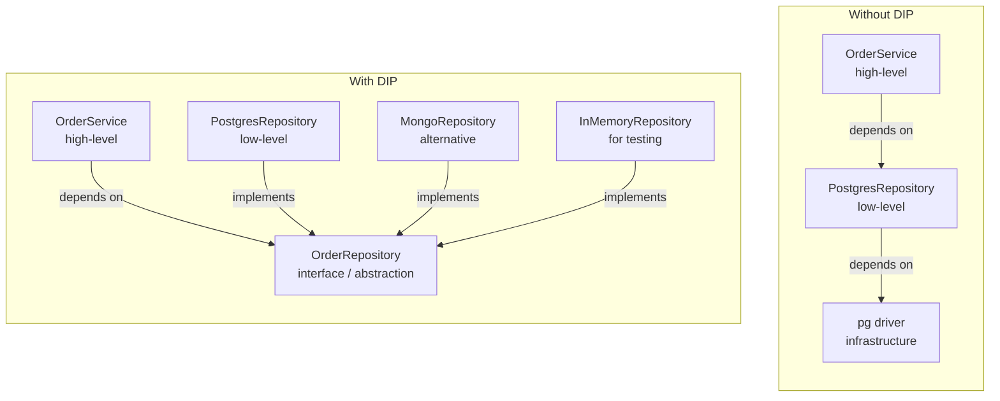
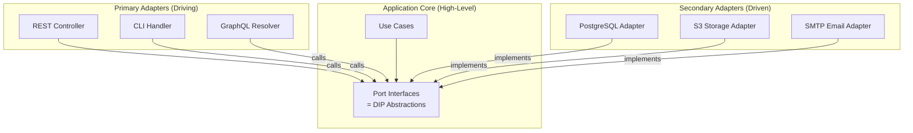

# Dependency Inversion Principle

## The Principle

> A. High-level modules should not depend on low-level modules. Both should depend on abstractions.
> B. Abstractions should not depend on details. Details should depend on abstractions.
> — Robert C. Martin, *The Dependency Inversion Principle* (1996)

DIP is the most architecturally significant of the SOLID principles. It is the mechanism that makes [Clean Architecture](/architecture-patterns/clean-architecture/), [Hexagonal Architecture](/architecture-patterns/hexagonal/), and ports-and-adapters possible. Without DIP, every high-level policy decision (business rules) is tightly coupled to low-level implementation details (databases, APIs, frameworks), making the system rigid and untestable.

## What "Inversion" Means

In a traditional layered architecture, dependencies flow **downward** — high-level modules depend on low-level modules:

```
Traditional direction:
  Controller → Service → Repository → Database Driver
```

DIP **inverts** this by inserting an abstraction that both sides depend on:

```
Inverted direction:
  Controller → Service → <<interface>> Repository ← PostgresRepository → Database
```

The service depends on the Repository **interface** (an abstraction). The PostgresRepository depends on the same interface (it implements it). The dependency arrow from the concrete implementation to the abstraction points **upward** — hence "inversion."



## DIP vs Dependency Injection

These are related but distinct concepts:

| Concept | What It Is | Level |
|---------|-----------|-------|
| **Dependency Inversion Principle** | A design principle — depend on abstractions, not concretions | Architecture |
| **Dependency Injection** | A technique — pass dependencies to a class rather than having it create them | Implementation |
| **IoC Container** | A tool — a framework that automates dependency injection | Infrastructure |

You can apply DIP without DI (by using factory methods or service locators). You can use DI without DIP (injecting concrete classes). But they work best together:

```typescript
// DIP + DI combined
interface NotificationSender {
  send(to: string, message: string): Promise<void>;
}

class OrderService {
  // DIP: depends on abstraction
  // DI: abstraction is injected, not created
  constructor(private notifier: NotificationSender) {}

  async placeOrder(order: Order): Promise<void> {
    await this.validateAndSave(order);
    await this.notifier.send(order.customerEmail, 'Order confirmed');
  }
}

// Different implementations injected in different contexts
const prodService = new OrderService(new SesEmailSender(sesClient));
const testService = new OrderService(new InMemoryNotifier());
const devService = new OrderService(new ConsoleNotifier());
```

## Implementation Patterns

### Pattern 1: Constructor Injection (TypeScript)

The most common and recommended DI pattern. Dependencies are declared in the constructor and provided at instantiation.

```typescript
// 1. Define the abstraction (port)
interface PaymentGateway {
  charge(customerId: string, amount: Money): Promise<ChargeResult>;
  refund(chargeId: string, amount: Money): Promise<RefundResult>;
}

interface OrderRepository {
  save(order: Order): Promise<void>;
  findById(id: OrderId): Promise<Order | null>;
}

interface EventPublisher {
  publish(event: DomainEvent): Promise<void>;
}

// 2. High-level module depends only on abstractions
class OrderService {
  constructor(
    private readonly payments: PaymentGateway,
    private readonly orders: OrderRepository,
    private readonly events: EventPublisher,
  ) {}

  async checkout(orderId: OrderId): Promise<CheckoutResult> {
    const order = await this.orders.findById(orderId);
    if (!order) throw new OrderNotFoundError(orderId);

    const charge = await this.payments.charge(
      order.customerId,
      order.total,
    );

    if (!charge.success) {
      return { success: false, reason: charge.declineReason };
    }

    order.markPaid(charge.id);
    await this.orders.save(order);
    await this.events.publish(new OrderPaidEvent(order));

    return { success: true, chargeId: charge.id };
  }
}

// 3. Low-level modules implement abstractions
class StripePaymentGateway implements PaymentGateway {
  constructor(private stripe: Stripe) {}

  async charge(customerId: string, amount: Money): Promise<ChargeResult> {
    const intent = await this.stripe.paymentIntents.create({
      amount: amount.cents,
      currency: amount.currency,
      customer: customerId,
    });
    return { success: intent.status === 'succeeded', id: intent.id };
  }

  async refund(chargeId: string, amount: Money): Promise<RefundResult> {
    const refund = await this.stripe.refunds.create({
      payment_intent: chargeId,
      amount: amount.cents,
    });
    return { success: refund.status === 'succeeded', id: refund.id };
  }
}

class PostgresOrderRepository implements OrderRepository {
  constructor(private pool: Pool) {}

  async save(order: Order): Promise<void> {
    await this.pool.query(
      'INSERT INTO orders (id, data) VALUES ($1, $2) ON CONFLICT (id) DO UPDATE SET data = $2',
      [order.id.value, order.toJSON()],
    );
  }

  async findById(id: OrderId): Promise<Order | null> {
    const result = await this.pool.query('SELECT data FROM orders WHERE id = $1', [id.value]);
    return result.rows[0] ? Order.fromJSON(result.rows[0].data) : null;
  }
}
```

### Pattern 2: Go's Accept Interfaces, Return Structs

Go's idiomatic DIP is elegant: functions accept interface parameters and return concrete types.

```go
// Define small interfaces where they are CONSUMED, not implemented
package order

// OrderStore is defined by the consumer, not the database package
type OrderStore interface {
    Save(ctx context.Context, order *Order) error
    FindByID(ctx context.Context, id string) (*Order, error)
}

type PaymentProcessor interface {
    Charge(ctx context.Context, amount int64, currency string) (*Charge, error)
}

type Service struct {
    store    OrderStore
    payments PaymentProcessor
}

func NewService(store OrderStore, payments PaymentProcessor) *Service {
    return &Service{store: store, payments: payments}
}

func (s *Service) Checkout(ctx context.Context, orderID string) error {
    order, err := s.store.FindByID(ctx, orderID)
    if err != nil {
        return fmt.Errorf("find order: %w", err)
    }

    charge, err := s.payments.Charge(ctx, order.Total, order.Currency)
    if err != nil {
        return fmt.Errorf("charge: %w", err)
    }

    order.MarkPaid(charge.ID)
    return s.store.Save(ctx, order)
}
```

```go
// Implementation in a separate package
package postgres

import "github.com/example/app/order"

type OrderRepository struct {
    db *sql.DB
}

// Implicitly satisfies order.OrderStore — no explicit declaration needed
func (r *OrderRepository) Save(ctx context.Context, o *order.Order) error {
    _, err := r.db.ExecContext(ctx,
        `INSERT INTO orders (id, total, currency, status) VALUES ($1, $2, $3, $4)
         ON CONFLICT (id) DO UPDATE SET total=$2, currency=$3, status=$4`,
        o.ID, o.Total, o.Currency, o.Status,
    )
    return err
}

func (r *OrderRepository) FindByID(ctx context.Context, id string) (*order.Order, error) {
    row := r.db.QueryRowContext(ctx, `SELECT id, total, currency, status FROM orders WHERE id = $1`, id)
    o := &order.Order{}
    err := row.Scan(&o.ID, &o.Total, &o.Currency, &o.Status)
    if errors.Is(err, sql.ErrNoRows) {
        return nil, order.ErrNotFound
    }
    return o, err
}
```

::: tip Key insight
In Go, the interface is defined in the **consumer's** package, not the **implementor's** package. This is the opposite of Java/C#, and it provides maximum decoupling — the implementation package does not even need to import the consumer package.
:::

### Pattern 3: Python with Protocols

```python
from typing import Protocol

class MessageBroker(Protocol):
    """Abstraction for message publishing"""
    async def publish(self, topic: str, message: dict) -> None: ...

class UserRepository(Protocol):
    """Abstraction for user persistence"""
    async def find_by_id(self, user_id: str) -> User | None: ...
    async def save(self, user: User) -> None: ...

# High-level module
class UserRegistrationService:
    def __init__(self, repo: UserRepository, broker: MessageBroker):
        self._repo = repo
        self._broker = broker

    async def register(self, email: str, name: str) -> User:
        user = User.create(email=email, name=name)
        await self._repo.save(user)
        await self._broker.publish("user.registered", user.to_event())
        return user

# Low-level implementations
class PostgresUserRepository:
    def __init__(self, pool: asyncpg.Pool):
        self._pool = pool

    async def find_by_id(self, user_id: str) -> User | None:
        row = await self._pool.fetchrow(
            "SELECT * FROM users WHERE id = $1", user_id
        )
        return User.from_row(row) if row else None

    async def save(self, user: User) -> None:
        await self._pool.execute(
            "INSERT INTO users (id, email, name) VALUES ($1, $2, $3)",
            user.id, user.email, user.name,
        )

class KafkaMessageBroker:
    def __init__(self, producer: AIOKafkaProducer):
        self._producer = producer

    async def publish(self, topic: str, message: dict) -> None:
        await self._producer.send(topic, json.dumps(message).encode())
```

### Pattern 4: Java with Spring DI

```java
// Abstraction
public interface NotificationService {
    void notify(String userId, Notification notification);
}

// High-level module
@Service
public class OrderFulfillmentService {

    private final OrderRepository orders;
    private final NotificationService notifications;

    // Spring injects implementations via constructor
    public OrderFulfillmentService(
            OrderRepository orders,
            NotificationService notifications) {
        this.orders = orders;
        this.notifications = notifications;
    }

    @Transactional
    public void fulfill(String orderId) {
        Order order = orders.findById(orderId)
            .orElseThrow(() -> new OrderNotFoundException(orderId));

        order.fulfill();
        orders.save(order);

        notifications.notify(
            order.getCustomerId(),
            Notification.orderShipped(order)
        );
    }
}

// Low-level implementation — can be swapped via configuration
@Service
@ConditionalOnProperty(name = "notifications.provider", havingValue = "email")
public class EmailNotificationService implements NotificationService {
    private final JavaMailSender mailer;

    public EmailNotificationService(JavaMailSender mailer) {
        this.mailer = mailer;
    }

    @Override
    public void notify(String userId, Notification notification) {
        // ... send email
    }
}

@Service
@ConditionalOnProperty(name = "notifications.provider", havingValue = "push")
public class PushNotificationService implements NotificationService {
    // ... send push notification
}
```

## DIP and the Ports & Adapters Connection

DIP is the principle; [Hexagonal Architecture](/architecture-patterns/hexagonal/) (Ports & Adapters) is the pattern that applies it at the system level:



- **Ports** are the abstractions (interfaces) that DIP prescribes
- **Adapters** are the details (implementations) that depend on those abstractions
- The **application core** (use cases + entities) never references any adapter

This maps directly to [Clean Architecture](/architecture-patterns/clean-architecture/)'s Dependency Rule: inner rings define interfaces, outer rings implement them.

## Testing Benefits

DIP's greatest practical impact is on testability. When every dependency is an abstraction, you can substitute test doubles effortlessly:

```typescript
describe('OrderService', () => {
  let service: OrderService;
  let mockPayments: PaymentGateway;
  let mockOrders: OrderRepository;
  let mockEvents: EventPublisher;

  beforeEach(() => {
    mockPayments = {
      charge: vi.fn().mockResolvedValue({ success: true, id: 'ch_123' }),
      refund: vi.fn(),
    };
    mockOrders = {
      save: vi.fn().mockResolvedValue(undefined),
      findById: vi.fn().mockResolvedValue(
        Order.create({ customerId: 'cust_1', total: Money.usd(5000) })
      ),
    };
    mockEvents = { publish: vi.fn().mockResolvedValue(undefined) };

    service = new OrderService(mockPayments, mockOrders, mockEvents);
  });

  it('charges the customer and publishes an event', async () => {
    const result = await service.checkout(OrderId.from('ord_1'));

    expect(result.success).toBe(true);
    expect(mockPayments.charge).toHaveBeenCalledWith('cust_1', Money.usd(5000));
    expect(mockEvents.publish).toHaveBeenCalledWith(
      expect.objectContaining({ type: 'OrderPaid' })
    );
  });

  it('does not save order when payment fails', async () => {
    mockPayments.charge = vi.fn().mockResolvedValue({
      success: false,
      declineReason: 'insufficient_funds',
    });

    const result = await service.checkout(OrderId.from('ord_1'));

    expect(result.success).toBe(false);
    expect(mockOrders.save).not.toHaveBeenCalled();
    expect(mockEvents.publish).not.toHaveBeenCalled();
  });
});
```

Without DIP, testing `OrderService` would require a running PostgreSQL database, a Stripe test account, and a message broker — turning unit tests into slow, flaky integration tests.

## Wiring It All Together (Composition Root)

The **Composition Root** is the single place in the application where all dependencies are wired together. It lives at the outermost layer — typically the application's entry point:

```typescript
// src/main.ts — the Composition Root
import { Pool } from 'pg';
import Stripe from 'stripe';

async function main() {
  // Infrastructure
  const pool = new Pool({ connectionString: process.env.DATABASE_URL });
  const stripe = new Stripe(process.env.STRIPE_KEY!);
  const kafka = new Kafka({ brokers: [process.env.KAFKA_BROKER!] });

  // Build the dependency graph (low-level implementations)
  const orderRepo = new PostgresOrderRepository(pool);
  const paymentGateway = new StripePaymentGateway(stripe);
  const eventPublisher = new KafkaEventPublisher(kafka);

  // Wire high-level modules
  const orderService = new OrderService(paymentGateway, orderRepo, eventPublisher);

  // Wire controllers
  const orderController = new OrderController(orderService);

  // Start the server
  const app = createApp(orderController);
  app.listen(3000);
}
```

::: warning
The Composition Root is the **only place** that knows about concrete implementations. If you find concrete class names leaking into business logic modules, you have a DIP violation.
:::

## Common Mistakes

### 1. Abstracting Everything

Not every dependency needs an interface. DIP is for dependencies that **cross architectural boundaries** — persistence, external APIs, infrastructure services. Pure utility functions, value objects, and in-process calculations rarely benefit from abstraction.

### 2. Leaking Implementation Details Through Abstractions

```typescript
// BAD: abstraction leaks SQL concepts
interface UserRepository {
  findByQuery(sql: string, params: unknown[]): Promise<User[]>; // SQL leaked!
}

// GOOD: abstraction uses domain language
interface UserRepository {
  findByEmail(email: string): Promise<User | null>;
  findActive(): Promise<User[]>;
}
```

### 3. Depending on the DI Container

```typescript
// BAD: business logic depends on the container
class OrderService {
  constructor(private container: DIContainer) {}

  async checkout(orderId: string): Promise<void> {
    const repo = this.container.resolve<OrderRepository>('OrderRepository');
    // Service Locator anti-pattern — hides real dependencies
  }
}
```

The Service Locator hides the dependency graph, making it impossible to know what a class needs without reading its implementation.

## Further Reading

- [SOLID Principles Overview](./) — all five principles in context
- [Interface Segregation Principle](./interface-segregation) — ISP produces the focused abstractions DIP depends on
- [Clean Architecture](/architecture-patterns/clean-architecture/) — DIP as the Dependency Rule
- [Hexagonal Architecture](/architecture-patterns/hexagonal/) — ports and adapters as DIP at the system level
- [Domain-Driven Design](/architecture-patterns/domain-driven-design/) — repositories and domain services as DIP applications
