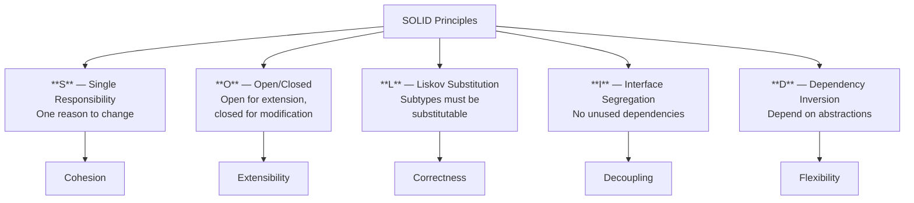
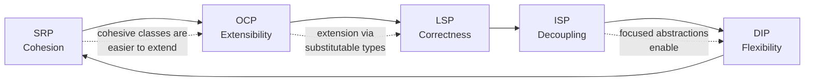

# SOLID Principles

## Why SOLID Matters

Every codebase tells the same story eventually. What started as a clean, simple application becomes a tangled web of dependencies where fixing one bug introduces two more, adding a feature requires modifying fifteen files, and nobody dares refactor because the test suite is either nonexistent or so coupled to implementation details that any change breaks it.

SOLID is the antidote. These five principles, introduced by Robert C. Martin ("Uncle Bob") across papers and talks from the late 1990s to early 2000s, and later codified in his 2003 book *Agile Software Development: Principles, Patterns, and Practices*, provide a systematic framework for building software that **survives contact with reality** — changing requirements, growing teams, and evolving infrastructure.

SOLID is not about writing "perfect" code. It is about writing code where the **cost of change stays low over time**. In a SOLID codebase, most changes are additive (you add new code) rather than invasive (you modify existing code). That distinction is the difference between a team that ships features confidently and a team that is terrified of its own codebase.

### Uncle Bob's Legacy

Robert C. Martin did not invent these principles in isolation. He synthesized decades of research:

| Principle | Origin | Key Contributor |
|-----------|--------|----------------|
| Single Responsibility | Parnas (1972) — information hiding and module decomposition | David Parnas, Robert C. Martin |
| Open/Closed | Meyer (1988) — *Object-Oriented Software Construction* | Bertrand Meyer, Robert C. Martin |
| Liskov Substitution | Liskov (1987) — data abstraction and hierarchy | Barbara Liskov, Jeannette Wing |
| Interface Segregation | Martin (1996) — Xerox consulting engagement | Robert C. Martin |
| Dependency Inversion | Martin (1996) — *The Dependency Inversion Principle* paper | Robert C. Martin |

Martin's contribution was the **unification** — recognizing that these five ideas, taken together, form a coherent design philosophy that addresses the root causes of software rot: rigidity, fragility, immobility, and viscosity.

## The Five Principles at a Glance



### S — Single Responsibility Principle (SRP)

> A class should have only one reason to change.

A module should be responsible to one, and only one, actor. When a class serves multiple stakeholders, changes requested by one stakeholder risk breaking functionality that another stakeholder depends on. SRP forces you to decompose your code along the axes of change.

```typescript
// Violation: UserService handles authentication, profile updates, AND email
class UserService {
  authenticate(email: string, password: string): Token { /* ... */ }
  updateProfile(userId: string, data: ProfileData): void { /* ... */ }
  sendWelcomeEmail(userId: string): void { /* ... */ }
}

// SRP applied: each class has one reason to change
class AuthenticationService {
  authenticate(email: string, password: string): Token { /* ... */ }
}
class ProfileService {
  updateProfile(userId: string, data: ProfileData): void { /* ... */ }
}
class EmailService {
  sendWelcomeEmail(userId: string): void { /* ... */ }
}
```

**Deep dive:** [Single Responsibility Principle](./single-responsibility)

### O — Open/Closed Principle (OCP)

> Software entities should be open for extension but closed for modification.

You should be able to add new behavior to a system without changing existing code. This is typically achieved through polymorphism — defining abstractions that new implementations can plug into.

```typescript
// Closed for modification, open for extension
interface PaymentProcessor {
  charge(amount: Money): Promise<PaymentResult>;
}

class StripeProcessor implements PaymentProcessor {
  async charge(amount: Money): Promise<PaymentResult> { /* ... */ }
}

// Adding PayPal doesn't require changing any existing code
class PayPalProcessor implements PaymentProcessor {
  async charge(amount: Money): Promise<PaymentResult> { /* ... */ }
}
```

**Deep dive:** [Open/Closed Principle](./open-closed)

### L — Liskov Substitution Principle (LSP)

> Subtypes must be substitutable for their base types without altering the correctness of the program.

If your code works with a base class, it must continue to work correctly with any derived class. This means subclasses cannot strengthen preconditions, weaken postconditions, or violate invariants established by the parent.

```typescript
// Classic violation: Square is not a valid substitute for Rectangle
class Rectangle {
  constructor(protected width: number, protected height: number) {}
  setWidth(w: number): void { this.width = w; }
  setHeight(h: number): void { this.height = h; }
  area(): number { return this.width * this.height; }
}

class Square extends Rectangle {
  setWidth(w: number): void { this.width = w; this.height = w; } // Violates LSP
  setHeight(h: number): void { this.width = h; this.height = h; } // Violates LSP
}
```

**Deep dive:** [Liskov Substitution Principle](./liskov-substitution)

### I — Interface Segregation Principle (ISP)

> No client should be forced to depend on methods it does not use.

Fat interfaces force implementors to provide methods they do not need and force consumers to depend on methods they never call. Split large interfaces into focused, role-specific ones.

```typescript
// Fat interface — forces every implementor to handle all methods
interface Worker {
  work(): void;
  eat(): void;
  sleep(): void;
}

// Segregated — each client depends only on what it needs
interface Workable { work(): void; }
interface Feedable { eat(): void; }
interface Restable { sleep(): void; }
```

**Deep dive:** [Interface Segregation Principle](./interface-segregation)

### D — Dependency Inversion Principle (DIP)

> High-level modules should not depend on low-level modules. Both should depend on abstractions.

The most architecturally significant of the five principles. DIP inverts the traditional dependency direction so that policy (business logic) does not depend on mechanism (infrastructure). This is the foundation of [Clean Architecture](/architecture-patterns/clean-architecture/), [Hexagonal Architecture](/architecture-patterns/hexagonal/), and ports-and-adapters patterns.

```typescript
// Violation: high-level OrderService depends on low-level PostgresRepository
class OrderService {
  constructor(private repo: PostgresRepository) {} // Concrete dependency
}

// DIP applied: both depend on an abstraction
interface OrderRepository {
  save(order: Order): Promise<void>;
  findById(id: OrderId): Promise<Order | null>;
}

class OrderService {
  constructor(private repo: OrderRepository) {} // Abstraction dependency
}

class PostgresOrderRepository implements OrderRepository { /* ... */ }
class MongoOrderRepository implements OrderRepository { /* ... */ }
```

**Deep dive:** [Dependency Inversion Principle](./dependency-inversion)

## How the Principles Interrelate

SOLID principles are not independent — they reinforce each other in a coherent system:



- **SRP enables OCP**: When classes have a single responsibility, extending them (or composing them) is straightforward because you know exactly what each class does.
- **OCP relies on LSP**: The Strategy and Template Method patterns that implement OCP only work if substituted types behave correctly.
- **LSP demands ISP**: The more focused your interfaces, the easier it is to create correct substitutions — fewer contracts to satisfy.
- **ISP supports DIP**: Small, role-specific interfaces are the abstractions that DIP depends on. Fat interfaces make DIP impractical.
- **DIP reinforces SRP**: When you inject dependencies through abstractions, classes naturally become more focused because they no longer create or manage their own dependencies.

## SOLID in Different Paradigms

SOLID was conceived in the context of object-oriented programming, but the underlying ideas transcend OOP.

| SOLID Principle | OOP Expression | Functional Expression | Go Expression |
|----------------|---------------|----------------------|---------------|
| SRP | One class, one responsibility | One function, one transformation | One package, one concern |
| OCP | Interfaces + polymorphism | Higher-order functions, function composition | Interfaces (implicit) |
| LSP | Subtypes honor contracts | Functions with same signature behave consistently | Interface satisfaction |
| ISP | Small interfaces | Specific function types | Small interfaces (1-2 methods) |
| DIP | Constructor injection | Function parameters, reader monad | Accept interfaces, return structs |

::: tip Go's Natural SOLID Alignment
Go's design philosophy naturally encourages SOLID without the ceremony. Interfaces are implicit (any type satisfying the method set implements the interface), which makes ISP and DIP nearly effortless. The community idiom "accept interfaces, return structs" is DIP expressed in four words.
:::

## Common Anti-Patterns

### 1. SOLID Extremism

Applying every principle to every class at maximum intensity leads to an explosion of tiny interfaces, adapter classes, and indirection layers that make the code harder to follow than the original monolith.

::: warning
SOLID is a set of guidelines, not laws. A 10-line utility function does not need dependency injection, an interface, and a factory. Apply SOLID where the cost of change is high — domain logic, integration boundaries, and hot paths that evolve frequently.
:::

### 2. Interface Soup

Creating an interface for every class, even when there is only one implementation, is not ISP — it is ceremony. Create interfaces when you have (or anticipate) multiple implementations, or when you need to mock for testing.

### 3. Premature Abstraction

DIP does not mean "abstract everything on day one." It means "when you notice a dependency that causes pain, invert it." The best abstractions emerge from refactoring, not from speculative design.

## When to Invest in SOLID

| Situation | SOLID Investment | Reason |
|-----------|-----------------|--------|
| Greenfield product with uncertain requirements | High | Requirements will change; SOLID keeps change cheap |
| Legacy codebase with no tests | Gradual | Apply SOLID to new code and during refactoring |
| Script or one-off automation | Low | Throwaway code does not need long-term maintainability |
| Library or SDK consumed by external teams | Very High | Breaking changes are expensive; SOLID provides stable contracts |
| Performance-critical inner loop | Low | Indirection has a cost; tight code beats clean code at the nanosecond level |

## Further Reading

- [Single Responsibility Principle](./single-responsibility) — deep dive with before/after refactoring
- [Open/Closed Principle](./open-closed) — strategy pattern, plugin architecture
- [Liskov Substitution Principle](./liskov-substitution) — the Rectangle/Square problem and contract violations
- [Interface Segregation Principle](./interface-segregation) — fat vs lean interfaces
- [Dependency Inversion Principle](./dependency-inversion) — abstraction layers and port/adapter connections
- [Clean Architecture](/architecture-patterns/clean-architecture/) — SOLID applied at the architectural level
- [Design Patterns](/architecture-patterns/design-patterns/) — the implementation toolkit for SOLID designs
- [Hexagonal Architecture](/architecture-patterns/hexagonal/) — ports and adapters as DIP at scale
