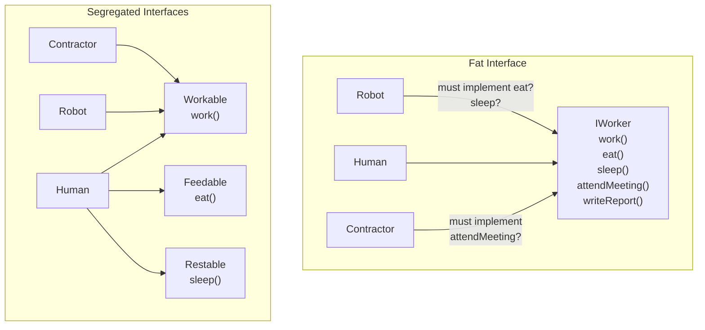
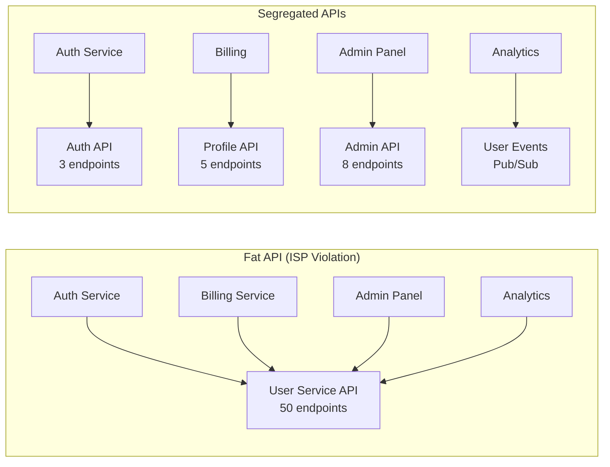

# Interface Segregation Principle

## The Principle

> No client should be forced to depend on methods it does not use.
> — Robert C. Martin, *The Interface Segregation Principle* (1996)

ISP emerged from a real consulting engagement. In the mid-1990s, Martin was working on a printing system at Xerox. The system had a single `Job` class used by everything — stapling, printing, faxing, scanning. When the stapling subsystem needed a change, the entire system had to be recompiled and redeployed because every component depended on the monolithic `Job` interface.

The fix was simple: split `Job` into focused interfaces — `Printable`, `Stapleable`, `Faxable` — so that each client only depended on the methods it actually called. This reduced the blast radius of changes and decoupled the build.

## Why ISP Matters

Fat interfaces create three concrete problems:

### 1. Forced Implementation

When you implement a fat interface, you must provide bodies for methods you do not need. This leads to empty methods, `throw new NotImplementedError()`, or dangerous no-ops that silently swallow calls.

### 2. Unnecessary Recompilation

In compiled languages, when a fat interface changes, every implementor must be recompiled — even if the change is irrelevant to most of them.

### 3. Cognitive Overhead

A consumer looking at a 20-method interface cannot quickly determine which methods are relevant. Lean interfaces document their purpose through their shape.



## Fat Interface Anti-Pattern

### The Monolithic Repository

One of the most common ISP violations in enterprise applications is the "God Repository":

```typescript
// FAT INTERFACE: every consumer depends on all 15 methods
interface UserRepository {
  // Read operations
  findById(id: string): Promise<User | null>;
  findByEmail(email: string): Promise<User | null>;
  findAll(page: number, size: number): Promise<PaginatedResult<User>>;
  search(query: string): Promise<User[]>;
  count(): Promise<number>;

  // Write operations
  save(user: User): Promise<void>;
  update(id: string, data: Partial<User>): Promise<void>;
  delete(id: string): Promise<void>;
  bulkInsert(users: User[]): Promise<void>;

  // Specialized queries
  findByRole(role: Role): Promise<User[]>;
  findInactive(since: Date): Promise<User[]>;
  findWithExpiredPasswords(): Promise<User[]>;

  // Admin operations
  lockAccount(id: string): Promise<void>;
  resetPassword(id: string, hash: string): Promise<void>;
  exportAll(format: ExportFormat): Promise<Buffer>;
}
```

::: danger Problems
- The login handler needs `findByEmail` but must depend on `exportAll`
- The admin dashboard needs `findAll` but must depend on `resetPassword`
- A read-only analytics service depends on write methods it must never call
- Adding `findByDepartment` forces recompilation of everything
:::

### The Fix: Role-Based Interfaces

```typescript
// Segregated by client need

interface UserReader {
  findById(id: string): Promise<User | null>;
  findByEmail(email: string): Promise<User | null>;
}

interface UserSearcher {
  findAll(page: number, size: number): Promise<PaginatedResult<User>>;
  search(query: string): Promise<User[]>;
  count(): Promise<number>;
}

interface UserWriter {
  save(user: User): Promise<void>;
  update(id: string, data: Partial<User>): Promise<void>;
  delete(id: string): Promise<void>;
}

interface UserBulkOperations {
  bulkInsert(users: User[]): Promise<void>;
  exportAll(format: ExportFormat): Promise<Buffer>;
}

interface UserAdminOperations {
  lockAccount(id: string): Promise<void>;
  resetPassword(id: string, hash: string): Promise<void>;
}

// The implementation can satisfy all interfaces
class PostgresUserRepository implements
  UserReader, UserSearcher, UserWriter, UserBulkOperations, UserAdminOperations {
  // ... all methods implemented
}

// But consumers only depend on what they need
class LoginService {
  constructor(private users: UserReader) {} // Only 2 methods
}

class AdminDashboard {
  constructor(
    private users: UserSearcher,
    private admin: UserAdminOperations,
  ) {} // Only 7 methods
}

class AnalyticsService {
  constructor(private users: UserSearcher) {} // Read-only, 3 methods
}
```

## Implementation Strategies

### Strategy 1: Multiple Small Interfaces (TypeScript)

TypeScript's structural type system makes ISP effortless — you do not even need explicit `implements`:

```typescript
// Define focused interfaces
interface Readable {
  read(path: string): Promise<Buffer>;
}

interface Writable {
  write(path: string, data: Buffer): Promise<void>;
}

interface Deletable {
  delete(path: string): Promise<void>;
}

// Full implementation
class FileStorage implements Readable, Writable, Deletable {
  async read(path: string): Promise<Buffer> { /* ... */ }
  async write(path: string, data: Buffer): Promise<void> { /* ... */ }
  async delete(path: string): Promise<void> { /* ... */ }
}

// Read-only consumer — doesn't know about write or delete
class ReportGenerator {
  constructor(private storage: Readable) {}

  async generate(reportId: string): Promise<Buffer> {
    const template = await this.storage.read(`templates/${reportId}.html`);
    return this.render(template);
  }
}

// Cleanup service — doesn't know about read
class TempFileCleaner {
  constructor(private storage: Deletable) {}

  async cleanup(files: string[]): Promise<void> {
    await Promise.all(files.map(f => this.storage.delete(f)));
  }
}
```

### Strategy 2: Go's Natural ISP

Go's implicit interface satisfaction and cultural convention of tiny interfaces make ISP the default:

```go
// Go standard library: io package has single-method interfaces
type Reader interface {
    Read(p []byte) (n int, err error)
}

type Writer interface {
    Write(p []byte) (n int, err error)
}

type Closer interface {
    Close() error
}

// Compose when needed
type ReadWriter interface {
    Reader
    Writer
}

type ReadWriteCloser interface {
    Reader
    Writer
    Closer
}

// Consumer asks for minimum capability
func countLines(r io.Reader) (int, error) {
    scanner := bufio.NewScanner(r)
    count := 0
    for scanner.Scan() {
        count++
    }
    return count, scanner.Err()
}
// Works with: *os.File, *bytes.Buffer, *http.Response.Body,
// net.Conn, *strings.Reader, *gzip.Reader, ...
```

::: tip Go proverb
"The bigger the interface, the weaker the abstraction." — Rob Pike

Go interfaces are typically 1-2 methods. The standard library's most powerful interfaces (`io.Reader`, `io.Writer`, `fmt.Stringer`, `error`) each have exactly one method.
:::

### Strategy 3: Java Interface Composition

```java
// Segregated interfaces
public interface Identifiable<ID> {
    ID getId();
}

public interface Auditable {
    Instant getCreatedAt();
    Instant getUpdatedAt();
    String getCreatedBy();
}

public interface SoftDeletable {
    boolean isDeleted();
    void markDeleted();
    Instant getDeletedAt();
}

// Entity composes only what it needs
public class Product implements Identifiable<UUID>, Auditable {
    private UUID id;
    private Instant createdAt;
    private Instant updatedAt;
    private String createdBy;

    // ... implementations
}

public class User implements Identifiable<UUID>, Auditable, SoftDeletable {
    // Users can be soft-deleted; Products cannot
    // ... implementations
}

// Repository uses specific interfaces
public interface SoftDeleteRepository<T extends SoftDeletable & Identifiable<ID>, ID> {
    void softDelete(ID id);
    List<T> findAllActive();
}
```

### Strategy 4: Python Protocols (Duck Typing ISP)

```python
from typing import Protocol, runtime_checkable

@runtime_checkable
class Renderable(Protocol):
    def render(self) -> str: ...

@runtime_checkable
class Serializable(Protocol):
    def to_dict(self) -> dict: ...

@runtime_checkable
class Cacheable(Protocol):
    def cache_key(self) -> str: ...
    def ttl_seconds(self) -> int: ...

# Class satisfies only the protocols it needs
class UserProfile:
    def __init__(self, user_id: str, name: str):
        self.user_id = user_id
        self.name = name

    def render(self) -> str:
        return f"<div class='profile'>{self.name}</div>"

    def to_dict(self) -> dict:
        return {"user_id": self.user_id, "name": self.name}

    def cache_key(self) -> str:
        return f"profile:{self.user_id}"

    def ttl_seconds(self) -> int:
        return 300

# Consumer depends only on what it needs
def render_page(components: list[Renderable]) -> str:
    return "\n".join(c.render() for c in components)

def cache_objects(store: CacheStore, objects: list[Cacheable]) -> None:
    for obj in objects:
        store.set(obj.cache_key(), obj, ttl=obj.ttl_seconds())
```

## ISP and Microservices

ISP extends beyond class design to API design. A microservice API is an interface consumed by other services:



### BFF Pattern (Backend for Frontend)

The Backend for Frontend pattern is ISP applied to API consumers. Instead of one API serving web, mobile, and third-party clients, each client gets a tailored API surface:

| Consumer | Needs | BFF Surface |
|----------|-------|-------------|
| Web app | Full user profile, settings, history | `/web/users/{id}` — rich JSON |
| Mobile app | Compact profile, offline sync | `/mobile/users/{id}` — minimal JSON |
| Partner API | Limited user data per contract | `/partner/users/{id}` — restricted fields |

## Common Mistakes

### 1. Interface per Method (Over-Segregation)

```typescript
// TOO GRANULAR — cognitive overhead exceeds coupling reduction
interface HasId { id: string; }
interface HasName { name: string; }
interface HasEmail { email: string; }
interface HasCreatedAt { createdAt: Date; }
// ... 20 more single-property interfaces
```

::: warning
ISP is about **role-based** segregation, not method-level granularity. Group methods by the **actor** or **use case** that needs them, not by individual method.
:::

### 2. Marker Interfaces with No Methods

```java
// WRONG: empty marker interfaces don't provide behavioral contracts
public interface Cacheable {} // No methods — what does this even mean?

// BETTER: define the caching contract
public interface Cacheable {
    String cacheKey();
    Duration ttl();
}
```

### 3. Not Segregating When You Should

The signal to segregate is **pain**: when implementors throw `NotImplementedError`, when tests require mocking unused methods, or when a change to one method forces redeployment of unrelated consumers.

## ISP Metrics

| Metric | What It Measures | Target |
|--------|-----------------|--------|
| Interface methods | Number of methods per interface | 1-5 methods |
| Implementation coverage | Percentage of methods actually used by each consumer | > 80% |
| Dead method ratio | Methods implemented but never called by any consumer | 0% |
| Recompilation scope | Number of modules affected by an interface change | Minimize |

## Relationship to Other Principles

- **SRP + ISP**: [SRP](./single-responsibility) says a class should serve one actor; ISP says an interface should expose only what one role needs. They are the same idea at different abstraction levels.
- **LSP + ISP**: Smaller interfaces make [LSP](./liskov-substitution) compliance easier — fewer methods mean fewer contracts to satisfy correctly.
- **DIP + ISP**: [DIP](./dependency-inversion) says depend on abstractions; ISP says make those abstractions small and focused. Together they produce the lean, stable interfaces that high-level modules depend on.

## Further Reading

- [SOLID Principles Overview](./) — all five principles in context
- [Dependency Inversion Principle](./dependency-inversion) — ISP produces the focused abstractions DIP needs
- [Liskov Substitution Principle](./liskov-substitution) — small interfaces make correct substitution easier
- [Hexagonal Architecture](/architecture-patterns/hexagonal/) — ports are ISP-compliant interfaces by design
- [Design Patterns](/architecture-patterns/design-patterns/) — Adapter and Facade patterns manage interface boundaries
