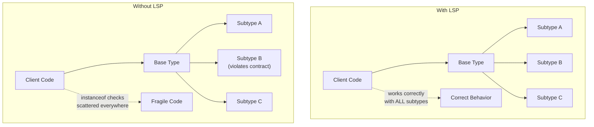
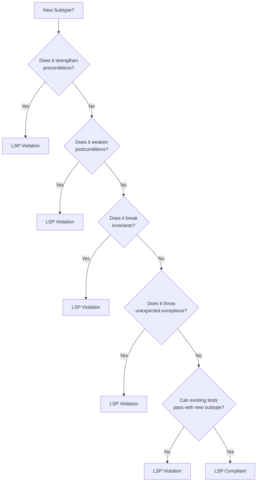

# Liskov Substitution Principle

## The Principle

> Let $\phi(x)$ be a property provable about objects $x$ of type $T$. Then $\phi(y)$ should be true for objects $y$ of type $S$ where $S$ is a subtype of $T$.
> — Barbara Liskov & Jeannette Wing, *A Behavioral Notion of Subtyping* (1994)

In plain English:

> If your code works correctly with a base type, it must continue to work correctly with any subtype. No surprises, no special cases, no "except when."

LSP is about **behavioral compatibility**. It is not enough for a subclass to compile — it must **behave** in a way that does not violate the expectations established by the base type.

## Why LSP Matters

Without LSP, polymorphism breaks. Every piece of code that uses a base type would need to check which concrete subtype it actually received and handle each case differently — defeating the entire purpose of abstraction.



When LSP is violated, the code devolves into a web of `instanceof` checks — a sure sign that the abstraction is broken.

## The Contract Model

LSP can be formalized through **Design by Contract** (Bertrand Meyer). Every method has:

- **Preconditions**: What must be true before the method is called
- **Postconditions**: What is guaranteed to be true after the method returns
- **Invariants**: What is always true about the object's state

### The Rules

| Rule | Description | Violation Example |
|------|-------------|-------------------|
| **Preconditions cannot be strengthened** | A subtype cannot require more from callers than the base type | Base accepts any string; subtype requires non-empty string |
| **Postconditions cannot be weakened** | A subtype must guarantee at least as much as the base type | Base guarantees sorted output; subtype returns unsorted |
| **Invariants must be preserved** | A subtype must maintain all invariants of the base type | Base guarantees balance >= 0; subtype allows negative balance |
| **History constraint** | A subtype cannot introduce state changes the base type would not allow | Base is immutable; subtype adds a mutating method |

## The Rectangle/Square Problem

This is the most famous LSP violation, and understanding it deeply reveals why LSP is subtle.

### The Setup

Mathematically, a square "is a" rectangle. So it seems natural to make `Square` extend `Rectangle`:

```typescript
class Rectangle {
  constructor(protected width: number, protected height: number) {}

  setWidth(w: number): void {
    this.width = w;
  }

  setHeight(h: number): void {
    this.height = h;
  }

  area(): number {
    return this.width * this.height;
  }
}

class Square extends Rectangle {
  constructor(side: number) {
    super(side, side);
  }

  // Must keep width === height to maintain the square invariant
  setWidth(w: number): void {
    this.width = w;
    this.height = w; // Side effect!
  }

  setHeight(h: number): void {
    this.width = h; // Side effect!
    this.height = h;
  }
}
```

### The Violation

Any code that works with `Rectangle` assumes that `setWidth` and `setHeight` are independent operations:

```typescript
function testRectangleArea(rect: Rectangle): void {
  rect.setWidth(5);
  rect.setHeight(4);
  // For a rectangle, the area should be 5 * 4 = 20
  console.assert(rect.area() === 20, `Expected 20, got ${rect.area()}`);
}

const rect = new Rectangle(10, 10);
testRectangleArea(rect); // Passes: area = 20

const square = new Square(10);
testRectangleArea(square); // FAILS: area = 16 (setHeight changed width to 4)
```

::: danger Why this breaks LSP
`Square.setWidth()` has a **side effect** that `Rectangle.setWidth()` does not — it also changes the height. This **strengthens the postcondition** (after `setWidth(w)`, not only does `width === w`, but also `height === w`), and it **violates the implicit postcondition** of `Rectangle.setWidth()` that `height` remains unchanged.
:::

### The Fix

The problem is not that "Square is not a Rectangle." The problem is that **mutable Square is not a behavioral subtype of mutable Rectangle**. Solutions:

**Solution 1: Immutable value objects**

```typescript
class Rectangle {
  constructor(readonly width: number, readonly height: number) {}
  area(): number { return this.width * this.height; }
  withWidth(w: number): Rectangle { return new Rectangle(w, this.height); }
  withHeight(h: number): Rectangle { return new Rectangle(this.width, h); }
}

class Square extends Rectangle {
  constructor(side: number) { super(side, side); }
  // No setters to violate — immutability eliminates the problem
}
```

**Solution 2: Separate type hierarchy**

```typescript
interface Shape {
  area(): number;
}

class Rectangle implements Shape {
  constructor(private width: number, private height: number) {}
  area(): number { return this.width * this.height; }
}

class Square implements Shape {
  constructor(private side: number) {}
  area(): number { return this.side * this.side; }
}
// Rectangle and Square are siblings, not parent-child
```

## Real-World LSP Violations

### Violation 1: Collections That Throw on Mutation

```java
// Java's Collections.unmodifiableList() returns a List that throws on add()
List<String> mutable = new ArrayList<>(Arrays.asList("a", "b"));
List<String> immutable = Collections.unmodifiableList(mutable);

// Client code expects List.add() to work — it always has
immutable.add("c"); // Throws UnsupportedOperationException!
```

This is an LSP violation in Java's standard library. The `List` interface promises `add()`, but `UnmodifiableList` throws at runtime. A compile-time solution would use separate `ReadableList` and `MutableList` types (which Kotlin does with `List` vs `MutableList`).

### Violation 2: Fragile Bird Hierarchy

```python
class Bird:
    def fly(self) -> None:
        print("Flying!")

    def eat(self) -> None:
        print("Eating!")

class Penguin(Bird):
    def fly(self) -> None:
        raise NotImplementedError("Penguins can't fly!")  # LSP violation
```

```python
# Fix: separate the contracts
from abc import ABC, abstractmethod

class Bird(ABC):
    @abstractmethod
    def eat(self) -> None: ...

class FlyingBird(Bird):
    @abstractmethod
    def fly(self) -> None: ...

class Penguin(Bird):
    def eat(self) -> None:
        print("Eating fish!")

class Eagle(FlyingBird):
    def eat(self) -> None:
        print("Eating prey!")

    def fly(self) -> None:
        print("Soaring!")
```

### Violation 3: Async Substitution Failures

```typescript
// Base class returns synchronously
class ConfigProvider {
  getConfig(key: string): Config {
    return this.defaults[key];
  }
}

// Subclass needs async (network call) — violates the contract
class RemoteConfigProvider extends ConfigProvider {
  getConfig(key: string): Config {
    // Can't make this async without changing the return type!
    // Developers resort to hacks like synchronous HTTP (blocking the event loop)
    return syncHttpGet(`/config/${key}`); // Terrible workaround
  }
}
```

::: tip Fix: design for the most general case from the start
```typescript
interface ConfigProvider {
  getConfig(key: string): Promise<Config>;
}

class LocalConfigProvider implements ConfigProvider {
  async getConfig(key: string): Promise<Config> {
    return this.defaults[key]; // Trivially async
  }
}

class RemoteConfigProvider implements ConfigProvider {
  async getConfig(key: string): Promise<Config> {
    return fetch(`/config/${key}`).then(r => r.json());
  }
}
```
:::

### Violation 4: Go Interface Satisfaction Gotcha

```go
// Base interface
type Writer interface {
    Write(data []byte) (int, error)
}

// FileWriter writes all bytes or returns an error
type FileWriter struct{ file *os.File }

func (fw *FileWriter) Write(data []byte) (int, error) {
    return fw.file.Write(data) // May write partial data!
}

// Client code assumes Write writes everything
func saveReport(w Writer, report []byte) error {
    n, err := w.Write(report)
    if err != nil {
        return err
    }
    if n != len(report) {
        // This check is necessary because Write's contract
        // in io.Writer allows partial writes — but most callers
        // forget this.
        return fmt.Errorf("short write: %d of %d bytes", n, len(report))
    }
    return nil
}
```

## LSP Verification Checklist

Use this checklist when reviewing inheritance or interface implementations:



### The Substitution Test

The most practical test for LSP compliance:

1. Take every unit test written for the base type
2. Replace the base type instance with the subtype instance
3. Every test should still pass without modification

If any test fails, you have an LSP violation. This is not just a thought experiment — you can automate it:

```typescript
// Parameterized test for LSP compliance
describe.each([
  ['LinkedList', () => new LinkedList<number>()],
  ['ArrayList', () => new ArrayList<number>()],
  ['CircularBuffer', () => new CircularBuffer<number>(100)],
])('%s satisfies List contract', (name, factory) => {
  let list: List<number>;

  beforeEach(() => { list = factory(); });

  test('add increases size', () => {
    list.add(42);
    expect(list.size()).toBe(1);
  });

  test('get returns added element', () => {
    list.add(42);
    expect(list.get(0)).toBe(42);
  });

  test('remove decreases size', () => {
    list.add(42);
    list.remove(0);
    expect(list.size()).toBe(0);
  });
});
```

## LSP and Type Systems

### Covariance and Contravariance

LSP has deep connections to type theory through variance:

| Variance | Definition | LSP Connection |
|----------|-----------|----------------|
| **Covariant** | Subtype relationship preserved (e.g., return types) | Return types can be more specific in subtypes |
| **Contravariant** | Subtype relationship reversed (e.g., parameter types) | Parameter types can be more general in subtypes |
| **Invariant** | No subtype relationship | Mutable containers should be invariant |

```typescript
// Covariance in return types (LSP-safe)
class AnimalShelter {
  adopt(): Animal { return new Dog(); }
}

class DogShelter extends AnimalShelter {
  adopt(): Dog { return new Dog(); } // More specific return — OK
}

// Contravariance in parameter types (LSP-safe, but rare in practice)
class EventHandler {
  handle(event: MouseEvent): void { /* ... */ }
}

class GeneralHandler extends EventHandler {
  handle(event: Event): void { /* ... */ } // More general param — OK
}
```

::: warning TypeScript does not enforce parameter contravariance
TypeScript uses **bivariant** function parameter checking by default (for practical reasons). Enable `strictFunctionTypes` in `tsconfig.json` to get correct contravariant checking for function types (but not method types).
:::

## Design Heuristics

### Prefer Composition Over Inheritance

The easiest way to avoid LSP violations is to avoid deep inheritance hierarchies. Composition lets you assemble behavior without creating "is-a" relationships that may not hold:

```typescript
// Instead of: class Square extends Rectangle
// Use composition with a shared interface

interface Shape {
  area(): number;
  perimeter(): number;
}

// Compose shape behavior from geometry functions
function createRectangle(w: number, h: number): Shape {
  return {
    area: () => w * h,
    perimeter: () => 2 * (w + h),
  };
}

function createSquare(side: number): Shape {
  return {
    area: () => side * side,
    perimeter: () => 4 * side,
  };
}
```

### The "Tell, Don't Ask" Principle

LSP violations often surface when code interrogates an object's type. If you find yourself writing `instanceof` checks, the abstraction is probably leaking:

```typescript
// BAD: asking about types suggests broken LSP
function processPayment(method: PaymentMethod): void {
  if (method instanceof CreditCard) {
    // Credit card specific logic
  } else if (method instanceof BankTransfer) {
    // Bank transfer specific logic
  }
}

// GOOD: tell the object what to do
function processPayment(method: PaymentMethod): Promise<PaymentResult> {
  return method.charge(amount); // Each type knows how to charge
}
```

## Further Reading

- [SOLID Principles Overview](./) — the five principles in context
- [Single Responsibility Principle](./single-responsibility) — focused classes are easier to subtype correctly
- [Interface Segregation Principle](./interface-segregation) — smaller interfaces mean fewer contracts to satisfy
- [Open/Closed Principle](./open-closed) — OCP relies on LSP-compliant subtypes
- [Design Patterns](/architecture-patterns/design-patterns/) — patterns like Strategy and Template Method must honor LSP
