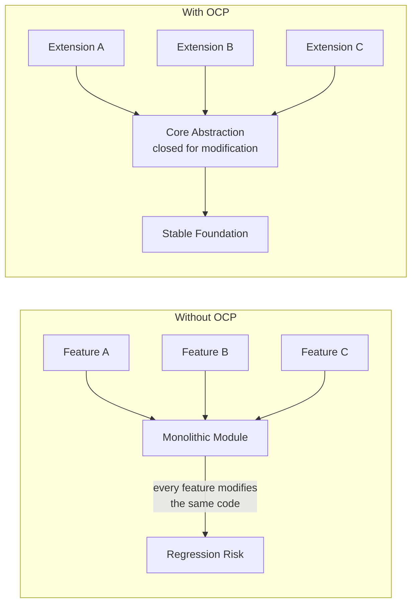
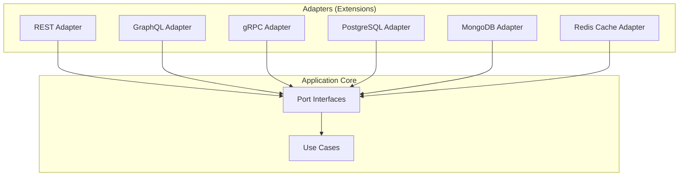

# Open/Closed Principle

## The Principle

> Software entities (classes, modules, functions) should be open for extension but closed for modification.
> — Bertrand Meyer, *Object-Oriented Software Construction* (1988)

This sounds paradoxical until you understand what "open" and "closed" mean:

- **Open for extension**: You can add new behavior to the module.
- **Closed for modification**: Adding that behavior does not require changing existing source code.

The key mechanism is **abstraction**. When you define a stable interface or abstract class, you can extend the system by adding new implementations without modifying the code that depends on the abstraction.

## Why OCP Matters

Every time you modify existing code to add a feature, you risk:

1. **Regressions** — changing working code can break it
2. **Merge conflicts** — multiple developers modifying the same file
3. **Re-testing** — modified code requires re-running all affected tests
4. **Deployment risk** — modified modules must be redeployed

OCP eliminates these risks for additive changes. When new behavior is new code rather than changed code, you only need to test the new code.



## Meyer's OCP vs Polymorphic OCP

Bertrand Meyer's original formulation relied on **inheritance** — you extend a class by subclassing it. This is "implementation inheritance" OCP.

Robert C. Martin and the modern interpretation rely on **polymorphism** — you extend behavior by implementing an interface. This is far more flexible because it does not create tight coupling between parent and child classes.

| Aspect | Meyer's OCP (1988) | Polymorphic OCP (Modern) |
|--------|-------------------|------------------------|
| Mechanism | Class inheritance | Interface implementation |
| Coupling | Tight (parent-child) | Loose (contract-based) |
| Flexibility | Limited by inheritance hierarchy | Unlimited implementations |
| Language support | C++, Java classes | All modern languages |
| Preferred today | Rarely | Almost always |

## Implementation Patterns

### Pattern 1: Strategy Pattern

The Strategy pattern is the canonical OCP implementation. Define a family of algorithms, encapsulate each one behind an interface, and make them interchangeable.

**Problem:** A pricing engine that needs to support different discount strategies — and new strategies are added quarterly.

```typescript
// The abstraction (closed for modification)
interface DiscountStrategy {
  calculate(order: Order): Money;
}

// Extension: percentage discount
class PercentageDiscount implements DiscountStrategy {
  constructor(private percent: number) {}
  calculate(order: Order): Money {
    return order.subtotal.multiply(this.percent / 100);
  }
}

// Extension: buy-one-get-one
class BogoDiscount implements DiscountStrategy {
  calculate(order: Order): Money {
    const eligibleItems = order.lines.filter(l => l.quantity >= 2);
    return eligibleItems.reduce(
      (total, line) => total.add(line.unitPrice.multiply(Math.floor(line.quantity / 2))),
      Money.zero(order.currency),
    );
  }
}

// Extension: loyalty tier discount (added later — NO changes to existing code)
class LoyaltyDiscount implements DiscountStrategy {
  constructor(private loyaltyService: LoyaltyService) {}
  async calculate(order: Order): Promise<Money> {
    const tier = await this.loyaltyService.getTier(order.customerId);
    const percent = tier === 'gold' ? 15 : tier === 'silver' ? 10 : 5;
    return order.subtotal.multiply(percent / 100);
  }
}

// The consumer (also closed for modification)
class PricingEngine {
  constructor(private strategies: DiscountStrategy[]) {}

  applyDiscounts(order: Order): Money {
    const bestDiscount = this.strategies
      .map(s => s.calculate(order))
      .reduce((best, current) => Money.max(best, current), Money.zero(order.currency));
    return order.subtotal.subtract(bestDiscount);
  }
}
```

::: tip Adding a new discount
When the marketing team invents a "seasonal flash sale" discount, you create a new `FlashSaleDiscount` class. You do not modify `PricingEngine`, `PercentageDiscount`, or any other existing code. The only change is the DI configuration that registers the new strategy.
:::

### Pattern 2: Plugin Architecture

Plugins are OCP at the system level. The core defines extension points; plugins provide implementations discovered at runtime.

```typescript
// Core defines the plugin contract (closed for modification)
interface Plugin {
  name: string;
  version: string;
  initialize(app: Application): void;
}

interface Middleware {
  handle(ctx: Context, next: () => Promise<void>): Promise<void>;
}

// Plugin registry (closed for modification)
class PluginRegistry {
  private plugins: Map<string, Plugin> = new Map();

  register(plugin: Plugin): void {
    if (this.plugins.has(plugin.name)) {
      throw new Error(`Plugin "${plugin.name}" already registered`);
    }
    this.plugins.set(plugin.name, plugin);
  }

  async initializeAll(app: Application): Promise<void> {
    for (const plugin of this.plugins.values()) {
      plugin.initialize(app);
    }
  }
}

// Extension: Authentication plugin (new code, no modifications)
class AuthPlugin implements Plugin {
  name = 'auth';
  version = '1.0.0';

  initialize(app: Application): void {
    app.addMiddleware(new JwtAuthMiddleware());
    app.addRoute('POST', '/auth/login', new LoginHandler());
    app.addRoute('POST', '/auth/refresh', new RefreshHandler());
  }
}

// Extension: Rate limiting plugin (new code, no modifications)
class RateLimitPlugin implements Plugin {
  name = 'rate-limit';
  version = '1.0.0';

  initialize(app: Application): void {
    app.addMiddleware(new RateLimitMiddleware({
      windowMs: 60_000,
      maxRequests: 100,
    }));
  }
}
```

### Pattern 3: Template Method

Define the skeleton of an algorithm in a base class; let subclasses fill in the steps.

```java
// Java — Template Method for data import pipelines
public abstract class DataImportPipeline<T> {

    // Template method — closed for modification
    public final ImportResult execute(InputStream source) {
        List<RawRecord> raw = parse(source);
        List<T> validated = raw.stream()
            .map(this::transform)
            .filter(this::validate)
            .collect(Collectors.toList());
        int saved = persist(validated);
        return new ImportResult(raw.size(), validated.size(), saved);
    }

    // Extension points — open for extension
    protected abstract List<RawRecord> parse(InputStream source);
    protected abstract T transform(RawRecord record);
    protected abstract boolean validate(T entity);
    protected abstract int persist(List<T> entities);
}

// Extension: CSV user import
public class CsvUserImport extends DataImportPipeline<User> {
    @Override
    protected List<RawRecord> parse(InputStream source) {
        return CsvParser.parse(source);
    }

    @Override
    protected User transform(RawRecord record) {
        return new User(record.get("name"), record.get("email"));
    }

    @Override
    protected boolean validate(User user) {
        return user.getEmail() != null && user.getEmail().contains("@");
    }

    @Override
    protected int persist(List<User> users) {
        return userRepository.batchInsert(users);
    }
}
```

### Pattern 4: Functional OCP (Higher-Order Functions)

In functional programming, OCP is achieved through function composition rather than inheritance.

```python
# Python — composable validators (OCP via functions)
from typing import Callable

Validator = Callable[[dict], list[str]]

def required(field: str) -> Validator:
    def validate(data: dict) -> list[str]:
        if field not in data or data[field] is None:
            return [f"{field} is required"]
        return []
    return validate

def max_length(field: str, length: int) -> Validator:
    def validate(data: dict) -> list[str]:
        value = data.get(field, "")
        if len(str(value)) > length:
            return [f"{field} must be at most {length} characters"]
        return []
    return validate

def matches_pattern(field: str, pattern: str) -> Validator:
    import re
    def validate(data: dict) -> list[str]:
        value = data.get(field, "")
        if not re.match(pattern, str(value)):
            return [f"{field} format is invalid"]
        return []
    return validate

# Compose validators — adding new rules never modifies existing ones
def compose_validators(*validators: Validator) -> Validator:
    def validate(data: dict) -> list[str]:
        errors = []
        for v in validators:
            errors.extend(v(data))
        return errors
    return validate

# Usage: extend by adding new validator functions
user_validator = compose_validators(
    required("email"),
    max_length("email", 255),
    matches_pattern("email", r"^[\w.+-]+@[\w-]+\.[\w.]+$"),
    required("name"),
    max_length("name", 100),
)
```

### Pattern 5: Go Interfaces (Implicit OCP)

Go's structural typing makes OCP almost effortless — any type that satisfies an interface implements it, with no explicit declaration.

```go
// Core defines what it needs (closed for modification)
type Notifier interface {
    Notify(ctx context.Context, msg Message) error
}

type OrderService struct {
    notifiers []Notifier
}

func (s *OrderService) PlaceOrder(ctx context.Context, order Order) error {
    if err := s.repo.Save(ctx, order); err != nil {
        return err
    }
    for _, n := range s.notifiers {
        if err := n.Notify(ctx, NewOrderMessage(order)); err != nil {
            log.Printf("notification failed: %v", err)
        }
    }
    return nil
}

// Extension: email notifier (new file, no modifications)
type EmailNotifier struct {
    client *ses.Client
}

func (e *EmailNotifier) Notify(ctx context.Context, msg Message) error {
    return e.client.SendEmail(ctx, msg.To, msg.Subject, msg.Body)
}

// Extension: Slack notifier (new file, no modifications)
type SlackNotifier struct {
    webhookURL string
}

func (s *SlackNotifier) Notify(ctx context.Context, msg Message) error {
    payload := map[string]string{"text": msg.Body}
    return postJSON(ctx, s.webhookURL, payload)
}
```

## OCP in Architecture

OCP is not just a code-level principle. It manifests at the architectural level:



This is [Hexagonal Architecture](/architecture-patterns/hexagonal/) — the application core is closed for modification while being open for extension through adapter implementations. The connection to the [Dependency Inversion Principle](./dependency-inversion) is direct: ports are the abstractions that both the core and adapters depend on.

## Common Violations

### 1. The `if/else` or `switch` Smell

When adding a new type requires modifying an existing switch statement, you have an OCP violation:

```typescript
// OCP VIOLATION: adding a new shape requires modifying this function
function calculateArea(shape: Shape): number {
  switch (shape.type) {
    case 'circle':
      return Math.PI * shape.radius ** 2;
    case 'rectangle':
      return shape.width * shape.height;
    case 'triangle':
      return 0.5 * shape.base * shape.height;
    // Every new shape modifies this function
  }
}
```

::: tip Fix: polymorphism
```typescript
interface Shape {
  area(): number;
}

class Circle implements Shape {
  constructor(private radius: number) {}
  area(): number { return Math.PI * this.radius ** 2; }
}

class Rectangle implements Shape {
  constructor(private width: number, private height: number) {}
  area(): number { return this.width * this.height; }
}
// New shapes: just add a new class
```
:::

### 2. Configuration Over Code

Sometimes OCP is better served by data-driven configuration than by class hierarchies:

```typescript
// Instead of a new class for each notification channel
const channels: NotificationChannel[] = [
  { name: 'email', enabled: true, handler: sendEmail },
  { name: 'sms', enabled: true, handler: sendSms },
  { name: 'push', enabled: false, handler: sendPush },
  // Adding a channel = adding a config entry, not changing code
];
```

### 3. The Expression Problem

OCP has a fundamental tension: you can make it easy to add new types (OOP) or easy to add new operations (FP), but doing both without modifying existing code is hard. This is known as the **Expression Problem**.

| Approach | Easy to Add | Hard to Add |
|----------|------------|-------------|
| OOP (interfaces) | New types (new classes) | New operations (must modify interface) |
| FP (pattern matching) | New operations (new functions) | New types (must modify all functions) |
| Visitor pattern | New operations | New types |
| Type classes / protocols | Both (with some ceremony) | — |

## When OCP is Overkill

::: warning
Not every piece of code needs to be extensible. OCP adds indirection, and indirection has a cognitive cost. Apply OCP at **boundaries** — where different teams, modules, or systems meet — not inside tight, cohesive units.
:::

| Scenario | Apply OCP? | Reason |
|----------|-----------|--------|
| Payment processing with 5+ providers | Yes | New providers appear regularly |
| Internal utility function | No | Changes are infrequent and low-risk |
| Report generation with known formats | Maybe | Only if new formats are requested often |
| Plugin system for external developers | Absolutely | You cannot modify their code |
| Startup MVP with 2 developers | Sparingly | Speed matters more than extensibility |

## Further Reading

- [SOLID Principles Overview](./) — context for all five principles
- [Single Responsibility Principle](./single-responsibility) — SRP enables OCP by keeping modules focused
- [Liskov Substitution Principle](./liskov-substitution) — LSP ensures extensions work correctly
- [Dependency Inversion Principle](./dependency-inversion) — DIP provides the abstractions OCP extends
- [Design Patterns](/architecture-patterns/design-patterns/) — Strategy, Template Method, Observer all implement OCP
- [Hexagonal Architecture](/architecture-patterns/hexagonal/) — OCP at the architectural level
