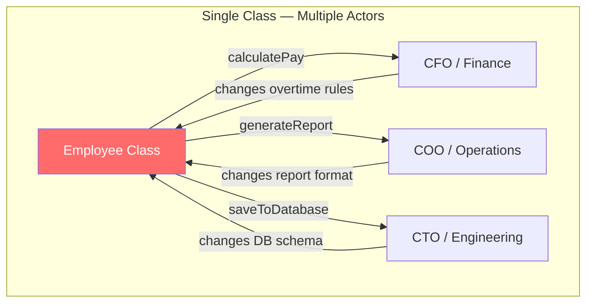

# Single Responsibility Principle

## The Principle

> A class should have only one reason to change.
> — Robert C. Martin, *Agile Software Development* (2003)

Uncle Bob later refined this to a more precise formulation:

> A module should be responsible to one, and only one, actor.
> — Robert C. Martin, *Clean Architecture* (2017)

The word "actor" is crucial. An actor is a group of stakeholders — people or systems — that request changes. When a class serves multiple actors, a change requested by one actor risks breaking functionality that another actor depends on. SRP is fundamentally about **aligning code boundaries with organizational boundaries**.

## First Principles

### Why "Reason to Change"?

Every piece of code has stakeholders. A payroll calculation serves the CFO. A report format serves the marketing team. An authentication flow serves the security team. When these concerns coexist in a single class, they are **coupled by proximity** — not by logic.

The danger is not that the class is "too big." The danger is that changes propagate in unexpected ways:



When the CFO changes overtime rules, the developer modifies `calculatePay`. But `calculatePay` shares private helper methods with `generateReport`. The report breaks. Operations files a bug. The developer who fixed overtime didn't even know the report existed.

### Cohesion and Coupling

SRP is the bridge between two foundational software metrics:

- **Cohesion** — the degree to which elements within a module belong together
- **Coupling** — the degree to which modules depend on each other

SRP maximizes cohesion (everything in the module serves the same actor) and minimizes coupling (changes for one actor don't cascade to code serving another actor).

| Metric | Low SRP Compliance | High SRP Compliance |
|--------|-------------------|-------------------|
| Cohesion | Low — unrelated concerns in one module | High — focused, single-purpose modules |
| Coupling | High — changes ripple across actors | Low — changes are isolated |
| Test complexity | High — requires mocking unrelated dependencies | Low — small surface area per test |
| Change frequency | High — module changes for many reasons | Low — module changes only when its actor's needs change |
| Merge conflicts | Frequent — multiple teams touch same files | Rare — teams own separate modules |

## Before/After Refactoring

### Example 1: The God Service (TypeScript)

**Before** — A single service handles user authentication, profile management, notification preferences, and audit logging:

```typescript
// BEFORE: UserService serves 4 different actors
class UserService {
  constructor(
    private db: Database,
    private mailer: EmailClient,
    private logger: AuditLogger,
    private cache: CacheClient,
  ) {}

  // Actor: Security team
  async authenticate(email: string, password: string): Promise<AuthToken> {
    const user = await this.db.query('SELECT * FROM users WHERE email = $1', [email]);
    if (!user) throw new AuthError('User not found');
    const valid = await bcrypt.compare(password, user.passwordHash);
    if (!valid) throw new AuthError('Invalid password');
    await this.logger.log('auth', { userId: user.id, action: 'login' });
    return this.generateToken(user);
  }

  // Actor: Product team
  async updateProfile(userId: string, data: ProfileUpdate): Promise<User> {
    const user = await this.db.query('UPDATE users SET ... WHERE id = $1', [userId]);
    await this.cache.invalidate(`user:${userId}`);
    await this.mailer.send(user.email, 'Profile updated');
    return user;
  }

  // Actor: Marketing team
  async updateNotificationPreferences(userId: string, prefs: NotifPrefs): Promise<void> {
    await this.db.query('UPDATE notification_prefs SET ... WHERE user_id = $1', [userId]);
    await this.cache.invalidate(`notif:${userId}`);
  }

  // Actor: Compliance team
  async exportUserData(userId: string): Promise<UserExport> {
    const user = await this.db.query('SELECT * FROM users WHERE id = $1', [userId]);
    const activity = await this.logger.getAuditTrail(userId);
    return { user, activity, exportedAt: new Date() };
  }

  private generateToken(user: User): AuthToken { /* ... */ }
}
```

::: danger Problems with this design
1. **Four actors, one class** — security, product, marketing, and compliance teams all cause changes to the same file
2. **12 dependencies** mixed together — a change in the mailer config breaks authentication tests
3. **Untestable in isolation** — testing `authenticate` requires mocking the database, logger, and indirectly the cache
4. **Merge conflicts guaranteed** — four teams touching one file
:::

**After** — Each service has exactly one reason to change:

```typescript
// AFTER: Four focused services, each serving one actor

// Actor: Security team
class AuthenticationService {
  constructor(
    private userRepo: UserRepository,
    private auditLog: AuditLogger,
    private tokenService: TokenService,
  ) {}

  async authenticate(email: string, password: string): Promise<AuthToken> {
    const user = await this.userRepo.findByEmail(email);
    if (!user) throw new AuthError('User not found');
    if (!await user.verifyPassword(password)) throw new AuthError('Invalid password');
    await this.auditLog.record('auth.login', { userId: user.id });
    return this.tokenService.generate(user);
  }
}

// Actor: Product team
class ProfileService {
  constructor(
    private userRepo: UserRepository,
    private eventBus: EventBus,
  ) {}

  async updateProfile(userId: string, data: ProfileUpdate): Promise<User> {
    const user = await this.userRepo.findById(userId);
    user.updateProfile(data);
    await this.userRepo.save(user);
    await this.eventBus.publish(new ProfileUpdatedEvent(userId, data));
    return user;
  }
}

// Actor: Marketing team
class NotificationPreferenceService {
  constructor(private prefRepo: NotificationPreferenceRepository) {}

  async update(userId: string, prefs: NotifPrefs): Promise<void> {
    const current = await this.prefRepo.findByUserId(userId);
    current.apply(prefs);
    await this.prefRepo.save(current);
  }
}

// Actor: Compliance team
class UserDataExportService {
  constructor(
    private userRepo: UserRepository,
    private auditLog: AuditLogger,
  ) {}

  async export(userId: string): Promise<UserExport> {
    const user = await this.userRepo.findById(userId);
    const activity = await this.auditLog.getTrail(userId);
    return { user: user.toExport(), activity, exportedAt: new Date() };
  }
}
```

::: tip What changed
- Each service has **2-3 dependencies**, not 4+
- Cache invalidation moved to an event handler (reacting to `ProfileUpdatedEvent`), removing the cache dependency from business logic entirely
- Email sending moved to an event handler — it is a side effect, not core logic
- Each service can be tested with minimal mocking
- Four teams can work in parallel without merge conflicts
:::

### Example 2: Report Generator (Python)

**Before:**

```python
# BEFORE: One class handles data fetching, calculation, and formatting
class SalesReport:
    def __init__(self, db_connection, template_engine):
        self.db = db_connection
        self.template = template_engine

    def fetch_data(self, start_date, end_date):
        """Fetches raw sales data from database"""
        return self.db.execute(
            "SELECT * FROM sales WHERE date BETWEEN %s AND %s",
            (start_date, end_date)
        )

    def calculate_metrics(self, data):
        """Computes KPIs from raw data"""
        total = sum(row['amount'] for row in data)
        avg = total / len(data) if data else 0
        return {'total': total, 'average': avg, 'count': len(data)}

    def render_html(self, metrics):
        """Generates HTML report"""
        return self.template.render('sales_report.html', metrics)

    def render_pdf(self, metrics):
        """Generates PDF report"""
        return self.template.render('sales_report.pdf', metrics)

    def generate(self, start_date, end_date, format='html'):
        data = self.fetch_data(start_date, end_date)
        metrics = self.calculate_metrics(data)
        if format == 'html':
            return self.render_html(metrics)
        return self.render_pdf(metrics)
```

**After:**

```python
# AFTER: Separated by responsibility

class SalesDataRepository:
    """Actor: Data engineering team"""
    def __init__(self, db_connection):
        self.db = db_connection

    def fetch(self, start_date: date, end_date: date) -> list[SalesRecord]:
        rows = self.db.execute(
            "SELECT * FROM sales WHERE date BETWEEN %s AND %s",
            (start_date, end_date)
        )
        return [SalesRecord.from_row(row) for row in rows]


class SalesMetricsCalculator:
    """Actor: Finance team (defines KPI formulas)"""
    def calculate(self, records: list[SalesRecord]) -> SalesMetrics:
        total = sum(r.amount for r in records)
        avg = total / len(records) if records else Decimal(0)
        return SalesMetrics(total=total, average=avg, count=len(records))


class ReportRenderer:
    """Actor: Design team (controls formatting)"""
    def __init__(self, template_engine):
        self.template = template_engine

    def render(self, metrics: SalesMetrics, format: str) -> bytes:
        template_name = f'sales_report.{format}'
        return self.template.render(template_name, metrics.to_dict())
```

### Example 3: Go — HTTP Handler Decomposition

```go
// BEFORE: Handler does validation, business logic, and response formatting
func (h *Handler) CreateOrder(w http.ResponseWriter, r *http.Request) {
    // Parse and validate request
    var req CreateOrderRequest
    if err := json.NewDecoder(r.Body).Decode(&req); err != nil {
        http.Error(w, "invalid JSON", http.StatusBadRequest)
        return
    }
    if req.CustomerID == "" {
        http.Error(w, "customer_id required", http.StatusBadRequest)
        return
    }

    // Business logic
    order := &Order{CustomerID: req.CustomerID, Status: "pending"}
    for _, item := range req.Items {
        stock, _ := h.inventoryDB.CheckStock(item.ProductID)
        if stock < item.Quantity {
            http.Error(w, "insufficient stock", http.StatusConflict)
            return
        }
        order.AddLine(item.ProductID, item.Quantity, item.Price)
    }

    // Persistence
    if err := h.db.Save(order); err != nil {
        http.Error(w, "internal error", http.StatusInternalServerError)
        return
    }

    // Response
    w.Header().Set("Content-Type", "application/json")
    json.NewEncoder(w).Encode(order)
}
```

```go
// AFTER: Each layer has one reason to change

// Validation (changes when API contract changes)
func decodeCreateOrderRequest(r *http.Request) (CreateOrderRequest, error) {
    var req CreateOrderRequest
    if err := json.NewDecoder(r.Body).Decode(&req); err != nil {
        return req, fmt.Errorf("invalid JSON: %w", err)
    }
    return req, req.Validate()
}

// Business logic (changes when business rules change)
type OrderService struct {
    inventory InventoryChecker
    repo      OrderRepository
}

func (s *OrderService) Create(ctx context.Context, cmd CreateOrderCommand) (*Order, error) {
    order := NewOrder(cmd.CustomerID)
    for _, item := range cmd.Items {
        if err := s.inventory.EnsureAvailable(ctx, item.ProductID, item.Quantity); err != nil {
            return nil, err
        }
        order.AddLine(item.ProductID, item.Quantity, item.Price)
    }
    return order, s.repo.Save(ctx, order)
}

// HTTP handler (changes when transport layer changes)
func (h *Handler) CreateOrder(w http.ResponseWriter, r *http.Request) {
    req, err := decodeCreateOrderRequest(r)
    if err != nil {
        respondError(w, http.StatusBadRequest, err)
        return
    }
    order, err := h.orderService.Create(r.Context(), req.ToCommand())
    if err != nil {
        respondError(w, errorToStatus(err), err)
        return
    }
    respondJSON(w, http.StatusCreated, order)
}
```

## Identifying SRP Violations

### Smell Tests

Ask these questions about any class or module:

1. **"Who would request a change to this code?"** — If the answer involves multiple teams or roles, you have an SRP violation.
2. **"Can I describe what this class does without using 'and'?"** — "It authenticates users **and** sends emails **and** generates reports" signals multiple responsibilities.
3. **"How many tests require unrelated mocks?"** — If testing method A requires mocking dependencies used only by method B, the class has tangled concerns.
4. **"How often does this file change, and for what reasons?"** — Use `git log --format='%s' -- path/to/file.ts` to see the commit history. If changes serve different concerns, split the file.

### Metrics

| Metric | Threshold | Tool |
|--------|-----------|------|
| Lines of code per class | > 200 LOC warrants inspection | `wc -l`, IDE metrics |
| Number of dependencies | > 5 constructor params suggests multiple concerns | Manual review |
| Commit frequency diversity | Changes for 3+ distinct features | `git log --oneline` |
| Method cohesion (LCOM4) | > 1 indicates disconnected method groups | SonarQube, NDepend |

## The Granularity Problem

The hardest part of SRP is deciding **how fine-grained** to go. A class with one method and two lines is not more "SOLID" — it is more fragmented.

### Too Coarse

```typescript
// Too coarse: UserService handles everything user-related
class UserService {
  register() {}
  authenticate() {}
  updateProfile() {}
  resetPassword() {}
  deleteAccount() {}
  exportData() {}
}
```

### Too Fine

```typescript
// Too fine: absurd over-decomposition
class UserEmailValidator {}
class UserPasswordHasher {}
class UserIdGenerator {}
class UserCreationTimestampSetter {}
class UserDatabaseInserter {}
class UserWelcomeEmailSender {}
class UserRegistrationAuditLogger {}
```

### Just Right

```typescript
// Right: grouped by actor and rate of change
class RegistrationService {}      // Product team
class AuthenticationService {}    // Security team
class ProfileService {}           // Product team
class AccountLifecycleService {}  // Compliance team
```

::: warning The Pragmatic Rule
Split when you feel **pain**, not when you feel **purity**. If a class changes for two reasons but those changes happen once a year, the cost of splitting may exceed the cost of occasional coupling. SRP is about managing change velocity, not achieving theoretical perfection.
:::

## SRP Beyond Classes

SRP applies at every level of abstraction:

| Level | SRP Application |
|-------|----------------|
| **Function** | A function should do one thing and do it well (Unix philosophy) |
| **Class** | A class should serve one actor |
| **Module/Package** | A module should have one reason to be deployed |
| **Microservice** | A service should be owned by one team, aligned to one bounded context |
| **Repository** | A Git repo should contain one deployable unit |

At the service level, SRP becomes the foundation of [Domain-Driven Design's bounded contexts](/architecture-patterns/domain-driven-design/) and [microservice decomposition](/architecture-patterns/microservices/).

## Common Mistakes

### 1. Confusing "One Thing" with "One Method"

SRP does not mean a class should have one method. It means a class should serve one actor. A `PayrollCalculator` might have `calculateGrossPay()`, `calculateDeductions()`, `calculateNetPay()`, and `applyTaxTable()` — all serving the Finance actor. That is one responsibility.

### 2. Splitting Along Technical Layers Instead of Business Actors

Creating `UserValidator`, `UserMapper`, `UserPersister` is splitting by technical concern, not by actor. If they all change together when the Product team requests a feature, they are one responsibility scattered across files.

### 3. Ignoring the Time Dimension

Two methods in the same class that change at different rates are a stronger signal for splitting than two methods that change at the same rate for different reasons. **Change frequency** is a more reliable guide than **conceptual purity**.

## Further Reading

- [SOLID Principles Overview](./) — the five principles in context
- [Open/Closed Principle](./open-closed) — how SRP enables extensibility
- [Dependency Inversion Principle](./dependency-inversion) — injecting dependencies keeps classes focused
- [Clean Architecture](/architecture-patterns/clean-architecture/) — SRP at the architectural level
- [Domain-Driven Design](/architecture-patterns/domain-driven-design/) — bounded contexts as organizational SRP
