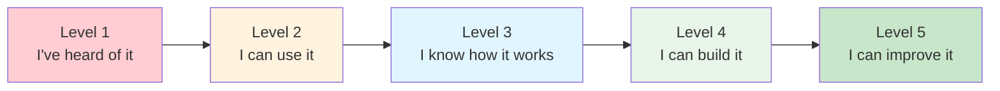
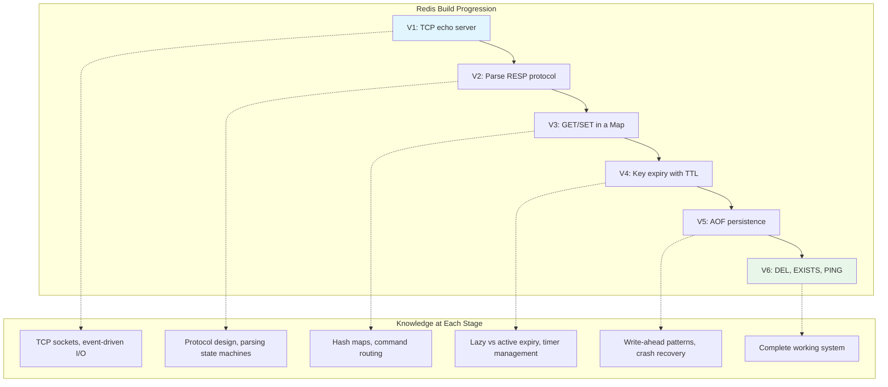
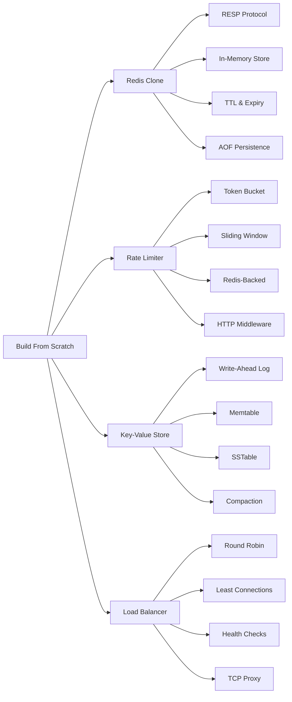
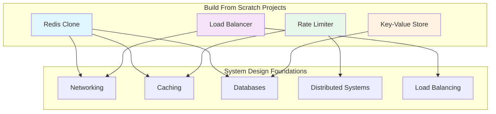
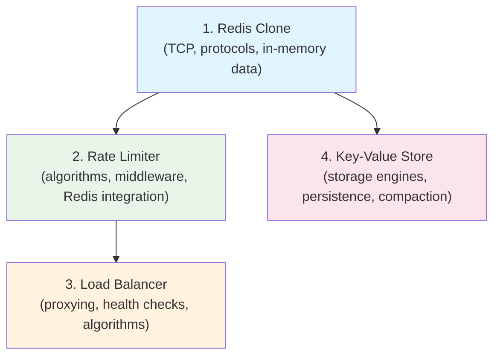

# Build From Scratch

There is a moment every engineer hits. You have read the docs, watched the conference talks, memorized the architecture diagrams. You can explain how Redis works, draw a load balancer on a whiteboard, describe the difference between a token bucket and a sliding window. But you have never built any of it. And deep down, you know the difference between knowing about something and knowing something.

Building from scratch is how you cross that gap.

## Why Building From Scratch Changes Everything

Tutorials teach you to use tools. Building from scratch teaches you to think. When you implement Redis yourself, you do not just learn what RESP is — you discover why the protocol was designed that way. When you write a rate limiter, you do not just learn the token bucket algorithm — you confront the real trade-offs between memory, precision, and throughput that the textbooks gloss over.

Here is what happens when you build instead of read:

| What You Do | What You Learn |
|---|---|
| Parse the RESP protocol byte by byte | Why text protocols exist alongside binary ones |
| Implement key expiry with TTLs | How timer wheels and lazy deletion actually work |
| Write a token bucket rate limiter | Why distributed rate limiting is fundamentally harder than local |
| Build an LSM tree | Why write-optimized storage engines dominate modern databases |
| Proxy TCP connections through a load balancer | Why health checks and connection draining exist |

Every bug you encounter teaches you something a tutorial never would. Every design decision you face — should I use a hash map or a sorted set? Should I flush to disk synchronously or batch writes? — forces you to reason about trade-offs that define senior engineering.

### The Knowledge Depth Spectrum

Most engineers exist at the "I can use it" level. Building from scratch pushes you to "I can build it," which is the threshold that separates those who troubleshoot from those who architect.

Consider Redis. At Level 2, you know `SET key value EX 60`. At Level 3, you know it uses an event loop and an in-memory hash map. At Level 4, you have written your own RESP parser and discovered why TCP stream boundaries make protocol parsing tricky. At Level 5, you understand enough to contribute to the real project. This section takes you from Level 2/3 to a solid Level 4.

## The Learning Philosophy

This section follows three principles:

### 1. Start With the Simplest Thing That Works

Every project begins with the minimal viable implementation. A Redis clone that handles GET and SET. A rate limiter that counts requests in a fixed window. A key-value store that writes to a single file. Get something working first, then make it better.

This is not about cutting corners. It is about building understanding layer by layer. The first version teaches you the core concept. Each subsequent feature teaches you why production systems need complexity.

### 2. Build the Hard Parts

The interesting engineering is never in the happy path. It is in expiry, persistence, failure handling, concurrency, and edge cases. Each project deliberately walks you into these hard problems because that is where the real learning happens.

When your AOF replay crashes because you did not handle partial writes, you learn why checksums exist. When your rate limiter allows 101 requests through a 100-request window because of a race condition, you learn why Redis Lua scripts need atomicity. These bugs are not annoyances — they are the curriculum.

### 3. Connect to Production Reality

Every implementation includes a section on how production systems solve the same problem differently and why. You will not ship your toy Redis to production, but you will understand exactly why the real Redis makes the decisions it does.

The gap between your implementation and production is not quality — it is scope. Production Redis has 20 data structures, cluster mode, Lua scripting, and pub/sub. But the core architecture — the event loop, the RESP protocol, the lazy expiry, the AOF — is the same architecture you will build.

## What You Will Build

### Redis Clone (TypeScript)

You will build a working Redis server from scratch in TypeScript. It speaks the real RESP protocol, so you can connect to it with `redis-cli`. It handles GET, SET, DEL, EXISTS, and key expiry with TTL. It persists data to disk using an Append-Only File. By the end, you will understand the core of how Redis actually works — the event loop, the protocol parser, the data model, and the persistence layer.

::: tip Why TypeScript?
TypeScript gives you access to Node.js's `net` module for raw TCP, strong typing for protocol parsing, and enough low-level control to see what is happening without fighting memory management. It is the fastest path to a working implementation.
:::

**What you will learn:**

| Component | Concept | Real-World Application |
|---|---|---|
| TCP Server | Event-driven I/O, socket management | Every server you ever build |
| RESP Parser | Protocol design, state machines, buffer management | HTTP parsers, gRPC, WebSocket frames |
| In-Memory Store | Hash maps, data modeling | Caching layers, session stores |
| Key Expiry | Lazy vs active expiry, timer management | TTL in caches, token expiration |
| AOF Persistence | Write-ahead logging, crash recovery | Database WAL, event sourcing |

**Difficulty:** Advanced | **Lines of Code:** ~200 | **Time:** 3-5 hours

[Build Redis From Scratch](/build-from-scratch/redis)

---

### Rate Limiter (TypeScript)

Rate limiters are everywhere — API gateways, login endpoints, webhook receivers — but most engineers have never built one. You will implement three algorithms (fixed window, token bucket, sliding window log), first in-memory and then backed by Redis for distributed scenarios. You will wire each one into Express and Fastify middleware so you can see it reject real HTTP requests.

**What you will learn:**

| Component | Concept | Real-World Application |
|---|---|---|
| Token Bucket | Rate control with burst tolerance | AWS API Gateway, Stripe API |
| Sliding Window | Precise rate tracking | Cloudflare, rate limit headers |
| Redis-Backed | Distributed state, Lua atomicity | Multi-server API rate limiting |
| HTTP Middleware | Request lifecycle, response headers | Express/Fastify plugin architecture |

**Difficulty:** Intermediate | **Lines of Code:** ~300 | **Time:** 2-3 hours

[Build a Rate Limiter From Scratch](/build-from-scratch/rate-limiter)

---

### Key-Value Store (Go)

This is the deep cut. You will implement a Log-Structured Merge Tree — the same storage engine architecture behind LevelDB, RocksDB, Cassandra, and a dozen other databases. You will build the Write-Ahead Log, the in-memory Memtable (a skip list), SSTable serialization, and a basic compaction strategy. By the end, you will understand why LSM trees dominate write-heavy workloads and where they pay the cost.

::: warning This project is challenging
The LSM tree implementation requires understanding binary serialization, file I/O, sorting algorithms, and concurrent data structures. Make sure you are comfortable with Go before starting.
:::

**What you will learn:**

| Component | Concept | Real-World Application |
|---|---|---|
| Write-Ahead Log | Durability, crash recovery, CRC checksums | Every database ever built |
| Memtable (Skip List) | Sorted in-memory structures, probabilistic balancing | Redis sorted sets, LevelDB |
| SSTables | Immutable sorted files, binary serialization | RocksDB, Cassandra, HBase |
| Compaction | Space reclamation, merge sort, garbage collection | Every LSM-tree database |

**Difficulty:** Advanced | **Lines of Code:** ~400 | **Time:** 6-10 hours

[Build a Key-Value Store From Scratch](/build-from-scratch/key-value-store)

---

### Load Balancer (Go)

Every request you make on the internet passes through at least one load balancer. You will build a Layer 4 TCP proxy that distributes connections across backend servers using round-robin, weighted round-robin, and least-connections algorithms. It performs active health checks, drains connections gracefully on backend removal, and handles the subtle edge cases that make load balancing harder than it looks.

**What you will learn:**

| Component | Concept | Real-World Application |
|---|---|---|
| TCP Proxy | Bidirectional data forwarding, connection lifecycle | NGINX, HAProxy, Envoy |
| Algorithms | Round-robin, weighted, least-connections | Every load balancer |
| Health Checks | Failure detection, thresholds, flap prevention | Kubernetes probes, ALB health checks |
| Connection Draining | Graceful shutdown, zero-downtime deployments | Rolling deployments, blue-green |

**Difficulty:** Advanced | **Lines of Code:** ~350 | **Time:** 4-6 hours

[Build a Load Balancer From Scratch](/build-from-scratch/load-balancer)

---

## Concept Cross-Reference Map

Every project in this section connects to foundational concepts covered elsewhere in Archon. This map shows how building from scratch reinforces and deepens your understanding of system design theory.

| Project | Deepens Understanding Of |
|---|---|
| Redis Clone | [Networking](/system-design/networking/), [Caching](/system-design/caching/), [Redis Internals](/system-design/databases/redis-internals) |
| Rate Limiter | [Rate Limiting](/system-design/distributed-systems/rate-limiting), [Caching](/system-design/caching/) |
| Key-Value Store | [Storage Engines](/system-design/databases/storage-engines), [Write-Ahead Logging](/system-design/databases/write-ahead-logging) |
| Load Balancer | [Load Balancing](/system-design/load-balancing/), [Health Checks](/system-design/load-balancing/health-checks) |

## Prerequisites

Each project page lists its specific prerequisites, but here is what you need across the board:

| Skill | Where to Learn It | Which Projects |
|---|---|---|
| TypeScript fundamentals | [MDN](https://developer.mozilla.org), any modern TS course | Redis, Rate Limiter |
| Go fundamentals | [Go Tour](https://go.dev/tour), [Effective Go](https://go.dev/doc/effective_go) | Key-Value Store, Load Balancer |
| TCP/IP basics | [Networking Fundamentals](/system-design/networking) | Redis, Load Balancer |
| Command line comfort | Any Unix/Linux basics course | All projects |
| Basic data structures | [Algorithms & Data Structures](/algorithms) | All projects |
| HTTP basics | [REST Best Practices](/system-design/api-design/rest-best-practices) | Rate Limiter |

::: tip You do not need to be an expert
These projects are designed to teach you, not test you. If you know basic TypeScript or Go syntax, you have enough to start. The projects introduce concepts progressively — you will learn the advanced stuff as you build.
:::

## How to Use This Section

Each project is self-contained. You do not need to complete them in order, though the Redis project is the gentlest starting point and the Key-Value Store is the most demanding.

Every page follows this structure:

1. **What you are building** — a clear description of the system and its scope
2. **Architecture** — how the pieces fit together, with diagrams
3. **Implementation** — full working code, explained step by step
4. **Testing** — how to verify your implementation works
5. **Production comparison** — how real systems solve the same problem

### Tips for Getting the Most Out of Each Project

**Type the code yourself.** Do not copy-paste. The bugs you create and fix are where the deepest learning happens. If something does not work and you cannot figure out why, that is the moment you are about to learn something important.

**Read the code before running it.** Before you execute each section, predict what it will do. When it does something different, figure out why. This active engagement is what separates learning from copying.

**Experiment after each milestone.** Once the basic version works, try changing something. What happens if you make the memtable size tiny? What if the health check interval is 100ms instead of 5 seconds? What if the token bucket refill rate is 0? Experimentation builds intuition that reading never can.

**Connect it to what you already know.** If you have used Redis before, compare your implementation to the real thing. If you have configured an NGINX load balancer, think about what your implementation is missing. These connections turn isolated knowledge into a web of understanding.

::: warning Common pitfall: perfectionism
Do not try to make your implementation production-quality. The goal is learning, not shipping. If your rate limiter has a subtle race condition under extreme concurrency, that is a learning opportunity, not a bug to fix before moving on. Note it, understand why it happens, and learn how production systems solve it.
:::

## Recommended Order

If you want a structured learning path, follow this sequence:

Start with the Redis clone because it covers the most foundational concepts — TCP servers, protocol parsing, in-memory data structures, and persistence. The rate limiter builds naturally on that foundation (and even uses Redis for its distributed variant). The load balancer introduces networking concepts. The key-value store is the capstone project that ties together everything about storage engines.

### Alternative: By Language

If you prefer to stay in one language:

**TypeScript track:** Redis Clone, then Rate Limiter. These two projects cover networking, protocols, data structures, algorithms, middleware, and distributed state — all in TypeScript.

**Go track:** Key-Value Store, then Load Balancer. These two projects cover storage engines, binary I/O, concurrent programming, networking, and system-level concepts — all in Go.

## What You Will Not Build (And Why)

It is important to understand the scope. These are learning projects, not production software. Here is what we deliberately leave out:

| Feature We Skip | Why We Skip It | Where to Learn It |
|---|---|---|
| Clustering / replication | Adds distributed systems complexity that obscures the core | [Distributed Systems](/system-design/distributed-systems/) |
| TLS / encryption | Important but orthogonal to the core concept | [TLS Handshake](/system-design/networking/tls-handshake) |
| Authentication | Security is critical but not the point of these projects | [API Security](/system-design/api-design/api-security-patterns) |
| Production error handling | Full error handling obscures the learning code | Real-world experience |
| Configuration management | Important for operations, not for learning internals | [DevOps](/devops/) |

::: danger Do not deploy these to production
These implementations lack security, proper error handling, comprehensive testing, and the thousand other things that separate learning code from production code. They are designed to teach you how things work, not to serve real traffic. Use the real tools (Redis, RocksDB, NGINX) for production.
:::

## Beyond This Section

Once you have built these four systems, you will find that production architectures make dramatically more sense. The [System Design](/system-design/) section will feel like it is describing old friends rather than abstract concepts. The [Architecture Patterns](/architecture-patterns/) section will click in ways it never did before. And when you encounter these systems in production — debugging a Redis timeout, tuning a rate limiter, investigating load balancer failover — you will know exactly where to look because you have built the internals yourself.

The projects in this section pair especially well with:

- [System Design Interviews](/system-design-interviews/) — you can now explain these systems from implementation experience, not just theory
- [Redis Internals](/system-design/databases/redis-internals) — compare your implementation with the real thing
- [Load Balancing](/system-design/load-balancing/) — see how production load balancers extend what you built
- [Storage Engines](/system-design/databases/storage-engines) — understand where your LSM tree fits in the broader landscape
- [Company Architecture Case Studies](/company-architecture/) — see how Uber, Discord, Figma, and Shopify build systems at scales beyond what any single engineer can replicate

### Future Projects

This section will grow over time. Planned additions include:

- **Build a DNS Resolver From Scratch** — recursive resolution, caching, UDP protocol
- **Build a Git Clone From Scratch** — content-addressable storage, merkle trees, diff algorithms
- **Build a Container Runtime From Scratch** — namespaces, cgroups, chroot, overlay filesystems
- **Build a Search Engine From Scratch** — inverted indexes, TF-IDF, ranking algorithms

## Frequently Asked Questions

### "Do I need to finish the entire project in one sitting?"

No. Each project is broken into numbered parts that serve as natural stopping points. The Redis project, for example, has seven parts. You can build the RESP parser and TCP server in one session, then add expiry and persistence the next day. Each part produces a working (if incomplete) system.

### "What if I get stuck?"

Getting stuck is part of the process. Here is a hierarchy of things to try:

1. **Re-read the section.** The explanation often contains the answer to common mistakes.
2. **Add logging.** Print the raw bytes, the parsed values, the function inputs and outputs. Most bugs become obvious when you can see the data.
3. **Simplify.** If your full implementation is broken, strip it down to the smallest possible version and verify that works, then add features back one at a time.
4. **Check the fundamentals.** If the TCP server is not accepting connections, make sure nothing else is listening on that port. If the parser is producing garbage, check your buffer handling.
5. **Move on.** If you are stuck on one feature, skip it and come back later. Understanding the rest of the system often makes the stuck part click.

### "How is this different from Codecrafters or similar platforms?"

Platforms like Codecrafters provide guided, test-driven exercises. This section provides complete implementations with detailed explanations. The trade-off: Codecrafters gives you more structure and feedback; this section gives you more depth and context. Ideally, use both — do the Codecrafters challenge first for the guided experience, then read the corresponding page here for the deeper understanding.

### "Can I build these in a different language?"

Absolutely. The concepts are language-agnostic. The TypeScript and Go implementations are chosen for readability and ecosystem fit, but a Redis clone in Rust, a rate limiter in Python, or a key-value store in C++ would teach you the same concepts. The code in this section serves as a reference — translate the ideas, do not translate the syntax.

### "Should I write tests?"

Yes. Each project includes a testing section, but you should write your own tests beyond what is shown. Testing is where you discover edge cases that the implementation glosses over. What happens when you SET a key that already exists? What happens when you DEL a key that does not exist? What happens when the WAL file is corrupted halfway through a record? Testing these edges is where the deepest learning happens.

### "How do these projects help in interviews?"

Building from scratch gives you something most candidates lack: real implementation experience. When an interviewer asks you to design a rate limiter, you can talk about the specific trade-offs between token bucket and sliding window because you have built both and seen where each one breaks down. When they ask about database internals, you can explain how LSM trees work because you wrote the compaction loop yourself. This depth of understanding is immediately obvious to experienced interviewers and sets you apart from candidates who only studied theory.

Build things. Break things. Fix things. That is how you become a real engineer.
