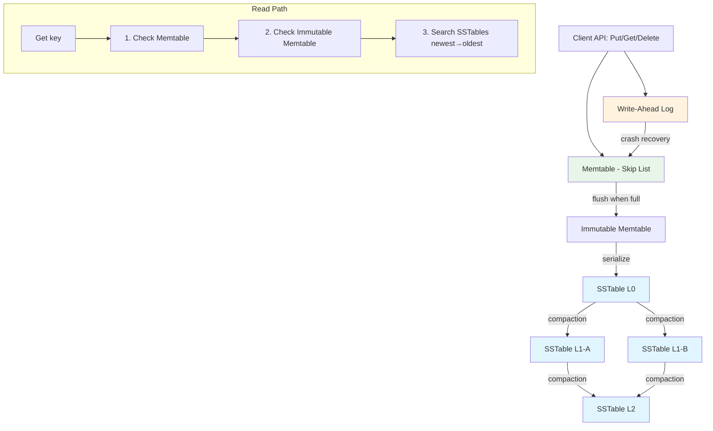
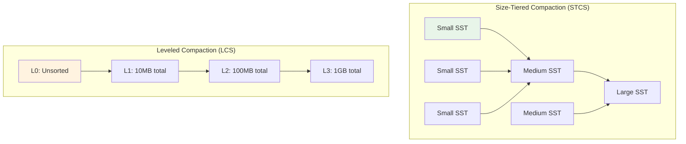

# Build a Key-Value Store From Scratch

Every database you have ever used stores data on disk. How it does that — the storage engine — determines everything about performance: write throughput, read latency, space amplification, and crash recovery. You are going to build the most important storage engine architecture in modern databases: the Log-Structured Merge Tree (LSM tree).

LSM trees power LevelDB, RocksDB, Cassandra, HBase, CockroachDB, ScyllaDB, and dozens more. They dominate write-heavy workloads because they turn random writes into sequential I/O — the single biggest performance optimization you can make on any storage device.

## Architecture Overview



### Why LSM Trees?

The fundamental problem: disk I/O is slow, but sequential I/O is 100-1000x faster than random I/O. LSM trees exploit this by:

1. **Buffering writes in memory** (the memtable) — writes are fast because they only touch RAM
2. **Flushing sequentially** — when the memtable fills up, write it to disk as a sorted, immutable file (SSTable)
3. **Merging in the background** — compaction merges SSTables to keep read amplification in check

| Operation | B-Tree (Traditional) | LSM Tree |
|---|---|---|
| Write | Random I/O (update page in place) | Sequential I/O (append to log, flush sorted) |
| Read | 1 seek (follow tree to leaf) | Check memtable + potentially multiple SSTables |
| Space | 1x (in-place update) | Up to Nx (multiple versions until compaction) |
| Write amplification | Low (one page per write) | Higher (data rewritten during compaction) |
| Best for | Read-heavy, random access | Write-heavy, range scans |

## Part 1: The Write-Ahead Log

The WAL ensures durability. Before any write touches the memtable, it is appended to the WAL on disk. If the process crashes, we replay the WAL to recover the memtable.

```go
// wal.go
package kvstore

import (
	"encoding/binary"
	"hash/crc32"
	"io"
	"os"
	"sync"
)

// WAL record format:
// [4 bytes CRC32] [4 bytes key length] [4 bytes value length] [1 byte op] [key] [value]
// op: 0 = PUT, 1 = DELETE

const (
	opPut    byte = 0
	opDelete byte = 1
)

type WALRecord struct {
	Op    byte
	Key   []byte
	Value []byte
}

type WAL struct {
	mu   sync.Mutex
	file *os.File
	path string
}

func NewWAL(path string) (*WAL, error) {
	f, err := os.OpenFile(path, os.O_CREATE|os.O_RDWR|os.O_APPEND, 0644)
	if err != nil {
		return nil, err
	}
	return &WAL{file: f, path: path}, nil
}

func (w *WAL) Write(record WALRecord) error {
	w.mu.Lock()
	defer w.mu.Unlock()

	// Encode the record
	keyLen := len(record.Key)
	valLen := len(record.Value)
	buf := make([]byte, 4+4+4+1+keyLen+valLen)

	// Leave first 4 bytes for CRC, fill the rest
	binary.LittleEndian.PutUint32(buf[4:8], uint32(keyLen))
	binary.LittleEndian.PutUint32(buf[8:12], uint32(valLen))
	buf[12] = record.Op
	copy(buf[13:13+keyLen], record.Key)
	copy(buf[13+keyLen:], record.Value)

	// Calculate CRC over everything after the CRC field
	crc := crc32.ChecksumIEEE(buf[4:])
	binary.LittleEndian.PutUint32(buf[0:4], crc)

	_, err := w.file.Write(buf)
	if err != nil {
		return err
	}

	// fsync to ensure durability
	return w.file.Sync()
}

func (w *WAL) ReadAll() ([]WALRecord, error) {
	w.mu.Lock()
	defer w.mu.Unlock()

	if _, err := w.file.Seek(0, io.SeekStart); err != nil {
		return nil, err
	}

	var records []WALRecord
	header := make([]byte, 13) // CRC + keyLen + valLen + op

	for {
		_, err := io.ReadFull(w.file, header)
		if err == io.EOF {
			break
		}
		if err != nil {
			return records, err // return what we have
		}

		storedCRC := binary.LittleEndian.Uint32(header[0:4])
		keyLen := binary.LittleEndian.Uint32(header[4:8])
		valLen := binary.LittleEndian.Uint32(header[8:12])
		op := header[12]

		data := make([]byte, keyLen+valLen)
		if _, err := io.ReadFull(w.file, data); err != nil {
			return records, err
		}

		// Verify CRC
		checkBuf := make([]byte, 9+len(data))
		copy(checkBuf, header[4:])
		copy(checkBuf[9:], data)
		if crc32.ChecksumIEEE(checkBuf) != storedCRC {
			// Corrupted record — stop here
			break
		}

		records = append(records, WALRecord{
			Op:    op,
			Key:   data[:keyLen],
			Value: data[keyLen:],
		})
	}

	return records, nil
}

func (w *WAL) Reset() error {
	w.mu.Lock()
	defer w.mu.Unlock()

	if err := w.file.Truncate(0); err != nil {
		return err
	}
	_, err := w.file.Seek(0, io.SeekStart)
	return err
}

func (w *WAL) Close() error {
	return w.file.Close()
}
```

::: tip CRC32 for corruption detection
Every WAL record includes a CRC32 checksum. During replay, if the checksum does not match, we know the record was partially written (crash during write) and stop replay there. This is the same approach used by LevelDB, RocksDB, and real databases. Without checksums, you might replay corrupted data and silently corrupt your database.
:::

## Part 2: The Memtable (Skip List)

The memtable is an in-memory sorted data structure. We use a skip list because it provides O(log n) insert, lookup, and delete — and it supports efficient in-order iteration for flushing to SSTables.

```go
// skiplist.go
package kvstore

import (
	"bytes"
	"math/rand"
	"sync"
)

const maxLevel = 16
const probability = 0.25

type skipListNode struct {
	key     []byte
	value   []byte
	deleted bool // tombstone marker
	forward []*skipListNode
}

type SkipList struct {
	mu     sync.RWMutex
	head   *skipListNode
	level  int
	size   int
	memUse int // approximate memory usage in bytes
}

func NewSkipList() *SkipList {
	head := &skipListNode{
		forward: make([]*skipListNode, maxLevel),
	}
	return &SkipList{head: head, level: 0}
}

func (sl *SkipList) randomLevel() int {
	level := 0
	for level < maxLevel-1 && rand.Float64() < probability {
		level++
	}
	return level
}

func (sl *SkipList) Put(key, value []byte) {
	sl.mu.Lock()
	defer sl.mu.Unlock()

	update := make([]*skipListNode, maxLevel)
	current := sl.head

	for i := sl.level; i >= 0; i-- {
		for current.forward[i] != nil &&
			bytes.Compare(current.forward[i].key, key) < 0 {
			current = current.forward[i]
		}
		update[i] = current
	}

	// Check if key exists
	next := current.forward[0]
	if next != nil && bytes.Equal(next.key, key) {
		// Update existing key
		sl.memUse -= len(next.value)
		next.value = value
		next.deleted = false
		sl.memUse += len(value)
		return
	}

	// Insert new key
	newLevel := sl.randomLevel()
	if newLevel > sl.level {
		for i := sl.level + 1; i <= newLevel; i++ {
			update[i] = sl.head
		}
		sl.level = newLevel
	}

	node := &skipListNode{
		key:     key,
		value:   value,
		deleted: false,
		forward: make([]*skipListNode, newLevel+1),
	}

	for i := 0; i <= newLevel; i++ {
		node.forward[i] = update[i].forward[i]
		update[i].forward[i] = node
	}

	sl.size++
	sl.memUse += len(key) + len(value) + 64 // 64 for node overhead estimate
}

func (sl *SkipList) Get(key []byte) ([]byte, bool) {
	sl.mu.RLock()
	defer sl.mu.RUnlock()

	current := sl.head
	for i := sl.level; i >= 0; i-- {
		for current.forward[i] != nil &&
			bytes.Compare(current.forward[i].key, key) < 0 {
			current = current.forward[i]
		}
	}

	next := current.forward[0]
	if next != nil && bytes.Equal(next.key, key) {
		if next.deleted {
			return nil, false // tombstone
		}
		return next.value, true
	}
	return nil, false
}

func (sl *SkipList) Delete(key []byte) {
	sl.mu.Lock()
	defer sl.mu.Unlock()

	current := sl.head
	for i := sl.level; i >= 0; i-- {
		for current.forward[i] != nil &&
			bytes.Compare(current.forward[i].key, key) < 0 {
			current = current.forward[i]
		}
	}

	next := current.forward[0]
	if next != nil && bytes.Equal(next.key, key) {
		next.deleted = true // mark as tombstone, don't remove
		return
	}

	// Key doesn't exist — insert a tombstone anyway
	// This is critical: the delete must propagate to SSTables
	sl.Put(key, nil)
	// Re-acquire lock since Put locks too — in production,
	// use an internal unlocked put method
	current = sl.head
	for i := sl.level; i >= 0; i-- {
		for current.forward[i] != nil &&
			bytes.Compare(current.forward[i].key, key) < 0 {
			current = current.forward[i]
		}
	}
	if n := current.forward[0]; n != nil && bytes.Equal(n.key, key) {
		n.deleted = true
	}
}

// Iterator returns all entries in sorted order
type Entry struct {
	Key     []byte
	Value   []byte
	Deleted bool
}

func (sl *SkipList) Iterator() []Entry {
	sl.mu.RLock()
	defer sl.mu.RUnlock()

	var entries []Entry
	current := sl.head.forward[0]
	for current != nil {
		entries = append(entries, Entry{
			Key:     current.key,
			Value:   current.value,
			Deleted: current.deleted,
		})
		current = current.forward[0]
	}
	return entries
}

func (sl *SkipList) MemoryUsage() int {
	sl.mu.RLock()
	defer sl.mu.RUnlock()
	return sl.memUse
}

func (sl *SkipList) Size() int {
	sl.mu.RLock()
	defer sl.mu.RUnlock()
	return sl.size
}
```

::: warning Tombstones are not optional
When you delete a key, you cannot simply remove it from the memtable. Why? Because older SSTables on disk still contain the key. If you remove it from memory, a read would miss the memtable, check the SSTables, and find the old value — the delete would be invisible. A tombstone entry explicitly records "this key was deleted" and propagates through compaction until all older copies are gone.
:::

## Part 3: SSTable Format

An SSTable (Sorted String Table) is an immutable file containing sorted key-value pairs. Our format:

```
┌────────────────────────────────────────┐
│  Data Block                            │
│  [key_len][val_len][deleted][key][val]  │
│  [key_len][val_len][deleted][key][val]  │
│  ...                                   │
├────────────────────────────────────────┤
│  Index Block                           │
│  [key][offset] for every Nth entry     │
├────────────────────────────────────────┤
│  Footer                                │
│  [index_offset][index_size][entry_cnt] │
│  [magic_number]                        │
└────────────────────────────────────────┘
```

```go
// sstable.go
package kvstore

import (
	"bytes"
	"encoding/binary"
	"fmt"
	"io"
	"os"
	"sort"
)

const (
	sstMagic       = 0x53535442 // "SSTB"
	indexBlockFreq = 16         // index entry every 16 data entries
)

type SSTable struct {
	path    string
	index   []indexEntry // sparse index loaded in memory
	entries int
}

type indexEntry struct {
	key    []byte
	offset int64
}

// WriteSSTable flushes a sorted slice of entries to an SSTable file.
func WriteSSTable(path string, entries []Entry) (*SSTable, error) {
	f, err := os.Create(path)
	if err != nil {
		return nil, err
	}
	defer f.Close()

	var index []indexEntry
	var offset int64

	// Write data block
	for i, entry := range entries {
		// Build sparse index
		if i%indexBlockFreq == 0 {
			index = append(index, indexEntry{
				key:    entry.Key,
				offset: offset,
			})
		}

		// Write entry
		n, err := writeEntry(f, entry)
		if err != nil {
			return nil, err
		}
		offset += int64(n)
	}

	// Write index block
	indexOffset := offset
	for _, idx := range index {
		keyLen := uint32(len(idx.key))
		binary.Write(f, binary.LittleEndian, keyLen)
		f.Write(idx.key)
		binary.Write(f, binary.LittleEndian, idx.offset)
		offset += int64(4 + len(idx.key) + 8)
	}

	indexSize := offset - indexOffset

	// Write footer
	binary.Write(f, binary.LittleEndian, indexOffset)
	binary.Write(f, binary.LittleEndian, indexSize)
	binary.Write(f, binary.LittleEndian, uint32(len(entries)))
	binary.Write(f, binary.LittleEndian, uint32(sstMagic))

	return &SSTable{path: path, index: index, entries: len(entries)}, nil
}

func writeEntry(w io.Writer, e Entry) (int, error) {
	keyLen := uint32(len(e.Key))
	valLen := uint32(len(e.Value))
	var deleted byte
	if e.Deleted {
		deleted = 1
	}

	buf := make([]byte, 4+4+1+len(e.Key)+len(e.Value))
	binary.LittleEndian.PutUint32(buf[0:4], keyLen)
	binary.LittleEndian.PutUint32(buf[4:8], valLen)
	buf[8] = deleted
	copy(buf[9:9+keyLen], e.Key)
	copy(buf[9+keyLen:], e.Value)

	return w.Write(buf)
}

// OpenSSTable loads an SSTable's index into memory for searching.
func OpenSSTable(path string) (*SSTable, error) {
	f, err := os.Open(path)
	if err != nil {
		return nil, err
	}
	defer f.Close()

	// Read footer (last 20 bytes)
	fi, err := f.Stat()
	if err != nil {
		return nil, err
	}

	footerBuf := make([]byte, 20)
	if _, err := f.ReadAt(footerBuf, fi.Size()-20); err != nil {
		return nil, err
	}

	indexOffset := int64(binary.LittleEndian.Uint64(footerBuf[0:8]))
	indexSize := int64(binary.LittleEndian.Uint64(footerBuf[8:16]))
	entryCount := binary.LittleEndian.Uint32(footerBuf[12:16])
	magic := binary.LittleEndian.Uint32(footerBuf[16:20])

	if magic != sstMagic {
		return nil, fmt.Errorf("invalid SSTable magic: %x", magic)
	}

	// Read index block
	indexBuf := make([]byte, indexSize)
	if _, err := f.ReadAt(indexBuf, indexOffset); err != nil {
		return nil, err
	}

	var index []indexEntry
	reader := bytes.NewReader(indexBuf)
	for reader.Len() > 0 {
		var keyLen uint32
		if err := binary.Read(reader, binary.LittleEndian, &keyLen); err != nil {
			break
		}
		key := make([]byte, keyLen)
		reader.Read(key)
		var offset int64
		binary.Read(reader, binary.LittleEndian, &offset)
		index = append(index, indexEntry{key: key, offset: offset})
	}

	return &SSTable{
		path:    path,
		index:   index,
		entries: int(entryCount),
	}, nil
}

// Get searches the SSTable for a key.
// Returns (value, deleted, found).
func (sst *SSTable) Get(key []byte) ([]byte, bool, bool) {
	// Binary search the sparse index to find the block
	pos := sort.Search(len(sst.index), func(i int) bool {
		return bytes.Compare(sst.index[i].key, key) > 0
	}) - 1

	if pos < 0 {
		pos = 0
	}

	// Open the file and scan from the index position
	f, err := os.Open(sst.path)
	if err != nil {
		return nil, false, false
	}
	defer f.Close()

	startOffset := sst.index[pos].offset
	f.Seek(startOffset, io.SeekStart)

	// Scan entries until we find the key or pass it
	for {
		entry, err := readEntry(f)
		if err != nil {
			return nil, false, false
		}

		cmp := bytes.Compare(entry.Key, key)
		if cmp == 0 {
			return entry.Value, entry.Deleted, true
		}
		if cmp > 0 {
			// Passed the key — not found
			return nil, false, false
		}
	}
}

func readEntry(r io.Reader) (Entry, error) {
	header := make([]byte, 9) // keyLen + valLen + deleted
	if _, err := io.ReadFull(r, header); err != nil {
		return Entry{}, err
	}

	keyLen := binary.LittleEndian.Uint32(header[0:4])
	valLen := binary.LittleEndian.Uint32(header[4:8])
	deleted := header[8] == 1

	data := make([]byte, keyLen+valLen)
	if _, err := io.ReadFull(r, data); err != nil {
		return Entry{}, err
	}

	return Entry{
		Key:     data[:keyLen],
		Value:   data[keyLen:],
		Deleted: deleted,
	}, nil
}
```

## Part 4: The Storage Engine

This ties everything together into a coherent API.

```go
// engine.go
package kvstore

import (
	"fmt"
	"os"
	"path/filepath"
	"sort"
	"sync"
	"sync/atomic"
	"time"
)

const (
	defaultMemtableSize = 4 * 1024 * 1024 // 4 MB
	walFileName         = "wal.log"
)

type Engine struct {
	mu       sync.RWMutex
	dir      string
	memtable *SkipList
	imm      *SkipList // immutable memtable being flushed
	wal      *WAL
	sstables []*SSTable // newest first
	seqNum   atomic.Int64
	maxMem   int
}

func NewEngine(dir string) (*Engine, error) {
	if err := os.MkdirAll(dir, 0755); err != nil {
		return nil, err
	}

	wal, err := NewWAL(filepath.Join(dir, walFileName))
	if err != nil {
		return nil, err
	}

	engine := &Engine{
		dir:      dir,
		memtable: NewSkipList(),
		wal:      wal,
		maxMem:   defaultMemtableSize,
	}

	// Load existing SSTables
	if err := engine.loadSSTables(); err != nil {
		return nil, err
	}

	// Replay WAL
	if err := engine.replayWAL(); err != nil {
		return nil, err
	}

	return engine, nil
}

func (e *Engine) Put(key, value []byte) error {
	e.mu.Lock()
	defer e.mu.Unlock()

	// Write to WAL first (durability)
	if err := e.wal.Write(WALRecord{Op: opPut, Key: key, Value: value}); err != nil {
		return err
	}

	// Write to memtable
	e.memtable.Put(key, value)

	// Check if memtable should be flushed
	if e.memtable.MemoryUsage() >= e.maxMem {
		return e.flushMemtable()
	}

	return nil
}

func (e *Engine) Get(key []byte) ([]byte, error) {
	e.mu.RLock()
	defer e.mu.RUnlock()

	// 1. Check active memtable
	if val, found := e.memtable.Get(key); found {
		return val, nil
	}

	// 2. Check immutable memtable (if flush is in progress)
	if e.imm != nil {
		if val, found := e.imm.Get(key); found {
			return val, nil
		}
	}

	// 3. Search SSTables from newest to oldest
	for _, sst := range e.sstables {
		val, deleted, found := sst.Get(key)
		if found {
			if deleted {
				return nil, nil // tombstone
			}
			return val, nil
		}
	}

	return nil, nil // not found
}

func (e *Engine) Delete(key []byte) error {
	e.mu.Lock()
	defer e.mu.Unlock()

	// Write delete to WAL
	if err := e.wal.Write(WALRecord{Op: opDelete, Key: key}); err != nil {
		return err
	}

	// Write tombstone to memtable
	e.memtable.Delete(key)

	if e.memtable.MemoryUsage() >= e.maxMem {
		return e.flushMemtable()
	}

	return nil
}

// flushMemtable writes the current memtable to a new SSTable.
// Caller must hold the write lock.
func (e *Engine) flushMemtable() error {
	// Swap the memtable
	e.imm = e.memtable
	e.memtable = NewSkipList()

	// Generate SSTable filename with sequence number
	seq := e.seqNum.Add(1)
	sstPath := filepath.Join(e.dir, fmt.Sprintf("sst_%06d.db", seq))

	// Get sorted entries from immutable memtable
	entries := e.imm.Iterator()

	// Write SSTable
	sst, err := WriteSSTable(sstPath, entries)
	if err != nil {
		return err
	}

	// Add to front of SSTable list (newest first)
	e.sstables = append([]*SSTable{sst}, e.sstables...)

	// Reset WAL
	if err := e.wal.Reset(); err != nil {
		return err
	}

	// Clear immutable memtable
	e.imm = nil

	return nil
}

func (e *Engine) loadSSTables() error {
	pattern := filepath.Join(e.dir, "sst_*.db")
	files, err := filepath.Glob(pattern)
	if err != nil {
		return err
	}

	// Sort in reverse order (newest first)
	sort.Sort(sort.Reverse(sort.StringSlice(files)))

	for _, f := range files {
		sst, err := OpenSSTable(f)
		if err != nil {
			return fmt.Errorf("failed to open SSTable %s: %w", f, err)
		}
		e.sstables = append(e.sstables, sst)
	}

	return nil
}

func (e *Engine) replayWAL() error {
	records, err := e.wal.ReadAll()
	if err != nil {
		return err
	}

	for _, rec := range records {
		switch rec.Op {
		case opPut:
			e.memtable.Put(rec.Key, rec.Value)
		case opDelete:
			e.memtable.Delete(rec.Key)
		}
	}

	if len(records) > 0 {
		fmt.Printf("Replayed %d WAL records\n", len(records))
	}

	return nil
}

func (e *Engine) Close() error {
	e.mu.Lock()
	defer e.mu.Unlock()

	// Flush remaining memtable
	if e.memtable.Size() > 0 {
		if err := e.flushMemtable(); err != nil {
			return err
		}
	}

	return e.wal.Close()
}
```

## Part 5: Compaction

Without compaction, the number of SSTables grows forever, making reads slower and wasting space (multiple versions of the same key across different files). Compaction merges SSTables, removing duplicates and tombstones.

```go
// compaction.go
package kvstore

import (
	"bytes"
	"fmt"
	"os"
	"path/filepath"
)

// Compact merges all SSTables into a single new one.
// This is the simplest "full compaction" strategy.
// Production systems use leveled or size-tiered compaction.
func (e *Engine) Compact() error {
	e.mu.Lock()
	defer e.mu.Unlock()

	if len(e.sstables) < 2 {
		return nil // nothing to compact
	}

	// Merge all SSTables using a priority merge
	// For each key, the first occurrence (newest SSTable) wins
	merged := make(map[string]Entry)
	seen := make(map[string]bool)

	// Process from newest to oldest
	for _, sst := range e.sstables {
		f, err := os.Open(sst.path)
		if err != nil {
			return err
		}

		for {
			entry, err := readEntry(f)
			if err != nil {
				break
			}

			keyStr := string(entry.Key)
			if !seen[keyStr] {
				seen[keyStr] = true
				// Skip tombstones — the key is truly deleted
				if !entry.Deleted {
					merged[keyStr] = entry
				}
			}
		}

		f.Close()
	}

	// Sort merged entries
	sortedEntries := make([]Entry, 0, len(merged))
	for _, entry := range merged {
		sortedEntries = append(sortedEntries, entry)
	}

	// Sort by key
	sortEntries(sortedEntries)

	// Write new SSTable
	seq := e.seqNum.Add(1)
	newPath := filepath.Join(e.dir, fmt.Sprintf("sst_%06d.db", seq))
	newSST, err := WriteSSTable(newPath, sortedEntries)
	if err != nil {
		return err
	}

	// Remove old SSTables
	oldPaths := make([]string, len(e.sstables))
	for i, sst := range e.sstables {
		oldPaths[i] = sst.path
	}

	// Replace SSTable list
	e.sstables = []*SSTable{newSST}

	// Delete old files
	for _, p := range oldPaths {
		os.Remove(p)
	}

	fmt.Printf("Compacted %d SSTables into 1 (%d keys)\n",
		len(oldPaths), len(sortedEntries))

	return nil
}

func sortEntries(entries []Entry) {
	// Simple insertion sort for clarity; use sort.Slice in production
	for i := 1; i < len(entries); i++ {
		j := i
		for j > 0 && bytes.Compare(entries[j-1].Key, entries[j].Key) > 0 {
			entries[j-1], entries[j] = entries[j], entries[j-1]
			j--
		}
	}
}
```

### Compaction Strategies



| Strategy | Write Amplification | Read Amplification | Space Amplification | Best For |
|---|---|---|---|---|
| Size-Tiered (STCS) | Low | High | High | Write-heavy |
| Leveled (LCS) | High | Low | Low | Read-heavy |
| FIFO | None | Highest | Low | Time-series, TTL data |
| Universal | Medium | Medium | Medium | General purpose |

::: tip Our implementation uses full compaction
We merge everything into one file. Production systems like RocksDB use leveled compaction where data moves through levels (L0 through L6), each level 10x larger than the previous. This bounds read amplification to the number of levels while spreading write amplification over time.
:::

## Testing the Engine

```go
// engine_test.go
package kvstore

import (
	"fmt"
	"os"
	"testing"
)

func TestBasicOperations(t *testing.T) {
	dir := t.TempDir()
	engine, err := NewEngine(dir)
	if err != nil {
		t.Fatal(err)
	}
	defer engine.Close()

	// Put
	engine.Put([]byte("name"), []byte("archon"))
	engine.Put([]byte("version"), []byte("1.0"))

	// Get
	val, _ := engine.Get([]byte("name"))
	if string(val) != "archon" {
		t.Errorf("expected 'archon', got '%s'", val)
	}

	// Delete
	engine.Delete([]byte("name"))
	val, _ = engine.Get([]byte("name"))
	if val != nil {
		t.Errorf("expected nil after delete, got '%s'", val)
	}
}

func TestPersistence(t *testing.T) {
	dir := t.TempDir()

	// Write data and close
	engine, _ := NewEngine(dir)
	engine.Put([]byte("persistent"), []byte("data"))
	engine.Close()

	// Reopen and verify
	engine2, _ := NewEngine(dir)
	defer engine2.Close()

	val, _ := engine2.Get([]byte("persistent"))
	if string(val) != "data" {
		t.Errorf("expected 'data' after reopen, got '%s'", val)
	}
}

func TestCompaction(t *testing.T) {
	dir := t.TempDir()
	engine, _ := NewEngine(dir)
	engine.maxMem = 256 // tiny memtable to force flushes

	// Write enough data to create multiple SSTables
	for i := 0; i < 100; i++ {
		key := fmt.Sprintf("key_%04d", i)
		val := fmt.Sprintf("value_%04d", i)
		engine.Put([]byte(key), []byte(val))
	}

	// Verify reads work across SSTables
	val, _ := engine.Get([]byte("key_0050"))
	if string(val) != "value_0050" {
		t.Errorf("expected 'value_0050', got '%s'", val)
	}

	// Compact
	engine.Compact()

	// Verify reads still work after compaction
	val, _ = engine.Get([]byte("key_0050"))
	if string(val) != "value_0050" {
		t.Errorf("after compaction: expected 'value_0050', got '%s'", val)
	}

	engine.Close()
}
```

## How Production Systems Extend This

| Feature | Our Implementation | LevelDB/RocksDB |
|---|---|---|
| Memtable | Skip list | Skip list, hash skip list, vector |
| Compaction | Full merge | Leveled, universal, FIFO |
| Compression | None | Snappy, LZ4, Zstd per block |
| Bloom filters | None | Per-SSTable, reduces disk reads |
| Block cache | None | LRU cache for hot SSTable blocks |
| Concurrency | Single writer | Concurrent memtable writes, parallel compaction |
| Range queries | Not implemented | Iterators with snapshot isolation |
| Transactions | None | WriteBatch, optimistic transactions |

## Cross-References

- [Storage Engines](/system-design/databases/storage-engines) — the theoretical foundation for B-trees vs LSM trees
- [Write-Ahead Logging](/system-design/databases/write-ahead-logging) — deep dive into WAL design beyond what we built here
- [Cassandra Internals](/system-design/databases/cassandra-internals) — see LSM trees at scale with a distributed database
- [Build Redis From Scratch](/build-from-scratch/redis) — a simpler in-memory store to start with

::: danger This is a learning implementation
Do not use this in production. It lacks proper error handling, concurrent write support, compression, bloom filters, and the thousand other things that make RocksDB production-ready. But by building it, you now understand the core architecture — and reading the RocksDB source code will make dramatically more sense.
:::
