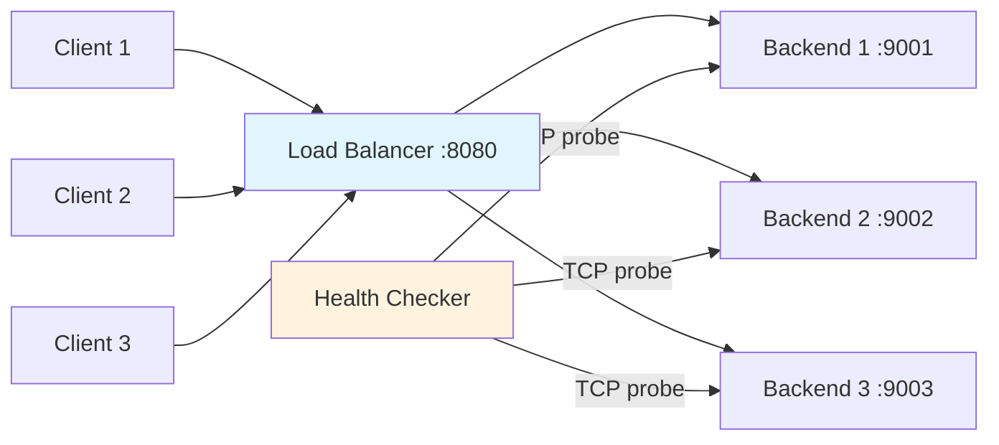
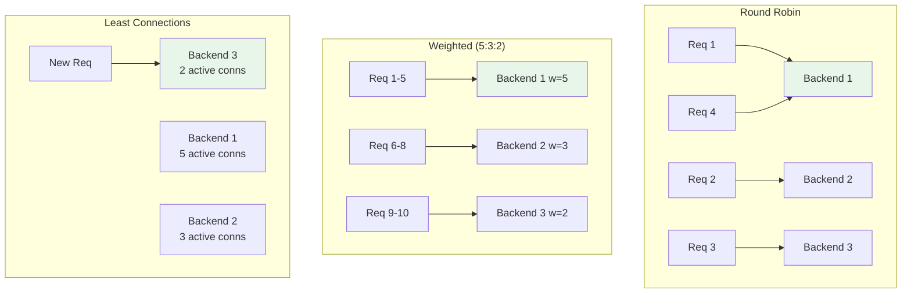
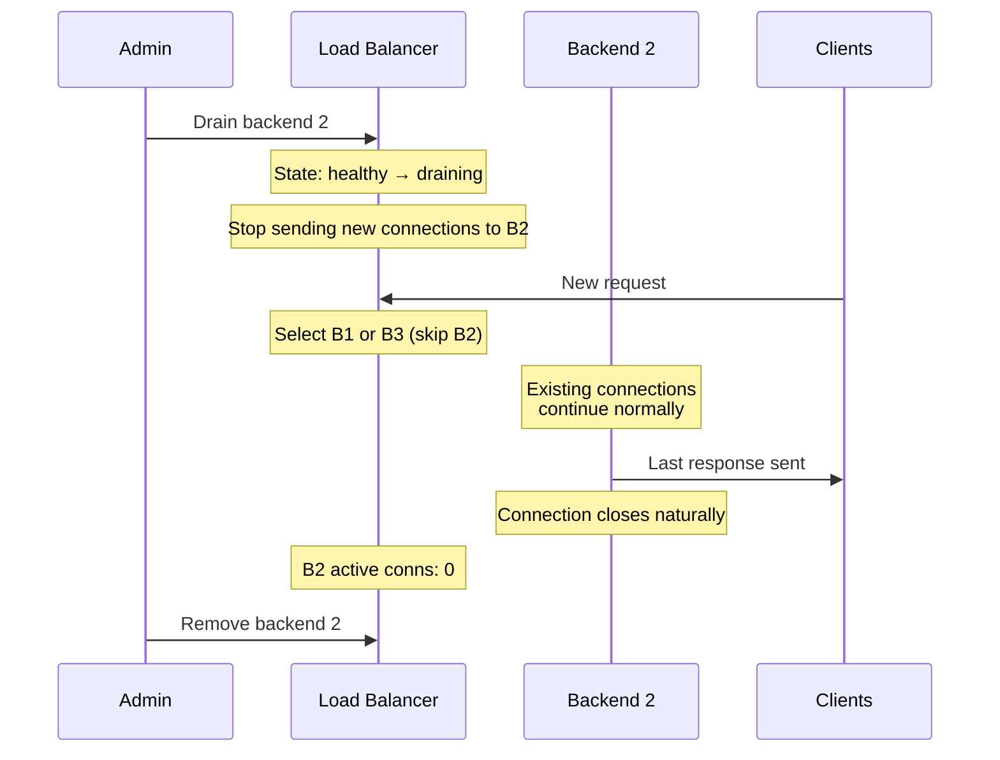

# Build a Load Balancer From Scratch

Every request you make on the internet passes through a load balancer. Google, Netflix, Stripe, your company's internal APIs — they all rely on load balancers to distribute traffic across backend servers. You are going to build one from scratch: a Layer 4 TCP proxy that distributes connections using three different algorithms, performs active health checks, drains connections gracefully, and handles the edge cases that make load balancing genuinely difficult.

## What We Are Building



**Features:**
- Layer 4 TCP proxying (protocol-agnostic — works with HTTP, gRPC, database connections, anything)
- Three algorithms: round-robin, weighted round-robin, least connections
- Active health checking with configurable intervals
- Connection draining on backend removal
- Graceful shutdown
- Runtime backend add/remove

## Part 1: Backend and Health Tracking

Each backend server has an address, a weight (for weighted algorithms), and health state.

```go
// backend.go
package loadbalancer

import (
	"fmt"
	"net"
	"sync"
	"sync/atomic"
	"time"
)

type BackendState int

const (
	StateHealthy BackendState = iota
	StateUnhealthy
	StateDraining
)

func (s BackendState) String() string {
	switch s {
	case StateHealthy:
		return "healthy"
	case StateUnhealthy:
		return "unhealthy"
	case StateDraining:
		return "draining"
	default:
		return "unknown"
	}
}

type Backend struct {
	Address     string
	Weight      int
	state       atomic.Int32
	activeConns atomic.Int64
	totalConns  atomic.Int64
	lastChecked time.Time
	mu          sync.RWMutex
}

func NewBackend(address string, weight int) *Backend {
	b := &Backend{
		Address: address,
		Weight:  weight,
	}
	b.state.Store(int32(StateHealthy))
	return b
}

func (b *Backend) State() BackendState {
	return BackendState(b.state.Load())
}

func (b *Backend) SetState(state BackendState) {
	old := BackendState(b.state.Swap(int32(state)))
	if old != state {
		fmt.Printf("[backend] %s: %s → %s\n", b.Address, old, state)
	}
}

func (b *Backend) IsAvailable() bool {
	state := b.State()
	return state == StateHealthy
}

func (b *Backend) ActiveConns() int64 {
	return b.activeConns.Load()
}

func (b *Backend) IncrConns() {
	b.activeConns.Add(1)
	b.totalConns.Add(1)
}

func (b *Backend) DecrConns() {
	b.activeConns.Add(-1)
}

func (b *Backend) TotalConns() int64 {
	return b.totalConns.Load()
}
```

## Part 2: Load Balancing Algorithms

We implement three algorithms behind a common interface.

```go
// algorithm.go
package loadbalancer

import (
	"sync"
	"sync/atomic"
)

// Algorithm selects a backend for a new connection.
type Algorithm interface {
	Select(backends []*Backend) *Backend
	Name() string
}

// --- Round Robin ---

type RoundRobin struct {
	counter atomic.Uint64
}

func NewRoundRobin() *RoundRobin {
	return &RoundRobin{}
}

func (rr *RoundRobin) Select(backends []*Backend) *Backend {
	available := filterAvailable(backends)
	if len(available) == 0 {
		return nil
	}

	idx := rr.counter.Add(1) - 1
	return available[idx%uint64(len(available))]
}

func (rr *RoundRobin) Name() string {
	return "round-robin"
}

// --- Weighted Round Robin ---

type WeightedRoundRobin struct {
	mu              sync.Mutex
	currentWeights  map[string]int
}

func NewWeightedRoundRobin() *WeightedRoundRobin {
	return &WeightedRoundRobin{
		currentWeights: make(map[string]int),
	}
}

func (wrr *WeightedRoundRobin) Select(backends []*Backend) *Backend {
	wrr.mu.Lock()
	defer wrr.mu.Unlock()

	available := filterAvailable(backends)
	if len(available) == 0 {
		return nil
	}

	// Smooth Weighted Round Robin (NGINX algorithm)
	// 1. Add each backend's weight to its current weight
	// 2. Select the backend with the highest current weight
	// 3. Subtract the total weight from the selected backend's current weight

	totalWeight := 0
	for _, b := range available {
		totalWeight += b.Weight
	}

	var selected *Backend
	maxWeight := -1

	for _, b := range available {
		// Initialize if not seen before
		if _, exists := wrr.currentWeights[b.Address]; !exists {
			wrr.currentWeights[b.Address] = 0
		}

		wrr.currentWeights[b.Address] += b.Weight

		if wrr.currentWeights[b.Address] > maxWeight {
			maxWeight = wrr.currentWeights[b.Address]
			selected = b
		}
	}

	if selected != nil {
		wrr.currentWeights[selected.Address] -= totalWeight
	}

	return selected
}

func (wrr *WeightedRoundRobin) Name() string {
	return "weighted-round-robin"
}

// --- Least Connections ---

type LeastConnections struct{}

func NewLeastConnections() *LeastConnections {
	return &LeastConnections{}
}

func (lc *LeastConnections) Select(backends []*Backend) *Backend {
	available := filterAvailable(backends)
	if len(available) == 0 {
		return nil
	}

	var selected *Backend
	minConns := int64(^uint64(0) >> 1) // max int64

	for _, b := range available {
		conns := b.ActiveConns()
		if conns < minConns {
			minConns = conns
			selected = b
		}
	}

	return selected
}

func (lc *LeastConnections) Name() string {
	return "least-connections"
}

// --- Helper ---

func filterAvailable(backends []*Backend) []*Backend {
	var available []*Backend
	for _, b := range backends {
		if b.IsAvailable() {
			available = append(available, b)
		}
	}
	return available
}
```

### Algorithm Comparison

| Algorithm | Distribution | Statefulness | Best For |
|---|---|---|---|
| Round Robin | Equal across all backends | Counter only | Homogeneous backends, stateless requests |
| Weighted Round Robin | Proportional to weights | Weights + current tracking | Mixed-capacity backends |
| Least Connections | Prefers least-loaded | Real-time connection count | Long-lived connections, variable processing time |



::: tip Smooth Weighted Round Robin
Our weighted round-robin uses the same algorithm as NGINX. Instead of sending 5 requests in a row to backend 1, it distributes them smoothly: given weights 5:3:2, the sequence is 1,1,2,1,3,1,2,1,3,2 — maximally spread out. This prevents burst loading.
:::

## Part 3: Health Checker

Active health checking probes each backend at regular intervals to detect failures before they affect traffic.

```go
// healthcheck.go
package loadbalancer

import (
	"fmt"
	"net"
	"sync"
	"time"
)

type HealthChecker struct {
	backends []*Backend
	interval time.Duration
	timeout  time.Duration
	mu       sync.RWMutex
	stopCh   chan struct{}

	// Consecutive failure/success thresholds
	unhealthyThreshold int
	healthyThreshold   int
	failureCounts      map[string]int
	successCounts      map[string]int
}

func NewHealthChecker(
	backends []*Backend,
	interval time.Duration,
	timeout time.Duration,
) *HealthChecker {
	return &HealthChecker{
		backends:           backends,
		interval:           interval,
		timeout:            timeout,
		stopCh:             make(chan struct{}),
		unhealthyThreshold: 3, // 3 consecutive failures → unhealthy
		healthyThreshold:   2, // 2 consecutive successes → healthy
		failureCounts:      make(map[string]int),
		successCounts:      make(map[string]int),
	}
}

func (hc *HealthChecker) Start() {
	go func() {
		ticker := time.NewTicker(hc.interval)
		defer ticker.Stop()

		// Initial check
		hc.checkAll()

		for {
			select {
			case <-ticker.C:
				hc.checkAll()
			case <-hc.stopCh:
				return
			}
		}
	}()
}

func (hc *HealthChecker) Stop() {
	close(hc.stopCh)
}

func (hc *HealthChecker) checkAll() {
	hc.mu.Lock()
	defer hc.mu.Unlock()

	for _, b := range hc.backends {
		if b.State() == StateDraining {
			continue // don't health check draining backends
		}

		healthy := hc.probe(b)

		if healthy {
			hc.failureCounts[b.Address] = 0
			hc.successCounts[b.Address]++

			if b.State() == StateUnhealthy &&
				hc.successCounts[b.Address] >= hc.healthyThreshold {
				b.SetState(StateHealthy)
			}
		} else {
			hc.successCounts[b.Address] = 0
			hc.failureCounts[b.Address]++

			if b.State() == StateHealthy &&
				hc.failureCounts[b.Address] >= hc.unhealthyThreshold {
				b.SetState(StateUnhealthy)
			}
		}
	}
}

func (hc *HealthChecker) probe(b *Backend) bool {
	conn, err := net.DialTimeout("tcp", b.Address, hc.timeout)
	if err != nil {
		return false
	}
	conn.Close()
	return true
}

func (hc *HealthChecker) UpdateBackends(backends []*Backend) {
	hc.mu.Lock()
	defer hc.mu.Unlock()
	hc.backends = backends
}
```

::: warning Why thresholds matter
A single failed health check should not remove a backend from rotation. Network blips, brief GC pauses, or a momentary CPU spike could cause a probe to fail. Requiring 3 consecutive failures ensures you only remove truly unhealthy backends. Similarly, requiring 2 consecutive successes before restoring prevents flapping — a backend that is failing intermittently should stay out of rotation.
:::

## Part 4: The TCP Proxy

The proxy is the core of the load balancer. It accepts incoming connections, selects a backend, and bidirectionally forwards data.

```go
// proxy.go
package loadbalancer

import (
	"fmt"
	"io"
	"net"
	"sync"
	"sync/atomic"
	"time"
)

type Proxy struct {
	listenAddr string
	backends   []*Backend
	algorithm  Algorithm
	health     *HealthChecker
	listener   net.Listener
	mu         sync.RWMutex
	activeConns atomic.Int64
	totalConns  atomic.Int64
	wg         sync.WaitGroup
	shutdown   chan struct{}
}

func NewProxy(
	listenAddr string,
	backends []*Backend,
	algorithm Algorithm,
) *Proxy {
	return &Proxy{
		listenAddr: listenAddr,
		backends:   backends,
		algorithm:  algorithm,
		shutdown:   make(chan struct{}),
	}
}

func (p *Proxy) Start() error {
	var err error
	p.listener, err = net.Listen("tcp", p.listenAddr)
	if err != nil {
		return err
	}

	// Start health checker
	p.health = NewHealthChecker(p.backends, 5*time.Second, 2*time.Second)
	p.health.Start()

	fmt.Printf("[proxy] listening on %s (algorithm: %s)\n",
		p.listenAddr, p.algorithm.Name())
	fmt.Printf("[proxy] backends: ")
	for _, b := range p.backends {
		fmt.Printf("%s(w=%d) ", b.Address, b.Weight)
	}
	fmt.Println()

	go p.acceptLoop()

	return nil
}

func (p *Proxy) acceptLoop() {
	for {
		conn, err := p.listener.Accept()
		if err != nil {
			select {
			case <-p.shutdown:
				return
			default:
				fmt.Printf("[proxy] accept error: %v\n", err)
				continue
			}
		}

		p.wg.Add(1)
		go p.handleConnection(conn)
	}
}

func (p *Proxy) handleConnection(clientConn net.Conn) {
	defer p.wg.Done()
	defer clientConn.Close()

	p.activeConns.Add(1)
	p.totalConns.Add(1)
	defer p.activeConns.Add(-1)

	// Select a backend
	p.mu.RLock()
	backend := p.algorithm.Select(p.backends)
	p.mu.RUnlock()

	if backend == nil {
		fmt.Printf("[proxy] no available backends for %s\n",
			clientConn.RemoteAddr())
		return
	}

	// Connect to backend
	backendConn, err := net.DialTimeout("tcp", backend.Address, 5*time.Second)
	if err != nil {
		fmt.Printf("[proxy] failed to connect to %s: %v\n",
			backend.Address, err)
		// Mark unhealthy immediately on connection failure
		backend.SetState(StateUnhealthy)
		return
	}
	defer backendConn.Close()

	backend.IncrConns()
	defer backend.DecrConns()

	fmt.Printf("[proxy] %s → %s\n",
		clientConn.RemoteAddr(), backend.Address)

	// Bidirectional copy
	// We need to copy in both directions simultaneously
	done := make(chan struct{}, 2)

	// Client → Backend
	go func() {
		io.Copy(backendConn, clientConn)
		// Signal that client is done sending
		if tc, ok := backendConn.(*net.TCPConn); ok {
			tc.CloseWrite()
		}
		done <- struct{}{}
	}()

	// Backend → Client
	go func() {
		io.Copy(clientConn, backendConn)
		if tc, ok := clientConn.(*net.TCPConn); ok {
			tc.CloseWrite()
		}
		done <- struct{}{}
	}()

	// Wait for both directions to complete
	<-done
	<-done
}

// Drain initiates connection draining for a backend.
// New connections will not be sent to it, but existing ones are allowed to finish.
func (p *Proxy) Drain(address string) {
	p.mu.Lock()
	defer p.mu.Unlock()

	for _, b := range p.backends {
		if b.Address == address {
			b.SetState(StateDraining)
			fmt.Printf("[proxy] draining %s (%d active connections)\n",
				address, b.ActiveConns())
			return
		}
	}
}

// AddBackend adds a new backend at runtime.
func (p *Proxy) AddBackend(address string, weight int) {
	p.mu.Lock()
	defer p.mu.Unlock()

	b := NewBackend(address, weight)
	p.backends = append(p.backends, b)
	p.health.UpdateBackends(p.backends)

	fmt.Printf("[proxy] added backend %s (weight=%d)\n", address, weight)
}

// GracefulShutdown stops accepting new connections and waits for
// existing ones to complete (up to a timeout).
func (p *Proxy) GracefulShutdown(timeout time.Duration) {
	fmt.Println("[proxy] initiating graceful shutdown...")

	close(p.shutdown)
	p.listener.Close()
	p.health.Stop()

	// Wait for active connections with timeout
	done := make(chan struct{})
	go func() {
		p.wg.Wait()
		close(done)
	}()

	select {
	case <-done:
		fmt.Println("[proxy] all connections closed")
	case <-time.After(timeout):
		fmt.Printf("[proxy] shutdown timeout — %d connections forcefully closed\n",
			p.activeConns.Load())
	}
}

// Stats returns current proxy statistics.
func (p *Proxy) Stats() map[string]interface{} {
	p.mu.RLock()
	defer p.mu.RUnlock()

	backendStats := make([]map[string]interface{}, len(p.backends))
	for i, b := range p.backends {
		backendStats[i] = map[string]interface{}{
			"address":     b.Address,
			"weight":      b.Weight,
			"state":       b.State().String(),
			"activeConns": b.ActiveConns(),
			"totalConns":  b.TotalConns(),
		}
	}

	return map[string]interface{}{
		"listenAddr":  p.listenAddr,
		"algorithm":   p.algorithm.Name(),
		"activeConns": p.activeConns.Load(),
		"totalConns":  p.totalConns.Load(),
		"backends":    backendStats,
	}
}
```

## Part 5: Main Entry Point

```go
// main.go
package main

import (
	"fmt"
	"os"
	"os/signal"
	"syscall"
	"time"

	lb "github.com/your-username/loadbalancer"
)

func main() {
	backends := []*lb.Backend{
		lb.NewBackend("localhost:9001", 5),
		lb.NewBackend("localhost:9002", 3),
		lb.NewBackend("localhost:9003", 2),
	}

	// Choose your algorithm:
	// algorithm := lb.NewRoundRobin()
	// algorithm := lb.NewWeightedRoundRobin()
	algorithm := lb.NewLeastConnections()

	proxy := lb.NewProxy(":8080", backends, algorithm)

	if err := proxy.Start(); err != nil {
		fmt.Fprintf(os.Stderr, "Failed to start: %v\n", err)
		os.Exit(1)
	}

	// Wait for interrupt signal
	sigCh := make(chan os.Signal, 1)
	signal.Notify(sigCh, syscall.SIGINT, syscall.SIGTERM)
	<-sigCh

	proxy.GracefulShutdown(30 * time.Second)
}
```

## Part 6: Testing

### Simple Backend Server for Testing

```go
// testserver/main.go
package main

import (
	"fmt"
	"net"
	"os"
)

func main() {
	port := os.Args[1]
	listener, err := net.Listen("tcp", ":"+port)
	if err != nil {
		fmt.Fprintf(os.Stderr, "Failed to listen: %v\n", err)
		os.Exit(1)
	}
	defer listener.Close()

	fmt.Printf("Test backend listening on :%s\n", port)

	for {
		conn, err := listener.Accept()
		if err != nil {
			continue
		}

		go func(c net.Conn) {
			defer c.Close()
			buf := make([]byte, 4096)
			for {
				n, err := c.Read(buf)
				if err != nil {
					return
				}
				// Echo back with server identification
				response := fmt.Sprintf("[server:%s] %s", port, string(buf[:n]))
				c.Write([]byte(response))
			}
		}(conn)
	}
}
```

### Manual Testing

```bash
# Terminal 1, 2, 3: Start backends
go run testserver/main.go 9001
go run testserver/main.go 9002
go run testserver/main.go 9003

# Terminal 4: Start load balancer
go run main.go

# Terminal 5: Test with netcat
echo "hello" | nc localhost 8080
# Output: [server:9001] hello

echo "hello" | nc localhost 8080
# Output: [server:9002] hello

echo "hello" | nc localhost 8080
# Output: [server:9003] hello

# Test with curl (if backends speak HTTP)
for i in {1..10}; do curl -s http://localhost:8080/ ; echo ; done
```

### Testing Health Checks

```bash
# Kill backend 2
# Watch the load balancer output:
# [backend] localhost:9002: healthy → unhealthy
# (after 3 consecutive failed health checks)

# All traffic now goes to backends 1 and 3
echo "hello" | nc localhost 8080
# Output: [server:9001] hello (never 9002)

# Restart backend 2
go run testserver/main.go 9002
# [backend] localhost:9002: unhealthy → healthy
# (after 2 consecutive successful health checks)
```

## Connection Draining Deep Dive

Connection draining is what separates a toy load balancer from a production one. When you need to remove a backend (for deployment, maintenance, or scaling down), you cannot just drop its connections. Active requests would fail.



::: tip Drain timeout
In production, you should enforce a maximum drain duration. If connections have not closed after 30 seconds (or whatever your timeout is), force-close them. Otherwise, a single long-lived connection (WebSocket, database connection, gRPC stream) could prevent the backend from ever being removed.
:::

## How Production Load Balancers Differ

| Feature | Our Implementation | HAProxy / NGINX / Envoy |
|---|---|---|
| Layer | L4 (TCP) | L4 and L7 (HTTP-aware) |
| Protocols | TCP only | HTTP/1.1, HTTP/2, gRPC, WebSocket, TCP |
| SSL/TLS | Not handled | Full TLS termination, SNI, OCSP stapling |
| Health checks | TCP connect | TCP, HTTP, gRPC, script-based |
| Config reload | Code change | Zero-downtime config reload |
| Observability | Printf | Prometheus metrics, access logs, tracing |
| Performance | Thousands of connections | Millions of connections (epoll, io_uring) |
| Session affinity | Not implemented | Cookie-based, header-based, IP hash |
| Connection pooling | No pooling | Keep-alive pools to backends |
| Retries | No retries | Configurable retry with budget |

## Cross-References

- [Load Balancing Overview](/system-design/load-balancing/) — L4 vs L7, algorithms deep dive, session affinity
- [Health Checks](/system-design/load-balancing/health-checks) — production health check patterns
- [NGINX Config](/system-design/load-balancing/nginx-config) — configuring a production L7 load balancer
- [HAProxy Config](/system-design/load-balancing/haproxy-config) — configuring a production L4/L7 load balancer
- [TCP/IP Deep Dive](/system-design/networking/tcp-ip-deep-dive) — understand what is happening at the transport layer

::: danger This is a learning implementation
Our load balancer is single-process, uses goroutine-per-connection, and has no TLS support. Production load balancers handle millions of concurrent connections using epoll/kqueue directly, support hot config reload, provide detailed metrics, and have been battle-tested for decades. But now you understand the core mechanics — and when you debug a production load balancer issue, you will know exactly how the pieces fit together.
:::

## What You Have Built

You now have a working Layer 4 load balancer with three algorithms, health checking, and connection draining. You understand why least-connections outperforms round-robin for heterogeneous workloads, why health check thresholds prevent flapping, and why connection draining is essential for zero-downtime deployments. These are concepts you will use every day as a backend engineer.
