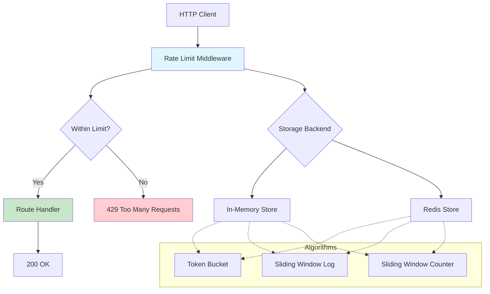
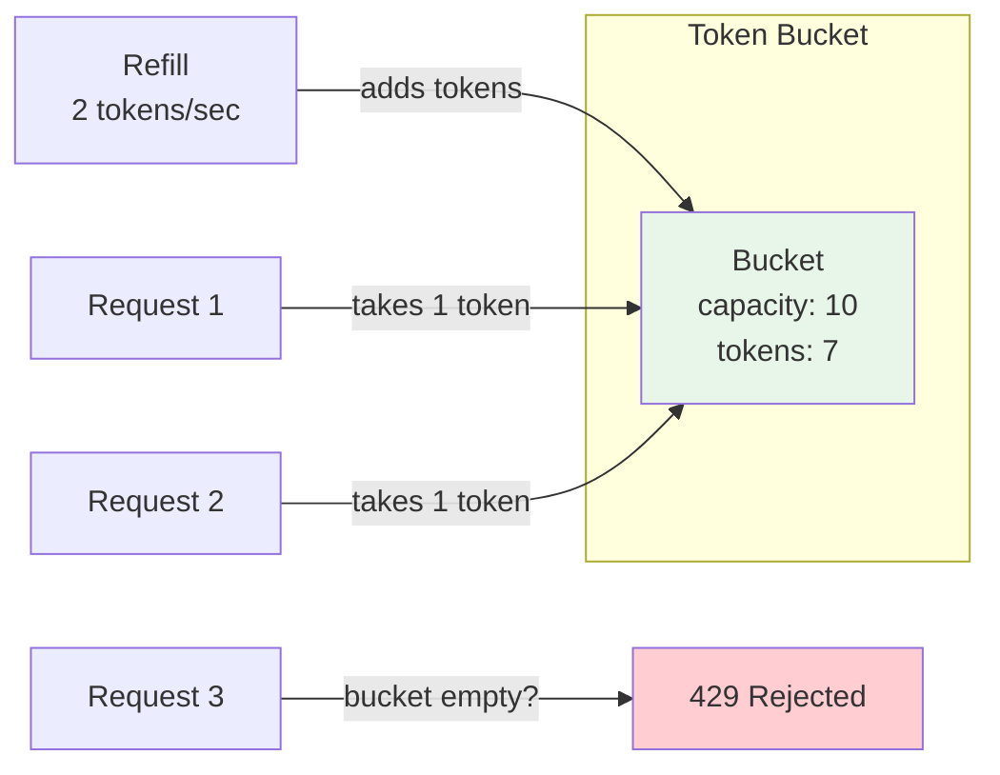
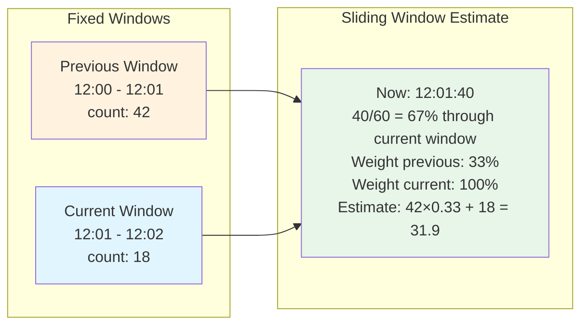

# Build a Rate Limiter From Scratch

Rate limiting is the bouncer at the door of every API. It decides who gets in, how fast, and what happens when someone tries to rush past. Every major API — Stripe, GitHub, Twitter, OpenAI — uses rate limiting to protect their infrastructure, enforce fair usage, and prevent abuse. You are going to build three different rate limiting algorithms, wire them into HTTP middleware, and then scale them up with Redis for distributed deployments.

## Why Rate Limiting Matters

Without rate limiting, a single misbehaving client can:

- **Exhaust server resources** — CPU, memory, database connections, file descriptors
- **Starve other users** — one client consuming all capacity means everyone else gets errors
- **Enable brute force attacks** — unlimited login attempts, credential stuffing
- **Cause cascading failures** — overwhelming one service causes it to overwhelm its dependencies
- **Run up costs** — unlimited API calls to expensive downstream services (LLMs, payment processors)

::: tip The rate limiter is not optional
It is tempting to think "we don't need rate limiting yet." You do. The first time a bot discovers your API, or a customer's buggy integration sends 10,000 requests per second, you will wish you had built it from day one.
:::

## Architecture Overview



## Algorithm 1: Token Bucket

The token bucket is the most widely used rate limiting algorithm. Imagine a bucket that holds tokens. Tokens are added at a fixed rate. Each request costs one token. If the bucket is empty, the request is rejected. The bucket has a maximum capacity, so tokens do not accumulate indefinitely.

### How It Works



**Properties:**
- Allows short bursts up to bucket capacity
- Smooth long-term rate enforcement
- Simple to implement and reason about
- Used by: AWS API Gateway, Stripe, most CDNs

### Implementation

```typescript
// token-bucket.ts

interface TokenBucketState {
  tokens: number;
  lastRefillTime: number;
}

export class TokenBucket {
  private buckets = new Map<string, TokenBucketState>();

  constructor(
    private maxTokens: number,      // bucket capacity
    private refillRate: number,     // tokens added per second
  ) {}

  /**
   * Try to consume a token for the given key.
   * Returns { allowed, remaining, retryAfterMs }
   */
  tryConsume(key: string): {
    allowed: boolean;
    remaining: number;
    retryAfterMs: number;
  } {
    const now = Date.now();
    let bucket = this.buckets.get(key);

    if (!bucket) {
      // First request — full bucket
      bucket = { tokens: this.maxTokens, lastRefillTime: now };
      this.buckets.set(key, bucket);
    }

    // Calculate tokens to add since last refill
    const elapsed = (now - bucket.lastRefillTime) / 1000;
    const tokensToAdd = elapsed * this.refillRate;

    // Refill (cap at maxTokens)
    bucket.tokens = Math.min(this.maxTokens, bucket.tokens + tokensToAdd);
    bucket.lastRefillTime = now;

    if (bucket.tokens >= 1) {
      // Consume a token
      bucket.tokens -= 1;
      return {
        allowed: true,
        remaining: Math.floor(bucket.tokens),
        retryAfterMs: 0,
      };
    }

    // No tokens available
    const msUntilNextToken = ((1 - bucket.tokens) / this.refillRate) * 1000;
    return {
      allowed: false,
      remaining: 0,
      retryAfterMs: Math.ceil(msUntilNextToken),
    };
  }

  /** Remove stale entries to prevent memory leaks */
  cleanup(maxAgeMs: number = 60_000): void {
    const cutoff = Date.now() - maxAgeMs;
    for (const [key, bucket] of this.buckets) {
      if (bucket.lastRefillTime < cutoff) {
        this.buckets.delete(key);
      }
    }
  }
}
```

::: warning Memory management
The in-memory store grows unbounded as new clients appear. In production, you need periodic cleanup of stale entries. Our `cleanup()` method handles this, but you need to call it on an interval — or use Redis with automatic key expiry.
:::

## Algorithm 2: Sliding Window Log

The sliding window log keeps a timestamp for every request. To check the rate, it counts how many timestamps fall within the current window. This gives perfectly accurate rate limiting with no boundary artifacts, at the cost of storing every request timestamp.

### How It Works

```
Window: last 60 seconds
Max requests: 5

Timeline:
|-------- 60 second window --------|
   t1   t2       t3   t4    t5     NOW → t6 arrives
   ✓    ✓        ✓    ✓     ✓      ✗ (5 in window, reject)

After t1 slides out of window:
      |-------- 60 second window --------|
        t2       t3   t4    t5     t6     NOW → t7 arrives
        ✓        ✓    ✓     ✓      ✓      ✗ (still 5)
```

### Implementation

```typescript
// sliding-window-log.ts

export class SlidingWindowLog {
  private logs = new Map<string, number[]>();

  constructor(
    private windowMs: number,    // window size in milliseconds
    private maxRequests: number, // max requests per window
  ) {}

  tryConsume(key: string): {
    allowed: boolean;
    remaining: number;
    retryAfterMs: number;
  } {
    const now = Date.now();
    const windowStart = now - this.windowMs;

    // Get or create the log for this key
    let timestamps = this.logs.get(key);
    if (!timestamps) {
      timestamps = [];
      this.logs.set(key, timestamps);
    }

    // Remove timestamps outside the window
    // Since timestamps are ordered, find the first one inside the window
    let firstValid = 0;
    while (firstValid < timestamps.length && timestamps[firstValid] <= windowStart) {
      firstValid++;
    }
    if (firstValid > 0) {
      timestamps.splice(0, firstValid);
    }

    // Check if within limit
    if (timestamps.length < this.maxRequests) {
      timestamps.push(now);
      return {
        allowed: true,
        remaining: this.maxRequests - timestamps.length,
        retryAfterMs: 0,
      };
    }

    // Rejected — calculate when the oldest entry will slide out
    const oldestInWindow = timestamps[0];
    const retryAfterMs = oldestInWindow + this.windowMs - now;

    return {
      allowed: false,
      remaining: 0,
      retryAfterMs: Math.max(0, Math.ceil(retryAfterMs)),
    };
  }

  cleanup(maxAgeMs: number = 120_000): void {
    const cutoff = Date.now() - maxAgeMs;
    for (const [key, timestamps] of this.logs) {
      if (timestamps.length === 0 || timestamps[timestamps.length - 1] < cutoff) {
        this.logs.delete(key);
      }
    }
  }
}
```

::: danger Memory cost
The sliding window log stores one timestamp per request. At 1000 requests/second per client, that is 60,000 timestamps per client per minute. With 10,000 clients, you are storing 600 million timestamps. This is why the sliding window log is rarely used for high-volume rate limiting — the sliding window counter (next algorithm) solves this.
:::

## Algorithm 3: Sliding Window Counter

The sliding window counter combines the accuracy of the sliding window with the memory efficiency of fixed windows. It maintains counters for the current and previous fixed windows, then estimates the count in the sliding window using a weighted average.

### How It Works



### Implementation

```typescript
// sliding-window-counter.ts

interface WindowCounter {
  currentCount: number;
  previousCount: number;
  currentWindowStart: number;
}

export class SlidingWindowCounter {
  private counters = new Map<string, WindowCounter>();

  constructor(
    private windowMs: number,
    private maxRequests: number,
  ) {}

  tryConsume(key: string): {
    allowed: boolean;
    remaining: number;
    retryAfterMs: number;
  } {
    const now = Date.now();
    const currentWindowStart = Math.floor(now / this.windowMs) * this.windowMs;

    let counter = this.counters.get(key);

    if (!counter) {
      counter = {
        currentCount: 0,
        previousCount: 0,
        currentWindowStart,
      };
      this.counters.set(key, counter);
    }

    // Roll windows forward if needed
    if (currentWindowStart !== counter.currentWindowStart) {
      const windowsElapsed = Math.floor(
        (currentWindowStart - counter.currentWindowStart) / this.windowMs
      );

      if (windowsElapsed === 1) {
        // Current becomes previous
        counter.previousCount = counter.currentCount;
        counter.currentCount = 0;
      } else {
        // More than one window elapsed — previous is gone
        counter.previousCount = 0;
        counter.currentCount = 0;
      }
      counter.currentWindowStart = currentWindowStart;
    }

    // Calculate weighted estimate
    const elapsedInCurrentWindow = now - currentWindowStart;
    const previousWeight = 1 - elapsedInCurrentWindow / this.windowMs;
    const estimatedCount =
      counter.previousCount * previousWeight + counter.currentCount;

    if (estimatedCount < this.maxRequests) {
      counter.currentCount++;
      const newEstimate =
        counter.previousCount * previousWeight + counter.currentCount;
      return {
        allowed: true,
        remaining: Math.max(0, Math.floor(this.maxRequests - newEstimate)),
        retryAfterMs: 0,
      };
    }

    // Rejected
    const retryAfterMs = this.windowMs - elapsedInCurrentWindow;
    return {
      allowed: false,
      remaining: 0,
      retryAfterMs: Math.ceil(retryAfterMs),
    };
  }

  cleanup(maxAgeMs: number = 120_000): void {
    const cutoff = Date.now() - maxAgeMs;
    for (const [key, counter] of this.counters) {
      if (counter.currentWindowStart + this.windowMs < cutoff) {
        this.counters.delete(key);
      }
    }
  }
}
```

## Algorithm Comparison

| Property | Token Bucket | Sliding Window Log | Sliding Window Counter |
|---|---|---|---|
| Memory per client | O(1) | O(N) per window | O(1) |
| Accuracy | Allows bursts up to capacity | Exact | ~99.7% accurate |
| Burst handling | Explicit (bucket capacity) | No bursts | Minimal |
| Implementation | Simple | Simple | Moderate |
| Best for | APIs with burst tolerance | Low-volume, precise limits | High-volume, memory-conscious |
| Used by | Stripe, AWS | Logging systems | Cloudflare, Redis official |

## Redis-Backed Sliding Window Counter

For distributed systems with multiple application servers, you need a shared rate limit store. Redis is the standard choice because it is fast, atomic, and supports key expiry.

```typescript
// redis-sliding-window.ts

import { createClient, type RedisClientType } from 'redis';

export class RedisSlidingWindowCounter {
  private client: RedisClientType;

  constructor(
    private windowMs: number,
    private maxRequests: number,
    redisUrl: string = 'redis://localhost:6379',
  ) {
    this.client = createClient({ url: redisUrl });
  }

  async connect(): Promise<void> {
    await this.client.connect();
  }

  async tryConsume(key: string): Promise<{
    allowed: boolean;
    remaining: number;
    retryAfterMs: number;
  }> {
    const now = Date.now();
    const currentWindow = Math.floor(now / this.windowMs) * this.windowMs;
    const previousWindow = currentWindow - this.windowMs;

    const currentKey = `ratelimit:${key}:${currentWindow}`;
    const previousKey = `ratelimit:${key}:${previousWindow}`;

    // Use a Lua script for atomicity
    // This is critical — without atomicity, concurrent requests
    // can both read the count, both see it as under the limit,
    // and both increment, exceeding the limit.
    const luaScript = `
      local currentKey = KEYS[1]
      local previousKey = KEYS[2]
      local maxRequests = tonumber(ARGV[1])
      local windowMs = tonumber(ARGV[2])
      local now = tonumber(ARGV[3])
      local currentWindow = tonumber(ARGV[4])
      local ttlSec = math.ceil(windowMs / 1000) * 2

      local currentCount = tonumber(redis.call('GET', currentKey) or '0')
      local previousCount = tonumber(redis.call('GET', previousKey) or '0')

      local elapsedMs = now - currentWindow
      local previousWeight = 1 - (elapsedMs / windowMs)
      local estimate = previousCount * previousWeight + currentCount

      if estimate >= maxRequests then
        local retryAfterMs = windowMs - elapsedMs
        return {0, 0, retryAfterMs}
      end

      redis.call('INCR', currentKey)
      redis.call('EXPIRE', currentKey, ttlSec)

      local newEstimate = previousCount * previousWeight + currentCount + 1
      local remaining = maxRequests - newEstimate

      return {1, math.max(0, math.floor(remaining)), 0}
    `;

    const result = await this.client.eval(luaScript, {
      keys: [currentKey, previousKey],
      arguments: [
        this.maxRequests.toString(),
        this.windowMs.toString(),
        now.toString(),
        currentWindow.toString(),
      ],
    }) as number[];

    return {
      allowed: result[0] === 1,
      remaining: result[1],
      retryAfterMs: result[2],
    };
  }

  async disconnect(): Promise<void> {
    await this.client.disconnect();
  }
}
```

::: tip Why Lua scripts?
Redis executes Lua scripts atomically — no other command can run between the GET and INCR. Without this atomicity, two concurrent requests could both read the count as 99 (limit 100), both increment to 100, and both succeed — allowing 101 requests through. The Lua script makes the check-and-increment a single atomic operation.
:::

## Express Middleware

Now let's wire the rate limiter into an Express application.

```typescript
// middleware/express-rate-limit.ts

import { Request, Response, NextFunction } from 'express';
import { TokenBucket } from '../token-bucket';
import { SlidingWindowCounter } from '../sliding-window-counter';

type Algorithm = 'token-bucket' | 'sliding-window';

interface RateLimitOptions {
  algorithm?: Algorithm;
  windowMs?: number;         // for sliding window
  maxRequests?: number;      // for sliding window
  maxTokens?: number;        // for token bucket
  refillRate?: number;       // for token bucket (tokens/sec)
  keyGenerator?: (req: Request) => string;
  message?: string;
  headers?: boolean;         // include rate limit headers
}

export function rateLimitMiddleware(options: RateLimitOptions = {}) {
  const {
    algorithm = 'sliding-window',
    windowMs = 60_000,
    maxRequests = 100,
    maxTokens = 10,
    refillRate = 2,
    keyGenerator = (req) => req.ip || 'unknown',
    message = 'Too many requests, please try again later.',
    headers = true,
  } = options;

  // Create the appropriate limiter
  const tokenBucket = algorithm === 'token-bucket'
    ? new TokenBucket(maxTokens, refillRate)
    : null;
  const slidingWindow = algorithm === 'sliding-window'
    ? new SlidingWindowCounter(windowMs, maxRequests)
    : null;

  // Periodic cleanup every 60 seconds
  setInterval(() => {
    tokenBucket?.cleanup();
    slidingWindow?.cleanup();
  }, 60_000);

  return (req: Request, res: Response, next: NextFunction): void => {
    const key = keyGenerator(req);

    const result = tokenBucket
      ? tokenBucket.tryConsume(key)
      : slidingWindow!.tryConsume(key);

    // Set standard rate limit headers (RFC 6585, draft-ietf-httpapi-ratelimit-headers)
    if (headers) {
      const limit = algorithm === 'token-bucket' ? maxTokens : maxRequests;
      res.setHeader('RateLimit-Limit', limit);
      res.setHeader('RateLimit-Remaining', result.remaining);

      if (!result.allowed) {
        res.setHeader('Retry-After', Math.ceil(result.retryAfterMs / 1000));
        res.setHeader(
          'RateLimit-Reset',
          Math.ceil((Date.now() + result.retryAfterMs) / 1000)
        );
      }
    }

    if (!result.allowed) {
      res.status(429).json({
        error: 'rate_limit_exceeded',
        message,
        retryAfterMs: result.retryAfterMs,
      });
      return;
    }

    next();
  };
}
```

### Usage in Express

```typescript
// app.ts

import express from 'express';
import { rateLimitMiddleware } from './middleware/express-rate-limit';

const app = express();

// Global rate limit: 100 requests per minute per IP
app.use(rateLimitMiddleware({
  algorithm: 'sliding-window',
  windowMs: 60_000,
  maxRequests: 100,
}));

// Stricter limit for auth endpoints
app.use('/api/auth', rateLimitMiddleware({
  algorithm: 'token-bucket',
  maxTokens: 5,
  refillRate: 0.1, // 1 token every 10 seconds
  message: 'Too many login attempts. Please wait before trying again.',
}));

// Per-API-key rate limiting
app.use('/api/v1', rateLimitMiddleware({
  algorithm: 'sliding-window',
  windowMs: 60_000,
  maxRequests: 1000,
  keyGenerator: (req) => req.headers['x-api-key'] as string || req.ip || 'anon',
}));

app.get('/api/health', (req, res) => {
  res.json({ status: 'ok' });
});

app.post('/api/auth/login', (req, res) => {
  res.json({ token: 'jwt-token-here' });
});

app.listen(3000, () => {
  console.log('Server running on port 3000');
});
```

## Fastify Plugin

Fastify uses a plugin-based architecture with hooks instead of middleware.

```typescript
// middleware/fastify-rate-limit.ts

import {
  FastifyPluginAsync,
  FastifyRequest,
  FastifyReply,
} from 'fastify';
import fp from 'fastify-plugin';
import { SlidingWindowCounter } from '../sliding-window-counter';

interface FastifyRateLimitOptions {
  windowMs?: number;
  maxRequests?: number;
  keyGenerator?: (req: FastifyRequest) => string;
}

const rateLimitPlugin: FastifyPluginAsync<FastifyRateLimitOptions> = async (
  fastify,
  options
) => {
  const {
    windowMs = 60_000,
    maxRequests = 100,
    keyGenerator = (req) => req.ip,
  } = options;

  const limiter = new SlidingWindowCounter(windowMs, maxRequests);

  // Cleanup timer
  const cleanupTimer = setInterval(() => limiter.cleanup(), 60_000);
  fastify.addHook('onClose', () => clearInterval(cleanupTimer));

  fastify.addHook(
    'onRequest',
    async (request: FastifyRequest, reply: FastifyReply) => {
      const key = keyGenerator(request);
      const result = limiter.tryConsume(key);

      reply.header('RateLimit-Limit', maxRequests);
      reply.header('RateLimit-Remaining', result.remaining);

      if (!result.allowed) {
        reply.header('Retry-After', Math.ceil(result.retryAfterMs / 1000));
        reply.status(429).send({
          error: 'rate_limit_exceeded',
          retryAfterMs: result.retryAfterMs,
        });
      }
    }
  );
};

export default fp(rateLimitPlugin, {
  name: 'rate-limit',
  fastify: '5.x',
});
```

### Usage in Fastify

```typescript
// fastify-app.ts

import Fastify from 'fastify';
import rateLimitPlugin from './middleware/fastify-rate-limit';

const app = Fastify({ logger: true });

app.register(rateLimitPlugin, {
  windowMs: 60_000,
  maxRequests: 100,
});

app.get('/api/data', async (request, reply) => {
  return { data: 'here it is' };
});

app.listen({ port: 3000 });
```

## Testing Your Rate Limiter

### Manual Testing with curl

```bash
# Send 5 requests quickly
for i in {1..5}; do
  echo "Request $i:"
  curl -s -o /dev/null -w "HTTP %{http_code}" http://localhost:3000/api/health
  echo ""
done

# Check response headers
curl -v http://localhost:3000/api/health 2>&1 | grep -i ratelimit
# RateLimit-Limit: 100
# RateLimit-Remaining: 95
```

### Automated Tests

```typescript
// rate-limiter.test.ts

import { TokenBucket } from './token-bucket';
import { SlidingWindowLog } from './sliding-window-log';
import { SlidingWindowCounter } from './sliding-window-counter';

describe('TokenBucket', () => {
  it('should allow requests within capacity', () => {
    const bucket = new TokenBucket(5, 1); // 5 tokens, 1/sec refill

    for (let i = 0; i < 5; i++) {
      const result = bucket.tryConsume('user:1');
      expect(result.allowed).toBe(true);
    }

    // 6th request should fail
    const result = bucket.tryConsume('user:1');
    expect(result.allowed).toBe(false);
    expect(result.retryAfterMs).toBeGreaterThan(0);
  });

  it('should refill tokens over time', async () => {
    const bucket = new TokenBucket(2, 10); // 2 tokens, 10/sec refill

    // Drain
    bucket.tryConsume('user:1');
    bucket.tryConsume('user:1');
    expect(bucket.tryConsume('user:1').allowed).toBe(false);

    // Wait 200ms — should refill ~2 tokens
    await new Promise((resolve) => setTimeout(resolve, 200));

    expect(bucket.tryConsume('user:1').allowed).toBe(true);
  });

  it('should isolate keys', () => {
    const bucket = new TokenBucket(1, 1);

    expect(bucket.tryConsume('user:1').allowed).toBe(true);
    expect(bucket.tryConsume('user:1').allowed).toBe(false);

    // Different key should still have tokens
    expect(bucket.tryConsume('user:2').allowed).toBe(true);
  });
});

describe('SlidingWindowCounter', () => {
  it('should enforce the limit across the window', () => {
    const counter = new SlidingWindowCounter(1000, 3); // 3 req per second

    expect(counter.tryConsume('user:1').allowed).toBe(true);
    expect(counter.tryConsume('user:1').allowed).toBe(true);
    expect(counter.tryConsume('user:1').allowed).toBe(true);
    expect(counter.tryConsume('user:1').allowed).toBe(false);
  });
});
```

## Rate Limiting Patterns in Production

### Pattern 1: Tiered Limits

Different API tiers get different limits:

```typescript
const TIER_LIMITS: Record<string, { windowMs: number; maxRequests: number }> = {
  free:       { windowMs: 60_000, maxRequests: 60 },
  pro:        { windowMs: 60_000, maxRequests: 600 },
  enterprise: { windowMs: 60_000, maxRequests: 6000 },
};

app.use('/api', rateLimitMiddleware({
  keyGenerator: (req) => {
    const apiKey = req.headers['x-api-key'] as string;
    return apiKey || req.ip || 'anon';
  },
  // Look up tier from API key, default to 'free'
  maxRequests: 60, // dynamic lookup in real implementation
}));
```

### Pattern 2: Endpoint-Specific Limits

```typescript
// Expensive endpoints get stricter limits
app.post('/api/generate', rateLimitMiddleware({
  maxRequests: 10,
  windowMs: 60_000,
  keyGenerator: (req) => `generate:${req.headers['x-api-key']}`,
}));

// Read endpoints are more generous
app.get('/api/data/:id', rateLimitMiddleware({
  maxRequests: 1000,
  windowMs: 60_000,
}));
```

### Pattern 3: Retry-After Header

Always include the `Retry-After` header in 429 responses. Well-behaved clients will respect it:

```
HTTP/1.1 429 Too Many Requests
Retry-After: 30
RateLimit-Limit: 100
RateLimit-Remaining: 0
RateLimit-Reset: 1711036800

{
  "error": "rate_limit_exceeded",
  "message": "Rate limit exceeded. Retry after 30 seconds.",
  "retryAfterMs": 30000
}
```

## How Production Systems Do It

| System | Algorithm | Storage | Notes |
|---|---|---|---|
| Stripe | Token bucket | In-memory per node | Per-API-key limits, generous burst |
| Cloudflare | Sliding window | Distributed | Edge-computed, sub-millisecond |
| GitHub API | Fixed window | Redis | 5000 req/hour for authenticated |
| AWS API Gateway | Token bucket | Per-stage | Configurable burst and rate |
| Nginx | Leaky bucket | Shared memory zone | `limit_req` module |
| Kong | Multiple | Redis/in-memory | Plugin-based, configurable |

::: tip Going further
Rate limiting is a subset of the broader traffic management problem. For the full picture, see [Rate Limiting](/system-design/distributed-systems/rate-limiting) for distributed rate limiting algorithms like GCRA and the challenges of coordinating limits across multiple nodes. See [Load Balancing](/system-design/load-balancing/) for how rate limiting interacts with traffic distribution.
:::

## What We Built

You now have three rate limiting algorithms, each with different trade-offs. You have wired them into real HTTP frameworks. And you have seen how Redis can turn a single-node rate limiter into a distributed one. The next project, [Build a Key-Value Store From Scratch](/build-from-scratch/key-value-store), takes you deeper into the storage layer — you will build the same kind of engine that powers Redis itself.
