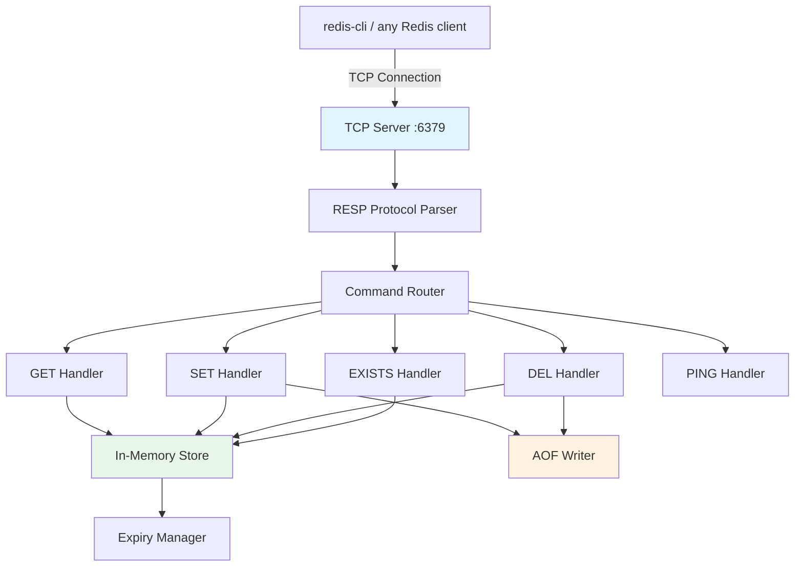
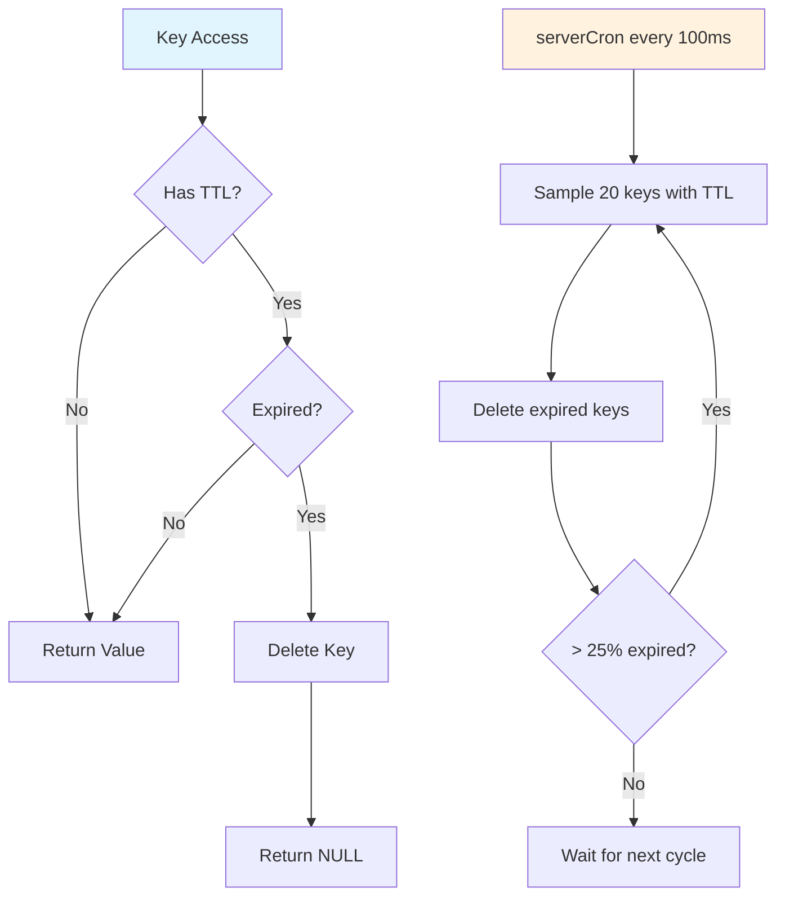
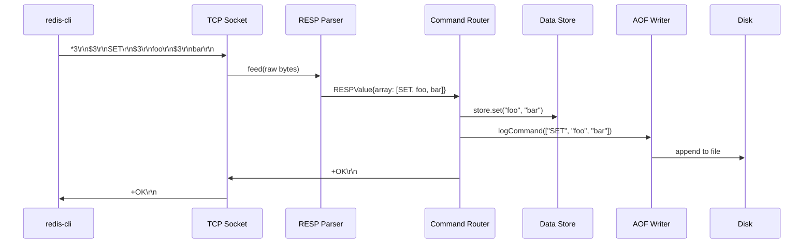

# Build Redis From Scratch

You are going to build a Redis server from scratch. Not a toy that pretends to be Redis — a real TCP server that speaks the RESP protocol, stores data in memory, expires keys with TTL, and persists everything to disk with an Append-Only File. When you are done, you will connect to it with the official `redis-cli` and it will just work.

## What We Are Building



**Supported commands:** PING, ECHO, SET (with EX/PX options), GET, DEL, EXISTS

**Features:**
- Full RESP2 protocol parsing (bulk strings, arrays, simple strings, errors, integers)
- Key expiry with second and millisecond precision
- Lazy expiry (check on access) + active expiry (periodic sweep)
- AOF persistence with replay on startup

## Part 1: Understanding the RESP Protocol

RESP (REdis Serialization Protocol) is a text-based protocol that is simple to parse but efficient enough for production use. Every Redis command and response is encoded in RESP.

### RESP Data Types

| Type | First Byte | Example | Meaning |
|---|---|---|---|
| Simple String | `+` | `+OK\r\n` | Success response |
| Error | `-` | `-ERR unknown command\r\n` | Error response |
| Integer | `:` | `:1\r\n` | Numeric response |
| Bulk String | `$` | `$5\r\nhello\r\n` | Binary-safe string |
| Array | `*` | `*2\r\n$3\r\nGET\r\n$3\r\nkey\r\n` | List of elements |
| Null Bulk String | `$` | `$-1\r\n` | Null / key not found |

When `redis-cli` sends `SET mykey myvalue`, the wire format is:

```
*3\r\n        ← Array of 3 elements
$3\r\n        ← Bulk string of length 3
SET\r\n       ← "SET"
$5\r\n        ← Bulk string of length 5
mykey\r\n     ← "mykey"
$7\r\n        ← Bulk string of length 7
myvalue\r\n   ← "myvalue"
```

::: tip Why text-based?
RESP uses `\r\n` delimiters and human-readable length prefixes. This makes it debuggable with tools like `telnet` and `nc` while still being fast to parse. The length-prefixed bulk strings make it binary-safe — you can store any bytes, including `\r\n` themselves, because the parser knows exactly how many bytes to read.
:::

## Part 2: The RESP Parser

Our parser reads raw bytes from a TCP socket and produces structured commands.

```typescript
// resp.ts — RESP protocol parser and serializer

export type RESPValue =
  | { type: 'simple'; value: string }
  | { type: 'error'; value: string }
  | { type: 'integer'; value: number }
  | { type: 'bulk'; value: string | null }
  | { type: 'array'; value: RESPValue[] | null };

export class RESPParser {
  private buffer = '';

  /**
   * Feed raw data into the parser buffer.
   * Returns all complete RESP values that can be parsed.
   */
  feed(data: string): RESPValue[] {
    this.buffer += data;
    const results: RESPValue[] = [];

    while (this.buffer.length > 0) {
      const result = this.tryParse();
      if (result === null) break; // incomplete data — wait for more
      results.push(result);
    }

    return results;
  }

  private tryParse(): RESPValue | null {
    if (this.buffer.length === 0) return null;

    const type = this.buffer[0];

    switch (type) {
      case '+': return this.parseSimpleString();
      case '-': return this.parseError();
      case ':': return this.parseInteger();
      case '$': return this.parseBulkString();
      case '*': return this.parseArray();
      default:
        throw new Error(`Unknown RESP type: ${type}`);
    }
  }

  private parseSimpleString(): RESPValue | null {
    const end = this.buffer.indexOf('\r\n');
    if (end === -1) return null;

    const value = this.buffer.slice(1, end);
    this.buffer = this.buffer.slice(end + 2);
    return { type: 'simple', value };
  }

  private parseError(): RESPValue | null {
    const end = this.buffer.indexOf('\r\n');
    if (end === -1) return null;

    const value = this.buffer.slice(1, end);
    this.buffer = this.buffer.slice(end + 2);
    return { type: 'error', value };
  }

  private parseInteger(): RESPValue | null {
    const end = this.buffer.indexOf('\r\n');
    if (end === -1) return null;

    const value = parseInt(this.buffer.slice(1, end), 10);
    this.buffer = this.buffer.slice(end + 2);
    return { type: 'integer', value };
  }

  private parseBulkString(): RESPValue | null {
    const end = this.buffer.indexOf('\r\n');
    if (end === -1) return null;

    const length = parseInt(this.buffer.slice(1, end), 10);

    // Null bulk string
    if (length === -1) {
      this.buffer = this.buffer.slice(end + 2);
      return { type: 'bulk', value: null };
    }

    const dataStart = end + 2;
    const dataEnd = dataStart + length;

    // Check if we have enough data (including trailing \r\n)
    if (this.buffer.length < dataEnd + 2) return null;

    const value = this.buffer.slice(dataStart, dataEnd);
    this.buffer = this.buffer.slice(dataEnd + 2);
    return { type: 'bulk', value };
  }

  private parseArray(): RESPValue | null {
    const end = this.buffer.indexOf('\r\n');
    if (end === -1) return null;

    const count = parseInt(this.buffer.slice(1, end), 10);

    // Null array
    if (count === -1) {
      this.buffer = this.buffer.slice(end + 2);
      return { type: 'array', value: null };
    }

    // Save buffer state in case we need to rollback
    const savedBuffer = this.buffer;
    this.buffer = this.buffer.slice(end + 2);

    const elements: RESPValue[] = [];
    for (let i = 0; i < count; i++) {
      const element = this.tryParse();
      if (element === null) {
        // Incomplete — rollback and wait for more data
        this.buffer = savedBuffer;
        return null;
      }
      elements.push(element);
    }

    return { type: 'array', value: elements };
  }
}

// --- RESP Serializer ---

export function encodeSimpleString(value: string): string {
  return `+${value}\r\n`;
}

export function encodeError(message: string): string {
  return `-ERR ${message}\r\n`;
}

export function encodeInteger(value: number): string {
  return `:${value}\r\n`;
}

export function encodeBulkString(value: string | null): string {
  if (value === null) return '$-1\r\n';
  return `$${Buffer.byteLength(value)}\r\n${value}\r\n`;
}

export function encodeArray(values: string[]): string {
  let result = `*${values.length}\r\n`;
  for (const v of values) {
    result += encodeBulkString(v);
  }
  return result;
}
```

::: warning Buffer boundaries matter
TCP is a stream protocol. A single `data` event might contain half a command, two complete commands, or one and a half commands. That is why our parser maintains a buffer and returns only when it has a complete RESP value. This is the most common bug in protocol implementations — assuming one `data` event equals one message.
:::

## Part 3: The In-Memory Store With Expiry

The store is a `Map` with an optional expiry timestamp for each key. We implement both **lazy expiry** (check when accessed) and **active expiry** (periodic sweep).

```typescript
// store.ts — In-memory key-value store with TTL expiry

interface StoreEntry {
  value: string;
  expiresAt: number | null; // Unix timestamp in ms, null = no expiry
}

export class DataStore {
  private data = new Map<string, StoreEntry>();
  private expiryInterval: ReturnType<typeof setInterval> | null = null;

  constructor() {
    // Active expiry: sweep 20 random keys every 100ms
    this.expiryInterval = setInterval(() => this.activeExpiry(), 100);
  }

  get(key: string): string | null {
    const entry = this.data.get(key);
    if (!entry) return null;

    // Lazy expiry: check on access
    if (entry.expiresAt !== null && Date.now() > entry.expiresAt) {
      this.data.delete(key);
      return null;
    }

    return entry.value;
  }

  set(key: string, value: string, ttlMs: number | null = null): void {
    const expiresAt = ttlMs !== null ? Date.now() + ttlMs : null;
    this.data.set(key, { value, expiresAt });
  }

  del(key: string): boolean {
    return this.data.delete(key);
  }

  exists(key: string): boolean {
    return this.get(key) !== null; // triggers lazy expiry
  }

  /**
   * Active expiry algorithm (simplified version of Redis's approach):
   * 1. Sample 20 random keys that have an expiry set
   * 2. Delete all expired keys in the sample
   * 3. If more than 25% were expired, repeat immediately
   *
   * This ensures expired keys are cleaned up even if never accessed,
   * without scanning the entire keyspace.
   */
  private activeExpiry(): void {
    const SAMPLE_SIZE = 20;
    const keys = Array.from(this.data.keys());
    const now = Date.now();
    let expired = 0;

    // Sample random keys
    for (let i = 0; i < Math.min(SAMPLE_SIZE, keys.length); i++) {
      const randomIndex = Math.floor(Math.random() * keys.length);
      const key = keys[randomIndex];
      const entry = this.data.get(key);

      if (entry?.expiresAt !== null && entry!.expiresAt! <= now) {
        this.data.delete(key);
        expired++;
      }
    }

    // If > 25% expired, run again immediately
    if (expired > SAMPLE_SIZE * 0.25 && keys.length > SAMPLE_SIZE) {
      this.activeExpiry();
    }
  }

  /** Return all keys (for AOF replay verification) */
  keys(): string[] {
    return Array.from(this.data.keys());
  }

  /** Return store size */
  size(): number {
    return this.data.size;
  }

  destroy(): void {
    if (this.expiryInterval) {
      clearInterval(this.expiryInterval);
    }
  }
}
```

### How Redis Actually Does Expiry

Redis uses the same two-strategy approach:



::: tip Why not just scan everything?
A Redis instance might have millions of keys. Scanning all of them every 100ms would be catastrophic for latency. The random sampling approach is probabilistically complete — if a large fraction of keys are expired, the algorithm loops until it catches up. In practice, this keeps expired key memory under control without impacting the event loop.
:::

## Part 4: AOF Persistence

The Append-Only File logs every write command. On restart, we replay the log to restore state.

```typescript
// aof.ts — Append-Only File persistence

import * as fs from 'fs';
import * as readline from 'readline';
import { DataStore } from './store';
import { RESPParser } from './resp';

export class AOFWriter {
  private fd: number | null = null;
  private path: string;

  constructor(path: string = 'appendonly.aof') {
    this.path = path;
  }

  open(): void {
    this.fd = fs.openSync(this.path, 'a');
  }

  /**
   * Log a command to the AOF.
   * Format: RESP array, same as the client sent it.
   * This means replay is just feeding the file through the parser.
   */
  logCommand(args: string[]): void {
    if (this.fd === null) return;

    let entry = `*${args.length}\r\n`;
    for (const arg of args) {
      entry += `$${Buffer.byteLength(arg)}\r\n${arg}\r\n`;
    }

    fs.writeSync(this.fd, entry);
    // In production Redis, you would configure fsync policy here:
    // - always: fsync after every write (safest, slowest)
    // - everysec: fsync once per second (good balance)
    // - no: let the OS decide (fastest, risk of data loss)
  }

  close(): void {
    if (this.fd !== null) {
      fs.closeSync(this.fd);
      this.fd = null;
    }
  }
}

/**
 * Replay the AOF file to restore state.
 * This is called on server startup before accepting connections.
 */
export async function replayAOF(
  path: string,
  store: DataStore
): Promise<number> {
  if (!fs.existsSync(path)) return 0;

  const content = fs.readFileSync(path, 'utf-8');
  const parser = new RESPParser();
  const values = parser.feed(content);

  let replayed = 0;

  for (const value of values) {
    if (value.type !== 'array' || !value.value) continue;

    const args = value.value.map((v) => {
      if (v.type === 'bulk' && v.value !== null) return v.value;
      if (v.type === 'simple') return v.value;
      return '';
    });

    const command = args[0].toUpperCase();

    switch (command) {
      case 'SET': {
        const key = args[1];
        const val = args[2];
        let ttlMs: number | null = null;

        // Parse EX/PX options
        for (let i = 3; i < args.length; i += 2) {
          const option = args[i].toUpperCase();
          const optionValue = parseInt(args[i + 1], 10);
          if (option === 'EX') ttlMs = optionValue * 1000;
          if (option === 'PX') ttlMs = optionValue;
        }

        store.set(key, val, ttlMs);
        replayed++;
        break;
      }
      case 'DEL': {
        for (let i = 1; i < args.length; i++) {
          store.del(args[i]);
        }
        replayed++;
        break;
      }
    }
  }

  return replayed;
}
```

::: danger AOF can grow unbounded
Every write appends to the AOF forever. Real Redis solves this with **AOF rewriting** — it forks a child process that writes a minimal AOF containing only the current state. Our implementation does not include rewriting, so the file will grow proportionally to the total number of writes, not the current dataset size.
:::

## Part 5: The Command Router

The router maps parsed RESP commands to handler functions.

```typescript
// commands.ts — Command handlers

import { DataStore } from './store';
import { AOFWriter } from './aof';
import {
  encodeSimpleString,
  encodeError,
  encodeInteger,
  encodeBulkString,
  RESPValue,
} from './resp';

export class CommandRouter {
  constructor(
    private store: DataStore,
    private aof: AOFWriter
  ) {}

  execute(parsed: RESPValue): string {
    if (parsed.type !== 'array' || !parsed.value || parsed.value.length === 0) {
      return encodeError('invalid command format');
    }

    const args = parsed.value.map((v) => {
      if (v.type === 'bulk' && v.value !== null) return v.value;
      if (v.type === 'simple') return v.value;
      return '';
    });

    const command = args[0].toUpperCase();

    switch (command) {
      case 'PING':   return this.handlePing(args);
      case 'ECHO':   return this.handleEcho(args);
      case 'SET':    return this.handleSet(args);
      case 'GET':    return this.handleGet(args);
      case 'DEL':    return this.handleDel(args);
      case 'EXISTS': return this.handleExists(args);
      case 'COMMAND': return encodeSimpleString('OK'); // redis-cli handshake
      default:
        return encodeError(`unknown command '${args[0]}'`);
    }
  }

  private handlePing(args: string[]): string {
    if (args.length > 1) {
      return encodeBulkString(args[1]);
    }
    return encodeSimpleString('PONG');
  }

  private handleEcho(args: string[]): string {
    if (args.length !== 2) {
      return encodeError('wrong number of arguments for ECHO');
    }
    return encodeBulkString(args[1]);
  }

  private handleSet(args: string[]): string {
    if (args.length < 3) {
      return encodeError('wrong number of arguments for SET');
    }

    const key = args[1];
    const value = args[2];
    let ttlMs: number | null = null;

    // Parse options: SET key value [EX seconds] [PX milliseconds]
    for (let i = 3; i < args.length; i++) {
      const option = args[i].toUpperCase();

      if (option === 'EX' && i + 1 < args.length) {
        ttlMs = parseInt(args[i + 1], 10) * 1000;
        i++;
      } else if (option === 'PX' && i + 1 < args.length) {
        ttlMs = parseInt(args[i + 1], 10);
        i++;
      }
    }

    this.store.set(key, value, ttlMs);
    this.aof.logCommand(args);

    return encodeSimpleString('OK');
  }

  private handleGet(args: string[]): string {
    if (args.length !== 2) {
      return encodeError('wrong number of arguments for GET');
    }

    const value = this.store.get(args[1]);
    return encodeBulkString(value);
  }

  private handleDel(args: string[]): string {
    if (args.length < 2) {
      return encodeError('wrong number of arguments for DEL');
    }

    let deleted = 0;
    for (let i = 1; i < args.length; i++) {
      if (this.store.del(args[i])) deleted++;
    }

    this.aof.logCommand(args);
    return encodeInteger(deleted);
  }

  private handleExists(args: string[]): string {
    if (args.length < 2) {
      return encodeError('wrong number of arguments for EXISTS');
    }

    let count = 0;
    for (let i = 1; i < args.length; i++) {
      if (this.store.exists(args[i])) count++;
    }

    return encodeInteger(count);
  }
}
```

## Part 6: The TCP Server

This is the main entry point. It ties everything together — the TCP listener, the parser, the command router, the store, and the AOF.

```typescript
// server.ts — TCP server entry point

import * as net from 'net';
import { RESPParser } from './resp';
import { DataStore } from './store';
import { AOFWriter, replayAOF } from './aof';
import { CommandRouter } from './commands';

const PORT = 6379;
const AOF_PATH = 'appendonly.aof';

async function main(): Promise<void> {
  // Initialize components
  const store = new DataStore();
  const aof = new AOFWriter(AOF_PATH);
  aof.open();
  const router = new CommandRouter(store, aof);

  // Replay AOF to restore state
  const replayed = await replayAOF(AOF_PATH, store);
  if (replayed > 0) {
    console.log(`Restored ${replayed} commands from AOF`);
  }

  // Create TCP server
  const server = net.createServer((socket) => {
    const parser = new RESPParser();
    const clientAddr = `${socket.remoteAddress}:${socket.remotePort}`;
    console.log(`Client connected: ${clientAddr}`);

    socket.on('data', (data) => {
      try {
        const values = parser.feed(data.toString());

        for (const value of values) {
          const response = router.execute(value);
          socket.write(response);
        }
      } catch (err) {
        const message = err instanceof Error ? err.message : 'unknown error';
        socket.write(`-ERR ${message}\r\n`);
      }
    });

    socket.on('end', () => {
      console.log(`Client disconnected: ${clientAddr}`);
    });

    socket.on('error', (err) => {
      console.error(`Socket error (${clientAddr}):`, err.message);
    });
  });

  // Graceful shutdown
  process.on('SIGINT', () => {
    console.log('\nShutting down...');
    aof.close();
    store.destroy();
    server.close(() => {
      console.log('Server closed');
      process.exit(0);
    });
  });

  server.listen(PORT, () => {
    console.log(`Mini-Redis listening on port ${PORT}`);
    console.log(`Store size: ${store.size()} keys`);
  });
}

main().catch(console.error);
```

## Part 7: Running and Testing

### Project Setup

```bash
mkdir mini-redis && cd mini-redis
npm init -y
npm install typescript @types/node ts-node --save-dev
npx tsc --init --target ES2020 --module commonjs --outDir dist
```

Your `tsconfig.json` should include:

```json
{
  "compilerOptions": {
    "target": "ES2020",
    "module": "commonjs",
    "outDir": "./dist",
    "rootDir": "./src",
    "strict": true,
    "esModuleInterop": true,
    "skipLibCheck": true
  },
  "include": ["src/**/*"]
}
```

### File Structure

```
mini-redis/
  src/
    resp.ts       ← RESP parser and serializer
    store.ts      ← In-memory store with expiry
    aof.ts        ← Append-Only File persistence
    commands.ts   ← Command router and handlers
    server.ts     ← TCP server entry point
  tsconfig.json
  package.json
```

### Running

```bash
npx ts-node src/server.ts
```

### Testing with redis-cli

Open a second terminal and connect with the real Redis CLI:

```bash
redis-cli -p 6379

# Basic operations
127.0.0.1:6379> PING
PONG

127.0.0.1:6379> SET greeting "hello world"
OK

127.0.0.1:6379> GET greeting
"hello world"

# Key expiry
127.0.0.1:6379> SET session abc123 EX 5
OK

127.0.0.1:6379> GET session
"abc123"

# ... wait 5 seconds ...

127.0.0.1:6379> GET session
(nil)

# Multiple DEL
127.0.0.1:6379> SET a 1
OK
127.0.0.1:6379> SET b 2
OK
127.0.0.1:6379> DEL a b
(integer) 2

# EXISTS
127.0.0.1:6379> SET alive true
OK
127.0.0.1:6379> EXISTS alive
(integer) 1
127.0.0.1:6379> EXISTS nonexistent
(integer) 0
```

### Testing Persistence

```bash
# Set some data
redis-cli -p 6379 SET persistent "this survives restart"

# Kill the server (Ctrl+C)
# Restart it
npx ts-node src/server.ts
# Output: "Restored 1 commands from AOF"

# Verify
redis-cli -p 6379 GET persistent
# "this survives restart"
```

## Architecture Deep Dive

### Data Flow



### Memory Layout

Each key-value pair in our store uses a JavaScript `Map` entry:

```
Map entry overhead:    ~70 bytes (V8 internal)
Key (string):          length + ~40 bytes (V8 string header)
StoreEntry object:     ~60 bytes
  - value (string):    length + ~40 bytes
  - expiresAt:         8 bytes (number) or null
```

For a key "user:1234" with value "session_token_abc", the total memory per entry is approximately 250-300 bytes. Real Redis achieves roughly 90 bytes per key-value pair for similar data through custom memory allocation (jemalloc) and compact data structure encodings.

## What We Left Out (And Why Production Redis Includes It)

| Feature | Our Implementation | Production Redis |
|---|---|---|
| Data structures | Strings only | Strings, Lists, Sets, Sorted Sets, Hashes, Streams, HyperLogLog, Bitmaps |
| Threading | Single-threaded | Single-threaded command execution + I/O threads (Redis 6+) |
| Persistence | AOF only | AOF + RDB snapshots + mixed mode |
| Replication | None | Leader-follower with partial resync |
| Clustering | None | Redis Cluster with 16384 hash slots |
| Memory management | V8 GC | jemalloc with custom allocator, eviction policies (LRU, LFU) |
| Pub/Sub | None | Full pub/sub with pattern matching |
| Transactions | None | MULTI/EXEC with optimistic locking (WATCH) |
| Scripting | None | Lua scripting with atomic execution |
| Protocol | RESP2 | RESP2 + RESP3 (Redis 6+) |

## Extension Challenges

Once the base implementation works, try adding these features:

### Challenge 1: INCR and DECR

Add atomic increment and decrement commands. These are surprisingly tricky — you need to handle the case where the key does not exist (treat as 0), the key exists but is not a number (return an error), and integer overflow.

### Challenge 2: TTL and PERSIST

Add the `TTL` command that returns the remaining time-to-live in seconds, and `PERSIST` that removes the expiry from a key.

### Challenge 3: Key Pattern Matching

Add the `KEYS` command with glob-style pattern matching. Use `*` for any sequence, `?` for any single character, and `[abc]` for character classes.

::: danger Never use KEYS in production
The `KEYS` command scans the entire keyspace and blocks the event loop. In production Redis with millions of keys, this can block for seconds. Redis provides `SCAN` for iterative, non-blocking key enumeration. But for learning purposes, implementing `KEYS` teaches you about pattern matching.
:::

### Challenge 4: RDB Snapshots

Implement point-in-time snapshots that serialize the entire dataset to a binary file. This is more efficient for backups than AOF because it stores the current state, not the history of all operations.

## How This Connects to the Real World

Now that you have built Redis from scratch, you have hands-on experience with concepts that appear everywhere in system design:

- **Protocol design** (RESP) — the same parsing challenges appear in HTTP, gRPC, WebSocket, and every custom protocol. See [Networking Fundamentals](/system-design/networking/) for the broader landscape.
- **In-memory data stores** — the trade-offs you encountered (memory vs disk, speed vs durability) are the foundation of [Caching](/system-design/caching/).
- **Persistence strategies** — AOF vs RDB maps directly to the WAL vs checkpoint distinction in databases. See [Write-Ahead Logging](/system-design/databases/write-ahead-logging).
- **Key expiry** — lazy vs active expiry is a microcosm of the broader problem of managing time in distributed systems. See [Clock Synchronization](/system-design/distributed-systems/clock-synchronization).
- **TCP server architecture** — the event loop model you used is the same pattern behind Node.js, Nginx, and Redis itself. See [Redis Internals](/system-design/databases/redis-internals) to see how the production version extends this.

The next project, [Build a Rate Limiter From Scratch](/build-from-scratch/rate-limiter), builds directly on this foundation — you will even use Redis (the real one or yours) as the backing store for distributed rate limiting.
