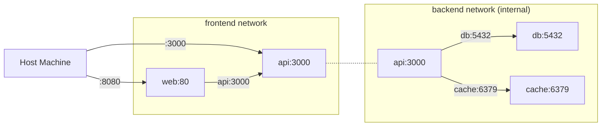

# Docker Compose Advanced Cheat Sheet

Docker Compose defines and runs multi-container applications. This cheat sheet covers the modern Compose v2 specification — the `docker compose` subcommand (not the legacy `docker-compose` binary). It goes beyond the basics into health checks, profiles, override files, networking, secrets, and patterns for both development and production.

**Related**: [Docker Cheat Sheet](/cheat-sheets/docker) | [Supply Chain Security](/security/supply-chain/) | [Observability Tools](/devops/observability-tools/)

---

## CLI Quick Reference

| Command | Description |
|---------|-------------|
| `docker compose up` | Create and start all services |
| `docker compose up -d` | Start in detached (background) mode |
| `docker compose up --build` | Rebuild images before starting |
| `docker compose up --force-recreate` | Recreate containers even if config unchanged |
| `docker compose up service1 service2` | Start specific services (+ dependencies) |
| `docker compose down` | Stop and remove containers, networks |
| `docker compose down -v` | Also remove named volumes |
| `docker compose down --rmi all` | Also remove images |
| `docker compose ps` | List running containers |
| `docker compose ps -a` | List all containers (including stopped) |
| `docker compose logs` | View logs from all services |
| `docker compose logs -f api` | Follow logs for specific service |
| `docker compose logs --tail 50 api` | Last 50 lines from service |
| `docker compose exec api sh` | Shell into running service |
| `docker compose run api npm test` | Run one-off command in new container |
| `docker compose build` | Build or rebuild all images |
| `docker compose pull` | Pull latest images |
| `docker compose restart api` | Restart a service |
| `docker compose stop` | Stop services without removing |
| `docker compose config` | Validate and view resolved config |
| `docker compose top` | Display running processes |
| `docker compose watch` | Watch for file changes and sync/rebuild |

---

## Service Definition

### Complete Service Example

```yaml
# compose.yaml (or docker-compose.yml)
services:
  api:
    build:
      context: .
      dockerfile: Dockerfile
      target: development          # Multi-stage build target
      args:
        NODE_VERSION: "22"
    image: myapp-api:dev
    container_name: myapp-api
    restart: unless-stopped
    ports:
      - "3000:3000"                # host:container
      - "9229:9229"                # Node.js debugger
    volumes:
      - ./src:/app/src             # Bind mount for hot reload
      - /app/node_modules          # Anonymous volume (preserve node_modules)
    environment:
      NODE_ENV: development
      DATABASE_URL: postgres://user:pass@db:5432/myapp
      REDIS_URL: redis://cache:6379
    env_file:
      - .env
      - .env.local                 # Overrides .env
    depends_on:
      db:
        condition: service_healthy
      cache:
        condition: service_started
    networks:
      - backend
    healthcheck:
      test: ["CMD", "curl", "-f", "http://localhost:3000/health"]
      interval: 10s
      timeout: 5s
      retries: 3
      start_period: 15s
    deploy:
      resources:
        limits:
          cpus: "1.0"
          memory: 512M
        reservations:
          cpus: "0.25"
          memory: 128M
    logging:
      driver: json-file
      options:
        max-size: "10m"
        max-file: "3"
```

---

## Health Checks

Health checks tell Compose when a service is actually ready, not just when the container starts.

```yaml
services:
  # PostgreSQL — wait for it to accept connections
  db:
    image: postgres:16-alpine
    healthcheck:
      test: ["CMD-SHELL", "pg_isready -U $POSTGRES_USER -d $POSTGRES_DB"]
      interval: 5s
      timeout: 3s
      retries: 5
      start_period: 10s

  # Redis — wait for PING response
  cache:
    image: redis:7-alpine
    healthcheck:
      test: ["CMD", "redis-cli", "ping"]
      interval: 5s
      timeout: 3s
      retries: 3

  # MySQL — wait for mysqladmin
  mysql:
    image: mysql:8
    healthcheck:
      test: ["CMD", "mysqladmin", "ping", "-h", "localhost"]
      interval: 5s
      timeout: 3s
      retries: 5
      start_period: 30s

  # Elasticsearch — wait for cluster health
  elasticsearch:
    image: elasticsearch:8.13.0
    healthcheck:
      test: ["CMD-SHELL", "curl -sf http://localhost:9200/_cluster/health | grep -q '\"status\":\"green\"\\|\"status\":\"yellow\"'"]
      interval: 10s
      timeout: 5s
      retries: 10
      start_period: 60s

  # Kafka — wait for broker to be ready
  kafka:
    image: confluentinc/cp-kafka:7.6.0
    healthcheck:
      test: ["CMD-SHELL", "kafka-broker-api-versions --bootstrap-server localhost:9092"]
      interval: 10s
      timeout: 5s
      retries: 10
      start_period: 30s

  # HTTP service — custom health endpoint
  api:
    build: .
    healthcheck:
      test: ["CMD", "wget", "--no-verbose", "--tries=1", "--spider", "http://localhost:3000/health"]
      interval: 10s
      timeout: 5s
      retries: 3
      start_period: 15s
```

::: tip
Use `start_period` to give slow-starting services time to initialize before health checks begin failing. Without it, a database that takes 20 seconds to start will appear unhealthy and may be restarted prematurely.
:::

### Dependency Ordering with Health Checks

```yaml
services:
  db:
    image: postgres:16-alpine
    healthcheck:
      test: ["CMD-SHELL", "pg_isready"]
      interval: 5s
      timeout: 3s
      retries: 5

  migrations:
    build: .
    command: npx prisma migrate deploy
    depends_on:
      db:
        condition: service_healthy    # Wait for DB to be healthy
    restart: "no"                     # Run once, do not restart

  api:
    build: .
    depends_on:
      db:
        condition: service_healthy
      migrations:
        condition: service_completed_successfully  # Wait for migrations to finish
      cache:
        condition: service_started    # Just wait for container start
```

::: warning
`depends_on` without a `condition` only waits for the container to start, not for the service to be ready. A PostgreSQL container starts in ~1 second, but the database engine may take 5-10 seconds to accept connections. Always use `condition: service_healthy` for databases.
:::

---

## Networking

```yaml
services:
  # Frontend network — exposed to host
  web:
    build: ./frontend
    ports:
      - "8080:80"
    networks:
      - frontend

  # API — bridges both networks
  api:
    build: ./api
    ports:
      - "3000:3000"
    networks:
      - frontend        # Reachable from web
      - backend         # Can reach db

  # Database — only on backend network
  db:
    image: postgres:16-alpine
    networks:
      - backend          # NOT on frontend — web cannot reach db directly

networks:
  frontend:
    driver: bridge
  backend:
    driver: bridge
    internal: true       # No external access (no internet from db)
```



### DNS Resolution

Inside a Compose network, services can reach each other by service name:

```yaml
services:
  api:
    environment:
      # Use service names as hostnames
      DATABASE_URL: postgres://user:pass@db:5432/myapp     # "db" resolves to the db container
      REDIS_URL: redis://cache:6379                         # "cache" resolves to the cache container
      KAFKA_BROKERS: kafka:9092                             # "kafka" resolves to the kafka container
```

---

## Profiles

Profiles let you define optional services that only start when explicitly requested.

```yaml
services:
  api:
    build: .
    # No profile — always starts

  db:
    image: postgres:16-alpine
    # No profile — always starts

  # Debug tools — only start with --profile debug
  pgadmin:
    image: dpage/pgadmin4
    ports:
      - "5050:80"
    profiles:
      - debug

  mailhog:
    image: mailhog/mailhog
    ports:
      - "8025:8025"
    profiles:
      - debug

  # Monitoring — only start with --profile monitoring
  prometheus:
    image: prom/prometheus
    profiles:
      - monitoring

  grafana:
    image: grafana/grafana
    profiles:
      - monitoring

  # Testing — only start with --profile test
  test-runner:
    build:
      context: .
      target: test
    command: npm test
    profiles:
      - test
    depends_on:
      db:
        condition: service_healthy
```

```bash
# Start core services only (api + db)
docker compose up

# Start core + debug tools
docker compose up --profile debug

# Start core + monitoring
docker compose up --profile monitoring

# Start multiple profiles
docker compose up --profile debug --profile monitoring

# Run tests
docker compose run --profile test test-runner
```

---

## Override Files

Compose automatically merges multiple files. Use overrides to customize for different environments.

```
project/
  compose.yaml              # Base configuration
  compose.override.yaml     # Dev overrides (auto-loaded)
  compose.prod.yaml         # Production overrides
  compose.test.yaml         # Test overrides
```

### Base (`compose.yaml`)

```yaml
services:
  api:
    image: myapp-api:latest
    environment:
      NODE_ENV: production
    restart: unless-stopped

  db:
    image: postgres:16-alpine
    environment:
      POSTGRES_DB: myapp
      POSTGRES_USER: myapp
    volumes:
      - pgdata:/var/lib/postgresql/data

volumes:
  pgdata:
```

### Development Override (`compose.override.yaml`)

```yaml
# Automatically merged when running `docker compose up`
services:
  api:
    build:
      context: .
      target: development
    environment:
      NODE_ENV: development
    ports:
      - "3000:3000"
      - "9229:9229"
    volumes:
      - ./src:/app/src
    command: npm run dev

  db:
    ports:
      - "5432:5432"       # Expose DB port for local tools
    environment:
      POSTGRES_PASSWORD: devpassword
```

### Production Override (`compose.prod.yaml`)

```yaml
services:
  api:
    deploy:
      replicas: 3
      resources:
        limits:
          cpus: "2.0"
          memory: 1G
    environment:
      NODE_ENV: production
    logging:
      driver: json-file
      options:
        max-size: "50m"
        max-file: "5"

  db:
    environment:
      POSTGRES_PASSWORD_FILE: /run/secrets/db_password
    secrets:
      - db_password

secrets:
  db_password:
    file: ./secrets/db_password.txt
```

```bash
# Development (auto-loads compose.override.yaml)
docker compose up

# Production (skip override, use prod)
docker compose -f compose.yaml -f compose.prod.yaml up -d

# Testing
docker compose -f compose.yaml -f compose.test.yaml run test-runner
```

---

## Secrets

```yaml
services:
  api:
    build: .
    secrets:
      - db_password
      - api_key
    environment:
      # Read from file mounted at /run/secrets/
      DB_PASSWORD_FILE: /run/secrets/db_password

  db:
    image: postgres:16-alpine
    secrets:
      - db_password
    environment:
      POSTGRES_PASSWORD_FILE: /run/secrets/db_password

# Define secrets
secrets:
  db_password:
    file: ./secrets/db_password.txt    # From file
  api_key:
    environment: "API_KEY"              # From host environment variable
```

::: danger
Never put passwords directly in `environment:` in your compose file — the file is committed to version control. Use `secrets:` with file references, or `env_file:` pointing to a `.gitignored` file. For production, use external secret managers (Vault, AWS Secrets Manager).
:::

---

## Volumes

```yaml
services:
  api:
    volumes:
      # Bind mount — sync host files into container (development)
      - ./src:/app/src:ro            # Read-only bind mount
      - ./config:/app/config         # Read-write bind mount

      # Named volume — persists across container restarts
      - node_modules:/app/node_modules

      # Anonymous volume — not shared, lost on `docker compose down`
      - /app/tmp

  db:
    volumes:
      - pgdata:/var/lib/postgresql/data
      - ./init.sql:/docker-entrypoint-initdb.d/init.sql:ro

volumes:
  pgdata:
    driver: local
  node_modules:
    driver: local
```

### Volume Tips

| Pattern | Use Case |
|---------|----------|
| `./src:/app/src` | Hot reload in development |
| `./src:/app/src:ro` | Prevent container from modifying source |
| `/app/node_modules` | Preserve node_modules inside container |
| Named volume (`pgdata:`) | Persist database data across restarts |
| `driver: local` | Default, stored on host filesystem |

---

## Watch Mode (Compose Watch)

Compose Watch syncs file changes without rebuilding the entire container:

```yaml
services:
  api:
    build: .
    develop:
      watch:
        # Sync source files — trigger hot reload
        - action: sync
          path: ./src
          target: /app/src
          ignore:
            - node_modules/
            - "*.test.ts"

        # Rebuild on dependency changes
        - action: rebuild
          path: ./package.json

        # Sync + restart on config changes
        - action: sync+restart
          path: ./config
          target: /app/config
```

```bash
# Start with watch mode
docker compose watch

# Or combine with up
docker compose up --watch
```

---

## Full-Stack Development Example

```yaml
# compose.yaml — Full-stack app with all patterns
services:
  # === Frontend ===
  web:
    build:
      context: ./frontend
      target: development
    ports:
      - "5173:5173"
    volumes:
      - ./frontend/src:/app/src
    environment:
      VITE_API_URL: http://localhost:3000
    networks:
      - frontend

  # === API ===
  api:
    build:
      context: ./api
      target: development
    ports:
      - "3000:3000"
    volumes:
      - ./api/src:/app/src
    environment:
      DATABASE_URL: postgres://myapp:secret@db:5432/myapp
      REDIS_URL: redis://cache:6379
      JWT_SECRET_FILE: /run/secrets/jwt_secret
    depends_on:
      db:
        condition: service_healthy
      cache:
        condition: service_healthy
    secrets:
      - jwt_secret
    networks:
      - frontend
      - backend
    healthcheck:
      test: ["CMD", "curl", "-f", "http://localhost:3000/health"]
      interval: 10s
      timeout: 5s
      retries: 3
      start_period: 10s

  # === Database ===
  db:
    image: postgres:16-alpine
    environment:
      POSTGRES_DB: myapp
      POSTGRES_USER: myapp
      POSTGRES_PASSWORD: secret
    volumes:
      - pgdata:/var/lib/postgresql/data
      - ./db/init.sql:/docker-entrypoint-initdb.d/01-init.sql:ro
    networks:
      - backend
    healthcheck:
      test: ["CMD-SHELL", "pg_isready -U myapp"]
      interval: 5s
      timeout: 3s
      retries: 5

  # === Cache ===
  cache:
    image: redis:7-alpine
    command: redis-server --maxmemory 128mb --maxmemory-policy allkeys-lru
    volumes:
      - redis_data:/data
    networks:
      - backend
    healthcheck:
      test: ["CMD", "redis-cli", "ping"]
      interval: 5s
      timeout: 3s
      retries: 3

  # === Worker (background jobs) ===
  worker:
    build:
      context: ./api
      target: development
    command: npm run worker
    volumes:
      - ./api/src:/app/src
    environment:
      DATABASE_URL: postgres://myapp:secret@db:5432/myapp
      REDIS_URL: redis://cache:6379
    depends_on:
      db:
        condition: service_healthy
      cache:
        condition: service_healthy
    networks:
      - backend

  # === Debug Tools (profile: debug) ===
  pgadmin:
    image: dpage/pgadmin4
    ports:
      - "5050:80"
    environment:
      PGADMIN_DEFAULT_EMAIL: admin@local.dev
      PGADMIN_DEFAULT_PASSWORD: admin
    profiles:
      - debug
    networks:
      - backend

  redis-commander:
    image: rediscommander/redis-commander
    ports:
      - "8081:8081"
    environment:
      REDIS_HOSTS: local:cache:6379
    profiles:
      - debug
    networks:
      - backend

networks:
  frontend:
    driver: bridge
  backend:
    driver: bridge
    internal: true

volumes:
  pgdata:
  redis_data:

secrets:
  jwt_secret:
    file: ./secrets/jwt_secret.txt
```

```bash
# Daily development
docker compose up

# With debug tools (pgAdmin, Redis Commander)
docker compose up --profile debug

# Rebuild after Dockerfile changes
docker compose up --build

# Reset everything (volumes, images, containers)
docker compose down -v --rmi local
```

---

## Common Gotchas

::: warning
**Port conflicts**: If `docker compose up` fails with "port already in use", check for other containers or local services. Use `lsof -i :3000` (Linux/Mac) or `netstat -ano | findstr :3000` (Windows) to find the process.
:::

::: tip
**Orphan containers**: If you rename or remove a service from your compose file, the old container persists. Use `docker compose up --remove-orphans` to clean them up.
:::

::: danger
**Volume data loss**: `docker compose down -v` deletes all named volumes, including your database data. Use `docker compose down` (without `-v`) to keep data between restarts. Only use `-v` when you intentionally want a fresh start.
:::

---

## Further Reading

- [Docker Cheat Sheet](/cheat-sheets/docker) — Docker CLI, Dockerfile patterns, and image management
- [Supply Chain Security](/security/supply-chain/) — signing and verifying container images
- [Kubernetes Cheat Sheet](/cheat-sheets/kubernetes) — when you outgrow Compose
- [Observability Tools](/devops/observability-tools/) — adding monitoring to your Compose stack

---

::: details Test Yourself
1. **What command rebuilds images and starts all services?**
   `docker compose up --build`

2. **How do you start only services tagged with the `debug` profile?**
   `docker compose up --profile debug`

3. **What `depends_on` condition waits for a health check to pass before starting a dependent service?**
   `condition: service_healthy`

4. **What file is automatically merged with `compose.yaml` when running `docker compose up`?**
   `compose.override.yaml`

5. **How do you make a network internal-only (no internet access)?**
   Set `internal: true` on the network definition.

6. **What Compose Watch action rebuilds the container when a file changes?**
   `action: rebuild`

7. **How do you run a one-off command in a new container without starting all services?**
   `docker compose run service-name command`

8. **What flag also removes named volumes when tearing down?**
   `docker compose down -v`

9. **How do you validate and view the fully resolved Compose configuration?**
   `docker compose config`

10. **Where are Docker Compose secrets mounted inside the container?**
    `/run/secrets/secret-name`
:::

::: danger Common Gotchas
- **`docker compose down -v` deletes your database data.** Named volumes containing PostgreSQL, MySQL, or Redis data are permanently deleted. Only use `-v` when you want a fresh start.
- **`depends_on` without `condition` only waits for container start, not readiness.** A PostgreSQL container starts in ~1 second, but the database engine takes 5-10 seconds to accept connections. Always use `condition: service_healthy` for databases.
- **Putting passwords in `environment:` in compose files.** The compose file is committed to version control. Use `secrets:`, `env_file:` with a `.gitignored` file, or external secret managers.
- **Orphan containers from renamed services.** If you rename or remove a service, the old container stays. Use `docker compose up --remove-orphans` to clean up.
:::

## One-Liner Summary

Docker Compose defines multi-container applications in a single YAML file -- master health checks, profiles, override files, and secrets to create reproducible development environments that mirror production.
