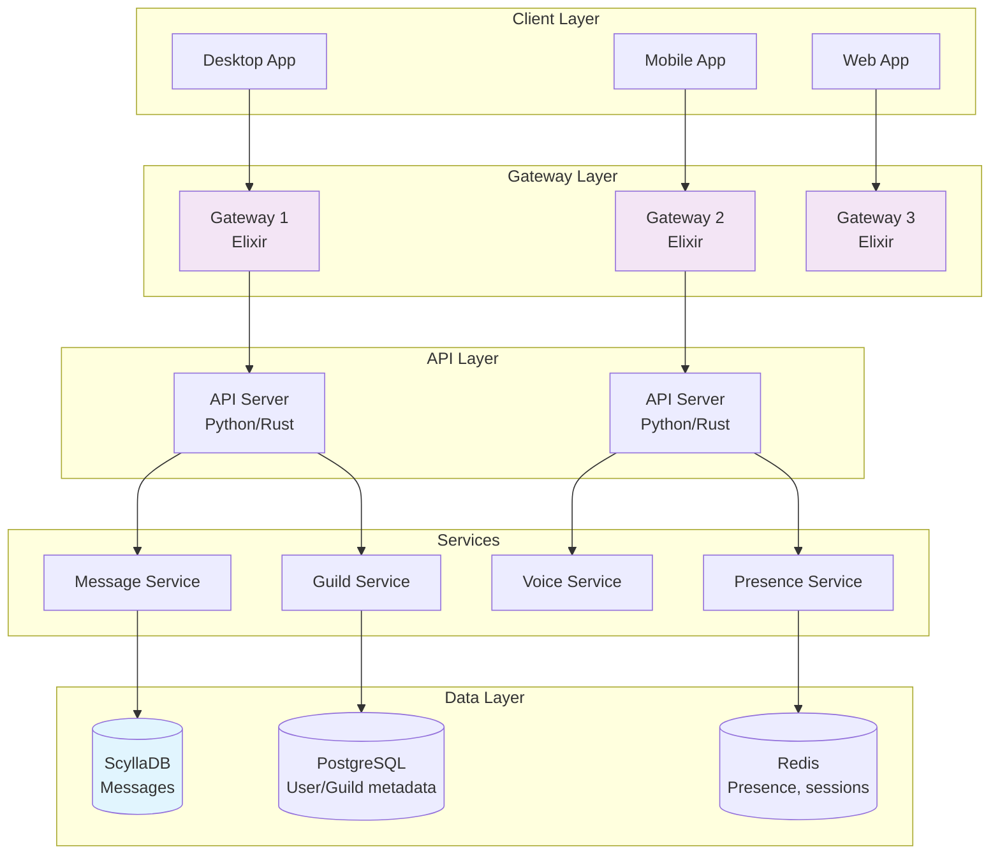
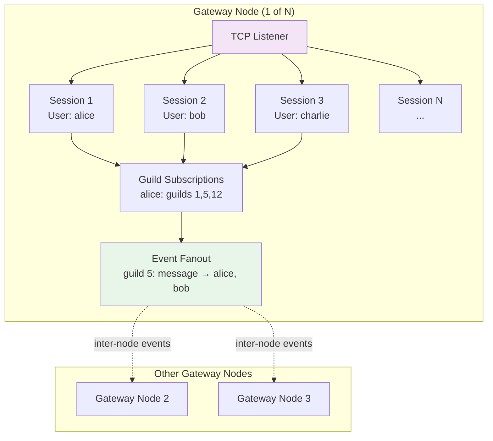
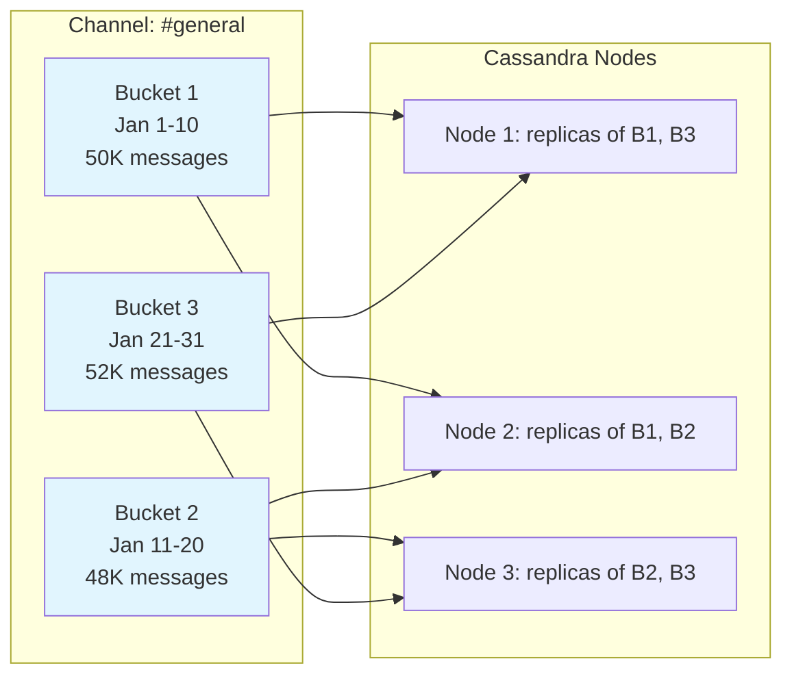
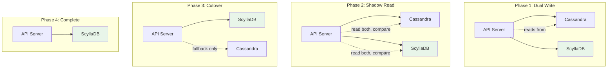
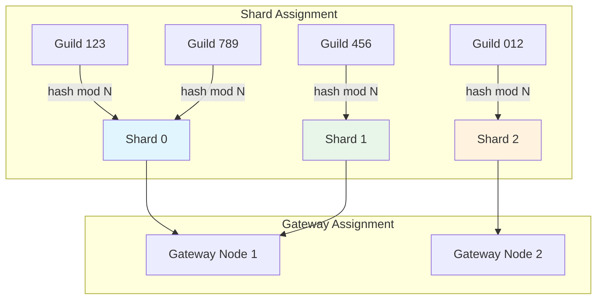
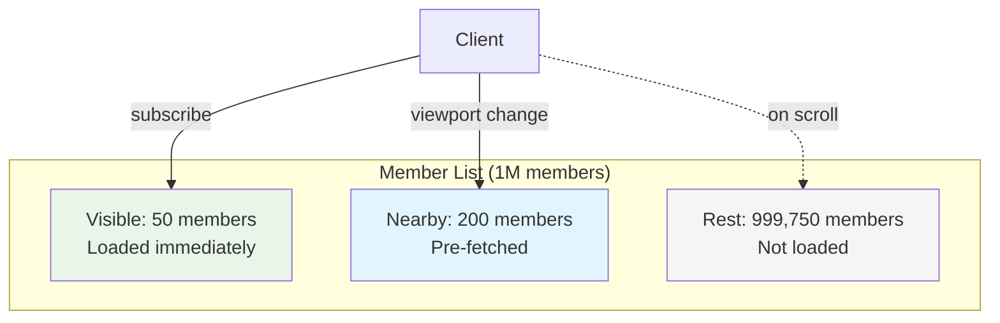
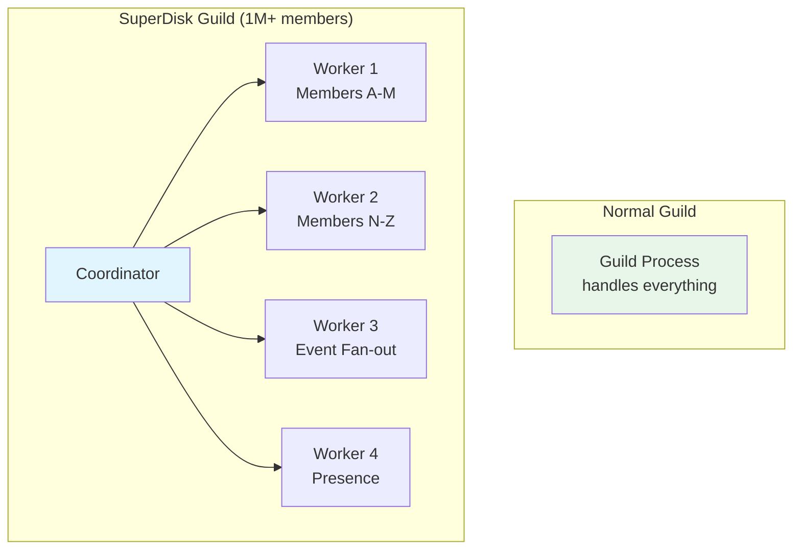
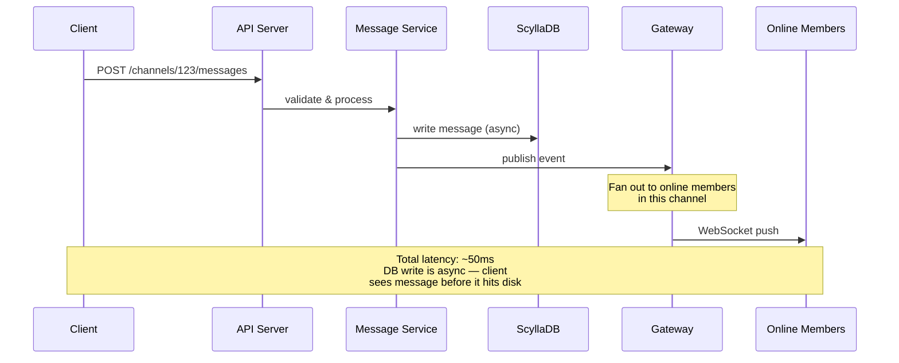

# How Discord Scaled to Millions

Discord went from a small gaming voice chat app in 2015 to a platform serving 200+ million monthly active users. Along the way, they made bold technology choices — Elixir for their real-time gateway, three different databases for message storage, custom sharding strategies, and creative solutions like lazy member lists for guilds with millions of members. Their scaling story is one of the most instructive in the industry because they grew faster than their architecture could keep up, forcing continuous reinvention.

## The Scale

| Metric | Value |
|---|---|
| Monthly active users | 200M+ |
| Concurrent users (peak) | 30M+ |
| Messages sent per day | Billions |
| Voice minutes per day | Billions |
| Guilds (servers) | 19M+ active |
| Largest guild | Millions of members |
| API requests per second | Millions |
| WebSocket connections | Tens of millions |

## Architecture Overview



## The Elixir Gateway

### Why Elixir?

Discord's gateway is the system that maintains persistent WebSocket connections with every online user. When you open Discord, your client connects to a gateway server and maintains that connection for the entire session. Every message, typing indicator, presence update, and voice state change flows through this connection.

The requirements for the gateway:
- Hold millions of concurrent WebSocket connections per server
- Fan out events to hundreds of thousands of guild members instantly
- Handle graceful reconnection when connections drop
- Process thousands of events per second per connection

Discord chose Elixir (running on the Erlang BEAM VM) because:

| Requirement | Why Elixir/BEAM |
|---|---|
| Massive concurrency | BEAM processes are ~2KB each, vs ~1MB for OS threads |
| Fault isolation | Process crashes are isolated — one connection crashing cannot affect others |
| Real-time | BEAM's preemptive scheduler ensures fair time slices — no single process can starve others |
| Hot code reloading | Deploy new code without dropping WebSocket connections |
| Distribution | BEAM's built-in distribution lets gateway nodes communicate natively |
| Garbage collection | Per-process GC — no stop-the-world pauses |

### Gateway Architecture

Each gateway node handles a portion of Discord's WebSocket connections:



Each session is an Elixir process (GenServer) that:
1. Manages the WebSocket connection lifecycle
2. Tracks which guilds the user is subscribed to
3. Receives events from guild processes and forwards them to the client
4. Handles heartbeats and reconnection
5. Compresses outgoing events (zlib-stream compression)

### BEAM Process Per Connection

```
Single gateway node statistics:
- Connections: ~1,000,000
- BEAM processes: ~1,000,000 (one per connection)
- Memory per process: ~5 KB (average, varies with subscription count)
- Total memory: ~5 GB for processes
- CPU usage: ~30% (mostly serialization/compression)
- Events processed: ~2M per second
```

::: tip Why not Node.js or Go?
Node.js can handle many connections but uses a single-threaded event loop — one slow handler blocks everything. Go has goroutines (similar to BEAM processes) but lacks BEAM's preemptive scheduling, per-process GC, and built-in distribution. Discord's engineers found that Elixir/BEAM's unique combination of features made it the best fit for their gateway's specific requirements.
:::

### Hitting BEAM's Limits

As Discord grew, they encountered BEAM limitations:

1. **Large guild fan-out** — sending a message to a guild with 1 million members means notifying 1 million processes. Even on BEAM, this creates scheduling pressure.

2. **Memory per node** — 1 million connections per node at 5KB each is 5GB, but some users subscribe to hundreds of large guilds, pushing per-process memory much higher.

3. **Erlang distribution** — BEAM's built-in distribution protocol is not designed for clusters of 50+ nodes; the mesh topology creates O(N^2) connections.

Discord's solutions:
- **Guild process sharding** — large guilds get dedicated processes that batch event fan-out
- **Custom inter-node communication** — replaced Erlang distribution with a custom protocol using NATS for inter-node messaging
- **Connection limits per node** — capped at ~1M connections per node, scaled horizontally

## The Database Migration Journey

Discord's message storage has gone through three databases, each change driven by real scaling pain.

### Phase 1: MongoDB (2015-2016)

Discord launched with MongoDB because it was the fastest path to a working product.

```
MongoDB schema:
{
  _id: ObjectId,
  channel_id: String,
  author_id: String,
  content: String,
  timestamp: Date,
  attachments: [...],
  embeds: [...]
}
```

**Why MongoDB initially:**
- Flexible schema for rapidly evolving message format
- Good developer experience
- Fast writes
- Easy to deploy

**Why MongoDB failed at scale:**
- **RAM-limited** — MongoDB's WiredTiger engine needs the working set to fit in RAM for good performance. Discord's message data grew faster than RAM was economically viable.
- **Unpredictable latency** — when the working set exceeded RAM, page faults caused latency spikes from milliseconds to seconds.
- **Compaction overhead** — WiredTiger's compaction blocked writes during peaks.

### Phase 2: Cassandra (2016-2022)

Discord migrated to Apache Cassandra, a distributed database designed for write-heavy workloads with predictable latency.

```
Cassandra schema:
CREATE TABLE messages (
    channel_id bigint,
    bucket int,        -- time-based bucketing
    message_id bigint, -- Snowflake ID (timestamp-based)
    author_id bigint,
    content text,
    PRIMARY KEY ((channel_id, bucket), message_id)
) WITH CLUSTERING ORDER BY (message_id DESC);
```

**Why Cassandra worked initially:**
- Linear horizontal scaling — add nodes, get more capacity
- Predictable write latency — LSM tree architecture with sequential writes
- Time-series friendly — clustering by message_id (Snowflake = timestamp) gives efficient range scans
- Tunable consistency — LOCAL_QUORUM for reads, LOCAL_ONE for writes

**The bucket trick:** Messages are partitioned by `(channel_id, bucket)` where bucket is a time period (e.g., 10 days). This prevents any single partition from growing unbounded — even a channel with years of history has manageable partition sizes.



### Why Cassandra Failed at Discord's Scale

By 2022, Cassandra was showing cracks:

1. **Hot partitions** — popular channels (millions of messages) created hot spots on specific Cassandra nodes. Even with bucketing, a viral channel's current bucket would be hammered.

2. **Compaction storms** — Cassandra's LSM tree compaction would occasionally spike latency from 5ms to 200ms+ during heavy compaction, exactly when the cluster was busiest.

3. **GC pauses** — Cassandra runs on the JVM. As heap sizes grew to 30GB+, garbage collection pauses caused intermittent latency spikes of 100-500ms.

4. **Read amplification** — scanning across multiple SSTables for a range query (loading message history) required reading from many files, amplifying disk I/O.

5. **Operational burden** — managing a 1000+ node Cassandra cluster required a dedicated team. Repairs, compaction tuning, and capacity planning consumed enormous engineering effort.

::: warning The JVM garbage collection problem
This is the most insidious issue. GC pauses are unpredictable and hard to tune. Discord tried G1GC, ZGC, and Shenandoah. Each improved things temporarily, but as data grew, pauses returned. The fundamental problem: the JVM was not designed for heaps this large with Cassandra's access patterns.
:::

### Phase 3: ScyllaDB (2022-Present)

Discord migrated to ScyllaDB, a C++ rewrite of Cassandra that uses the same data model and query language (CQL) but eliminates the JVM.

**Why ScyllaDB:**

| Property | Cassandra | ScyllaDB |
|---|---|---|
| Language | Java (JVM) | C++ (no GC) |
| Thread model | Thread-per-core | Seastar framework (async, shard-per-core) |
| GC pauses | Yes (unpredictable) | No GC (C++ memory management) |
| Compaction | Blocks reads during heavy compaction | Streaming compaction, minimal latency impact |
| Tail latency (p99) | 40-200ms | 5-15ms |
| Nodes required | 1000+ | ~72 (for same workload) |
| Ops burden | High | Lower (shard-per-core simplifies tuning) |

### The Migration Strategy

Migrating trillions of messages without downtime:



1. **Dual write** — write every message to both Cassandra and ScyllaDB
2. **Background migration** — copy historical data from Cassandra to ScyllaDB in the background
3. **Shadow reads** — read from both databases and compare results; log discrepancies
4. **Traffic shift** — gradually shift read traffic from Cassandra to ScyllaDB (1%, 5%, 25%, 50%, 100%)
5. **Decommission Cassandra** — once ScyllaDB was handling 100% of traffic with no issues

**Duration:** ~18 months from start to full migration.

::: tip Why not just rewrite in Cassandra?
ScyllaDB is wire-compatible with Cassandra — same CQL queries, same data model, same drivers. This meant Discord did not have to rewrite their application code. The migration was primarily an infrastructure change, not an application change. This dramatically reduced risk.
:::

## Guild Sharding

### What Is a Guild?

In Discord's terminology, a "guild" is what users call a "server" — a community with channels, members, roles, and permissions. Guilds range from 2 members (a private DM group) to millions of members (public servers like the official Fortnite or Minecraft servers).

### The Sharding Model

Guilds are assigned to shards, and shards are assigned to gateway nodes:



**Shard calculation:**

```python
shard_id = (guild_id >> 22) % num_shards
```

The `>> 22` extracts the timestamp portion of the Snowflake ID, but since the guild ID is assigned once at creation, this effectively produces a random distribution.

**Why shard by guild?**
- All events within a guild (messages, reactions, voice state) go through the same shard
- This enables strong ordering guarantees within a guild without distributed coordination
- Guild-level operations (member updates, channel creation) are local to one shard
- Failure of a shard only affects the guilds assigned to it

### Dynamic Resharding

As Discord grew, the number of shards increased from 1 to 2,000+. Resharding (increasing the shard count) is done by:

1. Doubling the shard count (N becomes 2N)
2. Each old shard splits into two new shards (guilds with hash % 2N == old_shard stay, others move)
3. This is a consistent hashing property — only ~50% of guilds move per doubling

## Lazy Member Lists

### The Problem

When you open a large Discord server, the right sidebar shows the member list. For a server with 1 million members, loading the entire member list would:

- Transfer ~100 MB of data per client
- Take 30+ seconds
- Crash mobile clients

### The Solution: Lazy Loading

Discord implements a lazy member list that only loads what is visible:



**How it works:**

1. Client subscribes to the member list with a viewport range (e.g., "show me members 0-50")
2. Server sends the initial 50 members, sorted by role and status
3. As the user scrolls, the client requests new ranges
4. The server maintains a real-time subscription — if a visible member goes offline, the client receives an update
5. Members outside the viewport are never sent

### Member List Indexing

The member list is sorted by:
1. Online status (online > idle > DND > offline)
2. Role hierarchy (higher roles first)
3. Display name (alphabetical)

This sort order changes in real-time as members come online/offline or change roles. Discord maintains this sorted index in memory on the guild's shard, using an efficient data structure that supports:
- O(log N) insertion/removal (member status change)
- O(1) range queries (viewport rendering)
- O(1) count queries (member count by role)

## SuperDisk: Handling Massive Guilds

Discord's largest guilds have millions of members. These guilds create unique challenges:

- **Event fan-out** — a single message in a million-member guild means notifying up to 1 million connected clients
- **Member list** — maintaining a sorted index of 1 million members
- **Permission computation** — checking permissions for 1 million members with complex role hierarchies
- **Presence tracking** — tracking online/offline for 1 million members in real-time

### SuperDisk Architecture

SuperDisk is Discord's solution for guilds that exceed the capacity of a single gateway process:



**Key optimizations:**
1. **Sharded fan-out** — instead of one process notifying 1 million members, multiple workers each notify a subset
2. **Batched updates** — presence updates are batched every 100ms instead of sent individually
3. **Compressed member lists** — member data is delta-compressed; only changes are transmitted
4. **Priority lanes** — messages and important events get priority over presence and typing indicators

## Snowflake IDs

Discord uses Snowflake IDs (originally designed by Twitter) for all entities:

```
Snowflake ID: 64-bit integer

┌──────────────────────┬──────────┬──────┬──────────────┐
│  Timestamp (42 bits) │ Worker   │ PID  │ Increment    │
│  ms since epoch      │ (5 bits) │(5b)  │ (12 bits)    │
└──────────────────────┴──────────┴──────┴──────────────┘

Properties:
- Globally unique (no coordination needed)
- Time-sortable (higher ID = more recent)
- Extractable timestamp: (id >> 22) + DISCORD_EPOCH
- 4096 IDs per millisecond per worker
```

**Why Snowflakes matter for scaling:**
- No central ID generator bottleneck (each worker generates independently)
- Natural chronological ordering (crucial for message history)
- Efficient partitioning (timestamp bits provide time-based sharding)
- Compact (64 bits vs 128-bit UUIDs)

::: tip Snowflake IDs are a system design fundamental
Discord, Twitter, Instagram, and many others use Snowflake-style IDs. The key insight: by embedding a timestamp in the ID, you get sortability for free — no secondary index on timestamp needed. This matters enormously for time-series data like messages. See [Distributed Systems](/system-design/distributed-systems/) for more on distributed ID generation.
:::

## Performance Optimizations

### Message Delivery Pipeline

When someone sends a message in a Discord channel:



**Critical optimization:** The message is sent to recipients before the database write completes. This cuts perceived latency from ~50ms to ~15ms. If the database write fails (extremely rare), the message is retried, and in the worst case, the client is notified to resend.

::: danger Eventual consistency for messages
This means a message can be visible to recipients before it is durably stored. If ScyllaDB crashes in the tiny window between event publication and write completion, the message is lost. Discord accepts this trade-off because the window is <10ms and ScyllaDB is extremely reliable. For messages, speed beats perfect durability.
:::

### Presence at Scale

Tracking whether 200 million users are online, idle, or offline is a massive state management problem:

```
Presence system:
- State: {user_id → status, activity, connected_devices}
- Updates: ~500K per second (users going online/offline/idle)
- Queries: ~2M per second (rendering member lists)
- Storage: Redis with pub/sub for propagation
- Challenge: a user with 100 mutual guilds generates 100 fan-out events
```

**Optimization:** Presence updates are coalesced. If a user rapidly toggles between online and idle (flaky network), the system waits 5 seconds before propagating the change to prevent presence "flapping."

## Key Takeaways

1. **Choose the right runtime for the job** — Elixir/BEAM's process model is uniquely suited for maintaining millions of concurrent stateful connections. The per-process GC and preemptive scheduling are features you cannot replicate in other runtimes.

2. **Do not be afraid to migrate databases** — Discord migrated their most critical data store twice. Each migration took ~18 months, but each was necessary. Your first database choice is not your last.

3. **JVM GC is a real problem at scale** — Cassandra's JVM-based architecture caused unpredictable latency that no amount of tuning could fully resolve. ScyllaDB's C++ implementation eliminated this entire class of problems.

4. **Shard by your domain aggregate** — Discord shards by guild because guilds are the natural boundary for strong consistency. Messages within a guild are ordered; messages across guilds do not need to be.

5. **Load what you need, when you need it** — Lazy member lists demonstrate that you should never load an entire dataset when the user can only see a tiny window. This principle applies to every large list, feed, or timeline.

6. **Optimize the common case, handle the extreme** — Normal guilds use simple single-process handling. Only the largest guilds get the SuperDisk treatment. Do not over-engineer for edge cases from day one.

## Cross-References

- [CRDT Fundamentals](/system-design/distributed-systems/crdt-fundamentals) — related to Figma's approach but Discord chose simpler server-authoritative consistency
- [Cassandra Internals](/system-design/databases/cassandra-internals) — deep dive into the database Discord migrated away from
- [Sharding](/system-design/databases/sharding) — the theory behind Discord's guild sharding
- [WebSockets](/system-design/networking/websockets) — the protocol behind Discord's gateway connections
- [Actor Model](/system-design/concurrency/actor-model) — BEAM's process model is a practical implementation of the actor model
- [Consistent Hashing](/system-design/distributed-systems/consistent-hashing) — used for shard-to-node assignment

## Sources

- Discord Engineering Blog: "How Discord Stores Billions of Messages" (2017)
- Discord Engineering Blog: "How Discord Stores Trillions of Messages" (2023)
- Discord Engineering Blog: "Using Rust to Scale Elixir for 11 Million Concurrent Users" (2020)
- Discord Engineering Blog: "How Discord Indexes Billions of Messages" (2021)
- Strange Loop talk: "How Discord Handles Push Request Bursts of Over 40,000/sec" (2017)
- Discord Engineering Blog: "How Discord Supercharges Network Hardware" (2022)
- QCon talk: "Real-time Communication at Scale" (Stanislav Vishnevskiy, 2019)
