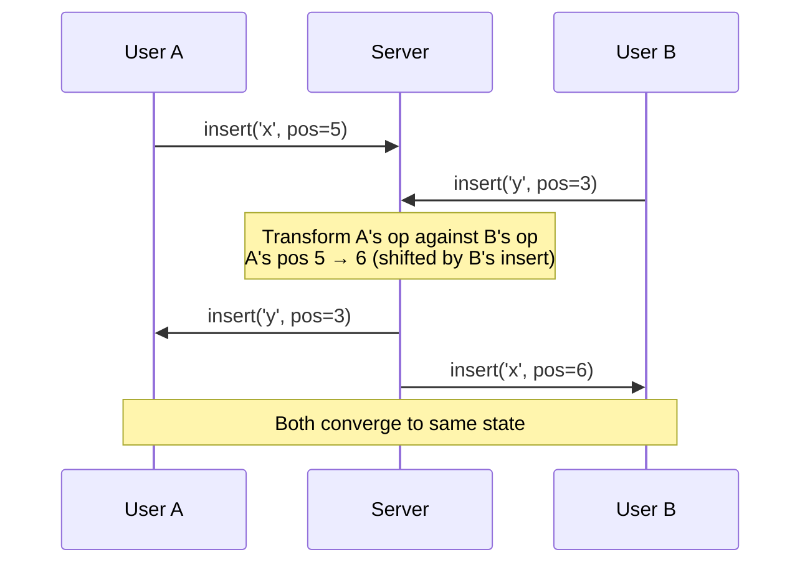
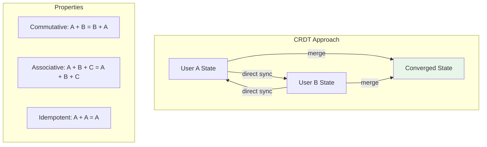
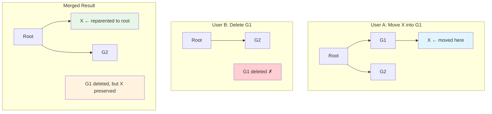
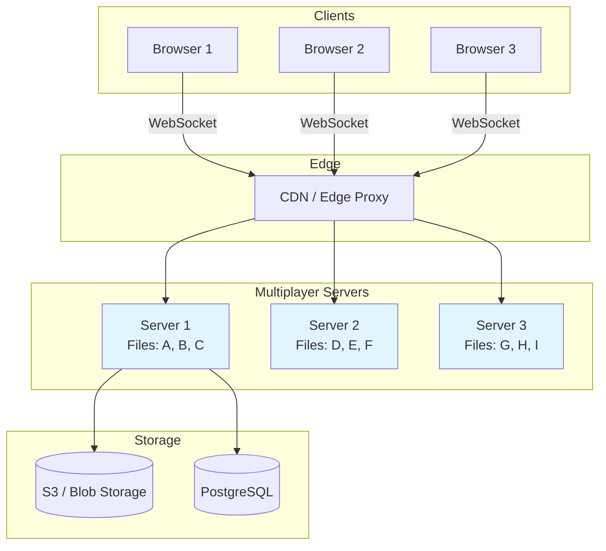
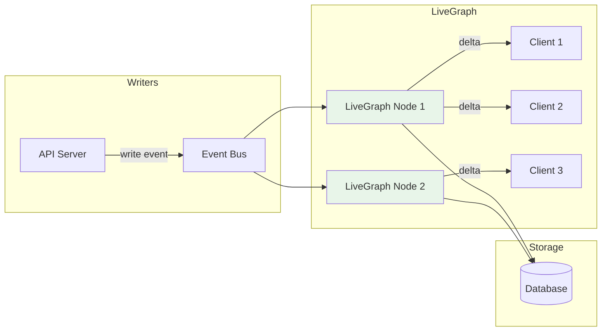

# How Figma Built Multiplayer

Open a Figma file with ten collaborators. Move a rectangle. Everyone sees it move instantly. Now imagine that two people move the same rectangle at the same time, to different positions. There is no conflict dialog, no error, no "someone else is editing this." It just works. Behind that seamless experience is one of the most sophisticated real-time collaboration systems ever built.

Figma's multiplayer architecture solves a problem that is fundamentally harder than collaborative text editing (Google Docs). A design file is not a linear document — it is a complex tree of frames, layers, components, instances, constraints, auto-layout rules, and vector paths. When two designers edit the same file simultaneously, the system must merge their changes in a way that preserves the intent of both — without coordination, without locking, and with sub-100ms latency.

## The Problem Space

### Why Design Files Are Harder Than Text

Google Docs solved collaborative text editing years ago using Operational Transform (OT). But design files are fundamentally different:

| Property | Text Document | Design File |
|---|---|---|
| Structure | Linear (sequence of characters) | Tree (nested frames, groups, layers) |
| Operations | Insert, delete at position | Move, resize, recolor, reparent, reorder |
| Conflicts | Two inserts at same position | Two moves of same object, reparenting + deleting |
| Dependencies | None (each character independent) | Parent-child, component-instance, auto-layout |
| Data size | KBs to low MBs | MBs to hundreds of MBs |
| Edit frequency | Typing speed (~5 ops/sec) | Design manipulation (~50+ ops/sec with dragging) |

::: tip The core challenge
In text, "insert A at position 5" and "insert B at position 5" has a clear resolution — put them next to each other. In design, "move rectangle to (100,100)" and "move rectangle to (200,200)" simultaneously has no obvious merge — and the wrong answer means someone's work is silently lost.
:::

## OT vs CRDTs: The Decision

Figma's team evaluated both approaches before choosing CRDTs.

### Operational Transform (OT)

OT works by transforming operations against each other. If user A inserts at position 5 and user B inserts at position 3, user A's operation is transformed to account for B's insertion (position becomes 6). OT requires a **central server** to determine the canonical operation order.



**OT Problems for Figma:**
- Requires a central server for ordering — adds latency
- Transform functions are N^2 in the number of operation types — with Figma's dozens of operations, this means hundreds of transform pairs to implement and test
- Notoriously difficult to get right — Google's OT implementation for Docs took years to stabilize
- Server is a bottleneck — every operation goes through the server before it can be applied

### CRDTs (Conflict-free Replicated Data Types)

CRDTs are data structures where any two replicas can be merged to produce the same result, regardless of the order operations are received. They do not require a central server for ordering.



**Why Figma Chose CRDTs:**
- No central ordering server needed — lower latency
- Operations can be applied locally first, then synced — the UI feels instant
- Mathematically guaranteed convergence — if you can prove your CRDT is correct, it will always converge
- Better offline support — users can continue editing offline and merge when reconnected

::: warning CRDTs are not a silver bullet
CRDTs guarantee convergence but not intent preservation. Two users might both produce valid operations that, when merged, create an undesirable result (a text box overlapping a button, for example). Figma invested heavily in designing CRDTs that produce "sensible" merge outcomes, not just "correct" ones.
:::

## Figma's CRDT Implementation

### The Document Model

A Figma file is a tree of nodes. Each node has properties (position, size, color, etc.) and children (for frames and groups).

```
Figma Document Tree:
├── Page 1
│   ├── Frame "Header"
│   │   ├── Rectangle "Logo"
│   │   ├── Text "Title"
│   │   └── Frame "Nav"
│   │       ├── Text "Home"
│   │       ├── Text "About"
│   │       └── Text "Contact"
│   └── Frame "Body"
│       ├── Rectangle "Hero Image"
│       └── Text "Welcome"
└── Page 2
    └── ...
```

Each property of each node is modeled as an independent CRDT register. This means:

- Two users changing the **same property** of the **same node** → last-writer-wins (using Lamport timestamps)
- Two users changing **different properties** of the **same node** → both changes preserved
- Two users changing **different nodes** → both changes preserved (trivially)

### Last-Writer-Wins Register

The simplest CRDT Figma uses. Each property value carries a timestamp (Lamport clock + node ID for tiebreaking):

```typescript
// Conceptual model — Figma's actual implementation is in C++ / Rust
interface LWWRegister<T> {
  value: T;
  timestamp: number;  // Lamport clock
  nodeId: string;     // tiebreaker for equal timestamps
}

function merge<T>(a: LWWRegister<T>, b: LWWRegister<T>): LWWRegister<T> {
  if (a.timestamp > b.timestamp) return a;
  if (b.timestamp > a.timestamp) return b;
  // Equal timestamps — deterministic tiebreak by node ID
  return a.nodeId > b.nodeId ? a : b;
}

// Example: Two users change the same rectangle's color
const userA: LWWRegister<string> = {
  value: '#FF0000', // red
  timestamp: 42,
  nodeId: 'user-a',
};

const userB: LWWRegister<string> = {
  value: '#0000FF', // blue
  timestamp: 43,
  nodeId: 'user-b',
};

merge(userA, userB);
// → userB wins (higher timestamp) → color is blue
```

### Tree Operations (The Hard Part)

Moving nodes in a tree is the hardest CRDT problem. Consider:

1. User A moves node X into group G1
2. User B deletes group G1 simultaneously

If we apply both: X is moved into G1, then G1 is deleted. Is X deleted too? Or orphaned? Or moved to the root?

Figma's solution uses a **move tree CRDT** based on Martin Kleppmann's research:



**Resolution rule:** When a node's parent is deleted, the node is reparented to its nearest surviving ancestor. This preserves the node (no data loss) while respecting the deletion.

### Operation Compression

A designer dragging a rectangle generates ~60 position updates per second (one per frame). Sending all of them would overwhelm the network. Figma compresses operations:

1. **Batching** — operations are collected for 16ms (one frame), then sent as a batch
2. **Property coalescing** — if the same property is changed multiple times in a batch, only the final value is sent
3. **Delta encoding** — only changed properties are transmitted, not the full node state
4. **Binary encoding** — operations are encoded in a compact binary format, not JSON

```
Without compression:
  Drag rectangle from (100,100) to (200,200) over 1 second
  → 60 operations × ~100 bytes = 6000 bytes

With compression:
  → ~5 batched operations × ~20 bytes = 100 bytes
  → 60x reduction
```

## WebSocket Infrastructure

### Connection Architecture

Every open Figma file maintains a persistent WebSocket connection to a multiplayer server:



**Key design decisions:**

1. **File-to-server affinity** — all users editing the same file connect to the same server. This avoids distributed coordination for merging operations.

2. **Sticky sessions** — the edge proxy routes WebSocket connections to the correct server based on file ID (consistent hashing).

3. **Server-side document state** — the multiplayer server keeps the document in memory for fast operation application and broadcasting.

4. **Periodic snapshots** — the in-memory document is periodically serialized and saved to blob storage, so a server crash loses at most a few seconds of changes.

### Handling Server Failures

When a multiplayer server crashes:

1. All clients connected to that server detect the WebSocket disconnection
2. Clients automatically reconnect to the edge proxy
3. The proxy routes them to a new server
4. The new server loads the latest snapshot from blob storage
5. Clients send any operations they made since the snapshot
6. The server merges all incoming operations (CRDTs guarantee convergence)
7. Editing resumes

::: tip This recovery works because of CRDTs
With OT, server failure recovery is a nightmare — you need to reconstruct the operation log and re-transform everything. With CRDTs, each client holds a valid replica. The new server just needs to merge all client states, and the CRDT properties guarantee the result is correct regardless of order.
:::

## LiveGraph: Real-Time Subscriptions

Figma's product extends beyond the canvas editor. The file browser, component library, design system, and commenting system all need real-time updates. LiveGraph is Figma's internal system for real-time data subscriptions.

### The Problem

Traditional REST APIs require polling:

```
Client: GET /api/file/123/comments
Server: [comment A, comment B]

... someone adds comment C ...

Client: GET /api/file/123/comments  (30 seconds later)
Server: [comment A, comment B, comment C]
```

This wastes bandwidth (re-fetching unchanged data) and adds latency (up to 30 seconds to see new comments).

### The LiveGraph Solution

LiveGraph provides GraphQL-like subscriptions over WebSocket:

```
Client: SUBSCRIBE { file(id: "123") { comments { text, author } } }
Server: INITIAL { comments: [A, B] }

... someone adds comment C ...

Server: UPDATE { comments: { added: [C] } }

... someone deletes comment A ...

Server: UPDATE { comments: { removed: [A] } }
```

### LiveGraph Architecture



**How it works:**

1. Client subscribes to a query (e.g., "all comments on file 123")
2. LiveGraph executes the query against the database and sends the initial result
3. LiveGraph registers a listener for changes to the relevant data
4. When a write comes through the event bus, LiveGraph re-evaluates affected subscriptions
5. Only the delta (new/changed/removed items) is sent to the client

**Key innovation:** LiveGraph does not re-execute the full query on every change. It maintains a **materialized view** of each subscription's result set in memory and incrementally updates it when the underlying data changes. This makes updates O(delta) instead of O(total).

## Performance Numbers

| Metric | Value |
|---|---|
| Concurrent editors per file (max) | 500+ |
| Operation latency (median) | < 50ms |
| Operation latency (p99) | < 200ms |
| Operations per second per file | 10,000+ |
| File size (largest) | 1 GB+ |
| WebSocket connections (total) | Millions |
| Snapshot interval | Every 30 seconds |
| Cursor update frequency | 60 Hz |

## Lessons for Your Own Systems

### 1. Pick CRDTs Over OT for Complex Data Models

OT works well for linear data (text). For anything with tree structure, nested objects, or complex relationships, CRDTs are more tractable. The number of OT transform functions grows quadratically with operation types, while CRDT merge functions are per-data-type and composable.

### 2. Last-Writer-Wins Is Usually Good Enough

For most properties, LWW with Lamport timestamps produces sensible results. Users rarely edit the exact same property at the exact same moment, and when they do, LWW is the expected behavior (the most recent change "wins"). Reserve complex conflict resolution for operations where LWW would cause data loss (tree moves, deletes).

### 3. Compress Operations Aggressively

Real-time editing generates a firehose of small operations. Without batching, coalescing, and delta encoding, you will saturate the network before you saturate the CPU. Figma achieves 60x compression by combining these techniques.

### 4. File-to-Server Affinity Simplifies Everything

By routing all users on the same file to the same server, Figma avoids distributed CRDT merging entirely during normal operation. The CRDTs are only needed for crash recovery, not for the happy path. This is a powerful architectural simplification.

### 5. Invest in Incremental View Maintenance

LiveGraph's key insight — maintaining materialized views of subscription results and updating them incrementally — is broadly applicable to any system with real-time data needs. It is dramatically more efficient than re-querying the database on every change.

## Cross-References

- [CRDT Fundamentals](/system-design/distributed-systems/crdt-fundamentals) — the mathematical foundation behind Figma's collaboration
- [WebSockets](/system-design/networking/websockets) — the transport layer for real-time communication
- [Consistency Models](/system-design/distributed-systems/consistency-models) — eventual consistency and why CRDTs guarantee convergence
- [Vector Clocks & Lamport Timestamps](/system-design/distributed-systems/vector-clocks-lamport-timestamps) — the ordering mechanism used in Figma's LWW registers
- [Event-Driven Architecture](/architecture-patterns/event-driven/) — the event bus pattern used by LiveGraph

## Sources

- Figma Engineering Blog: "How Figma's multiplayer technology works" (Evan Wallace, 2019)
- Figma Engineering Blog: "Realtime editing of Ordered Sequences" (2019)
- Figma Engineering Blog: "LiveGraph: Real-Time Data Fetching at Figma" (2021)
- Strange Loop talk: "CRDTs for Mortals" (James Long, 2020)
- Martin Kleppmann: "A highly-available move operation for replicated trees" (2021)
- Figma Config 2023: "Under the Hood of Figma's Infrastructure"
