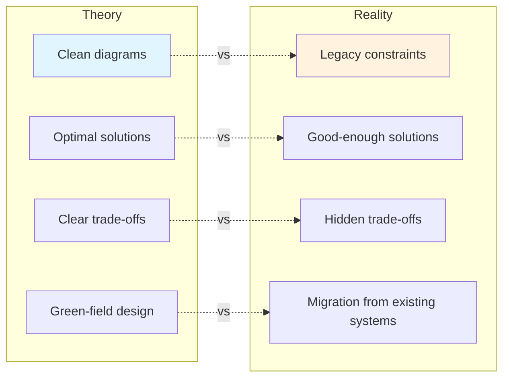
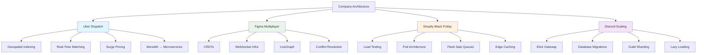
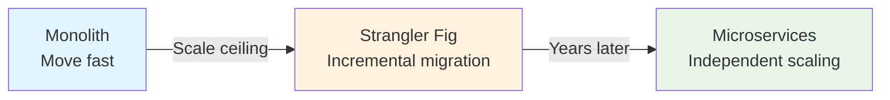
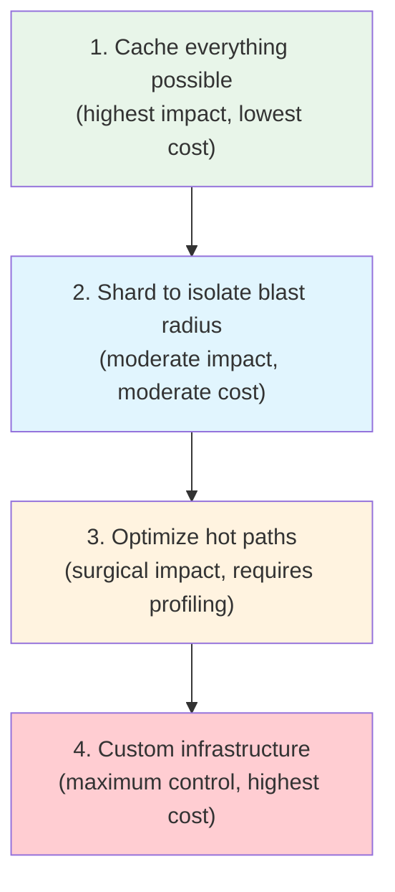
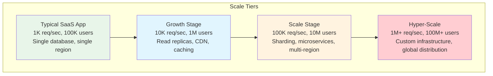

# Company Architecture Case Studies

System design interviews teach you to design systems on a whiteboard. These case studies teach you how they were actually built — with all the messy trade-offs, migration nightmares, and hard-won lessons that never fit on a whiteboard.

Every architecture in this section comes from real engineering blogs, conference talks, and published papers. These are not hypothetical designs. They are battle-tested systems serving hundreds of millions of users, processing billions of events per day, and running on infrastructure that costs millions of dollars per month.

## Why Study Real Architectures?

Most system design resources describe idealized systems. "Use a message queue for async processing." "Add a cache in front of your database." "Shard your data by user ID." These are correct but incomplete. They tell you what to build without telling you what goes wrong.

Real architecture case studies show you:

| What Textbooks Teach | What Case Studies Reveal |
|---|---|
| "Use consistent hashing for distribution" | Uber tried consistent hashing and built Ringpop when off-the-shelf solutions failed their real-time requirements |
| "Use CRDTs for collaboration" | Figma chose CRDTs over Operational Transform after extensive research, and the design took years of iteration |
| "Scale horizontally for peak traffic" | Shopify runs load tests for months and still gets surprised on Black Friday |
| "Choose the right database" | Discord migrated from MongoDB to Cassandra to ScyllaDB, each migration taking over a year |
| "Design for failure" | Every company discovers failure modes they never imagined — and those discoveries become their most valuable engineering lessons |

### The Gap Between Theory and Practice

In textbooks, you design the perfect system from scratch. In reality, you inherit a system that was designed five years ago for 1/100th of today's traffic, and you have to fix it without downtime. These case studies show you how real companies navigate that reality.

## Case Study Map

## The Case Studies

### Uber: Building a Global Dispatch System

How do you match millions of riders with millions of drivers in real time, across every city on earth, with sub-second latency? Uber's dispatch system is one of the most demanding real-time systems ever built. It combines geospatial indexing (Google S2, Uber's H3), real-time matching algorithms, dynamic pricing, and a custom distributed systems framework called Ringpop — all while migrating from a monolith to hundreds of microservices without downtime.

**Key themes:** Geospatial computing, real-time systems, consistent hashing, monolith-to-microservices migration

**Key numbers:**

| Metric | Value |
|---|---|
| Active drivers (peak) | 5M+ |
| Rides per day | 25M+ |
| Location updates/sec | 1M+ |
| Dispatch latency (p99) | < 1 second |
| Cities served | 10,000+ |

[Read: How Uber Built Their Dispatch System](/company-architecture/uber-dispatch)

---

### Figma: Making Multiplayer Design Work

Figma lets hundreds of designers edit the same file simultaneously, with every cursor and pixel syncing in real time. Building this required solving one of computer science's hardest problems — distributed collaborative editing — at a scale that makes Google Docs look simple (because design tools manipulate complex object trees, not just text). Their journey through Operational Transform, CRDTs, and the custom LiveGraph subscription system reveals the real engineering behind "it just works."

**Key themes:** CRDTs, conflict resolution, WebSocket infrastructure, real-time subscriptions

**Key numbers:**

| Metric | Value |
|---|---|
| Concurrent editors per file | 500+ |
| Operation latency (median) | < 50ms |
| Operations per second per file | 10,000+ |
| WebSocket connections (total) | Millions |
| Largest file size | 1 GB+ |

[Read: How Figma Built Multiplayer](/company-architecture/figma-multiplayer)

---

### Shopify: Surviving Black Friday

Black Friday generates more e-commerce traffic in 48 hours than most platforms see in a month. Shopify processes billions of dollars in sales across millions of stores, all hitting peak at the same moment. Their preparation — months of load testing with a custom tool called Genghis, pod-based architecture for tenant isolation, flash sale queue systems, and edge caching strategies — is a masterclass in capacity planning and graceful degradation.

**Key themes:** Load testing, capacity planning, tenant isolation, edge caching, graceful degradation

**Key numbers:**

| Metric | Value |
|---|---|
| Peak requests/sec | 800K+ |
| BFCM revenue (48 hours) | Billions of dollars |
| Traffic multiplier vs normal | 10-40x |
| Merchants affected | 2M+ |
| War room duration | 5+ days |

[Read: How Shopify Handles Black Friday](/company-architecture/shopify-black-friday)

---

### Discord: Scaling to Millions of Concurrent Users

Discord went from a small gaming chat app to a platform serving 200+ million monthly active users with near-zero downtime. Their story includes choosing Elixir for the real-time gateway (and hitting its limits), migrating message storage from MongoDB to Cassandra to ScyllaDB, inventing guild sharding to isolate failure domains, and building creative solutions like lazy member lists and SuperDisk to handle servers with millions of members.

**Key themes:** Real-time messaging, database migration, sharding strategies, language runtime tradeoffs

**Key numbers:**

| Metric | Value |
|---|---|
| Monthly active users | 200M+ |
| Concurrent users (peak) | 30M+ |
| Messages per day | Billions |
| Database migration count | 3 (MongoDB, Cassandra, ScyllaDB) |
| Largest guild members | Millions |

[Read: How Discord Scaled to Millions](/company-architecture/discord-scaling)

---

## How to Read These Case Studies

Each case study follows a consistent structure:

1. **The Problem** — what the company needed to build and why it was hard
2. **The Architecture** — how they designed and built it, with diagrams
3. **The Decisions** — the key trade-offs they made and the alternatives they considered
4. **The Failures** — what went wrong and how they recovered
5. **The Lessons** — what you can apply to your own systems

### Reading Strategy

Do not just read these passively. For each case study:

- **Before reading:** Try to design the system yourself. What would you do? What questions would you ask?
- **While reading:** Note every decision where they chose differently than you would. Ask yourself why.
- **After reading:** Could you explain this architecture to a colleague? Could you defend the key decisions?

::: tip Connect to fundamentals
Each case study references foundational concepts from elsewhere in Archon. If a case study mentions CRDTs and you are not sure what those are, follow the link to the [CRDT Fundamentals](/system-design/distributed-systems/crdt-fundamentals) page before continuing. The case studies will make much more sense when you understand the underlying primitives.
:::

## Technology Cross-Reference

Every case study involves multiple technologies and concepts. This matrix shows which concepts appear in which case studies, helping you identify the patterns that recur across different companies.

| Concept | Uber | Figma | Shopify | Discord |
|---|---|---|---|---|
| Real-time systems | Driver tracking | Cursor sync, edits | Flash sale queues | Message delivery |
| Distributed state | Ringpop hash ring | CRDT replicas | Pod-isolated stores | Guild shards |
| Database migration | — | — | — | MongoDB → Cassandra → ScyllaDB |
| Custom infrastructure | Ringpop, H3 | LiveGraph | Genghis | SuperDisk |
| Microservices | 4,000+ services | Service-oriented | Pod architecture | Gateway + services |
| Caching | ETA caching | File snapshots | CDN edge caching | Member list caching |
| Load management | Surge pricing | Op compression | Checkout queues | Lazy loading |
| Failure handling | GPS accuracy, outage recovery | Server crash recovery | Graceful degradation | Shard isolation |

## Common Themes Across Case Studies

After reading all four case studies, you will notice patterns that recur at every company:

### 1. Monolith First, Then Migrate

Uber, Discord, and Shopify all started with monoliths. None of them regretted it. The monolith let them move fast when speed mattered more than scale. The migration happened when they hit the monolith's ceiling — and even then, it was incremental, not a big-bang rewrite.

::: warning The premature microservices trap
Starting with microservices is almost always a mistake. You do not know your domain boundaries yet. You do not know which services need to be independently scalable. And the operational overhead of microservices (service mesh, distributed tracing, cross-service transactions) is enormous. Start with a monolith. Decompose when you feel the pain.
:::

### 2. Database Migrations Are Inevitable

Discord went through three database technologies. Every company in this section changed their storage layer at least once. The lesson: your initial database choice matters less than your ability to migrate away from it.

| Company | Migration | Duration | Reason |
|---|---|---|---|
| Discord | MongoDB → Cassandra | ~1 year | RAM limitations, unpredictable latency |
| Discord | Cassandra → ScyllaDB | ~18 months | JVM GC pauses, operational overhead |
| Uber | Monolithic DB → Ringpop | ~1 year | Write throughput, latency requirements |
| Shopify | Shared DB → Sharded pods | Multi-year | Noisy neighbor, blast radius |

### 3. Custom Infrastructure Emerges From Necessity

Uber built Ringpop. Figma built LiveGraph. Shopify built Genghis. Discord built SuperDisk. None of these companies set out to build custom infrastructure — they tried off-the-shelf solutions first and built custom only when nothing else worked at their scale.

**The pattern:**
1. Use an off-the-shelf solution
2. Hit its limits at your specific scale/requirements
3. Evaluate alternatives
4. Build custom only when no alternative fits
5. Open-source it (sometimes)

### 4. Failure Is the Best Teacher

Every major architecture improvement in these case studies was motivated by a production incident. Shopify's pod architecture came from cascade failures. Discord's ScyllaDB migration came from Cassandra GC pauses. Uber's microservice migration came from deployment bottlenecks. The systems got better because they failed first.

::: tip Embrace failure
The best engineering organizations treat incidents as learning opportunities, not blame events. Post-mortems, blameless retrospectives, and architecture reviews after incidents produce more improvements than any amount of upfront design. If your system has never failed, you do not know where it will fail.
:::

### 5. Optimization Follows the Same Pattern Everywhere

Every company in this section eventually discovers the same optimization hierarchy:

## Prerequisites

These case studies assume familiarity with basic distributed systems concepts. If any of these terms are unfamiliar, start with the linked pages:

| Concept | Where to Learn It | Appears In |
|---|---|---|
| Consistent hashing | [Consistent Hashing](/system-design/distributed-systems/consistent-hashing) | Uber, Discord |
| CRDTs | [CRDT Fundamentals](/system-design/distributed-systems/crdt-fundamentals) | Figma |
| Sharding | [Sharding](/system-design/databases/sharding) | Discord, Shopify |
| Load balancing | [Load Balancing](/system-design/load-balancing/) | All |
| Message queues | [Message Queues](/system-design/message-queues/) | Shopify, Uber |
| Caching strategies | [Caching](/system-design/caching/) | All |
| Microservices | [Microservices](/architecture-patterns/microservices/) | Uber, Discord |
| WebSockets | [WebSockets](/system-design/networking/websockets) | Figma, Discord |
| LSM trees / storage engines | [Storage Engines](/system-design/databases/storage-engines) | Discord |
| Rate limiting | [Rate Limiting](/system-design/distributed-systems/rate-limiting) | Shopify |

::: tip Start with the system design section if these are new
These case studies are most valuable when you already understand the building blocks. If terms like "consistent hashing," "CRDT," or "LSM tree" are unfamiliar, spend time in the [System Design](/system-design/) section first. Then come back here to see how these concepts are applied at massive scale.
:::

## How These Case Studies Connect to System Design Interviews

If you are preparing for system design interviews, these case studies are invaluable. Interviewers love candidates who can reference real-world implementations:

| Interview Question | Relevant Case Study | What to Reference |
|---|---|---|
| "Design a ride-sharing service" | Uber Dispatch | H3 geospatial indexing, driver matching, surge pricing |
| "Design a collaborative editor" | Figma Multiplayer | CRDTs vs OT, file-to-server affinity, LiveGraph |
| "Design a system for flash sales" | Shopify BFCM | Queue system, pod isolation, graceful degradation |
| "Design a chat application" | Discord Scaling | Guild sharding, Elixir gateway, lazy member lists |
| "How would you handle 10x traffic?" | Shopify BFCM | Load testing, capacity planning, graceful degradation |
| "How would you migrate databases?" | Discord Scaling | Dual-write, shadow reads, gradual traffic shift |

The difference between a candidate who says "I would use consistent hashing" and one who says "Uber built Ringpop because ZooKeeper's single-leader model could not handle their write throughput" is the difference between a passing answer and an exceptional one.

## Beyond These Four

These four companies represent different problem domains — real-time logistics, collaborative editing, e-commerce at scale, and real-time communication. Together they cover the majority of architectural patterns you will encounter in production systems. But the learning does not stop here. Every major tech company publishes engineering blogs and gives conference talks. Make a habit of reading them.

The best engineering blogs to follow:

| Company | Blog | Best Known For |
|---|---|---|
| Uber | [eng.uber.com](https://eng.uber.com/) | Distributed systems, geospatial, microservices |
| Figma | [figma.com/blog/engineering](https://www.figma.com/blog/section/engineering/) | CRDTs, real-time collaboration, WebSocket |
| Shopify | [shopify.engineering](https://shopify.engineering/) | Scaling, Ruby/Rails at scale, multi-tenancy |
| Discord | [discord.com/blog/engineering](https://discord.com/blog/category/engineering) | Elixir, database migrations, real-time |
| Netflix | [netflixtechblog.com](https://netflixtechblog.com/) | Microservices, chaos engineering, streaming |
| Stripe | [stripe.com/blog/engineering](https://stripe.com/blog/engineering) | API design, payments, reliability |
| Meta | [engineering.fb.com](https://engineering.fb.com/) | Scale, infrastructure, ML systems |
| Google | [research.google/blog](https://research.google/blog/) | Infrastructure papers, ML, distributed systems |
| Cloudflare | [blog.cloudflare.com](https://blog.cloudflare.com/) | Edge computing, networking, security |
| LinkedIn | [engineering.linkedin.com/blog](https://engineering.linkedin.com/blog) | Kafka, data infrastructure, search |

The engineers who built these systems are generous with their knowledge. Take advantage of it.

### Recommended Conference Talks

The best architecture case studies often come from conference presentations where engineers explain their systems in depth:

- **QCon** — industry conferences with deep technical talks
- **Strange Loop** — cutting-edge distributed systems talks
- **InfoQ** — recorded presentations from multiple conferences
- **Papers We Love** — academic papers explained by practitioners
- **USENIX** — systems research with practical applications

## What to Do After Reading

1. **Pick the case study closest to your domain** and study it deeply. If you work in e-commerce, start with Shopify. If you work on collaborative tools, start with Figma.

2. **Try to re-create the architecture diagram from memory.** If you cannot, re-read the case study. Understanding means being able to explain without notes.

3. **Identify the decisions you disagree with.** Then try to figure out why the company made that choice. Often, the context (scale, team size, timeline, legacy constraints) makes the "wrong" decision the right one.

4. **Connect to your own experience.** What systems at your company face similar challenges? What can you borrow from these case studies?

5. **Build something.** The [Build From Scratch](/build-from-scratch/) section lets you implement simplified versions of concepts from these case studies — from Redis (used by Uber, Discord, and Shopify) to load balancers (used by everyone).

## Glossary of Recurring Terms

These terms appear repeatedly across the case studies. Understanding them before you start reading will make the case studies significantly more accessible.

| Term | Definition | Case Studies |
|---|---|---|
| **Blast radius** | The scope of impact when something fails. A smaller blast radius means fewer users are affected by any single failure. | Shopify (pod isolation), Discord (guild sharding) |
| **Fan-out** | The process of distributing a single event to many recipients. Sending one message to a million-member guild is a 1:1M fan-out. | Discord (message delivery), Figma (operation broadcast) |
| **Hot partition** | A shard or partition that receives disproportionately more traffic than others, creating a bottleneck. | Discord (popular channels), Shopify (viral stores) |
| **Noisy neighbor** | In multi-tenant systems, one tenant consuming resources that degrades performance for other tenants on the same infrastructure. | Shopify (pod architecture), Discord (guild sharding) |
| **Tail latency** | The latency experienced by the slowest requests (p95, p99, p99.9). Systems are often judged by their worst case, not their average. | Discord (ScyllaDB vs Cassandra), Uber (dispatch p99) |
| **Write amplification** | When a single logical write causes multiple physical writes. Common in LSM-tree databases during compaction. | Discord (Cassandra/ScyllaDB) |
| **Graceful degradation** | Deliberately reducing functionality under load to preserve core features. Disabling recommendations to keep checkout working. | Shopify (degradation levels) |
| **Connection draining** | Allowing existing connections to complete while stopping new ones. Essential for zero-downtime deployments. | All (during deployments) |
| **Circuit breaker** | A pattern that stops calling a failing service to let it recover, preventing cascade failures. | Shopify (Genghis safety mechanisms) |
| **Consistent hashing** | A distribution technique where adding/removing nodes only moves a fraction of keys, unlike modular hashing where everything moves. | Uber (Ringpop), Discord (shard assignment) |
| **Tombstone** | A marker that records a deletion. Necessary in systems where data exists in multiple locations (replicas, SSTables) to propagate the delete. | Discord (Cassandra/ScyllaDB internals) |
| **Idempotency** | An operation that produces the same result regardless of how many times it is applied. Critical for retry-safe distributed systems. | All (at-least-once delivery) |

## Scale Comparison

To appreciate the magnitude of these systems, here is how they compare to typical applications:

Every company in this section operates at the hyper-scale tier. The architectural patterns they developed are often not necessary at smaller scales — but understanding them prepares you for the day your system needs to make the jump from one tier to the next.

## A Note on Sources and Accuracy

All case studies in this section are based on publicly available information: engineering blog posts, conference talks, published papers, and open-source code. Companies evolve their architectures continuously, so some details may have changed since their original publication. Where possible, we note the approximate timeframe for each architectural decision.

These case studies represent our best understanding of how these systems work based on public information. Internal implementation details that have not been publicly shared are not included. If you find inaccuracies, we welcome corrections — real-world architectures are complex, and getting the details right matters.
