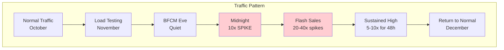
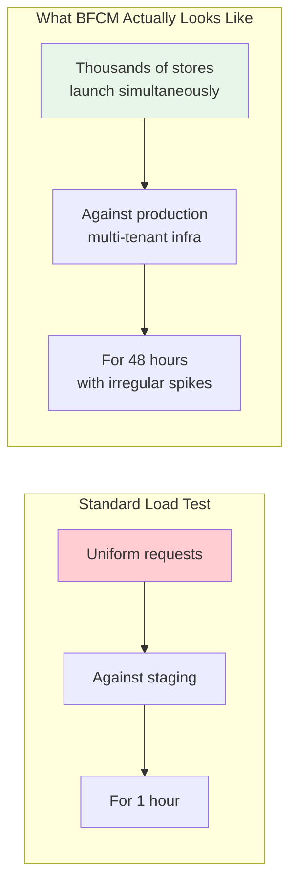
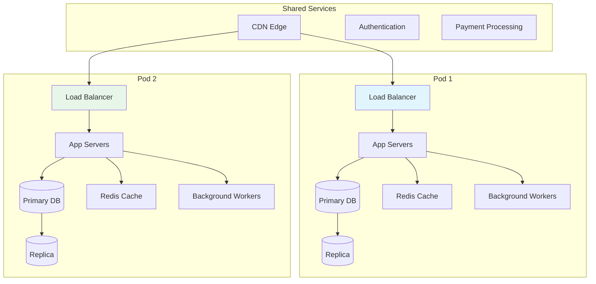
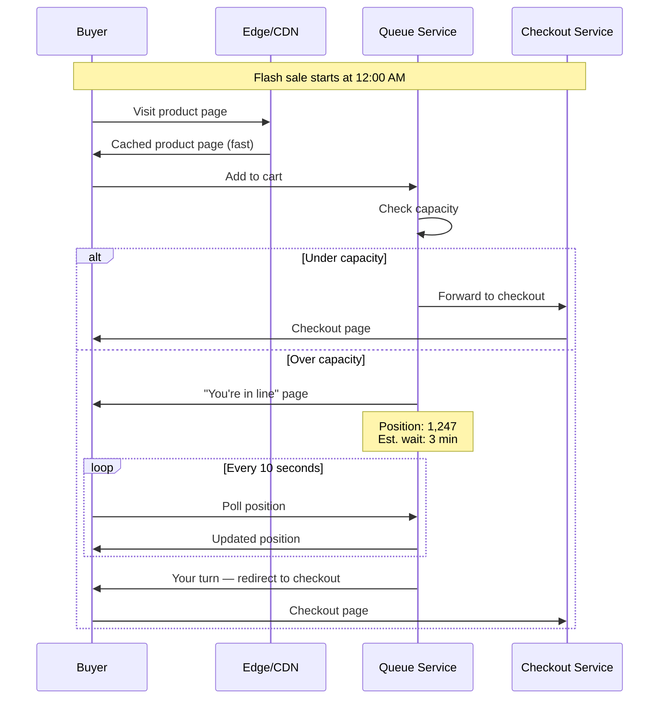
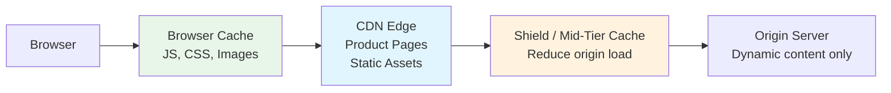
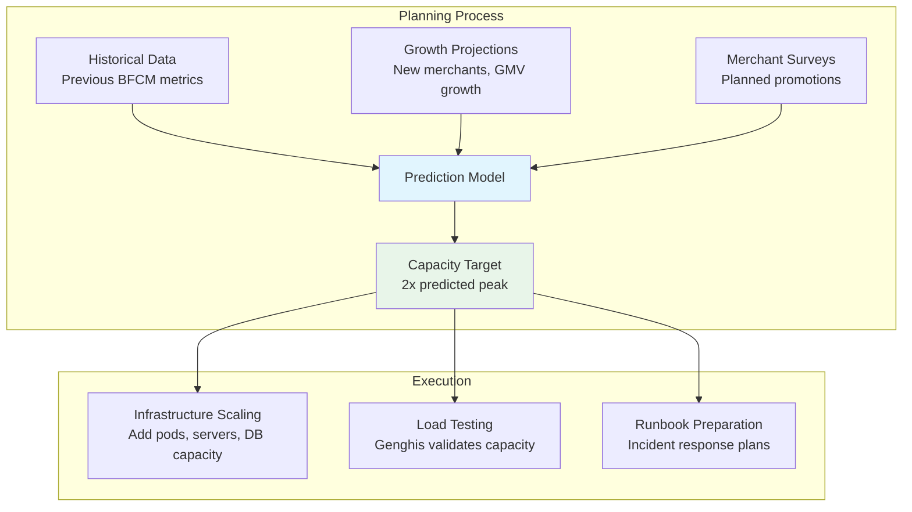

# How Shopify Handles Black Friday

Black Friday Cyber Monday (BFCM) is the Super Bowl of e-commerce infrastructure. In a 48-hour window, Shopify processes billions of dollars in sales across millions of stores, with traffic spikes that would bring most platforms to their knees. A single minute of downtime during peak can cost merchants millions of dollars in lost sales.

Shopify does not just survive BFCM — they have made it their signature engineering achievement. Their preparation starts months in advance, involves the entire engineering organization, and has produced some of the most sophisticated scaling infrastructure in the industry.

## The Scale of the Problem

To understand why BFCM is so hard, look at the numbers:

| Metric | Normal Day | BFCM Peak |
|---|---|---|
| Requests per second | ~80K | ~800K+ |
| Checkout throughput | Baseline | 10-40x normal |
| Database queries/sec | ~500K | ~5M+ |
| Merchants with sales | ~2M | ~2M (all at once) |
| Revenue processed | Millions | Billions in 48 hours |
| Error budget | Standard SLO | Zero tolerance |

The challenge is not just the magnitude — it is the **suddenness**. Traffic does not ramp up gradually. At midnight ET on Black Friday, thousands of merchants launch flash sales simultaneously. A store might go from 10 requests/minute to 10,000 requests/second in under 60 seconds.



## Genghis: Load Testing at Scale

Shopify built Genghis (named after the conqueror) to simulate BFCM traffic before it happens. Traditional load testing tools like JMeter or k6 were insufficient because they could not replicate Shopify's specific traffic patterns.

### Why Standard Load Testing Fails



**Problems with standard tools:**
- They generate uniform traffic, but BFCM traffic is bursty and correlated
- They test one application, but Shopify is multi-tenant — the blast radius matters
- They use synthetic data, but real merchants have vastly different catalog sizes, theme complexity, and app ecosystems
- They run for minutes, but BFCM runs for days

### How Genghis Works

Genghis replays anonymized production traffic at amplified levels:

```
Genghis Architecture:
┌──────────────────┐
│  Traffic Capture  │ ← Record real production traffic patterns
│  (7 days of data) │
└────────┬─────────┘
         │
┌────────▼─────────┐
│  Traffic Shaping  │ ← Amplify to 10-40x, model flash sale bursts
│  & Amplification  │
└────────┬─────────┘
         │
┌────────▼─────────┐
│  Genghis Workers  │ ← Distributed across multiple regions
│  (thousands of    │   Generate requests against production
│   containers)     │
└────────┬─────────┘
         │
┌────────▼─────────┐
│  Production       │ ← Real infrastructure, real database,
│  Infrastructure   │   real caches, real edge network
└──────────────────┘
```

::: danger Genghis runs against production
This is not a typo. Shopify load tests against their actual production infrastructure. The reasoning: staging environments lie. They have different hardware, different data sizes, different cache hit rates, and different network topology. The only way to know if production can handle BFCM is to test production.
:::

**Safety mechanisms:**
- Tests run during low-traffic windows (Tuesday 3 AM)
- Automatic circuit breakers halt the test if error rates exceed thresholds
- "Canary stores" are monitored first — if they degrade, the test stops
- All test traffic is tagged and can be distinguished from real traffic
- Rollback procedures are practiced before every test run

### What Genghis Finds

Every year, Genghis discovers problems that would have caused outages:

| Year | Discovery | Fix |
|---|---|---|
| 2019 | Redis cluster hit max connections under 10x load | Increased connection pool limits and added connection multiplexing |
| 2020 | Cart serialization latency spiked at 15x load | Rewrote cart serialization to use binary format |
| 2021 | Database connection exhaustion at 20x | Implemented connection-level load shedding |
| 2022 | CDN cache stampede on product image invalidation | Added stale-while-revalidate headers |
| 2023 | Checkout service CPU saturation from tax calculations | Memoized tax rate lookups per region |

## Pod Architecture: Tenant Isolation

Shopify's most important architectural decision for BFCM resilience is their pod-based architecture. Every Shopify store is assigned to a pod — a self-contained unit of infrastructure that is isolated from other pods.

### What Is a Pod?



**Key properties of a pod:**

| Property | Implementation |
|---|---|
| Database isolation | Each pod has its own MySQL primary + replicas |
| Cache isolation | Each pod has its own Redis cluster |
| Worker isolation | Background jobs run on pod-local workers |
| Network isolation | Pods are in separate network segments |
| Deployment independence | Pods can be deployed independently |
| Failure isolation | A crash in Pod 1 does not affect Pod 2 |

### Why Pods Exist

Before pods, Shopify had a traditional multi-tenant architecture where all stores shared the same database and application servers. This worked until it did not:

**The 2014 Incident:** A single merchant ran a viral flash sale that generated 100x their normal traffic. Their queries saturated the shared database's query optimizer, causing slow queries that affected every other merchant on the same database. Shopify's entire platform degraded for hours because one store went viral.

**The lesson:** In multi-tenant systems, isolation is not a nice-to-have. It is a survival requirement. Pods ensure that one merchant's success (or failure) cannot bring down other merchants.

### Store-to-Pod Assignment

Stores are assigned to pods based on:

1. **Traffic volume** — high-traffic stores get pods with more capacity
2. **BFCM history** — stores that historically spike on BFCM are distributed across pods
3. **Industry correlation** — stores in the same industry (fashion, electronics) tend to spike together, so they are placed in different pods
4. **Geographic correlation** — stores in the same timezone spike together at midnight

::: tip This is the noisy neighbor problem
Pod architecture is Shopify's solution to the classic multi-tenant "noisy neighbor" problem. By isolating tenants into pods, a noisy neighbor can only affect other tenants in the same pod — and pod assignment strategies minimize the chance of correlated spikes within a pod. See [Multi-Tenancy](/architecture-patterns/multi-tenancy/) for a deeper treatment.
:::

## Flash Sale Queue System

When a merchant launches a flash sale, the traffic pattern is a step function — zero to maximum in seconds. Without protection, this would overwhelm the checkout system. Shopify's solution: a virtual queue.

### How the Queue Works



**Queue design decisions:**

1. **Fairness** — first come, first served. No priority based on cart value or customer tier.
2. **Transparency** — buyers see their position and estimated wait time. Uncertainty causes abandonment.
3. **Time limits** — once you reach the front of the queue, you have 10 minutes to complete checkout. This prevents people from holding spots indefinitely.
4. **Product-level inventory reservation** — when you enter checkout, inventory is tentatively reserved. If you do not complete in 10 minutes, it is released back.

### Checkout Throttling

The queue is not a simple FIFO. It is a rate-limited admission controller:

```
Checkout throughput capacity: 10,000 checkouts/sec (per pod)
Current checkout rate: 9,500/sec
Queue admission rate: 500/sec (capacity - current)

If current drops to 8,000/sec:
Queue admission rate increases to 2,000/sec

If current hits 10,000/sec:
Queue admission rate drops to 0 (queue grows)
```

This adaptive admission control ensures the checkout system is always running at maximum throughput without being overwhelmed.

## Edge Caching and CDN Strategy

During BFCM, the majority of traffic is product browsing, not purchasing. Caching product pages at the edge dramatically reduces load on origin servers.

### Cache Architecture



### Caching Strategy by Content Type

| Content | Cache Location | TTL | Invalidation |
|---|---|---|---|
| Product images | CDN edge | 1 year | URL-based versioning |
| Static assets (JS/CSS) | CDN edge | 1 year | Content hash in filename |
| Product pages | CDN edge | 5 minutes | Purge on product update |
| Cart page | No cache | — | Always dynamic |
| Checkout | No cache | — | Always dynamic |
| Inventory status | Short cache | 10 seconds | Tolerate slight staleness |
| Price | Short cache | 30 seconds | Purge on price change |

::: warning Stale inventory is dangerous
If the CDN caches "In Stock" for a product that just sold out, buyers add it to their cart and get an error at checkout. This creates a terrible experience during flash sales where products sell out in seconds. Shopify uses very short cache TTLs for inventory status and pushes cache invalidation events when inventory changes.
:::

### Edge Computing

Shopify runs logic at the CDN edge for:

1. **Bot detection** — block scraper bots before they reach origin servers
2. **Geolocation** — redirect to the correct storefront based on visitor country
3. **A/B testing** — route users to test variants without origin round-trips
4. **Rate limiting** — enforce per-IP rate limits at the edge (much cheaper than at origin)
5. **Static page serving** — serve cached pages directly from edge for 80%+ of requests

## Capacity Planning

### The Science of Prediction

Shopify starts BFCM capacity planning 4 months in advance:



**The 2x rule:** Shopify provisions 2x the predicted peak capacity. Why? Because predictions are wrong. New viral products emerge, celebrity endorsements happen, and competitor outages drive traffic to Shopify merchants. The 2x buffer absorbs surprises.

### Graceful Degradation

When traffic exceeds even the 2x buffer, Shopify's systems degrade gracefully:

| Degradation Level | What Happens | User Impact |
|---|---|---|
| Level 0: Normal | All features enabled | None |
| Level 1: Shed non-critical | Disable product recommendations, analytics tracking, recently viewed | Minimal — core shopping works |
| Level 2: Aggressive caching | Serve stale product pages, disable real-time inventory | Slight staleness, rare oversells |
| Level 3: Queue checkouts | Enable checkout queue system | Wait times for checkout |
| Level 4: Emergency | Disable lowest-priority stores, enable full static mode | Some merchants affected |

::: tip Load shedding is planned, not reactive
Each degradation level is pre-configured, tested, and can be activated with a single command. During BFCM, an incident commander monitors dashboards and activates levels proactively when leading indicators suggest a spike, not reactively after the system is already struggling.
:::

## The War Room

During BFCM, Shopify operates a 24/7 "war room" — a dedicated incident response center:

- **Staffing:** 100+ engineers on rotation, covering all time zones
- **Duration:** From Wednesday evening through Cyber Monday
- **Dashboards:** Real-time metrics for every pod, service, database, and CDN node
- **Communication:** Dedicated Slack channels, automated alert routing, pre-written runbooks
- **Decision authority:** Pre-delegated authority to activate degradation levels, scale infrastructure, and disable features without executive approval

### The BFCM Dashboard

```
┌─────────────────────────────────────────────────────────┐
│  BFCM Live Dashboard                         12:03 AM  │
├─────────────────────────────────────────────────────────┤
│  Requests/sec:  ████████████████████  847,203           │
│  Error rate:    █                     0.02%             │
│  Checkout/sec:  ██████████            12,847            │
│  Queue depth:   ████                  34,201            │
│  GMV (live):    $127,433,891                            │
├─────────────────────────────────────────────────────────┤
│  Pod Health:  [P1 ✓] [P2 ✓] [P3 ✓] [P4 ⚠] [P5 ✓]    │
│  DB Latency:  P1: 2ms  P2: 3ms  P3: 2ms  P4: 8ms     │
│  Cache Hit:   98.7%                                     │
│  CDN Hit:     94.2%                                     │
│  Degradation: Level 0 (Normal)                          │
└─────────────────────────────────────────────────────────┘
```

## Architecture Evolution

Shopify's BFCM architecture has evolved significantly:

| Year | Architecture | Key Change |
|---|---|---|
| 2014 | Shared-everything monolith | First major BFCM outage |
| 2015 | Database sharding by shop | Isolated database load |
| 2016 | Pod architecture (v1) | Full infrastructure isolation |
| 2018 | Pod architecture (v2) + Genghis | Systematic load testing |
| 2020 | Edge computing + queue system | Handle COVID-level traffic |
| 2022 | Cloud-native pods on Kubernetes | Elastic scaling |
| 2023 | Multi-region active-active | Survive region-level failures |

## Key Takeaways

1. **Test in production** — staging environments are lies. The only way to know if your system can handle 10x traffic is to throw 10x traffic at it.

2. **Isolate tenants** — in multi-tenant systems, one tenant's success should never cause another tenant's failure. Pods are Shopify's answer.

3. **Queue instead of crash** — when demand exceeds capacity, a transparent queue is always better than errors. Buyers will wait if they know their position.

4. **Degrade gracefully** — plan your degradation levels in advance. Know exactly which features to disable in which order. Test the degradation, not just the normal path.

5. **The 2x rule** — provision double your predicted peak. Predictions are always wrong, and you only get one chance at BFCM.

6. **Cache everything possible** — during BFCM, 95%+ of traffic should be served from cache. Invest in cache invalidation so you can cache aggressively without serving stale data.

## Cross-References

- [Caching Strategies](/system-design/caching/caching-strategies) — the caching patterns behind Shopify's CDN strategy
- [Thundering Herd](/system-design/caching/thundering-herd) — why cache stampedes happen during flash sales
- [Rate Limiting](/system-design/distributed-systems/rate-limiting) — the algorithms behind checkout throttling
- [Multi-Tenancy](/architecture-patterns/multi-tenancy/) — pod architecture as a multi-tenancy isolation pattern
- [Circuit Breaker](/system-design/distributed-systems/circuit-breaker) — how Genghis's safety mechanisms work

## Sources

- Shopify Engineering Blog: "How Shopify Scales for Black Friday" (2022)
- Shopify Engineering Blog: "Pod Architecture at Shopify" (2020)
- Shopify Engineering Blog: "How We Prepare for BFCM" (2023)
- QCon talk: "Scaling Shopify for Flash Sales" (Simon Eskildsen, 2019)
- Shopify Unite 2021: "Infrastructure Deep Dive"
- Shopify Engineering Blog: "Genghis: Load Testing at Scale" (2021)
