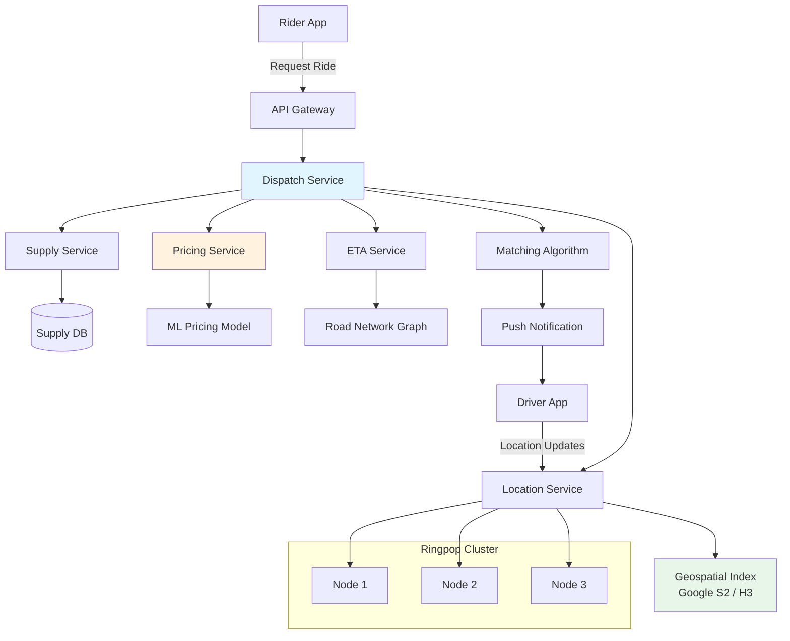
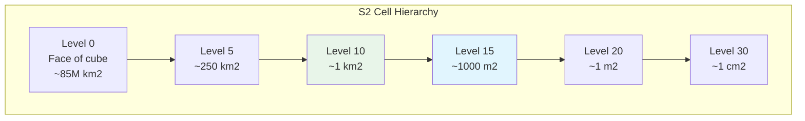
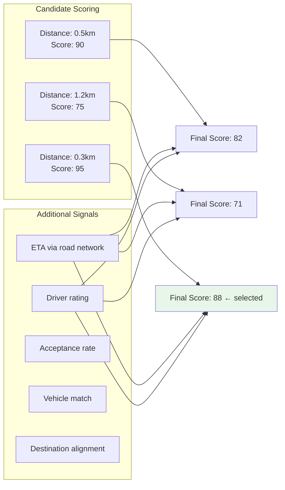
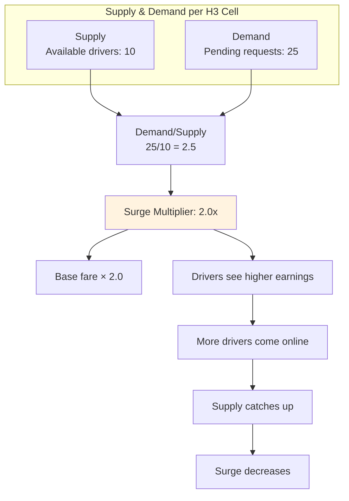
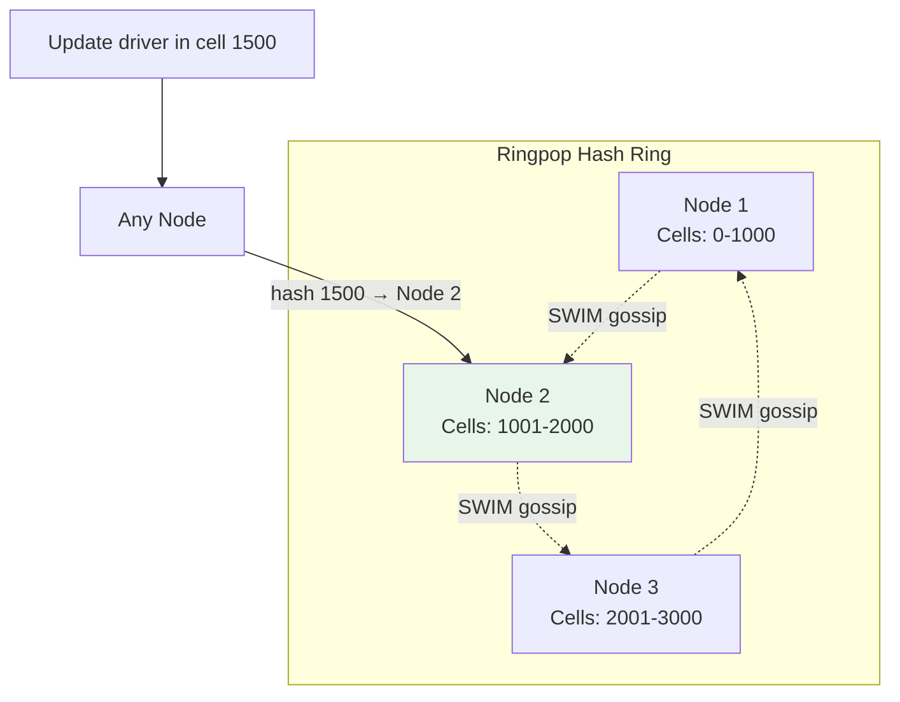
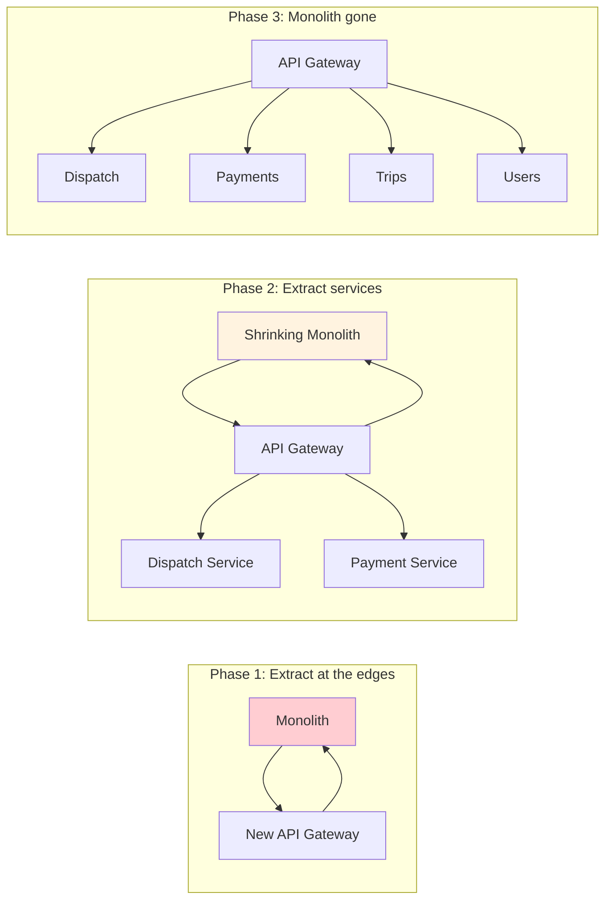

# How Uber Built Their Dispatch System

Every time you open the Uber app and request a ride, a system processes your request in under a second. It determines your precise location, finds nearby drivers, scores and ranks them across dozens of dimensions, calculates a price that balances supply and demand, and dispatches the best match — all while doing the same thing for millions of other riders simultaneously, across 10,000+ cities worldwide.

This is the architecture behind that system.

## The Problem

Uber's dispatch system must solve several hard problems simultaneously:

1. **Geospatial matching** — find drivers near a rider, considering road networks and real-time traffic
2. **Real-time indexing** — track the location of millions of moving drivers, updating every 4 seconds
3. **Supply-demand balancing** — dynamically adjust pricing to incentivize drivers and manage demand
4. **Sub-second latency** — the entire dispatch cycle must complete in under 1 second
5. **Global scale** — handle 10,000+ cities, each with different regulations, road networks, and peak patterns
6. **Zero downtime** — any outage directly translates to lost revenue and stranded passengers

## Architecture Overview



## Geospatial Indexing

### The Problem With Naive Approaches

The naive approach to "find drivers near point X" is to query all drivers and calculate distances:

```sql
SELECT * FROM drivers
WHERE is_available = true
AND distance(driver_lat, driver_lng, rider_lat, rider_lng) < 5km
ORDER BY distance;
```

This is O(N) for every query. With 5 million active drivers, this query runs millions of times per second. It does not work.

### Google S2 Geometry Library

Uber initially used the Google S2 library for geospatial indexing. S2 projects the Earth's surface onto the six faces of a cube, then recursively subdivides each face into a hierarchical cell structure.



Each cell has a unique 64-bit ID. The key insight: cells at any level form a **space-filling curve** (Hilbert curve), which means nearby cells on the Earth's surface have nearby IDs. This turns a 2D geospatial query into a 1D range query:

```
To find "all drivers within 2km of point P":
1. Compute the S2 cell covering for a 2km circle around P
   → Returns a set of cell ID ranges, e.g., [3001..3005, 3010..3012]
2. Query the driver index for drivers in those cell ranges
   → Simple range scan on a sorted index
3. Filter by exact distance (cell covering is approximate)
```

### H3: Uber's Hexagonal Grid

Uber later developed H3, a hexagonal hierarchical spatial index that addressed limitations they found with S2:

| Property | S2 Cells | H3 Cells |
|---|---|---|
| Shape | Square (quadrilateral) | Hexagon |
| Neighbor distance | Varies (corner vs edge) | Uniform (all neighbors equidistant) |
| Edge artifacts | Square grid alignment effects | Minimal (hexagons tile more naturally) |
| Resolution levels | 30 levels | 16 levels |
| Aperture | 4 (each cell splits into 4) | 7 (each cell splits into 7) |
| Use case | General geospatial | Ride-sharing, logistics, analysis |

Why hexagons? Every hexagon has six neighbors, all at the same distance from the center. Squares have eight neighbors, but corner neighbors are 1.41x farther than edge neighbors. For distance-based queries ("drivers within 2km"), hexagons give more uniform coverage.

```
Hexagonal grid over a city:
    ╱ ╲   ╱ ╲   ╱ ╲
   │  3 │  4 │  5 │
    ╲ ╱   ╲ ╱   ╲ ╱
   ╱ ╲   ╱ ╲   ╱ ╲
  │  1 │  2*│  6 │      * = rider location
   ╲ ╱   ╲ ╱   ╲ ╱      Drivers in cells 1-6 are candidates
  ╱ ╲   ╱ ╲   ╱ ╲       (k-ring of radius 1)
 │  7 │  8 │  9 │
  ╲ ╱   ╲ ╱   ╲ ╱
```

### Driver Location Index

The driver location index is an in-memory data structure that maps H3 cells to sets of drivers:

```
H3 Cell Index (Level 9, ~175m resolution):
┌───────────────┬─────────────────────────────────┐
│ Cell ID       │ Drivers                         │
├───────────────┼─────────────────────────────────┤
│ 89283082803   │ [driver_A, driver_B]            │
│ 89283082807   │ [driver_C]                      │
│ 8928308280b   │ [driver_D, driver_E, driver_F]  │
│ 89283082813   │ []                              │
│ ...           │ ...                             │
└───────────────┴─────────────────────────────────┘

Operations:
- Driver moves: O(1) — remove from old cell, add to new cell
- Find nearby:  O(k) — k-ring lookup, k = number of cells in radius
- Update rate:  ~millions/sec (drivers send location every 4s)
```

::: tip Why in-memory?
Driver locations change every 4 seconds. With 5 million drivers, that is over 1 million location updates per second. No database can handle this write rate with the read latency requirements. The index lives entirely in memory, distributed across a Ringpop cluster, with no persistence — if a node crashes, drivers simply re-register their locations within 4 seconds.
:::

## The Matching Algorithm

Finding nearby drivers is only step one. The matching algorithm scores each candidate across multiple dimensions:



The scoring function considers:

1. **ETA (not distance)** — a driver 0.5km away across a river might take 10 minutes; a driver 1.5km away on the same road might take 3 minutes
2. **Driver rating** — higher-rated drivers get a slight preference
3. **Acceptance rate** — drivers who frequently decline trips are deprioritized
4. **Vehicle type match** — UberX, UberBlack, UberXL have different vehicle requirements
5. **Destination alignment** — if a driver is heading toward the rider anyway (finishing another trip), they score higher
6. **Batching potential** — for UberPool, can this ride be combined with an existing route?

### ETA Computation

ETA is the most expensive signal to compute. It requires routing through a road network graph:

```
Road Network Graph:
- Nodes: ~100M intersections globally
- Edges: ~250M road segments
- Edge weights: travel time (varies by time of day, traffic)
- Update frequency: traffic weights refreshed every 2 minutes

ETA query:
- Input: driver location, rider location
- Output: estimated travel time in seconds
- Algorithm: Modified Dijkstra with hierarchical shortcuts (Contraction Hierarchies)
- Latency budget: <50ms per query
- QPS: millions per second (every candidate for every dispatch)
```

::: warning ETA accuracy is make-or-break
If the ETA says 3 minutes and the driver takes 10, the rider's experience is terrible. If the ETA is pessimistic, Uber dispatches a farther driver when a closer one was available. Uber invests heavily in ETA accuracy, using ML models trained on billions of historical trips, real-time traffic data, and even signals like building entry points and pickup spot difficulty.
:::

## Supply-Demand Pricing (Surge)

Surge pricing is Uber's most controversial and most important feature. It is a real-time market mechanism that balances supply and demand.

### How Surge Works



The pricing model is more sophisticated than a simple ratio:

1. **Geospatial smoothing** — surge does not change abruptly at cell boundaries; it is interpolated across neighboring cells
2. **Temporal smoothing** — surge changes gradually to avoid price oscillation
3. **ML-based forecasting** — predict demand 10-30 minutes ahead (concerts ending, flights landing, bars closing)
4. **Regulatory constraints** — some cities cap surge multipliers
5. **Rider sensitivity** — ML models predict how price-sensitive each rider is (not to charge them more, but to optimize marketplace efficiency)

## Ringpop: Custom Distributed Systems Framework

Uber built Ringpop to solve the problem of distributing the driver location index across multiple nodes. Ringpop provides:

- **Consistent hashing** — map H3 cells to nodes in a ring
- **SWIM protocol** — failure detection via gossip (not heartbeats to a central coordinator)
- **Request forwarding** — if a request arrives at the wrong node, it is transparently forwarded to the correct one



### Why Not Use Existing Solutions?

Uber evaluated ZooKeeper, Consul, and etcd. All fell short:

| Solution | Problem for Uber |
|---|---|
| ZooKeeper | Too much coordination overhead; single leader bottleneck for their write rate |
| Consul | Service discovery focused, not optimized for data sharding |
| etcd | Same leader bottleneck as ZooKeeper |
| Custom (Ringpop) | Decentralized (no leader), embeddable in each service, gossip-based failure detection |

The key difference: Ringpop is **embedded** in each service instance. There is no separate cluster to manage. Each instance is both an application server and a member of the hash ring.

## The Monolith-to-Microservices Migration

### The Original Monolith

Uber's first system was a single Python application called "uberblack" (named after the original UberBlack car service). It handled everything: dispatch, payments, trip management, driver onboarding, rider accounts, and more.

The monolith worked until it didn't:

- **Deployment bottleneck** — 500+ engineers committing to one repository; deploying took hours and frequently broke
- **Failure blast radius** — a bug in the payment code could crash dispatch
- **Scaling limitations** — could not scale dispatch independently of payments
- **Technology lock-in** — everything had to be Python, even when Go or Java was a better fit

### The Migration Strategy

Uber did not do a big-bang rewrite. They used the **Strangler Fig Pattern**:



Key decisions during the migration:

1. **Extract the most critical path first** — dispatch was extracted before payments because dispatch latency directly affected rider experience
2. **Dual-write during migration** — both the monolith and the new service handled dispatch for weeks, with results compared
3. **Feature flags everywhere** — every new service was behind a feature flag; if it broke, traffic instantly routed back to the monolith
4. **Domain-driven boundaries** — services were split along domain boundaries (dispatch, pricing, payments, trips), not technical layers

### The Outcome

By 2018, Uber operated 4,000+ microservices across multiple languages (Go, Java, Python, Node.js). The dispatch system alone consisted of ~20 services.

::: warning Microservices created new problems
The migration solved deployment bottlenecks and failure isolation, but created new challenges: distributed tracing became essential (they built Jaeger), managing 4000+ service dependencies required a custom service mesh, and the overall system complexity increased dramatically. Uber has publicly stated they may have gone too far with microservices.
:::

## Failure Modes and Lessons

### The 2015 Outage

In September 2015, a database failover triggered a cascade that took down dispatch globally for ~30 minutes. The root cause: the dispatch system depended on a single database cluster, and when the primary failed, the failover took too long because of replication lag.

**Lesson:** The dispatch system was redesigned to be database-independent for its hot path. The geospatial index moved entirely to in-memory Ringpop nodes, with the database used only for cold storage and recovery.

### GPS Accuracy Issues

GPS accuracy in urban canyons (downtown Manhattan, Hong Kong) can be off by 50-100 meters. This means:

- The rider's location might be on the wrong side of a highway
- The driver's location might show them in a building instead of on the street
- ETA calculations based on wrong locations are meaningless

**Solution:** Uber built a map-matching system that snaps GPS coordinates to the road network, using probabilistic models (Hidden Markov Models) to determine the most likely road position given a sequence of noisy GPS readings.

### Driver Location Staleness

Drivers send location updates every 4 seconds. In 4 seconds, a driver traveling at 60 km/h moves 67 meters. The index is always slightly stale.

**Solution:** The matching algorithm predicts where drivers will be based on their heading and speed, not just their last reported position. This forward prediction reduces effective staleness from 67 meters to under 10 meters.

## System Numbers at Scale

| Metric | Value |
|---|---|
| Active drivers (peak) | 5M+ |
| Rides per day | 25M+ |
| Location updates per second | 1M+ |
| Dispatch latency (p99) | < 1 second |
| ETA computation QPS | Millions |
| Cities served | 10,000+ |
| Microservices | 4,000+ |
| H3 cells indexed | Millions |

## Key Takeaways

1. **Geospatial problems need specialized data structures** — you cannot brute-force distance calculations at scale. Hierarchical spatial indexes (S2, H3) turn 2D queries into 1D range scans.

2. **In-memory is the only option for real-time** — when you need sub-second latency on millions of updates per second, databases are too slow. Accept the trade-off: you lose durability but gain speed.

3. **ETA matters more than distance** — the straight-line distance to a driver is meaningless in a city. Road network routing with real-time traffic is essential.

4. **Markets need feedback loops** — surge pricing is not just about charging more; it is a control system that balances supply and demand in real time.

5. **Migrate incrementally** — the Strangler Fig Pattern let Uber migrate from monolith to microservices over years, without a single big-bang cutover.

## Cross-References

- [Consistent Hashing](/system-design/distributed-systems/consistent-hashing) — the foundation of Ringpop's data distribution
- [Microservices](/architecture-patterns/microservices/) — patterns Uber used during migration
- [Migration from Monolith](/architecture-patterns/microservices/migration-from-monolith) — the Strangler Fig Pattern in detail
- [Load Balancing](/system-design/load-balancing/) — how Uber distributes traffic across dispatch nodes
- [Gossip Protocols](/system-design/distributed-systems/gossip-protocols) — the SWIM protocol used by Ringpop

## Sources

- Uber Engineering Blog: "The Uber Engineering Tech Stack" (2016)
- Uber Engineering Blog: "H3: Uber's Hexagonal Hierarchical Spatial Index" (2018)
- Uber Engineering Blog: "Ringpop: Cooperative Distributed Systems" (2015)
- QCon London talk: "Scaling Uber's Real-Time Market Platform" (Matt Ranney, 2016)
- InfoQ: "How Uber Manages a Million Writes Per Second" (2016)
- Uber Engineering Blog: "Engineering Failover Handling" (2016)
