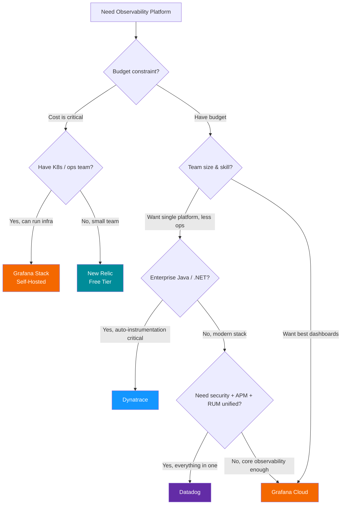

# Datadog vs Grafana Stack vs New Relic vs Dynatrace

Observability is the most expensive line item that engineering teams underestimate. A wrong choice can mean six-figure annual bills or, worse, blind spots during incidents. This comparison breaks down the four dominant observability platforms across every dimension: pricing, features, operational burden, and the often-ignored total cost of ownership.

## Overview

| Platform | Type | Founded | Core Philosophy |
|---|---|---|---|
| **Datadog** | SaaS only | 2010 | "Unified platform for every signal" |
| **Grafana Stack** | OSS + Cloud | 2014 | "Composable, open-source observability" |
| **New Relic** | SaaS only | 2008 | "All-in-one with generous free tier" |
| **Dynatrace** | SaaS / Managed | 2005 | "AI-powered automatic instrumentation" |

::: tip The Key Trade-off
Datadog, New Relic, and Dynatrace optimize for convenience (SaaS, auto-instrumentation, unified UI). Grafana Stack optimizes for control and cost (open-source, self-hosted option, composable backends). Your choice depends on whether you value operational simplicity or cost control.
:::

## Architecture Comparison

```mermaid
graph TB
    subgraph Datadog
        D1[dd-agent<br/>Host Agent] --> D2[Datadog Intake API]
        D2 --> D3[Metrics Engine]
        D2 --> D4[Log Pipeline]
        D2 --> D5[APM / Traces]
        D3 --> D6[Unified Dashboard<br/>& Alerting]
        D4 --> D6
        D5 --> D6
    end

    subgraph Grafana["Grafana Stack (LGTM)"]
        G1[Grafana Agent / Alloy] --> G2[Loki<br/>Logs]
        G1 --> G3[Mimir<br/>Metrics]
        G1 --> G4[Tempo<br/>Traces]
        G2 --> G5[Grafana<br/>Dashboard]
        G3 --> G5
        G4 --> G5
        G5 --> G6[Alerting<br/>OnCall]
    end

    subgraph NewRelic["New Relic"]
        N1[NR Agent / OTel] --> N2[NRDB<br/>Telemetry DB]
        N2 --> N3[Metrics]
        N2 --> N4[Logs]
        N2 --> N5[Traces]
        N3 --> N6[Unified UI<br/>& AI Insights]
        N4 --> N6
        N5 --> N6
    end

    subgraph Dynatrace
        Y1[OneAgent<br/>Auto-Instrument] --> Y2[Dynatrace Cluster]
        Y2 --> Y3[Smartscape<br/>Topology]
        Y2 --> Y4[Davis AI<br/>Root Cause]
        Y3 --> Y5[Unified Dashboard]
        Y4 --> Y5
    end

    style Datadog fill:#632ca6,color:#fff
    style Grafana fill:#f46800,color:#fff
    style NewRelic fill:#008c99,color:#fff
    style Dynatrace fill:#1496ff,color:#fff
```



## Feature Matrix

| Feature | Datadog | Grafana Stack | New Relic | Dynatrace |
|---|---|---|---|---|
| **Metrics** | Custom metrics, StatsD, DogStatsD | Mimir (Prometheus-compatible) | Dimensional metrics | Built-in + custom |
| **Logs** | Log Management (indexed + archived) | Loki (label-based, no full indexing) | Log Management | Log Management v2 |
| **Traces / APM** | Full APM with profiling | Tempo (Jaeger/Zipkin-compatible) | Distributed tracing | PurePath (auto-instrumented) |
| **Profiling** | Continuous Profiler (built-in) | Pyroscope (acquired) | None (planned) | Code-level profiling |
| **RUM (Real User)** | RUM + Session Replay | Faro (experimental) | Browser monitoring | Real User Monitoring |
| **Synthetics** | Synthetic monitoring | Synthetic monitoring (Cloud) | Synthetic monitoring | Synthetic monitoring |
| **Infrastructure** | 750+ integrations | Prometheus exporters | 700+ integrations | OneAgent auto-discovery |
| **Kubernetes** | Cluster Agent, Helm chart | Native Prometheus + Loki | K8s integration | Full K8s observability |
| **Database monitoring** | DBM (query-level insights) | Plugin-based | None built-in | Database insights |
| **Security** | Cloud Security, ASM, CSPM | None (different tools) | Vulnerability mgmt | Application Security |
| **AI / ML** | Watchdog (anomaly detection) | ML-based alerting (Cloud) | AI-powered alerts | Davis AI (root cause) |
| **Custom dashboards** | Drag-and-drop, 400+ widgets | Grafana (industry standard) | NRQL-powered dashboards | Custom dashboards |
| **Alerting** | Monitors, composite alerts | Grafana Alerting, OnCall | NRQL alert conditions | Davis-powered alerts |
| **SLO tracking** | Built-in SLO management | SLO support (Grafana Cloud) | Service levels (SLI/SLO) | SLO management |
| **OpenTelemetry** | Full OTel support | Native OTel support | Full OTel support | Full OTel support |
| **Self-hosted option** | No | Yes (fully open-source) | No | Managed (on-prem) |
| **Data retention** | 15 days (default) | Configurable (self-hosted) | 8-395 days by data type | 35 days (default) |

## Code & Config Comparison

### Agent Installation

**Datadog:**

```yaml
# Kubernetes DaemonSet via Helm
# helm install datadog datadog/datadog -f values.yaml
apiVersion: v1
kind: Secret
metadata:
  name: datadog-secret
data:
  api-key: <BASE64_ENCODED_KEY>
---
# values.yaml
datadog:
  apiKey: <DATADOG_API_KEY>
  site: datadoghq.com
  logs:
    enabled: true
    containerCollectAll: true
  apm:
    portEnabled: true
  processAgent:
    enabled: true
  networkMonitoring:
    enabled: true
```

**Grafana Stack** (Alloy):

```hcl
// alloy config.alloy
prometheus.scrape "pods" {
  targets    = discovery.kubernetes.pods.targets
  forward_to = [prometheus.remote_write.mimir.receiver]
}

prometheus.remote_write "mimir" {
  endpoint {
    url = "http://mimir:9009/api/v1/push"
  }
}

loki.source.kubernetes "pods" {
  targets    = discovery.kubernetes.pods.targets
  forward_to = [loki.write.default.receiver]
}

loki.write "default" {
  endpoint {
    url = "http://loki:3100/loki/api/v1/push"
  }
}

otelcol.receiver.otlp "default" {
  grpc { endpoint = "0.0.0.0:4317" }
  http { endpoint = "0.0.0.0:4318" }
  output {
    traces = [otelcol.exporter.otlphttp.tempo.input]
  }
}

otelcol.exporter.otlphttp "tempo" {
  client { endpoint = "http://tempo:4318" }
}
```

**New Relic** (OTel Collector):

```yaml
# otel-collector-config.yaml
receivers:
  otlp:
    protocols:
      grpc:
        endpoint: 0.0.0.0:4317
      http:
        endpoint: 0.0.0.0:4318
  prometheus:
    config:
      scrape_configs:
        - job_name: 'kubernetes-pods'
          kubernetes_sd_configs:
            - role: pod

exporters:
  otlphttp:
    endpoint: https://otlp.nr-data.net
    headers:
      api-key: ${NEW_RELIC_LICENSE_KEY}

service:
  pipelines:
    metrics:
      receivers: [otlp, prometheus]
      exporters: [otlphttp]
    traces:
      receivers: [otlp]
      exporters: [otlphttp]
    logs:
      receivers: [otlp]
      exporters: [otlphttp]
```

**Dynatrace:**

```bash
# OneAgent installation — fully automatic
# Kubernetes via Helm
helm install dynatrace-operator \
  oci://public.ecr.aws/dynatrace/dynatrace-operator \
  --create-namespace --namespace dynatrace

# DynaKube custom resource
cat <<'DYNA'
apiVersion: dynatrace.com/v1beta2
kind: DynaKube
metadata:
  name: dynakube
  namespace: dynatrace
spec:
  apiUrl: https://{your-environment}.live.dynatrace.com/api
  tokens: dynakube
  oneAgent:
    cloudNativeFullStack:
      image: ""
  activeGate:
    capabilities:
      - routing
      - kubernetes-monitoring
DYNA
```

### Querying Data

**Datadog** (query syntax):

```
# Metrics
avg:system.cpu.user{env:production,service:api} by {host}

# Logs
service:api status:error @http.status_code:500
  | pattern `Error processing request *`
  | stats count by @http.url

# APM
env:production service:api resource_name:GET_/api/users
```

**Grafana** (PromQL + LogQL):

```promql
# Metrics (PromQL)
rate(http_requests_total{job="api",status=~"5.."}[5m])
  / rate(http_requests_total{job="api"}[5m])

# Logs (LogQL)
{namespace="production", container="api"}
  |= "error"
  | json
  | status_code >= 500
  | line_format "{{.method}} {{.path}} - {{.message}}"

# Traces (TraceQL)
{ resource.service.name = "api" && status = error && duration > 500ms }
```

**New Relic** (NRQL):

```sql
-- Metrics
SELECT average(cpuPercent) FROM SystemSample
  WHERE environment = 'production'
  FACET hostname SINCE 1 hour ago

-- Logs
SELECT count(*) FROM Log
  WHERE service = 'api' AND level = 'error'
  FACET message SINCE 1 hour ago TIMESERIES

-- APM
SELECT percentile(duration, 95) FROM Transaction
  WHERE appName = 'api' AND httpResponseCode >= 500
  FACET name SINCE 1 hour ago
```

::: tip Query Language Comparison
NRQL (New Relic) feels the most natural for SQL-literate engineers. PromQL (Grafana) is the most powerful for time-series math. Datadog's query language sits between them. Dynatrace uses DQL (Dynatrace Query Language) which is similar to KQL.
:::

## Performance

### Ingestion & Query Speed

| Metric | Datadog | Grafana Cloud | New Relic | Dynatrace |
|---|---|---|---|---|
| **Metric ingestion rate** | Millions/sec | Millions/sec (Mimir) | Millions/sec | Millions/sec |
| **Log ingestion rate** | Unlimited (pay per GB) | Unlimited (Loki scales horizontally) | Unlimited (pay per GB) | Unlimited |
| **Trace ingestion** | 50 traces/sec/agent (default) | Unlimited (Tempo) | Unlimited | Automatic sampling |
| **Dashboard load time** | <2s (typical) | <3s (typical) | <2s (typical) | <2s (typical) |
| **Alert evaluation** | Every 1 min | Every 1 min (configurable) | Every 1 min | Real-time (Davis AI) |
| **Query timeout** | 60s | Configurable | 60s | 60s |
| **Data retention (default)** | 15 days metrics | 13 months (Cloud) | 8-30 days (varies) | 35 days |

### Cost at Scale (Monthly Estimates)

| Scale | Datadog | Grafana Cloud | New Relic | Dynatrace |
|---|---|---|---|---|
| **5 hosts, basic APM** | ~$300 | ~$50 (Cloud) / $0 (OSS) | $0 (free tier) | ~$500 |
| **50 hosts, full stack** | ~$5,000 | ~$800 (Cloud) | ~$2,000 | ~$8,000 |
| **200 hosts, enterprise** | ~$25,000 | ~$4,000 (Cloud) | ~$12,000 | ~$35,000 |
| **500 hosts, full observability** | ~$70,000 | ~$12,000 (Cloud) | ~$30,000 | ~$90,000 |
| **Self-hosted option** | N/A | $0 (infra costs only) | N/A | N/A |

::: warning Datadog Pricing Surprises
Datadog's pricing is notoriously complex: per-host APM, per-GB logs, per-million custom metrics, per-million indexed spans, per-GB network monitoring — each billed separately. Teams routinely see 2-5x their estimated bill in the first quarter. Always negotiate annual contracts and set ingestion limits.
:::

## Developer Experience

### Strengths

**Datadog:**
- Single pane of glass: metrics, logs, traces, security, RUM — all correlated
- 750+ out-of-the-box integrations with auto-discovery
- Notebooks for collaborative incident investigation
- Watchdog AI surfaces anomalies without manual threshold tuning

**Grafana Stack:**
- Open-source with no vendor lock-in (Loki, Mimir, Tempo are all OSS)
- Grafana dashboards are the gold standard for visualization
- PromQL is the most expressive metrics query language
- Self-hosted option eliminates per-GB and per-host costs

**New Relic:**
- 100 GB/month free forever (best free tier in the industry)
- NRQL is SQL-like and approachable for most engineers
- Errors Inbox for triaging application errors
- Single pricing dimension (per-GB ingested) is predictable

**Dynatrace:**
- OneAgent auto-instruments everything (zero code changes)
- Davis AI performs automatic root cause analysis
- Smartscape topology maps entire environment automatically
- Best-in-class for enterprise Java / .NET applications

### Pain Points

| Platform | Key Frustration |
|---|---|
| **Datadog** | Bills spiral out of control; custom metrics pricing penalizes cardinality |
| **Grafana** | Self-hosting Mimir + Loki + Tempo is operationally expensive; dashboards require manual building |
| **New Relic** | UI can feel overwhelming; some features feel bolted-on rather than integrated |
| **Dynatrace** | Most expensive option; complex licensing (Davis Data Units); legacy UI alongside new |

## When to Use Which



### Decision Summary

| Scenario | Recommended Platform |
|---|---|
| Startup, budget-constrained, <100 GB/mo | **New Relic** (free tier) |
| Engineering team wants full control, has ops capacity | **Grafana Stack** (self-hosted) |
| Enterprise wants one vendor for everything | **Datadog** |
| Enterprise Java/.NET, needs auto-instrumentation | **Dynatrace** |
| Kubernetes-native stack, Prometheus already in use | **Grafana Cloud** |
| Security + observability unified | **Datadog** (Cloud Security) |
| Cost-sensitive with moderate scale (50-200 hosts) | **Grafana Cloud** |
| Compliance-heavy industry, on-prem required | **Grafana Stack** or **Dynatrace Managed** |

## Migration

### Datadog to Grafana Stack

```bash
# 1. Deploy Grafana Stack (Docker Compose or Helm)
helm repo add grafana https://grafana.github.io/helm-charts

# Install LGTM stack
helm install mimir grafana/mimir-distributed -n monitoring
helm install loki grafana/loki -n monitoring
helm install tempo grafana/tempo-distributed -n monitoring
helm install grafana grafana/grafana -n monitoring

# 2. Deploy Grafana Alloy (replaces dd-agent)
helm install alloy grafana/alloy -n monitoring -f alloy-values.yaml

# 3. Migrate dashboards
# Export Datadog dashboards via API
curl -s "https://api.datadoghq.com/api/v1/dashboard" \
  -H "DD-API-KEY: $DD_API_KEY" \
  -H "DD-APPLICATION-KEY: $DD_APP_KEY" > dashboards.json

# Use community converter tools to transform
# Datadog dashboard JSON → Grafana dashboard JSON
# Manual adjustment will be needed for queries

# 4. Migrate alerts
# Datadog monitors → Grafana alerting rules
# Query language must be rewritten:
#   Datadog:  avg:system.cpu.user{env:prod}
#   PromQL:   avg(node_cpu_seconds_total{mode="user",env="prod"})

# 5. Run both in parallel for 2-4 weeks
# Compare alert fidelity and dashboard accuracy
```

### Prometheus/Grafana to Grafana Cloud

```bash
# 1. Configure remote_write in existing Prometheus
# prometheus.yml
remote_write:
  - url: https://prometheus-prod-01-xxx.grafana.net/api/prom/push
    basic_auth:
      username: <GRAFANA_CLOUD_INSTANCE_ID>
      password: <GRAFANA_CLOUD_API_KEY>

# 2. Configure Loki for log shipping
# Use Grafana Alloy or Promtail to forward to Grafana Cloud

# 3. Import existing dashboards
# Grafana dashboard JSON is compatible between
# self-hosted and Grafana Cloud (same format)

# 4. Migrate alerting rules
# Export from self-hosted Grafana and import to Cloud
# Alert rules format is identical
```

::: tip Migration Timeline
Budget 2-4 weeks for a migration between observability platforms. The hardest part is not the tooling — it is rewriting queries, rebuilding dashboards, and retraining the team on a new query language. Run both platforms in parallel during transition.
:::

## Verdict

**Datadog** is the most complete observability platform on the market. If budget is not a constraint and you want metrics, logs, traces, RUM, security, database monitoring, and synthetic testing in a single unified UI, Datadog is the answer. But prepare for aggressive pricing.

**Grafana Stack** offers the best value proposition. The open-source LGTM stack (Loki, Grafana, Mimir, Tempo) gives you full observability with no per-host or per-GB licensing. Grafana Cloud removes the operational burden while keeping costs 3-5x lower than Datadog.

**New Relic** has the most generous free tier (100 GB/month) and the most approachable query language (NRQL). It is the best starting point for startups that need full observability without upfront costs.

**Dynatrace** is the premium choice for large enterprises running Java/.NET monoliths. Its automatic instrumentation and AI-powered root cause analysis justify the premium for organizations where manual instrumentation is not feasible.

::: tip Bottom Line
For most teams, **Grafana Cloud** offers the best balance of cost, features, and flexibility. Choose **Datadog** when you need every signal in one platform and have the budget. Start with **New Relic** if you want to ship observability today for $0. Pick **Dynatrace** for enterprise Java/.NET environments where auto-instrumentation is worth the premium.
:::

## Which Would You Choose?

**Scenario 1:** You are a 5-person startup with a Kubernetes cluster. You have zero observability today. Budget is less than $100/month, and nobody on the team wants to operate monitoring infrastructure.

::: details Recommendation: New Relic (free tier)
New Relic's 100 GB/month free tier gives you metrics, logs, traces, and a full APM dashboard for $0. NRQL is SQL-like and approachable. For a small team that needs observability today without operational overhead, New Relic's free tier is unbeatable. Grafana Cloud is the runner-up at ~$50/month.
:::

**Scenario 2:** Your 200-person engineering org needs metrics, logs, traces, RUM, synthetic monitoring, security scanning (CSPM), and database monitoring — all correlated in a single UI. Budget is approved.

::: details Recommendation: Datadog
Datadog is the only platform that unifies all these signals in a single pane of glass. Watchdog AI correlates metrics anomalies with log spikes and trace errors automatically. The DX is polished, and 750+ integrations cover every infrastructure component. Negotiate an annual contract to control costs.
:::

**Scenario 3:** You are a platform engineering team responsible for observability across 500 hosts. Your company requires on-premise data storage for compliance. You have a Kubernetes cluster and ops capacity to run infrastructure.

::: details Recommendation: Grafana Stack (self-hosted)
Self-hosted Loki + Mimir + Tempo + Grafana gives you full observability with zero per-GB or per-host licensing costs. Data stays on your infrastructure for compliance. The operational burden is real (you maintain the stack), but the cost savings at 500 hosts are enormous: $0 licensing vs ~$70,000/month for Datadog.
:::

::: warning Common Misconceptions
- **"Datadog is expensive"** — Datadog is expensive at scale, but its free tier (5 hosts, limited features) and startup program can make it affordable early on. The pricing shock comes when you scale past initial tiers and enable add-ons (custom metrics, logs, APM, RUM each billed separately).
- **"Self-hosting Grafana is free"** — Self-hosting has zero licensing costs but real infrastructure and operations costs. Running Mimir, Loki, and Tempo requires compute, storage, and engineers to maintain them. For teams <50 hosts, Grafana Cloud is usually cheaper than self-hosting.
- **"New Relic is not enterprise-ready"** — New Relic powers observability at major enterprises. Its NRQL query language, Errors Inbox, and APM are production-grade. The free tier generosity sometimes creates a perception of being "not serious."
- **"You need Dynatrace for Java applications"** — Dynatrace's auto-instrumentation is excellent for Java, but Datadog's dd-trace-java and Grafana's Grafana Agent with OpenTelemetry also provide comprehensive Java APM. Dynatrace's advantage is convenience, not exclusivity.
:::

::: tip Real Migration Stories
**Uber: Custom observability to open-source (M3, Jaeger)** — Uber built their own observability stack including M3 (metrics) and Jaeger (tracing), which they open-sourced. Their scale (thousands of microservices) made SaaS observability cost-prohibitive. This extreme example shows that at massive scale, custom/open-source observability can be the only economically viable option.

**DigitalOcean: Datadog to Grafana** — DigitalOcean migrated from Datadog to self-hosted Grafana Stack to reduce observability costs at their scale. The migration took several months and required rewriting dashboards and alerts, but the annual savings were in the millions.
:::

::: details Quiz

**1. Why does Datadog pricing surprise teams who did not budget carefully?**

Datadog bills separately for each signal type: per-host for infrastructure, per-host for APM, per-GB for logs, per-million for custom metrics, per-million for indexed spans, and per-GB for network monitoring. Teams often enable features incrementally and discover the cumulative cost is 2-5x their initial estimate.

**2. What is the Grafana LGTM stack?**

LGTM stands for Loki (logs), Grafana (visualization), Mimir (metrics, Prometheus-compatible), and Tempo (traces). Together they provide a complete open-source observability platform. Grafana Cloud is the managed SaaS version of this stack.

**3. How does Dynatrace's Davis AI differ from other platforms' alerting?**

Davis AI performs automatic root cause analysis. When an issue occurs, Davis traces the causality chain across infrastructure, application, and service topology to identify the root cause — not just the symptom. Other platforms provide anomaly detection but require human investigation for root cause.

**4. What is the advantage of PromQL over other query languages for metrics?**

PromQL is purpose-built for time-series math: rate calculations, histogram quantiles, label-based aggregation, and cross-metric operations. It is the most expressive language for infrastructure metrics analysis and is the standard query language for Prometheus-compatible systems.

**5. When does self-hosting Grafana Stack NOT make sense?**

When your team is small (<5 engineers), when you do not have Kubernetes operations experience, when you need the monitoring stack to just work without maintenance, or when the infrastructure cost of running Mimir/Loki/Tempo exceeds the cost of Grafana Cloud.
:::

## One-Liner Summary

Datadog is the all-in-one SaaS gold standard (at a premium price), Grafana Stack is the open-source cost champion, New Relic has the best free tier, and Dynatrace auto-instruments everything for enterprise Java/.NET.
