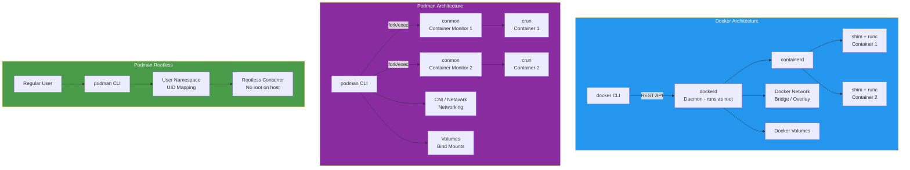
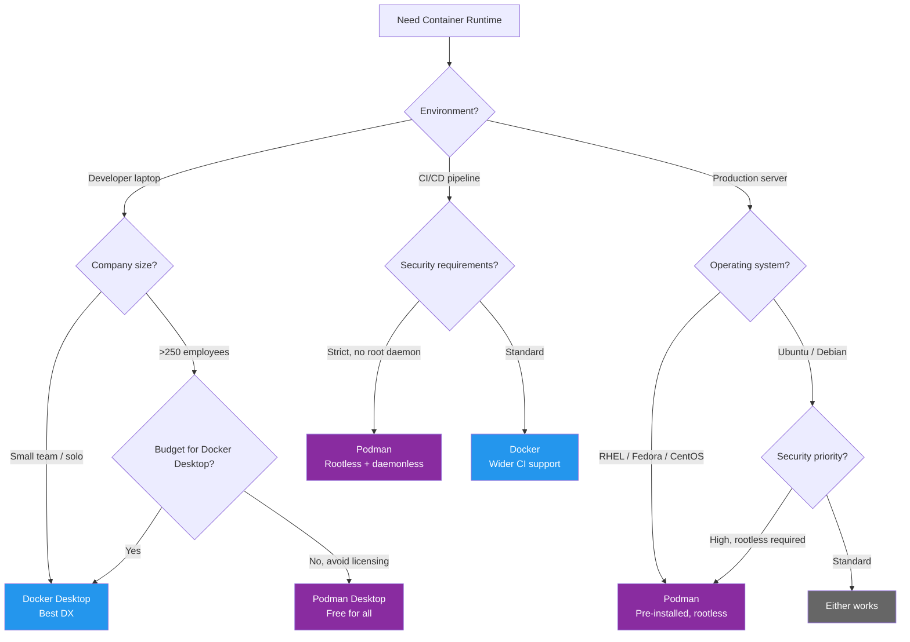

# Docker vs Podman

Docker defined the container revolution. Podman emerged as its rootless, daemonless alternative. For years the comparison was academic — Docker was the only real option. Today Podman ships as the default container engine in RHEL, Fedora, and CentOS Stream, and its compatibility with Docker CLI syntax makes migration genuinely painless. This comparison examines where each tool excels and where each falls short.

## Overview

| Aspect | Docker | Podman |
|---|---|---|
| **Maintainer** | Docker Inc. | Red Hat / Containers community |
| **First release** | 2013 | 2018 |
| **Architecture** | Client-server (daemon) | Daemonless (fork-exec) |
| **Default privileges** | Root (rootless available) | Rootless by default |
| **License** | Apache 2.0 (Engine) | Apache 2.0 |
| **Container runtime** | containerd + runc | conmon + crun (or runc) |
| **Image format** | OCI / Docker | OCI / Docker |
| **Desktop app** | Docker Desktop (paid for enterprise) | Podman Desktop (free) |

::: tip The Core Difference
Docker runs a persistent daemon (`dockerd`) as root that manages all containers. Podman has no daemon — each `podman` command forks a process directly. This architectural difference cascades into security, systemd integration, and Kubernetes alignment.
:::

## Architecture Comparison



## Feature Matrix

| Feature | Docker | Podman |
|---|---|---|
| **Daemon required** | Yes (`dockerd`) | No (daemonless) |
| **Root required** | Default root, rootless available | Rootless by default |
| **CLI compatibility** | Native | `alias docker=podman` works |
| **Compose** | Docker Compose (built-in) | `podman-compose` or `docker-compose` via API socket |
| **Swarm mode** | Built-in orchestration | Not supported |
| **Kubernetes YAML** | Not native | `podman generate kube` / `podman play kube` |
| **Pod concept** | Not native (single containers) | Native pods (like K8s pods) |
| **Systemd integration** | Requires custom unit files | `podman generate systemd` (native) |
| **Quadlet** | Not supported | Native Quadlet for systemd integration |
| **Build tool** | `docker build` (BuildKit) | `podman build` (Buildah) |
| **Image signing** | Docker Content Trust | Sigstore / cosign (native) |
| **Multi-arch builds** | `docker buildx` (BuildKit) | `podman build --platform` |
| **Networking** | Bridge, overlay, macvlan, host | CNI plugins or Netavark |
| **Volume drivers** | Plugin ecosystem | Limited (local, NFS) |
| **GPU support** | NVIDIA Container Toolkit | NVIDIA CDI (Container Device Interface) |
| **Desktop GUI** | Docker Desktop ($5-24/user/mo) | Podman Desktop (free, open-source) |
| **Registry** | Docker Hub (default) | Any OCI registry |
| **Socket API** | `/var/run/docker.sock` | `podman system service` (compatible API) |
| **Windows/macOS** | Docker Desktop (Hyper-V/WSL2) | Podman Machine (QEMU/WSL2) |

## Code & Config Comparison

### Basic Container Operations

**Docker:**

```bash
# Pull and run
docker pull nginx:latest
docker run -d --name web -p 8080:80 nginx:latest

# Build an image
docker build -t myapp:latest .

# View logs
docker logs -f web

# Execute in container
docker exec -it web bash

# List containers
docker ps -a

# Stop and remove
docker stop web && docker rm web
```

**Podman** (identical CLI):

```bash
# Pull and run — same syntax
podman pull nginx:latest
podman run -d --name web -p 8080:80 nginx:latest

# Build an image — same syntax
podman build -t myapp:latest .

# View logs — same syntax
podman logs -f web

# Execute in container — same syntax
podman exec -it web bash

# List containers — same syntax
podman ps -a

# Stop and remove — same syntax
podman stop web && podman rm web
```

::: tip CLI Compatibility
The commands above are intentionally identical. Podman was designed as a drop-in replacement for Docker CLI. `alias docker=podman` is a legitimate migration strategy for individual developer workflows.
:::

### Compose Files

**Docker Compose:**

```yaml
# docker-compose.yml
version: '3.8'
services:
  app:
    build: .
    ports:
      - "3000:3000"
    environment:
      - DATABASE_URL=postgresql://db:5432/app
    depends_on:
      db:
        condition: service_healthy
    volumes:
      - ./src:/app/src

  db:
    image: postgres:16
    environment:
      POSTGRES_DB: app
      POSTGRES_PASSWORD: secret
    volumes:
      - pgdata:/var/lib/postgresql/data
    healthcheck:
      test: ["CMD-SHELL", "pg_isready -U postgres"]
      interval: 5s
      timeout: 3s
      retries: 5

volumes:
  pgdata:
```

**Podman** (same file, different runner):

```bash
# Option 1: podman-compose (Python, community)
pip install podman-compose
podman-compose up -d

# Option 2: Docker Compose via Podman socket
systemctl --user start podman.socket
export DOCKER_HOST=unix://$XDG_RUNTIME_DIR/podman/podman.sock
docker-compose up -d  # Uses Podman through compatible API
```

### Pods (Podman-Exclusive Feature)

```bash
# Create a pod (like a K8s pod — shared network namespace)
podman pod create --name webapp -p 8080:80 -p 5432:5432

# Add containers to the pod
podman run -d --pod webapp --name web nginx:latest
podman run -d --pod webapp --name db postgres:16

# Containers share localhost — web can reach db at 127.0.0.1:5432
# This mirrors Kubernetes pod semantics exactly

# Generate Kubernetes YAML from the pod
podman generate kube webapp > webapp-pod.yaml

# Deploy K8s YAML with Podman
podman play kube webapp-pod.yaml
```

### Systemd Integration (Podman Quadlet)

```ini
# /etc/containers/systemd/webapp.container
[Unit]
Description=Web Application Container
After=network-online.target

[Container]
Image=docker.io/library/nginx:latest
PublishPort=8080:80
Volume=./html:/usr/share/nginx/html:ro
AutoUpdate=registry

[Service]
Restart=always
TimeoutStartSec=60

[Install]
WantedBy=default.target
```

```bash
# Quadlet automatically generates systemd units
systemctl --user daemon-reload
systemctl --user start webapp
systemctl --user enable webapp

# Auto-update containers when new image is pushed
podman auto-update
```

::: warning Docker Swarm Is End-of-Life
Docker Swarm mode is effectively abandoned. If you need container orchestration beyond a single machine, both Docker and Podman users should look to Kubernetes. Podman's native pod support and `podman play kube` make it a better local K8s development experience.
:::

### Rootless Container Deep Dive

**Docker rootless setup:**

```bash
# Install rootless Docker
dockerd-rootless-setuptool.sh install

# Requires manual setup of:
# - /etc/subuid and /etc/subgid mappings
# - Adjusting kernel parameters (unprivileged_userns_clone)
# - Socket path changes

# Run rootless
export DOCKER_HOST=unix://$XDG_RUNTIME_DIR/docker.sock
docker run -d nginx:latest
```

**Podman rootless setup:**

```bash
# Podman is rootless by default — no setup needed
# Just run as a regular user:
podman run -d nginx:latest

# UID mapping is automatic if /etc/subuid is configured
# Podman will use user namespaces transparently

# Check rootless status
podman info | grep rootless
# rootless: true
```

## Performance

### Startup & Runtime Benchmarks

| Metric | Docker | Podman |
|---|---|---|
| **Container startup time** | ~300ms | ~250ms (no daemon overhead) |
| **Image pull speed** | Fast (Docker Hub optimized) | Comparable |
| **Build speed (Dockerfile)** | BuildKit (fast, cached layers) | Buildah (slightly slower, more secure) |
| **Memory overhead (daemon)** | ~50-100 MB (dockerd + containerd) | 0 MB (no daemon) |
| **Container runtime** | runc (cgroups v1/v2) | crun (cgroups v2, faster, C-based) |
| **I/O performance** | Native (root) / slight overhead (rootless) | Native (root) / slight overhead (rootless) |
| **Networking** | Bridge (iptables) | CNI or Netavark |
| **Concurrent containers** | Thousands (daemon handles) | Thousands (each independent) |

### Resource Usage Comparison

| Resource | Docker (idle, 10 containers) | Podman (idle, 10 containers) |
|---|---|---|
| **Daemon process** | dockerd: ~80 MB, containerd: ~40 MB | None |
| **Per-container overhead** | shim: ~5 MB each | conmon: ~3 MB each |
| **Total baseline** | ~170 MB | ~30 MB |
| **CPU (idle)** | ~0.5% (daemon health checks) | ~0% (no background process) |
| **Socket listeners** | `/var/run/docker.sock` (always) | On-demand (`podman system service`) |

::: tip Performance Verdict
Podman's daemonless architecture gives it a measurable advantage in memory usage and startup time. Docker's BuildKit produces faster builds. For runtime performance of the containers themselves, both are equivalent — the same OCI runtimes execute the workloads.
:::

## Developer Experience

### What Docker Excels At

- **Ecosystem maturity**: Every tutorial, CI/CD pipeline, and tool assumes Docker
- **Docker Hub**: Largest container registry with official images
- **BuildKit**: Advanced build features (cache mounts, multi-stage, secrets)
- **Docker Desktop**: Polished GUI with Kubernetes built-in, Extensions Marketplace
- **Docker Scout**: Built-in vulnerability scanning and SBOM generation

### What Podman Excels At

- **Security by default**: Rootless, daemonless, no privilege escalation vector
- **Kubernetes alignment**: Native pods, `podman play kube`, Quadlet
- **Systemd integration**: First-class Quadlet files for production services
- **No licensing costs**: Podman Desktop is free for all organizations
- **Auto-update**: Built-in container auto-update via `podman auto-update`
- **RHEL/CentOS default**: Pre-installed on enterprise Linux distributions

### Pain Points

| Tool | Common Frustration |
|---|---|
| **Docker** | Docker Desktop licensing ($5-24/user/mo for >250 employees); root daemon is a security risk; Docker Hub rate limits |
| **Podman** | Compose support is not 100% compatible; some Docker-specific features missing (Swarm, some plugins); GPU support requires extra setup |

## When to Use Which



### Decision Summary

| Scenario | Recommended Tool |
|---|---|
| Local dev, small team, best DX | **Docker Desktop** |
| Enterprise, >250 employees, avoid licensing fees | **Podman Desktop** |
| Production Linux servers (RHEL/Fedora) | **Podman** (pre-installed) |
| Security-sensitive environments | **Podman** (rootless + daemonless) |
| Kubernetes local development | **Podman** (native pods + `play kube`) |
| CI/CD (GitHub Actions, GitLab CI) | **Docker** (wider native support) |
| Legacy Docker Compose workflows | **Docker** (best Compose support) |
| Systemd-managed containers | **Podman** (Quadlet) |
| GPU / ML workloads | **Docker** (NVIDIA Toolkit more mature) |
| Mixed team (some Docker, some Podman) | **Podman** (drop-in compatible with Docker) |

## Migration

### Docker to Podman

```bash
# Step 1: Install Podman
# Fedora/RHEL (already installed)
# Ubuntu/Debian
sudo apt install podman podman-compose

# macOS
brew install podman
podman machine init
podman machine start

# Step 2: Alias (zero-effort migration)
echo 'alias docker=podman' >> ~/.bashrc
echo 'alias docker-compose=podman-compose' >> ~/.bashrc
source ~/.bashrc

# Step 3: Migrate images
# Pull from same registries — no changes needed
podman pull docker.io/library/nginx:latest

# Step 4: Transfer local Docker images to Podman
docker save myapp:latest | podman load

# Step 5: Enable Podman socket for Docker Compose compatibility
systemctl --user enable --now podman.socket
export DOCKER_HOST=unix://$XDG_RUNTIME_DIR/podman/podman.sock

# Step 6: Test existing docker-compose.yml
docker-compose up -d  # Works via Podman socket

# Step 7: Convert to Quadlet for production (optional)
podman generate systemd --new --files --name mycontainer
# Or write Quadlet .container files directly
```

### Migrating Docker Compose to Podman Pods

```bash
# Convert existing containers to a Kubernetes-style pod
podman pod create --name myapp -p 3000:3000 -p 5432:5432

# Run containers in the pod
podman run -d --pod myapp --name app myapp:latest
podman run -d --pod myapp --name db postgres:16

# Generate Kubernetes YAML
podman generate kube myapp > k8s-deployment.yaml

# This YAML can deploy to:
# - Podman on another machine: podman play kube k8s-deployment.yaml
# - Actual Kubernetes cluster: kubectl apply -f k8s-deployment.yaml
```

::: tip Migration Complexity
Docker to Podman migration is one of the easiest infrastructure migrations you can do. The CLI is compatible, images are compatible (OCI standard), and Compose files work with minimal changes. Budget 1-3 days for a full team migration including CI/CD pipeline updates.
:::

## Verdict

**Docker** remains the industry default. Its ecosystem is massive, tutorials assume it, CI/CD providers natively support it, and Docker Desktop provides the most polished local development experience. If your team has no specific reason to switch, Docker continues to serve well.

**Podman** is the better technical choice for security-conscious teams, production Linux servers, and organizations that want to avoid Docker Desktop licensing fees. Its rootless-by-default architecture eliminates an entire class of security vulnerabilities, its daemonless design is more resource-efficient, and its native Kubernetes alignment (pods, `play kube`, Quadlet) makes it the natural companion for K8s-centric workflows.

::: tip Bottom Line
For **local development**, choose based on cost: Docker Desktop for small teams, Podman Desktop for enterprises avoiding license fees. For **production servers**, Podman's rootless daemonless architecture is objectively more secure. For **CI/CD**, Docker still has wider native support. The good news: `alias docker=podman` makes the choice reversible.
:::

## Which Would You Choose?

**Scenario 1:** You are the security lead at a financial institution. You need containers in production but the security team will not approve a root-privileged daemon process running 24/7.

::: details Recommendation: Podman
Podman's rootless, daemonless architecture eliminates the attack surface of Docker's root daemon. There is no persistent process to exploit, and containers run in user namespaces without root privileges on the host. This satisfies security audits that block Docker's architecture.
:::

**Scenario 2:** Your company has 300 developers. Docker Desktop licensing would cost $5-24 per user per month. You need a container runtime for local development that works on macOS and Windows.

::: details Recommendation: Podman Desktop
Podman Desktop is free and open-source for organizations of any size. It provides a GUI comparable to Docker Desktop, runs on macOS (via QEMU/HyperKit) and Windows (via WSL2), and is CLI-compatible with Docker. The $18,000-86,400/year savings pays for any compatibility friction.
:::

**Scenario 3:** You are a solo developer following a tutorial that uses `docker-compose` with health checks, named volumes, and network aliases. You want the smoothest experience possible.

::: details Recommendation: Docker Desktop
Docker Desktop provides the most polished and best-documented experience for following tutorials and getting started with containers. Docker Compose support is native and mature, and every tutorial on the internet assumes Docker. The free tier is available for individuals and small businesses.
:::

::: warning Common Misconceptions
- **"Podman cannot run Docker Compose files"** — Podman supports Docker Compose files via `podman-compose` or by enabling the Podman socket and using the official `docker-compose` CLI through the compatible API.
- **"Docker is insecure because of the root daemon"** — Docker supports rootless mode since Docker 20.10. However, it requires manual setup and is not the default, whereas Podman is rootless by default.
- **"Podman is only for Linux"** — Podman Desktop runs on macOS and Windows (via WSL2 or QEMU). The experience is comparable to Docker Desktop for most development workflows.
- **"You cannot use Docker images with Podman"** — Podman uses the same OCI image format as Docker. Every image on Docker Hub works with Podman without modification.
:::

::: tip Real Migration Stories
**Red Hat: Docker to Podman across RHEL** — Red Hat replaced Docker with Podman as the default container runtime in RHEL 8 (2019). The migration was transparent for most users because Podman's CLI is a drop-in replacement. The primary motivation was security (rootless by default) and architecture (no daemon single-point-of-failure).

**German Federal Office (BSI): Podman for security** — German government agencies adopted Podman for container workloads because rootless containers satisfied their strict security requirements. The daemonless architecture eliminated concerns about a privileged process being exploited as an attack vector.
:::

::: details Quiz

**1. What is the fundamental architectural difference between Docker and Podman?**

Docker uses a client-server model with a persistent daemon (`dockerd`) running as root. Podman is daemonless — each `podman` command forks a process directly using `conmon` (container monitor) and `crun`/`runc`.

**2. What are Podman "pods," and how do they relate to Kubernetes?**

Podman pods group multiple containers that share a network namespace (like Kubernetes pods). Containers in a pod share localhost, enabling inter-container communication. `podman generate kube` exports pod definitions as Kubernetes YAML, and `podman play kube` deploys Kubernetes YAML locally.

**3. What is Quadlet, and why does it matter for production?**

Quadlet is Podman's native systemd integration. You write `.container` unit files, and Quadlet automatically generates systemd services. This enables auto-start on boot, restart policies, and `podman auto-update` for automatic container image updates — all managed by systemd.

**4. Why does Docker Desktop require a paid license for companies with 250+ employees?**

Docker Inc. changed their licensing in 2021. Docker Desktop (the GUI application for macOS/Windows) requires a paid subscription ($5-24/user/month) for commercial use in organizations with more than 250 employees or $10M+ annual revenue. Docker Engine (Linux CLI) remains free.

**5. How do you migrate local Docker images to Podman?**

Run `docker save myapp:latest | podman load`. This exports the Docker image as a tarball and imports it into Podman's local storage. Both use the OCI image format, so the images are fully compatible.
:::

## One-Liner Summary

Docker defined containers and still has the best ecosystem, but Podman's rootless daemonless architecture is objectively more secure and free for all — and `alias docker=podman` makes switching painless.
