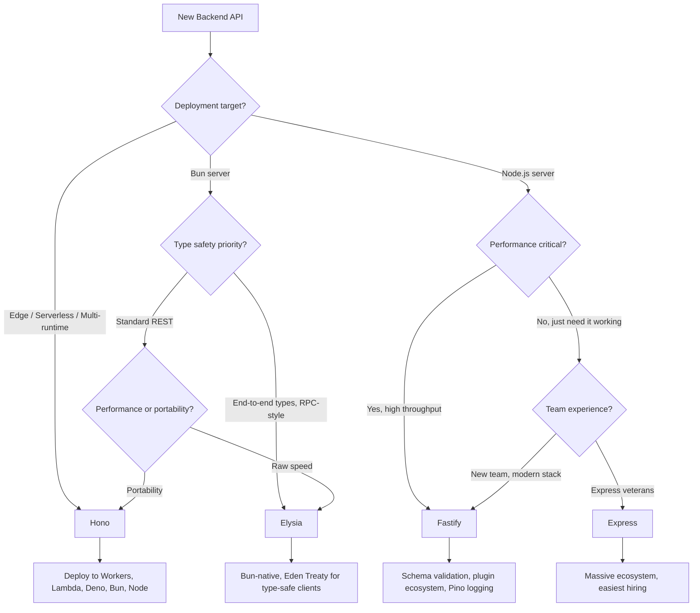

# Express vs Fastify vs Hono vs Elysia

The backend JavaScript framework landscape has evolved from Express's dominance into a diverse ecosystem of performance-focused, type-safe alternatives. This page compares the four most relevant server frameworks across every dimension engineers care about.

## Overview

### Express

Express is the original Node.js web framework, created by TJ Holowaychuk in 2010. It defined the middleware pattern that every subsequent Node.js framework copied or improved upon. Express is minimalist by design — it provides routing, middleware chaining, and a thin wrapper over Node's HTTP module. Express 5 (finally released after years in beta) brings promise support and improved path matching. With 65,000+ GitHub stars and millions of weekly npm downloads, Express remains the most widely deployed Node.js framework.

### Fastify

Fastify is a high-performance Node.js framework created by Matteo Collina and Tomas Della Vedova in 2017. It was built from the ground up for speed — using JSON Schema for request/response validation and serialization, a plugin system based on encapsulation, and an efficient radix-tree router. Fastify benchmarks 2-3x faster than Express for JSON serialization because it uses `fast-json-stringify` instead of `JSON.stringify`. It has excellent TypeScript support and a mature plugin ecosystem.

### Hono

Hono (Japanese for "flame") is an ultralight web framework created by Yusuke Wada in 2022. It runs on every JavaScript runtime — Node.js, Deno, Bun, Cloudflare Workers, AWS Lambda, Vercel Edge, and Fastly Compute. Hono's key innovation is runtime portability: you write your API once and deploy it anywhere. At ~14 KB, it is the smallest framework here. Hono provides a middleware stack, routing, and first-class TypeScript support with RPC-style type-safe client generation.

### Elysia

Elysia is a Bun-first web framework created by SaltyAom in 2023. It uses Bun's native HTTP server for maximum performance and provides end-to-end type safety through TypeScript inference — request validation, response types, and error types flow through the entire chain without manual annotation. Elysia consistently tops Bun benchmarks and provides features like Eden Treaty (a type-safe client similar to tRPC) and lifecycle hooks.

## Architecture Comparison


### Key Architectural Differences

**Express** processes requests through a linear middleware chain. Each middleware calls `next()` to pass control. There is no schema validation, no serialization optimization, and no encapsulation — all middleware shares the same `req`/`res` objects.

**Fastify** uses an encapsulated plugin system where each plugin gets its own scope. Request validation happens automatically via JSON Schema before the handler runs, and response serialization uses `fast-json-stringify` (pre-compiled from schema). This architecture enables both safety and speed.

**Hono** uses the Web Standards `Request` and `Response` objects, making it runtime-agnostic. Its middleware model is similar to Express but uses `c.next()` (context-based) rather than modifying a shared req/res object. This portability is the core design decision.

**Elysia** leverages Bun's HTTP server directly, avoiding the Node.js `http` module overhead. It uses TypeBox schemas for validation and infers the entire request/response type chain at compile time. The architecture is designed for Bun-first performance.

## Feature Matrix

| Feature | Express 5 | Fastify 5 | Hono 4 | Elysia 1.x |
|---|---|---|---|---|
| **Runtime** | Node.js | Node.js | Any (Node, Bun, Deno, Edge) | Bun (primary) |
| **TypeScript** | Partial (@types/express) | Excellent (built-in) | Excellent (built-in) | Excellent (inferred) |
| **Validation** | Manual (express-validator) | JSON Schema (built-in) | Zod/Valibot middleware | TypeBox (built-in) |
| **Serialization** | JSON.stringify | fast-json-stringify | JSON.stringify | Bun-optimized |
| **Router** | Path-to-regexp | find-my-way (radix tree) | RegExpRouter / TrieRouter | Radix tree |
| **Middleware model** | req/res chain | Hooks + encapsulated plugins | Context-based chain | Lifecycle hooks |
| **Plugin system** | npm packages | Encapsulated plugins | Middleware + helpers | Plugin chain |
| **WebSocket** | ws (third-party) | @fastify/websocket | Built-in (runtime-specific) | Built-in (Bun native) |
| **OpenAPI/Swagger** | swagger-jsdoc | @fastify/swagger (built-in) | Zod OpenAPI middleware | Built-in (Eden) |
| **Type-safe client** | No | No | hc (Hono Client) | Eden Treaty |
| **Streaming** | res.write | reply.raw | c.stream / SSE helpers | Bun streams |
| **File uploads** | multer | @fastify/multipart | Built-in (parseBody) | Built-in |
| **Rate limiting** | express-rate-limit | @fastify/rate-limit | Built-in middleware | Plugin |
| **CORS** | cors package | @fastify/cors | Built-in middleware | Plugin |
| **Static files** | express.static | @fastify/static | Built-in middleware | Plugin |
| **Bundle size** | ~200 KB | ~350 KB | ~14 KB | ~50 KB |
| **Weekly npm downloads** | ~30M | ~3M | ~500K | ~100K |

## Code Comparison

### Basic CRUD API

::: code-group

```ts [Express]
import express from 'express';

const app = express();
app.use(express.json());

interface User {
  id: string;
  name: string;
  email: string;
}

const users: User[] = [];

app.get('/users', (req, res) => {
  res.json(users);
});

app.get('/users/:id', (req, res) => {
  const user = users.find(u => u.id === req.params.id);
  if (!user) return res.status(404).json({ error: 'Not found' });
  res.json(user);
});

app.post('/users', (req, res) => {
  // No built-in validation — must validate manually
  const { name, email } = req.body;
  if (!name || !email) {
    return res.status(400).json({ error: 'Name and email required' });
  }
  const user: User = { id: crypto.randomUUID(), name, email };
  users.push(user);
  res.status(201).json(user);
});

app.listen(3000);
```

```ts [Fastify]
import Fastify from 'fastify';

const app = Fastify({ logger: true });

interface User {
  id: string;
  name: string;
  email: string;
}

const users: User[] = [];

app.get('/users', async () => {
  return users;
});

app.get<{ Params: { id: string } }>(
  '/users/:id',
  {
    schema: {
      params: {
        type: 'object',
        properties: { id: { type: 'string', format: 'uuid' } },
        required: ['id'],
      },
    },
  },
  async (request, reply) => {
    const user = users.find(u => u.id === request.params.id);
    if (!user) return reply.code(404).send({ error: 'Not found' });
    return user;
  }
);

app.post<{ Body: { name: string; email: string } }>(
  '/users',
  {
    schema: {
      body: {
        type: 'object',
        properties: {
          name: { type: 'string', minLength: 1 },
          email: { type: 'string', format: 'email' },
        },
        required: ['name', 'email'],
      },
    },
  },
  async (request, reply) => {
    const user: User = {
      id: crypto.randomUUID(),
      ...request.body,
    };
    users.push(user);
    return reply.code(201).send(user);
  }
);

app.listen({ port: 3000 });
```

```ts [Hono]
import { Hono } from 'hono';
import { zValidator } from '@hono/zod-validator';
import { z } from 'zod';

const app = new Hono();

interface User {
  id: string;
  name: string;
  email: string;
}

const users: User[] = [];

const createUserSchema = z.object({
  name: z.string().min(1),
  email: z.string().email(),
});

app.get('/users', (c) => {
  return c.json(users);
});

app.get('/users/:id', (c) => {
  const user = users.find(u => u.id === c.req.param('id'));
  if (!user) return c.json({ error: 'Not found' }, 404);
  return c.json(user);
});

app.post(
  '/users',
  zValidator('json', createUserSchema),
  (c) => {
    const body = c.req.valid('json');
    const user: User = { id: crypto.randomUUID(), ...body };
    users.push(user);
    return c.json(user, 201);
  }
);

export default app; // Works on any runtime
```

```ts [Elysia]
import { Elysia, t } from 'elysia';

interface User {
  id: string;
  name: string;
  email: string;
}

const users: User[] = [];

const app = new Elysia()
  .get('/users', () => users)
  .get('/users/:id', ({ params: { id }, error }) => {
    const user = users.find(u => u.id === id);
    if (!user) return error(404, { error: 'Not found' });
    return user;
  })
  .post(
    '/users',
    ({ body }) => {
      const user: User = { id: crypto.randomUUID(), ...body };
      users.push(user);
      return user;
    },
    {
      body: t.Object({
        name: t.String({ minLength: 1 }),
        email: t.String({ format: 'email' }),
      }),
    }
  )
  .listen(3000);
```

:::

### Middleware

::: code-group

```ts [Express]
// Timing middleware
app.use((req, res, next) => {
  const start = Date.now();
  res.on('finish', () => {
    const ms = Date.now() - start;
    console.log(`${req.method} ${req.url} ${res.statusCode} ${ms}ms`);
  });
  next();
});
```

```ts [Fastify]
// Timing hook
app.addHook('onRequest', async (request) => {
  request.startTime = Date.now();
});

app.addHook('onResponse', async (request, reply) => {
  const ms = Date.now() - request.startTime;
  request.log.info(`${request.method} ${request.url} ${reply.statusCode} ${ms}ms`);
});
```

```ts [Hono]
// Timing middleware
app.use('*', async (c, next) => {
  const start = Date.now();
  await next();
  const ms = Date.now() - start;
  console.log(`${c.req.method} ${c.req.url} ${c.res.status} ${ms}ms`);
});
```

```ts [Elysia]
// Timing lifecycle
const app = new Elysia()
  .onBeforeHandle(({ request }) => {
    (request as any).startTime = Date.now();
  })
  .onAfterHandle(({ request, set }) => {
    const ms = Date.now() - (request as any).startTime;
    console.log(`${request.method} ${request.url} ${set.status} ${ms}ms`);
  });
```

:::

## Performance

### Requests per Second (JSON serialization, 1 KB payload)

| Framework | Runtime | Req/s | Latency (p50) | Latency (p99) |
|---|---|---|---|---|
| **Elysia** | Bun | ~120,000 | 0.4ms | 2.1ms |
| **Hono** | Bun | ~105,000 | 0.5ms | 2.5ms |
| **Fastify** | Node.js | ~65,000 | 0.8ms | 4.2ms |
| **Hono** | Node.js | ~55,000 | 0.9ms | 4.8ms |
| **Express** | Node.js | ~22,000 | 2.3ms | 12ms |

::: warning Benchmark context
These numbers are from synthetic benchmarks (single endpoint, JSON serialization, no database). Real applications spend 95%+ of request time in database queries, external API calls, and business logic. The difference between 22K and 120K req/s is irrelevant when your database query takes 15ms. Choose based on DX and ecosystem, not raw throughput.
:::

### Memory Usage

| Framework | Idle Memory | Under Load (1K concurrent) |
|---|---|---|
| **Hono (Bun)** | 22 MB | 58 MB |
| **Elysia** | 25 MB | 55 MB |
| **Fastify** | 40 MB | 95 MB |
| **Express** | 45 MB | 120 MB |

### Startup Time

| Framework | Cold Start | With 50 Routes |
|---|---|---|
| **Hono (Bun)** | 12ms | 18ms |
| **Elysia** | 15ms | 22ms |
| **Hono (Node)** | 45ms | 65ms |
| **Fastify** | 80ms | 150ms |
| **Express** | 50ms | 85ms |

## Developer Experience

### Learning Curve

| Aspect | Express | Fastify | Hono | Elysia |
|---|---|---|---|---|
| **Time to first API** | 5 min | 10 min | 5 min | 10 min |
| **Concept count** | Low (req, res, next) | Medium (schemas, hooks, plugins) | Low (context, next) | Medium (lifecycle, types, Eden) |
| **Documentation** | Good (but dated) | Excellent | Good | Good |
| **Error messages** | Poor (generic) | Good (schema-aware) | Good | Excellent (type-inferred) |
| **Debugging** | Easy (simple stack) | Moderate (plugin scoping) | Easy | Moderate (Bun tooling) |

### Ecosystem Comparison

| Category | Express | Fastify | Hono | Elysia |
|---|---|---|---|---|
| **npm packages** | 50,000+ | 300+ official/community | 80+ middleware | 50+ plugins |
| **Auth** | Passport.js | @fastify/passport | Built-in JWT/Bearer | Built-in JWT |
| **Database** | Any ORM | Any ORM | Any ORM | Any ORM |
| **Logging** | Morgan, Winston | Pino (built-in) | Built-in logger | Built-in |
| **Testing** | Supertest | Fastify inject | app.request() | Elysia test utils |
| **OpenAPI** | swagger-jsdoc | @fastify/swagger | @hono/zod-openapi | Built-in |
| **GraphQL** | apollo-server-express | mercurius | @hono/graphql-server | @elysiajs/graphql |

::: tip Express migration note
If you have an existing Express app and want better performance, Fastify provides the most straightforward migration path. It has an Express compatibility layer (`@fastify/express`) that lets you use existing Express middleware while gradually migrating to Fastify's plugin system.
:::

## When to Use Which



### Decision Summary

| Scenario | Best Choice | Why |
|---|---|---|
| **Cloudflare Workers / Edge** | Hono | Built for edge, 14 KB, Web Standards |
| **Bun-first project** | Elysia | Bun-native, fastest raw performance |
| **Enterprise Node.js API** | Fastify | Schema validation, logging, plugin system |
| **Legacy project, quick prototype** | Express | Everyone knows it, most npm packages |
| **Multi-runtime deployment** | Hono | Write once, deploy anywhere |
| **Microservices with shared types** | Hono or Elysia | Type-safe RPC clients |
| **High-throughput Node.js** | Fastify | 3x faster than Express with validation |
| **Serverless functions** | Hono | Tiny bundle, fast cold start |

## Migration

### Express to Fastify

1. **Install**: `npm install fastify @fastify/express`
2. **Use compatibility layer**: Register Express middleware via `@fastify/express`
3. **Migrate routes**: Change `(req, res) => {}` to `async (request, reply) => {}`
4. **Add schemas**: Define JSON Schema for request validation and response serialization
5. **Replace middleware**: Swap Express middleware for Fastify plugins (`cors`, `helmet`, etc.)
6. **Remove compatibility layer** once all routes are migrated

```ts
// Before (Express)
app.post('/users', (req, res) => {
  const { name, email } = req.body;
  // manual validation...
  res.status(201).json(user);
});

// After (Fastify)
app.post('/users', {
  schema: {
    body: { type: 'object', properties: { name: { type: 'string' }, email: { type: 'string', format: 'email' } }, required: ['name', 'email'] },
  },
}, async (request, reply) => {
  // body is already validated
  const user = createUser(request.body);
  return reply.code(201).send(user);
});
```

### Express to Hono

1. **Install**: `npm install hono`
2. **Replace app creation**: `express()` becomes `new Hono()`
3. **Migrate routes**: `(req, res)` becomes `(c) =>`, `res.json()` becomes `c.json()`
4. **Migrate middleware**: Most Express middleware has Hono equivalents or built-in alternatives
5. **Update deployment**: Choose adapter for target runtime

::: warning Middleware compatibility
Express middleware is not compatible with Hono or Elysia. You will need to find equivalents or write custom middleware. Fastify has the best Express compatibility story through `@fastify/express`.
:::

## Verdict

**Choose Express** if you need maximum ecosystem compatibility, your team already knows it, or you are building a quick prototype that does not need to handle high traffic. Express is showing its age, but "boring technology" has real value — every Node.js developer knows Express, every tutorial uses it, and every middleware exists for it.

**Choose Fastify** if you are building a production Node.js API and care about performance, validation, and structured logging. Fastify is the natural successor to Express for server-side Node.js — it is faster, safer (schema validation by default), and better structured (plugin encapsulation). The migration path from Express is well-documented.

**Choose Hono** if you need to deploy across multiple runtimes (edge, serverless, Node, Bun, Deno) or if bundle size matters (serverless cold starts, edge workers). Hono is the universal framework — write once, deploy anywhere. Its middleware ecosystem is growing fast.

**Choose Elysia** if you are building on Bun and want maximum performance with end-to-end type safety. Elysia's Eden Treaty gives you tRPC-like type safety for REST APIs without code generation. The tradeoff is Bun lock-in and a smaller ecosystem.
