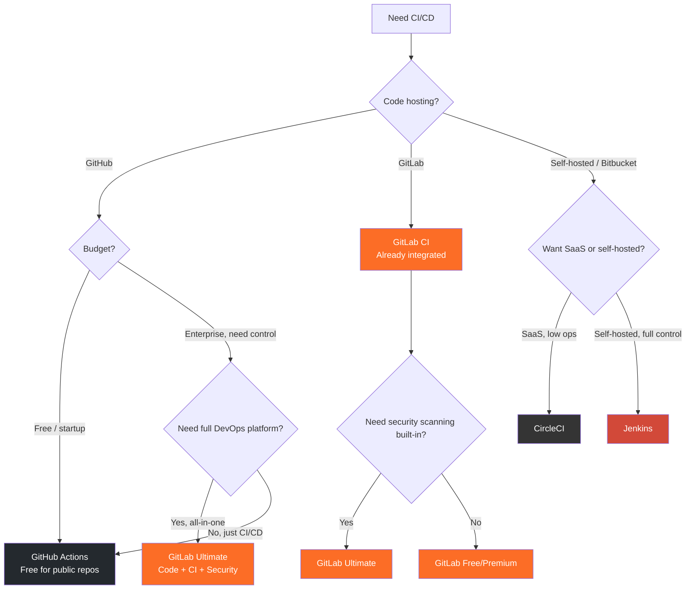

# GitHub Actions vs GitLab CI vs Jenkins vs CircleCI

CI/CD is the backbone of modern software delivery. A well-chosen pipeline saves hours per developer per week; a poorly chosen one becomes the most-cursed piece of infrastructure in your organization. This comparison evaluates the four dominant CI/CD platforms across every dimension that matters: speed, cost, flexibility, security, and developer happiness.

## Overview

| Platform | Maintainer | First Release | Model | Core Strength |
|---|---|---|---|---|
| **GitHub Actions** | Microsoft/GitHub | 2019 | SaaS + self-hosted runners | Marketplace ecosystem, GitHub integration |
| **GitLab CI** | GitLab Inc. | 2012 | SaaS + self-managed | All-in-one DevOps platform |
| **Jenkins** | Community (CD Foundation) | 2011 | Self-hosted only | Unlimited flexibility, plugin ecosystem |
| **CircleCI** | CircleCI Inc. | 2011 | SaaS + self-hosted runners | Speed, Docker-native workflows |

::: tip The Fundamental Choice
GitHub Actions and GitLab CI are tied to their respective Git platforms — switching CI means switching your code hosting. Jenkins and CircleCI are platform-agnostic but require separate infrastructure. This lock-in factor often matters more than any technical comparison.
:::

## Architecture Comparison

```mermaid
graph TB
    subgraph GHA["GitHub Actions"]
        G1[Push / PR / Schedule] --> G2[Workflow YAML]
        G2 --> G3[GitHub-Hosted Runner<br/>Ubuntu / macOS / Windows]
        G2 --> G4[Self-Hosted Runner]
        G3 --> G5[Actions Marketplace<br/>20,000+ Actions]
        G2 --> G6[Matrix Strategy<br/>Parallel Jobs]
    end

    subgraph GitLab["GitLab CI"]
        L1[Push / MR / Schedule] --> L2[.gitlab-ci.yml]
        L2 --> L3[Shared Runner<br/>Linux / Windows]
        L2 --> L4[Group / Project Runner]
        L2 --> L5[Pipeline DAG<br/>Directed Acyclic Graph]
        L5 --> L6[Environments<br/>& Deployments]
    end

    subgraph Jenkins
        J1[Webhook / Poll / Cron] --> J2[Jenkinsfile<br/>Declarative / Scripted]
        J2 --> J3[Controller Node]
        J3 --> J4[Agent Node 1]
        J3 --> J5[Agent Node 2]
        J3 --> J6[Agent Node N]
        J4 --> J7[Plugin Ecosystem<br/>1,800+ Plugins]
    end

    subgraph CircleCI
        C1[Push / PR / Schedule] --> C2[config.yml]
        C2 --> C3[Docker Executor]
        C2 --> C4[Machine Executor]
        C2 --> C5[macOS Executor]
        C3 --> C6[Orbs Marketplace]
        C2 --> C7[Workflow DAG<br/>Fan-out / Fan-in]
    end

    style GHA fill:#24292e,color:#fff
    style GitLab fill:#fc6d26,color:#fff
    style Jenkins fill:#d24939,color:#fff
    style CircleCI fill:#343434,color:#fff
```



## Feature Matrix

| Feature | GitHub Actions | GitLab CI | Jenkins | CircleCI |
|---|---|---|---|---|
| **Config format** | YAML (`.github/workflows/`) | YAML (`.gitlab-ci.yml`) | Groovy (`Jenkinsfile`) | YAML (`.circleci/config.yml`) |
| **Free tier (cloud)** | 2,000 min/mo (public unlimited) | 400 min/mo | N/A (self-hosted) | 6,000 min/mo |
| **Paid pricing** | $4/user/mo (Team) | $29/user/mo (Premium) | Free (self-hosted) | $15/mo (Performance) |
| **Self-hosted runners** | Yes (free, unlimited) | Yes (GitLab Runner) | Only option | Yes (self-hosted runner) |
| **Parallel jobs** | Matrix strategy | `parallel` keyword + DAG | Parallel stages | `parallelism` key + workflows |
| **Caching** | `actions/cache` | Built-in cache directive | Plugin-based | Built-in cache |
| **Artifacts** | Upload/download actions | Built-in artifacts | Archive artifacts | Workspaces + artifacts |
| **Secrets management** | Repository / Org / Env secrets | CI/CD variables, Vault integration | Credentials plugin | Contexts + env vars |
| **Container registry** | GitHub Container Registry | GitLab Container Registry | External (Docker Hub, etc.) | None (use external) |
| **Environments** | Environment protection rules | Environments with approvals | Manual input / approval | Manual approval gates |
| **Reusable workflows** | Reusable workflows + composite actions | `include` + `extends` | Shared libraries | Orbs (reusable packages) |
| **OIDC / cloud auth** | Native OIDC for AWS, GCP, Azure | OIDC for AWS, GCP | Plugin-based | OIDC support |
| **Concurrency control** | `concurrency` group | `resource_group` | Throttle plugin | `resource_class` |
| **Monorepo support** | Path filters in `on.push.paths` | `rules.changes` | Multibranch + path triggers | Path filtering |
| **Scheduled runs** | Cron syntax | Cron syntax | Cron syntax | Cron syntax |
| **Marketplace** | 20,000+ Actions | CI/CD templates | 1,800+ plugins | 3,000+ Orbs |
| **Mobile builds** | macOS runners (3x-10x cost) | macOS runners (limited) | macOS agents | macOS runners (native) |

## Code & Config Comparison

### Basic CI Pipeline

**GitHub Actions:**

```yaml
# .github/workflows/ci.yml
name: CI
on:
  push:
    branches: [main]
  pull_request:
    branches: [main]

jobs:
  test:
    runs-on: ubuntu-latest
    strategy:
      matrix:
        node-version: [18, 20, 22]
    steps:
      - uses: actions/checkout@v4
      - uses: actions/setup-node@v4
        with:
          node-version: ${{ "\u200Bmatrix.node-version" }}
          cache: 'npm'
      - run: npm ci
      - run: npm test
      - run: npm run lint

  build:
    needs: test
    runs-on: ubuntu-latest
    steps:
      - uses: actions/checkout@v4
      - uses: actions/setup-node@v4
        with:
          node-version: 20
          cache: 'npm'
      - run: npm ci
      - run: npm run build
      - uses: actions/upload-artifact@v4
        with:
          name: dist
          path: dist/
```

**GitLab CI:**

```yaml
# .gitlab-ci.yml
stages:
  - test
  - build

variables:
  NODE_VERSION: "20"

.node-setup:
  image: node:${NODE_VERSION}
  cache:
    key: ${CI_COMMIT_REF_SLUG}
    paths:
      - node_modules/
  before_script:
    - npm ci

test:
  stage: test
  extends: .node-setup
  parallel:
    matrix:
      - NODE_VERSION: ["18", "20", "22"]
  script:
    - npm test
    - npm run lint

build:
  stage: build
  extends: .node-setup
  script:
    - npm run build
  artifacts:
    paths:
      - dist/
    expire_in: 1 week
```

**Jenkins** (Declarative Pipeline):

```groovy
// Jenkinsfile
pipeline {
    agent any

    tools {
        nodejs 'Node-20'
    }

    stages {
        stage('Install') {
            steps {
                sh 'npm ci'
            }
        }

        stage('Test') {
            matrix {
                axes {
                    axis {
                        name 'NODE_VERSION'
                        values '18', '20', '22'
                    }
                }
                stages {
                    stage('Run Tests') {
                        agent {
                            docker { image "node:${NODE_VERSION}" }
                        }
                        steps {
                            sh 'npm ci && npm test && npm run lint'
                        }
                    }
                }
            }
        }

        stage('Build') {
            steps {
                sh 'npm run build'
                archiveArtifacts artifacts: 'dist/**/*'
            }
        }
    }

    post {
        failure {
            mail to: 'team@example.com',
                 subject: "Build Failed: ${env.JOB_NAME}",
                 body: "Check: ${env.BUILD_URL}"
        }
    }
}
```

**CircleCI:**

```yaml
# .circleci/config.yml
version: 2.1

orbs:
  node: circleci/node@5.2

workflows:
  ci:
    jobs:
      - test:
          matrix:
            parameters:
              node-version: ["18.19", "20.11", "22.0"]
      - build:
          requires:
            - test

jobs:
  test:
    parameters:
      node-version:
        type: string
    docker:
      - image: cimg/node:<< parameters.node-version >>
    steps:
      - checkout
      - node/install-packages:
          pkg-manager: npm
      - run: npm test
      - run: npm run lint

  build:
    docker:
      - image: cimg/node:20.11
    steps:
      - checkout
      - node/install-packages:
          pkg-manager: npm
      - run: npm run build
      - persist_to_workspace:
          root: .
          paths:
            - dist/
```

### Docker Build and Push

**GitHub Actions:**

```yaml
deploy:
  runs-on: ubuntu-latest
  permissions:
    packages: write
    contents: read
  steps:
    - uses: actions/checkout@v4
    - uses: docker/setup-buildx-action@v3
    - uses: docker/login-action@v3
      with:
        registry: ghcr.io
        username: ${{ "\u200Bgithub.actor" }}
        password: ${{ "\u200Bsecrets.GITHUB_TOKEN" }}
    - uses: docker/build-push-action@v5
      with:
        context: .
        push: true
        tags: ghcr.io/${{ "\u200Bgithub.repository" }}:${{ "\u200Bgithub.sha" }}
        cache-from: type=gha
        cache-to: type=gha,mode=max
```

**GitLab CI:**

```yaml
deploy:
  stage: deploy
  image: docker:24
  services:
    - docker:24-dind
  variables:
    DOCKER_TLS_CERTDIR: "/certs"
  script:
    - docker login -u $CI_REGISTRY_USER -p $CI_REGISTRY_PASSWORD $CI_REGISTRY
    - docker build -t $CI_REGISTRY_IMAGE:$CI_COMMIT_SHA .
    - docker push $CI_REGISTRY_IMAGE:$CI_COMMIT_SHA
```

::: warning GitHub Actions Expression Syntax
In VitePress (Vue-based), the `$&#123;&#123; "\u200B" &#125;&#125;` expression syntax conflicts with Vue template interpolation. If you are documenting GitHub Actions workflows in VitePress, you need to escape these expressions or use raw blocks.
:::

### Deployment with Approvals

**GitHub Actions:**

```yaml
deploy-production:
  runs-on: ubuntu-latest
  needs: [test, build]
  environment:
    name: production
    url: https://app.example.com
  concurrency:
    group: production
    cancel-in-progress: false
  steps:
    - uses: actions/checkout@v4
    - run: ./deploy.sh production
      env:
        DEPLOY_TOKEN: ${{ "\u200Bsecrets.DEPLOY_TOKEN" }}
```

**GitLab CI:**

```yaml
deploy-production:
  stage: deploy
  script:
    - ./deploy.sh production
  environment:
    name: production
    url: https://app.example.com
  resource_group: production
  rules:
    - if: $CI_COMMIT_BRANCH == "main"
      when: manual
```

## Performance

### Build Speed Benchmarks

| Scenario | GitHub Actions | GitLab CI | Jenkins | CircleCI |
|---|---|---|---|---|
| **Runner spin-up** | 15-45s | 5-30s | 0s (persistent) | 5-15s |
| **npm ci (cached)** | ~15s | ~10s | ~5s (local cache) | ~8s |
| **npm ci (cold)** | ~45s | ~40s | ~30s | ~35s |
| **Docker build (cached)** | ~30s (GHA cache) | ~25s (registry cache) | ~10s (local) | ~20s (layer cache) |
| **Docker build (cold)** | ~120s | ~110s | ~90s | ~100s |
| **Next.js build** | ~60s | ~55s | ~40s | ~50s |
| **Parallel matrix (3 jobs)** | All parallel | All parallel | Depends on agents | All parallel |
| **Concurrent pipelines** | Unlimited (public) / 20 (free) | 50 (shared) | Limited by agents | 30 (free) / unlimited (paid) |

### Runner Specifications (Free Tier)

| Spec | GitHub Actions | GitLab CI | Jenkins | CircleCI |
|---|---|---|---|---|
| **vCPUs** | 4 (Linux) | 2 (shared) | Your hardware | 2 (medium) |
| **RAM** | 16 GB | 8 GB | Your hardware | 4 GB |
| **Disk** | 14 GB SSD | 25 GB | Your hardware | Varies |
| **OS options** | Ubuntu, macOS, Windows | Ubuntu, Windows | Any | Ubuntu, macOS |
| **macOS cost multiplier** | 10x minutes | N/A (limited) | Your hardware | Included (macOS plan) |
| **Windows cost multiplier** | 2x minutes | N/A | Your hardware | N/A |

::: tip Speed vs Cost Trade-off
Jenkins on persistent agents is fastest because there is no runner spin-up time and caches are local. But you pay for the infrastructure 24/7. GitHub Actions and CircleCI offer larger runners (up to 64 vCPU) on paid plans that can halve build times.
:::

## Developer Experience

### Strengths

**GitHub Actions:**
- Deep GitHub integration: PR checks, issue automation, releases, packages
- Marketplace with 20,000+ community-maintained Actions
- Matrix strategy for testing across versions/platforms
- OIDC for passwordless cloud authentication (no long-lived secrets)
- Free for public repositories (unlimited minutes)

**GitLab CI:**
- All-in-one platform: code, CI, CD, registry, security scanning, monitoring
- `include` and `extends` for DRY pipeline configuration
- Built-in environments with deployment tracking and rollback
- Auto DevOps: zero-config CI/CD for standard projects
- Pipeline DAG for complex dependency graphs

**Jenkins:**
- Unlimited flexibility: 1,800+ plugins, Groovy scripting
- No vendor lock-in: runs on your infrastructure
- Shared libraries for organization-wide pipeline standardization
- Pipeline as code with full Groovy programming language
- No per-minute billing — own your compute

**CircleCI:**
- Fastest runner spin-up time in the industry
- Orbs: versioned, shareable pipeline packages
- Docker layer caching (DLC) for fast image builds
- Insights dashboard for pipeline performance analytics
- Test splitting for intelligent parallelization

### Pain Points

| Platform | Key Frustration |
|---|---|
| **GitHub Actions** | Debugging is painful (no SSH into runners); YAML verbosity for complex workflows; macOS runners are expensive (10x) |
| **GitLab CI** | Shared runners are slow and resource-constrained; complex pipeline syntax for advanced use cases; Premium plan is expensive ($29/user/mo) |
| **Jenkins** | Operational burden (upgrades, security patches, plugin compatibility); Groovy is poorly understood by most devs; No SaaS offering |
| **CircleCI** | 2023 security incident eroded trust; limited free tier; config syntax is different from Actions/GitLab |

## When to Use Which



### Decision Summary

| Scenario | Recommended Platform |
|---|---|
| Open-source project on GitHub | **GitHub Actions** (free, unlimited) |
| Startup using GitHub, needs fast CI | **GitHub Actions** |
| Enterprise wanting code + CI + security in one | **GitLab Ultimate** |
| Team on GitLab | **GitLab CI** (already there) |
| Existing Jenkins, works fine | **Jenkins** (keep it) |
| Regulated industry, need own infrastructure | **Jenkins** (full control) |
| Fastest Docker builds, SaaS preferred | **CircleCI** |
| Mobile app builds (iOS) | **CircleCI** or **GitHub Actions** |
| Complex pipeline DAGs | **GitLab CI** |
| Multi-platform (Linux + macOS + Windows) | **GitHub Actions** |

## Migration

### Jenkins to GitHub Actions

```yaml
# Jenkins Jenkinsfile → GitHub Actions workflow

# Before (Jenkinsfile):
# pipeline {
#   agent any
#   stages {
#     stage('Test') {
#       steps { sh 'npm test' }
#     }
#     stage('Build') {
#       steps { sh 'npm run build' }
#     }
#     stage('Deploy') {
#       when { branch 'main' }
#       steps { sh './deploy.sh' }
#     }
#   }
# }

# After (.github/workflows/ci.yml):
name: CI
on:
  push:
    branches: [main]
  pull_request:

jobs:
  test:
    runs-on: ubuntu-latest
    steps:
      - uses: actions/checkout@v4
      - uses: actions/setup-node@v4
        with:
          node-version: 20
          cache: npm
      - run: npm ci
      - run: npm test

  build:
    needs: test
    runs-on: ubuntu-latest
    steps:
      - uses: actions/checkout@v4
      - uses: actions/setup-node@v4
        with:
          node-version: 20
          cache: npm
      - run: npm ci
      - run: npm run build

  deploy:
    needs: build
    if: github.ref == 'refs/heads/main'
    runs-on: ubuntu-latest
    environment: production
    steps:
      - uses: actions/checkout@v4
      - run: ./deploy.sh
        env:
          DEPLOY_TOKEN: ${{ "\u200Bsecrets.DEPLOY_TOKEN" }}
```

### GitLab CI to GitHub Actions

```bash
# Key mapping:
# GitLab                    → GitHub Actions
# .gitlab-ci.yml            → .github/workflows/*.yml
# stages                    → jobs with needs
# variables                 → env / jobs.<id>.env
# cache                     → actions/cache
# artifacts                 → actions/upload-artifact
# rules: if                 → if: condition
# rules: changes            → on.push.paths
# extends                   → reusable workflows
# include                   → reusable workflows
# services (DinD)           → service containers
# environment               → environment
# when: manual              → environment protection rules
# parallel: matrix          → strategy.matrix
```

### Migration Considerations

| Concern | Notes |
|---|---|
| **Secrets** | Export from source platform, re-create in destination; rotate all secrets after migration |
| **Caching** | Cache keys and strategies differ across platforms; test cache hit rates |
| **Artifacts** | Retention policies and size limits vary; verify artifact workflows |
| **Environment approvals** | Manual approval mechanisms differ significantly between platforms |
| **Plugins / Actions** | Jenkins plugins rarely have direct GitHub Actions equivalents; search Marketplace |
| **Self-hosted runners** | Runner setup differs; GitHub runner agent is simpler than Jenkins agent |
| **Parallel execution** | Matrix strategies and parallelism concepts map differently |

::: tip Migration Timeline
Jenkins to GitHub Actions: 1-2 weeks for simple pipelines, 4-8 weeks for complex enterprise pipelines with shared libraries.
GitLab CI to GitHub Actions: 1-2 weeks (concepts are more similar).
In all cases, run both systems in parallel during transition.
:::

## Verdict

**GitHub Actions** is the default choice for teams using GitHub. Its marketplace ecosystem, free tier for public repos, native OIDC authentication, and tight GitHub integration make it the path of least resistance. Its weaknesses — debugging difficulty and YAML verbosity — are manageable trade-offs.

**GitLab CI** is the best choice for organizations that want a single platform for everything: code hosting, CI/CD, container registry, security scanning, and deployment tracking. The premium pricing is justified when you account for not needing separate tools for each function.

**Jenkins** remains the right answer for organizations with complex requirements, regulatory constraints, or existing investment in Jenkins infrastructure. It is the only option with zero vendor lock-in and unlimited customization. The operational burden is real but manageable with dedicated platform engineering teams.

**CircleCI** offers the fastest SaaS CI/CD experience with excellent Docker support and intelligent test splitting. Its 2023 security incident damaged trust, but the platform itself remains technically strong.

::: tip Bottom Line
If you use **GitHub**, use **GitHub Actions** — the integration advantage is too significant to ignore. If you use **GitLab**, use **GitLab CI** for the same reason. If you need maximum control or are on Bitbucket/self-hosted Git, choose **Jenkins** for flexibility or **CircleCI** for speed. Do not over-engineer: most projects need fewer than 100 lines of CI/CD configuration.
:::
