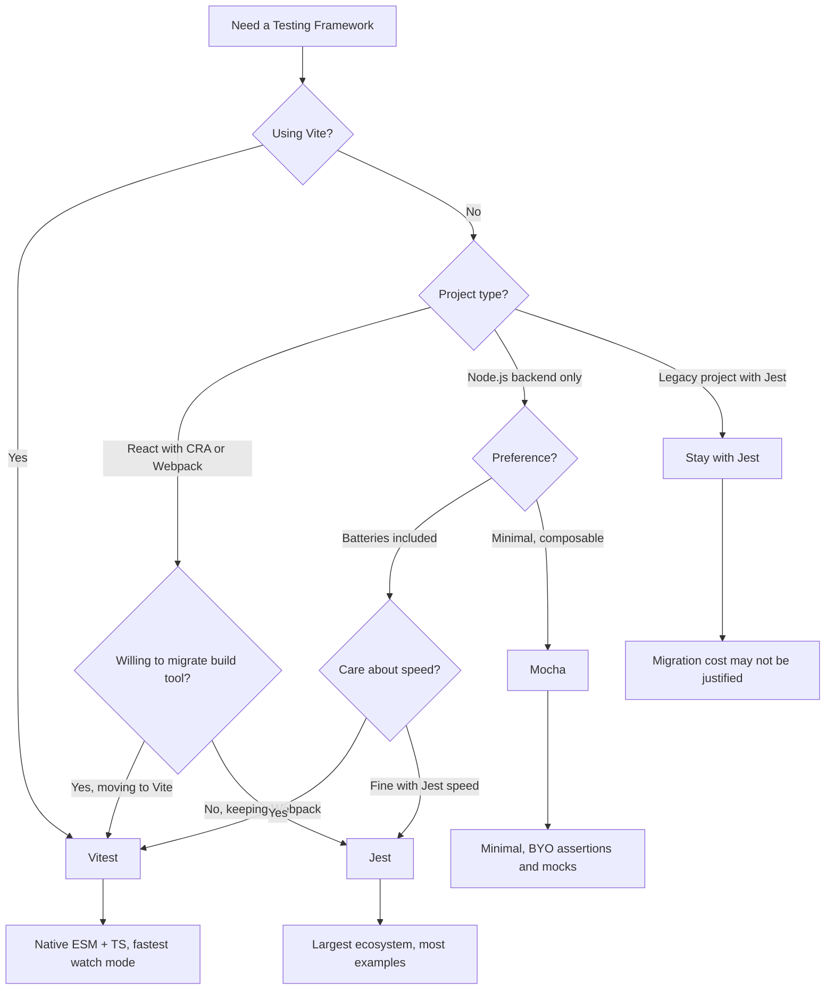

# Jest vs Vitest vs Mocha

Testing frameworks are the backbone of code quality, and choosing the right one affects developer velocity on every commit. This page compares the three most widely used JavaScript/TypeScript testing frameworks across every dimension that matters.

## Overview

### Jest

Jest is a testing framework created by Facebook (Meta) in 2014. It was designed as a "batteries-included" testing solution — test runner, assertion library, mocking system, code coverage, and snapshot testing all ship in one package. Jest dominated the JavaScript testing landscape from 2017-2023 and remains the most widely used testing framework. It uses a custom module resolution system, runs tests in worker processes, and provides a powerful mocking API (`jest.fn()`, `jest.mock()`, `jest.spyOn()`).

### Vitest

Vitest is a Vite-native testing framework created by Anthony Fu and the Vite team in 2022. It reuses Vite's module pipeline — the same config, plugins, and transform pipeline your app uses for development. This means native ESM support, TypeScript without configuration, and extremely fast HMR-based watch mode. Vitest is API-compatible with Jest (same `describe`, `it`, `expect`, `vi.fn()`) but built on modern foundations. It has rapidly become the default choice for Vite-based projects.

### Mocha

Mocha is a flexible testing framework created by TJ Holowaychuk in 2011. It is the oldest of the three and follows a "bring your own" philosophy — Mocha provides only the test runner and reporter. You choose your own assertion library (Chai, Node assert), mocking library (Sinon), and coverage tool (c8, Istanbul). This flexibility made Mocha dominant in the Node.js ecosystem before Jest arrived. Mocha remains popular in enterprise Node.js projects and backend-heavy codebases.

## Architecture Comparison

```mermaid
graph TB
    subgraph Jest["Jest — Worker-based, Custom Module System"]
        J1[Test File] --> J2[Jest CLI]
        J2 --> J3[Module Resolution - jest-resolve]
        J3 --> J4[Transform - babel-jest / ts-jest]
        J4 --> J5[Worker Process - jest-worker]
        J5 --> J6[Assertion - expect]
        J5 --> J7[Mocking - jest-mock]
        J5 --> J8[Coverage - istanbul]
    end

    subgraph Vitest["Vitest — Vite Pipeline, ESM-native"]
        V1[Test File] --> V2[Vitest CLI]
        V2 --> V3[Vite Dev Server - transform pipeline]
        V3 --> V4[ESM Module Graph]
        V4 --> V5[Worker Thread / Main Thread]
        V5 --> V6[Assertion - chai + expect compat]
        V5 --> V7[Mocking - tinyspy + vi]
        V5 --> V8[Coverage - v8 or istanbul]
    end

    subgraph Mocha["Mocha — Minimal Runner, BYO Everything"]
        M1[Test File] --> M2[Mocha CLI]
        M2 --> M3[Node.js Module Loader]
        M3 --> M4[Single Process]
        M4 --> M5[Assertion - Chai / Node assert]
        M4 --> M6[Mocking - Sinon]
        M4 --> M7[Coverage - c8 / istanbul]
    end
```



### Key Architectural Differences

**Jest** runs each test file in an isolated worker process with its own module registry. This ensures tests cannot leak state to each other, but adds process spawning overhead. Jest intercepts all `require()` / `import` calls through its custom module system, enabling its powerful `jest.mock()` API that can mock any module at any level.

**Vitest** reuses Vite's ESM-based transform pipeline. When you run `vitest`, it starts a Vite dev server that transforms TypeScript, JSX, and CSS the same way it does during development. In watch mode, Vitest uses Vite's HMR graph to re-run only the tests affected by a file change — this makes watch mode dramatically faster than Jest.

**Mocha** runs all tests in a single Node.js process by default (no workers, no isolation). This makes it fast for small test suites but means tests can leak state. Mocha loads test files using Node's native module system, which means ESM support depends on your Node.js version and configuration.

## Feature Matrix

| Feature | Jest 30 | Vitest 3 | Mocha 11 |
|---|---|---|---|
| **Assertions** | Built-in (expect) | Built-in (expect + chai) | BYO (Chai recommended) |
| **Mocking** | Built-in (jest.fn/mock/spyOn) | Built-in (vi.fn/mock/spyOn) | BYO (Sinon recommended) |
| **Snapshot testing** | Built-in | Built-in (compatible) | BYO (snap-shot-it) |
| **Coverage** | Built-in (istanbul) | Built-in (v8 or istanbul) | BYO (c8 / nyc) |
| **Watch mode** | Built-in (file-change) | Built-in (HMR-based) | Built-in (basic) |
| **Parallel execution** | Worker processes | Worker threads | `--parallel` flag |
| **Test isolation** | VM isolation per file | Optional (threads / vmThreads) | None (single process) |
| **TypeScript** | ts-jest or @swc/jest | Native (Vite pipeline) | ts-node / tsx |
| **ESM support** | Experimental | Native | Native (Node ESM) |
| **JSX/TSX** | babel-jest / @swc/jest | Native (Vite pipeline) | Requires loader |
| **CSS imports** | Manual mock | Native (Vite handles it) | Manual mock |
| **Config file** | jest.config.ts | vitest.config.ts (or vite.config.ts) | .mocharc.yml |
| **UI** | None built-in | Vitest UI (browser-based) | None built-in |
| **Browser testing** | jsdom (simulated) | Browser mode (real browser) | Browser (via karma) |
| **Benchmark** | No | Built-in (vitest bench) | No |
| **Type testing** | No | Built-in (expectTypeOf) | No |
| **In-source testing** | No | Yes | No |
| **Multi-project** | jest.projects | vitest.workspace.ts | No |
| **npm weekly downloads** | ~30M | ~10M | ~8M |

## Code Comparison

### Basic Test

::: code-group

```ts [Jest]
// math.test.ts
import { add, multiply } from './math';

describe('math utilities', () => {
  it('adds two numbers', () => {
    expect(add(2, 3)).toBe(5);
  });

  it('multiplies two numbers', () => {
    expect(multiply(4, 5)).toBe(20);
  });

  it('handles negative numbers', () => {
    expect(add(-1, 1)).toBe(0);
    expect(multiply(-2, 3)).toBe(-6);
  });
});
```

```ts [Vitest]
// math.test.ts
import { describe, it, expect } from 'vitest';
import { add, multiply } from './math';

describe('math utilities', () => {
  it('adds two numbers', () => {
    expect(add(2, 3)).toBe(5);
  });

  it('multiplies two numbers', () => {
    expect(multiply(4, 5)).toBe(20);
  });

  it('handles negative numbers', () => {
    expect(add(-1, 1)).toBe(0);
    expect(multiply(-2, 3)).toBe(-6);
  });
});
```

```ts [Mocha + Chai]
// math.test.ts
import { expect } from 'chai';
import { add, multiply } from './math';

describe('math utilities', () => {
  it('adds two numbers', () => {
    expect(add(2, 3)).to.equal(5);
  });

  it('multiplies two numbers', () => {
    expect(multiply(4, 5)).to.equal(20);
  });

  it('handles negative numbers', () => {
    expect(add(-1, 1)).to.equal(0);
    expect(multiply(-2, 3)).to.equal(-6);
  });
});
```

:::

::: tip Near-identical API
Vitest was intentionally designed to be API-compatible with Jest. In most cases, migrating from Jest to Vitest requires only changing imports (or enabling globals) and updating the config file. The test code itself stays the same.
:::

### Mocking

::: code-group

```ts [Jest]
import { fetchUser } from './api';
import { getUserProfile } from './profile';

// Mock the entire module
jest.mock('./api');
const mockFetchUser = fetchUser as jest.MockedFunction<typeof fetchUser>;

describe('getUserProfile', () => {
  beforeEach(() => {
    jest.clearAllMocks();
  });

  it('returns formatted profile', async () => {
    mockFetchUser.mockResolvedValue({
      id: 1,
      name: 'Alice',
      email: 'alice@example.com',
    });

    const profile = await getUserProfile(1);

    expect(fetchUser).toHaveBeenCalledWith(1);
    expect(profile).toEqual({
      displayName: 'Alice',
      contactEmail: 'alice@example.com',
    });
  });

  it('throws on not found', async () => {
    mockFetchUser.mockRejectedValue(new Error('Not found'));
    await expect(getUserProfile(999)).rejects.toThrow('Not found');
  });
});
```

```ts [Vitest]
import { describe, it, expect, vi, beforeEach } from 'vitest';
import { fetchUser } from './api';
import { getUserProfile } from './profile';

// Mock the entire module
vi.mock('./api');
const mockFetchUser = vi.mocked(fetchUser);

describe('getUserProfile', () => {
  beforeEach(() => {
    vi.clearAllMocks();
  });

  it('returns formatted profile', async () => {
    mockFetchUser.mockResolvedValue({
      id: 1,
      name: 'Alice',
      email: 'alice@example.com',
    });

    const profile = await getUserProfile(1);

    expect(fetchUser).toHaveBeenCalledWith(1);
    expect(profile).toEqual({
      displayName: 'Alice',
      contactEmail: 'alice@example.com',
    });
  });

  it('throws on not found', async () => {
    mockFetchUser.mockRejectedValue(new Error('Not found'));
    await expect(getUserProfile(999)).rejects.toThrow('Not found');
  });
});
```

```ts [Mocha + Sinon]
import { expect } from 'chai';
import sinon from 'sinon';
import * as api from './api';
import { getUserProfile } from './profile';

describe('getUserProfile', () => {
  let fetchUserStub: sinon.SinonStub;

  beforeEach(() => {
    fetchUserStub = sinon.stub(api, 'fetchUser');
  });

  afterEach(() => {
    sinon.restore();
  });

  it('returns formatted profile', async () => {
    fetchUserStub.resolves({
      id: 1,
      name: 'Alice',
      email: 'alice@example.com',
    });

    const profile = await getUserProfile(1);

    expect(fetchUserStub.calledWith(1)).to.be.true;
    expect(profile).to.deep.equal({
      displayName: 'Alice',
      contactEmail: 'alice@example.com',
    });
  });

  it('throws on not found', async () => {
    fetchUserStub.rejects(new Error('Not found'));
    try {
      await getUserProfile(999);
      expect.fail('Should have thrown');
    } catch (err) {
      expect(err.message).to.equal('Not found');
    }
  });
});
```

:::

### Snapshot Testing

::: code-group

```ts [Jest]
import { render } from '@testing-library/react';
import { UserCard } from './UserCard';

it('renders correctly', () => {
  const { container } = render(
    <UserCard name="Alice" role="Engineer" />
  );
  expect(container).toMatchSnapshot();
});

// Inline snapshot
it('formats name', () => {
  expect(formatName('alice', 'smith')).toMatchInlineSnapshot(
    `"Alice Smith"`
  );
});
```

```ts [Vitest]
import { render } from '@testing-library/react';
import { UserCard } from './UserCard';
import { it, expect } from 'vitest';

it('renders correctly', () => {
  const { container } = render(
    <UserCard name="Alice" role="Engineer" />
  );
  expect(container).toMatchSnapshot();
});

// Inline snapshot
it('formats name', () => {
  expect(formatName('alice', 'smith')).toMatchInlineSnapshot(
    `"Alice Smith"`
  );
});
```

:::

## Performance

### Test Suite Execution Speed

| Scenario | Jest | Vitest | Mocha |
|---|---|---|---|
| **10 simple unit tests** | 1.8s | 0.4s | 0.3s |
| **100 unit tests** | 4.2s | 1.1s | 0.9s |
| **500 unit tests** | 12s | 3.5s | 4.2s |
| **100 tests with mocking** | 6.5s | 1.8s | 2.1s |
| **50 component tests (React)** | 15s | 4s | N/A |

::: tip Why Vitest is faster
Vitest is faster than Jest for three reasons: (1) no process spawning overhead — it uses worker threads, not child processes; (2) Vite's transform pipeline is faster than Babel/ts-jest; (3) in watch mode, Vitest uses the module graph to re-run only affected tests rather than re-running entire files.
:::

### Watch Mode Comparison

| Metric | Jest | Vitest | Mocha |
|---|---|---|---|
| **Initial startup** | 3-5s | 1-2s | 0.5s |
| **Re-run on file change** | 2-4s (re-run affected files) | 50-200ms (HMR graph) | 1-3s (re-run all) |
| **Affected test detection** | File-level | Module-level (Vite HMR) | None (re-runs all) |

### Coverage Performance

| Metric | Jest (istanbul) | Vitest (v8) | Vitest (istanbul) | Mocha (c8) |
|---|---|---|---|---|
| **Coverage overhead** | 2-3x slower | 1.1-1.3x slower | 2-3x slower | 1.1-1.3x slower |
| **Report generation** | Fast | Fast | Fast | Fast |

::: tip v8 coverage
Vitest's default v8 coverage provider is dramatically faster than istanbul because it uses V8's built-in coverage instrumentation instead of AST-based code transformation. The coverage is slightly less accurate for branching, but the speed difference is substantial.
:::

### Memory Usage

| Scenario | Jest | Vitest | Mocha |
|---|---|---|---|
| **100 tests** | 180 MB | 85 MB | 60 MB |
| **500 tests** | 450 MB | 150 MB | 90 MB |
| **1000 tests** | 800 MB | 250 MB | 140 MB |

Jest's high memory usage comes from spawning multiple worker processes, each with their own module registry and V8 heap.

## Developer Experience

### Configuration

::: code-group

```ts [Jest - jest.config.ts]
import type { Config } from 'jest';

const config: Config = {
  preset: 'ts-jest',
  testEnvironment: 'jsdom',
  moduleNameMapper: {
    '^@/(.*)$': '<rootDir>/src/$1',
    '\\.(css|less|scss)$': 'identity-obj-proxy',
  },
  transform: {
    '^.+\\.tsx?$': ['ts-jest', { tsconfig: 'tsconfig.json' }],
  },
  collectCoverageFrom: ['src/**/*.{ts,tsx}', '!src/**/*.d.ts'],
  setupFilesAfterSetup: ['./jest.setup.ts'],
};

export default config;
```

```ts [Vitest - vitest.config.ts]
import { defineConfig } from 'vitest/config';
import react from '@vitejs/plugin-react';

export default defineConfig({
  plugins: [react()],
  test: {
    environment: 'jsdom',
    coverage: {
      provider: 'v8',
      include: ['src/**/*.{ts,tsx}'],
    },
    setupFiles: ['./vitest.setup.ts'],
  },
  resolve: {
    alias: { '@': './src' },
  },
});
```

```yaml [Mocha - .mocharc.yml]
require:
  - tsx
spec: 'src/**/*.test.ts'
recursive: true
timeout: 5000
reporter: spec
```

:::

::: tip Vitest shares Vite config
If your project already uses Vite, Vitest can read its config directly from `vite.config.ts`. Path aliases, plugins, and transforms work identically in development and testing. With Jest, you must duplicate path aliases in `moduleNameMapper` and configure transforms separately.
:::

### Learning Curve

| Aspect | Jest | Vitest | Mocha |
|---|---|---|---|
| **Time to first test** | 10 min | 5 min | 10 min (setup Chai + Sinon) |
| **API complexity** | Medium (many globals) | Medium (Jest-compatible) | Low (BYO approach) |
| **Config complexity** | High (transforms, mappers) | Low (inherits Vite) | Low (minimal) |
| **Mocking learning curve** | Medium (module mocking is confusing) | Medium (same as Jest) | Low-medium (Sinon is explicit) |
| **Debugging** | Moderate (worker processes) | Easy (single process option) | Easy (single process) |
| **Migration from Jest** | N/A | Very easy (API-compatible) | Medium (different assertion library) |

### Ecosystem

| Category | Jest | Vitest | Mocha |
|---|---|---|---|
| **React testing** | @testing-library/react | @testing-library/react | @testing-library/react |
| **Vue testing** | @vue/test-utils | @vue/test-utils | @vue/test-utils |
| **Svelte testing** | @testing-library/svelte | @testing-library/svelte | N/A |
| **IDE support** | Excellent (all IDEs) | Excellent (VS Code, JetBrains) | Good |
| **CI integration** | Excellent | Excellent | Good |
| **Custom reporters** | Many | Many (Jest-compatible) | Many |
| **Extensibility** | Custom matchers, transformers | Custom matchers, plugins | Plugins, reporters |

## When to Use Which



### Decision Summary

| Scenario | Best Choice | Why |
|---|---|---|
| **Vite-based project** | Vitest | Shared config, native ESM, fastest |
| **New project (any)** | Vitest | Modern, fast, Jest-compatible API |
| **Existing Jest project** | Jest (stay) or Vitest (migrate) | Migration is easy but not free |
| **Create React App** | Jest (built-in) | CRA ships Jest configured |
| **Backend Node.js (minimal)** | Mocha + Chai | Lightweight, no build step |
| **Monorepo with many packages** | Vitest | workspace config, faster execution |
| **Enterprise with established Jest** | Jest | Stability, team knowledge |
| **Need browser-mode testing** | Vitest | Built-in browser mode |

## Migration

### Jest to Vitest

1. **Install**: `npm install -D vitest`
2. **Config**: Create `vitest.config.ts` (or add `test` to `vite.config.ts`)
3. **Update imports**: Add `import { describe, it, expect, vi } from 'vitest'` or enable `globals: true`
4. **Replace mocking**: `jest.fn()` becomes `vi.fn()`, `jest.mock()` becomes `vi.mock()`
5. **Replace timers**: `jest.useFakeTimers()` becomes `vi.useFakeTimers()`
6. **Update scripts**: `"test": "vitest"` in package.json
7. **Remove Jest config**: Delete `jest.config.ts` and Jest transform packages

```json
// package.json changes
{
  "scripts": {
    "test": "vitest",
    "test:run": "vitest run",
    "test:coverage": "vitest run --coverage"
  },
  "devDependencies": {
    // Remove: jest, ts-jest, @types/jest, babel-jest, identity-obj-proxy
    // Add: vitest, @vitest/coverage-v8
  }
}
```

::: tip Globals mode for easier migration
Set `globals: true` in your Vitest config to avoid updating imports in every test file. This makes `describe`, `it`, `expect`, and `vi` available globally, matching Jest's behavior. You can add imports later incrementally.
:::

### Mocha to Vitest

1. **Replace Chai assertions**: `expect(x).to.equal(y)` becomes `expect(x).toBe(y)`
2. **Replace Sinon mocks**: `sinon.stub()` becomes `vi.fn()`, `sinon.restore()` becomes `vi.restoreAllMocks()`
3. **Replace done callbacks**: Convert `done` callback tests to async/await
4. **Add snapshot testing**: Now available without additional packages
5. **Update config**: Replace `.mocharc.yml` with `vitest.config.ts`

```ts
// Before (Mocha + Chai + Sinon)
import { expect } from 'chai';
import sinon from 'sinon';

it('calls handler', (done) => {
  const spy = sinon.spy();
  emitter.on('event', spy);
  emitter.emit('event');
  expect(spy.calledOnce).to.be.true;
  done();
});

// After (Vitest)
import { it, expect, vi } from 'vitest';

it('calls handler', () => {
  const spy = vi.fn();
  emitter.on('event', spy);
  emitter.emit('event');
  expect(spy).toHaveBeenCalledOnce();
});
```

## Verdict

**Choose Vitest** for any new project in 2026. It is faster, simpler to configure, natively supports ESM and TypeScript, and is API-compatible with Jest. If your project uses Vite, Vitest is the obvious choice — it shares your existing config and plugins. Even for non-Vite projects, Vitest's speed advantages and modern architecture make it the best default.

**Choose Jest** if you have a large existing test suite and the migration cost is not justified, or if you are using Create React App or another tool that ships Jest pre-configured. Jest remains a solid, well-maintained framework. The ecosystem is the largest, and every tutorial on the internet uses Jest examples.

**Choose Mocha** if you want a minimal, composable testing framework for backend Node.js projects where you do not need snapshot testing, built-in mocking, or coverage. Mocha's "bring your own" philosophy gives you maximum control at the cost of more setup. It is also the best choice for projects that need to run tests in older Node.js versions without a build step.

**The trend is clear**: Vitest is rapidly becoming the default JavaScript testing framework. Its Jest-compatible API makes migration low-risk, and its Vite-based architecture provides genuine speed improvements. If you are starting fresh, start with Vitest.

## Which Would You Choose?

**Scenario 1:** You are starting a new React project with Vite as the build tool. You need unit tests, component tests, and code coverage from day one.

::: details Recommendation: Vitest
Vitest shares your Vite config — path aliases, plugins, and transforms work identically in development and testing. There is zero configuration overhead. Coverage via v8 is fast, and browser-mode testing lets you run component tests in a real browser. This is the obvious choice for any Vite-based project.
:::

**Scenario 2:** Your enterprise has 5,000 Jest tests across 30 packages in a monorepo. Tests take 25 minutes in CI. The team wants faster tests but cannot afford a multi-sprint migration effort.

::: details Recommendation: Migrate to Vitest incrementally
Vitest's API is Jest-compatible. Enable `globals: true` to avoid updating imports, change `jest.fn()` to `vi.fn()` with a find-and-replace, and update config files. Most teams report completing migration in 1-3 days per package. The 3-5x speed improvement pays back the migration effort within a week of CI savings.
:::

**Scenario 3:** You are building a pure Node.js backend CLI tool with no build step, no bundler, and no frontend. Tests are simple unit tests with basic assertions.

::: details Recommendation: Mocha (or Node's built-in test runner)
For a minimal Node.js tool, Mocha with native ESM or Node's built-in `node:test` module avoids adding a build tool (Vite) as a dependency for tests only. Keep it simple — if you do not need snapshot testing, mocking, or coverage, a lightweight runner is sufficient.
:::

::: warning Common Misconceptions
- **"Jest is slow because it is bad"** — Jest is slow because it prioritizes isolation (separate worker processes per test file) and compatibility (custom module system for mocking). These are deliberate architectural choices that provide safety at the cost of speed.
- **"Vitest requires Vite"** — Vitest works without Vite in your project. It includes its own Vite instance for test transformation. However, it shines brightest when sharing config with an existing Vite setup.
- **"Mocha is outdated"** — Mocha's minimalism is a feature for specific use cases. Its "bring your own" philosophy means no unnecessary dependencies, and it works with the latest ESM and TypeScript loaders.
- **"You need to migrate all tests at once"** — Vitest and Jest can coexist in a monorepo. Migrate package by package, not all at once.
:::

::: tip Real Migration Stories
**Vite core: Jest to Vitest** — The Vite project itself migrated from Jest to Vitest early in Vitest's development. This was both a practical improvement (shared config, faster tests) and a proof-of-concept that validated Vitest's Jest compatibility. The migration was completed in a single PR.

**Shopify Hydrogen: Jest to Vitest** — Shopify migrated Hydrogen's test suite from Jest to Vitest when they moved the project to Vite. They reported significantly faster watch-mode feedback loops and eliminated the need for separate Jest transform configurations.
:::

::: details Quiz

**1. Why is Vitest's watch mode faster than Jest's?**

Vitest uses Vite's HMR module graph to identify which tests are affected by a file change and re-runs only those specific tests. Jest re-runs entire test files based on file-change detection, which is coarser-grained.

**2. What is the difference between v8 coverage and istanbul coverage in Vitest?**

v8 coverage uses V8's built-in code coverage instrumentation (near-zero overhead). Istanbul coverage uses AST-based code transformation (2-3x slower). v8 is faster but slightly less accurate for branch coverage.

**3. How do you migrate `jest.mock('./module')` to Vitest?**

Replace it with `vi.mock('./module')`. The API is identical — Vitest's `vi` object is a drop-in replacement for Jest's `jest` global. `vi.fn()`, `vi.spyOn()`, and `vi.mocked()` all work the same way.

**4. Why does Jest use more memory than Vitest?**

Jest spawns separate worker processes (each with its own V8 heap and module registry) for test isolation. Vitest uses worker threads that share memory more efficiently, and its module graph avoids duplicating the module registry.

**5. When should you NOT migrate from Jest to Vitest?**

When your project uses Create React App (which ships Jest pre-configured), when migration effort outweighs CI time savings, or when your custom Jest transforms and reporters have no Vitest equivalents.
:::

## One-Liner Summary

Vitest is the modern default with Vite-native speed and Jest-compatible API, Jest remains solid for existing setups, and Mocha serves the minimalist who wants to bring their own everything.
