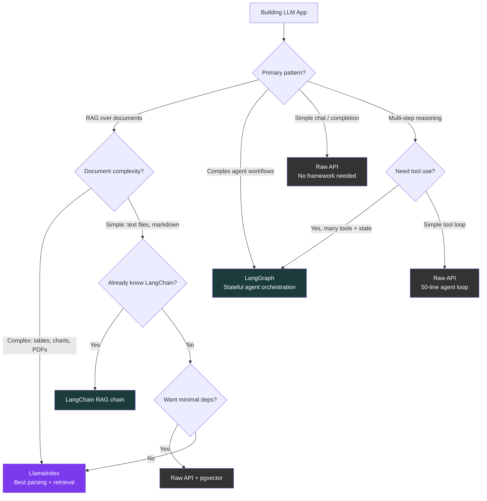

# LangChain vs LlamaIndex vs Raw API

AI application frameworks promise to accelerate development by abstracting away the complexity of LLM integrations. But abstraction comes with a cost: hidden behavior, debugging difficulty, and performance overhead. This comparison evaluates when LangChain, LlamaIndex, and raw API calls are each the right choice — and when frameworks actively hurt you.

## Overview

| Tool | First Release | Primary Focus | Abstraction Level |
|---|---|---|---|
| **LangChain** | Oct 2022 | General-purpose LLM application framework | High (chains, agents, tools, memory) |
| **LlamaIndex** | Nov 2022 | Data indexing and retrieval for LLM apps | High (indexes, query engines, RAG pipelines) |
| **Raw API** | N/A | Direct HTTP/SDK calls to LLM providers | None (full control) |

::: tip The Core Question
Frameworks save time when your use case matches their abstractions. They waste time when your use case does not. Most production LLM applications start with a framework and eventually rewrite the critical path with raw API calls. Understanding where each approach excels helps you make that transition deliberate rather than painful.
:::

## Architecture Comparison

```mermaid
graph TB
    subgraph LangChain["LangChain Architecture"]
        LC1[User Input] --> LC2[Prompt Template]
        LC2 --> LC3[LLM / Chat Model]
        LC3 --> LC4[Output Parser]
        LC4 --> LC5[Chain / Agent]
        LC5 --> LC6[Tools<br/>Search, SQL, API]
        LC5 --> LC7[Memory<br/>Buffer, Summary, Vector]
        LC5 --> LC8[Callbacks<br/>Logging, Tracing]
        LC3 --> LC9[LangSmith<br/>Observability]
    end

    subgraph LlamaIndex["LlamaIndex Architecture"]
        LI1[Documents] --> LI2[Node Parser<br/>Chunking]
        LI2 --> LI3[Embeddings]
        LI3 --> LI4[Vector Store Index<br/>Pinecone / Chroma / Weaviate]
        LI5[User Query] --> LI6[Query Engine]
        LI6 --> LI4
        LI4 --> LI7[Retriever<br/>Top-K Nodes]
        LI7 --> LI8[Response Synthesizer<br/>LLM Call]
        LI8 --> LI9[Response]
    end

    subgraph RawAPI["Raw API Approach"]
        R1[User Input] --> R2[Your Code<br/>Prompt Construction]
        R2 --> R3[HTTP Request<br/>fetch / SDK]
        R3 --> R4[LLM Provider API]
        R4 --> R5[JSON Response]
        R5 --> R6[Your Code<br/>Response Handling]
        R6 --> R7[Your Storage<br/>DB / Cache]
    end

    style LangChain fill:#1c3c3c,color:#fff
    style LlamaIndex fill:#7c3aed,color:#fff
    style RawAPI fill:#333,color:#fff
```



## Feature Matrix

| Feature | LangChain | LlamaIndex | Raw API |
|---|---|---|---|
| **LLM provider support** | 70+ providers | 40+ providers | 1 per integration |
| **RAG pipeline** | Retrievers + chains | First-class (primary focus) | Build from scratch |
| **Document loaders** | 160+ loaders (PDF, HTML, DB, etc.) | 160+ loaders | Write your own |
| **Chunking strategies** | RecursiveCharacterTextSplitter, etc. | SentenceSplitter, SemanticSplitter, etc. | Write your own |
| **Vector store integrations** | 50+ (Pinecone, Chroma, Weaviate, etc.) | 40+ | Direct SDK calls |
| **Agents** | ReAct, Plan-and-Execute, OpenAI Functions | SubQuestion, RouterQuery, ReAct | Build from scratch |
| **Memory / conversation** | BufferMemory, SummaryMemory, VectorMemory | ChatMemory, conversation history | Session storage (DB/Redis) |
| **Structured output** | Output parsers, Pydantic models | Pydantic programs | Zod / JSON schema |
| **Streaming** | Streaming callbacks | Streaming response | Native SSE handling |
| **Observability** | LangSmith (first-party) | LlamaTrace, Arize | Custom logging |
| **Evaluation** | LangSmith evaluations | LlamaIndex evaluations | Custom eval scripts |
| **Caching** | LLM cache (Redis, SQLite, etc.) | Built-in response cache | Your caching layer |
| **TypeScript support** | LangChain.js (full parity) | LlamaIndex.TS | Native |
| **Bundle size** | ~2-5 MB (many deps) | ~1-3 MB | 0 (just SDK) |
| **Learning curve** | High (many abstractions) | Medium (focused on RAG) | Low (just HTTP calls) |
| **Debugging difficulty** | High (deep call stacks) | Medium | Low (you wrote it) |
| **Upgrade stability** | Frequent breaking changes | Moderate breaking changes | Provider SDK stability |
| **Production readiness** | Improving (LangGraph) | Good | Full control |

## Code & Config Comparison

### Simple LLM Call

**LangChain:**

```typescript
import { ChatOpenAI } from '@langchain/openai';
import { HumanMessage, SystemMessage } from '@langchain/core/messages';

const model = new ChatOpenAI({
  modelName: 'gpt-4o',
  temperature: 0.7,
});

const response = await model.invoke([
  new SystemMessage('You are a helpful assistant.'),
  new HumanMessage('What is the capital of France?'),
]);

console.log(response.content);
```

**LlamaIndex:**

```typescript
import { OpenAI } from 'llamaindex';

const llm = new OpenAI({
  model: 'gpt-4o',
  temperature: 0.7,
});

const response = await llm.chat({
  messages: [
    { role: 'system', content: 'You are a helpful assistant.' },
    { role: 'user', content: 'What is the capital of France?' },
  ],
});

console.log(response.message.content);
```

**Raw API (OpenAI SDK):**

```typescript
import OpenAI from 'openai';

const openai = new OpenAI();

const response = await openai.chat.completions.create({
  model: 'gpt-4o',
  temperature: 0.7,
  messages: [
    { role: 'system', content: 'You are a helpful assistant.' },
    { role: 'user', content: 'What is the capital of France?' },
  ],
});

console.log(response.choices[0].message.content);
```

::: tip Observation
For a simple LLM call, all three approaches require roughly the same amount of code. The framework adds no value here — it only adds a dependency. Frameworks earn their keep in more complex scenarios.
:::

### RAG Pipeline (Retrieval-Augmented Generation)

**LangChain:**

```typescript
import { ChatOpenAI, OpenAIEmbeddings } from '@langchain/openai';
import { RecursiveCharacterTextSplitter } from '@langchain/textsplitters';
import { MemoryVectorStore } from 'langchain/vectorstores/memory';
import { createRetrievalChain } from 'langchain/chains/retrieval';
import { createStuffDocumentsChain } from 'langchain/chains/combine_documents';
import { ChatPromptTemplate } from '@langchain/core/prompts';
import { PDFLoader } from '@langchain/community/document_loaders/fs/pdf';

// 1. Load documents
const loader = new PDFLoader('./docs/handbook.pdf');
const docs = await loader.load();

// 2. Split into chunks
const splitter = new RecursiveCharacterTextSplitter({
  chunkSize: 1000,
  chunkOverlap: 200,
});
const chunks = await splitter.splitDocuments(docs);

// 3. Create vector store
const embeddings = new OpenAIEmbeddings();
const vectorStore = await MemoryVectorStore.fromDocuments(chunks, embeddings);

// 4. Create retrieval chain
const llm = new ChatOpenAI({ modelName: 'gpt-4o' });
const prompt = ChatPromptTemplate.fromTemplate(`
  Answer based on the context. If you don't know, say so.
  Context: {context}
  Question: {input}
`);

const documentChain = await createStuffDocumentsChain({ llm, prompt });
const retrievalChain = await createRetrievalChain({
  combineDocsChain: documentChain,
  retriever: vectorStore.asRetriever({ k: 5 }),
});

// 5. Query
const result = await retrievalChain.invoke({
  input: 'What is the vacation policy?',
});
console.log(result.answer);
```

**LlamaIndex:**

```typescript
import {
  VectorStoreIndex,
  SimpleDirectoryReader,
  OpenAI,
  Settings,
} from 'llamaindex';

// 1. Configure
Settings.llm = new OpenAI({ model: 'gpt-4o' });

// 2. Load and index documents (handles chunking + embedding)
const documents = await new SimpleDirectoryReader().loadData('./docs');
const index = await VectorStoreIndex.fromDocuments(documents);

// 3. Query
const queryEngine = index.asQueryEngine({ similarityTopK: 5 });
const result = await queryEngine.query('What is the vacation policy?');
console.log(result.toString());
```

**Raw API:**

```typescript
import OpenAI from 'openai';
import { readFileSync } from 'fs';
import pdfParse from 'pdf-parse';

const openai = new OpenAI();

// 1. Load and parse PDF
const pdfBuffer = readFileSync('./docs/handbook.pdf');
const pdfData = await pdfParse(pdfBuffer);
const text = pdfData.text;

// 2. Chunk the text
function chunkText(text: string, size = 1000, overlap = 200): string[] {
  const chunks: string[] = [];
  let start = 0;
  while (start < text.length) {
    chunks.push(text.slice(start, start + size));
    start += size - overlap;
  }
  return chunks;
}
const chunks = chunkText(text);

// 3. Generate embeddings
const embeddingResponse = await openai.embeddings.create({
  model: 'text-embedding-3-small',
  input: chunks,
});
const embeddings = embeddingResponse.data.map((d) => d.embedding);

// 4. Store in memory (or use pgvector/Pinecone)
const index = chunks.map((chunk, i) => ({
  text: chunk,
  embedding: embeddings[i],
}));

// 5. Query: embed the question and find similar chunks
function cosineSimilarity(a: number[], b: number[]): number {
  let dot = 0, normA = 0, normB = 0;
  for (let i = 0; i < a.length; i++) {
    dot += a[i] * b[i];
    normA += a[i] * a[i];
    normB += b[i] * b[i];
  }
  return dot / (Math.sqrt(normA) * Math.sqrt(normB));
}

const queryEmbedding = await openai.embeddings.create({
  model: 'text-embedding-3-small',
  input: 'What is the vacation policy?',
});

const queryVec = queryEmbedding.data[0].embedding;
const ranked = index
  .map((item) => ({ ...item, score: cosineSimilarity(queryVec, item.embedding) }))
  .sort((a, b) => b.score - a.score)
  .slice(0, 5);

// 6. Generate answer with context
const context = ranked.map((r) => r.text).join('\n\n');
const response = await openai.chat.completions.create({
  model: 'gpt-4o',
  messages: [
    { role: 'system', content: 'Answer based on the context. If you do not know, say so.' },
    { role: 'user', content: `Context:\n${context}\n\nQuestion: What is the vacation policy?` },
  ],
});

console.log(response.choices[0].message.content);
```

::: warning RAG Complexity
The raw API approach for RAG is 60+ lines vs LlamaIndex's 8 lines. This is where frameworks genuinely shine — RAG involves document loading, chunking, embedding, vector storage, retrieval, and synthesis. Writing all of this from scratch is educational but impractical for production.
:::

### Agent with Tool Use

**LangChain (LangGraph):**

```typescript
import { ChatOpenAI } from '@langchain/openai';
import { createReactAgent } from '@langchain/langgraph/prebuilt';
import { tool } from '@langchain/core/tools';
import { z } from 'zod';

const searchTool = tool(
  async ({ query }) => {
    // Your search implementation
    const results = await fetch(`https://api.search.com?q=${query}`);
    return await results.text();
  },
  {
    name: 'web_search',
    description: 'Search the web for current information',
    schema: z.object({ query: z.string() }),
  }
);

const calculatorTool = tool(
  async ({ expression }) => {
    return String(eval(expression)); // simplified
  },
  {
    name: 'calculator',
    description: 'Evaluate mathematical expressions',
    schema: z.object({ expression: z.string() }),
  }
);

const agent = createReactAgent({
  llm: new ChatOpenAI({ modelName: 'gpt-4o' }),
  tools: [searchTool, calculatorTool],
});

const result = await agent.invoke({
  messages: [{ role: 'user', content: 'What is the population of Tokyo times 2?' }],
});
```

**Raw API (Tool Use Loop):**

```typescript
import OpenAI from 'openai';

const openai = new OpenAI();

const tools: OpenAI.ChatCompletionTool[] = [
  {
    type: 'function',
    function: {
      name: 'web_search',
      description: 'Search the web for current information',
      parameters: {
        type: 'object',
        properties: { query: { type: 'string' } },
        required: ['query'],
      },
    },
  },
  {
    type: 'function',
    function: {
      name: 'calculator',
      description: 'Evaluate mathematical expressions',
      parameters: {
        type: 'object',
        properties: { expression: { type: 'string' } },
        required: ['expression'],
      },
    },
  },
];

async function executeTool(name: string, args: Record<string, string>): Promise<string> {
  switch (name) {
    case 'web_search':
      return fetch(`https://api.search.com?q=${args.query}`).then(r => r.text());
    case 'calculator':
      return String(eval(args.expression));
    default:
      return `Unknown tool: ${name}`;
  }
}

// Agent loop
const messages: OpenAI.ChatCompletionMessageParam[] = [
  { role: 'user', content: 'What is the population of Tokyo times 2?' },
];

const MAX_ITERATIONS = 10;
for (let i = 0; i < MAX_ITERATIONS; i++) {
  const response = await openai.chat.completions.create({
    model: 'gpt-4o',
    messages,
    tools,
  });

  const choice = response.choices[0];
  messages.push(choice.message);

  if (choice.finish_reason === 'stop') {
    console.log(choice.message.content);
    break;
  }

  if (choice.message.tool_calls) {
    for (const toolCall of choice.message.tool_calls) {
      const args = JSON.parse(toolCall.function.arguments);
      const result = await executeTool(toolCall.function.name, args);
      messages.push({
        role: 'tool',
        tool_call_id: toolCall.id,
        content: result,
      });
    }
  }
}
```

::: tip Agent Loop Is Simple
The raw API agent loop is ~50 lines. Once you understand the pattern (call LLM, check for tool calls, execute tools, feed results back), it is straightforward to implement without a framework. The framework advantage is in pre-built tools, error handling, and observability — not the core loop itself.
:::

## Performance

### Overhead Comparison

| Metric | LangChain | LlamaIndex | Raw API |
|---|---|---|---|
| **npm install size** | ~50-100 MB (with deps) | ~30-60 MB (with deps) | ~1-5 MB (provider SDK) |
| **Import time** | 500-1500ms | 300-800ms | 50-100ms |
| **Simple LLM call overhead** | +5-15ms | +3-10ms | 0ms (baseline) |
| **RAG query overhead** | +20-50ms | +15-30ms | 0ms (baseline) |
| **Memory usage (idle)** | 80-150 MB | 50-100 MB | 20-40 MB |
| **Cold start (serverless)** | 2-5s | 1-3s | 200-500ms |

### Bundle Size Impact (Frontend/Edge)

| Deployment | LangChain | LlamaIndex | Raw API |
|---|---|---|---|
| **Vercel Edge Function** | Often too large | Often too large | Fits easily |
| **Cloudflare Worker** | Does not fit (10 MB limit) | Does not fit | Fits easily |
| **Lambda (Node.js)** | Works (watch cold start) | Works | No issues |
| **Browser** | Not recommended | Not recommended | Minimal footprint |

::: warning Serverless Cold Starts
LangChain and LlamaIndex add 1-4 seconds to serverless cold starts due to large dependency trees. For latency-sensitive APIs on serverless platforms, raw API calls can reduce p99 latency by 50-80% on cold starts.
:::

## Developer Experience

### Strengths

**LangChain:**
- Widest ecosystem: 70+ LLM providers, 160+ document loaders, 50+ vector stores
- LangGraph for complex stateful agent workflows
- LangSmith for production observability, tracing, and evaluation
- LCEL (LangChain Expression Language) for composable chains
- Largest community: most tutorials, examples, and Stack Overflow answers

**LlamaIndex:**
- Best-in-class RAG: purpose-built for indexing and retrieval
- Advanced chunking: sentence-based, semantic, hierarchical
- Query planning: SubQuestionQueryEngine, RouterQueryEngine
- Cleaner API than LangChain for data-centric use cases
- LlamaParse for complex document parsing (tables, charts)

**Raw API:**
- Zero abstraction tax: you understand every line of code
- Smallest bundle, fastest cold starts, lowest memory
- No dependency upgrade headaches or breaking changes
- Full control over retries, caching, error handling, and observability
- Easiest to debug (your code, your stack traces)

### Pain Points

| Approach | Key Frustration |
|---|---|
| **LangChain** | Frequent breaking changes; over-abstracted (chains of chains of chains); difficult to debug (deep call stacks); heavy dependency tree |
| **LlamaIndex** | Tightly coupled to RAG patterns; less flexible for non-RAG use cases; TypeScript SDK lags behind Python |
| **Raw API** | Must build everything yourself (RAG, agents, memory, evaluation); no pre-built document loaders; no observability out of the box |

### Framework Maturity

| Dimension | LangChain | LlamaIndex | Raw API |
|---|---|---|---|
| **API stability** | Low (frequent breaking changes) | Medium | High (provider SDK versioned) |
| **Documentation quality** | Extensive but disorganized | Good and focused | Provider docs (excellent) |
| **Community size** | Largest | Large | N/A |
| **Production deployments** | Growing | Growing | Dominant |
| **Enterprise support** | LangSmith (paid) | LlamaCloud (paid) | Provider support |

## When to Use Which



### Decision Summary

| Scenario | Recommended Approach |
|---|---|
| Simple chatbot / Q&A | **Raw API** |
| RAG over complex documents | **LlamaIndex** |
| RAG over simple text | **Raw API** + pgvector |
| Multi-step agent with many tools | **LangGraph** (LangChain) |
| Simple tool-use loop | **Raw API** |
| Prototype / hackathon | **LangChain** (fastest to demo) |
| Production API (latency-sensitive) | **Raw API** |
| Evaluating multiple LLM providers | **LangChain** (swap providers easily) |
| Data pipeline: ingest, index, query | **LlamaIndex** |
| Edge / serverless deployment | **Raw API** (smallest bundle) |

## Migration

### LangChain to Raw API

```typescript
// Step 1: Identify what LangChain is doing for you
// Common LangChain patterns → Raw API equivalents:

// LangChain ChatOpenAI → OpenAI SDK
// Before:
// const model = new ChatOpenAI({ modelName: 'gpt-4o' });
// const response = await model.invoke([new HumanMessage('Hello')]);

// After:
const response = await openai.chat.completions.create({
  model: 'gpt-4o',
  messages: [{ role: 'user', content: 'Hello' }],
});

// LangChain PromptTemplate → Template literal
// Before:
// const prompt = ChatPromptTemplate.fromTemplate('Translate {text} to {language}');
// const formatted = await prompt.invoke({ text: 'hello', language: 'French' });

// After:
function buildPrompt(text: string, language: string): string {
  return `Translate "${text}" to ${language}`;
}

// LangChain Memory → Your own session store
// Before:
// const memory = new BufferMemory();

// After:
const sessions = new Map<string, OpenAI.ChatCompletionMessageParam[]>();
function getHistory(sessionId: string) {
  return sessions.get(sessionId) || [];
}
function addMessage(sessionId: string, msg: OpenAI.ChatCompletionMessageParam) {
  const history = getHistory(sessionId);
  history.push(msg);
  sessions.set(sessionId, history);
}

// LangChain Retriever → Direct vector DB query
// Before:
// const retriever = vectorStore.asRetriever({ k: 5 });
// const docs = await retriever.invoke('my query');

// After:
const queryEmbedding = await openai.embeddings.create({
  model: 'text-embedding-3-small',
  input: 'my query',
});
// Query your vector DB directly (pgvector, Pinecone, etc.)
const docs = await db.query(
  'SELECT content FROM documents ORDER BY embedding <=> $1 LIMIT 5',
  [queryEmbedding.data[0].embedding]
);
```

### LlamaIndex to Raw API

```typescript
// LlamaIndex VectorStoreIndex → pgvector + OpenAI SDK

// Before (LlamaIndex):
// const index = await VectorStoreIndex.fromDocuments(documents);
// const queryEngine = index.asQueryEngine();
// const result = await queryEngine.query('my question');

// After (Raw API + pgvector):
// 1. Parse documents yourself (pdf-parse, cheerio, etc.)
// 2. Chunk with a simple function
// 3. Embed with OpenAI
// 4. Store in pgvector
// 5. Query with SQL + cosine similarity
// 6. Synthesize response with LLM

// This is more code but gives you:
// - Full control over chunking strategy
// - Direct SQL access to your vector data
// - No framework cold start overhead
// - Easier debugging and observability
```

### Raw API to LangChain (When Complexity Grows)

```typescript
// When your raw API code has grown to include:
// - Multiple tool definitions
// - Complex state machines
// - Multi-turn conversation management
// - Parallel tool execution
// - Human-in-the-loop approval
//
// Consider migrating critical paths to LangGraph:

import { StateGraph, MessagesAnnotation } from '@langchain/langgraph';

const workflow = new StateGraph(MessagesAnnotation)
  .addNode('agent', agentNode)
  .addNode('tools', toolNode)
  .addEdge('__start__', 'agent')
  .addConditionalEdges('agent', shouldContinue)
  .addEdge('tools', 'agent');

const app = workflow.compile();
// LangGraph handles the state machine,
// tool routing, and checkpointing for you
```

::: tip Migration Strategy
Start with **raw API calls** for v1. As your application grows, identify the specific patterns where a framework adds genuine value (complex RAG, stateful agents, multi-provider support). Adopt the framework only for those specific patterns, not wholesale. This "framework as spice, not the main course" approach gives you the best of both worlds.
:::

## Verdict

**LangChain** is the most comprehensive LLM application framework. Its strength is breadth: 70+ providers, 160+ document loaders, and the LangGraph state machine for complex agents. Its weakness is abstraction overhead, frequent breaking changes, and the difficulty of debugging deep call chains. Use LangChain when you need its ecosystem breadth or LangGraph's stateful agent orchestration.

**LlamaIndex** is the best tool for RAG applications. It was purpose-built for the "ingest, index, query" pipeline and excels at document parsing, intelligent chunking, and query planning. If your primary use case is "let users ask questions about my documents," LlamaIndex is the most productive choice.

**Raw API** calls are the right default for production applications. The overhead of LLM frameworks is not justified for simple chat completions, basic tool use, or straightforward RAG. A 50-line agent loop and a direct pgvector query will outperform any framework on latency, bundle size, and debuggability.

::: tip Bottom Line
**Do not use a framework by default.** Start with raw API calls. Add **LlamaIndex** when you need sophisticated RAG (complex documents, query planning, multi-index routing). Add **LangChain/LangGraph** when you need stateful multi-step agents with tool orchestration. The best LLM applications use frameworks surgically — for the specific patterns where they add genuine value — not as a wholesale abstraction layer over simple API calls.
:::

## Which Would You Choose?

**Scenario 1:** You are building a chatbot that answers customer questions by searching through 10,000 PDF documents containing product manuals, legal contracts, and technical specifications with tables and charts.

::: details Recommendation: LlamaIndex
LlamaIndex is purpose-built for this exact use case. LlamaParse handles complex PDF parsing (tables, charts, multi-column layouts), semantic chunking preserves document meaning, and the query engine handles retrieval and synthesis. Building this from scratch with raw APIs would require weeks of custom document parsing and chunking logic.
:::

**Scenario 2:** You are adding a simple AI chat feature to your SaaS product. Users send a message, the LLM responds with text. No RAG, no tools, no agents. You deploy on Cloudflare Workers with a 10 MB bundle limit.

::: details Recommendation: Raw API
A simple chat completion is 10-15 lines of code with the OpenAI SDK (~1 MB). LangChain would add 50-100 MB of dependencies that do not fit in a Worker and add no value for a simple request-response pattern. Do not use a framework when you do not need one.
:::

**Scenario 3:** You are building a complex AI agent that takes a user's goal, breaks it into subtasks, uses 8 different tools (web search, SQL queries, API calls, file operations), handles errors with retries, requires human approval for destructive actions, and maintains state across sessions.

::: details Recommendation: LangGraph (LangChain)
LangGraph's state machine model is designed for exactly this: multi-step agents with branching logic, tool orchestration, error handling, human-in-the-loop approval gates, and persistent checkpointing. Building this from scratch requires implementing your own state machine, which LangGraph handles out of the box.
:::

::: warning Common Misconceptions
- **"You need LangChain to build any LLM app"** — Most LLM applications are simple chat completions or basic RAG. LangChain adds value only for complex orchestration patterns. Start without it and add it when you hit a specific pain point.
- **"LlamaIndex is only for RAG"** — LlamaIndex also supports agents (SubQuestion query engines, router query engines), but its primary strength is data indexing and retrieval. For agent-heavy workloads, LangGraph is a better fit.
- **"Raw API means writing everything from scratch"** — The Vercel AI SDK provides streaming, tool calling, structured output, and multi-provider support without the heavy abstraction of LangChain. It is a middle ground between raw API calls and a full framework.
- **"LangChain's breaking changes mean it is unreliable"** — LangChain has stabilized significantly with the LangChain v0.2+ / LangGraph split. Core APIs are more stable now, though the pace of change is still higher than traditional libraries.
:::

::: tip Real Migration Stories
**Many startups: LangChain to raw API** — A common pattern in the LLM ecosystem: teams start with LangChain for rapid prototyping, then rewrite the critical path with raw API calls when they need better performance, debugging, and control. The framework was valuable for learning but became an obstacle in production.

**Perplexity AI: Custom RAG pipeline** — Perplexity, one of the most successful RAG applications, built their retrieval pipeline from scratch rather than using LlamaIndex or LangChain. Their custom pipeline gives them full control over ranking, citation extraction, and streaming — demonstrating that the most demanding RAG applications often outgrow framework abstractions.
:::

::: details Quiz

**1. Why do LangChain and LlamaIndex add 1-5 seconds to serverless cold starts?**

Both frameworks have large dependency trees (50-100 MB installed). Serverless platforms must load all dependencies into memory on cold start. Raw API calls with just the provider SDK (1-5 MB) cold-start 5-10x faster.

**2. What is the "framework as spice" approach?**

Start with raw API calls. Use a framework (LangChain, LlamaIndex) only for specific patterns where it adds genuine value — complex RAG, stateful agents, multi-provider orchestration. Do not wrap your entire application in a framework when only one component needs it.

**3. How does LlamaIndex's `VectorStoreIndex.fromDocuments()` compare to building RAG from scratch?**

LlamaIndex's one-liner handles document parsing, chunking (sentence splitting), embedding generation, vector storage, and index creation. The raw API equivalent requires 50-60 lines covering PDF parsing, custom chunking, OpenAI embedding calls, vector storage, and similarity search.

**4. What is LangGraph, and how does it relate to LangChain?**

LangGraph is LangChain's library for building stateful, multi-step agent workflows as directed graphs. It provides state machines, conditional edges, persistence (checkpointing), and human-in-the-loop approval gates. It replaces LangChain's older AgentExecutor with a more composable architecture.

**5. When should you use the Vercel AI SDK instead of LangChain?**

When you need streaming, tool calling, structured output, and multi-provider support without LangChain's heavy abstraction layer. The Vercel AI SDK is lighter (smaller bundle), simpler (fewer concepts), and production-focused (designed for Next.js and edge deployment).
:::

## One-Liner Summary

Start with raw API calls for simple LLM features, reach for LlamaIndex when your RAG pipeline gets complex, and adopt LangGraph when you need stateful multi-tool agents — frameworks are spice, not the main course.
