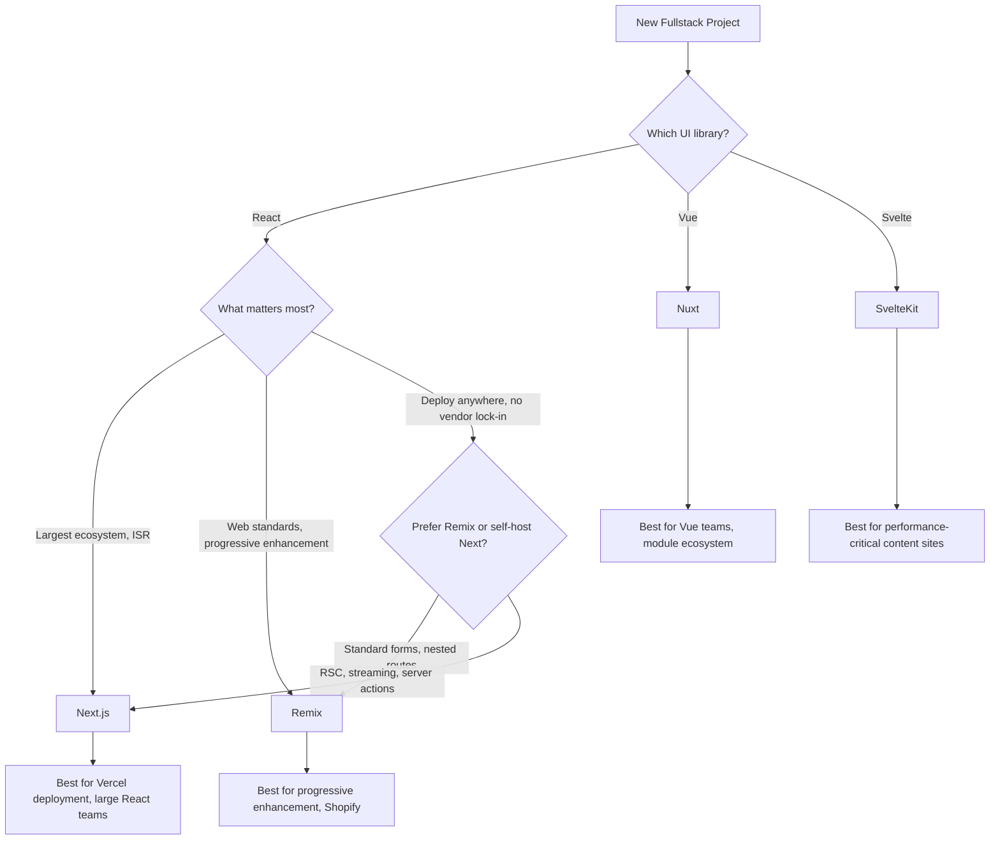

# Next.js vs Nuxt vs SvelteKit vs Remix

Meta-frameworks sit on top of UI libraries and add server-side rendering, routing, data loading, and deployment tooling. They are the default way to build production applications in 2026. This page compares the four most popular meta-frameworks across every dimension that matters.

## Overview

### Next.js

Next.js is a React meta-framework created by Vercel in 2016. It pioneered the hybrid rendering model — mixing static site generation (SSG), server-side rendering (SSR), and incremental static regeneration (ISR) in a single application. Next.js 15 uses the App Router with React Server Components as the default, colocated layouts, streaming SSR, and server actions for mutations. It is the most widely deployed meta-framework, powering sites from Hulu to the Washington Post.

### Nuxt

Nuxt is the official meta-framework for Vue, created by the Chopin brothers in 2016. Nuxt 3 is built on Nitro (a universal server engine), uses file-based routing with automatic code splitting, and provides auto-imports for Vue composables and components. It supports SSR, SSG, and hybrid rendering per route. Nuxt's module ecosystem is one of its strongest selling points — official modules for auth, image optimization, SEO, and dozens of integrations.

### SvelteKit

SvelteKit is the official meta-framework for Svelte, created by Rich Harris and the Svelte team. It uses Vite as its build tool, provides file-based routing with layouts, and supports SSR, SSG, and prerendering. SvelteKit's adapter system makes deployment flexible — adapters exist for Node, Vercel, Netlify, Cloudflare Workers, and static output. SvelteKit is known for its small output and fast runtime.

### Remix

Remix is a React meta-framework created by Ryan Florence and Michael Jackson (the React Router authors) in 2021. Now backed by Shopify, Remix focuses on web standards — it uses the Fetch API, FormData, and HTTP caching headers rather than framework-specific abstractions. Remix v3 merged with React Router v7, unifying the routing and data loading APIs. It emphasizes progressive enhancement, nested routes with parallel data loading, and optimistic UI.

## Architecture Comparison

```mermaid
graph TB
    subgraph Next["Next.js — React Server Components"]
        N1[Request] --> N2[App Router]
        N2 --> N3{Route Segment}
        N3 --> N4[Server Component - RSC Payload]
        N3 --> N5[Client Component - JS Bundle]
        N4 --> N6[Streaming HTML]
        N5 --> N6
        N6 --> N7[Browser Hydration]
    end

    subgraph Nuxt["Nuxt — Universal Rendering"]
        U1[Request] --> U2[Nitro Server]
        U2 --> U3[Route Middleware]
        U3 --> U4[Data Fetching - useFetch / useAsyncData]
        U4 --> U5[Vue SSR Renderer]
        U5 --> U6[HTML + Payload]
        U6 --> U7[Browser Hydration]
    end

    subgraph SK["SvelteKit — Adapter-based"]
        S1[Request] --> S2[SvelteKit Router]
        S2 --> S3[+page.server.ts - load function]
        S3 --> S4[Svelte SSR Compiler]
        S4 --> S5[HTML + Serialized Data]
        S5 --> S6[Browser - Minimal JS]
    end

    subgraph Remix["Remix — Web Standards"]
        R1[Request] --> R2[Route Matching]
        R2 --> R3[Parallel Loaders]
        R3 --> R4[React SSR]
        R4 --> R5[HTML + Deferred Data]
        R5 --> R6[Progressive Hydration]
    end
```



### Key Architectural Differences

**Next.js** splits components into server and client at the module level. Server Components run only on the server and ship zero JavaScript to the browser. Client Components hydrate normally. This allows a granular mix where most of the page is server-rendered and only interactive parts ship JS.

**Nuxt** renders the full Vue component tree on the server, sends HTML + a JSON payload to the browser, then hydrates the entire app. Nuxt's `useFetch` automatically deduplicates requests between server and client, and the payload transfer avoids re-fetching data during hydration.

**SvelteKit** runs `load` functions on the server (or at build time for prerendered routes), passes data as props to Svelte components, and renders HTML. Because Svelte compiles away the framework runtime, the JavaScript shipped to the client is minimal.

**Remix** runs all route `loader` functions in parallel (for nested routes), streams HTML as data resolves, and uses standard `<form>` elements for mutations. Remix works without JavaScript in the browser — forms still submit, pages still render.

## Feature Matrix

| Feature | Next.js 15 | Nuxt 3 | SvelteKit 2 | Remix / RR7 |
|---|---|---|---|---|
| **UI library** | React 19 | Vue 3.5 | Svelte 5 | React 19 |
| **Build tool** | Turbopack (dev), Webpack (prod) | Vite | Vite | Vite |
| **Routing** | File-based (App Router) | File-based | File-based | File-based (or config) |
| **SSR** | Yes (streaming) | Yes | Yes | Yes (streaming) |
| **SSG** | Yes (generateStaticParams) | Yes (nuxt generate) | Yes (prerender) | Yes (pre-rendering) |
| **ISR** | Yes (revalidate) | Yes (routeRules) | Via adapter | No (use HTTP caching) |
| **Server Components** | Yes (default) | Experimental | No | Yes (via React 19) |
| **Server Actions** | Yes | Yes (Nuxt server functions) | Yes (form actions) | Yes (actions) |
| **Middleware** | Edge middleware | Route middleware | Hooks (handle) | Loader-based |
| **API routes** | Yes (Route Handlers) | Yes (server/ directory) | Yes (+server.ts) | Yes (resource routes) |
| **Data loading** | Server Components / fetch | useFetch / useAsyncData | load functions | loader functions |
| **Mutations** | Server Actions | Server functions / useFetch | Form actions | action functions |
| **Layouts** | layout.tsx (nested) | layouts/ directory | +layout.svelte (nested) | Nested routes |
| **Error handling** | error.tsx boundaries | NuxtErrorBoundary | +error.svelte | ErrorBoundary |
| **Deployment** | Vercel, self-host, Docker | Nitro presets (20+) | Adapters (10+) | Any Node/Edge runtime |
| **Edge runtime** | Yes | Yes (Nitro) | Yes (CF adapter) | Yes |
| **Image optimization** | next/image (built-in) | nuxt/image module | @sveltejs/enhanced-img | No built-in |
| **Font optimization** | next/font (built-in) | @nuxtjs/fontaine | Manual | No built-in |
| **i18n** | next-intl | @nuxtjs/i18n | Paraglide | remix-i18next |
| **Auth** | NextAuth / Auth.js | nuxt-auth-utils | Auth.js adapter | remix-auth |

## Code Comparison

### Data Loading and Page Rendering

::: code-group

```tsx [Next.js]
// app/users/[id]/page.tsx
// This is a Server Component by default
import { notFound } from 'next/navigation';

interface Props {
  params: Promise<{ id: string }>;
}

export default async function UserPage({ params }: Props) {
  const { id } = await params;
  const user = await fetch(`https://api.example.com/users/${id}`, {
    next: { revalidate: 60 }, // ISR: revalidate every 60s
  }).then(r => r.json());

  if (!user) notFound();

  return (
    <main>
      <h1>{user.name}</h1>
      <p>{user.email}</p>
    </main>
  );
}
```

```vue [Nuxt]
<!-- pages/users/[id].vue -->
<script setup>
const route = useRoute();

const { data: user, error } = await useFetch(
  `https://api.example.com/users/${route.params.id}`,
  { key: `user-${route.params.id}` }
);

if (error.value) {
  throw createError({ statusCode: 404, message: 'User not found' });
}
</script>

<template>
  <main>
    <h1>{​{ user.name }}</h1>
    <p>{​{ user.email }}</p>
  </main>
</template>
```

```ts [SvelteKit]
// src/routes/users/[id]/+page.server.ts
import { error } from '@sveltejs/kit';
import type { PageServerLoad } from './$types';

export const load: PageServerLoad = async ({ params, fetch }) => {
  const res = await fetch(`https://api.example.com/users/${params.id}`);

  if (!res.ok) throw error(404, 'User not found');

  return { user: await res.json() };
};
```

```svelte [SvelteKit Page]
<!-- src/routes/users/[id]/+page.svelte -->
<script>
  let { data } = $props();
</script>

<main>
  <h1>{data.user.name}</h1>
  <p>{data.user.email}</p>
</main>
```

```tsx [Remix]
// app/routes/users.$id.tsx
import { json } from '@remix-run/node';
import type { LoaderFunctionArgs } from '@remix-run/node';
import { useLoaderData } from '@remix-run/react';

export async function loader({ params }: LoaderFunctionArgs) {
  const res = await fetch(`https://api.example.com/users/${params.id}`);
  if (!res.ok) throw new Response('Not Found', { status: 404 });
  return json(await res.json());
}

export default function UserPage() {
  const user = useLoaderData<typeof loader>();

  return (
    <main>
      <h1>{user.name}</h1>
      <p>{user.email}</p>
    </main>
  );
}
```

:::

### Form Mutations

::: code-group

```tsx [Next.js]
// app/users/create/page.tsx
'use client';

import { createUser } from './actions';
import { useActionState } from 'react';

export default function CreateUser() {
  const [state, formAction, isPending] = useActionState(createUser, null);

  return (
    <form action={formAction}>
      <input name="name" required />
      <input name="email" type="email" required />
      <button disabled={isPending}>
        {isPending ? 'Creating...' : 'Create User'}
      </button>
      {state?.error && <p>{state.error}</p>}
    </form>
  );
}

// app/users/create/actions.ts
'use server';
export async function createUser(prevState: any, formData: FormData) {
  const name = formData.get('name') as string;
  const email = formData.get('email') as string;
  // Save to database...
  redirect('/users');
}
```

```svelte [SvelteKit]
<!-- src/routes/users/create/+page.svelte -->
<script>
  import { enhance } from '$app/forms';
  let { form } = $props();
</script>

<form method="POST" use:enhance>
  <input name="name" required />
  <input name="email" type="email" required />
  <button>Create User</button>
  {#if form?.error}
    <p>{form.error}</p>
  {/if}
</form>
```

```ts [SvelteKit Action]
// src/routes/users/create/+page.server.ts
import { redirect, fail } from '@sveltejs/kit';
import type { Actions } from './$types';

export const actions: Actions = {
  default: async ({ request }) => {
    const data = await request.formData();
    const name = data.get('name') as string;
    const email = data.get('email') as string;
    // Save to database...
    throw redirect(303, '/users');
  },
};
```

:::

## Performance

### Lighthouse Scores (Typical Blog Site)

| Metric | Next.js | Nuxt | SvelteKit | Remix |
|---|---|---|---|---|
| **Performance** | 92-96 | 93-97 | 95-99 | 94-98 |
| **First Contentful Paint** | 0.8s | 0.7s | 0.5s | 0.6s |
| **Largest Contentful Paint** | 1.4s | 1.3s | 1.0s | 1.1s |
| **Total Blocking Time** | 120ms | 100ms | 40ms | 80ms |
| **JS shipped (homepage)** | 85-120 KB | 70-90 KB | 25-45 KB | 65-85 KB |

### Build Performance

| Metric | Next.js | Nuxt | SvelteKit | Remix |
|---|---|---|---|---|
| **Dev server cold start** | ~1.5s (Turbopack) | ~2s (Vite) | ~1s (Vite) | ~1.2s (Vite) |
| **HMR update** | ~50ms | ~80ms | ~60ms | ~70ms |
| **Production build (50 pages)** | ~12s | ~15s | ~8s | ~10s |
| **Static export (100 pages)** | ~20s | ~25s | ~15s | N/A |

::: tip SvelteKit's advantage
SvelteKit consistently ships the least JavaScript to the browser because Svelte compiles away the framework runtime. For content-heavy sites where interactivity is minimal, this translates to noticeably faster page loads on low-end devices and slow networks.
:::

## Developer Experience

### Learning Curve

| Aspect | Next.js | Nuxt | SvelteKit | Remix |
|---|---|---|---|---|
| **Prerequisite knowledge** | React, hooks, RSC model | Vue, Composition API | Svelte, runes | React, web standards |
| **Routing complexity** | High (RSC, layouts, intercepting routes) | Medium (auto-imports, middleware) | Low-medium (load functions) | Medium (nested routes, loaders) |
| **Docs quality** | Good (improved, but RSC docs are dense) | Excellent | Very good | Very good |
| **Error messages** | Good | Very good | Good | Good |
| **Config required** | next.config.ts (can get complex) | nuxt.config.ts (modules-based) | svelte.config.js (simple) | vite.config.ts (simple) |

### Ecosystem and Tooling

| Category | Next.js | Nuxt | SvelteKit | Remix |
|---|---|---|---|---|
| **Official modules** | Few (image, font, auth) | Many (50+ official modules) | Few (adapters) | Few |
| **Deployment platforms** | Vercel (best), any Node host | Any (Nitro presets) | Any (adapters) | Any Node/Edge host |
| **CMS integrations** | Excellent | Excellent | Good | Good |
| **Auth solutions** | NextAuth, Clerk, Auth0 | nuxt-auth-utils, Sidebase | Auth.js, Lucia | remix-auth |
| **Testing** | Playwright, Cypress | Vitest, Playwright | Vitest, Playwright | Vitest, Playwright |

::: warning Vercel lock-in concern
Next.js works best on Vercel. Features like ISR, middleware, and image optimization are optimized for Vercel's infrastructure. Self-hosting Next.js is possible but requires more operational work. If vendor independence is important, Nuxt (Nitro) and SvelteKit (adapters) offer more deployment flexibility out of the box.
:::

## When to Use Which



### Decision Summary

| Scenario | Best Choice | Why |
|---|---|---|
| **React team, deploying to Vercel** | Next.js | Optimized DX, ISR, image optimization |
| **React team, need vendor independence** | Remix | Web standards, runs anywhere |
| **Vue team** | Nuxt | Only real option, excellent ecosystem |
| **Performance-critical content site** | SvelteKit | Smallest JS payload, fastest FCP |
| **E-commerce (Shopify)** | Remix | Shopify backing, Hydrogen integration |
| **Enterprise with many integrations** | Next.js or Nuxt | Largest module/plugin ecosystems |
| **Rapid prototyping** | SvelteKit | Least boilerplate, fastest iteration |
| **Edge-first deployment** | SvelteKit or Nuxt | Best adapter/preset support for edge |

## Migration

### Next.js to Nuxt

1. **Routing**: `app/users/[id]/page.tsx` becomes `pages/users/[id].vue`
2. **Data loading**: Server Components / fetch becomes `useFetch` / `useAsyncData`
3. **Layouts**: `app/layout.tsx` becomes `layouts/default.vue`
4. **API routes**: `app/api/*/route.ts` becomes `server/api/*.ts`
5. **Middleware**: `middleware.ts` becomes `middleware/*.ts`
6. **Server actions**: `'use server'` functions become `server/api` endpoints or Nuxt server functions

### Next.js to SvelteKit

1. **Routing**: `app/users/[id]/page.tsx` becomes `src/routes/users/[id]/+page.svelte`
2. **Data loading**: Server Components becomes `+page.server.ts` load functions
3. **Layouts**: `app/layout.tsx` becomes `+layout.svelte`
4. **API routes**: `app/api/*/route.ts` becomes `src/routes/api/*/+server.ts`
5. **Server actions**: Next.js server actions become SvelteKit form actions
6. **Styling**: Keep Tailwind, move scoped CSS into `<style>` blocks

::: tip Incremental migration
If migrating a large Next.js app, consider running both frameworks side by side using a reverse proxy (e.g., Nginx) to route traffic. Migrate route by route rather than doing a big-bang rewrite.
:::

## Verdict

**Choose Next.js** if your team knows React and you want the most mature meta-framework with the largest ecosystem. Next.js has the most tutorials, the most integrations, and the most production deployments. The App Router with React Server Components is powerful but has a steep learning curve. Be aware of the Vercel-optimization bias.

**Choose Nuxt** if your team uses Vue or if you value a batteries-included framework with an excellent module ecosystem. Nuxt's auto-imports, module system, and Nitro server engine make it the most ergonomic meta-framework. Deployment flexibility is excellent via Nitro presets.

**Choose SvelteKit** if you want the smallest client-side JavaScript footprint and the most intuitive data loading model. SvelteKit's `load` functions are simple, its form actions are elegant, and the resulting sites are fast. The ecosystem is smaller but growing rapidly.

**Choose Remix** if you care deeply about web standards, progressive enhancement, and vendor independence. Remix's mental model of "use the platform" means your app works without JavaScript, forms use standard HTTP, and caching uses standard HTTP headers. Its merger with React Router v7 makes it a natural choice for React Router users.

## Which Would You Choose?

**Scenario 1:** You are building an e-commerce site for a Shopify merchant. SEO is critical, you need ISR for product pages, and the team knows React.

::: details Recommendation: Remix (or Next.js)
Remix is backed by Shopify and powers Hydrogen, their headless commerce framework. If you are specifically building on Shopify, Remix + Hydrogen is the purpose-built choice. If you are on a different commerce platform and want ISR for product page caching, Next.js with `revalidate` gives you the most mature implementation.
:::

**Scenario 2:** Your 3-person team includes one backend developer who knows Python, one designer who knows HTML/CSS, and one junior developer. You need to ship a documentation + blog site in 6 weeks.

::: details Recommendation: SvelteKit
SvelteKit requires the least boilerplate, produces the smallest JavaScript output (critical for content sites), and Svelte's template syntax is the most approachable for someone coming from HTML/CSS. The `load` function pattern is simpler than React Server Components or Vue's `useFetch`. For a content-heavy site, SvelteKit + Markdown is hard to beat.
:::

**Scenario 3:** Your company has a large Vue codebase. You need to add SSR, authentication, and internationalization. The team has 10 Vue developers.

::: details Recommendation: Nuxt
This is not even a close call. Nuxt is the only meta-framework for Vue, and it has official modules for auth (`nuxt-auth-utils`), i18n (`@nuxtjs/i18n`), and dozens of other integrations. Migrating 10 Vue developers to React or Svelte would cost months of retraining for no architectural benefit.
:::

::: warning Common Misconceptions
- **"Next.js only works on Vercel"** — Next.js can be self-hosted with Docker, deployed to any Node.js server, or used with adapters like OpenNext for Cloudflare. Vercel-specific optimizations exist, but the framework is not locked in.
- **"SvelteKit is not production-ready"** — SvelteKit reached 1.0 in December 2022 and powers production sites at Apple, The New York Times, and Ikea. It is stable and battle-tested.
- **"Remix is dying because Shopify acquired it"** — Shopify's acquisition brought more resources and full-time engineers to Remix. The merger with React Router v7 expanded its reach, not diminished it.
- **"You must pick one meta-framework forever"** — Meta-frameworks can coexist behind a reverse proxy. Many companies run different frameworks for different parts of their product (marketing on Nuxt, app on Next.js).
:::

::: tip Real Migration Stories
**Vercel's own docs: Gatsby to Next.js** — Vercel migrated their documentation site from Gatsby (a static-site generator) to Next.js to leverage ISR and React Server Components. The migration allowed them to serve thousands of documentation pages with instant rebuilds instead of full static rebuilds.

**Svelte Society: From Next.js to SvelteKit** — Several Svelte community projects migrated from Next.js to SvelteKit to practice what they preach. They reported 40-60% less client-side JavaScript and a simpler mental model for data loading, though they acknowledged losing some React ecosystem libraries.
:::

::: details Quiz

**1. What is the fundamental difference between how Next.js and Nuxt handle server-side data loading?**

Next.js uses React Server Components that run on the server by default and can directly `await` data. Nuxt uses `useFetch`/`useAsyncData` composables that fetch data on the server and transfer a JSON payload to the client to avoid re-fetching during hydration.

**2. Which meta-framework ships the least JavaScript to the client for a typical content page?**

SvelteKit, because Svelte compiles away the framework runtime. A typical SvelteKit content page ships 25-45 KB of JavaScript compared to 85-120 KB for Next.js.

**3. What does Remix's "progressive enhancement" mean in practice?**

Remix apps work without JavaScript in the browser. Forms submit via standard HTTP POST, pages render on the server, and navigation works without client-side JS. JavaScript enhances the experience (instant transitions, optimistic UI) but is not required.

**4. Why might a large enterprise choose Next.js despite the Vercel optimization bias?**

Largest ecosystem of integrations, most tutorials and community support, React Server Components for granular JS reduction, and the biggest pool of developers who already know Next.js. The Vercel bias is manageable with self-hosting or OpenNext.

**5. What is Nuxt's Nitro server engine, and why does it matter?**

Nitro is a universal server engine that abstracts away deployment targets. A single Nuxt app can deploy to Node.js, Vercel, Netlify, Cloudflare Workers, Deno Deploy, or static hosting with zero code changes — just pick a different Nitro preset.
:::

## One-Liner Summary

Next.js dominates with the largest React ecosystem, Nuxt is the batteries-included Vue choice, SvelteKit ships the least JS, and Remix champions web standards — pick the one that matches your UI library and deployment philosophy.
