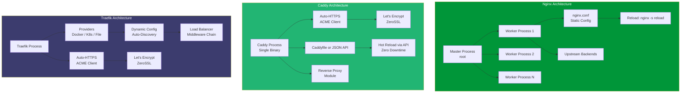
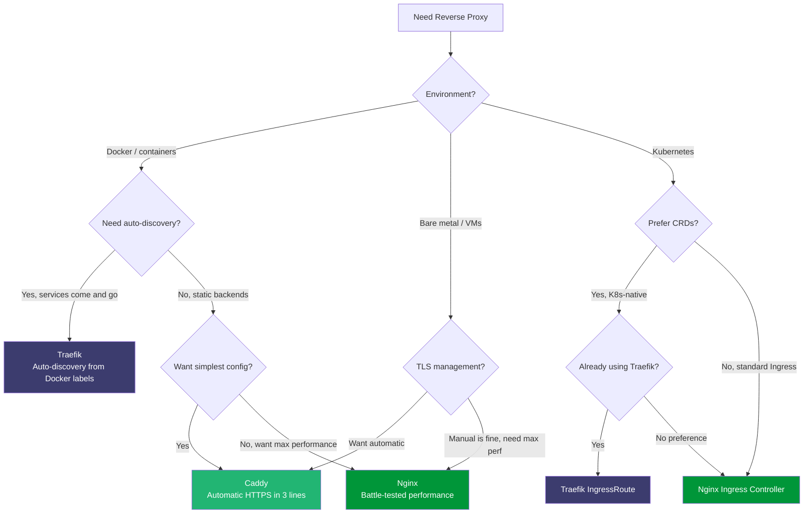

# Nginx vs Caddy vs Traefik

Reverse proxies sit at the most critical junction in your infrastructure — between the internet and your applications. Nginx has held this position for two decades. Caddy brought automatic HTTPS to the masses. Traefik was purpose-built for the container era. Each has a fundamentally different configuration philosophy, and choosing the wrong one creates years of operational friction.

## Overview

| Proxy | First Release | Language | Core Philosophy |
|---|---|---|---|
| **Nginx** | 2004 | C | "Battle-tested performance, manual control" |
| **Caddy** | 2015 | Go | "Automatic HTTPS, minimal configuration" |
| **Traefik** | 2016 | Go | "Auto-discovery in dynamic environments" |

::: tip The Configuration Spectrum
Nginx gives you a powerful but verbose config language. Caddy uses a minimal, human-readable Caddyfile. Traefik auto-discovers services from Docker labels, Kubernetes, and Consul. Your choice depends on how dynamic your infrastructure is.
:::

## Architecture Comparison



## Feature Matrix

| Feature | Nginx | Caddy | Traefik |
|---|---|---|---|
| **Auto HTTPS** | No (manual cert management) | Yes (built-in ACME) | Yes (built-in ACME) |
| **Configuration** | Custom DSL (`nginx.conf`) | Caddyfile / JSON API | YAML / TOML / Docker labels |
| **Hot reload** | `nginx -s reload` (slight pause) | Zero-downtime via API | Automatic (watch providers) |
| **Service discovery** | Manual upstream blocks | Manual / `caddy-docker-proxy` | Native (Docker, K8s, Consul, etc.) |
| **Load balancing** | Round-robin, least_conn, ip_hash | Round-robin, first, random, least_conn | Round-robin, WRR, mirrroring |
| **Health checks** | Passive (OSS) / Active (Plus) | Active + passive | Active + passive |
| **HTTP/2** | Yes | Yes (default) | Yes |
| **HTTP/3 (QUIC)** | Experimental | Yes (built-in) | Yes (experimental) |
| **WebSocket** | Yes (manual config) | Yes (automatic) | Yes (automatic) |
| **gRPC proxy** | Yes | Yes | Yes |
| **Rate limiting** | `limit_req` module | `rate_limit` directive | RateLimit middleware |
| **Circuit breaker** | Not built-in | Not built-in | Built-in middleware |
| **Middleware chain** | Nested location blocks | Matcher + handler directives | First-class middleware pipeline |
| **Metrics** | `stub_status` (basic) / Plus | Prometheus metrics (built-in) | Prometheus / StatsD / InfluxDB |
| **Access logs** | Custom format | Structured JSON (default) | Structured JSON (default) |
| **API gateway** | Manual config + Lua | Caddyfile + modules | Built-in (InFlightReq, headers, etc.) |
| **K8s Ingress** | nginx-ingress-controller | Not official (community) | Traefik Ingress / IngressRoute CRD |
| **Dashboard** | Nginx Plus (paid) | None (API only) | Built-in web dashboard |
| **Paid version** | Nginx Plus ($2,500+/yr) | Caddy (open-source, free) | Traefik Enterprise |
| **License** | BSD-like | Apache 2.0 | MIT |

## Code & Config Comparison

### Basic Reverse Proxy

**Nginx:**

```nginx
# /etc/nginx/conf.d/app.conf
upstream api_backend {
    server 127.0.0.1:3000;
    server 127.0.0.1:3001;
    keepalive 32;
}

server {
    listen 80;
    server_name api.example.com;
    return 301 https://$server_name$request_uri;
}

server {
    listen 443 ssl http2;
    server_name api.example.com;

    ssl_certificate     /etc/letsencrypt/live/api.example.com/fullchain.pem;
    ssl_certificate_key /etc/letsencrypt/live/api.example.com/privkey.pem;
    ssl_protocols       TLSv1.2 TLSv1.3;
    ssl_ciphers         HIGH:!aNULL:!MD5;

    location / {
        proxy_pass http://api_backend;
        proxy_set_header Host $host;
        proxy_set_header X-Real-IP $remote_addr;
        proxy_set_header X-Forwarded-For $proxy_add_x_forwarded_for;
        proxy_set_header X-Forwarded-Proto $scheme;
        proxy_http_version 1.1;
        proxy_set_header Connection "";
    }

    location /static/ {
        root /var/www;
        expires 30d;
        add_header Cache-Control "public, immutable";
    }
}
```

**Caddy:**

```
# Caddyfile
api.example.com {
    reverse_proxy 127.0.0.1:3000 127.0.0.1:3001

    handle_path /static/* {
        root * /var/www/static
        file_server
        header Cache-Control "public, immutable, max-age=2592000"
    }
}
```

**Traefik** (Docker labels):

```yaml
# docker-compose.yml
version: '3.8'
services:
  traefik:
    image: traefik:v3.0
    command:
      - "--api.dashboard=true"
      - "--providers.docker=true"
      - "--providers.docker.exposedbydefault=false"
      - "--entrypoints.web.address=:80"
      - "--entrypoints.websecure.address=:443"
      - "--certificatesresolvers.letsencrypt.acme.email=admin@example.com"
      - "--certificatesresolvers.letsencrypt.acme.storage=/letsencrypt/acme.json"
      - "--certificatesresolvers.letsencrypt.acme.httpchallenge.entrypoint=web"
    ports:
      - "80:80"
      - "443:443"
    volumes:
      - /var/run/docker.sock:/var/run/docker.sock:ro
      - letsencrypt:/letsencrypt

  api:
    image: myapp:latest
    labels:
      - "traefik.enable=true"
      - "traefik.http.routers.api.rule=Host(`api.example.com`)"
      - "traefik.http.routers.api.entrypoints=websecure"
      - "traefik.http.routers.api.tls.certresolver=letsencrypt"
      - "traefik.http.services.api.loadbalancer.server.port=3000"

volumes:
  letsencrypt:
```

::: tip Configuration Volume
Notice the difference: Nginx requires ~30 lines for SSL, headers, and proxy. Caddy does the same in 6 lines with automatic HTTPS. Traefik uses Docker labels — no config file to manage at all for Docker workloads.
:::

### Advanced: Rate Limiting + Auth + Compression

**Nginx:**

```nginx
# Rate limiting zone
limit_req_zone $binary_remote_addr zone=api_limit:10m rate=10r/s;

server {
    listen 443 ssl http2;
    server_name api.example.com;

    # ... SSL config omitted ...

    # Compression
    gzip on;
    gzip_types text/plain application/json application/javascript text/css;
    gzip_min_length 1000;

    # Basic auth
    location /admin/ {
        auth_basic "Admin Area";
        auth_basic_user_file /etc/nginx/.htpasswd;
        proxy_pass http://api_backend;
    }

    # Rate-limited API
    location /api/ {
        limit_req zone=api_limit burst=20 nodelay;
        limit_req_status 429;
        proxy_pass http://api_backend;
    }

    # Custom error pages
    error_page 502 503 504 /50x.html;
    location = /50x.html {
        root /usr/share/nginx/html;
    }
}
```

**Caddy:**

```
api.example.com {
    encode gzip zstd

    handle /admin/* {
        basicauth {
            admin $2a$14$hashgoeshere
        }
        reverse_proxy 127.0.0.1:3000
    }

    handle /api/* {
        rate_limit {remote.ip} 10r/s
        reverse_proxy 127.0.0.1:3000
    }

    handle_errors {
        respond "{err.status_code} {err.status_text}"
    }
}
```

**Traefik** (middleware chain):

```yaml
# traefik dynamic config (file provider)
http:
  routers:
    api:
      rule: "Host(`api.example.com`)"
      entrypoints: websecure
      middlewares:
        - compress
        - rate-limit
      service: api
      tls:
        certResolver: letsencrypt

    admin:
      rule: "Host(`api.example.com`) && PathPrefix(`/admin`)"
      entrypoints: websecure
      middlewares:
        - compress
        - basic-auth
      service: api
      tls:
        certResolver: letsencrypt

  middlewares:
    compress:
      compress: {}
    rate-limit:
      rateLimit:
        average: 10
        burst: 20
    basic-auth:
      basicAuth:
        users:
          - "admin:$$2a$$14$$hashgoeshere"

  services:
    api:
      loadBalancer:
        servers:
          - url: "http://127.0.0.1:3000"
          - url: "http://127.0.0.1:3001"
        healthCheck:
          path: /health
          interval: 10s
```

### Kubernetes Ingress

**Nginx Ingress Controller:**

```yaml
apiVersion: networking.k8s.io/v1
kind: Ingress
metadata:
  name: api-ingress
  annotations:
    kubernetes.io/ingress.class: nginx
    nginx.ingress.kubernetes.io/rate-limit: "10"
    nginx.ingress.kubernetes.io/ssl-redirect: "true"
    nginx.ingress.kubernetes.io/proxy-body-size: "10m"
    cert-manager.io/cluster-issuer: letsencrypt-prod
spec:
  tls:
    - hosts:
        - api.example.com
      secretName: api-tls
  rules:
    - host: api.example.com
      http:
        paths:
          - path: /
            pathType: Prefix
            backend:
              service:
                name: api
                port:
                  number: 3000
```

**Traefik IngressRoute CRD:**

```yaml
apiVersion: traefik.io/v1alpha1
kind: IngressRoute
metadata:
  name: api-ingress
spec:
  entryPoints:
    - websecure
  routes:
    - match: Host(`api.example.com`)
      kind: Rule
      middlewares:
        - name: rate-limit
        - name: compress
      services:
        - name: api
          port: 3000
  tls:
    certResolver: letsencrypt
---
apiVersion: traefik.io/v1alpha1
kind: Middleware
metadata:
  name: rate-limit
spec:
  rateLimit:
    average: 10
    burst: 20
```

## Performance

### Benchmark Results (Static File Serving)

| Metric | Nginx | Caddy | Traefik |
|---|---|---|---|
| **Requests/sec (1KB file)** | ~95,000 | ~75,000 | ~55,000 |
| **Requests/sec (100KB file)** | ~45,000 | ~38,000 | ~30,000 |
| **Latency p50** | 0.5ms | 0.8ms | 1.2ms |
| **Latency p99** | 2ms | 4ms | 6ms |
| **Memory usage (idle)** | ~5 MB | ~15 MB | ~30 MB |
| **Memory usage (10K conn)** | ~30 MB | ~80 MB | ~120 MB |
| **Max concurrent connections** | 100K+ (tunable) | 50K+ | 50K+ |

### Reverse Proxy Benchmarks (Proxying to Backend)

| Metric | Nginx | Caddy | Traefik |
|---|---|---|---|
| **Requests/sec** | ~70,000 | ~55,000 | ~40,000 |
| **Added latency (proxy)** | ~0.1ms | ~0.2ms | ~0.3ms |
| **TLS handshake time** | ~2ms | ~2ms | ~2.5ms |
| **HTTP/2 multiplexing** | Good | Excellent | Good |
| **WebSocket overhead** | Minimal | Minimal | Minimal |

::: warning Performance Context
Nginx is fastest because it is written in C with an event-driven architecture optimized over 20 years. For most applications, the difference between 70K and 40K req/s is irrelevant — your bottleneck is the backend, not the proxy. Choose based on configuration ergonomics, not raw throughput, unless you are operating at massive scale.
:::

### TLS Performance

| Metric | Nginx | Caddy | Traefik |
|---|---|---|---|
| **Certificate provisioning** | Manual (certbot cron) | Automatic (ACME, <30s) | Automatic (ACME, <30s) |
| **Certificate renewal** | Manual (certbot renew) | Automatic (background) | Automatic (background) |
| **OCSP stapling** | Manual config | Automatic | Automatic |
| **TLS 1.3** | Yes | Yes (default) | Yes |
| **HTTP/3 (QUIC)** | Experimental | Stable | Experimental |
| **Cert storage** | File system | File / internal storage | File (`acme.json`) |

## Developer Experience

### What Nginx Excels At

- Raw performance: 20 years of C optimization
- Documentation: Most documented web server in existence
- Modules: Stream (TCP/UDP proxy), Lua scripting, GeoIP, ModSecurity WAF
- Proven at scale: Powers ~35% of the world's websites
- Fine-grained control over every aspect of request handling

### What Caddy Excels At

- Automatic HTTPS with zero configuration (just add the domain name)
- Caddyfile is the most readable proxy config format ever designed
- API-driven config changes with zero-downtime reloads
- Single binary, no dependencies, cross-platform
- Built-in HTTP/3 support

### What Traefik Excels At

- Dynamic service discovery from Docker, Kubernetes, Consul, etc.
- Middleware pipeline: chain rate limiting, auth, headers, retry, circuit breaker
- Built-in dashboard for visualizing routes and services
- First-class Kubernetes support via IngressRoute CRD
- Let's Encrypt with DNS challenge support for wildcard certificates

### Pain Points

| Proxy | Key Frustration |
|---|---|
| **Nginx** | Manual TLS cert management; config syntax is verbose and error-prone; no dynamic reconfiguration without reload |
| **Caddy** | Lower raw throughput than Nginx; smaller community; limited load balancing algorithms |
| **Traefik** | Lowest performance of the three; Docker socket mount is a security risk; complex YAML config for advanced setups |

## When to Use Which



### Decision Summary

| Scenario | Recommended Proxy |
|---|---|
| Highest performance, heavy traffic | **Nginx** |
| Simple setup, auto HTTPS, small team | **Caddy** |
| Docker Compose with dynamic services | **Traefik** |
| Kubernetes ingress (standard) | **Nginx Ingress Controller** |
| Kubernetes ingress (advanced routing) | **Traefik IngressRoute** |
| Single-binary, no dependencies | **Caddy** |
| WAF / security module needed | **Nginx** (ModSecurity) |
| API gateway with middleware chain | **Traefik** |
| Static file serving / CDN origin | **Nginx** |
| Hobby project, fastest setup | **Caddy** |

## Migration

### Nginx to Caddy

```bash
# 1. Install Caddy
sudo apt install -y debian-keyring debian-archive-keyring
curl -1sLf 'https://dl.cloudsmith.io/public/caddy/stable/gpg.key' | \
  sudo gpg --dearmor -o /usr/share/keyrings/caddy-stable-archive-keyring.gpg
sudo apt update && sudo apt install caddy

# 2. Convert nginx.conf to Caddyfile
# Nginx:
#   server {
#     listen 443 ssl;
#     server_name api.example.com;
#     ssl_certificate /path/to/cert;
#     ssl_certificate_key /path/to/key;
#     location / {
#       proxy_pass http://127.0.0.1:3000;
#     }
#   }
#
# Caddy equivalent:
#   api.example.com {
#     reverse_proxy 127.0.0.1:3000
#   }
# That's it — Caddy handles TLS automatically

# 3. Move Caddyfile to /etc/caddy/Caddyfile

# 4. Stop Nginx, start Caddy
sudo systemctl stop nginx
sudo systemctl disable nginx
sudo systemctl enable --now caddy

# 5. Verify TLS is working
curl -I https://api.example.com
```

### Nginx to Traefik (Docker)

```yaml
# Before: nginx.conf + upstream blocks
# After: Docker labels on each service

# docker-compose.yml
services:
  traefik:
    image: traefik:v3.0
    command:
      - "--providers.docker=true"
      - "--providers.docker.exposedbydefault=false"
      - "--entrypoints.websecure.address=:443"
      - "--certificatesresolvers.le.acme.email=admin@example.com"
      - "--certificatesresolvers.le.acme.storage=/letsencrypt/acme.json"
      - "--certificatesresolvers.le.acme.tlschallenge=true"
    ports:
      - "443:443"
    volumes:
      - /var/run/docker.sock:/var/run/docker.sock:ro
      - letsencrypt:/letsencrypt

  # Each service just needs labels — no proxy config file
  api:
    image: myapp:latest
    labels:
      - "traefik.enable=true"
      - "traefik.http.routers.api.rule=Host(`api.example.com`)"
      - "traefik.http.routers.api.tls.certresolver=le"

  frontend:
    image: myfrontend:latest
    labels:
      - "traefik.enable=true"
      - "traefik.http.routers.frontend.rule=Host(`example.com`)"
      - "traefik.http.routers.frontend.tls.certresolver=le"

volumes:
  letsencrypt:
```

::: tip Migration Effort
Nginx to Caddy: 1-2 hours for simple setups. The Caddyfile is dramatically simpler.
Nginx to Traefik: 2-4 hours if you are already using Docker. The shift is from config files to Docker labels.
For complex Nginx configs with Lua modules, OpenResty, or ModSecurity: migration to either alternative requires significant rework of those specific features.
:::

## Verdict

**Nginx** is the undisputed performance champion and the safe default for high-traffic sites. Its 20-year track record, massive documentation, and module ecosystem (Lua, WAF, GeoIP) make it irreplaceable for complex use cases. The cost is verbose configuration and manual TLS management.

**Caddy** is the best choice when you want the fastest path from zero to a production-ready HTTPS reverse proxy. Its automatic TLS, readable Caddyfile, and single-binary deployment make it ideal for small teams, side projects, and any scenario where simplicity trumps raw throughput.

**Traefik** is purpose-built for containerized environments. If your services run in Docker or Kubernetes and you want the proxy to automatically discover and route to them, Traefik eliminates the config management burden entirely. Its middleware system is the most composable of the three.

::: tip Bottom Line
Use **Nginx** when performance matters most or you need advanced modules (WAF, Lua). Use **Caddy** when you want the simplest possible setup with automatic HTTPS. Use **Traefik** when you run Docker/Kubernetes and want zero-touch service discovery. For most modern web projects, **Caddy** is the right default — you can always move to Nginx later if you hit its (very generous) performance ceiling.
:::

## Which Would You Choose?

**Scenario 1:** You are deploying a side project on a $5/month VPS. You have one domain, one backend app, and zero desire to manage TLS certificates manually.

::: details Recommendation: Caddy
Three lines in a Caddyfile and you have automatic HTTPS, HTTP/2, and reverse proxying. No certbot cron jobs, no SSL configuration, no certificate renewal anxiety. Caddy provisions and renews certificates from Let's Encrypt automatically. This is the fastest path from zero to production HTTPS.
:::

**Scenario 2:** You run a Docker Compose stack with 12 microservices. Services scale up and down, and you add new services weekly. You do not want to edit a config file every time.

::: details Recommendation: Traefik
Traefik auto-discovers services from Docker labels. Add a new service with the right labels, and Traefik routes traffic to it automatically with TLS. No config file to edit, no reload command to run. For dynamic Docker environments, Traefik eliminates the proxy management burden entirely.
:::

**Scenario 3:** You are running a high-traffic CDN origin server handling 50,000+ requests/second. You need ModSecurity WAF, custom Lua scripting for request manipulation, and maximum throughput.

::: details Recommendation: Nginx
Nginx's C-based event-driven architecture delivers the highest throughput of any reverse proxy. ModSecurity integration provides enterprise WAF capabilities, and Lua scripting (via OpenResty) enables custom request processing at wire speed. Caddy and Traefik cannot match this performance ceiling.
:::

::: warning Common Misconceptions
- **"Caddy is slow"** — Caddy handles 55,000-75,000 req/s depending on the benchmark. For 99% of applications, this is more than enough. You will hit your backend's limits long before Caddy becomes the bottleneck.
- **"Nginx cannot do automatic HTTPS"** — Nginx can use certbot for automatic certificate provisioning, but it requires separate installation, cron jobs, and reload hooks. It is not built-in the way Caddy's ACME client is.
- **"Traefik is only for Docker"** — Traefik supports file-based configuration, Consul, etcd, Kubernetes, and other providers. Docker is its most popular use case but not its only one.
- **"You need Nginx for production"** — Many production sites run Caddy or Traefik successfully at scale. "Nginx for production" is a cargo-cult default, not a technical requirement for most applications.
:::

::: tip Real Migration Stories
**Tailscale: Nginx to Caddy** — Tailscale uses Caddy as part of their infrastructure because of its automatic HTTPS and clean API-driven configuration. They valued the ability to reload configuration via API without any downtime, which is harder to achieve with Nginx's `nginx -s reload`.

**Traefik Labs: Dog-fooding Traefik in production** — Traefik Labs runs their own SaaS platform behind Traefik, using Docker labels for service discovery and IngressRoute CRDs on Kubernetes. They handle thousands of routes with automatic TLS provisioning and middleware chains for rate limiting, authentication, and circuit breaking.
:::

::: details Quiz

**1. How does Caddy's automatic HTTPS work without any configuration?**

Caddy has a built-in ACME client. When you specify a domain name in the Caddyfile, Caddy automatically provisions a TLS certificate from Let's Encrypt (or ZeroSSL), configures HTTPS, redirects HTTP to HTTPS, and renews the certificate before expiry — all with zero configuration.

**2. What is Traefik's "provider" model?**

Traefik providers are sources of dynamic configuration. Docker, Kubernetes, Consul, etcd, and file-based configs are all providers. Traefik watches these providers for changes and automatically updates routing rules, load balancers, and TLS certificates without restarts.

**3. Why is Nginx faster than Caddy and Traefik in raw benchmarks?**

Nginx is written in C with a highly optimized event-driven architecture that has been tuned for 20 years. Caddy and Traefik are written in Go, which has garbage collection pauses and higher per-connection memory overhead. The gap is ~30-50% in synthetic benchmarks.

**4. What is the security concern with Traefik's Docker socket mount?**

Traefik needs access to the Docker socket (`/var/run/docker.sock`) to discover containers. This socket provides root-level access to the Docker daemon. A compromised Traefik container could control all other containers. Mitigations include read-only mounts and socket proxies.

**5. When would you choose Nginx Ingress Controller over Traefik in Kubernetes?**

When you need the most battle-tested Kubernetes ingress with the largest community, standard Kubernetes Ingress resource support, and compatibility with cert-manager. Nginx Ingress Controller has more users and more community answers than Traefik's IngressRoute CRD.
:::

## One-Liner Summary

Nginx delivers unmatched raw performance for high-traffic sites, Caddy is the fastest path to automatic HTTPS with minimal config, and Traefik auto-discovers Docker and Kubernetes services without touching a config file.
