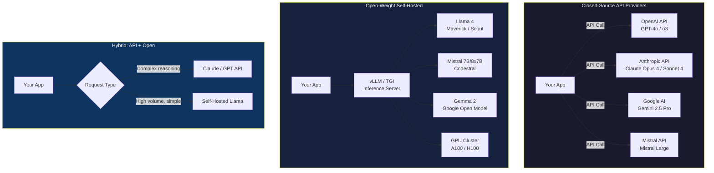
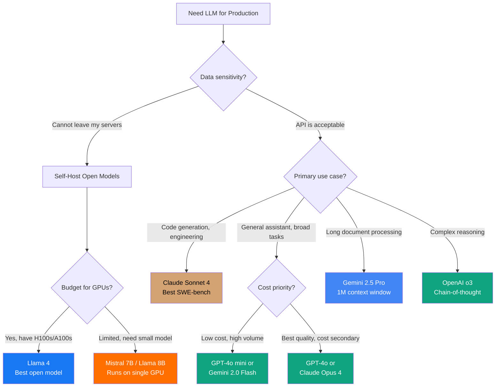

# OpenAI vs Anthropic vs Google vs Mistral vs Llama

The large language model landscape evolves faster than any other technology domain. Choosing a model provider affects your application's quality, cost, latency, safety, and vendor lock-in posture. This comparison evaluates the five major players across every dimension that matters for production applications.

## Overview

| Provider | Flagship Model | Open-Source | Headquarters | First LLM Release |
|---|---|---|---|---|
| **OpenAI** | GPT-4o, o3 | No (closed) | San Francisco | 2020 (GPT-3) |
| **Anthropic** | Claude Opus 4, Sonnet 4 | No (closed) | San Francisco | 2023 (Claude 1) |
| **Google** | Gemini 2.5 Pro | Gemma (open weights) | Mountain View | 2023 (PaLM 2) |
| **Mistral** | Mistral Large | Yes (open weights for smaller models) | Paris | 2023 (Mistral 7B) |
| **Meta (Llama)** | Llama 4 Maverick | Yes (open weights) | Menlo Park | 2023 (Llama 1) |

::: tip Closed vs Open
OpenAI, Anthropic, and Google offer closed-source API models — you send data to their servers. Mistral and Meta offer open-weight models you can self-host. This distinction has profound implications for data privacy, cost at scale, and customization.
:::

## Architecture Comparison



## Feature Matrix

| Feature | OpenAI (GPT-4o) | Anthropic (Claude Sonnet 4) | Google (Gemini 2.5 Pro) | Mistral Large | Llama 4 Maverick |
|---|---|---|---|---|---|
| **Max context window** | 128K tokens | 200K tokens | 1M tokens | 128K tokens | 128K tokens |
| **Output token limit** | 16K tokens | 64K tokens | 65K tokens | 16K tokens | Unlimited (self-hosted) |
| **Input price (per 1M tokens)** | $2.50 | $3.00 | $1.25 | $2.00 | Free (self-hosted) |
| **Output price (per 1M tokens)** | $10.00 | $15.00 | $5.00 | $6.00 | Free (self-hosted) |
| **Multimodal (vision)** | Yes (images) | Yes (images, PDFs) | Yes (images, video, audio) | Yes (images) | Yes (images) |
| **Function calling** | Yes (structured, parallel) | Yes (tool use) | Yes (function calling) | Yes (function calling) | Community implementations |
| **Structured output** | JSON mode, Structured Outputs | Tool use, JSON mode | JSON mode | JSON mode | Varies by framework |
| **Streaming** | Yes (SSE) | Yes (SSE) | Yes (SSE) | Yes (SSE) | Yes (local inference) |
| **Batch API** | Yes (50% discount) | Yes (50% discount) | Yes | Yes | N/A |
| **Fine-tuning** | GPT-4o mini, GPT-4o | Not available | Gemini Flash | Mistral Small/Large | Full fine-tuning (LoRA, QLoRA) |
| **Code generation** | Strong | Very strong | Strong | Codestral (specialized) | Strong |
| **Reasoning** | o3 (CoT reasoning) | Extended thinking | Gemini 2.5 Pro (thinking) | Not specialized | Community CoT |
| **Safety approach** | RLHF + rule-based | Constitutional AI (CAI) | Safety filters | Guardrails API | Community safety layers |
| **Data privacy** | API: data not used for training | API: data not used for training | API: data not used for training | API + self-host option | Full control (self-hosted) |
| **SOC 2** | Yes | Yes | Yes | Yes | N/A (self-hosted) |
| **HIPAA** | BAA available | BAA available | BAA available | Contact sales | Your responsibility |
| **Latency (TTFT)** | ~300ms | ~400ms | ~500ms | ~350ms | Depends on hardware |
| **Rate limits (free)** | 500 RPM | 50 RPM | 60 RPM | 1 RPM | Unlimited (self-hosted) |

::: warning Pricing Changes Rapidly
LLM pricing drops 2-4x per year. The prices listed above are approximate as of early 2026. Always check the provider's current pricing page before making cost projections.
:::

## Code & Config Comparison

### Basic Chat Completion

**OpenAI:**

```typescript
import OpenAI from 'openai';

const openai = new OpenAI({ apiKey: process.env.OPENAI_API_KEY });

const response = await openai.chat.completions.create({
  model: 'gpt-4o',
  messages: [
    { role: 'system', content: 'You are a helpful coding assistant.' },
    { role: 'user', content: 'Write a TypeScript function to debounce.' },
  ],
  temperature: 0.7,
  max_tokens: 2048,
});

console.log(response.choices[0].message.content);
```

**Anthropic:**

```typescript
import Anthropic from '@anthropic-ai/sdk';

const anthropic = new Anthropic({ apiKey: process.env.ANTHROPIC_API_KEY });

const response = await anthropic.messages.create({
  model: 'claude-sonnet-4-20250514',
  max_tokens: 2048,
  system: 'You are a helpful coding assistant.',
  messages: [
    { role: 'user', content: 'Write a TypeScript function to debounce.' },
  ],
});

console.log(response.content[0].text);
```

**Google Gemini:**

```typescript
import { GoogleGenerativeAI } from '@google/generative-ai';

const genAI = new GoogleGenerativeAI(process.env.GOOGLE_API_KEY);
const model = genAI.getGenerativeModel({
  model: 'gemini-2.5-pro',
  systemInstruction: 'You are a helpful coding assistant.',
});

const result = await model.generateContent(
  'Write a TypeScript function to debounce.'
);

console.log(result.response.text());
```

**Mistral:**

```typescript
import MistralClient from '@mistralai/mistralai';

const mistral = new MistralClient(process.env.MISTRAL_API_KEY);

const response = await mistral.chat.complete({
  model: 'mistral-large-latest',
  messages: [
    { role: 'system', content: 'You are a helpful coding assistant.' },
    { role: 'user', content: 'Write a TypeScript function to debounce.' },
  ],
  temperature: 0.7,
  maxTokens: 2048,
});

console.log(response.choices[0].message.content);
```

**Llama (self-hosted via Ollama):**

```typescript
// Using Ollama (local inference)
const response = await fetch('http://localhost:11434/api/chat', {
  method: 'POST',
  body: JSON.stringify({
    model: 'llama4-maverick',
    messages: [
      { role: 'system', content: 'You are a helpful coding assistant.' },
      { role: 'user', content: 'Write a TypeScript function to debounce.' },
    ],
    stream: false,
  }),
});

const data = await response.json();
console.log(data.message.content);
```

### Function Calling / Tool Use

**OpenAI:**

```typescript
const response = await openai.chat.completions.create({
  model: 'gpt-4o',
  messages: [{ role: 'user', content: 'What is the weather in Tokyo?' }],
  tools: [{
    type: 'function',
    function: {
      name: 'get_weather',
      description: 'Get current weather for a location',
      parameters: {
        type: 'object',
        properties: {
          location: { type: 'string', description: 'City name' },
          unit: { type: 'string', enum: ['celsius', 'fahrenheit'] },
        },
        required: ['location'],
      },
    },
  }],
  tool_choice: 'auto',
});

// OpenAI returns structured tool_calls
const toolCall = response.choices[0].message.tool_calls?.[0];
// { function: { name: 'get_weather', arguments: '{"location":"Tokyo","unit":"celsius"}' } }
```

**Anthropic:**

```typescript
const response = await anthropic.messages.create({
  model: 'claude-sonnet-4-20250514',
  max_tokens: 1024,
  tools: [{
    name: 'get_weather',
    description: 'Get current weather for a location',
    input_schema: {
      type: 'object',
      properties: {
        location: { type: 'string', description: 'City name' },
        unit: { type: 'string', enum: ['celsius', 'fahrenheit'] },
      },
      required: ['location'],
    },
  }],
  messages: [{ role: 'user', content: 'What is the weather in Tokyo?' }],
});

// Anthropic returns tool_use content blocks
const toolUse = response.content.find(block => block.type === 'tool_use');
// { type: 'tool_use', name: 'get_weather', input: { location: 'Tokyo', unit: 'celsius' } }
```

::: tip API Design Philosophy
OpenAI uses `tools` with `function` wrappers and returns `tool_calls` in the message. Anthropic uses `tools` directly and returns `tool_use` content blocks. Google uses `functionDeclarations`. The concepts are identical; the JSON shapes differ. Libraries like LangChain and Vercel AI SDK abstract these differences.
:::

### Structured Output

**OpenAI** (Structured Outputs):

```typescript
import { zodResponseFormat } from 'openai/helpers/zod';
import { z } from 'zod';

const ReviewSchema = z.object({
  sentiment: z.enum(['positive', 'negative', 'neutral']),
  score: z.number().min(0).max(10),
  summary: z.string(),
  key_points: z.array(z.string()),
});

const response = await openai.beta.chat.completions.parse({
  model: 'gpt-4o',
  messages: [
    { role: 'user', content: 'Review: "The product is great but shipping was slow"' },
  ],
  response_format: zodResponseFormat(ReviewSchema, 'review'),
});

const review = response.choices[0].message.parsed;
// TypeScript knows: review.sentiment, review.score, review.summary, etc.
```

**Anthropic** (via tool use for structured output):

```typescript
const response = await anthropic.messages.create({
  model: 'claude-sonnet-4-20250514',
  max_tokens: 1024,
  tools: [{
    name: 'structured_review',
    description: 'Output a structured review analysis',
    input_schema: {
      type: 'object',
      properties: {
        sentiment: { type: 'string', enum: ['positive', 'negative', 'neutral'] },
        score: { type: 'number', minimum: 0, maximum: 10 },
        summary: { type: 'string' },
        key_points: { type: 'array', items: { type: 'string' } },
      },
      required: ['sentiment', 'score', 'summary', 'key_points'],
    },
  }],
  tool_choice: { type: 'tool', name: 'structured_review' },
  messages: [
    { role: 'user', content: 'Review: "The product is great but shipping was slow"' },
  ],
});
```

## Performance

### Benchmark Comparison (MMLU, HumanEval, MATH)

| Benchmark | GPT-4o | Claude Opus 4 | Gemini 2.5 Pro | Mistral Large | Llama 4 Maverick |
|---|---|---|---|---|---|
| **MMLU (knowledge)** | 88.7% | 89.0% | 90.2% | 84.0% | 85.5% |
| **HumanEval (code)** | 90.2% | 92.0% | 89.5% | 83.0% | 82.0% |
| **MATH (reasoning)** | 76.6% | 78.0% | 82.0% | 68.0% | 65.0% |
| **GPQA (grad-level Q&A)** | 53.6% | 56.0% | 59.0% | 45.0% | 43.0% |
| **SWE-bench (real coding)** | 33.2% | 72.7% | 63.8% | 28.0% | 25.0% |
| **MGSM (multilingual)** | 90.5% | 91.0% | 92.0% | 88.0% | 85.0% |

::: warning Benchmarks Are Not Reality
Benchmark scores correlate with but do not predict real-world performance in your specific use case. Always evaluate models on your actual tasks, data, and prompts before committing. A model that scores 5% lower on MMLU might significantly outperform on your particular domain.
:::

### Latency & Throughput

| Metric | GPT-4o | Claude Sonnet 4 | Gemini 2.5 Pro | Mistral Large | Llama 4 (self-hosted, A100) |
|---|---|---|---|---|---|
| **Time to first token** | 200-400ms | 300-500ms | 400-700ms | 200-400ms | 50-200ms |
| **Tokens per second** | 80-100 | 60-90 | 40-80 | 70-100 | 30-80 (depends on hardware) |
| **Long context (100K+)** | Moderate slowdown | Handles well | Best (1M native) | Moderate slowdown | Depends on memory |
| **Batch throughput** | High (async API) | High (batch API) | High | Moderate | Limited by GPU |

### Cost Comparison (1M Requests, 1000 Input + 500 Output Tokens Each)

| Provider | Input Cost | Output Cost | Total Cost |
|---|---|---|---|
| **GPT-4o** | $2,500 | $5,000 | **$7,500** |
| **GPT-4o mini** | $150 | $600 | **$750** |
| **Claude Sonnet 4** | $3,000 | $7,500 | **$10,500** |
| **Claude Haiku** | $250 | $625 | **$875** |
| **Gemini 2.5 Pro** | $1,250 | $2,500 | **$3,750** |
| **Gemini 2.0 Flash** | $75 | $150 | **$225** |
| **Mistral Large** | $2,000 | $3,000 | **$5,000** |
| **Mistral Small** | $100 | $300 | **$400** |
| **Llama 4 (self-hosted)** | GPU cost only | GPU cost only | **$500-2,000** (amortized) |

## Developer Experience

### Strengths

**OpenAI:**
- Largest ecosystem: most tutorials, libraries, and third-party integrations assume OpenAI
- Structured Outputs guarantee valid JSON with Zod schema
- GPT-4o mini offers exceptional price-to-performance ratio
- Assistants API for stateful conversation management
- o3 for complex multi-step reasoning tasks

**Anthropic:**
- Claude excels at code generation (highest SWE-bench scores)
- 200K context window with strong recall across the entire window
- Extended thinking for transparent chain-of-thought reasoning
- Constitutional AI: safety without heavy-handed content filtering
- Artifacts and computer use for agentic workflows

**Google Gemini:**
- 1M token context window — process entire codebases in one call
- Native multimodal: images, video, audio, code in a single model
- Gemini 2.0 Flash is the best price-to-performance model available
- Deep integration with Google Cloud (Vertex AI, BigQuery)
- Grounding with Google Search for up-to-date information

**Mistral:**
- Open-weight models for self-hosting (Mistral 7B, Mixtral, Codestral)
- Codestral: specialized code model competitive with larger models
- EU-based (GDPR-friendly data processing)
- Flexible: API or self-hosted deployment
- Strong multilingual performance (especially French, European languages)

**Meta Llama:**
- Fully open weights: self-host, fine-tune, distill without API costs
- No per-token pricing: amortized GPU cost only
- Fine-tune on your private data without exposing it to third parties
- Run locally with Ollama for development
- Large research community continuously improving the models

### Pain Points

| Provider | Key Limitation |
|---|---|
| **OpenAI** | API outages affect millions of apps; pricing premium for flagship models; data privacy concerns |
| **Anthropic** | No fine-tuning; higher per-token costs; lower rate limits on free tier |
| **Google** | Higher latency; API changes frequently; Gemini still catching up in ecosystem maturity |
| **Mistral** | Smaller model sizes lag behind GPT-4o/Claude in complex reasoning; smaller community |
| **Llama** | Requires GPU infrastructure to self-host; no managed API; quality gap vs frontier closed models |

## When to Use Which



### Decision Summary

| Scenario | Recommended Model |
|---|---|
| Code generation and software engineering | **Claude Sonnet 4** |
| General-purpose chatbot | **GPT-4o** or **Claude Sonnet 4** |
| High-volume, cost-sensitive | **GPT-4o mini** or **Gemini 2.0 Flash** |
| Long document analysis (>100K tokens) | **Gemini 2.5 Pro** |
| Complex multi-step reasoning | **OpenAI o3** |
| Data must stay on-premise | **Llama 4** (self-hosted) |
| GDPR / EU compliance | **Mistral** (EU-based) |
| Fine-tuning on custom data | **Llama 4** or **Mistral** (open weights) |
| Multimodal (video + audio) | **Gemini 2.5 Pro** |
| Budget-constrained startup | **Gemini 2.0 Flash** |
| Agentic workflows | **Claude Opus 4** or **GPT-4o** |

## Migration

### OpenAI to Anthropic

```typescript
// OpenAI SDK → Anthropic SDK

// Before (OpenAI):
// const response = await openai.chat.completions.create({
//   model: 'gpt-4o',
//   messages: [
//     { role: 'system', content: 'You are helpful.' },
//     { role: 'user', content: 'Hello' },
//   ],
//   temperature: 0.7,
//   max_tokens: 1024,
// });
// const text = response.choices[0].message.content;

// After (Anthropic):
const response = await anthropic.messages.create({
  model: 'claude-sonnet-4-20250514',
  system: 'You are helpful.',  // system is a top-level param
  messages: [
    { role: 'user', content: 'Hello' },
  ],
  temperature: 0.7,
  max_tokens: 1024,  // required in Anthropic (not optional)
});
const text = response.content[0].text;

// Key differences:
// 1. System message is a top-level parameter, not in messages array
// 2. max_tokens is REQUIRED (not optional)
// 3. Response is in content[0].text, not choices[0].message.content
// 4. Tool/function calling uses different JSON structure
// 5. Streaming uses different event types
```

### Using an Abstraction Layer (Vercel AI SDK)

```typescript
// Use Vercel AI SDK to make provider switching trivial
import { generateText } from 'ai';
import { openai } from '@ai-sdk/openai';
import { anthropic } from '@ai-sdk/anthropic';
import { google } from '@ai-sdk/google';

// Switch models by changing one line:
const model = anthropic('claude-sonnet-4-20250514');
// const model = openai('gpt-4o');
// const model = google('gemini-2.5-pro');

const { text } = await generateText({
  model,
  system: 'You are a helpful assistant.',
  prompt: 'Write a haiku about TypeScript.',
  temperature: 0.7,
  maxTokens: 1024,
});

// Same code works with any provider
// Only the model variable changes
```

::: tip Avoid Provider Lock-In
Use an abstraction layer (Vercel AI SDK, LiteLLM, or LangChain) from day one. The cost of integrating an abstraction is minimal, and it makes provider switching a one-line change instead of a multi-week refactor. This is especially important given how rapidly the LLM market evolves.
:::

## Verdict

**OpenAI** has the largest ecosystem and remains the default for most applications. GPT-4o is a strong generalist, GPT-4o mini offers unbeatable value for high-volume use cases, and o3 leads in complex reasoning. The ecosystem advantage (tools, tutorials, integrations) is significant.

**Anthropic Claude** leads in code generation and software engineering tasks. Claude's extended thinking provides transparent reasoning, and its 200K context window with strong recall makes it excellent for long-document analysis. The Constitutional AI approach results in helpful responses with fewer arbitrary refusals.

**Google Gemini** wins on context length (1M tokens), multimodal breadth (video + audio), and price-performance (Gemini 2.0 Flash). It is the best choice for long document processing and applications that need native video/audio understanding.

**Mistral** offers the best balance of quality and flexibility for European companies needing GDPR compliance, and its open-weight smaller models are excellent for self-hosting.

**Meta Llama** is the clear winner for self-hosted deployments. When you need data sovereignty, custom fine-tuning, or want to eliminate per-token API costs, Llama 4 is the strongest open-weight model available.

::: tip Bottom Line
For most production applications, start with **GPT-4o** or **Claude Sonnet 4** behind an abstraction layer. Use **Gemini 2.0 Flash** for high-volume, cost-sensitive workloads. Self-host **Llama 4** when data cannot leave your infrastructure. Always benchmark on YOUR specific tasks — aggregate benchmarks do not predict domain-specific performance.
:::

## Which Would You Choose?

**Scenario 1:** You are building a coding assistant IDE plugin. It needs to understand large codebases (50K+ lines), suggest refactors, and write tests. Quality of code output is the top priority.

::: details Recommendation: Claude Sonnet 4
Claude leads on SWE-bench (real-world coding tasks) with a 72.7% score versus GPT-4o's 33.2%. Its 200K context window can hold an entire codebase for analysis. Extended thinking provides transparent reasoning for complex refactoring decisions. For code-centric applications, Claude is the clear leader.
:::

**Scenario 2:** Your startup processes 10 million customer support tickets per month. Each ticket needs classification, sentiment analysis, and a suggested response. Cost is the primary constraint.

::: details Recommendation: Gemini 2.0 Flash (or GPT-4o mini)
At $0.075/1M input tokens and $0.15/1M output tokens, Gemini 2.0 Flash costs ~$225/month for 10M tickets. GPT-4o mini is similar at ~$750/month. Both handle classification and sentiment analysis well. For this volume, the 10-50x cost difference versus frontier models is decisive.
:::

**Scenario 3:** You are building a medical records analysis system. Patient data absolutely cannot leave your company's servers due to HIPAA requirements. You have a cluster of 8x A100 GPUs available.

::: details Recommendation: Llama 4 (self-hosted)
Self-hosted Llama 4 keeps all data on your infrastructure — no API calls, no third-party data processing agreements needed. With 8x A100s, you can run the Maverick model with excellent throughput. Fine-tune on your medical domain data to improve accuracy without exposing any patient information.
:::

::: warning Common Misconceptions
- **"GPT-4 is always the best model"** — Different models excel at different tasks. Claude leads at coding, Gemini leads at long-context and multimodal, and GPT-4o mini/Gemini Flash beat frontier models on cost-per-quality for simpler tasks.
- **"Open-source models are much worse than closed models"** — Llama 4 Maverick is competitive with GPT-4o on many benchmarks. The gap has narrowed dramatically. For many production use cases, the quality difference is negligible while the cost and privacy advantages are significant.
- **"You need the biggest model for every task"** — Classification, sentiment analysis, and extraction tasks work excellently with smaller, cheaper models. Reserve frontier models (Opus 4, o3) for complex reasoning where quality justifies the cost.
- **"API lock-in is permanent"** — Use an abstraction layer (Vercel AI SDK, LiteLLM) from day one. Switching providers becomes a one-line configuration change instead of a multi-week refactor.
:::

::: tip Real Migration Stories
**Replit: OpenAI to custom models** — Replit initially used OpenAI models for their AI coding assistant but invested in training custom code models to reduce latency, cost, and API dependency. Their journey illustrates that many companies start with API providers and eventually invest in self-hosted or custom models as usage scales.

**Notion: Multi-provider strategy** — Notion uses multiple LLM providers simultaneously, routing different features to different models based on cost, quality, and latency requirements. Summarization uses cheaper models, while complex Q&A uses frontier models. This multi-provider approach is becoming the industry standard.
:::

::: details Quiz

**1. What is the practical significance of Gemini's 1M token context window?**

You can process entire codebases, book-length documents, or hours of meeting transcripts in a single API call without chunking or RAG pipelines. Other models (128K-200K windows) require splitting long content into chunks and managing retrieval, adding complexity and potential information loss.

**2. What is Constitutional AI (Anthropic's safety approach), and how does it differ from RLHF?**

Constitutional AI trains the model to follow a set of principles (a "constitution") rather than relying solely on human preference rankings (RLHF). The model critiques and revises its own outputs against these principles. This aims for safety that is principled rather than based on individual annotator preferences.

**3. Why would you self-host Llama 4 instead of using an API?**

Data sovereignty (data never leaves your servers), no per-token costs at scale (amortized GPU cost only), full fine-tuning capability on proprietary data, no rate limits, and no dependency on a third-party service's uptime or pricing changes.

**4. What is the Vercel AI SDK, and why is it recommended for LLM applications?**

The Vercel AI SDK provides a unified TypeScript API for multiple LLM providers (OpenAI, Anthropic, Google, Mistral). Switching providers requires changing one line (`const model = openai('gpt-4o')` to `const model = anthropic('claude-sonnet-4-20250514')`). This prevents provider lock-in.

**5. When does GPT-4o mini outperform GPT-4o in production?**

For high-volume, simpler tasks (classification, extraction, summarization, basic Q&A), GPT-4o mini delivers similar quality at 1/10th the cost. The quality gap is most noticeable for complex multi-step reasoning, nuanced writing, and advanced coding tasks.
:::

## One-Liner Summary

OpenAI has the broadest ecosystem, Claude excels at coding and reasoning, Gemini wins on context length and cost, Mistral offers EU-friendly flexibility, and Llama is the king of self-hosted AI.
