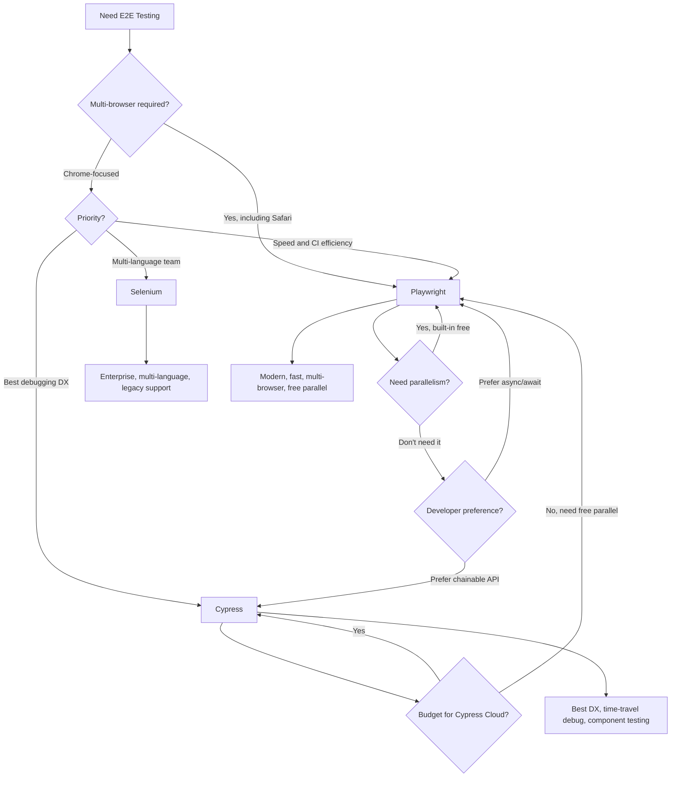

# Playwright vs Cypress vs Selenium

End-to-end testing frameworks verify that your entire application works from the user's perspective. The right choice affects test reliability, CI pipeline speed, and developer confidence. This page compares the three most widely used E2E testing tools across every dimension that matters.

## Overview

### Playwright

Playwright is a browser automation framework created by Microsoft in 2020. The core team previously built Puppeteer at Google, and Playwright represents their "v2" — supporting Chromium, Firefox, and WebKit (Safari) from a single API. Playwright uses the Chrome DevTools Protocol (CDP) and equivalent protocols for other browsers, running test code in Node.js while controlling browsers out-of-process. It provides auto-waiting, web-first assertions, tracing, and built-in parallelism. Playwright can also test APIs, mobile viewports, and generate code from manual browser interactions.

### Cypress

Cypress is an E2E testing framework created by Brian Mann in 2017. It takes a fundamentally different architectural approach — Cypress injects itself directly into the browser and runs test code inside the same JavaScript context as the application. This gives Cypress direct access to the DOM, network requests, and application state, enabling powerful time-travel debugging. Cypress provides an interactive Test Runner with a visual log of every command. Cypress 13+ added multi-browser support, but WebKit support remains experimental.

### Selenium

Selenium is the original browser automation framework, created by Jason Huggins in 2004. It uses the WebDriver protocol — a W3C standard — to control browsers through official browser drivers (ChromeDriver, GeckoDriver, etc.). Selenium supports every major programming language (Java, Python, C#, JavaScript, Ruby) and every major browser. It is the most widely deployed E2E testing framework in enterprises and is the foundation of tools like Selenoid, Selenium Grid, and cloud testing platforms (BrowserStack, Sauce Labs).

## Architecture Comparison

```mermaid
graph TB
    subgraph Playwright["Playwright — Out-of-Process, Multi-Protocol"]
        PW1[Test Code - Node.js] --> PW2[Playwright Library]
        PW2 --> PW3[CDP - Chromium]
        PW2 --> PW4[CDP variant - Firefox]
        PW2 --> PW5[Webkit Protocol - Safari]
        PW3 --> PW6[Browser Process]
        PW4 --> PW7[Browser Process]
        PW5 --> PW8[Browser Process]
    end

    subgraph Cypress["Cypress — In-Browser Execution"]
        CY1[Test Code] --> CY2[Cypress Runner]
        CY2 --> CY3[Injected into Browser]
        CY3 --> CY4[Same JS Context as App]
        CY4 --> CY5[Direct DOM Access]
        CY3 --> CY6[Network Stubbing Layer]
    end

    subgraph Selenium["Selenium — WebDriver Protocol"]
        SE1[Test Code - Any Language] --> SE2[Language Binding]
        SE2 --> SE3[HTTP - WebDriver Protocol]
        SE3 --> SE4[Browser Driver - ChromeDriver etc]
        SE4 --> SE5[Browser Process]
    end
```



### Key Architectural Differences

**Playwright** controls browsers from outside the browser process using browser-specific debugging protocols. This architecture enables true multi-browser support, multiple tabs/windows, iframes, browser contexts (isolated sessions), and file download/upload testing. Tests run in Node.js, and commands are sent asynchronously to the browser.

**Cypress** runs test code inside the browser itself. This enables direct DOM access, real-time command logging, time-travel debugging (snapshots of the DOM at every step), and automatic waiting. The tradeoff is architectural constraints: Cypress cannot natively handle multiple tabs, cross-origin navigation requires `cy.origin()`, and tests are limited to the browser's JavaScript environment.

**Selenium** communicates with browsers through the standardized WebDriver protocol over HTTP. This adds latency (each command is an HTTP request) but provides maximum compatibility — any browser that implements WebDriver works with Selenium. The protocol is maintained by the W3C, ensuring long-term stability.

## Feature Matrix

| Feature | Playwright | Cypress 13 | Selenium 4 |
|---|---|---|---|
| **Languages** | JS/TS, Python, Java, C#, Go | JavaScript/TypeScript only | Java, Python, C#, JS, Ruby, Go |
| **Browsers** | Chromium, Firefox, WebKit | Chrome, Firefox, Edge, WebKit (experimental) | Chrome, Firefox, Safari, Edge, IE |
| **Parallelism** | Built-in (workers) | Paid (Cypress Cloud) or third-party | Selenium Grid |
| **Auto-waiting** | Built-in (web-first assertions) | Built-in (command retry) | Manual (explicit/implicit waits) |
| **Network interception** | route() API | cy.intercept() | No built-in (proxy-based) |
| **API testing** | request context (built-in) | cy.request() | No built-in |
| **Component testing** | Experimental | Built-in | No |
| **Multiple tabs** | Yes (native) | No (workarounds) | Yes (window handles) |
| **Multiple origins** | Yes (native) | cy.origin() (limited) | Yes (native) |
| **iframes** | frameLocator() | cy.iframe() (plugin) | switchTo().frame() |
| **File upload** | setInputFiles() | selectFile() | sendKeys() |
| **File download** | Built-in handling | Workarounds needed | Workarounds needed |
| **Shadow DOM** | Native support | cy.shadow() | switchTo().shadowRoot() |
| **Mobile emulation** | Device profiles | Viewport only | Appium integration |
| **Visual testing** | toHaveScreenshot() | Plugin (percy, chromatic) | Plugin |
| **Tracing** | Trace viewer (built-in) | Time-travel debugging | No built-in |
| **Video recording** | Built-in | Built-in | No built-in |
| **Test generator** | codegen (CLI) | Cypress Studio | Selenium IDE |
| **Reporters** | Built-in HTML, JUnit, JSON | Mochawesome, JUnit | TestNG, JUnit, Allure |
| **CI integration** | All CI systems | All CI systems, Cypress Cloud | All CI systems |
| **Retry on failure** | Built-in (retries config) | Built-in | Manual implementation |
| **Setup/teardown** | Global setup, fixtures, projects | before/beforeEach, tasks | @Before/@After, fixtures |

## Code Comparison

### Login Flow Test

::: code-group

```ts [Playwright]
import { test, expect } from '@playwright/test';

test('user can log in and see dashboard', async ({ page }) => {
  await page.goto('/login');

  await page.getByLabel('Email').fill('user@example.com');
  await page.getByLabel('Password').fill('password123');
  await page.getByRole('button', { name: 'Sign In' }).click();

  // Auto-waits for navigation and element
  await expect(page.getByRole('heading', { name: 'Dashboard' })).toBeVisible();
  await expect(page).toHaveURL('/dashboard');

  // Check user menu
  await page.getByRole('button', { name: 'User menu' }).click();
  await expect(page.getByText('user@example.com')).toBeVisible();
});
```

```ts [Cypress]
describe('Login', () => {
  it('user can log in and see dashboard', () => {
    cy.visit('/login');

    cy.findByLabelText('Email').type('user@example.com');
    cy.findByLabelText('Password').type('password123');
    cy.findByRole('button', { name: 'Sign In' }).click();

    // Auto-waits for element and assertion
    cy.findByRole('heading', { name: 'Dashboard' }).should('be.visible');
    cy.url().should('include', '/dashboard');

    // Check user menu
    cy.findByRole('button', { name: 'User menu' }).click();
    cy.findByText('user@example.com').should('be.visible');
  });
});
```

```ts [Selenium]
import { Builder, By, until } from 'selenium-webdriver';

describe('Login', () => {
  let driver;

  beforeAll(async () => {
    driver = await new Builder().forBrowser('chrome').build();
  });

  afterAll(async () => {
    await driver.quit();
  });

  it('user can log in and see dashboard', async () => {
    await driver.get('http://localhost:3000/login');

    await driver.findElement(By.css('[aria-label="Email"]'))
      .sendKeys('user@example.com');
    await driver.findElement(By.css('[aria-label="Password"]'))
      .sendKeys('password123');
    await driver.findElement(By.css('button[type="submit"]')).click();

    // Must explicitly wait
    await driver.wait(until.urlContains('/dashboard'), 10000);
    const heading = await driver.wait(
      until.elementLocated(By.css('h1')),
      10000
    );
    const text = await heading.getText();
    expect(text).toBe('Dashboard');
  });
});
```

:::

### API Mocking / Network Interception

::: code-group

```ts [Playwright]
import { test, expect } from '@playwright/test';

test('displays users from API', async ({ page }) => {
  // Intercept API and return mock data
  await page.route('/api/users', (route) =>
    route.fulfill({
      status: 200,
      contentType: 'application/json',
      body: JSON.stringify([
        { id: 1, name: 'Alice' },
        { id: 2, name: 'Bob' },
      ]),
    })
  );

  await page.goto('/users');

  await expect(page.getByText('Alice')).toBeVisible();
  await expect(page.getByText('Bob')).toBeVisible();
});

test('handles API error gracefully', async ({ page }) => {
  await page.route('/api/users', (route) =>
    route.fulfill({ status: 500, body: 'Server Error' })
  );

  await page.goto('/users');
  await expect(page.getByText('Failed to load users')).toBeVisible();
});
```

```ts [Cypress]
describe('Users page', () => {
  it('displays users from API', () => {
    cy.intercept('GET', '/api/users', {
      statusCode: 200,
      body: [
        { id: 1, name: 'Alice' },
        { id: 2, name: 'Bob' },
      ],
    }).as('getUsers');

    cy.visit('/users');
    cy.wait('@getUsers');

    cy.findByText('Alice').should('be.visible');
    cy.findByText('Bob').should('be.visible');
  });

  it('handles API error gracefully', () => {
    cy.intercept('GET', '/api/users', {
      statusCode: 500,
      body: 'Server Error',
    });

    cy.visit('/users');
    cy.findByText('Failed to load users').should('be.visible');
  });
});
```

:::

### Visual Regression Testing

::: code-group

```ts [Playwright]
import { test, expect } from '@playwright/test';

test('homepage visual regression', async ({ page }) => {
  await page.goto('/');

  // Full page screenshot comparison
  await expect(page).toHaveScreenshot('homepage.png', {
    maxDiffPixels: 100,
  });

  // Element-level screenshot
  const hero = page.getByTestId('hero-section');
  await expect(hero).toHaveScreenshot('hero.png');
});
```

```ts [Cypress]
// Requires cypress-visual-regression or Percy plugin
describe('Visual regression', () => {
  it('homepage matches snapshot', () => {
    cy.visit('/');
    cy.compareSnapshot('homepage', 0.1); // With cypress-visual-regression
    // OR with Percy:
    // cy.percySnapshot('Homepage');
  });
});
```

:::

## Performance

### Test Execution Speed

| Scenario | Playwright | Cypress | Selenium |
|---|---|---|---|
| **Single test (navigation + assertions)** | 1.2s | 2.5s | 3.8s |
| **10 tests (sequential)** | 8s | 22s | 35s |
| **10 tests (parallel, 4 workers)** | 3s | N/A (paid) | 12s (Grid) |
| **50 tests (parallel, 8 workers)** | 12s | N/A (paid) | 45s (Grid) |
| **Cold start** | 1.5s | 5s | 2s |

::: tip Playwright's parallelism advantage
Playwright runs tests in parallel by default using worker processes. This is built-in and free. Cypress parallelization requires Cypress Cloud (paid) or third-party tools like sorry-cypress. For CI pipelines, this difference can mean 5-minute runs versus 20-minute runs.
:::

### CI Pipeline Impact

| Metric | Playwright | Cypress | Selenium |
|---|---|---|---|
| **Docker image size** | ~500 MB (browsers included) | ~1.5 GB | ~800 MB |
| **Install time** | 30-60s | 60-120s | 30-60s |
| **GitHub Actions setup** | 1 step | 1 step (cypress-io/github-action) | 3-5 steps |
| **Flaky test rate** | Low (auto-wait) | Low (auto-retry) | Medium-high (explicit waits) |
| **Retry mechanism** | Built-in (retries config) | Built-in | Manual |
| **Artifacts** | Traces, screenshots, videos | Screenshots, videos | Screenshots only |

### Resource Usage

| Metric | Playwright | Cypress | Selenium |
|---|---|---|---|
| **Memory per browser** | 150-250 MB | 300-500 MB | 200-350 MB |
| **CPU during test** | Low-medium | Medium-high | Low-medium |
| **Disk for artifacts** | Trace ~2 MB/test | Video ~5 MB/test | Screenshot ~500 KB/test |

## Developer Experience

### Debugging

| Capability | Playwright | Cypress | Selenium |
|---|---|---|---|
| **Interactive debugging** | Trace Viewer, UI Mode | Time-Travel Debugger (excellent) | Browser DevTools |
| **Step-through** | VS Code debugger, `page.pause()` | `.debug()` command | IDE debugger |
| **DOM snapshots** | Trace Viewer (every action) | Snapshot per command (real-time) | None built-in |
| **Network log** | Trace Viewer | Command log (real-time) | Browser DevTools |
| **Video on failure** | Built-in | Built-in | Manual setup |
| **Error messages** | Excellent (locator suggestions) | Good (command log context) | Poor (generic WebDriver errors) |

::: tip Cypress's debugging advantage
Cypress's time-travel debugging is genuinely best-in-class. The interactive Test Runner shows every command, and you can hover over any command to see the exact DOM state at that moment. This makes debugging failing tests significantly easier than in Playwright, where you must use the Trace Viewer (which is good but not as immediate).
:::

### Learning Curve

| Aspect | Playwright | Cypress | Selenium |
|---|---|---|---|
| **Time to first test** | 10 min | 5 min (interactive setup) | 20 min |
| **API complexity** | Medium (locators, assertions, fixtures) | Low-medium (chainable API) | High (waits, drivers, protocols) |
| **Documentation** | Excellent | Excellent | Good (but spread across languages) |
| **Community resources** | Growing rapidly | Large | Largest (decades of content) |
| **Test generator** | `npx playwright codegen` (excellent) | Cypress Studio | Selenium IDE |

### IDE Support

| Feature | Playwright | Cypress | Selenium |
|---|---|---|---|
| **VS Code extension** | Official (Microsoft) | Official | Community |
| **IntelliSense** | Excellent | Good | Good |
| **Run from IDE** | Yes (with debugging) | Yes | Yes |
| **Test explorer** | Yes | Yes | Depends on runner |

## When to Use Which



### Decision Summary

| Scenario | Best Choice | Why |
|---|---|---|
| **New project, modern stack** | Playwright | Fast, multi-browser, free parallelism |
| **Small team, DX priority** | Cypress | Time-travel debugging, interactive runner |
| **CI/CD speed critical** | Playwright | Built-in parallelism, smaller Docker images |
| **Safari testing required** | Playwright | Native WebKit support |
| **Multi-language team** | Selenium | Python, Java, C#, Ruby bindings |
| **Enterprise with existing Selenium** | Selenium (stay) | Migration cost, Grid infrastructure exists |
| **Component testing** | Cypress | Best component testing support |
| **API + E2E testing** | Playwright | Built-in API testing context |
| **Mobile web testing** | Playwright | Device emulation profiles |
| **Visual regression** | Playwright | Built-in screenshot comparison |

## Migration

### Cypress to Playwright

1. **Install**: `npm init playwright@latest`
2. **Rewrite visits**: `cy.visit()` becomes `page.goto()`
3. **Rewrite selectors**: `cy.get()` / `cy.findBy*()` becomes `page.getByRole()`, `page.getByText()`, `page.locator()`
4. **Rewrite assertions**: `.should('be.visible')` becomes `expect(el).toBeVisible()`
5. **Rewrite interceptions**: `cy.intercept()` becomes `page.route()`
6. **Add parallelism config**: `fullyParallel: true` in `playwright.config.ts`
7. **Update CI**: Replace Cypress GitHub Action with Playwright GitHub Action

```ts
// Before (Cypress)
cy.visit('/users');
cy.findByRole('heading', { name: 'Users' }).should('be.visible');
cy.findByPlaceholderText('Search').type('Alice');
cy.findByText('Alice Johnson').should('exist');
cy.findByText('Bob Smith').should('not.exist');

// After (Playwright)
await page.goto('/users');
await expect(page.getByRole('heading', { name: 'Users' })).toBeVisible();
await page.getByPlaceholder('Search').fill('Alice');
await expect(page.getByText('Alice Johnson')).toBeVisible();
await expect(page.getByText('Bob Smith')).not.toBeVisible();
```

### Selenium to Playwright

1. **Replace WebDriver**: Remove browser driver management, Playwright installs browsers
2. **Replace waits**: Remove explicit/implicit waits, Playwright auto-waits
3. **Replace selectors**: CSS/XPath selectors become role-based locators
4. **Replace assertions**: Custom assertion code becomes `expect()` API
5. **Add fixtures**: Replace `beforeAll`/`afterAll` browser management with Playwright fixtures

::: warning Migration effort
Migrating E2E tests is labor-intensive because each test must be individually rewritten. Unlike unit test migrations (where APIs are similar), E2E frameworks have fundamentally different APIs. Budget 1-2 hours per complex test. Consider running both frameworks side by side and migrating test by test.
:::

## Verdict

**Choose Playwright** if you want the most capable, fastest, and most CI-friendly E2E testing framework in 2026. Playwright's built-in parallelism, multi-browser support (including real WebKit/Safari), trace viewer, and auto-waiting make it the strongest all-around choice. It is the momentum pick — adoption is growing faster than any other E2E framework, and Microsoft's backing ensures long-term maintenance.

**Choose Cypress** if developer experience during test authoring and debugging is your top priority. Cypress's interactive Test Runner and time-travel debugging are genuinely better than Playwright's equivalents for day-to-day test development. The chainable API feels natural to many developers. The tradeoff is limited browser support, paid parallelization, and architectural constraints around multiple tabs and cross-origin navigation.

**Choose Selenium** if you work in a multi-language enterprise environment, need IE/legacy browser support, or have existing Selenium Grid infrastructure. Selenium's WebDriver protocol is a W3C standard, and its multi-language support is unmatched. For new projects without legacy constraints, however, Playwright or Cypress are better choices — they are faster, more reliable, and provide dramatically better developer experience.

**The industry trend**: Playwright is rapidly becoming the default E2E testing framework. Its feature set, performance, and free parallelism make it hard to argue against for new projects. Cypress retains a loyal following for its debugging DX, and Selenium remains dominant in enterprises that need multi-language support.

## Which Would You Choose?

**Scenario 1:** Your CI pipeline runs 200 E2E tests, and the current Cypress suite takes 45 minutes. You need to cut that to under 10 minutes without paying for Cypress Cloud.

::: details Recommendation: Playwright
Playwright's built-in parallelism (free, unlimited workers) can distribute 200 tests across 8 workers, cutting runtime by ~8x. With Cypress, free parallelization requires third-party tools like sorry-cypress. Playwright also produces smaller Docker images (~500 MB vs ~1.5 GB), further reducing CI overhead.
:::

**Scenario 2:** Your QA team of 3 non-developers writes E2E tests. They need the best possible debugging experience when tests fail, and they prefer a visual, interactive approach.

::: details Recommendation: Cypress
Cypress's interactive Test Runner with time-travel debugging is genuinely the best debugging experience. The command log shows every action, and hovering over any command shows the exact DOM state at that moment. For non-developer QA engineers, this visual approach is significantly more accessible than Playwright's Trace Viewer.
:::

**Scenario 3:** Your Java-based enterprise has 500 existing Selenium tests with a Selenium Grid infrastructure. You want to modernize but cannot rewrite everything at once.

::: details Recommendation: Stay with Selenium (or migrate gradually to Playwright)
Do not throw away working infrastructure. If the existing Selenium suite is reliable and CI times are acceptable, the migration cost (1-2 hours per complex test) is hard to justify. If you do migrate, run both frameworks in parallel and convert test by test. Playwright's async/await API is closer to Selenium's style than Cypress's chainable API.
:::

::: warning Common Misconceptions
- **"Cypress is slower than Playwright"** — For individual tests, Cypress and Playwright are comparable. The speed difference comes from parallelism: Playwright runs tests in parallel for free; Cypress requires paid Cloud or third-party tools.
- **"Playwright cannot do component testing"** — Playwright has experimental component testing support for React, Vue, and Svelte. However, Cypress's component testing is more mature and widely used.
- **"Selenium is always flaky"** — Selenium tests are flaky when developers use implicit waits instead of explicit waits. Modern Selenium 4 with proper `ExpectedConditions` is reliable. Playwright and Cypress auto-wait, which eliminates this category of bugs.
- **"You cannot test Safari with Cypress"** — Cypress has experimental WebKit (Safari engine) support since Cypress 10, but Playwright's WebKit support is more mature and stable.
:::

::: tip Real Migration Stories
**Microsoft: Selenium to Playwright** — Microsoft teams migrated internal E2E test suites from Selenium to Playwright (unsurprisingly, since Microsoft created Playwright). They reported 3-5x faster CI runs due to built-in parallelism and significantly fewer flaky tests due to auto-waiting.

**Replay.io: Cypress to Playwright** — Replay.io, a time-travel debugging tool, migrated their E2E suite from Cypress to Playwright for multi-browser support and free parallelism. They kept Cypress for component tests where its debugging experience excels, demonstrating that the two tools can complement each other.
:::

::: details Quiz

**1. Why does Cypress run test code inside the browser while Playwright runs it outside?**

Cypress injects test code into the browser's JavaScript context to enable direct DOM access and time-travel debugging (DOM snapshots at every command). Playwright controls browsers via debugging protocols from Node.js, enabling multi-tab, multi-origin, and cross-browser support that Cypress's architecture cannot.

**2. What is Playwright's Trace Viewer, and how does it compare to Cypress's time-travel debugging?**

Trace Viewer is a post-mortem debugging tool that captures DOM snapshots, network requests, and console logs at every test action. You open it after a test fails. Cypress's time-travel debugging is real-time — you see snapshots as the test runs. Cypress's approach is more immediate; Playwright's is more comprehensive.

**3. Why is Playwright's Docker image smaller than Cypress's (~500 MB vs ~1.5 GB)?**

Playwright installs browser binaries separately and its test runner is lightweight. Cypress bundles an Electron app (the interactive Test Runner) even in CI mode, adding significant size.

**4. How does Playwright handle multiple browser tabs, and why can't Cypress do this?**

Playwright creates browser contexts (isolated sessions) and can open multiple pages (tabs) within each context via `browser.newPage()`. Cypress runs inside a single browser tab and cannot natively open or interact with multiple tabs because its architecture requires co-locating test code with the application.

**5. What is the `page.route()` API in Playwright, and what is its Cypress equivalent?**

`page.route()` intercepts network requests and returns mock responses. The Cypress equivalent is `cy.intercept()`. Both achieve the same goal — mocking API responses for testing — with slightly different APIs.
:::

## One-Liner Summary

Playwright leads on speed, multi-browser, and free parallelism; Cypress leads on interactive debugging DX; Selenium still dominates multi-language enterprise environments.
