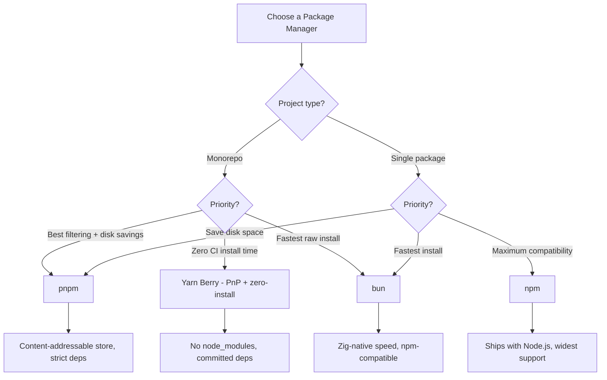

# pnpm vs npm vs yarn vs bun

Package managers are the first tool you run on every project and the last thing you want to debug. Choosing the right one affects install speed, disk usage, CI pipeline duration, and monorepo workflow. This page compares the four most relevant JavaScript package managers across every dimension that matters.

## Overview

### pnpm

pnpm (performant npm) is a package manager created by Zoltan Kochan in 2017. Its core innovation is the content-addressable store — every version of every package is stored once on disk, and projects use hard links or symlinks to reference packages from the global store. This dramatically reduces disk usage and install times. pnpm uses a strict `node_modules` structure that prevents "phantom dependencies" (accessing packages you did not explicitly declare). pnpm has become the default package manager for major open-source projects including Vue, Vite, and SvelteKit.

### npm

npm (Node Package Manager) is the original JavaScript package manager, created by Isaac Schlueter in 2010. It ships with Node.js, making it the default for every Node.js installation. npm v10+ has significantly improved performance, added workspace support, and improved security features. npm uses a flat `node_modules` structure (hoisting) and `package-lock.json` for deterministic installs. As the default package manager, npm has the largest user base and broadest compatibility.

### yarn

yarn (Yet Another Resource Negotiator) was created by Facebook in 2016 to address npm's speed and reliability issues at the time. Yarn Classic (v1) introduced lockfiles and parallel downloads to JavaScript. Yarn Berry (v2-4) is a complete rewrite that introduces Plug'n'Play (PnP) — a radical approach that eliminates `node_modules` entirely, replacing it with a `.pnp.cjs` file that tells Node.js where packages are stored. Yarn Berry also supports zero-installs (committing your dependencies to git).

### bun

bun is a JavaScript runtime and toolkit created by Jarred Sumner in 2022. Its built-in package manager is a byproduct of the runtime — it is written in Zig and designed for maximum speed. bun's package manager is npm-compatible (uses `package.json`, understands `node_modules`), installs packages faster than any other tool, and can run lifecycle scripts using bun's fast JavaScript engine. bun uses a binary lockfile (`bun.lockb`) for speed.

## Architecture Comparison


### Key Architectural Differences

**pnpm** stores every package version once in a global content-addressable store (`~/.pnpm-store`). When you install a package, pnpm creates hard links from `node_modules/.pnpm` to the store. Your `node_modules/<package>` is a symlink to the correct version in `.pnpm`. This means 10 projects using React 19 share a single copy on disk.

**npm** downloads each package into the project's `node_modules` directory. It uses a "flat" hoisting strategy — dependencies of dependencies are hoisted to the top level of `node_modules` to reduce duplication. This means you can accidentally import packages you did not declare in your `package.json` (phantom dependencies).

**Yarn Berry (PnP)** eliminates `node_modules` entirely. Packages are stored as compressed zip archives in `.yarn/cache`, and a `.pnp.cjs` file tells Node.js exactly where to find each package. This is the most radical approach — it eliminates filesystem traversal overhead but requires editor/tooling support and can break packages that hardcode `node_modules` paths.

**bun** uses a flat `node_modules` layout similar to npm but installs packages using a Zig-native HTTP client and file extractor, bypassing Node.js entirely. This makes it the fastest installer by a significant margin. The binary lockfile (`bun.lockb`) is faster to read/write than text-based lockfiles.

## Feature Matrix

| Feature | pnpm 9 | npm 10 | Yarn Berry 4 | bun 1.x |
|---|---|---|---|---|
| **Install strategy** | Content-addressable store + symlinks | Flat hoisting | PnP (no node_modules) or node_modules | Flat hoisting |
| **Lockfile** | pnpm-lock.yaml | package-lock.json | yarn.lock | bun.lockb (binary) |
| **Lockfile format** | YAML (human-readable) | JSON (human-readable) | YAML (human-readable) | Binary (not readable) |
| **Workspaces** | Excellent | Good | Excellent | Good |
| **Phantom dependency prevention** | Yes (strict by default) | No (hoisting allows it) | Yes (PnP enforces) | No (hoisting allows it) |
| **Peer dependencies** | Strict by default | Auto-install | Strict | Auto-install |
| **Patch packages** | pnpm patch | Manual (patch-package) | yarn patch (built-in) | Manual (patch-package) |
| **Overrides** | pnpm.overrides | overrides field | resolutions field | overrides field |
| **Scripts** | pnpm run | npm run | yarn run | bun run |
| **npx equivalent** | pnpm dlx | npx | yarn dlx | bunx |
| **Publishing** | pnpm publish | npm publish | yarn npm publish | No (use npm) |
| **Corepack support** | Yes | N/A (ships with Node) | Yes | No |
| **Offline mode** | Via store cache | npm cache | Zero-installs (commit cache) | Via cache |
| **Shell autocompletion** | Yes | Yes | Yes | Yes |
| **Node.js required** | Yes | Yes (ships with it) | Yes | No (bun runtime) |
| **Config file** | .npmrc | .npmrc | .yarnrc.yml | bunfig.toml |
| **Registry** | npm registry | npm registry | npm registry | npm registry |
| **Side effects cache** | Yes | No | Yes | No |

## Code Comparison

### Common Commands

| Task | pnpm | npm | yarn | bun |
|---|---|---|---|---|
| **Install all** | `pnpm install` | `npm install` | `yarn install` | `bun install` |
| **Add package** | `pnpm add react` | `npm install react` | `yarn add react` | `bun add react` |
| **Add dev dep** | `pnpm add -D vitest` | `npm install -D vitest` | `yarn add -D vitest` | `bun add -d vitest` |
| **Remove package** | `pnpm remove react` | `npm uninstall react` | `yarn remove react` | `bun remove react` |
| **Update package** | `pnpm update react` | `npm update react` | `yarn up react` | `bun update react` |
| **Run script** | `pnpm run dev` | `npm run dev` | `yarn dev` | `bun run dev` |
| **Execute binary** | `pnpm dlx create-vite` | `npx create-vite` | `yarn dlx create-vite` | `bunx create-vite` |
| **Clean install** | `pnpm install --frozen-lockfile` | `npm ci` | `yarn install --immutable` | `bun install --frozen-lockfile` |
| **List deps** | `pnpm list` | `npm list` | `yarn info` | `bun pm ls` |
| **Audit** | `pnpm audit` | `npm audit` | `yarn npm audit` | No built-in |
| **Why installed** | `pnpm why react` | `npm explain react` | `yarn why react` | No built-in |

### Workspace Configuration

::: code-group

```yaml [pnpm - pnpm-workspace.yaml]
packages:
  - 'packages/*'
  - 'apps/*'
  - '!**/test/**'
```

```json [npm - package.json]
{
  "workspaces": [
    "packages/*",
    "apps/*"
  ]
}
```

```json [yarn - package.json]
{
  "workspaces": [
    "packages/*",
    "apps/*"
  ]
}
```

```json [bun - package.json]
{
  "workspaces": [
    "packages/*",
    "apps/*"
  ]
}
```

:::

### Workspace Commands

| Task | pnpm | npm | yarn | bun |
|---|---|---|---|---|
| **Run in specific package** | `pnpm -F @app/web dev` | `npm -w @app/web run dev` | `yarn workspace @app/web dev` | `bun --filter @app/web dev` |
| **Run in all packages** | `pnpm -r run build` | `npm -ws run build` | `yarn workspaces foreach run build` | `bun --filter '*' build` |
| **Add dep to package** | `pnpm -F @app/web add react` | `npm -w @app/web i react` | `yarn workspace @app/web add react` | `bun --filter @app/web add react` |
| **Link workspace deps** | Automatic | Automatic | Automatic | Automatic |

### Monorepo Filtering

::: code-group

```bash [pnpm]
# Run build only in packages that changed since main
pnpm -r --filter "...[origin/main]" run build

# Run tests in a package and all its dependencies
pnpm -F "@app/web..." run test

# Run in all packages except one
pnpm -r --filter "!@app/docs" run lint
```

```bash [npm]
# Run in specific workspaces
npm -w @app/web -w @app/api run build

# Run in all workspaces
npm -ws run build

# No advanced filtering (use turbo or nx for this)
```

```bash [yarn]
# Run build in all workspaces in topological order
yarn workspaces foreach -Apt run build

# Run in packages matching pattern
yarn workspaces foreach -R --from "@app/web" run build
```

:::

::: tip pnpm's filtering advantage
pnpm has the most powerful workspace filtering. You can filter by git diff (`...[origin/main]`), by dependency graph (`@app/web...` = package and its dependencies, `...@app/web` = package and its dependents), and by exclusion. npm's workspace support is basic — for advanced monorepo orchestration with npm, pair it with Turborepo or Nx.
:::

## Performance

### Install Speed (fresh install, no cache)

| Project Size | pnpm | npm | yarn (PnP) | bun |
|---|---|---|---|---|
| **Small (20 deps)** | 3.5s | 6s | 5s | 1.5s |
| **Medium (100 deps)** | 8s | 18s | 12s | 3s |
| **Large (500 deps)** | 18s | 45s | 25s | 6s |
| **Huge (1500+ deps)** | 35s | 90s | 50s | 12s |

### Install Speed (warm cache / lockfile present)

| Project Size | pnpm | npm (ci) | yarn (PnP) | bun |
|---|---|---|---|---|
| **Small (20 deps)** | 1.5s | 3s | 0.5s (zero-install) | 0.8s |
| **Medium (100 deps)** | 3s | 8s | 0.5s (zero-install) | 1.5s |
| **Large (500 deps)** | 7s | 20s | 0.5s (zero-install) | 3s |
| **Huge (1500+ deps)** | 15s | 50s | 0.5s (zero-install) | 6s |

::: tip Yarn zero-installs
Yarn Berry's zero-install mode (committing `.yarn/cache` to git) means CI machines skip the install step entirely. The `.pnp.cjs` file resolves everything from the committed cache. This is the fastest possible CI install — effectively 0 seconds. The tradeoff is a larger git repository.
:::

### Disk Usage

| Scenario | pnpm | npm | yarn (PnP) | bun |
|---|---|---|---|---|
| **1 project, 100 deps** | 80 MB | 180 MB | 60 MB (zip cache) | 175 MB |
| **10 projects, same deps** | 85 MB (shared store) | 1.8 GB | 600 MB | 1.75 GB |
| **10 projects, varied deps** | 200 MB (shared store) | 2.5 GB | 800 MB | 2.4 GB |

::: warning pnpm's disk advantage compounds
The more projects you have, the more pnpm saves. If you work on 10 projects that share common dependencies (React, TypeScript, ESLint), pnpm stores each package version once. npm and bun duplicate packages across every project's `node_modules`.
:::

### CI Pipeline Impact

| Metric | pnpm | npm | yarn (PnP, zero-install) | bun |
|---|---|---|---|---|
| **Install step (cached)** | 5-10s | 15-30s | 0s (committed) | 3-8s |
| **Cache size (CI)** | ~200 MB (store) | ~400 MB (cache) | N/A (committed) | ~350 MB |
| **Lockfile diff readability** | Good (YAML) | Good (JSON) | Good (YAML) | Bad (binary) |
| **Reproducibility** | Excellent | Good | Excellent | Good |

## Developer Experience

### Setup and Learning Curve

| Aspect | pnpm | npm | yarn | bun |
|---|---|---|---|---|
| **No setup needed** | Corepack / `npm i -g pnpm` | Ships with Node.js | Corepack / manual install | Install bun runtime |
| **Time to productive** | 5 min (same commands) | 0 min (already know it) | 15 min (PnP setup, editor config) | 5 min (same commands) |
| **Config complexity** | Low (.npmrc) | Low (.npmrc) | Medium (.yarnrc.yml, PnP) | Low (bunfig.toml) |
| **Compatibility** | High (most packages work) | Highest | Medium (PnP breaks some) | High (most packages work) |
| **Error messages** | Good | Good | Good | Good |
| **Documentation** | Excellent | Good | Good | Good |

### Pain Points

| Issue | pnpm | npm | yarn | bun |
|---|---|---|---|---|
| **Phantom dependencies** | Fixed (strict mode) | Common problem | Fixed (PnP) | Common problem |
| **Peer dep conflicts** | Strict (can be verbose) | Auto-install (can hide issues) | Strict | Auto-install |
| **PnP compatibility** | N/A | N/A | Some packages break | N/A |
| **Lockfile merge conflicts** | Moderate (YAML) | Moderate (JSON) | Moderate (YAML) | Rare (binary, auto-resolve) |
| **Binary lockfile** | No | No | No | Yes (cannot review in PR) |
| **Windows support** | Good | Excellent | Good | Good (improving) |

### Ecosystem Compatibility

| Tool | pnpm | npm | yarn | bun |
|---|---|---|---|---|
| **Turborepo** | Excellent | Excellent | Good | Good |
| **Nx** | Excellent | Excellent | Good | Good |
| **Changesets** | Excellent | Excellent | Good | Good |
| **Docker** | Good | Excellent | Good | Good |
| **GitHub Actions** | setup-pnpm action | Built-in | setup-node corepack | setup-bun action |
| **Vercel** | Supported | Default | Supported | Supported |
| **Netlify** | Supported | Default | Supported | Supported |

## When to Use Which



### Decision Summary

| Scenario | Best Choice | Why |
|---|---|---|
| **Monorepo (any size)** | pnpm | Best filtering, disk savings, strict deps |
| **Open-source library** | npm or pnpm | Broadest contributor compatibility |
| **Maximum CI speed** | Yarn Berry (zero-install) | 0-second install step |
| **Fastest raw install** | bun | 3-5x faster than npm |
| **Maximum compatibility** | npm | Ships with Node, everything supports it |
| **Multiple projects (freelancer)** | pnpm | Content store saves gigabytes of disk |
| **Enterprise, conservative** | npm or pnpm | Proven, well-understood |
| **Bun-based project** | bun | Native integration with bun runtime |
| **Need to review lockfile** | pnpm or npm | Human-readable lockfiles |
| **Strict dependency enforcement** | pnpm or Yarn PnP | Prevents phantom dependencies |

## Migration

### npm to pnpm

1. **Install**: `npm install -g pnpm` or enable via Corepack (`corepack enable pnpm`)
2. **Import lockfile**: `pnpm import` converts `package-lock.json` to `pnpm-lock.yaml`
3. **Install**: `pnpm install` creates the content-addressable `node_modules`
4. **Fix phantom deps**: Add any missing dependencies that were previously hoisted
5. **Update scripts**: Replace `npm run` with `pnpm run` (or just `pnpm <script>`)
6. **Update CI**: Replace `npm ci` with `pnpm install --frozen-lockfile`
7. **Clean up**: Delete `package-lock.json`

```json
// package.json — add engines to enforce pnpm
{
  "packageManager": "pnpm@9.15.0",
  "engines": {
    "pnpm": ">=9"
  }
}
```

::: warning Phantom dependency errors
When switching from npm to pnpm, you may get import errors for packages you use but did not declare in `package.json`. npm's hoisting made these accessible accidentally. pnpm's strict `node_modules` structure exposes them. Fix by adding the missing packages as explicit dependencies.
:::

### npm/pnpm to bun

1. **Install bun**: Follow bun.sh installation guide
2. **Install deps**: `bun install` reads existing `package.json` and creates `bun.lockb`
3. **Update scripts**: Replace `npm run` / `pnpm run` with `bun run`
4. **Update CI**: Use `setup-bun` GitHub Action
5. **Test lifecycle scripts**: Some postinstall scripts may behave differently

### npm to Yarn Berry

1. **Install**: `corepack enable yarn` and `yarn set version stable`
2. **Configure**: Create `.yarnrc.yml` with `nodeLinker: pnp` (or `node-modules` for compatibility)
3. **Install**: `yarn install` generates `yarn.lock` and `.pnp.cjs`
4. **Editor setup**: `yarn dlx @yarnpkg/sdks vscode` for TypeScript support
5. **Fix PnP issues**: Some packages need `packageExtensions` in `.yarnrc.yml`
6. **Optional zero-installs**: Add `.yarn/cache` to git

::: tip Start with node-modules linker
If migrating to Yarn Berry, start with `nodeLinker: node-modules` in `.yarnrc.yml`. This gives you Yarn Berry's features without PnP compatibility issues. Once stable, you can switch to PnP for maximum performance.
:::

## Verdict

**Choose pnpm** for the best all-around package manager in 2026. Its content-addressable store saves significant disk space across projects, its strict `node_modules` prevents phantom dependencies, and its workspace filtering is the most powerful for monorepos. pnpm is the default for most major open-source projects (Vue, Vite, SvelteKit) and works with every CI system and deployment platform. It is the safe, modern default.

**Choose npm** if you want maximum compatibility and zero setup. npm ships with Node.js, so every developer has it immediately. For simple projects, open-source libraries that need contributor-friendly setup, and teams that do not want to learn a new tool, npm v10 is perfectly adequate. It is slower and uses more disk space, but those tradeoffs matter less for small projects.

**Choose Yarn Berry** if CI install speed is your top priority and your team is willing to invest in PnP setup. Zero-installs (committing dependencies to git) eliminates the install step in CI entirely, which is transformative for large projects with slow CI pipelines. The tradeoff is PnP compatibility issues and additional editor configuration.

**Choose bun** if you are already using bun as your JavaScript runtime and want the fastest possible install times. bun's package manager is 3-5x faster than npm for raw installation. The tradeoff is a binary lockfile (no human-readable diffs in PRs), fewer audit/security features, and a smaller community for troubleshooting.

## Which Would You Choose?

**Scenario 1:** You maintain an open-source library on npm. Contributors should be able to clone the repo and start working with zero friction, regardless of which package manager they prefer.

::: details Recommendation: npm
npm ships with Node.js, so every contributor has it by default. No installation step, no Corepack configuration, no "please install pnpm first" in your README. For open-source projects where contributor accessibility matters most, npm is the lowest-friction choice.
:::

**Scenario 2:** You work as a freelancer on 15 different client projects. Your laptop's SSD is 256 GB, and `node_modules` across all projects is eating 8 GB of disk space.

::: details Recommendation: pnpm
pnpm's content-addressable store means 15 projects sharing React, TypeScript, and ESLint only store each package version once on disk. You will reclaim 5-6 GB immediately. The more projects you have, the more pnpm saves.
:::

**Scenario 3:** Your CI pipeline spends 90 seconds on `npm install` for every PR build. You have 50 PRs per day. Developers are frustrated waiting for CI.

::: details Recommendation: Yarn Berry with zero-installs (or bun)
Yarn Berry's zero-install mode commits dependencies to git, making the CI install step literally 0 seconds. Alternatively, bun installs packages 3-5x faster than npm, cutting your 90-second install to ~20 seconds. Either approach saves your team hours per day.
:::

::: warning Common Misconceptions
- **"pnpm's symlinks break things"** — pnpm's strict `node_modules` structure exposes phantom dependencies (packages you use but did not declare). This feels like breakage but is actually pnpm fixing a real bug in your dependency declarations. Add the missing packages and your project is more correct.
- **"Yarn PnP breaks everything"** — Yarn PnP breaks packages that hardcode `node_modules` paths, which is a diminishing minority. Most modern packages work fine. Start with `nodeLinker: node-modules` and switch to PnP when ready.
- **"bun's binary lockfile is a dealbreaker"** — Binary lockfiles cannot be reviewed in PR diffs, which is a legitimate concern for security-conscious teams. However, bun automatically resolves merge conflicts (no manual lockfile merging), which is a genuine advantage.
- **"npm is too slow for real projects"** — npm v10 with `npm ci` and a warm cache is acceptable for most projects. The speed difference matters most in CI pipelines and monorepos, not for typical development workflows.
:::

::: tip Real Migration Stories
**Vue/Vite ecosystem: npm to pnpm** — The Vue, Vite, and Vitest projects all migrated to pnpm for their monorepo workspace management. pnpm's filtering (`--filter "...[origin/main]"`) and strict dependency resolution caught phantom dependencies that npm's hoisting had hidden for years.

**Vercel: yarn v1 to pnpm** — Vercel migrated their internal monorepo from Yarn Classic to pnpm, citing better workspace filtering, strict dependency resolution, and faster install times. The migration also improved CI cache efficiency because pnpm's lockfile is more stable across updates.
:::

::: details Quiz

**1. What is a "phantom dependency," and which package managers prevent it?**

A phantom dependency is a package your code imports that is not declared in your `package.json` — it works because npm/yarn hoists it to the top of `node_modules`. pnpm and Yarn PnP prevent this by enforcing strict module resolution where only declared dependencies are accessible.

**2. How does pnpm's content-addressable store save disk space?**

pnpm stores every package version once in a global store (`~/.pnpm-store`). Projects use hard links to reference packages from this store. If 10 projects use React 19, only one copy exists on disk, linked 10 times.

**3. What is Yarn Berry's "zero-install" mode?**

Zero-installs means committing the `.yarn/cache` directory (compressed package archives) and `.pnp.cjs` (resolution map) to git. CI machines skip the install step entirely because all dependencies are already in the repository. The tradeoff is a larger git repository.

**4. Why is bun's lockfile binary instead of text-based?**

Binary lockfiles are faster to read and write than text-based YAML/JSON. bun prioritizes raw speed in every operation. The tradeoff is that binary lockfiles cannot be human-reviewed in PRs.

**5. When should you use Corepack instead of globally installing pnpm or yarn?**

Corepack (built into Node.js 16+) manages package manager versions per-project via the `packageManager` field in `package.json`. Use it when different projects require different pnpm/yarn versions, ensuring every developer and CI machine uses the exact same version.
:::

## One-Liner Summary

pnpm saves disk space and enforces correct dependencies, npm is the universal zero-setup default, Yarn Berry eliminates CI install time with zero-installs, and bun is the fastest raw installer.
