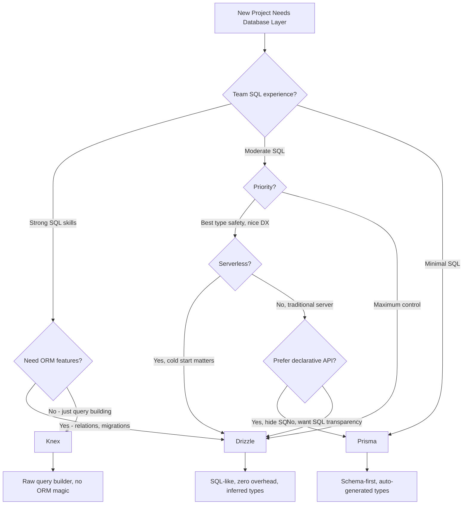

# Prisma vs Drizzle vs TypeORM vs Knex

Choosing a database layer is one of the most consequential decisions in a backend project because it is the hardest to change later. This page compares the four most popular TypeScript database tools across every dimension that matters for production engineering.

## Overview

### Prisma

Prisma is a next-generation ORM created by Prisma Data in 2019. It uses a schema-first approach — you define your data model in a `.prisma` schema file, and Prisma generates a fully type-safe client. Prisma's query API is not SQL-like; it is a declarative object API that handles joins, filtering, and pagination through nested objects. Prisma also provides Prisma Migrate (schema migrations), Prisma Studio (GUI data browser), and Prisma Accelerate (connection pooling and edge caching).

### Drizzle

Drizzle is a TypeScript ORM created by Drizzle Team in 2022. Its philosophy is "if you know SQL, you know Drizzle" — the query API maps directly to SQL syntax with full type inference. Drizzle generates zero runtime overhead beyond the SQL it produces, has no code generation step, and works with every major database driver. Drizzle Kit provides schema migrations, and Drizzle Studio provides a data browser. It has rapidly become the most popular Prisma alternative.

### TypeORM

TypeORM is a traditional ORM created by Umed Khudoiberganov in 2016. Inspired by Java's Hibernate and C#'s Entity Framework, it uses TypeScript decorators to define entities and supports both Active Record and Data Mapper patterns. TypeORM provides a QueryBuilder for complex queries, automatic migrations, and supports multiple databases. It is mature but has known issues with maintenance velocity and TypeScript type safety gaps.

### Knex

Knex is a SQL query builder (not a full ORM) created by Tim Griesser in 2013. It provides a chainable JavaScript API for building SQL queries, a migration system, and a seed system. Knex does not provide an entity/model layer, relations, or type-safe results by default — it is closer to writing raw SQL with a helper library. Many ORMs (including Objection.js) are built on top of Knex.

## Architecture Comparison


### Key Architectural Differences

**Prisma** has a unique architecture: a Rust-based query engine binary sits between your application and the database. This engine handles connection pooling, query optimization, and serialization. The schema file is the single source of truth, and `prisma generate` produces a fully typed client. This means a build step is required.

**Drizzle** has no intermediary engine or code generation step. Your TypeScript schema definitions are both the runtime schema and the type definitions. Drizzle talks directly to your database driver (pg, mysql2, better-sqlite3, etc.), generating and executing SQL strings. This makes it lightweight and transparent.

**TypeORM** uses TypeScript decorators on classes to define entities, then uses runtime metadata reflection to build its internal model. It provides both a high-level Repository API and a lower-level QueryBuilder. TypeORM manages its own connection pool and entity lifecycle.

**Knex** is the simplest: it is a query builder that generates SQL strings and sends them to a database driver. It has no entity concept, no relation mapping, and no object lifecycle. You get back plain JavaScript objects.

## Feature Matrix

| Feature | Prisma | Drizzle | TypeORM | Knex |
|---|---|---|---|---|
| **Type** | ORM (schema-first) | ORM (TypeScript-first) | ORM (decorator-based) | Query builder |
| **Schema definition** | .prisma file (DSL) | TypeScript | TypeScript decorators | Migration files |
| **Code generation** | Required (prisma generate) | None | None | None |
| **Type safety** | Excellent (generated) | Excellent (inferred) | Partial (decorator gaps) | Manual (generic) |
| **Query API style** | Object/declarative | SQL-like chainable | Repository + QueryBuilder | SQL-like chainable |
| **Raw SQL** | prisma.$queryRaw | sql template tag | query() | knex.raw() |
| **Relations** | Implicit (schema-defined) | Explicit (relationalQuery API) | Decorators (@ManyToOne, etc.) | Manual joins |
| **Migrations** | Prisma Migrate (auto-generated) | Drizzle Kit (auto-generated) | Auto-sync or manual | Manual migration files |
| **Seeding** | prisma db seed | Custom scripts | Custom scripts | Built-in seed system |
| **Connection pooling** | Built-in (Rust engine) | Via driver | Built-in | Built-in |
| **Transactions** | prisma.$transaction | db.transaction() | queryRunner / manager | knex.transaction() |
| **Databases** | PostgreSQL, MySQL, SQLite, SQL Server, MongoDB, CockroachDB | PostgreSQL, MySQL, SQLite, Turso | PostgreSQL, MySQL, SQLite, SQL Server, Oracle, CockroachDB | PostgreSQL, MySQL, SQLite, SQL Server, Oracle |
| **Edge/Serverless** | Prisma Accelerate / Data Proxy | Direct (with compatible driver) | Not designed for edge | Not designed for edge |
| **GUI tool** | Prisma Studio | Drizzle Studio | None built-in | None built-in |
| **Bundle size** | Large (Rust engine ~15 MB) | Small (~50 KB) | Medium (~2 MB) | Small (~500 KB) |
| **npm weekly downloads** | ~3M | ~800K | ~1.5M | ~1.8M |

## Code Comparison

### Schema Definition

::: code-group

```prisma [Prisma]
// prisma/schema.prisma
model User {
  id        Int      @id @default(autoincrement())
  email     String   @unique
  name      String
  posts     Post[]
  createdAt DateTime @default(now())
  updatedAt DateTime @updatedAt
}

model Post {
  id        Int      @id @default(autoincrement())
  title     String
  content   String?
  published Boolean  @default(false)
  author    User     @relation(fields: [authorId], references: [id])
  authorId  Int
  tags      Tag[]
  createdAt DateTime @default(now())
}

model Tag {
  id    Int    @id @default(autoincrement())
  name  String @unique
  posts Post[]
}
```

```ts [Drizzle]
// src/db/schema.ts
import { pgTable, serial, text, boolean, integer, timestamp } from 'drizzle-orm/pg-core';
import { relations } from 'drizzle-orm';

export const users = pgTable('users', {
  id: serial('id').primaryKey(),
  email: text('email').notNull().unique(),
  name: text('name').notNull(),
  createdAt: timestamp('created_at').defaultNow().notNull(),
  updatedAt: timestamp('updated_at').defaultNow().notNull(),
});

export const posts = pgTable('posts', {
  id: serial('id').primaryKey(),
  title: text('title').notNull(),
  content: text('content'),
  published: boolean('published').default(false).notNull(),
  authorId: integer('author_id').references(() => users.id).notNull(),
  createdAt: timestamp('created_at').defaultNow().notNull(),
});

export const usersRelations = relations(users, ({ many }) => ({
  posts: many(posts),
}));

export const postsRelations = relations(posts, ({ one }) => ({
  author: one(users, {
    fields: [posts.authorId],
    references: [users.id],
  }),
}));
```

```ts [TypeORM]
// src/entities/User.ts
import { Entity, PrimaryGeneratedColumn, Column, OneToMany, CreateDateColumn, UpdateDateColumn } from 'typeorm';
import { Post } from './Post';

@Entity()
export class User {
  @PrimaryGeneratedColumn()
  id: number;

  @Column({ unique: true })
  email: string;

  @Column()
  name: string;

  @OneToMany(() => Post, post => post.author)
  posts: Post[];

  @CreateDateColumn()
  createdAt: Date;

  @UpdateDateColumn()
  updatedAt: Date;
}

// src/entities/Post.ts
import { Entity, PrimaryGeneratedColumn, Column, ManyToOne, CreateDateColumn } from 'typeorm';
import { User } from './User';

@Entity()
export class Post {
  @PrimaryGeneratedColumn()
  id: number;

  @Column()
  title: string;

  @Column({ nullable: true })
  content: string;

  @Column({ default: false })
  published: boolean;

  @ManyToOne(() => User, user => user.posts)
  author: User;

  @CreateDateColumn()
  createdAt: Date;
}
```

```ts [Knex]
// migrations/001_create_users.ts
import { Knex } from 'knex';

export async function up(knex: Knex): Promise<void> {
  await knex.schema.createTable('users', (table) => {
    table.increments('id').primary();
    table.string('email').unique().notNullable();
    table.string('name').notNullable();
    table.timestamps(true, true);
  });

  await knex.schema.createTable('posts', (table) => {
    table.increments('id').primary();
    table.string('title').notNullable();
    table.text('content');
    table.boolean('published').defaultTo(false);
    table.integer('author_id').references('id').inTable('users').notNullable();
    table.timestamp('created_at').defaultTo(knex.fn.now());
  });
}

export async function down(knex: Knex): Promise<void> {
  await knex.schema.dropTable('posts');
  await knex.schema.dropTable('users');
}
```

:::

### Querying (find user with posts)

::: code-group

```ts [Prisma]
// Find user with their published posts
const user = await prisma.user.findUnique({
  where: { id: 1 },
  include: {
    posts: {
      where: { published: true },
      orderBy: { createdAt: 'desc' },
      take: 10,
    },
  },
});
// user.posts is fully typed as Post[]
```

```ts [Drizzle]
// Relational query API
const user = await db.query.users.findFirst({
  where: eq(users.id, 1),
  with: {
    posts: {
      where: eq(posts.published, true),
      orderBy: desc(posts.createdAt),
      limit: 10,
    },
  },
});

// Or SQL-like API
const result = await db
  .select()
  .from(users)
  .leftJoin(posts, eq(users.id, posts.authorId))
  .where(and(eq(users.id, 1), eq(posts.published, true)))
  .orderBy(desc(posts.createdAt))
  .limit(10);
```

```ts [TypeORM]
// Repository API
const user = await userRepository.findOne({
  where: { id: 1 },
  relations: { posts: true },
});

// QueryBuilder (more control)
const user = await userRepository
  .createQueryBuilder('user')
  .leftJoinAndSelect('user.posts', 'post', 'post.published = :pub', { pub: true })
  .where('user.id = :id', { id: 1 })
  .orderBy('post.createdAt', 'DESC')
  .take(10)
  .getOne();
```

```ts [Knex]
// Manual join — no relation awareness
const rows = await knex('users')
  .select('users.*', 'posts.title', 'posts.content', 'posts.published')
  .leftJoin('posts', 'users.id', 'posts.author_id')
  .where('users.id', 1)
  .andWhere('posts.published', true)
  .orderBy('posts.created_at', 'desc')
  .limit(10);
// rows is any[] — you must manually type and reshape
```

:::

### Complex Query (aggregation)

::: code-group

```ts [Prisma]
// Count posts per user
const usersWithCounts = await prisma.user.findMany({
  select: {
    id: true,
    name: true,
    _count: { select: { posts: true } },
  },
  orderBy: { posts: { _count: 'desc' } },
  take: 10,
});
```

```ts [Drizzle]
import { count, desc } from 'drizzle-orm';

const usersWithCounts = await db
  .select({
    id: users.id,
    name: users.name,
    postCount: count(posts.id),
  })
  .from(users)
  .leftJoin(posts, eq(users.id, posts.authorId))
  .groupBy(users.id)
  .orderBy(desc(count(posts.id)))
  .limit(10);
```

```ts [TypeORM]
const usersWithCounts = await userRepository
  .createQueryBuilder('user')
  .loadRelationCountAndMap('user.postCount', 'user.posts')
  .orderBy('user.postCount', 'DESC')
  .take(10)
  .getMany();
```

```ts [Knex]
const usersWithCounts = await knex('users')
  .select('users.id', 'users.name')
  .count('posts.id as postCount')
  .leftJoin('posts', 'users.id', 'posts.author_id')
  .groupBy('users.id')
  .orderBy('postCount', 'desc')
  .limit(10);
```

:::

## Performance

### Query Execution Benchmarks

| Operation | Prisma | Drizzle | TypeORM | Knex |
|---|---|---|---|---|
| **Simple SELECT (1 row)** | 0.8ms | 0.3ms | 0.5ms | 0.3ms |
| **SELECT with JOIN** | 1.2ms | 0.5ms | 0.8ms | 0.4ms |
| **INSERT (single)** | 1.0ms | 0.4ms | 0.6ms | 0.4ms |
| **INSERT (1000 rows batch)** | 45ms | 12ms | 35ms | 10ms |
| **UPDATE (single)** | 0.9ms | 0.4ms | 0.5ms | 0.3ms |
| **Complex aggregation** | 2.5ms | 1.2ms | 1.8ms | 1.0ms |

::: warning Prisma's overhead
Prisma's Rust query engine adds a constant overhead (~0.3-0.5ms) to every query because it serializes/deserializes data between the Node.js process and the Rust engine via IPC. For applications making hundreds of queries per request, this adds up. Drizzle and Knex talk directly to the database driver with no intermediary.
:::

### Bundle Size and Startup

| Metric | Prisma | Drizzle | TypeORM | Knex |
|---|---|---|---|---|
| **npm install size** | ~100 MB (Rust engines) | ~2 MB | ~15 MB | ~5 MB |
| **Runtime bundle** | ~15 MB (engine binary) | ~50 KB | ~2 MB | ~500 KB |
| **Cold start (serverless)** | 800-1200ms | 50-100ms | 200-400ms | 100-150ms |
| **Memory baseline** | 80 MB | 15 MB | 40 MB | 20 MB |

::: tip Serverless consideration
Prisma's cold start is significantly longer due to the Rust engine binary. For serverless environments (AWS Lambda, Vercel Functions), Drizzle or Knex provide much faster cold starts. Prisma Accelerate mitigates this with a connection proxy but adds another service dependency.
:::

## Developer Experience

### Learning Curve

| Aspect | Prisma | Drizzle | TypeORM | Knex |
|---|---|---|---|---|
| **Time to first query** | 15 min (schema + generate) | 10 min | 15 min (entity setup) | 5 min |
| **SQL knowledge needed** | Low (declarative API) | High (SQL-mapped API) | Medium | High |
| **Type safety effort** | Zero (generated) | Zero (inferred) | Medium (decorator gaps) | High (manual) |
| **Documentation** | Excellent | Good (improving) | Adequate | Good |
| **Migration workflow** | Excellent (auto-generated) | Good (auto-generated) | Fragile (sync issues) | Manual but reliable |

### Pain Points

| Issue | Prisma | Drizzle | TypeORM | Knex |
|---|---|---|---|---|
| **N+1 queries** | Protected (include is explicit) | Protected (with API) | Common pitfall | N/A (manual joins) |
| **Complex queries** | Sometimes need raw SQL | Natural (SQL-like) | QueryBuilder is verbose | Natural |
| **Schema drift** | Rare (prisma migrate) | Rare (drizzle-kit) | Common (sync mode) | Manual responsibility |
| **Debugging queries** | Moderate (engine abstraction) | Easy (see SQL directly) | Moderate | Easy |
| **Edge deployment** | Needs Accelerate/proxy | Works directly | Not supported | Not designed for it |

## When to Use Which



### Decision Summary

| Scenario | Best Choice | Why |
|---|---|---|
| **Team new to databases** | Prisma | Declarative API hides SQL complexity |
| **SQL-savvy team** | Drizzle | SQL-like API feels natural, no overhead |
| **Serverless / Edge** | Drizzle | Tiny bundle, fast cold start |
| **Existing TypeORM project** | TypeORM (stay) | Migration cost outweighs benefits for most |
| **Need raw SQL control** | Knex or Drizzle | Direct SQL mapping |
| **Rapid prototyping** | Prisma | Schema-first, Studio GUI, fastest iteration |
| **Performance-critical** | Drizzle or Knex | No engine overhead, direct driver access |
| **Multiple databases** | TypeORM or Knex | Broadest database support |
| **GraphQL API** | Prisma | Best GraphQL integration (Pothos, Nexus) |

## Migration

### Prisma to Drizzle

1. **Schema**: Convert `.prisma` models to Drizzle TypeScript table definitions
2. **Client**: Replace `prisma.model.findMany()` with `db.query.model.findMany()` or `db.select().from(model)`
3. **Relations**: Define explicit relations with `relations()` function
4. **Migrations**: Export existing schema with `drizzle-kit introspect` to bootstrap
5. **Raw queries**: Replace `prisma.$queryRaw` with `sql` template tag

```ts
// Before (Prisma)
const users = await prisma.user.findMany({
  where: { email: { contains: '@example.com' } },
  include: { posts: true },
  orderBy: { createdAt: 'desc' },
  take: 10,
});

// After (Drizzle)
const users = await db.query.users.findMany({
  where: like(usersTable.email, '%@example.com%'),
  with: { posts: true },
  orderBy: desc(usersTable.createdAt),
  limit: 10,
});
```

### TypeORM to Drizzle

1. **Entities**: Convert decorator-based classes to `pgTable` / `mysqlTable` definitions
2. **Repository calls**: Replace `repository.find()` with `db.select().from(table)`
3. **QueryBuilder**: Map chained calls to Drizzle's SQL-like API
4. **Relations**: Convert decorator relations to explicit `relations()` definitions
5. **Migrations**: Use `drizzle-kit introspect` on existing database

::: warning Migration complexity
Migrating an ORM in a production application is high-risk. The database schema does not change, but every query in your application must be rewritten. Consider running both ORMs side by side during migration — Drizzle and Prisma can both connect to the same database. Migrate route by route, not all at once.
:::

## Verdict

**Choose Prisma** if your team values developer experience over raw performance, is not deeply experienced with SQL, or is building a rapidly evolving prototype. Prisma's schema-first workflow, auto-generated types, and Studio GUI make it the fastest way to get a typed database layer running. The tradeoff is the Rust engine overhead, large bundle size, and occasional need for raw SQL when Prisma's API cannot express a query.

**Choose Drizzle** if your team knows SQL and wants a lightweight, transparent ORM with excellent type inference. Drizzle is the best choice for serverless/edge deployments (tiny bundle, no engine), performance-sensitive applications (no intermediary), and teams that want to see the SQL being generated. Drizzle is the momentum pick in 2026 — it is growing faster than any other ORM.

**Choose TypeORM** if you have an existing TypeORM project and the migration cost does not justify switching. For new projects, TypeORM's decorator-based approach, maintenance velocity concerns, and type safety gaps make it harder to recommend over Prisma or Drizzle.

**Choose Knex** if you want a minimal query builder without ORM abstractions. Knex is ideal when you want full SQL control, do not need relation mapping, and want to keep your database layer as thin as possible. Pair it with Zod or a validation library for result typing.

## Which Would You Choose?

**Scenario 1:** You are building a Next.js SaaS app deployed on Vercel Edge Functions. Cold start time matters because every request hits a serverless function.

::: details Recommendation: Drizzle
Drizzle's ~50 KB runtime and no intermediary engine means cold starts of 50-100ms versus Prisma's 800-1200ms. For serverless/edge deployments, this difference is the gap between a snappy app and a noticeable delay on every cold request.
:::

**Scenario 2:** Your startup is in "move fast" mode. The database schema changes weekly, and you need to iterate on the data model without slowing down. Your team includes 2 junior developers who have never written SQL.

::: details Recommendation: Prisma
Prisma's schema-first workflow (`schema.prisma` -> `prisma generate` -> auto-generated types) is the fastest way to iterate. Schema changes auto-generate migrations, Studio provides a GUI to browse data, and the declarative query API hides SQL complexity. Juniors can be productive in a day.
:::

**Scenario 3:** Your team of experienced backend engineers is building a high-throughput API that processes 10,000 requests/second with complex aggregation queries. Everyone knows SQL fluently.

::: details Recommendation: Drizzle (or Knex)
SQL-fluent teams find Drizzle's API natural because it maps 1:1 to SQL. There is no Rust engine overhead adding latency to every query. For complex aggregations, Drizzle's SQL-like `select().from().groupBy()` is more transparent than Prisma's `_count` and `_avg` abstractions.
:::

::: warning Common Misconceptions
- **"Prisma is slow"** — Prisma adds ~0.3-0.5ms overhead per query from IPC with the Rust engine. For most applications making 5-20 queries per request, this is negligible. Prisma is only "slow" relative to direct-driver tools, not in absolute terms.
- **"Drizzle has no ORM features"** — Drizzle has a full relational query API (`db.query.users.findMany({ with: { posts: true } })`) that handles relations, eager loading, and nested queries. It is a complete ORM, not just a query builder.
- **"TypeORM is dead"** — TypeORM has 1.5M weekly npm downloads and active maintenance. It is not the recommended choice for new projects, but calling it "dead" ignores the massive existing install base.
- **"You should always use an ORM"** — For simple CRUD APIs, a query builder (Knex) or even raw SQL with Zod validation can be simpler and faster than any ORM. ORMs add value when you have complex relations and want type-safe results.
:::

::: tip Real Migration Stories
**Payload CMS: Mongoose to Drizzle** — Payload CMS added Drizzle as a database adapter alongside their existing Mongoose (MongoDB) adapter to support PostgreSQL. They chose Drizzle for its lightweight footprint and SQL transparency, which aligned with their goal of supporting serverless deployments.

**T3 Stack: Prisma to Drizzle** — The T3 Stack (create-t3-app) initially used Prisma as its default ORM but added Drizzle as an option due to community demand for faster cold starts in serverless environments and a more SQL-like API. Both remain supported, reflecting the legitimate trade-offs between the two.
:::

::: details Quiz

**1. Why does Prisma require a `prisma generate` step that Drizzle does not?**

Prisma uses a Prisma Schema Language (PSL) file as the source of truth and generates a TypeScript client from it. Drizzle defines schemas directly in TypeScript, so the schema IS the type definition — no code generation needed.

**2. What is the "Rust engine" in Prisma, and what does it do?**

Prisma runs a Rust binary (the Query Engine) that sits between your Node.js application and the database. It handles connection pooling, query optimization, and serialization via IPC. This adds ~0.3-0.5ms per query but enables features like Prisma Accelerate for edge caching.

**3. Why is Drizzle particularly well-suited for serverless/edge deployments?**

Drizzle's runtime is ~50 KB with no external binary dependencies. It talks directly to the database driver. This means cold starts of 50-100ms versus Prisma's 800-1200ms (which must load the Rust engine binary).

**4. What is a "phantom dependency" in the context of TypeORM's decorator-based approach?**

TypeORM uses TypeScript decorators that depend on `reflect-metadata` for runtime type information. This metadata is not always available or accurate, leading to type safety gaps where the TypeScript types do not match the actual database schema — a "phantom" type mismatch.

**5. When should you choose Knex over Drizzle?**

When you want a minimal query builder with zero ORM abstractions, need support for Oracle or exotic databases, or want to build a custom data layer without any framework opinions about relations, migrations, or entity management.
:::

## One-Liner Summary

Prisma is the friendliest ORM for SQL beginners with the best DX tooling, Drizzle is the lightweight SQL-transparent choice for production performance, TypeORM serves its existing users, and Knex is the no-frills query builder.
