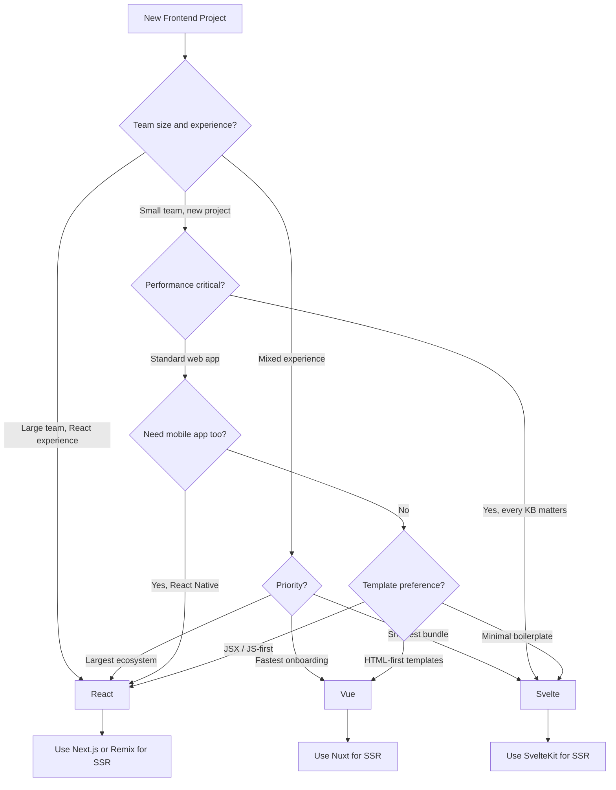

# React vs Vue vs Svelte

The three most discussed frontend frameworks in the JavaScript ecosystem each take a fundamentally different approach to the same problem: how do you build interactive user interfaces efficiently? This page puts them head-to-head across every dimension that matters for production engineering.

## Overview

### React

React is a UI library created by Facebook (now Meta) in 2013. It pioneered the component model and virtual DOM diffing approach that became the dominant paradigm for a decade. React uses JSX — a syntax extension that lets you write HTML-like markup inside JavaScript — and a one-way data flow model. It is the most widely adopted frontend library with the largest ecosystem, job market, and third-party library support. React 19 introduced server components, the `use` hook, and an optimizing compiler that automatically memoizes component output.

### Vue

Vue is a progressive framework created by Evan You in 2014. It takes a template-first approach with single-file components (SFCs) that co-locate template, script, and style in a single `.vue` file. Vue 3 introduced the Composition API (inspired by React Hooks) alongside the original Options API, a proxy-based reactivity system, and significantly improved TypeScript support. Vue positions itself as the approachable alternative — easy to learn, well-documented, and batteries-included with official router and state management.

### Svelte

Svelte is a compiler-based framework created by Rich Harris in 2016. Unlike React and Vue, Svelte shifts work from the browser to the build step — it compiles your components into highly efficient imperative JavaScript that surgically updates the DOM without a virtual DOM or runtime diffing. Svelte 5 introduced runes (`$state`, `$derived`, `$effect`) as a universal reactivity primitive, replacing the previous `$:` reactive declaration syntax.

## Architecture Comparison


### How Each Renders

**React** re-renders the entire component tree (conceptually) when state changes, then diffs the new virtual DOM against the previous one to find minimal DOM mutations. React 19's compiler can automatically skip unnecessary re-renders.

**Vue** uses JavaScript Proxies to track which reactive properties each component reads during rendering. When a property changes, only the components that actually depend on it re-render. This is more surgical than React's top-down approach.

**Svelte** does not have a runtime diffing engine at all. The compiler analyzes your component code at build time, identifies every possible state change, and generates imperative code that directly updates exactly the DOM nodes affected. There is no virtual DOM, no diffing algorithm, no reconciliation.

## Feature Matrix

| Feature | React | Vue | Svelte |
|---|---|---|---|
| **Initial release** | 2013 | 2014 | 2016 |
| **Current version** | 19.x | 3.5.x | 5.x |
| **Language** | JSX (JS/TS) | SFC templates + JS/TS | .svelte + JS/TS |
| **Rendering model** | Virtual DOM | Virtual DOM + Proxy reactivity | Compiled, no VDOM |
| **State management** | useState, useReducer, Zustand, Jotai | ref/reactive, Pinia | $state rune, stores |
| **Component model** | Functions (hooks) | SFCs (Composition or Options API) | .svelte files |
| **Styling** | CSS-in-JS, CSS Modules, Tailwind | Scoped styles in SFC | Scoped styles built-in |
| **TypeScript** | Excellent (native JSX types) | Very good (Volar) | Good (svelte-check) |
| **SSR framework** | Next.js, Remix | Nuxt | SvelteKit |
| **Mobile** | React Native | Capacitor, NativeScript | Capacitor |
| **Bundle size (min+gz)** | ~42 KB (react + react-dom) | ~33 KB (vue) | ~2 KB (runtime) |
| **Learning curve** | Moderate (hooks mental model) | Low-moderate (template intuition) | Low (less boilerplate) |
| **Community size** | Largest | Large | Growing |
| **npm weekly downloads** | ~25M | ~5M | ~1M |
| **GitHub stars** | 230k+ | 210k+ | 80k+ |
| **Server components** | Yes (React 19) | Experimental (Vapor) | No |
| **Built-in transitions** | No (react-transition-group) | Yes | Yes |
| **Two-way binding** | Manual (controlled inputs) | v-model | bind:value |
| **Compiler optimization** | React Compiler (auto-memo) | Template compiler | Full compilation |

## Code Comparison

### Counter Component

::: code-group

```jsx [React]
import { useState } from 'react';

export function Counter() {
  const [count, setCount] = useState(0);

  return (
    <div>
      <p>Count: {count}</p>
      <button onClick={() => setCount(c => c + 1)}>
        Increment
      </button>
    </div>
  );
}
```

```vue [Vue]
<script setup>
import { ref } from 'vue';

const count = ref(0);
</script>

<template>
  <div>
    <p>Count: {​{ count }}</p>
    <button @click="count++">
      Increment
    </button>
  </div>
</template>
```

```svelte [Svelte]
<script>
  let count = $state(0);
</script>

<div>
  <p>Count: {count}</p>
  <button onclick={() => count++}>
    Increment
  </button>
</div>
```

:::

### Data Fetching

::: code-group

```jsx [React]
import { use, Suspense } from 'react';

function UserProfile({ userId }) {
  const user = use(fetchUser(userId));

  return (
    <div>
      <h2>{user.name}</h2>
      <p>{user.email}</p>
    </div>
  );
}

// Usage with Suspense boundary
function App() {
  return (
    <Suspense fallback={<p>Loading...</p>}>
      <UserProfile userId={1} />
    </Suspense>
  );
}

async function fetchUser(id) {
  const res = await fetch(`/api/users/${id}`);
  return res.json();
}
```

```vue [Vue]
<script setup>
const props = defineProps(['userId']);

const { data: user, pending, error } = await useFetch(
  `/api/users/${props.userId}`
);
</script>

<template>
  <div v-if="pending">Loading...</div>
  <div v-else-if="error">Error: {​{ error.message }}</div>
  <div v-else>
    <h2>{​{ user.name }}</h2>
    <p>{​{ user.email }}</p>
  </div>
</template>
```

```svelte [Svelte]
<script>
  let { userId } = $props();

  async function fetchUser(id) {
    const res = await fetch(`/api/users/${id}`);
    return res.json();
  }

  let userPromise = $derived(fetchUser(userId));
</script>

{#await userPromise}
  <p>Loading...</p>
{:then user}
  <div>
    <h2>{user.name}</h2>
    <p>{user.email}</p>
  </div>
{:catch error}
  <p>Error: {error.message}</p>
{/await}
```

:::

### Computed Values and Effects

::: code-group

```jsx [React]
import { useState, useMemo, useEffect } from 'react';

function PriceCalculator({ items }) {
  const [taxRate, setTaxRate] = useState(0.08);

  const subtotal = useMemo(
    () => items.reduce((sum, item) => sum + item.price, 0),
    [items]
  );

  const total = useMemo(
    () => subtotal * (1 + taxRate),
    [subtotal, taxRate]
  );

  useEffect(() => {
    document.title = `Total: $${total.toFixed(2)}`;
  }, [total]);

  return <p>Total: ${total.toFixed(2)}</p>;
}
```

```vue [Vue]
<script setup>
import { ref, computed, watchEffect } from 'vue';

const props = defineProps(['items']);
const taxRate = ref(0.08);

const subtotal = computed(() =>
  props.items.reduce((sum, item) => sum + item.price, 0)
);

const total = computed(() =>
  subtotal.value * (1 + taxRate.value)
);

watchEffect(() => {
  document.title = `Total: $${total.value.toFixed(2)}`;
});
</script>

<template>
  <p>Total: ${​{ total.toFixed(2) }}</p>
</template>
```

```svelte [Svelte]
<script>
  let { items } = $props();
  let taxRate = $state(0.08);

  let subtotal = $derived(
    items.reduce((sum, item) => sum + item.price, 0)
  );

  let total = $derived(subtotal * (1 + taxRate));

  $effect(() => {
    document.title = `Total: $${total.toFixed(2)}`;
  });
</script>

<p>Total: ${total.toFixed(2)}</p>
```

:::

## Performance

### Bundle Size

| Metric | React 19 | Vue 3.5 | Svelte 5 |
|---|---|---|---|
| **Framework runtime (min+gz)** | 42.2 KB | 33.4 KB | 2.1 KB |
| **Hello World app** | 44 KB | 35 KB | 3.2 KB |
| **TodoMVC app** | 48 KB | 38 KB | 5.8 KB |
| **Large app (50 components)** | 62 KB | 52 KB | 28 KB |

::: tip Svelte's tradeoff
Svelte's runtime is tiny, but each component adds generated code. For very large applications (200+ components), the generated code can exceed React/Vue bundle sizes. The crossover point is typically around 150-200 components.
:::

### Runtime Benchmarks (JS Framework Benchmark)

| Operation | React 19 | Vue 3.5 | Svelte 5 |
|---|---|---|---|
| **Create 1,000 rows** | 42ms | 38ms | 35ms |
| **Update every 10th row** | 18ms | 15ms | 12ms |
| **Swap rows** | 19ms | 17ms | 14ms |
| **Remove row** | 15ms | 13ms | 11ms |
| **Create 10,000 rows** | 410ms | 370ms | 340ms |
| **Append 1,000 rows** | 38ms | 35ms | 32ms |
| **Startup time** | 32ms | 28ms | 18ms |
| **Memory (1,000 rows)** | 4.2 MB | 3.8 MB | 3.1 MB |

::: warning Benchmarks are synthetic
These numbers come from the JS Framework Benchmark, which tests raw DOM operations on simple table components. Real-world performance depends on application architecture, component complexity, and how you manage state. A badly architected Svelte app will be slower than a well-architected React app.
:::

### Build Performance

| Metric | React (Vite) | Vue (Vite) | Svelte (Vite) |
|---|---|---|---|
| **Dev server cold start** | ~300ms | ~350ms | ~400ms |
| **HMR update** | ~50ms | ~60ms | ~80ms |
| **Production build (medium)** | ~4s | ~5s | ~6s |

Svelte's compile step adds overhead to build times, but the difference is marginal for most projects.

## Developer Experience

### Learning Curve

| Aspect | React | Vue | Svelte |
|---|---|---|---|
| **Time to "Hello World"** | 5 min | 5 min | 5 min |
| **Time to productive** | 2-4 weeks | 1-2 weeks | 1-2 weeks |
| **Concept count** | High (hooks rules, closures, refs, effects, suspense, server components) | Medium (ref vs reactive, composition API, template syntax) | Low ($state, $derived, $effect, template syntax) |
| **Common pitfalls** | Stale closures, infinite re-render loops, dependency arrays | ref vs reactive confusion, `.value` everywhere | Fewer footguns overall |
| **Documentation quality** | Excellent (react.dev redesign) | Excellent (vuejs.org) | Very good (svelte.dev) |

### Ecosystem

| Category | React | Vue | Svelte |
|---|---|---|---|
| **UI component libraries** | MUI, Ant Design, Chakra, shadcn/ui, Radix | Vuetify, PrimeVue, Naive UI, shadcn-vue | Skeleton, shadcn-svelte, Melt UI |
| **State management** | Zustand, Jotai, Redux, Recoil | Pinia (official) | Built-in stores + runes |
| **Forms** | React Hook Form, Formik | VeeValidate, FormKit | Superforms |
| **Animation** | Framer Motion, React Spring | Vue Transitions (built-in) | Built-in transitions |
| **Testing** | React Testing Library, Enzyme | Vue Test Utils, Testing Library | Svelte Testing Library |
| **DevTools** | React DevTools (Chrome) | Vue DevTools (Chrome) | Svelte DevTools (Chrome) |

### Job Market (2026)

| Metric | React | Vue | Svelte |
|---|---|---|---|
| **Job postings** | ~65% of frontend roles | ~20% of frontend roles | ~5% of frontend roles |
| **Average salary (US)** | $130-170K | $120-160K | $125-165K |
| **Enterprise adoption** | Very high | High (especially in Asia/Europe) | Growing |

## When to Use Which



### Decision Summary

| Scenario | Best Choice | Why |
|---|---|---|
| **Enterprise with React team** | React | Ecosystem, hiring, existing knowledge |
| **New startup, small team** | Vue or Svelte | Faster onboarding, less boilerplate |
| **Content-heavy site** | Svelte (SvelteKit) | Smallest bundles, great SSR |
| **Complex SPA with lots of state** | React or Vue | Mature state management ecosystem |
| **Need React Native mobile** | React | Shared knowledge, component patterns |
| **Prototyping / MVP** | Svelte | Least code to write |
| **International team** | Vue | Strong adoption in Asia/Europe, excellent i18n docs |
| **Performance-critical dashboard** | Svelte | No VDOM overhead, smallest runtime |

## Migration

### React to Vue

1. **Component mapping**: Function components become SFCs, JSX becomes templates
2. **State**: `useState` becomes `ref()`, `useReducer` becomes `reactive()` with methods
3. **Effects**: `useEffect` becomes `watchEffect` or `watch`
4. **Context**: React Context becomes `provide/inject`
5. **Routing**: React Router becomes Vue Router (very similar API)
6. **Tooling**: Switch from Next.js to Nuxt for SSR

```jsx
// React
const [name, setName] = useState('');
useEffect(() => {
  document.title = name;
}, [name]);
```

```vue
<!-- Vue equivalent -->
<script setup>
import { ref, watch } from 'vue';
const name = ref('');
watch(name, (val) => {
  document.title = val;
});
</script>
```

### React/Vue to Svelte

1. **Components**: Remove all framework boilerplate. Svelte components are plain HTML/JS.
2. **State**: Replace `useState`/`ref()` with `let x = $state(value)`
3. **Computed**: Replace `useMemo`/`computed()` with `$derived(expression)`
4. **Effects**: Replace `useEffect`/`watchEffect` with `$effect(() => { ... })`
5. **Props**: Replace `defineProps`/function params with `let { prop } = $props()`
6. **Conditional rendering**: Replace ternaries/`v-if` with `{#if}{/if}`

::: warning Migration cost
Migrating between frameworks is expensive. A 100-component app will take 2-4 months with a dedicated team. Consider whether the migration provides enough benefit to justify the cost. Often, strangling (building new features in the new framework while maintaining the old) is a better strategy than a full rewrite.
:::

## Verdict

**Choose React** if you need the largest ecosystem, the most hiring options, and React Native for mobile. React's dominance means more libraries, more tutorials, more Stack Overflow answers, and more developers who already know it. The React Compiler in v19 eliminates most performance footguns that previously required manual memoization.

**Choose Vue** if you want the best balance of approachability and power. Vue's template syntax feels natural to developers coming from HTML/CSS backgrounds, the Composition API is as powerful as React Hooks without the footguns (no dependency arrays, no stale closures), and Pinia is the cleanest state management solution in the frontend ecosystem. Vue is the best choice for teams with mixed experience levels.

**Choose Svelte** if you want the smallest bundles, the least boilerplate, and the most intuitive reactivity model. Svelte 5's runes make state management feel like plain JavaScript. The tradeoff is a smaller ecosystem and fewer job postings, but the gap is closing. SvelteKit is production-ready and excellent for content-driven sites.

**The honest truth**: all three are excellent for building production applications in 2026. The differences in performance, bundle size, and DX are smaller than the differences in how well you architect your application. Pick the one your team knows best, or the one that makes your team happiest — developer happiness has a larger impact on code quality than any framework benchmark.

## Which Would You Choose?

**Scenario 1:** You are the CTO of a 50-person fintech company. Your team of 15 frontend engineers all know React. You need to ship a new trading dashboard in 3 months.

::: details Recommendation: React
Stay with React. Retraining 15 engineers on a new framework during a 3-month deadline is reckless. Your team's existing expertise, component libraries, and institutional knowledge far outweigh any marginal DX gain from switching. Use Next.js with React Server Components to keep the dashboard fast.
:::

**Scenario 2:** You are a solo founder building an SEO-critical content site (blog + docs + marketing). Bundle size and page speed are your competitive advantage.

::: details Recommendation: Svelte (SvelteKit)
SvelteKit ships the least JavaScript to the browser, which directly impacts Core Web Vitals and SEO rankings. For a content-heavy site where interactivity is minimal, Svelte's compiler-based approach means your pages load noticeably faster on mobile devices and slow networks.
:::

**Scenario 3:** You are leading a new team of 4 junior developers with mixed backgrounds (some know HTML/CSS, one knows Python, one is fresh from a bootcamp). You need a framework everyone can learn quickly.

::: details Recommendation: Vue
Vue's template syntax feels natural to anyone who knows HTML, the Options API provides clear structure for beginners, and the Composition API is available when the team is ready for advanced patterns. Vue's documentation is widely regarded as the most beginner-friendly in the frontend ecosystem.
:::

**Scenario 4:** You are building a cross-platform product — a web app and a mobile app that need to share business logic and UI patterns.

::: details Recommendation: React
React Native gives you a mature path to native mobile apps while sharing component patterns, state management knowledge, and even some business logic with your React web app. Neither Vue nor Svelte has an equivalent mobile story at this maturity level.
:::

::: warning Common Misconceptions
- **"Svelte is too young for production"** — Svelte has been in production at companies like Apple, Spotify, and The New York Times since 2019. SvelteKit reached 1.0 in December 2022 and is battle-tested.
- **"Vue is only popular in China"** — Vue has massive adoption across Europe, Japan, and Latin America. Companies like GitLab, Nintendo, and BMW use Vue in production globally.
- **"React is slow because of the virtual DOM"** — The virtual DOM is not inherently slow. React 19's compiler eliminates most unnecessary re-renders automatically. Poorly written React is slow; well-written React is fast.
- **"You need to pick one and never switch"** — Incremental migration is possible. You can run React and Svelte side by side using micro-frontends, or migrate route by route with a reverse proxy. The choice is not permanent.
- **"Smaller bundle = faster app"** — Bundle size matters for initial load, but runtime performance depends on update efficiency, state management, and application architecture. A 40 KB React app can feel faster than a 5 KB Svelte app if the React app has better code splitting and caching.
:::

::: tip Real Migration Stories
**GitLab: jQuery to Vue** — GitLab migrated their massive Rails + jQuery frontend to Vue incrementally over 2+ years (2016-2018). They chose Vue because its template syntax was approachable for their backend-heavy team, and they could migrate component by component without a big-bang rewrite. Today GitLab is one of the largest Vue applications in production.

**Shopify Hydrogen: React to Remix (still React)** — Shopify originally built Hydrogen (their headless commerce framework) on React with a custom server framework. They migrated to Remix in 2023 because Remix's web-standards approach aligned better with their goals for progressive enhancement and edge deployment. The lesson: sometimes the migration is not between frameworks but between meta-frameworks within the same ecosystem.
:::

::: details Quiz

**1. Which framework uses a compiler to eliminate the need for a virtual DOM?**

Svelte. It compiles components into imperative JavaScript that directly manipulates the DOM, with no runtime diffing or reconciliation.

**2. What problem does Vue's Proxy-based reactivity system solve compared to React's approach?**

Vue's Proxy system automatically tracks which reactive properties each component reads during rendering, so only components that depend on changed data re-render. React re-renders the entire component subtree by default (though React 19's compiler mitigates this).

**3. In what scenario might Svelte produce a LARGER bundle than React?**

For very large applications with 150-200+ components, Svelte's generated per-component code can exceed React's bundle size because React's runtime is shared across all components while Svelte generates unique code for each component.

**4. Which framework introduced the Composition API, and what was it inspired by?**

Vue 3 introduced the Composition API, inspired by React Hooks. It provides a function-based way to organize component logic by concern rather than by option type.

**5. Why might you choose React over Svelte even if Svelte has better benchmarks?**

Ecosystem size (more libraries, more tutorials, more Stack Overflow answers), job market (65% of frontend roles vs 5%), React Native for mobile apps, and existing team expertise. Benchmarks measure synthetic performance; production success depends on ecosystem and team factors.
:::

## One-Liner Summary

React wins on ecosystem and jobs, Vue wins on approachability and balance, Svelte wins on bundle size and DX — but all three build great production apps in 2026.
