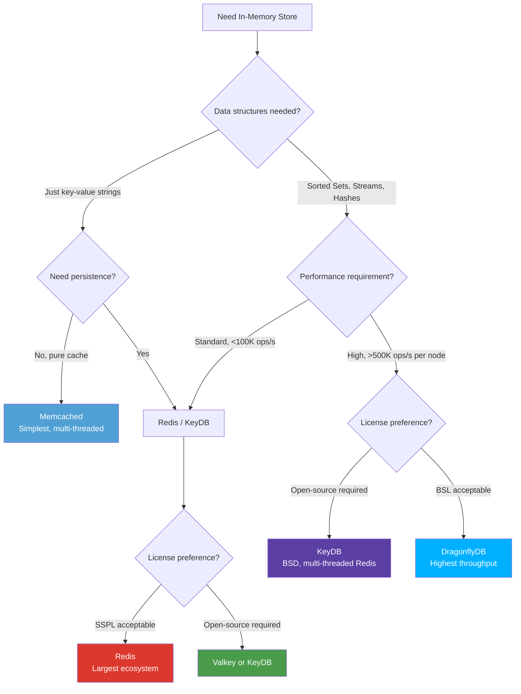

# Redis vs Memcached vs KeyDB vs DragonflyDB

In-memory data stores are the performance escape hatch that every production system eventually needs. Redis became the de facto standard, but its single-threaded architecture and recent licensing changes have opened the door for competitors. This comparison evaluates four options across the dimensions that actually matter: data structures, persistence, scaling, and performance under realistic workloads.

## Overview

| Store | First Release | Language | Threading Model | License |
|---|---|---|---|---|
| **Redis** | 2009 | C | Single-threaded (I/O threads for network) | SSPL (was BSD, changed 2024) |
| **Memcached** | 2003 | C | Multi-threaded | BSD |
| **KeyDB** | 2019 | C++ (Redis fork) | Multi-threaded | BSD-3 |
| **DragonflyDB** | 2022 | C++ | Multi-threaded (shared-nothing) | BSL 1.1 |

::: warning Redis License Change
Redis switched from BSD to the Server Side Public License (SSPL) in March 2024. This means cloud providers cannot offer Redis-as-a-service without a commercial agreement. If open-source licensing matters, consider **Valkey** (Linux Foundation fork of Redis 7.2.4, BSD licensed), **KeyDB**, or **DragonflyDB**.
:::

## Architecture Comparison

```mermaid
graph TB
    subgraph Redis["Redis Architecture"]
        R1[Client Connections] --> R2[Event Loop<br/>Single Thread]
        R2 --> R3[Command Processing<br/>Single Thread]
        R3 --> R4[Memory<br/>Data Structures]
        R3 --> R5[RDB Snapshots<br/>fork + write]
        R3 --> R6[AOF Log<br/>Append-Only]
        R2 --> R7[I/O Threads<br/>Read/Write only]
    end

    subgraph Memcached["Memcached Architecture"]
        M1[Client Connections] --> M2[libevent<br/>Event Loop]
        M2 --> M3[Worker Thread 1]
        M2 --> M4[Worker Thread 2]
        M2 --> M5[Worker Thread N]
        M3 --> M6[Slab Allocator<br/>Memory]
        M4 --> M6
        M5 --> M6
    end

    subgraph KeyDB["KeyDB Architecture"]
        K1[Client Connections] --> K2[Worker Thread 1<br/>Event Loop + Commands]
        K1 --> K3[Worker Thread 2<br/>Event Loop + Commands]
        K1 --> K4[Worker Thread N<br/>Event Loop + Commands]
        K2 --> K5[Shared Memory<br/>Lock-free Data Structures]
        K3 --> K5
        K4 --> K5
    end

    subgraph Dragonfly["DragonflyDB Architecture"]
        D1[Client Connections] --> D2[Fiber 1<br/>Shared-Nothing]
        D1 --> D3[Fiber 2<br/>Shared-Nothing]
        D1 --> D4[Fiber N<br/>Shared-Nothing]
        D2 --> D5[Shard 1<br/>Own Memory]
        D3 --> D6[Shard 2<br/>Own Memory]
        D4 --> D7[Shard N<br/>Own Memory]
    end

    style Redis fill:#dc382d,color:#fff
    style Memcached fill:#51a0d5,color:#fff
    style KeyDB fill:#5c3fa3,color:#fff
    style Dragonfly fill:#00b0ff,color:#fff
```



## Feature Matrix

| Feature | Redis | Memcached | KeyDB | DragonflyDB |
|---|---|---|---|---|
| **Data structures** | Strings, Lists, Sets, Sorted Sets, Hashes, Streams, HyperLogLog, Bitmaps, Geospatial | Strings only | Same as Redis | Same as Redis (compatible) |
| **Persistence** | RDB snapshots + AOF | None | RDB + AOF (fork-free snapshots) | RDB snapshots (fork-free) |
| **Replication** | Master-replica | None | Multi-master (Active Replica) | Master-replica |
| **Clustering** | Redis Cluster (hash slots) | Client-side sharding | Redis Cluster compatible | Single-instance (scales vertically) |
| **Pub/Sub** | Yes | No | Yes | Yes |
| **Lua scripting** | Yes (Lua 5.1) | No | Yes | Yes |
| **Transactions** | MULTI/EXEC | No (CAS only) | MULTI/EXEC | MULTI/EXEC |
| **TTL granularity** | Millisecond | Second | Millisecond | Millisecond |
| **Eviction policies** | 8 policies (LRU, LFU, etc.) | LRU only | 8 policies (same as Redis) | 8 policies (same as Redis) |
| **TLS** | Yes | Yes (since 1.5.13) | Yes | Yes |
| **ACL** | Yes (Redis 6+) | SASL auth only | Yes | Yes |
| **Modules** | RedisJSON, RediSearch, RedisGraph, etc. | None | Redis modules (partial) | Built-in JSON, Search |
| **Sentinel (HA)** | Redis Sentinel | Not applicable | Not needed (multi-master) | Not yet |
| **Memory efficiency** | jemalloc, 1x baseline | Slab allocator, ~0.9x | jemalloc, ~1x | Dashtable, ~0.3-0.5x |
| **Max memory** | Limited by single-thread throughput | Limited by OS | Limited by CPU cores | Up to 1 TB per instance |
| **Protocol** | RESP2 / RESP3 | Memcached text/binary | RESP2 / RESP3 | RESP2 / RESP3 |

## Code & Config Comparison

### Client Usage

All four support the Redis protocol (except Memcached), so client code is often identical for Redis, KeyDB, and DragonflyDB.

**Redis / KeyDB / DragonflyDB** (identical client code):

```typescript
import Redis from 'ioredis';

// Connection — same for Redis, KeyDB, and Dragonfly
const redis = new Redis({
  host: '127.0.0.1',
  port: 6379,
  password: 'secret',
  db: 0,
  retryStrategy: (times) => Math.min(times * 50, 2000),
});

// Strings
await redis.set('user:1:name', 'Alice', 'EX', 3600);
const name = await redis.get('user:1:name');

// Hashes
await redis.hset('user:1', { name: 'Alice', email: 'alice@example.com', age: '30' });
const user = await redis.hgetall('user:1');

// Sorted Sets (leaderboard)
await redis.zadd('leaderboard', 100, 'alice', 95, 'bob', 87, 'charlie');
const topPlayers = await redis.zrevrange('leaderboard', 0, 9, 'WITHSCORES');

// Lists (job queue)
await redis.lpush('jobs:pending', JSON.stringify({ type: 'email', to: 'alice@example.com' }));
const job = await redis.brpop('jobs:pending', 30); // blocking pop with timeout

// Streams (event log)
await redis.xadd('events', '*', 'type', 'page_view', 'url', '/home', 'user', 'alice');
const events = await redis.xrange('events', '-', '+', 'COUNT', 100);

// Pub/Sub
const sub = redis.duplicate();
await sub.subscribe('notifications');
sub.on('message', (channel, message) => {
  console.log(`Received on ${channel}: ${message}`);
});
await redis.publish('notifications', 'New order received');

// Pipeline (batch commands)
const pipeline = redis.pipeline();
pipeline.incr('page_views');
pipeline.incr('api_calls');
pipeline.expire('page_views', 86400);
await pipeline.exec();
```

**Memcached:**

```typescript
import Memcached from 'memcached';

const memcached = new Memcached('127.0.0.1:11211');

// Only strings — no data structures
memcached.set('user:1:name', 'Alice', 3600, (err) => {
  if (err) console.error(err);
});

memcached.get('user:1:name', (err, data) => {
  console.log(data); // 'Alice'
});

// CAS (Compare-And-Swap) for atomic updates
memcached.gets('counter', (err, data) => {
  const cas = data.cas;
  memcached.cas('counter', parseInt(data['counter']) + 1, cas, 3600, (err) => {
    // Succeeds only if no one else modified the value
  });
});

// No pub/sub, no lists, no sorted sets, no streams
// For complex data: JSON.stringify/parse everything
memcached.set('user:1', JSON.stringify({
  name: 'Alice',
  email: 'alice@example.com',
}), 3600, (err) => {});
```

### Server Configuration

**Redis** (`redis.conf`):

```conf
# Memory
maxmemory 4gb
maxmemory-policy allkeys-lfu

# Persistence
save 900 1
save 300 10
save 60 10000
appendonly yes
appendfsync everysec

# Networking
bind 0.0.0.0
protected-mode yes
requirepass your-secret-password
tcp-backlog 511

# Threading (Redis 6+)
io-threads 4
io-threads-do-reads yes

# Replication
replicaof 10.0.0.1 6379
```

**KeyDB** (`keydb.conf`):

```conf
# Same as redis.conf, plus:

# Multi-threading (the key differentiator)
server-threads 4
server-thread-affinity true

# Active replication (multi-master)
active-replica yes
replicaof 10.0.0.2 6379

# Flash storage tier (extend memory to SSD)
storage-provider flash /var/lib/keydb/flash
maxmemory 4gb
# Data beyond 4GB spills to SSD automatically
```

**DragonflyDB** (flags):

```bash
# DragonflyDB uses command-line flags
dragonfly \
  --port 6379 \
  --maxmemory 4gb \
  --dbfilename dump.rdb \
  --dir /var/lib/dragonfly \
  --requirepass your-secret-password \
  --cache_mode true \
  --keys_output_limit 8192 \
  --hz 100 \
  --snapshot_cron "*/30 * * * *"
  # Threads are auto-detected (1 per CPU core)
```

### Docker Compose Comparison

```yaml
version: '3.8'
services:
  # Redis with persistence
  redis:
    image: redis:7-alpine
    command: redis-server --requirepass secret --maxmemory 2gb --maxmemory-policy allkeys-lfu --appendonly yes
    ports:
      - "6379:6379"
    volumes:
      - redis-data:/data

  # KeyDB with multi-threading
  keydb:
    image: eqalpha/keydb:latest
    command: keydb-server --requirepass secret --server-threads 4 --maxmemory 2gb
    ports:
      - "6380:6379"
    volumes:
      - keydb-data:/data

  # DragonflyDB (auto-threads)
  dragonfly:
    image: docker.dragonflydb.io/dragonflydb/dragonfly
    command: dragonfly --requirepass secret --maxmemory 2gb --cache_mode
    ports:
      - "6381:6379"
    volumes:
      - dragonfly-data:/data

  # Memcached
  memcached:
    image: memcached:1.6-alpine
    command: memcached -m 2048 -t 4
    ports:
      - "11211:11211"

volumes:
  redis-data:
  keydb-data:
  dragonfly-data:
```

## Performance

### Throughput Benchmarks (Single Instance)

| Operation | Redis (1 thread) | Memcached (4 threads) | KeyDB (4 threads) | DragonflyDB (auto) |
|---|---|---|---|---|
| **SET (pipeline)** | ~500K ops/s | ~1M ops/s | ~1.5M ops/s | ~4M ops/s |
| **GET (pipeline)** | ~600K ops/s | ~1.2M ops/s | ~2M ops/s | ~4M ops/s |
| **SET (no pipeline)** | ~100K ops/s | ~200K ops/s | ~300K ops/s | ~800K ops/s |
| **GET (no pipeline)** | ~120K ops/s | ~250K ops/s | ~350K ops/s | ~900K ops/s |
| **ZADD** | ~80K ops/s | N/A | ~200K ops/s | ~600K ops/s |
| **LPUSH/LPOP** | ~100K ops/s | N/A | ~250K ops/s | ~700K ops/s |
| **HSET** | ~90K ops/s | N/A | ~220K ops/s | ~650K ops/s |

::: tip Benchmark Context
These numbers are from `memtier_benchmark` with default settings on an 8-core machine. Real-world performance depends on key sizes, value sizes, network latency, and access patterns. DragonflyDB's numbers are impressive but come from a shared-nothing architecture that trades some consistency guarantees for throughput.
:::

### Memory Efficiency

| Metric | Redis | Memcached | KeyDB | DragonflyDB |
|---|---|---|---|---|
| **Overhead per key** | ~60 bytes | ~48 bytes + slab overhead | ~60 bytes | ~20-30 bytes |
| **1M keys (64B values)** | ~130 MB | ~120 MB | ~130 MB | ~50-70 MB |
| **10M keys (64B values)** | ~1.3 GB | ~1.2 GB | ~1.3 GB | ~500-700 MB |
| **Memory allocator** | jemalloc | Slab allocator | jemalloc | Custom (Dashtable) |
| **Memory fragmentation** | Moderate | Low (slabs) | Moderate | Low (compact) |
| **Snapshot memory** | 2x (fork + COW) | N/A | 1x (fork-free) | 1x (fork-free) |

::: warning Redis Fork Overhead
Redis creates RDB snapshots by forking the process, which can temporarily double memory usage due to copy-on-write page duplication under write-heavy workloads. DragonflyDB and KeyDB use fork-free snapshot algorithms that avoid this problem. For large datasets (>32 GB), this is a significant operational advantage.
:::

### Latency Profiles

| Percentile | Redis | Memcached | KeyDB | DragonflyDB |
|---|---|---|---|---|
| **p50** | 0.1ms | 0.1ms | 0.1ms | 0.1ms |
| **p99** | 0.5ms | 0.3ms | 0.4ms | 0.3ms |
| **p99.9** | 2ms | 0.8ms | 1ms | 0.8ms |
| **p99.9 during snapshot** | 50-200ms | N/A | 1ms | 0.8ms |

## Developer Experience

### Strengths

**Redis:**
- The richest data structure library (Sorted Sets, Streams, HyperLogLog, etc.)
- Massive ecosystem: every language has a mature client library
- Redis Modules (RediSearch, RedisJSON, RedisTimeSeries) extend functionality
- Redis Cluster for horizontal scaling beyond single-node limits
- 15+ years of production battle-testing

**Memcached:**
- Simplest possible API: `get`, `set`, `delete`, `incr`, `decr`
- True multi-threaded from day one — no single-thread bottleneck
- Predictable memory usage via slab allocator
- Nearly impossible to misconfigure
- Perfect for simple key-value caching with no persistence needed

**KeyDB:**
- Drop-in Redis replacement (wire-compatible, same config)
- Multi-threaded command processing (not just I/O threads)
- Active Replica: multi-master replication for read scaling
- FLASH storage tier: extend cache beyond RAM to SSD
- BSD licensed (no SSPL concerns)

**DragonflyDB:**
- 10-25x throughput vs Redis on the same hardware
- 50-70% less memory per key (Dashtable data structure)
- Fork-free snapshots: no memory spikes during persistence
- Single instance can replace a Redis Cluster for most workloads
- Redis-compatible protocol (works with existing Redis clients)

### Pain Points

| Store | Key Limitation |
|---|---|
| **Redis** | Single-threaded bottleneck on CPU-bound workloads; SSPL license; snapshot memory doubling |
| **Memcached** | No data structures beyond strings; no persistence; no pub/sub; no scripting |
| **KeyDB** | Smaller community; lags behind Redis feature releases; some module incompatibilities |
| **DragonflyDB** | BSL license; no clustering yet; younger project (less battle-tested); some Redis command gaps |

## When to Use Which



### Decision Summary

| Scenario | Recommended Store |
|---|---|
| Simple caching, no persistence | **Memcached** |
| General-purpose cache + data structures | **Redis** |
| Need open-source Redis alternative | **Valkey** or **KeyDB** |
| High throughput, single node | **DragonflyDB** |
| Multi-master replication | **KeyDB** (Active Replica) |
| Session storage | **Redis** or **KeyDB** |
| Job/message queue | **Redis** (Streams/Lists) or **DragonflyDB** |
| Leaderboards / ranking | **Redis** (Sorted Sets) |
| Rate limiting | **Redis** or **DragonflyDB** |
| Feature flags / config store | **Redis** + persistence |
| Very large dataset (>100 GB) | **KeyDB** (FLASH tier) or **DragonflyDB** |
| Horizontal scaling to many nodes | **Redis Cluster** or **Valkey Cluster** |

## Migration

### Redis to DragonflyDB

```bash
# DragonflyDB is wire-compatible with Redis
# Migration is straightforward:

# 1. Start DragonflyDB
docker run -d --name dragonfly \
  -p 6380:6379 \
  docker.dragonflydb.io/dragonflydb/dragonfly \
  --requirepass secret

# 2. Migrate data using redis-cli
# Option A: RDB file
redis-cli -h redis-host -a secret --rdb /tmp/dump.rdb
# Copy dump.rdb to DragonflyDB data directory and restart

# Option B: Live migration with REPLICAOF
# DragonflyDB can act as a replica of Redis
dragonfly --replicaof redis-host:6379

# 3. Update application connection string
# Change host from redis-host to dragonfly-host
# No code changes needed — same Redis protocol

# 4. Verify compatibility
redis-cli -h dragonfly-host -p 6379 -a secret
> SET test "hello"
> GET test
> ZADD myset 1 "a" 2 "b"
> ZRANGE myset 0 -1 WITHSCORES

# 5. Monitor for unsupported commands
# DragonflyDB logs warnings for unsupported commands
# Check: MODULE commands, some CLUSTER commands, DEBUG commands
```

### Memcached to Redis

```bash
# Memcached to Redis requires code changes
# because the protocols are different

# 1. Install Redis
docker run -d --name redis -p 6379:6379 redis:7

# 2. Update client library
# Before: memcached client
npm uninstall memcached
npm install ioredis

# 3. Update connection code
# Before:
#   const memcached = new Memcached('127.0.0.1:11211');
#   memcached.set('key', 'value', 3600, callback);
#
# After:
#   const redis = new Redis({ host: '127.0.0.1', port: 6379 });
#   await redis.set('key', 'value', 'EX', 3600);

# 4. Warm the cache
# Option A: Let the cache warm naturally (accept cache misses)
# Option B: Pre-populate from your database
# There's no automatic Memcached → Redis migration tool
```

### Redis to Valkey (Post-License-Change)

```bash
# Valkey is a drop-in fork of Redis 7.2.4 (BSD licensed)

# 1. Install Valkey
docker run -d --name valkey -p 6379:6379 valkey/valkey:7.2

# 2. Copy RDB file from Redis
redis-cli -h redis-host BGSAVE
cp /var/lib/redis/dump.rdb /var/lib/valkey/dump.rdb

# 3. Start Valkey with the RDB file
# Valkey reads Redis RDB format natively

# 4. Update client connection
# No code changes — same RESP protocol
# Just change the hostname

# 5. Verify
valkey-cli ping  # PONG
valkey-cli info server  # Shows Valkey version
```

::: tip Migration Complexity
Redis to DragonflyDB/KeyDB/Valkey: trivial (same protocol, same RDB format, same client libraries).
Memcached to Redis: moderate (different protocol, different client library, but simple API surface).
Always run both systems in parallel during migration and compare response correctness.
:::

## Verdict

**Redis** remains the king of in-memory data stores. Its data structure library, module ecosystem, cluster support, and 15 years of battle-testing make it the safe default. The SSPL license change is the only significant concern — if it matters to you, Valkey is the community-maintained BSD fork.

**Memcached** is the right choice when you need the simplest possible cache. If your workload is purely key-value with no data structures, no persistence, and no pub/sub, Memcached's multi-threaded simplicity is an advantage, not a limitation.

**KeyDB** is the best Redis alternative for teams that need multi-threading, active replication, or SSD-backed caching while staying on a BSD license. Its wire compatibility with Redis makes migration trivial.

**DragonflyDB** is the performance breakthrough. On a single instance, it delivers 10-25x the throughput of Redis with 50-70% less memory. If your workload can be served by a single node (most can), DragonflyDB eliminates the need for Redis Cluster entirely.

::: tip Bottom Line
Start with **Redis** (or **Valkey** if license matters) for most use cases — the ecosystem is unmatched. Reach for **DragonflyDB** when you need maximum throughput per dollar. Use **Memcached** when you want dead-simple key-value caching. Consider **KeyDB** when you need multi-master replication or SSD-tiered storage with Redis compatibility.
:::
