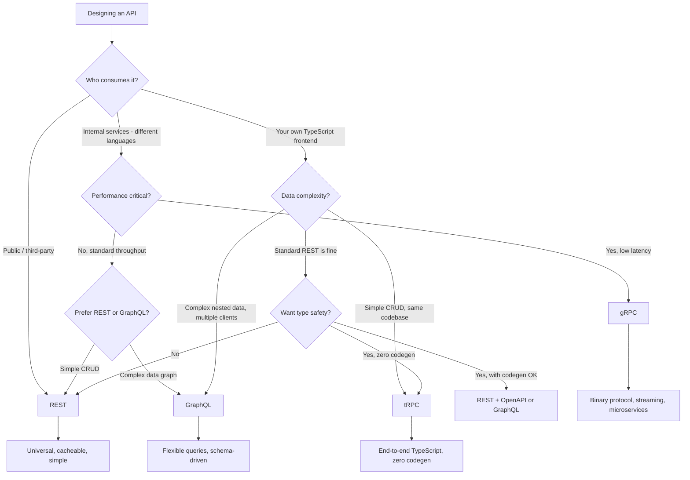

# REST vs GraphQL vs gRPC vs tRPC

API design is the contract between your services and your clients. The paradigm you choose affects how you model data, handle errors, manage versioning, and evolve your system. This page compares the four most relevant API paradigms across every dimension that matters.

## Overview

### REST

REST (Representational State Transfer) is an architectural style defined by Roy Fielding in 2000. It uses HTTP methods (GET, POST, PUT, PATCH, DELETE) to operate on resources identified by URLs. REST is not a specification — it is a set of constraints (stateless, cacheable, uniform interface) that most implementations follow loosely. REST is the dominant API style for public APIs, web services, and microservice communication. OpenAPI (Swagger) provides standardization for REST API documentation and code generation.

### GraphQL

GraphQL is a query language and runtime created by Facebook in 2015. Instead of multiple endpoints returning fixed data shapes (like REST), GraphQL exposes a single endpoint. The client sends a query specifying exactly the fields it needs, and the server returns precisely that data — no more, no less. GraphQL uses a strongly typed schema (SDL) that serves as the API contract. It solves REST's overfetching and underfetching problems but introduces complexity in caching, authorization, and query performance.

### gRPC

gRPC (Google Remote Procedure Call) is a high-performance RPC framework created by Google in 2015. It uses Protocol Buffers (protobuf) for serialization — a binary format that is smaller and faster than JSON — and HTTP/2 for transport, enabling multiplexing, streaming, and header compression. gRPC is the dominant choice for service-to-service communication in microservices architectures, particularly where latency and throughput matter.

### tRPC

tRPC is a TypeScript-first RPC framework created by Alex Johansson in 2021. It provides end-to-end type safety between your TypeScript backend and frontend without code generation, schema files, or API specifications. You define procedures on the server, and the client gets full autocompletion and type checking through TypeScript inference. tRPC is designed for fullstack TypeScript applications where both client and server share a codebase or monorepo.

## Architecture Comparison

```mermaid
graph TB
    subgraph REST["REST — Resource-Oriented"]
        R1[Client] -->|GET /users/1| R2[Server]
        R1 -->|GET /users/1/posts| R2
        R1 -->|POST /users| R2
        R2 -->|JSON Response| R1
    end

    subgraph GraphQL["GraphQL — Query Language"]
        G1[Client] -->|POST /graphql| G2[Server]
        G2 --> G3[Parse Query]
        G3 --> G4[Validate Against Schema]
        G4 --> G5[Execute Resolvers]
        G5 -->|JSON - exact shape requested| G1
    end

    subgraph gRPC["gRPC — Binary RPC"]
        GR1[Client Stub] -->|HTTP/2 + Protobuf| GR2[Server]
        GR2 --> GR3[Deserialize Protobuf]
        GR3 --> GR4[Execute Service Method]
        GR4 -->|Protobuf Response| GR1
    end

    subgraph tRPC["tRPC — TypeScript RPC"]
        T1[Client - typed proxy] -->|HTTP/JSON or WebSocket| T2[Server - procedure router]
        T2 --> T3[Zod Validation]
        T3 --> T4[Procedure Handler]
        T4 -->|JSON - typed response| T1
    end
```



### Key Architectural Differences

**REST** is resource-oriented: you design your API around nouns (users, posts, comments) and use HTTP methods as verbs. Each resource has its own URL, and the server determines the response shape. This is simple and cacheable but leads to overfetching (getting fields you do not need) and underfetching (needing multiple requests for related data).

**GraphQL** is query-oriented: the client specifies exactly what data it wants in a declarative query. The server resolves the query by calling resolver functions for each field. This eliminates overfetching/underfetching but shifts complexity to the server (N+1 queries, query cost analysis, authorization per field).

**gRPC** is procedure-oriented: you define service methods and message types in `.proto` files, and the framework generates strongly typed client/server stubs. Communication uses binary protobuf over HTTP/2, making it significantly faster than JSON-over-HTTP. gRPC natively supports four communication patterns: unary, server streaming, client streaming, and bidirectional streaming.

**tRPC** is also procedure-oriented but operates entirely within the TypeScript type system. There are no schema files, no code generation, and no runtime overhead beyond standard HTTP. Type safety flows from server to client through TypeScript inference — change a server procedure's return type, and the client gets a type error immediately.

## Feature Matrix

| Feature | REST | GraphQL | gRPC | tRPC |
|---|---|---|---|---|
| **Data format** | JSON (usually) | JSON | Protobuf (binary) | JSON |
| **Transport** | HTTP/1.1 or HTTP/2 | HTTP (typically POST) | HTTP/2 | HTTP or WebSocket |
| **Schema/Contract** | OpenAPI (optional) | SDL (required) | .proto (required) | TypeScript types (inferred) |
| **Type safety** | OpenAPI codegen (opt-in) | Schema-based (strong) | Protobuf (very strong) | TypeScript (end-to-end) |
| **Code generation** | Optional (openapi-generator) | Optional (graphql-codegen) | Required (protoc) | None needed |
| **Overfetching** | Common problem | Solved (client specifies fields) | Solved (typed messages) | Solved (typed procedures) |
| **Underfetching** | Common (multiple requests) | Solved (nested queries) | Solved (designed messages) | Solved (compose procedures) |
| **Caching** | HTTP caching (excellent) | Complex (single endpoint) | No HTTP caching | No HTTP caching |
| **Real-time** | SSE, WebSocket | Subscriptions | Bidirectional streaming | WebSocket subscriptions |
| **File upload** | Native (multipart) | Complex (multipart spec) | Streaming | multipart/form-data |
| **Streaming** | SSE | @stream/@defer | Native (4 patterns) | WebSocket |
| **Browser support** | Native (fetch) | fetch + client library | grpc-web (limited) | fetch + client |
| **Mobile support** | Excellent | Good (Apollo, Relay) | Excellent (native clients) | N/A (TypeScript only) |
| **Versioning** | URL (/v1/, /v2/) or headers | Schema evolution (deprecation) | Package versioning | TypeScript (breaking changes = type errors) |
| **Error handling** | HTTP status codes | errors array in response | Status codes + details | TypeScript error types |
| **Pagination** | Various (offset, cursor) | Relay cursor spec | Application-defined | Application-defined |
| **Rate limiting** | Standard (HTTP headers) | Query cost analysis | Application-level | Application-level |
| **Tooling maturity** | Very high | High | High | Medium |
| **Language support** | All | All | All (10+ languages) | TypeScript only |

## Code Comparison

### Define an API (Server)

::: code-group

```ts [REST (Express)]
import express from 'express';

const app = express();
app.use(express.json());

// GET /users/:id
app.get('/users/:id', async (req, res) => {
  const user = await db.users.findUnique({
    where: { id: req.params.id },
  });
  if (!user) return res.status(404).json({ error: 'Not found' });
  res.json(user);
});

// GET /users/:id/posts
app.get('/users/:id/posts', async (req, res) => {
  const posts = await db.posts.findMany({
    where: { authorId: req.params.id },
    take: Number(req.query.limit) || 10,
  });
  res.json(posts);
});

// POST /users
app.post('/users', async (req, res) => {
  // Manual validation required
  const { name, email } = req.body;
  const user = await db.users.create({ data: { name, email } });
  res.status(201).json(user);
});
```

```ts [GraphQL (Apollo)]
import { ApolloServer } from '@apollo/server';

const typeDefs = `#graphql
  type User {
    id: ID!
    name: String!
    email: String!
    posts(limit: Int = 10): [Post!]!
  }

  type Post {
    id: ID!
    title: String!
    content: String
    author: User!
  }

  type Query {
    user(id: ID!): User
  }

  type Mutation {
    createUser(name: String!, email: String!): User!
  }
`;

const resolvers = {
  Query: {
    user: (_, { id }) => db.users.findUnique({ where: { id } }),
  },
  User: {
    posts: (parent, { limit }) =>
      db.posts.findMany({
        where: { authorId: parent.id },
        take: limit,
      }),
  },
  Mutation: {
    createUser: (_, { name, email }) =>
      db.users.create({ data: { name, email } }),
  },
};

const server = new ApolloServer({ typeDefs, resolvers });
```

```protobuf [gRPC (Proto)]
// user.proto
syntax = "proto3";
package user;

service UserService {
  rpc GetUser (GetUserRequest) returns (User);
  rpc GetUserPosts (GetUserPostsRequest) returns (PostList);
  rpc CreateUser (CreateUserRequest) returns (User);
}

message GetUserRequest {
  string id = 1;
}

message GetUserPostsRequest {
  string user_id = 1;
  int32 limit = 2;
}

message CreateUserRequest {
  string name = 1;
  string email = 2;
}

message User {
  string id = 1;
  string name = 2;
  string email = 3;
}

message Post {
  string id = 1;
  string title = 2;
  string content = 3;
  string author_id = 4;
}

message PostList {
  repeated Post posts = 1;
}
```

```ts [tRPC]
import { initTRPC, TRPCError } from '@trpc/server';
import { z } from 'zod';

const t = initTRPC.create();

export const appRouter = t.router({
  user: t.router({
    getById: t.procedure
      .input(z.object({ id: z.string() }))
      .query(async ({ input }) => {
        const user = await db.users.findUnique({
          where: { id: input.id },
        });
        if (!user) throw new TRPCError({ code: 'NOT_FOUND' });
        return user;
      }),

    getPosts: t.procedure
      .input(z.object({
        userId: z.string(),
        limit: z.number().default(10),
      }))
      .query(async ({ input }) => {
        return db.posts.findMany({
          where: { authorId: input.userId },
          take: input.limit,
        });
      }),

    create: t.procedure
      .input(z.object({
        name: z.string().min(1),
        email: z.string().email(),
      }))
      .mutation(async ({ input }) => {
        return db.users.create({ data: input });
      }),
  }),
});

export type AppRouter = typeof appRouter;
```

:::

### Consume the API (Client)

::: code-group

```ts [REST]
// No type safety without code generation
const res = await fetch('/api/users/1');
const user = await res.json(); // user is `any`

const postsRes = await fetch('/api/users/1/posts?limit=5');
const posts = await postsRes.json(); // posts is `any`

// Two separate requests for user + posts
// Client cannot control which fields are returned
```

```ts [GraphQL]
// With graphql-codegen for type safety
const { data } = await client.query({
  query: gql`
    query GetUser($id: ID!) {
      user(id: $id) {
        name
        email
        posts(limit: 5) {
          title
          content
        }
      }
    }
  `,
  variables: { id: '1' },
});

// Single request, exact fields requested
// data.user.name, data.user.posts[0].title — typed with codegen
```

```ts [gRPC]
// Generated client stub — fully typed
const client = new UserServiceClient('localhost:50051', credentials);

const user = await client.getUser({ id: '1' });
console.log(user.name); // Typed from .proto

const posts = await client.getUserPosts({ userId: '1', limit: 5 });
console.log(posts.posts[0].title); // Typed from .proto
```

```ts [tRPC]
// Zero-codegen type safety — just import the type
import type { AppRouter } from '../server/router';
import { createTRPCClient } from '@trpc/client';

const client = createTRPCClient<AppRouter>({ /* config */ });

// Full autocompletion and type checking
const user = await client.user.getById.query({ id: '1' });
console.log(user.name); // Typed — change server, get type error here

const posts = await client.user.getPosts.query({ userId: '1', limit: 5 });
console.log(posts[0].title); // Typed
```

:::

::: tip tRPC's type safety advantage
With tRPC, you change a return type on the server and the client gets a TypeScript error immediately — no code generation step, no schema sync, no runtime validation. This tight coupling is a feature when both sides are in the same codebase. It is a limitation when they are not (which is why tRPC is for fullstack TypeScript only).
:::

## Performance

### Serialization and Transfer Size

| Metric | REST (JSON) | GraphQL (JSON) | gRPC (Protobuf) | tRPC (JSON) |
|---|---|---|---|---|
| **Serialization speed** | Medium (JSON.stringify) | Medium (JSON.stringify) | Fast (binary encode) | Medium (JSON.stringify) |
| **Deserialization speed** | Medium (JSON.parse) | Medium (JSON.parse) | Fast (binary decode) | Medium (JSON.parse) |
| **Payload size (user object)** | 256 bytes | 180 bytes (queried fields) | 95 bytes (binary) | 256 bytes |
| **Payload size (1000 items)** | 250 KB | 150 KB (queried fields) | 80 KB (binary) | 250 KB |

### Throughput Benchmarks

| Scenario | REST | GraphQL | gRPC | tRPC |
|---|---|---|---|---|
| **Simple query (req/s)** | 45,000 | 30,000 | 85,000 | 40,000 |
| **Complex query (req/s)** | 20,000 | 8,000 | 60,000 | 18,000 |
| **Streaming (msg/s)** | N/A (SSE: 10,000) | 5,000 (subscriptions) | 50,000 | 15,000 (WS) |
| **Latency (p50)** | 1.2ms | 3.5ms | 0.5ms | 1.5ms |
| **Latency (p99)** | 5ms | 15ms | 2ms | 6ms |

::: warning GraphQL's performance cost
GraphQL is slower than REST for simple queries because of query parsing, validation, and resolver execution overhead. GraphQL shines when it reduces the number of network round-trips (fetching user + posts + comments in one query vs. three REST calls). The performance tradeoff is worth it for complex, deeply nested data requirements, not for simple CRUD.
:::

### Caching Comparison

| Caching Strategy | REST | GraphQL | gRPC | tRPC |
|---|---|---|---|---|
| **HTTP caching (CDN, browser)** | Excellent (GET + Cache-Control) | Poor (single POST endpoint) | Not applicable | Poor (POST-based) |
| **Server-side caching** | Standard (Redis, etc.) | DataLoader pattern | Standard | Standard |
| **Client-side caching** | Manual (SWR, React Query) | Normalized cache (Apollo, Relay) | Manual | React Query integration |
| **Persisted queries** | N/A | Yes (reduces bandwidth) | N/A | N/A |

## Developer Experience

### Learning Curve

| Aspect | REST | GraphQL | gRPC | tRPC |
|---|---|---|---|---|
| **Time to first API** | 10 min | 30 min (schema + resolvers) | 45 min (proto + codegen) | 15 min |
| **Concept count** | Low (HTTP methods, URLs) | Medium (schema, resolvers, queries) | Medium (proto, services, streams) | Low (procedures, Zod) |
| **Documentation** | Abundant (decades) | Good (graphql.org) | Good (grpc.io) | Good (trpc.io) |
| **Debugging** | curl, Postman (easy) | GraphQL Playground, Apollo Studio | grpcurl, Evans | tRPC panel |
| **Error debugging** | Clear (HTTP status + body) | Confusing (200 with errors) | Status codes + metadata | Clear (typed errors) |

### Tooling

| Category | REST | GraphQL | gRPC | tRPC |
|---|---|---|---|---|
| **API documentation** | OpenAPI/Swagger UI | GraphQL Playground | Proto documentation | TypeScript types |
| **Client generation** | openapi-generator | graphql-codegen | protoc / buf | None needed |
| **Validation** | Manual or OpenAPI | Schema-enforced | Proto-enforced | Zod (runtime) |
| **Testing** | Postman, Insomnia | Playground, Apollo Studio | grpcurl, Postman | tRPC panel |
| **Monitoring** | Standard APM | Apollo Studio | gRPC dashboards | Standard APM |
| **Mock server** | Prism (OpenAPI) | Apollo MockedProvider | grpc-mock | MSW |

### Team Scalability

| Aspect | REST | GraphQL | gRPC | tRPC |
|---|---|---|---|---|
| **Multi-team (diff languages)** | Excellent (universal) | Good (schema as contract) | Excellent (proto as contract) | Poor (TypeScript only) |
| **Frontend-backend collaboration** | Moderate (API design meetings) | Good (schema-driven) | Good (proto-driven) | Excellent (shared types) |
| **Breaking change detection** | Manual (OpenAPI diff) | Schema diff tools | Buf breaking change detection | TypeScript compiler |
| **API versioning** | URL or header versioning | Schema evolution | Package versioning | Type changes |

## When to Use Which



### Decision Summary

| Scenario | Best Choice | Why |
|---|---|---|
| **Public API** | REST | Universal, cacheable, well-understood |
| **Fullstack TypeScript app** | tRPC | End-to-end types, zero overhead |
| **Mobile app with complex data** | GraphQL | Client controls data shape, reduces requests |
| **Microservice-to-microservice** | gRPC | Binary protocol, streaming, multi-language |
| **Content-heavy site (CMS)** | GraphQL or REST | Flexible content queries |
| **Real-time data** | gRPC (streaming) or GraphQL (subscriptions) | Native streaming support |
| **Simple CRUD API** | REST or tRPC | Do not over-engineer |
| **Multi-language microservices** | gRPC | Proto as universal contract |
| **High-throughput data pipeline** | gRPC | Binary serialization, HTTP/2 multiplexing |
| **Third-party integrations** | REST | OpenAPI is the industry standard |

## Migration

### REST to GraphQL

1. **Define schema**: Map REST resources to GraphQL types
2. **Create resolvers**: REST endpoints become resolver functions (often calling the same service layer)
3. **Run both**: Serve REST and GraphQL simultaneously during migration
4. **Migrate clients**: Update frontend to use GraphQL queries
5. **Deprecate REST endpoints**: Remove once all clients have migrated

```ts
// REST endpoint
app.get('/users/:id', async (req, res) => {
  const user = await userService.getById(req.params.id);
  res.json(user);
});

// Equivalent GraphQL resolver (reuses same service)
const resolvers = {
  Query: {
    user: (_, { id }) => userService.getById(id),
  },
};
```

### REST to tRPC

1. **Install tRPC**: Add `@trpc/server` and `@trpc/client`
2. **Define procedures**: Map REST endpoints to tRPC procedures
3. **Add Zod schemas**: Replace manual validation with Zod input schemas
4. **Export router type**: `export type AppRouter = typeof appRouter`
5. **Create typed client**: Import `AppRouter` type on the frontend
6. **Migrate routes**: Replace `fetch('/api/...')` calls with `trpc.procedure.query()`

```ts
// Before (REST client)
const res = await fetch(`/api/users/${id}`);
const user: any = await res.json();

// After (tRPC client)
const user = await trpc.user.getById.query({ id });
// user is fully typed — no `any`, no manual type assertion
```

### GraphQL to tRPC

1. **Map types**: GraphQL types become TypeScript types (already inferred by tRPC)
2. **Map queries**: GraphQL queries become tRPC query procedures
3. **Map mutations**: GraphQL mutations become tRPC mutation procedures
4. **Replace subscriptions**: GraphQL subscriptions become tRPC WebSocket subscriptions
5. **Remove codegen**: tRPC does not need graphql-codegen

::: warning When NOT to migrate
Do not migrate a public REST API to GraphQL or tRPC — REST is the universal standard for public APIs. Do not migrate multi-language microservices from gRPC to tRPC — tRPC only works in TypeScript. Do not migrate a working GraphQL API with multiple clients to tRPC — tRPC is for single-client or same-monorepo scenarios.
:::

## Verdict

**Choose REST** for public APIs, third-party integrations, or any API that needs to be consumed by unknown clients in unknown languages. REST is the universal standard — every language, every platform, every tool understands it. HTTP caching makes REST the most performant choice for read-heavy, cacheable data. Use OpenAPI for documentation and code generation to add type safety.

**Choose GraphQL** when you have complex, deeply nested data that multiple different clients (web, mobile, third-party) consume with different data requirements. GraphQL's client-driven queries eliminate the need to build custom REST endpoints for each client's data shape. The tradeoff is complexity in caching, authorization, and query performance — use GraphQL when these tradeoffs are justified, not as a default.

**Choose gRPC** for service-to-service communication in microservices architectures where latency and throughput matter. gRPC's binary serialization, HTTP/2 multiplexing, and streaming support make it 2-5x faster than JSON-over-HTTP. Proto files serve as a language-neutral API contract. gRPC is the standard for high-performance internal APIs.

**Choose tRPC** for fullstack TypeScript applications where both the client and server are in the same codebase or monorepo. tRPC provides the best developer experience of any API paradigm — zero code generation, instant type errors across the stack, and autocompletion that makes API calls feel like local function calls. The tradeoff is that tRPC only works in TypeScript and is not suitable for public or multi-language APIs.
