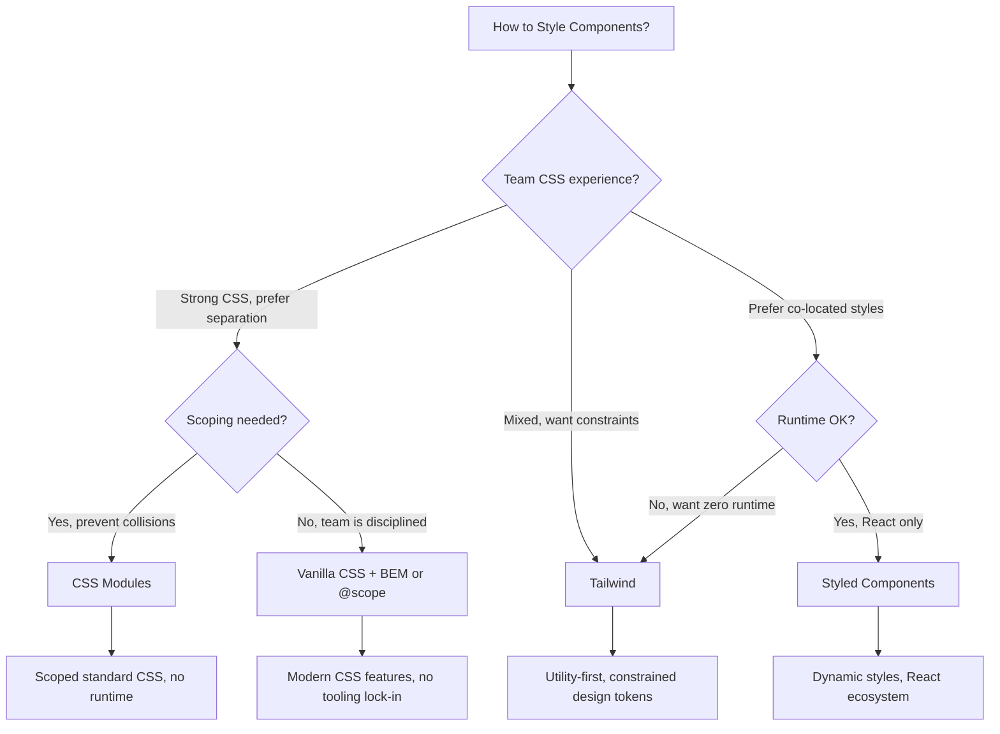

# Tailwind CSS vs CSS Modules vs Styled Components vs Vanilla CSS

How you write CSS affects bundle size, runtime performance, developer velocity, and design consistency. The styling landscape has fragmented into fundamentally different philosophies. This page compares the four most widely used approaches across every dimension that matters.

## Overview

### Tailwind CSS

Tailwind CSS is a utility-first CSS framework created by Adam Wathan in 2017. Instead of writing custom CSS classes, you compose styles from pre-defined utility classes directly in your HTML/JSX (`flex items-center gap-4 bg-blue-500 text-white`). Tailwind uses a JIT (just-in-time) compiler that scans your source files and generates only the CSS classes you actually use. Tailwind v4 (2025) rewrote the engine in Rust (using Oxide), added CSS-first configuration, and runs as a native CSS tool rather than a PostCSS plugin.

### CSS Modules

CSS Modules is a specification (not a framework) that scopes CSS class names to the component that imports them. When you import `styles.module.css`, the build tool (Vite, Webpack) transforms each class name into a unique hash (`header` becomes `_header_1a2b3`), preventing naming collisions. CSS Modules let you write standard CSS with automatic scoping — no runtime, no special syntax, no vendor lock-in.

### Styled Components

Styled Components is a CSS-in-JS library created by Max Stoiber and Glen Maddern in 2016. It uses tagged template literals to write actual CSS inside JavaScript/TypeScript components. Styled Components generates unique class names at runtime, injects `<style>` tags into the document head, and supports dynamic styles based on props. The v6 release improved SSR performance, but CSS-in-JS as a category has faced pushback due to runtime performance costs.

### Vanilla CSS

Vanilla CSS refers to writing standard CSS (or preprocessed CSS via Sass/PostCSS) without any framework or build-time transformation beyond standard processing. Modern CSS has eliminated many reasons for CSS-in-JS and utility frameworks — CSS nesting, `:has()`, container queries, cascade layers (`@layer`), and `@scope` provide solutions for problems that previously required tooling. Vanilla CSS with modern features is increasingly viable for complex applications.

## Architecture Comparison

```mermaid
graph TB
    subgraph Tailwind["Tailwind — Build-time Utility Generation"]
        TW1[Source Files - HTML/JSX] --> TW2[Tailwind Compiler - Rust]
        TW2 --> TW3[Scan for Class Names]
        TW3 --> TW4[Generate Matching Utilities]
        TW4 --> TW5[Single Optimized CSS File]
    end

    subgraph Modules["CSS Modules — Build-time Scoping"]
        CM1[Component.module.css] --> CM2[Build Tool - Vite/Webpack]
        CM2 --> CM3[Hash Class Names]
        CM3 --> CM4[Scoped CSS Output]
        CM1 --> CM5[import styles from Component.module.css]
        CM5 --> CM6[styles.className = hashed name]
    end

    subgraph SC["Styled Components — Runtime CSS-in-JS"]
        SC1[styled.div backtick CSS backtick] --> SC2[JS Runtime]
        SC2 --> SC3[Parse CSS String]
        SC3 --> SC4[Generate Unique Class]
        SC4 --> SC5[Inject Style Tag into DOM]
        SC5 --> SC6[Attach Class to Element]
    end

    subgraph Vanilla["Vanilla CSS — Standard Cascade"]
        VC1[styles.css] --> VC2[PostCSS / Sass - optional]
        VC2 --> VC3[Standard CSS Output]
        VC3 --> VC4[Browser CSS Engine]
    end
```



### Key Architectural Differences

**Tailwind** is a build-time tool. It scans your source files for class names, generates only the CSS for classes you actually use, and outputs a single, optimized stylesheet. There is zero runtime JavaScript. The v4 engine written in Rust is extremely fast.

**CSS Modules** is a build-time convention. Your build tool transforms class names to ensure uniqueness, then outputs standard CSS. The runtime cost is zero — the JavaScript bundle includes only a mapping object (`{ header: "_header_1a2b3" }`).

**Styled Components** runs in the browser. It parses CSS template literals at runtime, generates unique class names, and injects `<style>` tags into the DOM. This has a measurable performance cost — every styled component adds JavaScript to your bundle and CSS processing to your render path.

**Vanilla CSS** is processed by the browser's native CSS engine with no JavaScript overhead. Modern CSS features (nesting, `:has()`, `@layer`, `@scope`) provide many of the organizational benefits that previously required tooling.

## Feature Matrix

| Feature | Tailwind v4 | CSS Modules | Styled Components v6 | Vanilla CSS |
|---|---|---|---|---|
| **Approach** | Utility classes in markup | Scoped CSS files | CSS-in-JS (runtime) | Standard CSS |
| **Scoping** | Unique utility names | Hash-based class names | Generated class names | Manual (BEM, `@scope`) |
| **Dynamic styles** | Arbitrary values `[color:red]` | CSS variables | Props-based (native) | CSS variables |
| **Theming** | CSS variables + config | CSS variables | ThemeProvider | CSS variables |
| **Design tokens** | Config + CSS variables | Manual | ThemeProvider | CSS variables |
| **Responsive** | `md:`, `lg:` prefixes | Media queries | Media queries | Media queries + container queries |
| **Dark mode** | `dark:` prefix | `prefers-color-scheme` | Theme switching | `prefers-color-scheme` |
| **Pseudo-classes** | `hover:`, `focus:` prefixes | Standard CSS | `&:hover` in template | Standard CSS |
| **Animation** | `animate-*` utilities | @keyframes | keyframes helper | @keyframes |
| **TypeScript** | Class name strings (no types) | Typed with `*.module.css.d.ts` | Full prop types | N/A |
| **SSR** | No issues (static CSS) | No issues (static CSS) | Requires setup (extraction) | No issues |
| **Runtime cost** | Zero | Zero | Measurable (~8-15 KB + parsing) | Zero |
| **Build step required** | Yes (JIT compiler) | Yes (build tool) | No (but SSR extraction needs it) | Optional (PostCSS/Sass) |
| **Framework agnostic** | Yes | Yes | React (primarily) | Yes |
| **Dev tools** | Tailwind IntelliSense (VS Code) | Standard CSS DevTools | Styled Components DevTools | Standard CSS DevTools |
| **Bundle size** | ~10 KB (generated CSS) | Component-specific | ~15 KB (runtime) | Varies |

## Code Comparison

### Card Component

::: code-group

```tsx [Tailwind]
export function Card({ title, description, image, featured }) {
  return (
    <article
      className={`
        rounded-xl border bg-white shadow-sm
        transition-shadow hover:shadow-md
        ${featured ? 'border-blue-500 ring-2 ring-blue-200' : 'border-gray-200'}
      `}
    >
      
      <div className="p-6">
        <h3 className="text-lg font-semibold text-gray-900">
          {title}
        </h3>
        <p className="mt-2 text-sm text-gray-600 line-clamp-3">
          {description}
        </p>
        <button className="mt-4 rounded-lg bg-blue-600 px-4 py-2 text-sm font-medium text-white hover:bg-blue-700 focus:outline-none focus:ring-2 focus:ring-blue-500 focus:ring-offset-2">
          Read more
        </button>
      </div>
    </article>
  );
}
```

```tsx [CSS Modules]
// Card.tsx
import styles from './Card.module.css';

export function Card({ title, description, image, featured }) {
  return (
    <article className={`${styles.card} ${featured ? styles.featured : ''}`}>
      
      <div className={styles.content}>
        <h3 className={styles.title}>{title}</h3>
        <p className={styles.description}>{description}</p>
        <button className={styles.button}>Read more</button>
      </div>
    </article>
  );
}
```

```css [CSS Modules - Card.module.css]
/* Card.module.css */
.card {
  border-radius: 0.75rem;
  border: 1px solid var(--color-gray-200);
  background: white;
  box-shadow: 0 1px 2px rgb(0 0 0 / 0.05);
  transition: box-shadow 0.2s;

  &:hover {
    box-shadow: 0 4px 6px rgb(0 0 0 / 0.1);
  }
}

.featured {
  border-color: var(--color-blue-500);
  box-shadow: 0 0 0 2px var(--color-blue-200);
}

.image {
  width: 100%;
  height: 12rem;
  object-fit: cover;
  border-radius: 0.75rem 0.75rem 0 0;
}

.content {
  padding: 1.5rem;
}

.title {
  font-size: 1.125rem;
  font-weight: 600;
  color: var(--color-gray-900);
}

.description {
  margin-top: 0.5rem;
  font-size: 0.875rem;
  color: var(--color-gray-600);
  display: -webkit-box;
  -webkit-line-clamp: 3;
  -webkit-box-orient: vertical;
  overflow: hidden;
}

.button {
  margin-top: 1rem;
  padding: 0.5rem 1rem;
  font-size: 0.875rem;
  font-weight: 500;
  color: white;
  background: var(--color-blue-600);
  border: none;
  border-radius: 0.5rem;
  cursor: pointer;

  &:hover {
    background: var(--color-blue-700);
  }

  &:focus-visible {
    outline: 2px solid var(--color-blue-500);
    outline-offset: 2px;
  }
}
```

```tsx [Styled Components]
import styled from 'styled-components';

const StyledCard = styled.article<{ $featured?: boolean }>`
  border-radius: 0.75rem;
  border: 1px solid ${p => p.$featured ? '#3b82f6' : '#e5e7eb'};
  background: white;
  box-shadow: 0 1px 2px rgb(0 0 0 / 0.05);
  transition: box-shadow 0.2s;
  ${p => p.$featured && 'box-shadow: 0 0 0 2px #bfdbfe;'}

  &:hover {
    box-shadow: 0 4px 6px rgb(0 0 0 / 0.1);
  }
`;

const Image = styled.img`
  width: 100%;
  height: 12rem;
  object-fit: cover;
  border-radius: 0.75rem 0.75rem 0 0;
`;

const Content = styled.div`
  padding: 1.5rem;
`;

const Title = styled.h3`
  font-size: 1.125rem;
  font-weight: 600;
  color: #111827;
`;

const Description = styled.p`
  margin-top: 0.5rem;
  font-size: 0.875rem;
  color: #4b5563;
  display: -webkit-box;
  -webkit-line-clamp: 3;
  -webkit-box-orient: vertical;
  overflow: hidden;
`;

const Button = styled.button`
  margin-top: 1rem;
  padding: 0.5rem 1rem;
  font-size: 0.875rem;
  font-weight: 500;
  color: white;
  background: #2563eb;
  border: none;
  border-radius: 0.5rem;
  cursor: pointer;

  &:hover { background: #1d4ed8; }
  &:focus-visible {
    outline: 2px solid #3b82f6;
    outline-offset: 2px;
  }
`;

export function Card({ title, description, image, featured }) {
  return (
    <StyledCard $featured={featured}>
      <Image src={image} alt="" />
      <Content>
        <Title>{title}</Title>
        <Description>{description}</Description>
        <Button>Read more</Button>
      </Content>
    </StyledCard>
  );
}
```

```tsx [Vanilla CSS]
// Card.tsx
import './Card.css';

export function Card({ title, description, image, featured }) {
  return (
    <article className={`card ${featured ? 'card--featured' : ''}`}>
      
      <div className="card__content">
        <h3 className="card__title">{title}</h3>
        <p className="card__description">{description}</p>
        <button className="card__button">Read more</button>
      </div>
    </article>
  );
}
```

```css [Vanilla CSS - Card.css]
/* Card.css — BEM naming convention */
.card {
  border-radius: 0.75rem;
  border: 1px solid var(--color-gray-200);
  background: white;
  box-shadow: 0 1px 2px rgb(0 0 0 / 0.05);
  transition: box-shadow 0.2s;

  &:hover {
    box-shadow: 0 4px 6px rgb(0 0 0 / 0.1);
  }

  &--featured {
    border-color: var(--color-blue-500);
    box-shadow: 0 0 0 2px var(--color-blue-200);
  }
}

.card__image {
  width: 100%;
  height: 12rem;
  object-fit: cover;
  border-radius: 0.75rem 0.75rem 0 0;
}

.card__content { padding: 1.5rem; }
.card__title { font-size: 1.125rem; font-weight: 600; color: var(--color-gray-900); }
.card__description {
  margin-top: 0.5rem;
  font-size: 0.875rem;
  color: var(--color-gray-600);
  display: -webkit-box;
  -webkit-line-clamp: 3;
  -webkit-box-orient: vertical;
  overflow: hidden;
}
.card__button {
  margin-top: 1rem; padding: 0.5rem 1rem;
  font-size: 0.875rem; font-weight: 500;
  color: white; background: var(--color-blue-600);
  border: none; border-radius: 0.5rem; cursor: pointer;

  &:hover { background: var(--color-blue-700); }
  &:focus-visible { outline: 2px solid var(--color-blue-500); outline-offset: 2px; }
}
```

:::

## Performance

### Runtime Performance

| Metric | Tailwind | CSS Modules | Styled Components | Vanilla CSS |
|---|---|---|---|---|
| **Runtime JS overhead** | 0 KB | 0 KB | ~15 KB (library) | 0 KB |
| **Style insertion** | Static `<link>` | Static `<link>` | Dynamic `<style>` injection | Static `<link>` |
| **Reflow/repaint cost** | Standard | Standard | Higher (CSSOM manipulation) | Standard |
| **SSR FOUC risk** | None | None | Medium (needs extraction) | None |
| **React re-render cost** | None (static classes) | None (static classes) | Creates new class per render (if dynamic) | None (static classes) |

### Build-time Performance

| Metric | Tailwind v4 | CSS Modules | Styled Components | Vanilla CSS |
|---|---|---|---|---|
| **Build time overhead** | Low (Rust engine) | Negligible | Negligible | Negligible (PostCSS) |
| **CSS output size (medium app)** | 8-15 KB | 15-30 KB | Dynamic (per component) | 20-40 KB |
| **Cache effectiveness** | Excellent (single file) | Good (per-component) | N/A (runtime) | Good |
| **Dead code elimination** | Automatic (JIT) | Manual (unused classes stay) | Manual (unused components) | Manual |

### Bundle Size Impact

| Metric | Tailwind | CSS Modules | Styled Components | Vanilla CSS |
|---|---|---|---|---|
| **CSS size (100 components)** | ~10-15 KB (shared utilities) | ~30-50 KB (per component) | Generated at runtime | ~30-50 KB |
| **JS size addition** | 0 KB | ~1 KB (class maps) | ~15 KB + component overhead | 0 KB |
| **Total size impact** | Smallest | Small | Largest | Small |

::: warning Styled Components performance issue
Styled Components injects `<style>` tags at runtime, which can cause layout shifts and FOUC (Flash of Unstyled Content) during SSR hydration. The React team has explicitly recommended against CSS-in-JS libraries that inject styles at runtime. This is the primary reason CSS-in-JS adoption has declined since 2023.
:::

::: tip Tailwind's CSS size advantage
Tailwind's CSS output stays remarkably small because utility classes are shared across components. Whether you have 10 or 1,000 components, `flex`, `p-4`, and `text-sm` are only emitted once. With CSS Modules or vanilla CSS, similar styles are duplicated across every component's stylesheet.
:::

## Developer Experience

### Productivity

| Aspect | Tailwind | CSS Modules | Styled Components | Vanilla CSS |
|---|---|---|---|---|
| **Speed of styling** | Very fast (inline) | Medium (context switch) | Medium (template strings) | Medium (context switch) |
| **Design consistency** | High (constrained values) | Depends on discipline | Depends on theme | Depends on discipline |
| **Refactoring** | Hard (classes in markup) | Easy (rename CSS class) | Easy (rename component) | Medium (global name risk) |
| **Code review** | Noisy (long class strings) | Clean (semantic classes) | Clean (component names) | Clean (semantic classes) |
| **IDE support** | Tailwind IntelliSense (excellent) | Standard CSS tooling | Good (but less tooling) | Standard CSS tooling |
| **Finding styles** | In the component (inline) | Separate file | In the component (co-located) | Separate file |

### Learning Curve

| Aspect | Tailwind | CSS Modules | Styled Components | Vanilla CSS |
|---|---|---|---|---|
| **CSS knowledge required** | Medium (must know concepts) | High (full CSS) | High (full CSS + JS) | High (full CSS) |
| **Time to productive** | 1-2 weeks (learn utilities) | 1 day (if you know CSS) | 1 week (JS + CSS patterns) | 1 day (if you know CSS) |
| **Onboarding cost** | Learning class names | Almost zero | Learning the API | Almost zero |
| **Transferable skills** | Tailwind-specific | Universal CSS | React-specific | Universal CSS |

### Design System Integration

| Aspect | Tailwind | CSS Modules | Styled Components | Vanilla CSS |
|---|---|---|---|---|
| **Design tokens** | tailwind.config / CSS vars | CSS variables | ThemeProvider | CSS variables |
| **Component library** | shadcn/ui, Headless UI | Any | Many (MUI, Chakra) | Any |
| **Consistency enforcement** | Built-in (spacing scale) | Manual | Manual (theme) | Manual |
| **Figma-to-code** | Many plugins | Manual | Manual | Manual |

## When to Use Which



### Decision Summary

| Scenario | Best Choice | Why |
|---|---|---|
| **Rapid development, small team** | Tailwind | Fastest iteration, consistent output |
| **Design system with strict tokens** | Tailwind or CSS Modules + vars | Constrained values enforce consistency |
| **Server-side rendered** | Tailwind or CSS Modules | Zero runtime, no FOUC risk |
| **React + highly dynamic styles** | Styled Components or CSS Modules + vars | Props-based style composition |
| **Framework-agnostic styling** | CSS Modules or vanilla CSS | No framework dependency |
| **Legacy project, add scoping** | CSS Modules | Minimal change, just rename files |
| **Performance-critical** | Tailwind or vanilla CSS | Zero runtime overhead |
| **Existing Styled Components project** | Stay (or migrate to CSS Modules) | Migration cost is real |
| **Content site (blog, docs)** | Tailwind | Quick utility styling, small output |
| **Long-term maintainability** | CSS Modules or vanilla CSS | Standard CSS, no vendor lock-in |

## Migration

### Styled Components to CSS Modules

1. **Create CSS file**: For each styled component, create a corresponding `.module.css` file
2. **Move styles**: Copy CSS from template literals into CSS Module classes
3. **Replace dynamic styles**: Convert prop-based styles to CSS variables or data attributes
4. **Update component**: Import CSS Module, apply class names
5. **Remove styled-components**: Uninstall once all components are migrated

```tsx
// Before (Styled Components)
const Button = styled.button<{ $variant: 'primary' | 'secondary' }>`
  padding: 0.5rem 1rem;
  border-radius: 0.5rem;
  background: ${p => p.$variant === 'primary' ? '#2563eb' : '#e5e7eb'};
  color: ${p => p.$variant === 'primary' ? 'white' : '#111827'};
`;
<Button $variant="primary">Click</Button>
```

```css
/* After (Button.module.css) */
.button {
  padding: 0.5rem 1rem;
  border-radius: 0.5rem;
}
.primary {
  background: #2563eb;
  color: white;
}
.secondary {
  background: #e5e7eb;
  color: #111827;
}
```

```tsx
// After (Button.tsx)
import styles from './Button.module.css';
<button className={`${styles.button} ${styles[variant]}`}>Click</button>
```

### CSS Modules to Tailwind

1. **Install Tailwind**: Follow the Tailwind installation guide for your build tool
2. **Map CSS to utilities**: Convert each CSS property to Tailwind utility classes
3. **Replace className references**: Change `styles.card` to utility strings
4. **Remove CSS files**: Delete `.module.css` files once components are converted
5. **Extract common patterns**: Use `@apply` in components or create Tailwind components

::: warning Tailwind migration is one-way
Migrating to Tailwind is difficult to reverse because style information moves from structured CSS files into inline class strings spread across hundreds of components. Consider carefully before committing — the approach must align with your team's philosophy long-term.
:::

## Verdict

**Choose Tailwind CSS** if your team values development speed, design consistency, and small CSS output. Tailwind's utility-first approach eliminates context-switching between HTML and CSS files, enforces consistent spacing/color/typography through its configuration, and produces remarkably small CSS bundles. The tradeoff is verbose markup and a learning curve for the utility class vocabulary. Tailwind v4 with its Rust engine is the most popular choice for new projects in 2026.

**Choose CSS Modules** if your team has strong CSS skills and wants scoped, standard CSS without runtime overhead or vendor lock-in. CSS Modules provide the core benefit of scoping (no naming collisions) without changing how you write CSS. They work with every framework, every build tool, and every deployment platform. This is the most conservative, lowest-risk choice.

**Choose Styled Components** only if you have an existing codebase using it and the migration cost is not justified, or if you have a genuinely compelling need for highly dynamic, props-driven styles that CSS variables cannot express. For new projects in 2026, the runtime performance cost and SSR complexity make CSS-in-JS hard to recommend. The React team and the broader community have moved away from runtime CSS-in-JS.

**Choose Vanilla CSS** if your team is disciplined about naming conventions, your project is framework-agnostic, or you want zero tooling dependencies. Modern CSS (nesting, `:has()`, container queries, `@layer`, `@scope`) has closed most of the gaps that CSS tooling was created to address. The risk is naming collisions at scale — use BEM, `@scope`, or `@layer` to mitigate.
