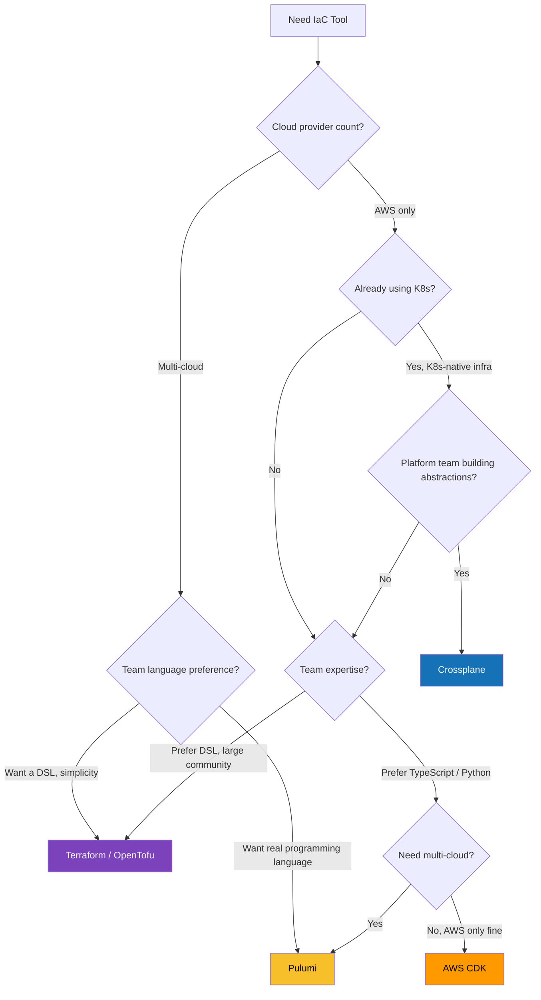

# Terraform vs Pulumi vs CDK vs Crossplane

Infrastructure as Code (IaC) has moved from a best practice to a hard requirement. The question is no longer "should we codify infrastructure?" but "which tool should we use?" Each of these four tools takes a fundamentally different approach: Terraform uses a custom DSL, Pulumi uses general-purpose languages, CDK generates CloudFormation, and Crossplane uses Kubernetes as the control plane. This comparison helps you make the right call.

## Overview

| Tool | Maintainer | First Release | Approach | Primary Language |
|---|---|---|---|---|
| **Terraform** | HashiCorp (IBM) | 2014 | Declarative DSL (HCL) | HCL |
| **Pulumi** | Pulumi Corp | 2018 | Imperative with declarative engine | TypeScript, Python, Go, C#, Java |
| **AWS CDK** | Amazon | 2019 | Imperative, compiles to CloudFormation | TypeScript, Python, Java, C#, Go |
| **Crossplane** | Upbound (acquired by CNCF) | 2018 | Kubernetes-native CRDs | YAML (Kubernetes manifests) |

::: warning License Matters
Terraform switched from MPL to the BSL (Business Source License) in August 2023, prompting the creation of OpenTofu (Linux Foundation fork). If open-source licensing is a concern for your organization, consider OpenTofu as a drop-in replacement for Terraform.
:::

## Architecture Comparison

```mermaid
graph TB
    subgraph Terraform
        T1[HCL Config Files] --> T2[Terraform Core]
        T2 --> T3[Provider Plugins<br/>gRPC]
        T3 --> T4[AWS / GCP / Azure<br/>APIs]
        T2 --> T5[State File<br/>JSON]
        T5 --> T6[Remote Backend<br/>S3 / TF Cloud / Consul]
    end

    subgraph Pulumi
        P1[TypeScript / Python / Go] --> P2[Pulumi Engine]
        P2 --> P3[Provider Plugins<br/>gRPC / TF Bridge]
        P3 --> P4[AWS / GCP / Azure<br/>APIs]
        P2 --> P5[State]
        P5 --> P6[Pulumi Cloud / S3<br/>Local / Azure Blob]
    end

    subgraph CDK["AWS CDK"]
        C1[TypeScript / Python] --> C2[CDK Constructs]
        C2 --> C3[CloudFormation<br/>Template Synthesis]
        C3 --> C4[CloudFormation<br/>Stack Deployment]
        C4 --> C5[AWS APIs]
    end

    subgraph Crossplane
        X1[K8s CRDs / YAML] --> X2[Crossplane Controller]
        X2 --> X3[Providers<br/>AWS / GCP / Azure]
        X3 --> X4[Cloud APIs]
        X2 --> X5[etcd<br/>K8s State Store]
    end

    style Terraform fill:#7b42bc,color:#fff
    style Pulumi fill:#f7bf2a,color:#000
    style CDK fill:#ff9900,color:#000
    style Crossplane fill:#1572b6,color:#fff
```



## Feature Matrix

| Feature | Terraform | Pulumi | AWS CDK | Crossplane |
|---|---|---|---|---|
| **Language** | HCL (custom DSL) | TS, Python, Go, C#, Java, YAML | TS, Python, Java, C#, Go | YAML (K8s manifests) |
| **Cloud support** | Multi-cloud (3,000+ providers) | Multi-cloud (bridged TF providers) | AWS only (CDKTF for multi) | Multi-cloud (providers) |
| **State management** | Remote backends (S3, TF Cloud, etc.) | Pulumi Cloud, S3, local | CloudFormation (managed by AWS) | etcd (Kubernetes) |
| **State locking** | Built-in (DynamoDB, TF Cloud) | Built-in (Pulumi Cloud) | Handled by CloudFormation | Kubernetes resource locks |
| **Drift detection** | `terraform plan` | `pulumi preview` | CloudFormation drift detection | Continuous reconciliation |
| **Import existing** | `terraform import` | `pulumi import` | `cdk import` | Manual CRD creation |
| **Modules / reuse** | Modules (TF Registry) | Packages (npm, PyPI, etc.) | Constructs (Construct Hub) | Compositions / XRDs |
| **Testing** | `terraform test`, Terratest | Native unit tests (Jest, pytest) | CDK Assertions, Jest | Kubernetes-native testing |
| **Policy as code** | Sentinel (paid), OPA | CrossGuard (built-in) | cdk-nag (open-source) | OPA Gatekeeper |
| **Preview / plan** | `terraform plan` | `pulumi preview` | `cdk diff` | N/A (continuous) |
| **Secrets** | State (encrypted at rest) | First-class secret encryption | SSM / Secrets Manager | K8s Secrets / External Secrets |
| **CI/CD integration** | TF Cloud, Atlantis, Spacelift | Pulumi Deployments, GitHub Actions | CDK Pipelines (built-in) | GitOps (ArgoCD / Flux) |
| **Learning curve** | Low (HCL is simple) | Medium (need to learn SDK) | Medium (need CDK constructs) | High (need K8s knowledge) |
| **IDE support** | VS Code extension, LSP | Full IDE support (native lang) | Full IDE support (native lang) | K8s YAML tooling |
| **Cost** | Free (OSS) / TF Cloud paid | Free (OSS) / Pulumi Cloud paid | Free | Free (OSS) / Upbound paid |
| **License** | BSL 1.1 (was MPL) | Apache 2.0 | Apache 2.0 | Apache 2.0 |

## Code & Config Comparison

### Provisioning an S3 Bucket + Lambda Function

**Terraform:**

```hcl
# main.tf
terraform {
  required_providers {
    aws = {
      source  = "hashicorp/aws"
      version = "~> 5.0"
    }
  }
  backend "s3" {
    bucket = "my-tf-state"
    key    = "prod/terraform.tfstate"
    region = "us-east-1"
  }
}

resource "aws_s3_bucket" "data" {
  bucket = "my-app-data-${var.environment}"

  tags = {
    Environment = var.environment
    ManagedBy   = "terraform"
  }
}

resource "aws_s3_bucket_versioning" "data" {
  bucket = aws_s3_bucket.data.id
  versioning_configuration {
    status = "Enabled"
  }
}

resource "aws_lambda_function" "processor" {
  function_name = "data-processor-${var.environment}"
  runtime       = "nodejs20.x"
  handler       = "index.handler"
  role          = aws_iam_role.lambda_role.arn
  filename      = data.archive_file.lambda.output_path

  environment {
    variables = {
      BUCKET_NAME = aws_s3_bucket.data.id
    }
  }
}

resource "aws_iam_role" "lambda_role" {
  name = "lambda-role-${var.environment}"
  assume_role_policy = jsonencode({
    Version = "2012-10-17"
    Statement = [{
      Action = "sts:AssumeRole"
      Effect = "Allow"
      Principal = {
        Service = "lambda.amazonaws.com"
      }
    }]
  })
}
```

**Pulumi** (TypeScript):

```typescript
import * as aws from '@pulumi/aws';
import * as pulumi from '@pulumi/pulumi';

const config = new pulumi.Config();
const environment = config.require('environment');

const bucket = new aws.s3.Bucket('data', {
  bucket: `my-app-data-${environment}`,
  versioning: { enabled: true },
  tags: {
    Environment: environment,
    ManagedBy: 'pulumi',
  },
});

const lambdaRole = new aws.iam.Role('lambdaRole', {
  assumeRolePolicy: JSON.stringify({
    Version: '2012-10-17',
    Statement: [{
      Action: 'sts:AssumeRole',
      Effect: 'Allow',
      Principal: { Service: 'lambda.amazonaws.com' },
    }],
  }),
});

const processor = new aws.lambda.Function('processor', {
  functionName: `data-processor-${environment}`,
  runtime: aws.lambda.Runtime.NodeJS20dX,
  handler: 'index.handler',
  role: lambdaRole.arn,
  code: new pulumi.asset.FileArchive('./lambda'),
  environment: {
    variables: {
      BUCKET_NAME: bucket.id,
    },
  },
});

// Export outputs
export const bucketName = bucket.id;
export const functionArn = processor.arn;
```

**CDK** (TypeScript):

```typescript
import * as cdk from 'aws-cdk-lib';
import * as s3 from 'aws-cdk-lib/aws-s3';
import * as lambda from 'aws-cdk-lib/aws-lambda';
import { Construct } from 'constructs';

export class DataStack extends cdk.Stack {
  constructor(scope: Construct, id: string, props?: cdk.StackProps) {
    super(scope, id, props);

    const environment = this.node.tryGetContext('environment') || 'dev';

    const bucket = new s3.Bucket(this, 'DataBucket', {
      bucketName: `my-app-data-${environment}`,
      versioned: true,
      removalPolicy: cdk.RemovalPolicy.RETAIN,
    });

    const processor = new lambda.Function(this, 'Processor', {
      functionName: `data-processor-${environment}`,
      runtime: lambda.Runtime.NODEJS_20_X,
      handler: 'index.handler',
      code: lambda.Code.fromAsset('lambda'),
      environment: {
        BUCKET_NAME: bucket.bucketName,
      },
    });

    // CDK handles IAM automatically
    bucket.grantRead(processor);

    new cdk.CfnOutput(this, 'BucketName', { value: bucket.bucketName });
  }
}
```

**Crossplane:**

```yaml
# composition.yaml
apiVersion: apiextensions.crossplane.io/v1
kind: Composition
metadata:
  name: data-pipeline
spec:
  compositeTypeRef:
    apiVersion: platform.example.com/v1alpha1
    kind: DataPipeline
  resources:
    - name: bucket
      base:
        apiVersion: s3.aws.upbound.io/v1beta1
        kind: Bucket
        spec:
          forProvider:
            region: us-east-1
          providerConfigRef:
            name: aws-provider
      patches:
        - fromFieldPath: spec.environment
          toFieldPath: metadata.labels.environment
    - name: bucket-versioning
      base:
        apiVersion: s3.aws.upbound.io/v1beta1
        kind: BucketVersioning
        spec:
          forProvider:
            versioningConfiguration:
              - status: Enabled
---
# claim.yaml
apiVersion: platform.example.com/v1alpha1
kind: DataPipeline
metadata:
  name: my-pipeline
spec:
  environment: production
```

::: tip CDK Advantage: Automatic IAM
Notice how CDK generates IAM policies automatically with `bucket.grantRead(processor)`. In Terraform and Pulumi, you must manually wire IAM roles and policies — a common source of errors and security misconfigurations.
:::

### Testing

**Terraform** (built-in `terraform test`):

```hcl
# tests/s3.tftest.hcl
run "creates_bucket_with_versioning" {
  command = plan

  assert {
    condition     = aws_s3_bucket_versioning.data.versioning_configuration[0].status == "Enabled"
    error_message = "Bucket versioning must be enabled"
  }
}
```

**Pulumi** (native unit test with Jest):

```typescript
import * as pulumi from '@pulumi/pulumi';
import { describe, it, expect } from 'vitest';

// Mock Pulumi runtime
pulumi.runtime.setMocks({
  newResource: (args) => ({ id: `${args.name}-id`, state: args.inputs }),
  call: (args) => args.inputs,
});

describe('DataStack', () => {
  it('creates a versioned S3 bucket', async () => {
    const { bucket } = await import('./index');
    const versioning = await new Promise<boolean>((resolve) =>
      bucket.versioning.apply((v) => resolve(v?.enabled ?? false))
    );
    expect(versioning).toBe(true);
  });
});
```

**CDK** (CDK Assertions):

```typescript
import { Template } from 'aws-cdk-lib/assertions';
import { App } from 'aws-cdk-lib';
import { DataStack } from './data-stack';

test('creates versioned S3 bucket', () => {
  const app = new App();
  const stack = new DataStack(app, 'TestStack');
  const template = Template.fromStack(stack);

  template.hasResourceProperties('AWS::S3::Bucket', {
    VersioningConfiguration: { Status: 'Enabled' },
  });

  template.resourceCountIs('AWS::Lambda::Function', 1);
});
```

## Performance

### Deployment Speed

| Scenario | Terraform | Pulumi | CDK | Crossplane |
|---|---|---|---|---|
| **First deploy (10 resources)** | ~60s | ~45s | ~90s (CFn overhead) | ~120s (reconciliation) |
| **No-change plan** | ~5s | ~3s | ~15s (synth + diff) | Continuous |
| **Add 1 resource** | ~15s | ~12s | ~45s (CFn changeset) | ~30s |
| **50-resource stack** | ~3min | ~2.5min | ~8min | ~5min |
| **State refresh** | 2-10s per resource | 2-10s per resource | N/A (CloudFormation) | N/A (continuous) |

::: warning CloudFormation Bottleneck
CDK compiles to CloudFormation, which has hard limits: 500 resources per stack, slower changeset creation, and occasional rollback storms. For large infrastructure, you must split across stacks, adding complexity.
:::

### State Management Performance

| Aspect | Terraform | Pulumi | CDK | Crossplane |
|---|---|---|---|---|
| **State size (100 resources)** | ~500 KB JSON | ~500 KB JSON | N/A (CloudFormation) | N/A (etcd) |
| **State locking** | DynamoDB, Consul, TF Cloud | Pulumi Cloud, built-in | CloudFormation handles | K8s resource versioning |
| **Concurrent operations** | One at a time per workspace | One at a time per stack | One per CFn stack | Unlimited (reconcile loop) |
| **State migration** | `terraform state mv/rm` | `pulumi state` commands | Stack refactoring | K8s resource management |

## Developer Experience

### Strengths

**Terraform:**
- HCL is purpose-built for infrastructure: readable, auditable, diffable
- 3,000+ providers in the Terraform Registry
- Massive community, Stack Overflow answers for everything
- Terraform Cloud offers team workflows, policy enforcement, cost estimation

**Pulumi:**
- Real programming language means loops, conditionals, abstractions, testing
- Reuse existing package managers (npm, pip, Go modules)
- IDE autocompletion, type checking, and refactoring tools
- CrossGuard for policy-as-code using your preferred language

**CDK:**
- L2/L3 constructs abstract away CloudFormation complexity
- Automatic IAM policy generation
- `cdk synth` produces reviewable CloudFormation templates
- CDK Pipelines for self-mutating CI/CD

**Crossplane:**
- Continuous reconciliation (Kubernetes controller pattern)
- Self-healing: drift is automatically corrected
- Platform teams can build self-service abstractions via Compositions
- GitOps-native: ArgoCD/Flux manage infrastructure like apps

### Pain Points

| Tool | Frustration |
|---|---|
| **Terraform** | HCL limitations (no real loops, string interpolation quirks); state file conflicts in teams |
| **Pulumi** | Smaller ecosystem than Terraform; bridged providers sometimes lag |
| **CDK** | CloudFormation limits (500 resources/stack); slow deployments; AWS-only (without CDKTF) |
| **Crossplane** | Steep learning curve; requires running K8s cluster; YAML verbosity |

## When to Use Which



### Decision Summary

| Scenario | Recommended Tool |
|---|---|
| Multi-cloud, large team, wide ecosystem needed | **Terraform** |
| Team wants TypeScript/Python, strong testing | **Pulumi** |
| AWS-only shop, want automatic IAM | **AWS CDK** |
| Platform engineering, self-service infra | **Crossplane** |
| Open-source license is a hard requirement | **OpenTofu** or **Pulumi** |
| Existing Terraform codebase, want real language | **CDKTF** (CDK for Terraform) |
| GitOps-native, K8s cluster already exists | **Crossplane** |
| Solo developer, simple infrastructure | **Terraform** |

## Migration

### Terraform to Pulumi

Pulumi provides an official converter:

```bash
# 1. Install Pulumi
curl -fsSL https://get.pulumi.com | sh

# 2. Convert Terraform HCL to Pulumi
pulumi convert --from terraform --language typescript

# 3. Import existing Terraform state
pulumi import --from terraform ./terraform.tfstate

# 4. Review generated code
# The converter handles ~80% of cases; complex modules
# and dynamic blocks may need manual adjustment

# 5. Verify with preview
pulumi preview
```

### CDK to Terraform (via CDKTF)

```bash
# 1. Install CDKTF CLI
npm install -g cdktf-cli

# 2. Initialize CDKTF project
cdktf init --template=typescript

# 3. Use existing CDK constructs with adaptations
# CDKTF uses Terraform providers, not CloudFormation resources
# Rewrite L2/L3 constructs to CDKTF equivalents

# 4. Synthesize Terraform JSON
cdktf synth

# 5. Deploy
cdktf deploy
```

### Terraform to OpenTofu

```bash
# OpenTofu is a drop-in replacement for Terraform <= 1.5
# 1. Install OpenTofu
brew install opentofu

# 2. Replace terraform binary references
alias terraform=tofu

# 3. Initialize
tofu init

# 4. Verify
tofu plan
# Output should be identical to terraform plan
```

::: tip Migration Complexity
Terraform to OpenTofu is trivial (same HCL, same state format). Terraform to Pulumi is moderate (automated converter exists). CDK to anything else is painful (CloudFormation constructs do not map 1:1 to Terraform resources).
:::

## Verdict

**Terraform** (or **OpenTofu**) remains the industry standard for multi-cloud infrastructure. Its massive ecosystem of 3,000+ providers, ubiquitous community knowledge, and battle-tested production use at every scale make it the safe default. HCL's limitations are real but manageable.

**Pulumi** is the strongest choice for teams that want real programming language power — loops, conditionals, type safety, unit tests, and IDE support. It bridges most Terraform providers, so ecosystem coverage is nearly equivalent.

**AWS CDK** excels when your world is AWS. The automatic IAM policy generation alone saves hours of error-prone policy writing. However, the CloudFormation bottleneck limits its scalability for very large infrastructures.

**Crossplane** is the future for platform engineering teams building self-service infrastructure on Kubernetes. Its continuous reconciliation model eliminates drift by design. The trade-off is requiring a Kubernetes cluster and a steep learning curve.

::: tip Bottom Line
Start with **Terraform/OpenTofu** if you have no strong preference — it is the lingua franca of IaC. Choose **Pulumi** if your team values TypeScript/Python and testing. Pick **CDK** for AWS-only shops that want high-level abstractions. Adopt **Crossplane** only when you are building a platform engineering team on Kubernetes.
:::
