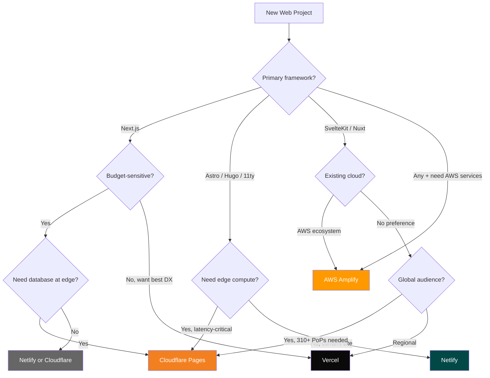

# Vercel vs Netlify vs Cloudflare Pages vs AWS Amplify

Choosing a deployment platform is one of the most consequential early decisions in a web project. It affects build speed, cold-start latency, pricing at scale, and even which frameworks you can adopt. This comparison cuts through the marketing and evaluates four leading platforms on what actually matters in production.

## Overview

| Platform | Founded | Core Philosophy | Primary Audience |
|---|---|---|---|
| **Vercel** | 2015 (as ZEIT) | "Framework-defined infrastructure" | Frontend / full-stack teams using Next.js |
| **Netlify** | 2014 | "Composable web architecture" | Jamstack & static-first teams |
| **Cloudflare Pages** | 2021 | "Edge-first everything" | Performance-obsessed teams, global apps |
| **AWS Amplify** | 2017 | "AWS services with a simpler DX" | Teams already invested in AWS ecosystem |

::: tip Key Insight
No platform is universally "best." Vercel dominates the Next.js ecosystem, Netlify pioneered Jamstack workflows, Cloudflare wins on edge latency, and Amplify is the on-ramp to the full AWS service catalog.
:::

## Architecture Comparison

```mermaid
graph TB
    subgraph Vercel
        V1[Git Push] --> V2[Build Pipeline]
        V2 --> V3[Static CDN<br/>Edge Network]
        V2 --> V4[Serverless Functions<br/>AWS Lambda]
        V2 --> V5[Edge Functions<br/>V8 Isolates]
        V3 --> V6[ISR / On-Demand<br/>Revalidation]
    end

    subgraph Netlify
        N1[Git Push] --> N2[Build Pipeline]
        N2 --> N3[Static CDN<br/>Multi-Cloud]
        N2 --> N4[Serverless Functions<br/>AWS Lambda]
        N2 --> N5[Edge Functions<br/>Deno Deploy]
        N3 --> N6[DPR / On-Demand<br/>Builders]
    end

    subgraph Cloudflare["Cloudflare Pages"]
        C1[Git Push] --> C2[Build Pipeline]
        C2 --> C3[Static CDN<br/>310+ PoPs]
        C2 --> C4[Workers<br/>V8 Isolates]
        C4 --> C5[KV / D1 / R2<br/>Edge Storage]
    end

    subgraph Amplify["AWS Amplify"]
        A1[Git Push] --> A2[Build Pipeline]
        A2 --> A3[CloudFront CDN]
        A2 --> A4[Lambda Functions]
        A4 --> A5[DynamoDB / S3<br/>Cognito / AppSync]
    end

    style Vercel fill:#0a0a0a,color:#fff
    style Netlify fill:#014847,color:#fff
    style Cloudflare fill:#f38020,color:#fff
    style Amplify fill:#ff9900,color:#fff
```



## Feature Matrix

| Feature | Vercel | Netlify | Cloudflare Pages | AWS Amplify |
|---|---|---|---|---|
| **Free tier bandwidth** | 100 GB/mo | 100 GB/mo | Unlimited | 15 GB/mo |
| **Free tier builds** | 6,000 min/mo | 300 min/mo | 500 builds/mo | 1,000 min/mo |
| **Pro plan price** | $20/user/mo | $19/user/mo | $5/mo (Workers Paid) | Pay-as-you-go |
| **Edge locations** | ~70+ (Anycast) | CDN (multi-provider) | 310+ PoPs | 600+ CloudFront PoPs |
| **Serverless runtime** | Node.js (AWS Lambda) | Node.js (AWS Lambda) | V8 Isolates (Workers) | Node.js (Lambda) |
| **Edge runtime** | V8 Isolates | Deno Deploy | V8 Isolates (native) | Lambda@Edge / CloudFront Functions |
| **Cold start** | ~250ms (serverless) / <1ms (edge) | ~250ms (serverless) / <5ms (edge) | <1ms (Workers) | ~300ms (Lambda) |
| **Max function duration** | 60s (Pro) / 300s (Enterprise) | 10s (free) / 26s (paid) | 30s (Workers) / 15min (Queues) | 15min (Lambda) |
| **Next.js support** | First-class (creator) | Adapter-based | Adapter (OpenNext) | Adapter-based |
| **Framework adapters** | Next, Nuxt, SvelteKit, Astro | Next, Nuxt, Gatsby, Remix, Astro | Next (partial), Astro, Nuxt, SvelteKit | Next, Nuxt, Gatsby, Angular |
| **Preview deployments** | Per-PR, instant | Per-PR, instant | Per-branch | Per-branch |
| **Monorepo support** | Turborepo-native | Build plugins | Manual config | Amplify monorepo |
| **Analytics** | Web Vitals, Speed Insights | Built-in analytics | Web Analytics (free) | CloudWatch integration |
| **DDoS protection** | Included | Included | Enterprise-grade (native) | AWS Shield |
| **Custom domains** | Unlimited (free) | Unlimited (free) | Unlimited (free) | Unlimited (free) |
| **Image optimization** | Built-in (next/image) | Large Media / plugins | Cloudflare Images (paid) | Manual (Lambda@Edge) |
| **Database** | Vercel Postgres, KV, Blob | None (BYO) | D1 (SQLite), KV, R2 | DynamoDB, Aurora |
| **Auth** | None (BYO) | Netlify Identity | Cloudflare Access | Cognito (native) |

## Code & Config Comparison

### Build Configuration

**Vercel** (`vercel.json`):

```json
{
  "buildCommand": "npm run build",
  "outputDirectory": ".next",
  "framework": "nextjs",
  "regions": ["iad1", "sfo1", "cdg1"],
  "functions": {
    "api/**/*.ts": {
      "memory": 1024,
      "maxDuration": 60
    }
  },
  "crons": [
    { "path": "/api/cron/sync", "schedule": "0 */6 * * *" }
  ]
}
```

**Netlify** (`netlify.toml`):

```toml
[build]
  command = "npm run build"
  publish = ".next"

[build.environment]
  NODE_VERSION = "20"

[[redirects]]
  from = "/api/*"
  to = "/.netlify/functions/:splat"
  status = 200

[[headers]]
  for = "/*"
  [headers.values]
    X-Frame-Options = "DENY"
    X-Content-Type-Options = "nosniff"
```

**Cloudflare Pages** (`wrangler.toml`):

```toml
name = "my-app"
compatibility_date = "2026-03-01"
pages_build_output_dir = "./dist"

[[d1_databases]]
binding = "DB"
database_name = "my-db"
database_id = "xxxx-xxxx-xxxx"

[vars]
ENVIRONMENT = "production"
```

**AWS Amplify** (`amplify.yml`):

```yaml
version: 1
frontend:
  phases:
    preBuild:
      commands:
        - npm ci
    build:
      commands:
        - npm run build
  artifacts:
    baseDirectory: .next
    files:
      - '**/*'
  cache:
    paths:
      - node_modules/**/*
      - .next/cache/**/*
```

### Serverless Function Example

**Vercel** (Edge Function):

```typescript
// app/api/hello/route.ts
export const runtime = 'edge';

export async function GET(request: Request) {
  const country = request.headers.get('x-vercel-ip-country') || 'unknown';
  return new Response(
    JSON.stringify({ message: `Hello from ${country}` }),
    { headers: { 'content-type': 'application/json' } }
  );
}
```

**Cloudflare** (Worker):

```typescript
// functions/api/hello.ts
export const onRequest: PagesFunction = async (context) => {
  const country = context.request.cf?.country || 'unknown';
  return new Response(
    JSON.stringify({ message: `Hello from ${country}` }),
    { headers: { 'content-type': 'application/json' } }
  );
};
```

**Netlify** (Edge Function):

```typescript
// netlify/edge-functions/hello.ts
import type { Context } from "@netlify/edge-functions";

export default async (request: Request, context: Context) => {
  const country = context.geo?.country?.code || 'unknown';
  return new Response(
    JSON.stringify({ message: `Hello from ${country}` }),
    { headers: { 'content-type': 'application/json' } }
  );
};
```

## Performance

### Cold Start Benchmarks

| Metric | Vercel (Serverless) | Vercel (Edge) | Netlify (Serverless) | Netlify (Edge) | Cloudflare Workers | Amplify (Lambda) |
|---|---|---|---|---|---|---|
| **Cold start p50** | 180ms | <1ms | 200ms | 3ms | <1ms | 250ms |
| **Cold start p99** | 800ms | 5ms | 900ms | 15ms | 5ms | 1200ms |
| **Warm response p50** | 15ms | <1ms | 20ms | <1ms | <1ms | 20ms |
| **Max bundle size** | 50 MB | 4 MB | 50 MB | 20 MB | 10 MB (compressed) | 50 MB |
| **Memory** | 1024-3008 MB | 128 MB | 1024 MB | 512 MB | 128 MB | 128-10240 MB |

::: warning Edge Function Constraints
Edge runtimes (V8 Isolates) are fast but restricted. No `fs` module, limited Node.js APIs, smaller bundle sizes, and shorter execution limits. If your function needs heavy computation or Node.js-specific APIs, serverless (Lambda-based) functions remain the better choice.
:::

### Build Speed

| Scenario | Vercel | Netlify | Cloudflare Pages | Amplify |
|---|---|---|---|---|
| **Next.js app (100 pages)** | ~45s | ~70s | ~90s | ~120s |
| **Static site (1000 pages)** | ~30s | ~35s | ~40s | ~60s |
| **Monorepo (Turborepo)** | ~20s (cached) | ~60s | ~80s | ~90s |
| **Concurrent builds (free)** | 1 | 1 | 1 | 1 |
| **Concurrent builds (paid)** | Up to 12 | Up to 3 | 1 (Pages) | Up to 5 |

## Developer Experience

### What Each Platform Excels At

**Vercel:**
- Zero-config Next.js deployments with instant rollbacks
- Speed Insights and Web Vitals baked into the dashboard
- `vercel dev` perfectly mirrors production environment locally
- Preview deployments with comment-powered feedback (Vercel Toolbar)

**Netlify:**
- Form handling without a backend (Netlify Forms)
- Split testing (A/B) built into the platform
- Plugin ecosystem (build plugins for Lighthouse, caching, etc.)
- Netlify CMS (now Decap CMS) integration for content teams

**Cloudflare Pages:**
- Unbeatable free tier (unlimited bandwidth)
- Native access to Workers KV, D1, R2, Queues, Durable Objects
- Fastest edge network in the industry (310+ PoPs)
- wrangler CLI for local development with full Workers API

**AWS Amplify:**
- Deep integration with 200+ AWS services
- Cognito for production-grade auth
- AppSync for managed GraphQL
- Fine-grained IAM controls for enterprise compliance

### Pain Points

| Platform | Common Frustration |
|---|---|
| **Vercel** | Pricing jumps sharply at scale; vendor lock-in with Next.js features |
| **Netlify** | Build times slower; limited serverless function duration |
| **Cloudflare** | Node.js compatibility gaps; smaller ecosystem of adapters |
| **Amplify** | Slow builds; complex debugging; AWS console complexity |

## When to Use Which



### Decision Summary

| Scenario | Recommended Platform |
|---|---|
| Next.js app with team of 1-5 | **Vercel** |
| Static blog or marketing site | **Netlify** or **Cloudflare Pages** |
| Global app requiring <10ms TTFB everywhere | **Cloudflare Pages** |
| Project needing DynamoDB, Cognito, SQS | **AWS Amplify** |
| Budget-constrained hobby project | **Cloudflare Pages** (unlimited bandwidth) |
| Enterprise with compliance requirements | **AWS Amplify** (IAM, VPC, SOC2) |
| Monorepo with Turborepo | **Vercel** |
| Content site with CMS | **Netlify** + Decap CMS |

## Migration

### Vercel to Cloudflare Pages

```bash
# 1. Install wrangler
npm install -D wrangler

# 2. Add OpenNext adapter for Next.js
npm install @opennextjs/cloudflare

# 3. Update build script in package.json
# "build": "opennextjs-cloudflare"

# 4. Create wrangler.toml
cat > wrangler.toml << 'CONF'
name = "my-app"
compatibility_date = "2026-03-01"
pages_build_output_dir = ".open-next"

[vars]
ENVIRONMENT = "production"
CONF

# 5. Deploy
npx wrangler pages deploy
```

### Netlify to Vercel

```bash
# 1. Remove Netlify-specific files
rm netlify.toml
rm -rf netlify/

# 2. Remove Netlify plugins from package.json
npm uninstall @netlify/plugin-nextjs netlify-cli

# 3. Install Vercel CLI
npm install -g vercel

# 4. Initialize Vercel project
vercel

# 5. Move redirects to vercel.json or next.config.js
cat > vercel.json << 'CONF'
{
  "redirects": [
    { "source": "/old-path", "destination": "/new-path", "permanent": true }
  ]
}
CONF

# 6. Deploy
vercel --prod
```

### Key Migration Considerations

| Concern | Notes |
|---|---|
| **Environment variables** | All platforms use different naming; audit `process.env` references |
| **Redirects/headers** | Config format differs; convert `_redirects` / `netlify.toml` / `vercel.json` |
| **Serverless functions** | Path conventions differ (`/api/*` vs `/.netlify/functions/*` vs `/functions/*`) |
| **Edge functions** | Runtime APIs are not 100% compatible; test thoroughly |
| **Build cache** | Remote cache (Turborepo) is Vercel-specific; self-host for others |
| **DNS propagation** | Allow 24-48 hours when moving custom domains |

## Verdict

**Vercel** is the gold standard for Next.js projects and teams that value developer experience above all else. Its tight integration with the framework it created is unmatched, but costs climb quickly at scale.

**Netlify** remains the best choice for Jamstack purists who want form handling, split testing, and a mature plugin ecosystem without vendor lock-in to a specific framework.

**Cloudflare Pages** offers the most aggressive free tier and the fastest global edge network. If your application can work within Workers constraints, it delivers the best performance-per-dollar ratio in the industry.

**AWS Amplify** is the right answer when your backend is already AWS-native. It trades developer experience for access to the most comprehensive cloud service catalog on the planet.

::: tip Bottom Line
Start with **Cloudflare Pages** for budget-conscious projects, **Vercel** for Next.js teams that want zero-friction DX, **Netlify** for content-heavy static sites, and **AWS Amplify** when your infrastructure is already in AWS. The migration cost between platforms is moderate (1-3 days for most projects), so do not let lock-in anxiety paralyze your v1 launch.
:::
