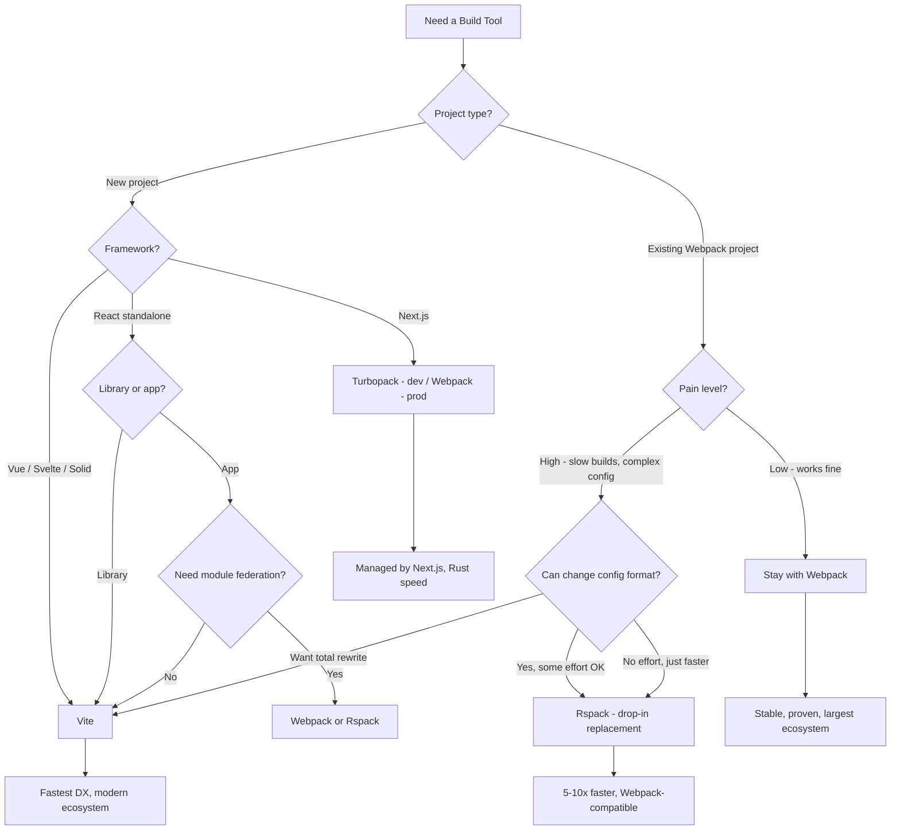

# Vite vs Webpack vs Turbopack vs Rspack

Bundlers are the engine room of frontend development — they transform your source code into optimized assets for the browser. The bundler war has intensified with Rust-based newcomers challenging the JavaScript incumbents. This page compares the four most relevant bundlers across every dimension that matters.

## Overview

### Vite

Vite (French for "quick") is a build tool created by Evan You in 2020. In development, Vite serves source files over native ES modules — the browser makes individual HTTP requests for each module, and Vite transforms them on-demand using esbuild. This eliminates the bundling step during development entirely, making dev server startup nearly instant regardless of project size. For production, Vite uses Rollup (switching to Rolldown in Vite 6+) to bundle optimized output. Vite has become the default build tool for Vue, Svelte, SolidJS, and most new React projects.

### Webpack

Webpack is the build tool that defined modern frontend development, created by Tobias Koppers in 2012. It bundles everything — JavaScript, CSS, images, fonts, WASM — into an optimized dependency graph. Webpack's loader and plugin system is the most extensive in the ecosystem, with thousands of community plugins covering every conceivable use case. Webpack 5 introduced module federation (micro-frontends), persistent caching, and improved tree shaking. It powers most existing production applications including Next.js (production builds).

### Turbopack

Turbopack is a Rust-based bundler created by Vercel in 2022, led by Tobias Koppers (Webpack's creator). It is designed as Webpack's successor, using incremental computation to avoid redundant work across builds. Turbopack is integrated into Next.js as the development bundler (replacing Webpack in dev mode) and aims to provide Webpack-level features with Rust-level speed. As of 2026, Turbopack is stable for Next.js development but not yet available as a standalone bundler.

### Rspack

Rspack is a Rust-based bundler created by ByteDance in 2023. Unlike Turbopack, Rspack is designed as a drop-in Webpack replacement — it implements the Webpack API, supports most Webpack loaders and plugins, and uses `rspack.config.js` that mirrors `webpack.config.js`. This makes migration from Webpack straightforward. Rspack is 5-10x faster than Webpack while maintaining API compatibility.

## Architecture Comparison

```mermaid
graph TB
    subgraph Vite["Vite — Unbundled Dev, Rollup Prod"]
        V1[Source Files] --> V2{Mode?}
        V2 -->|Dev| V3[Native ESM Server]
        V3 --> V4[esbuild Transform - on demand]
        V4 --> V5[Browser - individual module requests]
        V2 -->|Prod| V6[Rollup / Rolldown Bundle]
        V6 --> V7[Optimized Chunks]
    end

    subgraph Webpack["Webpack — Full Bundle Always"]
        W1[Source Files] --> W2[Dependency Graph]
        W2 --> W3[Loaders - transform each file]
        W3 --> W4[Plugins - optimize bundles]
        W4 --> W5[Bundled Output]
    end

    subgraph Turbopack["Turbopack — Incremental Rust Engine"]
        T1[Source Files] --> T2[Incremental Graph - Rust]
        T2 --> T3[Cached Computation]
        T3 --> T4[Partial Bundling]
        T4 --> T5[Output]
    end

    subgraph Rspack["Rspack — Webpack-compatible Rust"]
        R1[Source Files] --> R2[Dependency Graph - Rust]
        R2 --> R3[Webpack Loaders + Native Transforms]
        R3 --> R4[Webpack-compatible Plugins]
        R4 --> R5[Bundled Output]
    end
```



### Key Architectural Differences

**Vite** does not bundle during development. It serves source files as native ES modules, transforming each file individually with esbuild when the browser requests it. This means startup time is O(1) — it does not increase with project size. The tradeoff is that the first page load in dev can be slow (many HTTP requests), and there is a difference between dev (unbundled ESM) and production (bundled Rollup) behavior.

**Webpack** builds a complete dependency graph, transforms every file through loaders, and produces optimized bundles. This means startup time is O(n) — it scales with project size. However, Webpack's persistent cache (`cache: { type: 'filesystem' }`) dramatically improves subsequent startups. Production output is highly optimized.

**Turbopack** uses function-level incremental computation in Rust. Every function's result is cached, and when inputs change, only the affected computations re-run. This gives Rust-level speed with Webpack-level features. It is tightly coupled to Next.js and not yet a general-purpose tool.

**Rspack** reimplements Webpack's architecture in Rust, replacing JavaScript execution with native code. It supports Webpack's loader and plugin APIs, so existing Webpack configurations work with minimal changes. Built-in support for TypeScript, JSX, and CSS eliminates the need for many loaders.

## Feature Matrix

| Feature | Vite 6 | Webpack 5 | Turbopack | Rspack 1.x |
|---|---|---|---|---|
| **Language** | JS (esbuild/Rollup/Rolldown) | JavaScript | Rust | Rust |
| **Dev server** | Native ESM (no bundling) | Dev server (full bundling) | Incremental (partial bundling) | Dev server (fast bundling) |
| **Production bundler** | Rollup / Rolldown | Webpack | Not yet standalone | Rspack |
| **HMR** | Native ESM HMR | Webpack HMR | Turbo HMR | Webpack HMR compatible |
| **TypeScript** | esbuild (type-strip, no checking) | ts-loader / babel | Built-in | Built-in (SWC) |
| **JSX** | esbuild | babel-loader | Built-in | Built-in (SWC) |
| **CSS** | Native, PostCSS, CSS Modules | css-loader, style-loader, MiniCSS | Built-in | Built-in |
| **CSS-in-JS** | Plugin-based | Loader-based | Built-in (styled-jsx) | Loader-based |
| **Code splitting** | Rollup (dynamic import) | SplitChunksPlugin | Automatic | SplitChunksPlugin compatible |
| **Tree shaking** | Rollup (excellent) | Good (improved in v5) | Yes | Yes |
| **Module federation** | Plugin (@module-federation/vite) | Built-in (v5) | Not yet | Built-in |
| **Asset handling** | Built-in (import, ?url, ?raw) | file-loader, url-loader | Built-in | Built-in |
| **Environment variables** | import.meta.env | DefinePlugin | Built-in | DefinePlugin compatible |
| **Source maps** | Built-in | Built-in | Built-in | Built-in |
| **Persistent cache** | Dependency pre-bundling cache | Filesystem cache | Function-level cache | Filesystem cache |
| **Plugin ecosystem** | Rollup plugins + Vite plugins | Largest (thousands) | Next.js only | Webpack loaders + Rspack plugins |
| **Config complexity** | Low (vite.config.ts) | High (webpack.config.js) | Managed by Next.js | Medium (rspack.config.js) |
| **SSR** | Built-in | Plugin-based | Next.js managed | Plugin-based |
| **Library mode** | Built-in | Built-in | No | Built-in |
| **Multi-page** | Built-in | Manual config | Next.js pages | Manual config |

## Code Comparison

### Configuration

::: code-group

```ts [Vite]
// vite.config.ts
import { defineConfig } from 'vite';
import react from '@vitejs/plugin-react';

export default defineConfig({
  plugins: [react()],
  resolve: {
    alias: { '@': '/src' },
  },
  server: {
    port: 3000,
    proxy: {
      '/api': 'http://localhost:8080',
    },
  },
  build: {
    target: 'es2022',
    sourcemap: true,
    rollupOptions: {
      output: {
        manualChunks: {
          vendor: ['react', 'react-dom'],
        },
      },
    },
  },
});
```

```js [Webpack]
// webpack.config.js
const path = require('path');
const HtmlWebpackPlugin = require('html-webpack-plugin');
const MiniCssExtractPlugin = require('mini-css-extract-plugin');
const TerserPlugin = require('terser-webpack-plugin');

module.exports = {
  entry: './src/index.tsx',
  output: {
    path: path.resolve(__dirname, 'dist'),
    filename: '[name].[contenthash].js',
    clean: true,
  },
  resolve: {
    extensions: ['.ts', '.tsx', '.js', '.jsx'],
    alias: { '@': path.resolve(__dirname, 'src') },
  },
  module: {
    rules: [
      {
        test: /\.tsx?$/,
        use: 'ts-loader',
        exclude: /node_modules/,
      },
      {
        test: /\.css$/,
        use: [MiniCssExtractPlugin.loader, 'css-loader', 'postcss-loader'],
      },
      {
        test: /\.(png|svg|jpg|gif)$/,
        type: 'asset/resource',
      },
    ],
  },
  plugins: [
    new HtmlWebpackPlugin({ template: './index.html' }),
    new MiniCssExtractPlugin({ filename: '[name].[contenthash].css' }),
  ],
  optimization: {
    minimizer: [new TerserPlugin()],
    splitChunks: {
      cacheGroups: {
        vendor: {
          test: /[\\/]node_modules[\\/]/,
          name: 'vendor',
          chunks: 'all',
        },
      },
    },
  },
  devServer: {
    port: 3000,
    proxy: [{ context: ['/api'], target: 'http://localhost:8080' }],
  },
  cache: { type: 'filesystem' },
};
```

```js [Rspack]
// rspack.config.js
const { HtmlRspackPlugin } = require('@rspack/core');

module.exports = {
  entry: './src/index.tsx',
  output: {
    filename: '[name].[contenthash].js',
    clean: true,
  },
  resolve: {
    extensions: ['.ts', '.tsx', '.js', '.jsx'],
    alias: { '@': path.resolve(__dirname, 'src') },
  },
  module: {
    rules: [
      {
        test: /\.tsx?$/,
        use: {
          loader: 'builtin:swc-loader', // Built-in, no npm install needed
          options: {
            jsc: { parser: { syntax: 'typescript', tsx: true } },
          },
        },
      },
      {
        test: /\.css$/,
        type: 'css', // Built-in CSS handling
      },
    ],
  },
  plugins: [new HtmlRspackPlugin({ template: './index.html' })],
  optimization: {
    splitChunks: {
      cacheGroups: {
        vendor: {
          test: /[\\/]node_modules[\\/]/,
          name: 'vendor',
          chunks: 'all',
        },
      },
    },
  },
  devServer: {
    port: 3000,
    proxy: [{ context: ['/api'], target: 'http://localhost:8080' }],
  },
};
```

:::

::: tip Configuration comparison
Vite's config is 25 lines. Webpack's is 60+ lines. Rspack's is in between — it uses Webpack's API but eliminates many loaders with built-in transforms. This is not just cosmetic: simpler config means fewer dependencies, fewer version conflicts, and faster onboarding.
:::

### Plugin/Loader Example

::: code-group

```ts [Vite Plugin]
// vite-plugin-markdown.ts
import { Plugin } from 'vite';
import { marked } from 'marked';

export function markdown(): Plugin {
  return {
    name: 'vite-plugin-markdown',
    transform(code, id) {
      if (!id.endsWith('.md')) return;
      const html = marked(code);
      return {
        code: `export default ${JSON.stringify(html)}`,
        map: null,
      };
    },
  };
}
```

```js [Webpack Loader]
// markdown-loader.js
const { marked } = require('marked');

module.exports = function (source) {
  const html = marked(source);
  return `export default ${JSON.stringify(html)}`;
};

// webpack.config.js — must also register:
// { test: /\.md$/, use: './markdown-loader.js' }
```

:::

## Performance

### Dev Server Startup

| Project Size | Vite | Webpack (cold) | Webpack (cached) | Turbopack | Rspack |
|---|---|---|---|---|---|
| **Small (50 modules)** | 300ms | 3s | 800ms | 200ms | 400ms |
| **Medium (500 modules)** | 400ms | 12s | 2s | 400ms | 1.5s |
| **Large (2,000 modules)** | 600ms | 45s | 5s | 800ms | 3s |
| **Huge (10,000 modules)** | 1.2s | 120s+ | 15s | 1.5s | 8s |

::: tip Vite's startup secret
Vite's startup time barely increases with project size because it does not bundle during development. The "startup" is just launching an HTTP server. The cost shifts to the first page load, where the browser makes many individual module requests. For most projects, this tradeoff is dramatically better than waiting for a full bundle.
:::

### Hot Module Replacement (HMR)

| Project Size | Vite | Webpack | Turbopack | Rspack |
|---|---|---|---|---|
| **Small** | 20ms | 200ms | 15ms | 50ms |
| **Medium** | 30ms | 500ms | 20ms | 80ms |
| **Large** | 50ms | 1-3s | 30ms | 150ms |
| **Huge** | 80ms | 3-10s | 50ms | 300ms |

### Production Build

| Project Size | Vite (Rollup) | Webpack | Rspack |
|---|---|---|---|
| **Small** | 2s | 5s | 1s |
| **Medium** | 8s | 20s | 3s |
| **Large** | 25s | 60s | 8s |
| **Huge** | 60s | 180s+ | 20s |

::: warning Dev vs prod consistency
Vite uses different tools for development (esbuild/native ESM) and production (Rollup). This can cause subtle differences — a feature that works in dev might break in production. Webpack, Rspack, and Turbopack use the same engine for both modes, ensuring consistency. Vite 6+ with Rolldown aims to close this gap.
:::

### Bundle Output Size

| Metric | Vite (Rollup) | Webpack 5 | Rspack |
|---|---|---|---|
| **Tree shaking quality** | Excellent | Good | Good |
| **Code splitting** | Good | Excellent (granular control) | Excellent |
| **CSS extraction** | Built-in | MiniCssExtractPlugin | Built-in |
| **Asset inlining** | Configurable (assetsInlineLimit) | url-loader equivalent | Configurable |
| **Minification** | esbuild (fast) or terser | terser (slower, better) | SWC (fast) |

## Developer Experience

### Learning Curve

| Aspect | Vite | Webpack | Turbopack | Rspack |
|---|---|---|---|---|
| **Time to working project** | 2 min (`npm create vite`) | 15-30 min | 2 min (`create-next-app`) | 10-15 min |
| **Config complexity** | Low | High | None (Next.js manages) | Medium (Webpack-like) |
| **Concept count** | Low (plugins, server, build) | High (loaders, plugins, resolve, entry, output, optimization) | Very low (managed) | Medium (Webpack concepts) |
| **Debugging** | Easy (source maps, clear errors) | Hard (loader chains, plugin ordering) | Easy (managed) | Medium |
| **Documentation** | Excellent | Good (but dense) | Minimal (part of Next.js docs) | Good |

### Ecosystem

| Category | Vite | Webpack | Turbopack | Rspack |
|---|---|---|---|---|
| **Plugin count** | 500+ (plus Rollup plugins) | 5,000+ | N/A (Next.js only) | Webpack loaders + Rspack plugins |
| **Framework support** | React, Vue, Svelte, Solid, Qwik | All | Next.js only | React, Vue (via Rsbuild) |
| **Meta-framework** | Nuxt, SvelteKit, Remix, Astro | Next.js (prod) | Next.js (dev) | Rsbuild (standalone) |
| **CSS frameworks** | All (native PostCSS, Tailwind) | All (via loaders) | All | All |
| **Testing** | Vitest (native) | Jest | Jest | Jest or Vitest |

## When to Use Which



### Decision Summary

| Scenario | Best Choice | Why |
|---|---|---|
| **New project (any framework)** | Vite | Fastest DX, simplest config, modern default |
| **Next.js project** | Turbopack (dev) | Built-in, Vercel-managed, Rust speed |
| **Existing large Webpack project** | Rspack | Drop-in replacement, 5-10x faster |
| **Micro-frontends** | Webpack or Rspack | Module federation support |
| **Library authoring** | Vite (library mode) | Simple config, good tree shaking |
| **Enterprise with Webpack infra** | Rspack | Minimal migration, huge speed gain |
| **Maximum build speed** | Rspack | Rust-native, fastest production builds |
| **Maximum ecosystem** | Webpack | Most plugins, most examples |
| **Monorepo** | Vite or Rspack | Good workspace support, fast |

## Migration

### Webpack to Vite

1. **Install**: `npm install -D vite @vitejs/plugin-react`
2. **Create config**: `vite.config.ts` with framework plugin
3. **Move index.html**: From `/public/index.html` to root, add `<script type="module" src="/src/main.tsx">`
4. **Replace env vars**: `process.env.REACT_APP_*` becomes `import.meta.env.VITE_*`
5. **Replace imports**: `require()` becomes `import`, asset imports use `?url` or `?raw`
6. **Replace loaders**: Most loaders are unnecessary — Vite handles TS, CSS, JSON, assets natively
7. **Update scripts**: `"dev": "vite"`, `"build": "vite build"`
8. **Remove Webpack**: Delete `webpack.config.js` and all Webpack dependencies

::: warning CJS to ESM
The biggest migration pain point is converting CommonJS (`require`, `module.exports`) to ESM (`import`, `export`). Vite requires ESM for source code. This affects not just your code but also how you import certain npm packages that only ship CJS.
:::

### Webpack to Rspack

1. **Install**: `npm install -D @rspack/core @rspack/cli`
2. **Rename config**: `webpack.config.js` becomes `rspack.config.js`
3. **Replace plugins**: `HtmlWebpackPlugin` becomes `HtmlRspackPlugin`, `MiniCssExtractPlugin` becomes `type: 'css'`
4. **Replace loaders**: `ts-loader`/`babel-loader` becomes `builtin:swc-loader`
5. **Keep compatible loaders**: Most Webpack loaders work unchanged in Rspack
6. **Update scripts**: `"dev": "rspack serve"`, `"build": "rspack build"`

```js
// Minimal changes needed:
// Before (webpack.config.js)
const HtmlWebpackPlugin = require('html-webpack-plugin');
module.exports = {
  module: { rules: [{ test: /\.tsx?$/, use: 'ts-loader' }] },
  plugins: [new HtmlWebpackPlugin({ template: './index.html' })],
};

// After (rspack.config.js)
const { HtmlRspackPlugin } = require('@rspack/core');
module.exports = {
  module: { rules: [{ test: /\.tsx?$/, use: 'builtin:swc-loader' }] },
  plugins: [new HtmlRspackPlugin({ template: './index.html' })],
};
```

::: tip Rspack is the easiest migration
If you have a large Webpack project and want faster builds without rewriting your config, Rspack is the lowest-effort migration path. Most Webpack configs work with 5-10 lines of changes. Migrating to Vite requires a more significant rewrite.
:::

## Verdict

**Choose Vite** for any new project in 2026. It has the fastest development experience, the simplest configuration, and is the default build tool for Vue, Svelte, Solid, Remix, and an increasing number of React projects. Vite's ecosystem is mature, its plugin API is clean, and Vitest provides a testing framework that shares the same config. The only significant tradeoff is the dev/prod behavior gap (being addressed by Rolldown).

**Choose Webpack** if you have existing Webpack infrastructure, need module federation for micro-frontends, or rely on specific Webpack plugins that do not have Vite equivalents. Webpack is battle-tested and will remain in production for years. However, for new projects, the configuration complexity and slower build times make it hard to recommend over Vite or Rspack.

**Choose Turbopack** if you are using Next.js. Vercel is investing heavily in Turbopack as Next.js's default development bundler, and it provides a significant speed improvement over Webpack. You do not need to configure or even think about Turbopack — Next.js manages it. For non-Next.js projects, Turbopack is not yet available as a standalone tool.

**Choose Rspack** if you have a large existing Webpack project and want 5-10x faster builds with minimal migration effort. Rspack is the pragmatic choice for enterprises — you keep your Webpack knowledge, your Webpack loaders, and most of your Webpack config, but everything runs in Rust. ByteDance uses Rspack across thousands of internal projects, proving its production readiness.
