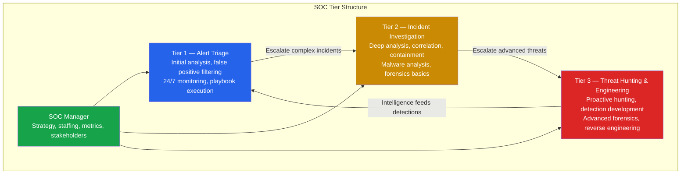
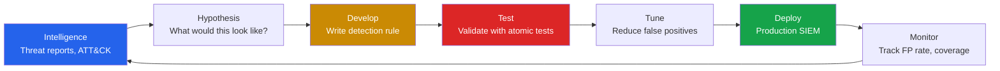
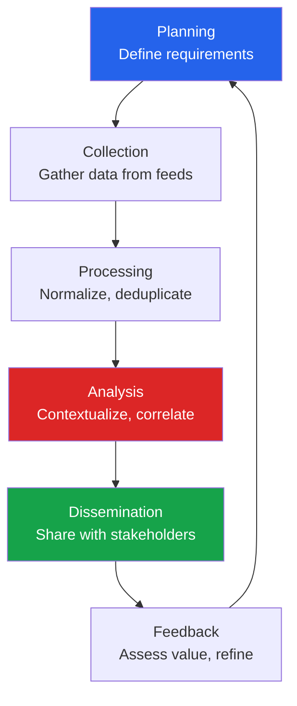
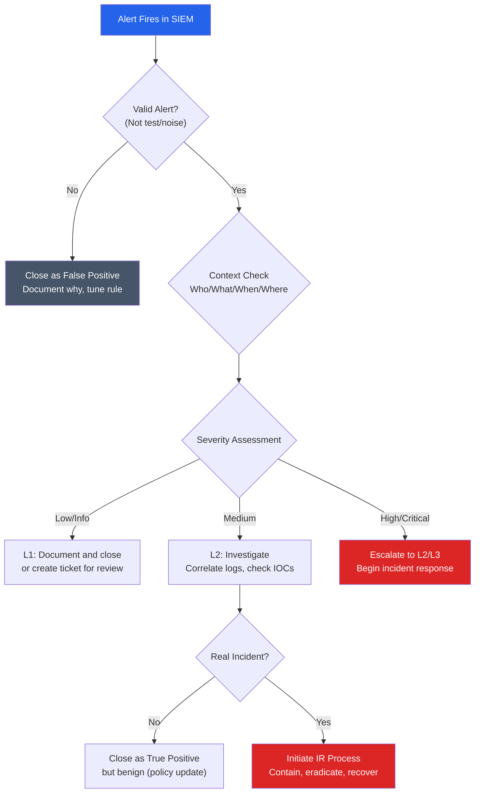
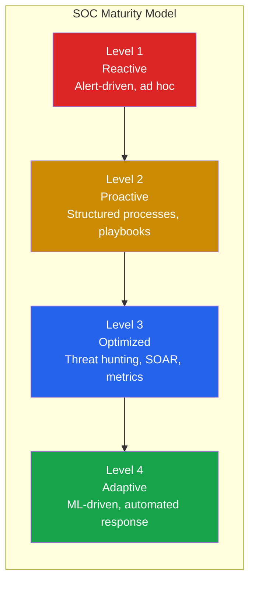
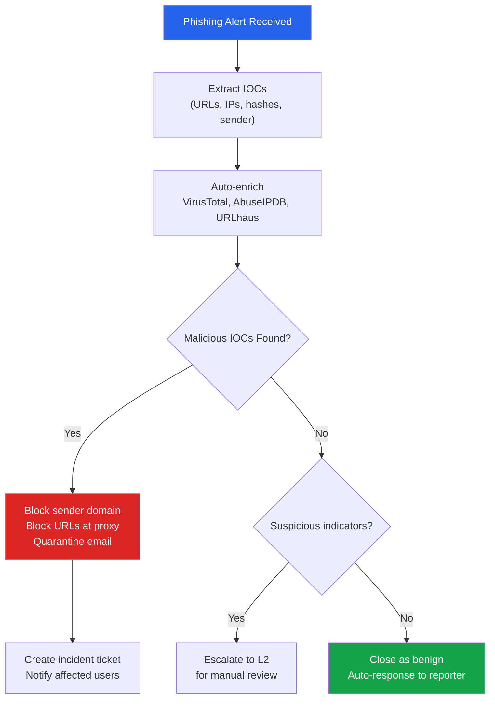

# Blue Team & SOC Operations

The Security Operations Center (SOC) is the nerve center of an organization's defensive security capability. SOC analysts monitor, detect, investigate, and respond to security incidents around the clock. Blue team engineering goes further — building the detections, tuning the alerts, and designing the infrastructure that makes the SOC effective.

This page covers the operational structure of a SOC, the tools used for detection and investigation, how to build effective detection rules, and the metrics that measure SOC performance. If you want to understand what happens after an alert fires, this is where you start.

**Related**: [Cybersecurity Overview](/cybersecurity/) | [Red Team Operations](/cybersecurity/red-team-ops) | [Active Directory](/cybersecurity/active-directory) | [Malware Analysis](/cybersecurity/malware-analysis)

---

## SOC Organizational Structure

### SOC Tiers

Modern SOCs use a tiered model where analysts at different levels handle incidents of increasing complexity.



### Roles and Responsibilities

| Tier | Title | Responsibilities | Skills Required | Avg Salary (US) |
|------|-------|-----------------|-----------------|-----------------|
| **L1** | SOC Analyst | Monitor dashboards, triage alerts, execute playbooks, escalate | SIEM basics, networking, OS fundamentals | $55K-$75K |
| **L2** | Incident Responder | Investigate escalated incidents, perform containment, correlate events | Log analysis, malware triage, forensics | $75K-$110K |
| **L3** | Threat Hunter / Detection Engineer | Proactive hunting, build detection rules, tune SIEM, tool development | Advanced forensics, scripting, ATT&CK expertise | $110K-$160K |
| **—** | SOC Manager | Team leadership, metrics reporting, process improvement, vendor management | Leadership, communication, security strategy | $130K-$180K |

---

## SIEM Platforms

Security Information and Event Management (SIEM) platforms aggregate logs from every source in the environment, correlate events, and trigger alerts.

### SIEM Comparison

| Feature | Splunk Enterprise | Elastic SIEM | Microsoft Sentinel | QRadar |
|---------|------------------|-------------|-------------------|---------|
| **Deployment** | On-prem / Cloud | On-prem / Cloud | Cloud-only (Azure) | On-prem / Cloud |
| **Query Language** | SPL | KQL / Lucene | KQL | AQL |
| **Pricing Model** | Data volume (GB/day) | Nodes / self-managed | Data ingestion (GB/day) | EPS (events/sec) |
| **Strengths** | Mature ecosystem, SPL power | Open source core, cost-effective | Azure integration, AI/ML | IBM ecosystem, compliance |
| **Weaknesses** | Expensive at scale | Complex cluster management | Azure lock-in | Declining market share |
| **Best For** | Large enterprise, complex analysis | Cost-conscious, technical teams | Microsoft-heavy environments | Regulated industries |

### Splunk SPL Essentials

```spl
# Basic search — find failed logins in the last 24 hours
index=windows sourcetype=WinEventLog EventCode=4625
| stats count by src_ip, user
| sort -count
| where count > 10

# Detect Kerberoasting — TGS requests with RC4 encryption
index=windows sourcetype=WinEventLog EventCode=4769 Ticket_Encryption_Type=0x17
| where ServiceName != "$*"
| stats count by ServiceName, Client_Address
| where count > 5

# Detect lateral movement — PsExec-style service creation
index=windows sourcetype=WinEventLog EventCode=7045
| where Service_Name != "Windows Update" AND Service_Name != "BITS"
| table _time, ComputerName, Service_Name, Service_File_Name

# PowerShell suspicious commands
index=windows sourcetype=WinEventLog EventCode=4104
| search ScriptBlockText="*Invoke-Mimikatz*" OR ScriptBlockText="*Invoke-Kerberoast*"
| table _time, ComputerName, ScriptBlockText

# Network connection anomalies
index=firewall action=allowed dest_port=443
| stats count dc(dest_ip) as unique_destinations by src_ip
| where unique_destinations > 100
```

### Elastic SIEM / KQL

```
# KQL — Detect suspicious PowerShell execution
event.code: "4104" and powershell.file.script_block_text: (*downloadstring* or *invoke-expression* or *iex* or *bypass*)

# KQL — Failed authentication from multiple sources
event.code: "4625" | stats count by source.ip, user.name | where count > 10

# KQL — Process execution from unusual paths
process.executable: (*\\Temp\\* or *\\AppData\\* or *\\Downloads\\*) and not process.name: (chrome.exe or firefox.exe or msedge.exe)
```

### Microsoft Sentinel (KQL)

```kql
// Detect brute force attacks
SecurityEvent
| where EventID == 4625
| summarize FailedAttempts = count() by TargetAccount, IpAddress, bin(TimeGenerated, 1h)
| where FailedAttempts > 20
| project TimeGenerated, TargetAccount, IpAddress, FailedAttempts

// Detect anomalous sign-ins (Azure AD)
SigninLogs
| where ResultType != "0"
| summarize FailureCount = count() by UserPrincipalName, IPAddress, Location
| where FailureCount > 10

// Detect DCSync indicators
SecurityEvent
| where EventID == 4662
| where Properties has "1131f6aa-9c07-11d1-f79f-00c04fc2dcd2"
| where SubjectUserName !endswith "$"
| project TimeGenerated, SubjectUserName, ObjectName
```

---

## Detection Engineering

Detection engineering is the practice of building, testing, and maintaining detection rules that identify malicious activity with high precision and low false positive rates.

### Detection Lifecycle



### Sigma Rules

Sigma is a vendor-agnostic format for detection rules. Write once, convert to any SIEM platform.

```yaml
# Sigma rule — Detect suspicious PowerShell execution
title: Suspicious PowerShell Download Cradle
id: 3b6ab547-8ec2-4991-b5b6-1e5d7fd6f5f3
status: production
description: Detects PowerShell commands commonly used to download and execute payloads
author: SOC Team
date: 2026/03/20
references:
    - https://attack.mitre.org/techniques/T1059/001/
tags:
    - attack.execution
    - attack.t1059.001
logsource:
    product: windows
    category: ps_script
    definition: 'Script Block Logging must be enabled'
detection:
    selection_download:
        ScriptBlockText|contains:
            - 'DownloadString'
            - 'DownloadFile'
            - 'Invoke-WebRequest'
            - 'wget '
            - 'curl '
            - 'Start-BitsTransfer'
    selection_exec:
        ScriptBlockText|contains:
            - 'Invoke-Expression'
            - 'IEX('
            - 'IEX ('
            - 'iex('
    condition: selection_download and selection_exec
falsepositives:
    - Legitimate admin scripts that download and execute
    - Software deployment tools
level: high
```

```bash
# Convert Sigma rules to SIEM-specific formats
# Install sigmac (Sigma converter)
pip install sigma-cli

# Convert to Splunk SPL
sigma convert -t splunk -p sysmon suspicious_powershell.yml

# Convert to Elastic KQL
sigma convert -t elasticsearch suspicious_powershell.yml

# Convert to Microsoft Sentinel KQL
sigma convert -t microsoft365defender suspicious_powershell.yml

# Bulk convert entire ruleset
sigma convert -t splunk -p sysmon rules/ --output splunk_rules/
```

### YARA Rules

YARA identifies and classifies malware based on textual or binary patterns. Used for file scanning, memory scanning, and threat hunting.

```yara
rule Mimikatz_Detection {
    meta:
        description = "Detects Mimikatz credential dumping tool"
        author = "SOC Team"
        severity = "critical"
        reference = "https://attack.mitre.org/software/S0002/"

    strings:
        $s1 = "sekurlsa::logonpasswords" ascii wide
        $s2 = "sekurlsa::wdigest" ascii wide
        $s3 = "lsadump::dcsync" ascii wide
        $s4 = "kerberos::golden" ascii wide
        $s5 = "mimikatz" ascii wide nocase
        $s6 = "gentilkiwi" ascii wide

        // Byte patterns for packed/obfuscated variants
        $b1 = { 4D 69 6D 69 6B 61 74 7A }
        $b2 = { 6D 69 6D 69 6B 61 74 7A }

    condition:
        uint16(0) == 0x5A4D and  // PE file
        (any of ($s*)) or
        (2 of ($b*))
}

rule Cobalt_Strike_Beacon {
    meta:
        description = "Detects Cobalt Strike beacon payloads"
        author = "SOC Team"
        severity = "critical"

    strings:
        $config = { 00 01 00 01 00 02 ?? ?? 00 02 00 01 00 02 ?? ?? }
        $sleep_mask = "SleepMask" ascii
        $pipe = "\\\\.\\pipe\\msagent_" ascii

    condition:
        uint16(0) == 0x5A4D and
        ($config or $sleep_mask or $pipe)
}
```

---

## Threat Intelligence

### Threat Intelligence Lifecycle



### Intelligence Types

| Type | Description | Example | Consumer |
|------|-------------|---------|----------|
| **Strategic** | High-level trends, motivations, geopolitics | "APT28 is targeting NATO defense contractors" | Leadership, CISO |
| **Tactical** | TTPs used by adversaries, mapped to ATT&CK | "Threat actors use DLL sideloading via OneDrive" | Detection engineers |
| **Operational** | Specific campaigns, timelines, infrastructure | "Campaign X uses domain evil.com, IP 1.2.3.4" | Incident responders |
| **Technical** | IOCs: hashes, IPs, domains, URLs | `malware.exe` SHA256: `abc123...` | SIEM, EDR, firewalls |

### Threat Intel Platforms & Feeds

| Platform | Type | Cost | Strengths |
|----------|------|------|-----------|
| **MISP** | Open source TIP | Free | Community sharing, STIX/TAXII |
| **OpenCTI** | Open source TIP | Free | Knowledge graph, ATT&CK mapping |
| **AlienVault OTX** | Community feed | Free | Large community, pulse system |
| **VirusTotal** | File/URL analysis | Free tier + Enterprise | Multi-AV scanning, behavior |
| **Recorded Future** | Commercial TIP | $$$$ | AI-powered, comprehensive |
| **CrowdStrike Falcon Intel** | Commercial feed | $$$ | Actor profiles, real-time alerts |
| **Abuse.ch** | Community feeds | Free | URLhaus, MalwareBazaar, ThreatFox |

---

## Alert Triage Workflow

A structured triage workflow prevents alert fatigue and ensures consistent investigation quality.



### Triage Checklist

```markdown
## Alert Triage Template

### 1. Initial Assessment (< 5 minutes)
- [ ] Read alert title and description
- [ ] Check if source IP/user is known (VIP, service account, scanner)
- [ ] Check alert history — has this fired before? How was it resolved?
- [ ] Check threat intel — are IOCs in any feeds?

### 2. Context Gathering (< 15 minutes)
- [ ] Pivot on source IP: What other activity from this IP in the last 24h?
- [ ] Pivot on user: Is this normal behavior for this user/role?
- [ ] Pivot on destination: Is this a legitimate service/server?
- [ ] Check EDR: Any endpoint alerts on the same host?
- [ ] Check network: Any unusual traffic patterns?

### 3. Decision
- [ ] False Positive → Document, tune rule, close
- [ ] True Positive, benign → Document, close (consider policy)
- [ ] True Positive, malicious → Escalate, begin IR
```

::: tip Reducing Alert Fatigue
The average SOC receives 10,000+ alerts per day. Most are false positives. To combat fatigue:
1. **Tune rules aggressively** — Every FP that repeats should be filtered
2. **Use risk scoring** — Aggregate low-fidelity signals into high-confidence alerts
3. **Automate triage** — SOAR playbooks handle repetitive investigation steps
4. **Enrich automatically** — Auto-lookup IPs, hashes, domains against threat intel
5. **Track FP rates per rule** — Rules above 90% FP rate need rewriting or removal
:::

---

## SOC KPIs and Metrics

### Key Performance Indicators

| Metric | Definition | Target | How to Improve |
|--------|-----------|--------|----------------|
| **MTTD** (Mean Time to Detect) | Time from attack to first alert | < 24 hours | Better detection rules, more log sources |
| **MTTR** (Mean Time to Respond) | Time from alert to containment | < 4 hours | SOAR automation, clear playbooks |
| **MTTA** (Mean Time to Acknowledge) | Time from alert to analyst assignment | < 15 minutes | Proper staffing, alert routing |
| **False Positive Rate** | % of alerts that are benign | < 40% | Tune rules, add context, risk scoring |
| **Detection Coverage** | % of ATT&CK techniques with detections | > 70% | Gap analysis, new data sources |
| **Alert Volume** | Alerts per analyst per shift | < 50 actionable | Tune, deduplicate, automate |
| **Dwell Time** | Time attacker is undetected in network | < 7 days | Threat hunting, better visibility |



---

## Log Sources and Visibility

A SOC is only as good as its data sources. Missing logs means missing attacks.

| Log Source | What It Shows | Critical Events |
|------------|--------------|-----------------|
| **Windows Security Log** | Authentication, process creation, object access | 4624, 4625, 4688, 4662, 4769 |
| **Sysmon** | Enhanced process, network, file monitoring | Event 1 (process), 3 (network), 11 (file create) |
| **EDR Telemetry** | Endpoint behavior, process trees, file writes | Varies by vendor |
| **Firewall Logs** | Network connections allowed/denied | Outbound to suspicious IPs/ports |
| **DNS Logs** | Domain resolution queries | Queries to known-bad domains, DGA patterns |
| **Proxy/Web Gateway** | HTTP/S traffic, URLs visited | Downloads of executables, C2 traffic |
| **Email Gateway** | Inbound/outbound email, attachments | Phishing attempts, malicious attachments |
| **Cloud Audit Logs** | API calls, IAM changes, resource creation | Privilege escalation, data access |
| **Authentication Logs** | SSO, MFA, VPN logins | Impossible travel, credential stuffing |

::: warning Critical: Enable These Logs
Many organizations lack visibility because key logs are not enabled:
- **PowerShell Script Block Logging** (Event 4104) — Reveals obfuscated PowerShell
- **Sysmon** — Provides process, network, and file visibility far beyond default Windows logging
- **Windows command-line audit** (Event 4688 with process command line) — Shows what processes are doing
- **DNS query logging** — Essential for detecting C2, tunneling, and DGA domains
:::

---

## SOAR (Security Orchestration, Automation, and Response)

SOAR platforms automate repetitive SOC tasks through playbooks.

| Platform | Type | Strengths |
|----------|------|-----------|
| **Splunk SOAR (Phantom)** | Commercial | Deep Splunk integration |
| **Microsoft Sentinel + Logic Apps** | Cloud | Azure ecosystem |
| **Cortex XSOAR (Palo Alto)** | Commercial | Large integration library |
| **Shuffle** | Open source | Free, community-driven |
| **TheHive** | Open source | Case management + Cortex analyzers |

### Example SOAR Playbook: Phishing Triage



---

## Further Reading

- [Red Team Operations](/cybersecurity/red-team-ops) — Understanding the adversary perspective
- [Active Directory Attacks & Defense](/cybersecurity/active-directory) — AD-specific detections
- [Malware Analysis](/cybersecurity/malware-analysis) — Deep dive into malware investigation
- [Security Certifications](/cybersecurity/security-certifications) — CySA+, GCIH, BTL1 for blue team
- [Incident Response & Forensics](/cybersecurity/incident-response-forensics) — IR process and forensic techniques
