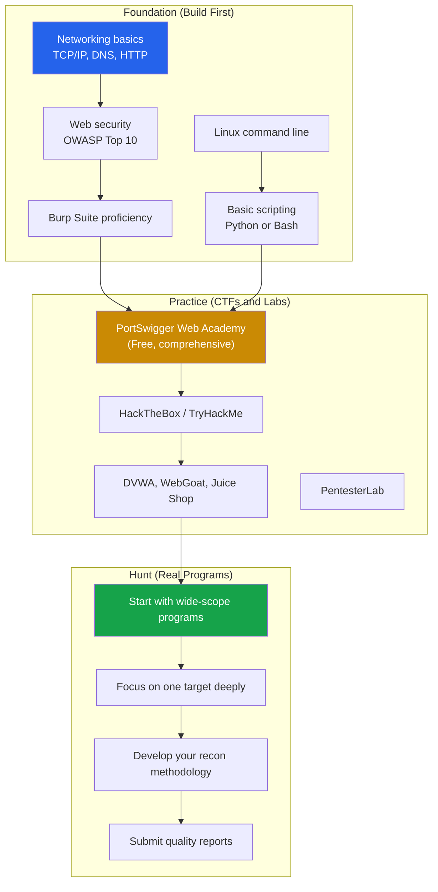
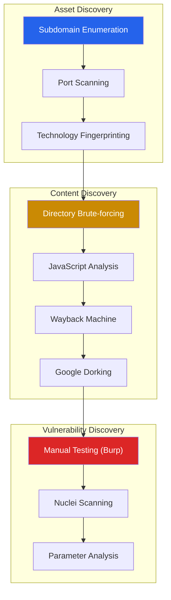
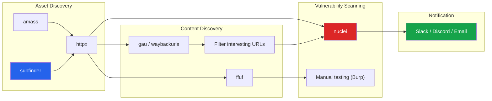
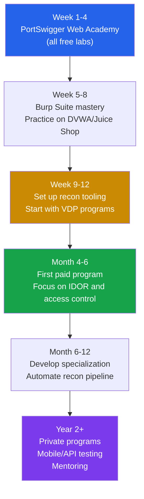

# Bug Bounty Hunting Guide

Bug bounty hunting is the practice of finding security vulnerabilities in organizations' systems and reporting them for rewards. It is the most accessible path into professional security — you need no degree, no certification, and no employment. What you need is skill, persistence, and a systematic methodology.

The best bug bounty hunters earn six to seven figures annually. But most beginners give up within weeks because they lack a structured approach. This page provides the methodology, tools, and mindset to go from your first bug to consistent findings.

**Related**: [Cybersecurity Overview](/cybersecurity/) | [Web App Pentesting](/cybersecurity/web-app-pentesting) | [API Security Testing](/cybersecurity/api-security-testing) | [Mobile Security](/cybersecurity/mobile-security)

::: warning Scope Is Everything
Only test assets listed in the program scope. Out-of-scope testing is unauthorized access. Read the program policy carefully before testing. Some programs exclude certain vulnerability types, subdomains, or testing methods.
:::

---

## Getting Started

### Prerequisites

Before hunting for bugs, you need a foundation. Jumping straight into bug bounties without fundamentals leads to frustration and duplicate reports.



### Bug Bounty Platforms

| Platform | Programs | Avg Payout | Best For | Triage Quality |
|----------|----------|-----------|----------|---------------|
| **HackerOne** | 3000+ | $500-$10K | Beginners, large programs | Good |
| **Bugcrowd** | 1000+ | $300-$5K | VDP + paid, good variety | Good |
| **Intigriti** | 200+ | $500-$8K | European programs | Excellent |
| **YesWeHack** | 500+ | $300-$5K | European programs, CTFs | Good |
| **Synack (Red Team)** | Invite-only | $1K-$20K | Experienced hunters, high payouts | Private |
| **Direct Programs** | Varies | Varies | Google, Microsoft, Apple, Meta | Varies |

::: tip Platform Selection for Beginners
Start on **HackerOne** or **Bugcrowd** with programs that have:
- Wide scope (*.target.com)
- High response rate (> 80%)
- Good signal (bounty table visible)
- Recently launched (less competition)
- VDP (Vulnerability Disclosure Programs) — no bounty but easier to find bugs and build reputation
:::

---

## Reconnaissance Methodology

Recon is the most important phase of bug bounty hunting. The hunter who finds the most assets finds the most bugs. Spend 60-70% of your time on reconnaissance.

### Recon Workflow



### Subdomain Enumeration

```bash
# Passive subdomain enumeration (does not touch the target)

# subfinder — aggregates many sources
subfinder -d target.com -all -o subdomains.txt

# amass — comprehensive OSINT
amass enum -passive -d target.com -o amass_subs.txt

# crt.sh — Certificate Transparency logs
curl -s "https://crt.sh/?q=%25.target.com&output=json" | jq -r '.[].name_value' | sort -u >> ct_subs.txt

# SecurityTrails API
curl -s "https://api.securitytrails.com/v1/domain/target.com/subdomains" \
    -H "APIKEY: YOUR_API_KEY" | jq -r '.subdomains[]' | sed "s/$/.target.com/" >> st_subs.txt

# GitHub dorking for subdomains
# Search: "target.com" site:github.com

# Combine and deduplicate
cat subdomains.txt amass_subs.txt ct_subs.txt st_subs.txt | sort -u > all_subs.txt

# Active resolution — check which subdomains are alive
cat all_subs.txt | httpx -silent -status-code -title -tech-detect -o live_subs.txt

# DNS resolution
cat all_subs.txt | dnsx -silent -a -resp -o resolved.txt
```

### Port Scanning

```bash
# Scan discovered subdomains for open ports
# naabu — fast port scanner
cat live_subs.txt | naabu -top-ports 1000 -silent -o ports.txt

# Nmap for detailed service detection on interesting hosts
nmap -sV -sC -p- --min-rate 1000 -oN detailed_scan.txt interesting_host.target.com

# Combine host:port for httpx probing
cat ports.txt | httpx -silent -status-code -title -o http_services.txt
```

### Content Discovery

```bash
# Directory brute-forcing with ffuf
ffuf -u https://target.com/FUZZ -w /usr/share/seclists/Discovery/Web-Content/raft-large-directories.txt \
    -mc 200,201,204,301,302,307,401,403 -o ffuf_results.json -of json

# Recursive scanning
ffuf -u https://target.com/FUZZ -w /usr/share/seclists/Discovery/Web-Content/raft-medium-words.txt \
    -mc 200,301,302 -recursion -recursion-depth 2

# Wayback Machine — historical URLs
echo "target.com" | gau --threads 5 | sort -u > wayback_urls.txt
echo "target.com" | waybackurls | sort -u >> wayback_urls.txt

# Filter interesting URLs
cat wayback_urls.txt | grep -iE "\.(php|asp|aspx|jsp|json|xml|config|env|sql|bak|old|log)" > interesting_urls.txt
cat wayback_urls.txt | grep -iE "(api|admin|debug|test|staging|internal|dev)" >> interesting_urls.txt

# Google dorking
# site:target.com filetype:pdf
# site:target.com inurl:admin
# site:target.com inurl:api
# site:target.com ext:env | ext:config | ext:xml
# site:target.com intitle:"index of"
```

### JavaScript Analysis

```bash
# Extract JS files from URLs
cat wayback_urls.txt | grep "\.js$" | sort -u > js_files.txt
cat live_subs.txt | getJS --complete | sort -u >> js_files.txt

# Download and analyze JS files for secrets, endpoints, and subdomains
cat js_files.txt | while read url; do
    curl -sk "$url" >> all_js_content.txt
done

# Extract API endpoints from JavaScript
cat all_js_content.txt | grep -oE "(/api/[a-zA-Z0-9_/.-]+)" | sort -u > api_endpoints.txt

# Extract potential secrets
cat all_js_content.txt | grep -oiE "(api_key|apikey|secret|token|password|aws_access)['\"]?\s*[:=]\s*['\"][a-zA-Z0-9_/+=.-]+['\"]" | sort -u > potential_secrets.txt

# LinkFinder — extract endpoints from JS
python3 linkfinder.py -i https://target.com/main.js -o cli

# SecretFinder — find secrets in JS
python3 SecretFinder.py -i https://target.com/main.js -o cli
```

---

## Vulnerability Classes That Pay the Most

| Vulnerability | Avg Bounty | Difficulty to Find | Where to Look |
|--------------|-----------|-------------------|---------------|
| **Remote Code Execution (RCE)** | $10K-$100K+ | Very Hard | File uploads, deserialization, SSTI, command injection |
| **SQL Injection** | $3K-$20K | Medium | Search, filters, sort params, hidden params |
| **SSRF** | $2K-$15K | Medium | URL inputs, webhooks, integrations, PDF generators |
| **Authentication Bypass** | $5K-$30K | Hard | Login flows, password reset, OAuth, JWT |
| **IDOR / BOLA** | $1K-$10K | Easy-Medium | Every API endpoint with an object ID |
| **XSS (Stored)** | $500-$5K | Easy | User input that gets reflected: profiles, comments, names |
| **Information Disclosure** | $200-$3K | Easy | Error messages, debug endpoints, exposed configs |
| **Business Logic** | $1K-$20K | Hard | Payment flows, referral systems, coupon abuse |
| **Subdomain Takeover** | $200-$2K | Easy | Unclaimed CNAME records (GitHub Pages, Heroku, S3) |

### Finding IDORs Systematically

```bash
# IDOR is the most common high-impact vulnerability class
# Step 1: Create two accounts (Account A and Account B)
# Step 2: Map all endpoints that reference user-specific objects
# Step 3: Using Account A's session, access Account B's resources

# Look for IDs in:
# URL paths: /api/v1/users/123/profile
# Query parameters: /api/v1/orders?user_id=123
# Request body: {"account_id": 123}
# Headers: X-User-Id: 123

# Test ID formats:
# Sequential integers: 123, 124, 125
# UUIDs: try other users' UUIDs from elsewhere in the app
# Encoded: base64, hex — decode, modify, re-encode
# Hashed: check if hash is predictable (MD5 of sequential ID)
```

---

## Writing Good Reports

Report quality directly affects your bounty and reputation. A well-written report gets resolved faster and earns higher payouts. A poorly written report gets marked as "needs more info" or "not applicable."

### Report Template

```markdown
## Title
[Vulnerability Type] in [Feature/Endpoint] allows [Impact]
Example: "IDOR in /api/v1/users/{id}/documents allows unauthorized access to any user's documents"

## Severity
Critical / High / Medium / Low
(Use CVSS 3.1 calculator for objectivity)

## Description
Clear, concise explanation of the vulnerability.
What is the root cause? Why does it exist?

## Steps to Reproduce
1. Create Account A (attacker) and Account B (victim)
2. Log in as Account A
3. Navigate to /documents and note your document ID (e.g., 1001)
4. Change the document ID in the URL to Account B's document (e.g., 1002)
5. Observe that Account B's document is returned

## Impact
- An attacker can access any user's private documents
- PII exposure for all users of the platform
- No authentication or special permissions required beyond a valid account
- Estimated affected users: all registered users (~500K based on ID range)

## Proof of Concept
[Screenshots, HTTP requests/responses, video]

## Suggested Fix
- Implement server-side authorization check: verify the authenticated
  user owns the requested resource before returning it
- Example: WHERE document.user_id = authenticated_user.id

## Environment
- Browser: Chrome 120
- OS: macOS 14.0
- Target: app.target.com
- Date: 2026-03-20
```

::: tip Report Writing Best Practices
1. **Be specific** — Include exact URLs, parameters, and payloads
2. **Prove impact** — Do not just show the bug exists; show what damage an attacker could do
3. **Include HTTP requests** — Copy from Burp Suite, not just browser screenshots
4. **One report per vulnerability** — Do not bundle multiple bugs
5. **Do not over-claim severity** — Self-XSS is not Critical; IDOR on public data is not High
6. **Suggest a fix** — Shows understanding and professionalism
7. **Follow up politely** — If no response after 2 weeks, send a polite ping
:::

---

## Automation Pipeline

Automating repetitive recon tasks lets you scale your testing across many targets.



### One-Liner Recon Pipeline

```bash
# Full recon pipeline — subdomain discovery to vulnerability scanning
subfinder -d target.com -silent | \
    httpx -silent -status-code -title -tech-detect | \
    tee alive_hosts.txt | \
    nuclei -t /path/to/nuclei-templates/ -severity medium,high,critical -o vulnerabilities.txt

# Parameter discovery pipeline
echo "target.com" | gau | \
    grep "=" | \
    uro | \
    httpx -silent | \
    nuclei -t /path/to/nuclei-templates/fuzzing/ -o param_vulns.txt

# Subdomain monitoring — run daily with cron
# Compare today's subdomains with yesterday's
subfinder -d target.com -silent > today_subs.txt
comm -13 <(sort yesterday_subs.txt) <(sort today_subs.txt) > new_subs.txt
if [ -s new_subs.txt ]; then
    cat new_subs.txt | httpx -silent | nuclei -t /path/to/nuclei-templates/ -severity medium,high,critical
    # Send notification for new subdomains
    cat new_subs.txt | notify -provider-config notify-config.yaml
fi
mv today_subs.txt yesterday_subs.txt
```

### Nuclei Templates

```bash
# Run Nuclei with community templates
nuclei -u https://target.com -t /path/to/nuclei-templates/ -severity medium,high,critical

# Specific template categories
nuclei -l urls.txt -t /path/to/nuclei-templates/http/cves/          # Known CVEs
nuclei -l urls.txt -t /path/to/nuclei-templates/http/exposures/     # Exposed configs
nuclei -l urls.txt -t /path/to/nuclei-templates/http/misconfiguration/  # Misconfigs
nuclei -l urls.txt -t /path/to/nuclei-templates/http/takeovers/     # Subdomain takeover

# Custom Nuclei template example — check for exposed .env files
```

```yaml
# nuclei-template: detect-env-file.yaml
id: exposed-env-file
info:
  name: Exposed .env File
  author: hunter
  severity: high
  description: Detects exposed .env files containing secrets

http:
  - method: GET
    path:
      - "{​{BaseURL}}/.env"
      - "{​{BaseURL}}/.env.local"
      - "{​{BaseURL}}/.env.production"

    matchers-condition: and
    matchers:
      - type: word
        words:
          - "DB_PASSWORD"
          - "API_KEY"
          - "SECRET_KEY"
          - "AWS_ACCESS"
        condition: or

      - type: status
        status:
          - 200
```

---

## Common Beginner Mistakes

| Mistake | Why It Hurts | Fix |
|---------|-------------|-----|
| **Hunting without fundamentals** | You cannot find what you do not understand | Complete PortSwigger Academy first |
| **Scanning wide, testing shallow** | Automated tools find low-hanging fruit already picked | Go deep on fewer targets |
| **Duplicating known bugs** | Wastes your time and damages reputation | Check disclosed reports before testing |
| **Poor reports** | Reports get closed as "needs more info" | Use the template above, include repro steps |
| **Giving up too fast** | First bugs take weeks to find; it gets faster | Commit to 3 months of consistent effort |
| **Only using automated tools** | Scanners miss business logic, IDORs, auth issues | Use tools for recon, manual testing for bugs |
| **Ignoring the scope** | Out-of-scope testing can get you banned | Read program policy first, every time |
| **Chasing only XSS** | XSS is overcrowded; IDOR/auth bugs pay more | Diversify your skill set |
| **Not learning from others** | Bug bounty write-ups teach real-world patterns | Read write-ups daily (HackerOne Hacktivity) |
| **No notes or tracking** | You forget what you tested, repeat work | Use Notion, Obsidian, or a simple spreadsheet |

---

## Bug Bounty Income Expectations

| Level | Monthly Earnings | Time Investment | Skills |
|-------|-----------------|-----------------|--------|
| **Beginner (0-6 months)** | $0-$500 | 20-40 hrs/week | Basic web security, recon |
| **Intermediate (6-18 months)** | $500-$3K | 20-30 hrs/week | IDOR, SSRF, auth bypass |
| **Advanced (1.5-3 years)** | $3K-$15K | 15-25 hrs/week | Business logic, RCE, mobile |
| **Elite (3+ years)** | $15K-$50K+ | 10-20 hrs/week | Custom tooling, deep specialization |

::: tip Making Bug Bounty Sustainable
1. **Specialize** — Become the best at one vulnerability class (SSRF, IDOR, auth bypass)
2. **Build relationships** — Consistent quality reports on one platform build trust and invite-only access
3. **Automate recon** — Free up time for manual testing where humans beat scanners
4. **Track everything** — Know your hourly rate, best programs, highest-paying vuln types
5. **Take breaks** — Burnout is the biggest threat to long-term success
:::

---

## Recommended Learning Path



---

## Essential Resources

| Resource | Type | Cost | Best For |
|----------|------|------|----------|
| **PortSwigger Web Academy** | Interactive labs | Free | Web vulnerability fundamentals |
| **HackerOne Hacktivity** | Disclosed reports | Free | Learning from real findings |
| **Pentester Land** | Write-up aggregator | Free | Bug bounty write-ups |
| **The Bug Hunters Methodology (TBHM)** | Methodology guide | Free | Recon methodology |
| **Nahamsec (YouTube)** | Video content | Free | Live recon, methodology |
| **STOK (YouTube)** | Video content | Free | Recon, tools, mindset |
| **Bug Bounty Bootcamp (book)** | Book | $40 | Comprehensive guide |
| **Real-World Bug Hunting (book)** | Book | $35 | Vulnerability examples |

---

## Further Reading

- [Web App Pentesting](/cybersecurity/web-app-pentesting) — Detailed web vulnerability testing
- [API Security Testing](/cybersecurity/api-security-testing) — APIs are the top bug bounty target
- [Mobile Security](/cybersecurity/mobile-security) — Mobile app testing for bounties
- [Web3 Security](/cybersecurity/web3-security) — Smart contract bounties (highest payouts)
- [Security Certifications](/cybersecurity/security-certifications) — eJPT, OSCP to complement hunting

---

::: tip Key Takeaway
- Spend 60-70% of your time on reconnaissance — the hunter who finds the most assets finds the most bugs; everyone else is competing on the same main domain
- IDOR/BOLA is the highest-ROI vulnerability class for beginners: easy to find, high impact, and scanners cannot detect it
- Report quality directly impacts your payout and reputation — a clear, well-structured report with reproduction steps and impact demonstration earns 2-3x more than a vague submission
:::

::: details Hands-On Lab
**Lab: Bug Bounty Recon Pipeline**

1. Choose a bug bounty program with wide scope (*.target.com) on HackerOne or Bugcrowd
2. Run the full subdomain enumeration pipeline: subfinder + amass + crt.sh, deduplicate, and probe with httpx
3. Scan all live subdomains with naabu for open ports beyond 80/443
4. Run ffuf directory brute-forcing on the top 10 most interesting subdomains
5. Extract and analyze JavaScript files from discovered URLs using gau and LinkFinder
6. Run Nuclei with community templates against all discovered URLs
7. Set up subdomain monitoring: run the pipeline daily with cron and diff against previous results
8. Document everything in a tracking sheet: target, endpoints tested, findings, status
:::

::: details CTF Challenge
**Challenge: The Forgotten Endpoint**

A bug bounty target has a main application at `app.target.com`. Your recon reveals a subdomain `api-staging.target.com` that returns 403 on the root path. Find the hidden API documentation, discover an unauthenticated endpoint, and demonstrate data access.

**Hints:**
1. Try common documentation paths: `/swagger.json`, `/api-docs`, `/openapi.json`
2. The staging API may not enforce authentication on all endpoints
3. Check Wayback Machine for historical paths

::: details Answer
Run `ffuf -u https://api-staging.target.com/FUZZ -w api-wordlist.txt` to find `/v2/api-docs` returning the Swagger specification. The spec reveals `GET /api/v2/users/{id}` which does not require authentication on the staging environment. Access `GET /api/v2/users/1` to retrieve user data. Flag: `CTF{staging_apis_forget_auth}`. Write a report: BOLA on staging API, P2 severity, recommend adding authentication and restricting staging access.
:::
:::

::: warning Common Misconceptions
- **"Bug bounty hunting is easy money"** — Most beginners earn nothing for the first few months. Consistent earnings require 3-6 months of dedicated skill building, methodology development, and target familiarity.
- **"Run scanners and submit what they find"** — Scanner findings are usually duplicates or false positives. The bugs that pay well (IDOR, auth bypass, business logic) require manual testing.
- **"You need expensive tools to hunt"** — The most successful hunters use free tools: Burp Community, ffuf, subfinder, httpx, and Nuclei. Skill matters more than tools.
- **"Wide scope means easy bugs"** — Wide scope means more attack surface but also more competition. The advantage is finding forgotten subdomains and staging environments that narrow-scope programs do not expose.
- **"Self-XSS is not worth reporting"** — Most programs accept self-XSS only if you can demonstrate it is exploitable (e.g., via CSRF). Do not report it as a standalone finding unless the program explicitly accepts it.
:::

::: details Quiz
**1. What recon technique is most likely to find bugs that other hunters miss?**

a) Running Nmap on the main domain
b) Deep subdomain enumeration + port scanning on non-standard ports + JavaScript analysis
c) Using only automated scanners
d) Testing only the login page

::: details Answer
b) Comprehensive recon that combines subdomain discovery, full port scanning (not just top-1000), and JavaScript file analysis finds forgotten assets, staging environments, and hidden API endpoints that other hunters overlook.
:::

**2. Why should you test every API endpoint with two different user accounts?**

a) To test performance
b) To find BOLA/IDOR vulnerabilities where one user can access another's resources
c) To test rate limiting
d) To verify the API is working

::: details Answer
b) Using Account A's session to access Account B's resources (by changing IDs in the request) tests for BOLA/IDOR — the most common and impactful API vulnerability class.
:::

**3. What makes a P1 (Critical) bug bounty report?**

a) Any XSS finding
b) Remote code execution, authentication bypass affecting all users, or mass data breach
c) A missing security header
d) An information disclosure

::: details Answer
b) P1/Critical reports demonstrate severe impact: RCE, full authentication bypass, ability to access all users' data, or complete account takeover. The severity is about the impact, not just the vulnerability type.
:::

**4. What is the best strategy for choosing a bug bounty program as a beginner?**

a) Pick the program with the highest payouts
b) Choose programs with wide scope, high response rate, and recent launch
c) Only hunt on invite-only programs
d) Choose the most popular program

::: details Answer
b) Wide scope provides more attack surface, high response rate means your reports will actually be reviewed, and recently launched programs have less competition and more undiscovered bugs.
:::

**5. What is the most important section of a bug bounty report?**

a) The title
b) Steps to reproduce — exact, clear steps anyone can follow
c) The suggested fix
d) Your HackerOne profile link

::: details Answer
b) Steps to reproduce are the most critical section. If the security team cannot reproduce the bug, they will close the report. Include exact URLs, parameters, HTTP requests, and screenshots.
:::
:::

> **One-Liner Summary:** Bug bounty success is 70% reconnaissance, 20% manual testing skill, and 10% clear report writing — and zero percent luck.
