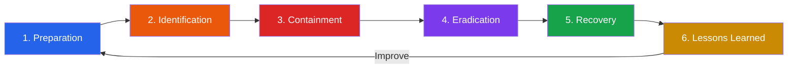
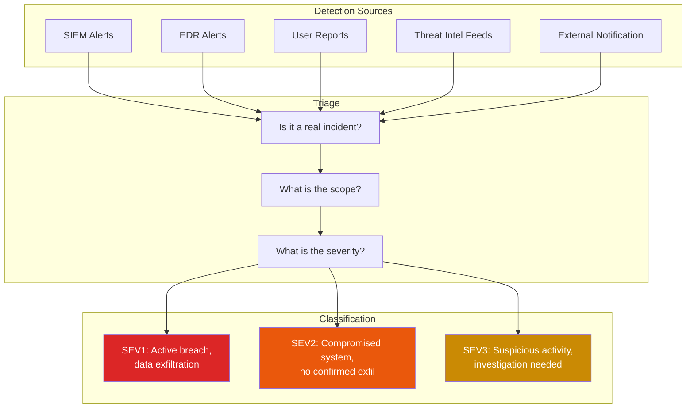
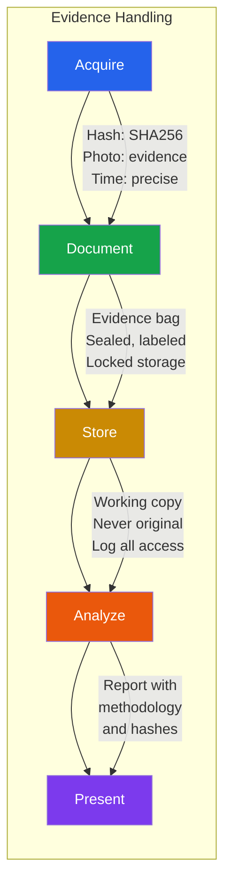
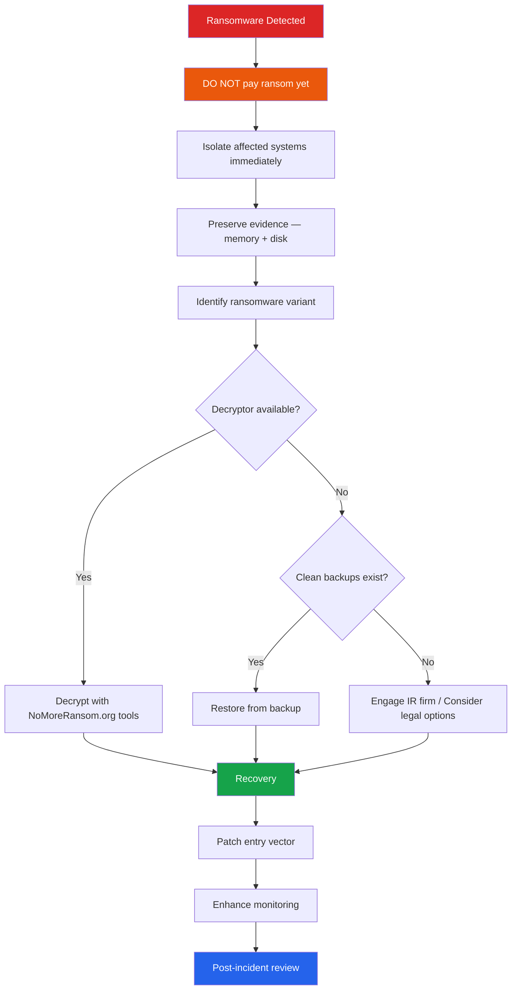

# Incident Response & Digital Forensics

When prevention fails — and it will — incident response determines whether a security event becomes a minor disruption or a catastrophic breach. Digital forensics provides the investigative methodology to understand what happened, how it happened, and what was affected. Together, IR and DFIR (Digital Forensics and Incident Response) form the backbone of an organization's ability to survive a cyberattack.

**Related**: [Cybersecurity Overview](/cybersecurity/) | [Linux Security](/cybersecurity/linux-security) | [Reverse Engineering](/cybersecurity/reverse-engineering) | [DevOps Incident Response](/devops/incident-response/)

---

## The Incident Response Process

The NIST SP 800-61 framework defines six phases. Each phase has specific objectives, deliverables, and common mistakes.



### Phase Details

| Phase | Objective | Key Activities | Common Mistakes |
|-------|-----------|---------------|-----------------|
| **1. Preparation** | Be ready before incidents happen | IR plan, tools, training, contacts, playbooks | No plan exists; tools not tested |
| **2. Identification** | Detect and confirm the incident | Alert triage, log analysis, scope assessment | Ignoring alerts, slow escalation |
| **3. Containment** | Limit blast radius | Network isolation, credential reset, short-term fixes | Wiping evidence, alerting attacker |
| **4. Eradication** | Remove attacker access | Malware removal, patch vulnerabilities, close backdoors | Missing persistence mechanisms |
| **5. Recovery** | Restore normal operations | Rebuild systems, restore from clean backups, monitor | Restoring from compromised backups |
| **6. Lessons Learned** | Improve for next time | Post-incident review, update playbooks, address root cause | Skipping this phase entirely |

### Phase 1: Preparation

```markdown
# IR Preparation Checklist

## People
- [ ] Incident Response team defined with roles and contact info
- [ ] Escalation paths documented (L1 → L2 → L3 → CISO → Legal → PR)
- [ ] External contacts ready: legal counsel, law enforcement, IR retainer firm
- [ ] Regular tabletop exercises (quarterly minimum)

## Process
- [ ] IR plan documented, approved, distributed
- [ ] Playbooks for common scenarios (ransomware, data breach, insider threat)
- [ ] Communication templates (internal, customer, regulatory)
- [ ] Evidence handling procedures (chain of custody)

## Technology
- [ ] SIEM deployed and tuned (Splunk, ELK, or similar)
- [ ] EDR on all endpoints (CrowdStrike, SentinelOne, Defender)
- [ ] Network monitoring (Zeek, Suricata, full packet capture)
- [ ] Forensic toolkit ready (write-blockers, forensic workstation, tools)
- [ ] Backup and recovery tested (not just "we have backups")
```

### Phase 2: Identification



### Phase 3: Containment

::: warning Do Not Tip Off the Attacker
During containment, avoid actions that alert the attacker to your awareness. Do not immediately change passwords, disable accounts, or block IPs unless the attacker is actively exfiltrating data. Premature containment can cause the attacker to destroy evidence, deploy ransomware, or activate backup access.
:::

```bash
# Short-term containment
# Isolate affected system from network (not power off — preserve memory!)
# On Linux:
iptables -A INPUT -j DROP
iptables -A OUTPUT -j DROP
# Or disconnect network cable while keeping power on

# On network equipment:
# Move affected VLAN to quarantine
# Block attacker IPs at firewall

# Take memory snapshot BEFORE any other changes
# See Memory Forensics section below

# Long-term containment
# Rebuild systems from clean images
# Reset ALL credentials (assume they are compromised)
# Revoke and reissue certificates
# Enable enhanced logging and monitoring
```

---

## Memory Forensics with Volatility

Memory forensics captures and analyzes the contents of RAM. It reveals running processes, network connections, loaded malware, encryption keys, and artifacts that disappear when a system is powered off.

### Memory Acquisition

```bash
# Linux — use LiME (Linux Memory Extractor)
sudo insmod lime-$(uname -r).ko "path=/tmp/memory.lime format=lime"

# Alternative: /proc/kcore (may not capture everything)
sudo dd if=/proc/kcore of=/tmp/memory.raw bs=1M

# Windows — use WinPMEM or DumpIt
winpmem_mini_x64.exe memory.raw

# Alternative: FTK Imager (GUI)
# Or: Magnet RAM Capture
```

### Volatility 3 Analysis

```bash
# Identify the memory image profile
vol -f memory.raw windows.info

# List running processes
vol -f memory.raw windows.pslist
vol -f memory.raw windows.pstree    # Tree view (shows parent-child)
vol -f memory.raw windows.psscan    # Finds hidden/terminated processes

# Network connections
vol -f memory.raw windows.netscan
vol -f memory.raw windows.netstat

# Look for injected code
vol -f memory.raw windows.malfind

# Dump a suspicious process's memory
vol -f memory.raw windows.memmap --pid 1234 --dump

# Extract DLLs loaded by a process
vol -f memory.raw windows.dlllist --pid 1234

# Command line arguments
vol -f memory.raw windows.cmdline

# Registry hives (passwords, persistence)
vol -f memory.raw windows.registry.hivelist
vol -f memory.raw windows.registry.printkey --key "Software\Microsoft\Windows\CurrentVersion\Run"

# Detect rootkits
vol -f memory.raw windows.ssdt     # System Service Descriptor Table hooks
vol -f memory.raw windows.callbacks # Kernel callbacks

# Extract files from memory
vol -f memory.raw windows.filescan | grep -i "password\|secret\|key"
vol -f memory.raw windows.dumpfiles --virtaddr 0xfa8001234567

# Linux memory analysis
vol -f memory.lime linux.pslist
vol -f memory.lime linux.bash      # Bash history from memory
vol -f memory.lime linux.check_syscall  # Syscall table hooks
vol -f memory.lime linux.lsmod     # Loaded kernel modules
```

### Memory Forensics Checklist

| Artifact | Volatility Plugin | What It Reveals |
|----------|------------------|----------------|
| Processes | `pslist`, `pstree`, `psscan` | Running programs, hidden processes |
| Network | `netscan`, `netstat` | Active connections, C2 communication |
| Injected code | `malfind` | Code injection, process hollowing |
| DLLs | `dlllist`, `ldrmodules` | Loaded libraries, DLL injection |
| Handles | `handles` | Open files, registry keys, mutexes |
| Command history | `cmdline`, `consoles` | Commands executed |
| Registry | `printkey`, `hivelist` | Persistence mechanisms, configuration |
| Services | `svcscan` | Malicious services |
| Drivers | `driverscan`, `modules` | Rootkit drivers |
| Strings | `strings` (external) | Passwords, URLs, IPs in memory |

---

## Disk Forensics

### Evidence Acquisition

::: danger Chain of Custody
Forensic evidence must maintain chain of custody to be admissible in legal proceedings. Document every step: who handled the evidence, when, what was done, and hash values before and after.
:::

```bash
# Create forensic image with dd
sudo dd if=/dev/sda of=/evidence/disk.raw bs=4M status=progress

# Better: use dc3dd (forensic dd with hashing)
sudo dc3dd if=/dev/sda of=/evidence/disk.raw hash=sha256 log=acquisition.log

# Or use Guymager (GUI, supports E01 format)

# Always use a write-blocker when imaging physical drives

# Verify integrity
sha256sum /evidence/disk.raw
# Compare with hash recorded during acquisition
```

### Autopsy — Open Source Forensic Platform

```
Autopsy provides:
1. Timeline analysis — reconstruct events chronologically
2. File system analysis — deleted files, file carving, slack space
3. Keyword search — find specific terms across entire disk
4. Hash lookup — identify known malicious/good files (NSRL)
5. Web artifact analysis — browser history, downloads, cookies
6. Email parsing — extract and analyze email databases
7. Registry analysis — Windows registry hive parsing
8. Installed programs — identify software and versions

Workflow:
1. Create new case in Autopsy
2. Add forensic image as data source
3. Run ingest modules (hash, keyword, web, recent activity)
4. Review results in categorized views
5. Generate report
```

### FTK Imager — Forensic Imaging and Preview

```
FTK Imager capabilities:
- Create forensic images (E01, AFF, raw)
- Preview disk contents without modifying
- Mount forensic images as virtual drives
- Extract specific files from images
- Capture memory
- Calculate hashes for verification
```

### Common Forensic Artifacts (Linux)

```bash
# Authentication logs
/var/log/auth.log        # SSH logins, sudo usage, PAM
/var/log/secure           # RHEL/CentOS equivalent
/var/log/wtmp             # Login records (binary, use 'last')
/var/log/btmp             # Failed login attempts (use 'lastb')
/var/log/lastlog          # Last login per user

# System logs
/var/log/syslog           # General system log
/var/log/kern.log         # Kernel messages
/var/log/daemon.log       # Daemon logs

# Web server logs
/var/log/apache2/access.log
/var/log/nginx/access.log

# Persistence mechanisms
/etc/crontab
/etc/cron.d/*
/var/spool/cron/crontabs/*
/etc/rc.local
~/.bashrc                 # Shell initialization
~/.profile
/etc/systemd/system/*.service  # Systemd services

# Recently modified files (potential backdoors)
find / -mtime -7 -type f 2>/dev/null | grep -v proc

# SSH artifacts
~/.ssh/authorized_keys    # Authorized public keys
~/.ssh/known_hosts        # Connected hosts
/var/log/auth.log         # SSH connection logs

# Timeline creation with tools
# Plaso (log2timeline) — create super-timeline
log2timeline.py /evidence/timeline.plaso /evidence/disk.raw
psort.py -o l2tcsv /evidence/timeline.plaso "date > '2026-03-15'" > timeline.csv
```

---

## Log Analysis for Threat Hunting

### Splunk Queries

```spl
# Find brute force attempts
index=auth sourcetype=linux_secure "Failed password"
| stats count by src_ip, user
| where count > 10
| sort -count

# Detect lateral movement (SSH from internal to internal)
index=auth sourcetype=linux_secure "Accepted publickey"
| where src_ip LIKE "10.%"
| stats count by src_ip, dest_ip, user
| sort -count

# Find unusual process execution
index=sysmon EventCode=1
| where parent_process="cmd.exe" OR parent_process="powershell.exe"
| stats count by process, parent_process, user
| where count < 5
| sort count

# Detect data exfiltration (large outbound transfers)
index=network
| where bytes_out > 100000000 AND dest_port!=443 AND dest_port!=80
| stats sum(bytes_out) as total_bytes by src_ip, dest_ip, dest_port
| sort -total_bytes

# PowerShell suspicious commands
index=windows sourcetype=WinEventLog:Microsoft-Windows-PowerShell/Operational
| search "EncodedCommand" OR "Invoke-Expression" OR "IEX" OR "DownloadString"
| table _time, user, ScriptBlockText

# Detect persistence via scheduled tasks
index=windows sourcetype=WinEventLog:Security EventCode=4698
| table _time, user, TaskName, TaskContent

# Hunt for DNS tunneling
index=dns
| eval query_length=len(query)
| where query_length > 50
| stats count by src_ip, query
| where count > 100
```

### ELK Stack (Elasticsearch + Logstash + Kibana)

```json
// Elasticsearch query: failed SSH logins in last 24h
{
  "query": {
    "bool": {
      "must": [
        { "match": { "message": "Failed password" } },
        { "range": { "@timestamp": { "gte": "now-24h" } } }
      ]
    }
  },
  "aggs": {
    "by_source_ip": {
      "terms": { "field": "source.ip", "size": 20 },
      "aggs": {
        "by_user": {
          "terms": { "field": "user.name", "size": 10 }
        }
      }
    }
  }
}
```

```json
// Detect unusual outbound connections
{
  "query": {
    "bool": {
      "must": [
        { "range": { "destination.port": { "gte": 1024 } } },
        { "range": { "network.bytes": { "gte": 10000000 } } }
      ],
      "must_not": [
        { "terms": { "destination.port": [443, 80, 8443, 8080] } }
      ]
    }
  }
}
```

---

## Chain of Custody



### Chain of Custody Form

| Field | Example |
|-------|---------|
| **Case number** | IR-2026-0042 |
| **Evidence ID** | EVD-001 |
| **Description** | 1TB Samsung SSD from web server prod-web-01 |
| **Hash (acquisition)** | SHA256: a1b2c3d4e5f6... |
| **Acquired by** | Jane Smith, GCFA |
| **Date/time acquired** | 2026-03-20 14:32:00 UTC |
| **Method** | dc3dd with write-blocker |
| **Storage location** | Evidence locker B, shelf 3 |
| **Transfer log** | Each person who handles it signs and dates |

---

## Threat Hunting with MITRE ATT&CK

MITRE ATT&CK provides a knowledge base of adversary tactics and techniques. Use it to structure threat hunts by searching for evidence of specific techniques.

### High-Priority Hunt Hypotheses

| ATT&CK Technique | ID | What to Hunt For | Data Source |
|------------------|-----|-----------------|-------------|
| **Initial Access: Phishing** | T1566 | Emails with attachments/links, macro execution | Email gateway, EDR |
| **Execution: PowerShell** | T1059.001 | Encoded commands, unusual scripts | Windows Event 4104 |
| **Persistence: Scheduled Task** | T1053 | New tasks, modified tasks | Windows Event 4698 |
| **Persistence: Registry Run Keys** | T1547.001 | New Run/RunOnce entries | Sysmon Event 13 |
| **Defense Evasion: Process Injection** | T1055 | VirtualAllocEx + WriteProcessMemory | Sysmon Event 8 |
| **Credential Access: DCSync** | T1003.006 | Replication requests from non-DC | Windows Event 4662 |
| **Lateral Movement: PsExec** | T1570 | New service creation on remote hosts | Windows Event 7045 |
| **Exfiltration: DNS** | T1048.003 | Large/frequent DNS queries, TXT records | DNS logs, Zeek |
| **C2: Beaconing** | T1071 | Regular-interval connections to same host | Proxy logs, flow data |

### Threat Hunting Workflow

```bash
# 1. Form a hypothesis
# "An attacker may be using PowerShell to download and execute payloads"

# 2. Define data sources
# Windows PowerShell Operational logs (Event ID 4104)
# Sysmon logs (Event ID 1 - Process Creation)

# 3. Write detection queries
# Splunk:
# index=windows sourcetype=WinEventLog EventCode=4104
# | search ScriptBlockText="*DownloadString*" OR
#          ScriptBlockText="*Invoke-WebRequest*" OR
#          ScriptBlockText="*IEX*" OR
#          ScriptBlockText="*-enc*"
# | table _time, ComputerName, ScriptBlockText

# 4. Analyze results — differentiate legitimate from malicious

# 5. Document findings

# 6. Create permanent detection rules if threats found
```

---

## IR Playbook: Ransomware



::: warning Before Paying Ransom
1. Payment does not guarantee decryption — 20% of companies that pay do not get their data back
2. Payment funds criminal organizations
3. Check [NoMoreRansom.org](https://www.nomoreransom.org/) for free decryptors
4. Consult legal counsel — paying ransom may violate sanctions laws (OFAC)
5. Report to law enforcement (FBI IC3, local CERT)
:::

---

## DFIR Tools Reference

| Tool | Purpose | Platform | Cost |
|------|---------|----------|------|
| **Volatility 3** | Memory forensics | Cross-platform | Free |
| **Autopsy** | Disk forensics | Cross-platform | Free |
| **FTK Imager** | Forensic imaging | Windows | Free |
| **Plaso/log2timeline** | Super-timeline creation | Cross-platform | Free |
| **KAPE** | Triage collection | Windows | Free |
| **Velociraptor** | Endpoint forensics at scale | Cross-platform | Free |
| **TheHive** | IR case management | Self-hosted | Free |
| **Cortex** | Observable analysis automation | Self-hosted | Free |
| **MISP** | Threat intel sharing | Self-hosted | Free |
| **Splunk** | SIEM, log analysis | Self-hosted/Cloud | Free tier / Enterprise |
| **Elastic SIEM** | SIEM, detection rules | Self-hosted/Cloud | Free tier / Paid |
| **Wazuh** | Open-source SIEM + EDR | Self-hosted | Free |
| **Zeek** | Network traffic analysis | Linux | Free |
| **Eric Zimmerman's Tools** | Windows forensic parsing | Windows | Free |

---

## Further Reading

- [Cybersecurity Overview](/cybersecurity/) — career paths and learning roadmap
- [Linux Security](/cybersecurity/linux-security) — hardening and compromise investigation
- [Reverse Engineering](/cybersecurity/reverse-engineering) — malware analysis methodology
- [Network Attacks & Defense](/cybersecurity/network-attacks) — IDS/IPS and detection
- [DevOps Incident Response](/devops/incident-response/) — operational incident management
- [Security Tools Encyclopedia](/cybersecurity/security-tools) — comprehensive tool reference
