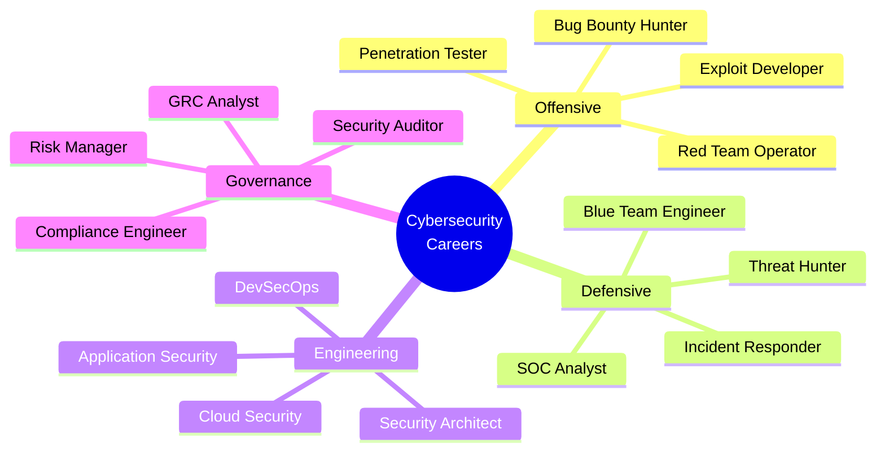
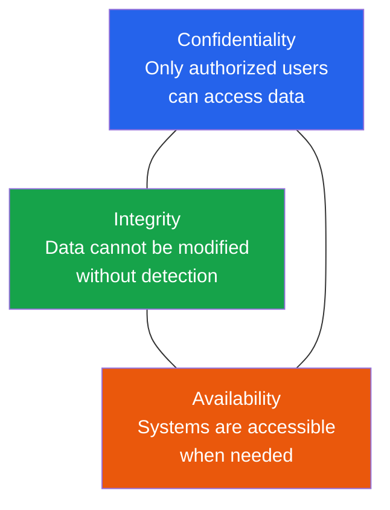
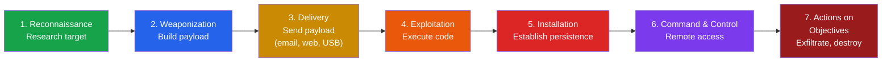
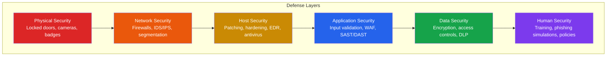
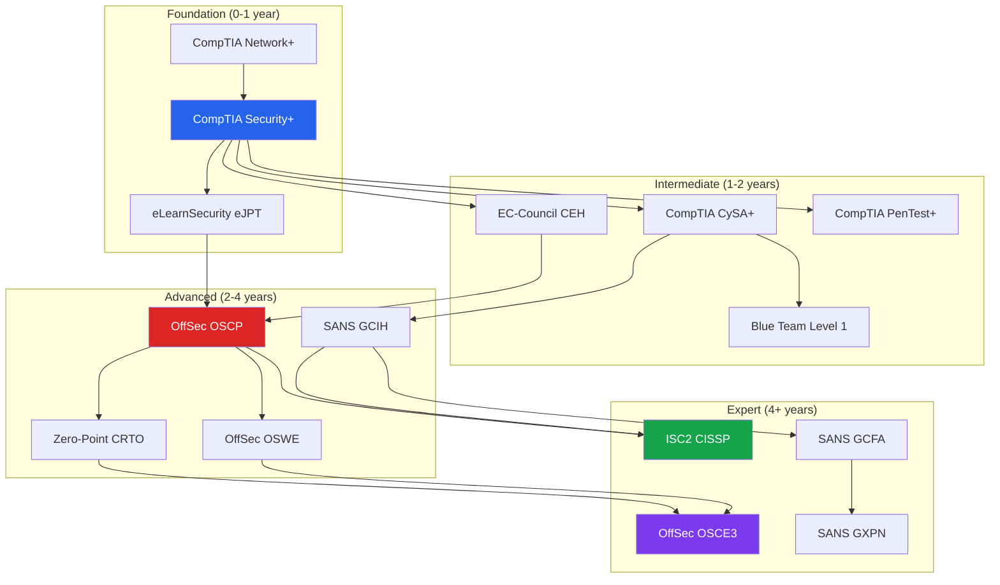
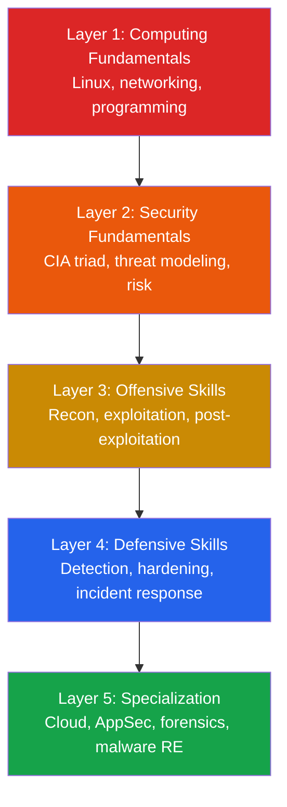
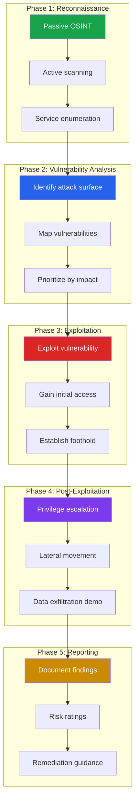

# Cybersecurity Engineering Path

Cybersecurity is not a single discipline. It is a collection of deeply technical specializations unified by one objective: understand how systems break so you can prevent, detect, and respond to attacks. Whether you are a developer who wants to write more secure code, a sysadmin moving into security, or someone starting from zero — this path gives you the structure to build real skills systematically.

This section is built for **educational purposes** and covers both offensive and defensive techniques. Every offensive technique is paired with its defensive counterpart. The goal is to build engineers who can think like attackers and build like defenders.

::: danger Legal Notice
All offensive techniques in this section are for **authorized testing and educational purposes only**. Unauthorized access to computer systems is a criminal offense under laws including the CFAA (US), Computer Misuse Act (UK), and IT Act (India). Always obtain written authorization before testing systems you do not own. Use lab environments, CTF platforms, and bug bounty programs for practice.
:::

---

## Career Paths in Cybersecurity

The field is broad. Each path requires different skills, tools, and certifications. Understanding the landscape helps you choose a direction and build the right foundation.



### Career Path Comparison

| Path | Day-to-Day Work | Key Skills | Entry Certs | Advanced Certs | Avg Salary (US) |
|------|----------------|------------|-------------|----------------|-----------------|
| **Penetration Tester** | Break into systems, write reports | Networking, scripting, web apps | CompTIA Security+, eJPT | OSCP, OSWE, GPEN | $90K-$140K |
| **Red Team Operator** | Simulate advanced adversaries end-to-end | Custom tooling, evasion, C2 frameworks | OSCP | CRTO, OSCE3 | $120K-$180K |
| **SOC Analyst (L1-L3)** | Monitor alerts, triage incidents, investigate | SIEM, log analysis, network traffic | CompTIA Security+, CySA+ | GCIH, GCIA | $55K-$110K |
| **Blue Team Engineer** | Build detections, harden infrastructure | SIEM rules, endpoint security, automation | CySA+ | GCIH, GMON | $90K-$140K |
| **Application Security** | Secure SDLC, code review, threat modeling | Programming, SAST/DAST, OWASP | Security+, CEH | GWEB, OSWE | $110K-$160K |
| **Cloud Security** | Secure AWS/GCP/Azure, IAM policies | Cloud platforms, IaC, containers | Cloud certs + Security+ | CCSP, AWS Security Specialty | $120K-$170K |
| **Incident Responder** | Handle breaches, forensics, contain threats | Memory forensics, disk forensics, malware | GCIH | GCFA, GNFA | $95K-$150K |
| **GRC Analyst** | Compliance frameworks, risk assessments, audits | Frameworks (SOC2, ISO 27001, NIST), documentation | Security+, CISA | CISSP, CISM | $80K-$130K |

### Choosing Your Path

::: tip Where to Start
If you cannot decide, start with **penetration testing**. It gives you the broadest exposure to systems, networks, and applications, and the offensive skills transfer directly to every other specialization. Many blue teamers, AppSec engineers, and security architects started as pentesters.
:::

---

## Core Security Concepts

Before diving into tools and techniques, internalize these foundational concepts. They underpin every topic in this section.

### The CIA Triad



| Principle | Threat Example | Defense Example |
|-----------|---------------|-----------------|
| **Confidentiality** | Data breach, eavesdropping, shoulder surfing | Encryption, access controls, MFA |
| **Integrity** | Data tampering, man-in-the-middle, SQL injection | Hashing, digital signatures, input validation |
| **Availability** | DDoS, ransomware, hardware failure | Redundancy, backups, rate limiting |

### The Kill Chain

Understanding how attacks progress helps you identify where to detect and disrupt them.



| Kill Chain Phase | Defender's Question | Detection Opportunity |
|-----------------|--------------------|-----------------------|
| Reconnaissance | Are they researching us? | DNS query logs, web access logs, honeytokens |
| Weaponization | What are they building? | Threat intelligence, sandbox analysis |
| Delivery | How did it arrive? | Email gateway, web proxy, endpoint protection |
| Exploitation | What vulnerability was used? | IDS/IPS signatures, application logs, WAF |
| Installation | What did they install? | File integrity monitoring, EDR, behavioral analysis |
| C2 | How are they communicating? | Network traffic analysis, DNS monitoring, beaconing detection |
| Actions | What are they doing? | Data loss prevention, UEBA, database activity monitoring |

### Defense in Depth

No single control is sufficient. Layer your defenses so that a failure in one layer does not mean a total breach.



---

## Certifications Roadmap

Certifications are not a substitute for skills, but they open doors and provide structured learning. This roadmap prioritizes practical, respected certifications at each stage.



### Certification Details

| Certification | Focus | Format | Cost | Difficulty |
|--------------|-------|--------|------|------------|
| **CompTIA Security+** | Broad security fundamentals | 90 MCQ, 90 min | ~$400 | Entry |
| **eJPT** | Basic penetration testing | Practical exam, 48h | ~$250 | Entry |
| **CEH** | Ethical hacking theory + practice | 125 MCQ, 4h | ~$1,200 | Intermediate |
| **OSCP** | Hands-on penetration testing | 24h practical + report | ~$1,600 | Advanced |
| **OSWE** | Web application exploitation | 48h practical | ~$1,600 | Advanced |
| **CRTO** | Red team operations, C2 frameworks | 48h practical | ~$450 | Advanced |
| **CISSP** | Security management, architecture | 125-175 adaptive, 4h | ~$750 | Expert (5yr exp required) |
| **GCIH** | Incident handling, hacker tools | 106 questions, 4h | ~$8,500 (with SANS course) | Advanced |

::: tip Certification Strategy
For penetration testing: Security+ then eJPT then OSCP. For blue team: Security+ then CySA+ then GCIH. For management: Security+ then CISSP. The OSCP is the gold standard for offensive security roles — most job postings list it as preferred or required.
:::

---

## The Security Learning Stack

Every cybersecurity professional needs a layered knowledge base. Weaknesses in the foundation will limit everything above it.



| Layer | Topics | Where to Learn |
|-------|--------|----------------|
| **Computing Fundamentals** | Linux CLI, TCP/IP, HTTP, DNS, Python/Bash scripting | OverTheWire Bandit, TryHackMe Pre-Security |
| **Security Fundamentals** | CIA triad, authentication, encryption, access control | CompTIA Security+ materials, this knowledge base |
| **Offensive Skills** | Scanning, exploitation, privilege escalation, pivoting | HackTheBox, TryHackMe, VulnHub, OSCP labs |
| **Defensive Skills** | SIEM, IDS/IPS, hardening, log analysis, threat hunting | Blue Team Level 1, CyberDefenders, LetsDefend |
| **Specialization** | Cloud pentesting, malware RE, AppSec, digital forensics | Specialized labs, SANS courses, real-world experience |

---

## Penetration Testing Methodology

Whether you are performing a full engagement or solving a HackTheBox machine, the methodology is the same. Having a structured approach prevents you from missing critical findings.



| Phase | Key Activities | Primary Tools |
|-------|---------------|---------------|
| **Reconnaissance** | OSINT, DNS enumeration, port scanning, service identification | Nmap, Shodan, subfinder, theHarvester |
| **Vulnerability Analysis** | Version checking, CVE lookup, manual testing, configuration review | Nmap NSE, Nikto, Nuclei, manual research |
| **Exploitation** | Exploit execution, payload delivery, shell access | Metasploit, custom scripts, public exploits |
| **Post-Exploitation** | Privilege escalation, credential harvesting, pivoting, persistence | LinPEAS, BloodHound, Mimikatz, Chisel |
| **Reporting** | Executive summary, technical findings, risk ratings, remediation | Custom templates, CVSS scoring |

---

## Tools Overview

The cybersecurity toolkit is vast. These are the essential tools organized by phase of engagement.

| Phase | Tools | Purpose |
|-------|-------|---------|
| **Reconnaissance** | Nmap, Shodan, Amass, theHarvester, Recon-ng | Discover targets, map attack surface |
| **Web Testing** | Burp Suite, OWASP ZAP, SQLMap, ffuf, Nikto | Find web vulnerabilities |
| **Network Attacks** | Wireshark, Responder, Bettercap, mitmproxy | Analyze and intercept traffic |
| **Exploitation** | Metasploit, Cobalt Strike, Sliver | Exploit vulnerabilities |
| **Password Cracking** | Hashcat, John the Ripper, Hydra | Crack hashes, brute-force auth |
| **Privilege Escalation** | LinPEAS, WinPEAS, BloodHound, PowerUp | Escalate from user to admin |
| **Forensics** | Volatility, Autopsy, FTK, Velociraptor | Investigate incidents |
| **Cloud** | Pacu, ScoutSuite, Prowler, kube-hunter | Test cloud environments |

For detailed tool usage, see the [Security Tools Encyclopedia](/cybersecurity/security-tools).

---

## Building a Home Lab

A home lab is essential for practicing security skills legally. Here are the approaches from simplest to most comprehensive.

### Beginner: Virtualization-Based Lab

```bash
# Minimum hardware: 16GB RAM, 256GB SSD, any modern CPU
# Software: VirtualBox (free) or VMware Workstation Player (free)

# Step 1: Download Kali Linux (attacker machine)
# https://www.kali.org/get-kali/ — VM image ready to import

# Step 2: Download vulnerable targets
# Metasploitable 2 — intentionally vulnerable Linux
# DVWA — vulnerable web application
# HackTheBox Starting Point — guided labs

# Step 3: Create internal network in VirtualBox
# Settings > Network > Internal Network for all VMs
# This isolates lab traffic from your real network
```

### Intermediate: Docker-Based Targets

```bash
# Run vulnerable applications in Docker
# VulnHub machines as Docker containers

# DVWA
docker run -d -p 80:80 vulnerables/web-dvwa

# OWASP Juice Shop
docker run -d -p 3000:3000 bkimminich/juice-shop

# WebGoat
docker run -d -p 8080:8080 -p 9090:9090 webgoat/webgoat

# Vulnhub
docker run -d -p 8888:80 citizenstig/nowasp
```

### Advanced: Full Enterprise Lab

```
Advanced lab components:
- Windows Server (AD Domain Controller)
- Windows 10/11 workstations (domain-joined)
- Linux servers (web, database, mail)
- pfSense/OPNsense firewall
- Wazuh SIEM for monitoring
- Kali Linux (attacker)
- Network segmentation with VLANs

This replicates a real corporate environment for
practicing Active Directory attacks, lateral movement,
and blue team detection.
```

::: tip Cloud Labs
If your hardware is limited, use cloud-based labs:
- **HackTheBox** and **TryHackMe** provide pre-built targets
- **AWS Free Tier** can host vulnerable VMs for 12 months
- **Proxmox** on old enterprise hardware is popular for advanced labs
:::

---

## Legal and Ethical Foundations

::: danger This is Non-Negotiable
The difference between a penetration tester and a criminal is **authorization**. Every technique in this section can land you in prison if used without explicit written permission. Understand the legal framework before you touch a keyboard.
:::

### Key Cybersecurity Laws

| Law | Jurisdiction | What It Covers |
|-----|-------------|---------------|
| **CFAA** (Computer Fraud and Abuse Act) | United States | Unauthorized access to computer systems |
| **Computer Misuse Act 1990** | United Kingdom | Unauthorized access, modification, and supply of tools |
| **IT Act 2000 (Sections 43, 66)** | India | Damage to computer systems, hacking |
| **GDPR** | European Union | Data protection, breach notification (72h) |
| **HIPAA** | United States | Healthcare data protection |
| **PCI DSS** | Global | Payment card data security |

### Rules of Engagement

1. **Always get written authorization** — A signed scope document (Rules of Engagement) defines what you can test, how, and when
2. **Stay in scope** — If the scope says "test web app X," do not scan the entire network
3. **Do no harm** — Avoid destructive actions; if you find a vulnerability, report it, do not exploit it further
4. **Document everything** — Timestamps, commands, findings. Your logs are your legal defense
5. **Report responsibly** — Follow coordinated disclosure. Give vendors time to patch before publishing

### Where to Practice Legally

| Platform | Type | Cost | Best For |
|----------|------|------|----------|
| **HackTheBox** | Online labs, challenges | Free tier + $14/mo | Offensive skills, OSCP prep |
| **TryHackMe** | Guided rooms, paths | Free tier + $14/mo | Beginners, structured learning |
| **VulnHub** | Downloadable VMs | Free | Offline practice |
| **OverTheWire** | Wargames (Bandit, Natas, etc.) | Free | Linux and web fundamentals |
| **PentesterLab** | Web app exploitation | $20/mo | Web security |
| **CyberDefenders** | Blue team challenges | Free | DFIR, threat hunting |
| **DVWA** | Deliberately vulnerable web app | Free (self-hosted) | Web app testing basics |
| **HackerOne/Bugcrowd** | Real bug bounties | Free | Real-world testing, income |

---

## Key Frameworks and Standards

Understanding security frameworks helps you speak the language of the industry and align your work with recognized standards.

| Framework | Purpose | Who Uses It |
|-----------|---------|-------------|
| **OWASP Top 10** | Web application risk ranking | Developers, AppSec engineers |
| **MITRE ATT&CK** | Adversary tactics, techniques, and procedures | Threat hunters, red/blue teams |
| **NIST CSF** | Cybersecurity framework (Identify, Protect, Detect, Respond, Recover) | Organizations, compliance teams |
| **CIS Benchmarks** | Hardening configurations for OS, cloud, applications | Sysadmins, cloud engineers |
| **PTES** | Penetration Testing Execution Standard | Penetration testers |
| **OSSTMM** | Open Source Security Testing Methodology Manual | Security auditors |
| **ISO 27001** | Information security management system | Enterprise compliance |
| **NIST SP 800-61** | Incident response guidance | IR teams |

---

## Section Map

### Part 1 — Fundamentals

| Page | What You Will Learn | Difficulty |
|------|-------------------|------------|
| [Networking Fundamentals](/cybersecurity/networking-fundamentals) | TCP/IP from attacker's perspective, Nmap, Wireshark, recon methodology | Intermediate |
| [Web App Pentesting](/cybersecurity/web-app-pentesting) | OWASP testing guide, Burp Suite, API testing, bug bounty methodology | Advanced |
| [Linux Security & Hardening](/cybersecurity/linux-security) | Privilege escalation, hardening, SELinux, auditd, rootkit detection | Advanced |
| [Network Attacks & Defense](/cybersecurity/network-attacks) | ARP spoofing, MITM, DNS poisoning, Wi-Fi attacks, IDS/IPS | Advanced |
| [Reverse Engineering](/cybersecurity/reverse-engineering) | x86 assembly, Ghidra, GDB, malware analysis methodology | Expert |
| [Practical Cryptography](/cybersecurity/cryptography-practical) | Hash cracking, SSL/TLS testing, crypto implementation bugs | Advanced |
| [Cloud Pentesting](/cybersecurity/cloud-pentesting) | AWS/GCP/Azure pentesting, Kubernetes security, cloud attack frameworks | Advanced |
| [OSINT](/cybersecurity/osint) | Passive recon, Shodan, Google dorking, DNS enumeration, secret scanning | Intermediate |
| [Incident Response & Forensics](/cybersecurity/incident-response-forensics) | IR process, memory/disk forensics, threat hunting, MITRE ATT&CK | Advanced |
| [Secure Coding](/cybersecurity/secure-coding) | Input validation, output encoding, SAST, SCA, secure authentication | Intermediate |
| [Security Tools Encyclopedia](/cybersecurity/security-tools) | Complete tool reference with comparisons for every security category | Intermediate |

### Part 2 — Advanced Topics

| Page | What You Will Learn | Difficulty |
|------|-------------------|------------|
| [Active Directory Attacks & Defense](/cybersecurity/active-directory) | BloodHound enumeration, Kerberoasting, Golden/Silver Ticket, DCSync, AD hardening | Advanced |
| [Red Team Operations](/cybersecurity/red-team-ops) | MITRE ATT&CK kill chain, C2 frameworks, lateral movement, purple teaming | Expert |
| [Blue Team & SOC Operations](/cybersecurity/blue-team-soc) | SOC tiers, SIEM platforms, Sigma/YARA detection rules, threat intelligence | Advanced |
| [Web3 & Smart Contract Security](/cybersecurity/web3-security) | Solidity reentrancy, DeFi exploits, smart contract auditing, Slither/Mythril | Advanced |
| [Mobile Application Security](/cybersecurity/mobile-security) | APK decompilation, Frida hooking, certificate pinning bypass, OWASP Mobile Top 10 | Advanced |
| [API Security Testing](/cybersecurity/api-security-testing) | JWT attacks, BOLA/IDOR, GraphQL security, mass assignment, OWASP API Top 10 | Advanced |
| [Container & Kubernetes Security](/cybersecurity/container-security) | Image scanning, Falco runtime security, Pod Security Standards, RBAC audit | Advanced |
| [Bug Bounty Hunting Guide](/cybersecurity/bug-bounty) | Recon methodology, automation pipelines, report writing, platform comparison | Intermediate |
| [Malware Analysis Fundamentals](/cybersecurity/malware-analysis) | PE analysis, sandbox detonation, YARA rules, unpacking, threat actor TTPs | Expert |
| [Security Certification Roadmap](/cybersecurity/security-certifications) | OSCP deep dive, CEH vs OSCP, CISSP, cloud certs, free labs and resources | Beginner |

---

## How to Use This Section

1. **If you are brand new**: Start with [Networking Fundamentals](/cybersecurity/networking-fundamentals) and [OSINT](/cybersecurity/osint). These are accessible and build the recon skills that underpin everything else.
2. **If you know networking**: Move to [Web App Pentesting](/cybersecurity/web-app-pentesting) and [Linux Security](/cybersecurity/linux-security) — these are where most real-world engagements happen.
3. **If you want to defend**: Focus on [Secure Coding](/cybersecurity/secure-coding), [Incident Response](/cybersecurity/incident-response-forensics), and the blue team tools in the [Tools Encyclopedia](/cybersecurity/security-tools).
4. **If you want to specialize**: [Cloud Pentesting](/cybersecurity/cloud-pentesting), [Reverse Engineering](/cybersecurity/reverse-engineering), and [Practical Cryptography](/cybersecurity/cryptography-practical) are deep specializations.

Cross-reference this section with [Security](/security/) for defensive architecture (OWASP, encryption, zero trust, API security) and [DevOps](/devops/) for operational security practices.

---

## Further Reading

- [Security Overview](/security/) — threat modeling, OWASP Top 10, encryption, zero trust
- [Security Exploits](/security/exploits/) — case studies of major vulnerabilities
- [Infrastructure](/infrastructure/) — cloud architecture and container security
- [DevOps](/devops/) — CI/CD security, monitoring, incident response
- [Compliance](/security/compliance/) — SOC2, GDPR, PCI DSS engineering
