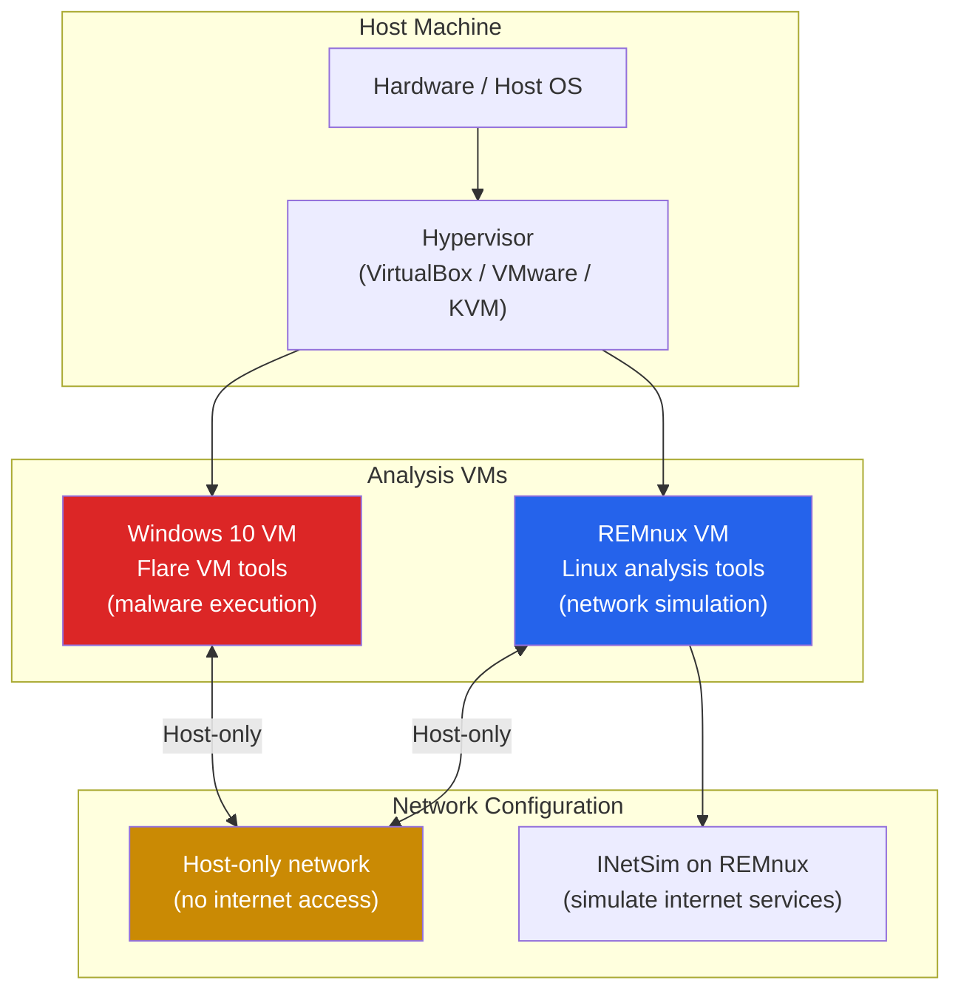
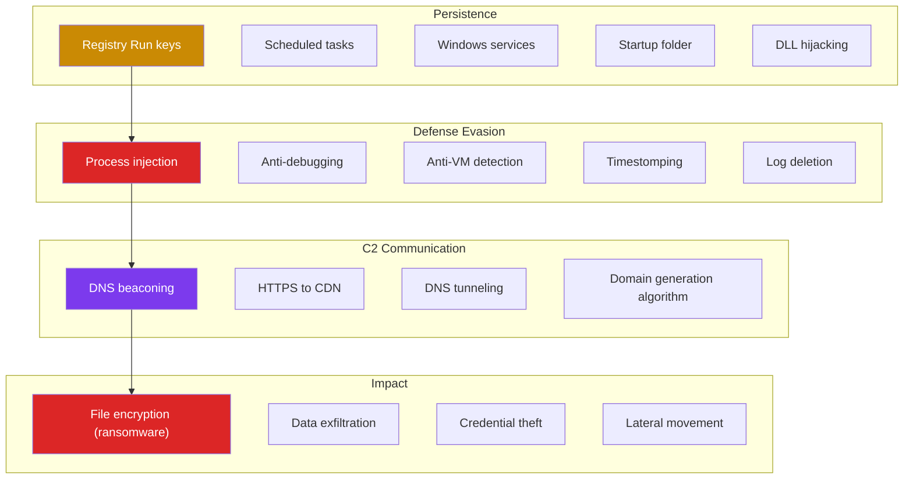

# Malware Analysis Fundamentals

Malware analysis is the process of understanding what a malicious program does, how it does it, and who may have created it. It is the bridge between incident response ("we were compromised") and actionable intelligence ("this is what the malware does, here are the IOCs, and here is how to detect and prevent it").

Every SOC analyst, incident responder, and threat hunter needs malware analysis skills. This page covers the methodology from basic triage to advanced behavioral analysis, the tools used at each stage, and how to write detection rules based on your findings.

**Related**: [Cybersecurity Overview](/cybersecurity/) | [Reverse Engineering](/cybersecurity/reverse-engineering) | [Blue Team & SOC](/cybersecurity/blue-team-soc) | [Red Team Operations](/cybersecurity/red-team-ops)

::: danger Safety Warning
Only analyze malware in isolated environments. Use dedicated VMs with no network access to production systems, no shared folders, and snapshot capability. Even accidental execution can compromise your analysis machine and potentially your entire network.
:::

---

## Malware Analysis Methodology

```mermaid
graph TB
    subgraph "Phase 1: Triage"
        T1["File identification<br/>Type, size, hash"]
        T2["VirusTotal lookup<br/>Known signatures"]
        T3["Risk assessment<br/>Priority decision"]
    end

    subgraph "Phase 2: Static Analysis"
        S1["PE header analysis"]
        S2["String extraction"]
        S3["Import table review"]
        S4["Packer detection"]
        S5["YARA rule matching"]
    end

    subgraph "Phase 3: Dynamic Analysis"
        D1["Sandbox detonation"]
        D2["Network traffic capture"]
        D3["File system changes"]
        D4["Registry modifications"]
        D5["Process behavior"]
    end

    subgraph "Phase 4: Advanced Analysis"
        A1["Debugging (x64dbg)"]
        A2["Disassembly (Ghidra/IDA)"]
        A3["Unpacking / deobfuscation"]
        A4["C2 protocol analysis"]
    end

    subgraph "Phase 5: Reporting"
        R1["IOC extraction"]
        R2["YARA rule creation"]
        R3["ATT&CK mapping"]
        R4["Detection signatures"]
    end

    T1 --> T2 --> T3
    T3 --> S1 --> S2 --> S3 --> S4 --> S5
    S5 --> D1 --> D2 --> D3 --> D4 --> D5
    D5 --> A1 --> A2 --> A3 --> A4
    A4 --> R1 --> R2 --> R3 --> R4

    style T1 fill:#2563eb,color:#fff
    style S1 fill:#ca8a04,color:#fff
    style D1 fill:#dc2626,color:#fff
    style A1 fill:#7c3aed,color:#fff
    style R1 fill:#16a34a,color:#fff
```



---

## Analysis Lab Setup

### Isolated Analysis Environment



### Essential Tool Distributions

| Distribution | OS | Purpose | Key Tools |
|-------------|-----|---------|-----------|
| **FLARE VM** | Windows | Full malware analysis environment | x64dbg, Ghidra, PEStudio, Wireshark, Process Monitor |
| **REMnux** | Linux | Network analysis, static analysis | INetSim, fakeDNS, Volatility, YARA, radare2 |
| **Tsurugi** | Linux | DFIR and malware analysis | Autopsy, Volatility, YARA, Cuckoo |

```bash
# REMnux setup
# Download REMnux OVA from https://remnux.org
# Import into VirtualBox/VMware
# Configure host-only networking

# Start INetSim (simulates DNS, HTTP, SMTP, etc.)
sudo inetsim

# Start fakeDNS to capture DNS requests
sudo fakedns

# FLARE VM setup (on Windows 10 VM)
# Run in PowerShell as administrator:
# Install Boxstarter
# Run FLARE VM installer from GitHub
```

::: warning Snapshot Before Every Analysis
Always take a VM snapshot before detonating malware. After analysis, revert to the clean snapshot. Never reuse a VM that has been exposed to malware without reverting.
:::

---

## Static Analysis

Static analysis examines the malware without executing it. This is safe and provides valuable intelligence before risking dynamic analysis.

### File Identification

```bash
# Determine file type (do not trust extensions)
file suspicious.exe
# Output: PE32 executable (GUI) Intel 80386, for MS Windows

# Calculate hashes for lookup
md5sum suspicious.exe
sha256sum suspicious.exe
ssdeep suspicious.exe  # Fuzzy hash for similarity matching

# Check on VirusTotal
# Upload hash (not the file) to https://www.virustotal.com
# Or use VT API:
curl -s "https://www.virustotal.com/api/v3/files/SHA256_HASH" \
    -H "x-apikey: YOUR_API_KEY" | jq '.data.attributes.last_analysis_stats'

# Check MalwareBazaar
curl -s -X POST "https://mb-api.abuse.ch/api/v1/" \
    -d "query=get_info&hash=SHA256_HASH"
```

### PE Header Analysis

The PE (Portable Executable) header contains metadata about a Windows executable: compilation timestamp, imported DLLs, sections, and more.

```bash
# PEStudio (Windows GUI) — best PE analysis tool
# Open suspicious.exe in PEStudio

# pestudio checks:
# - Compilation timestamp (is it in the future? Very old?)
# - Imported DLLs and functions (suspicious imports?)
# - Sections (unusual names? High entropy?)
# - Resources (embedded executables? Scripts?)
# - Strings (URLs, IPs, registry keys, file paths?)

# pefile (Python library)
python3 -c "
import pefile
pe = pefile.PE('suspicious.exe')
print(f'Compilation time: {pe.FILE_HEADER.TimeDateStamp}')
print(f'Sections:')
for section in pe.sections:
    print(f'  {section.Name.decode().rstrip(chr(0)):10s} '
          f'Entropy: {section.get_entropy():.2f} '
          f'Size: {section.SizeOfRawData}')
print(f'Imports:')
for entry in pe.DIRECTORY_ENTRY_IMPORT:
    print(f'  {entry.dll.decode()}')
    for imp in entry.imports:
        if imp.name:
            print(f'    {imp.name.decode()}')
"

# CFF Explorer (Windows) — visual PE analysis
# Detect-It-Easy (DiE) — packer/compiler detection
```

### Suspicious Import Functions

| Import | DLL | Indicates |
|--------|-----|-----------|
| `CreateRemoteThread` | kernel32.dll | Process injection |
| `VirtualAllocEx` | kernel32.dll | Remote memory allocation |
| `WriteProcessMemory` | kernel32.dll | Writing to another process |
| `NtUnmapViewOfSection` | ntdll.dll | Process hollowing |
| `URLDownloadToFile` | urlmon.dll | Download additional payloads |
| `InternetOpenUrl` | wininet.dll | C2 communication |
| `RegSetValueEx` | advapi32.dll | Registry persistence |
| `CryptEncrypt` | advapi32.dll | Encryption (ransomware) |
| `ShellExecute` | shell32.dll | Execute commands |
| `IsDebuggerPresent` | kernel32.dll | Anti-debugging |
| `GetTickCount` | kernel32.dll | Anti-sandbox timing checks |

### String Extraction

```bash
# Extract ASCII and Unicode strings
strings suspicious.exe > strings_ascii.txt
strings -el suspicious.exe > strings_unicode.txt  # Unicode (little-endian)

# FLOSS — automatically deobfuscates strings
floss suspicious.exe > floss_output.txt

# What to look for in strings:
# - URLs and IP addresses (C2 servers)
# - File paths (C:\Windows\Temp\payload.exe)
# - Registry keys (HKCU\Software\Microsoft\Windows\CurrentVersion\Run)
# - Usernames, passwords, API keys
# - Error messages (can identify the language/framework)
# - Mutex names (used to prevent multiple instances)
# - PDB paths (leak developer environment info)
#   Example: C:\Users\APT28\Desktop\malware\Release\dropper.pdb
```

### Packer Detection

Packed malware compresses or encrypts the original code to evade static analysis. The packed binary unpacks itself in memory at runtime.

| Indicator | Description |
|-----------|-------------|
| **High entropy** | Sections with entropy > 7.0 are likely compressed/encrypted |
| **Few strings** | Packed binaries have very few readable strings |
| **Few imports** | Only basic imports (LoadLibrary, GetProcAddress) for unpacking |
| **Unusual section names** | UPX0, .aspack, .petite instead of .text, .data |
| **Small code section** | Very small .text section with large data sections |

```bash
# Detect packing with Detect-It-Easy (DiE)
# Shows: UPX, ASPack, Themida, VMProtect, custom packers

# Unpack UPX (most common packer)
upx -d packed_sample.exe -o unpacked_sample.exe

# For custom packers: dynamic analysis or manual unpacking with x64dbg
```

---

## Dynamic Analysis

Dynamic analysis executes the malware in a controlled environment and observes its behavior: what processes it creates, what files it writes, what network connections it makes, and what registry keys it modifies.

### Sandbox Platforms

| Sandbox | Type | Cost | Strengths |
|---------|------|------|-----------|
| **Any.Run** | Cloud | Free tier + paid | Interactive, real-time browser-based analysis |
| **Joe Sandbox** | Cloud | Free community + paid | Deep analysis, MITRE ATT&CK mapping |
| **Cuckoo Sandbox** | Self-hosted | Free | Customizable, no upload to third parties |
| **Hybrid Analysis** | Cloud | Free | CrowdStrike-powered, good detection |
| **Triage** | Cloud | Free | Fast, automated, IOC extraction |
| **CAPE** | Self-hosted | Free | Cuckoo fork with advanced unpacking |

### Manual Dynamic Analysis (Windows VM)

```bash
# Before executing: start monitoring tools

# 1. Process Monitor (ProcMon) — file, registry, process, network events
# Set filters:
# - Process Name is suspicious.exe
# - Operation is WriteFile
# - Operation is RegSetValue
# - Operation is TCP Connect

# 2. Process Hacker / Process Explorer — process tree, loaded DLLs, handles
# Watch for: child processes, injected DLLs, hidden processes

# 3. Wireshark / TCPView — network connections
# Capture on the VM's network interface
# Look for: DNS queries, HTTP/HTTPS connections, raw TCP/UDP

# 4. Regshot — registry snapshot comparison
# Take snapshot before and after execution
# Compare: new keys, modified values, deleted keys

# 5. Autoruns — persistence mechanisms
# Check: Run keys, scheduled tasks, services, startup folder

# Execute the malware and observe for 5-15 minutes
# Some malware has delayed execution (sleep timers)
```

### Behavioral Indicators



| Behavior | Registry / Artifact | Indicates |
|----------|-------------------|-----------|
| Run key persistence | `HKCU\Software\Microsoft\Windows\CurrentVersion\Run` | Auto-start on login |
| Scheduled task | `schtasks /create /sc minute /tn "Update" /tr malware.exe` | Periodic execution |
| Service creation | `sc create MalSvc binPath= malware.exe` | System-level persistence |
| File creation in Temp | `C:\Users\*\AppData\Local\Temp\*.exe` | Dropped payloads |
| Modifying hosts file | `C:\Windows\System32\drivers\etc\hosts` | DNS hijacking |
| Disabling Defender | `Set-MpPreference -DisableRealtimeMonitoring $true` | Defense evasion |
| Shadow copy deletion | `vssadmin delete shadows /all /quiet` | Ransomware preparation |

---

## Unpacking and Deobfuscation

### Manual Unpacking with x64dbg

```
# General unpacking methodology:
# 1. Open packed sample in x64dbg
# 2. Set breakpoint on VirtualAlloc or VirtualProtect
# 3. Run until breakpoint — these allocate memory for unpacked code
# 4. Follow the allocated memory region
# 5. Continue execution until the unpacked code is written
# 6. Find the OEP (Original Entry Point) — where unpacked code starts
# 7. Dump the process memory (use Scylla plugin)
# 8. Fix the Import Address Table (IAT)

# Common API breakpoints for unpacking:
# VirtualAlloc — memory allocation for unpacked code
# VirtualProtect — changing memory permissions (RWX)
# CreateProcessInternalW — process hollowing
# NtWriteVirtualMemory — writing to remote process
# LoadLibraryA — loading DLLs dynamically
```

### String Deobfuscation Patterns

| Technique | Description | Deobfuscation Approach |
|-----------|-------------|----------------------|
| **XOR encoding** | Strings XORed with single byte or key | Brute force 256 possible single-byte keys |
| **Base64** | Standard encoding | Base64 decode |
| **Custom cipher** | ROT, substitution, or custom algorithm | Reverse engineer the algorithm |
| **Stack strings** | Characters pushed to stack individually | Reconstruct from assembly |
| **API hashing** | API names resolved by hash at runtime | Match hashes against known API databases |
| **AES/RC4 encrypted** | Strings encrypted with embedded key | Find key in binary, decrypt |

```python
# XOR brute force — try all single-byte keys
def xor_bruteforce(data):
    for key in range(256):
        decoded = bytes([b ^ key for b in data])
        # Check if result contains readable strings
        try:
            text = decoded.decode('ascii')
            if any(c.isalpha() for c in text):
                print(f"Key 0x{key:02x}: {text}")
        except UnicodeDecodeError:
            pass

# Read suspected encoded data from binary
with open('suspicious.exe', 'rb') as f:
    data = f.read()

# Search for XOR-encoded strings at known offsets
xor_bruteforce(data[0x1000:0x1050])
```

---

## YARA Rule Writing

YARA rules are the primary method for classifying and detecting malware based on patterns.

### YARA Rule Structure

```yara
rule Emotet_Dropper {
    meta:
        description = "Detects Emotet dropper samples"
        author = "Malware Analyst"
        date = "2026-03-20"
        severity = "critical"
        hash = "abc123def456..."
        reference = "https://attack.mitre.org/software/S0367/"
        tlp = "WHITE"

    strings:
        // String patterns
        $s1 = "powershell" ascii nocase
        $s2 = "-encodedcommand" ascii nocase
        $s3 = "Invoke-WebRequest" ascii wide nocase

        // URL patterns
        $url1 = /https?:\/\/[a-zA-Z0-9.-]+\/[a-zA-Z0-9_-]+\.php/ ascii

        // Hex patterns (byte sequences from the malware)
        $hex1 = { 4D 5A 90 00 03 00 00 00 }  // MZ header
        $hex2 = { 8B ?? 83 ?? ?? 0F 84 }      // Common code pattern
        // ?? = wildcard byte

        // Registry persistence pattern
        $reg = "CurrentVersion\\Run" ascii wide

    condition:
        uint16(0) == 0x5A4D and           // Must be PE file
        filesize < 5MB and                 // Size constraint
        (2 of ($s*)) and                   // At least 2 string matches
        ($url1 or $reg) and                // URL or registry pattern
        #hex2 > 3                          // hex2 appears more than 3 times
}
```

### YARA Best Practices

```yara
// Good rule — specific, low false positives
rule APT28_Dropper_2026 {
    meta:
        description = "APT28 dropper observed in March 2026 campaign"
        author = "Threat Intel Team"
        date = "2026-03-20"
        confidence = "high"

    strings:
        // Unique strings from this specific campaign
        $mutex = "Global\\{8F4E2A1B-3C5D-4E6F-A7B8-9C0D1E2F3A4B}" ascii
        $pdb = "C:\\work\\agent\\Release\\dropper.pdb" ascii
        $c2_pattern = /[a-f0-9]{8}\.(php|aspx)/ ascii

        // Specific code pattern (not generic)
        $code = { 48 8B 05 ?? ?? ?? ?? 48 85 C0 74 ?? 48 8B 48 08 E8 }

    condition:
        uint16(0) == 0x5A4D and
        filesize < 2MB and
        ($mutex or $pdb) and
        ($c2_pattern or $code)
}

// Bad rule — too generic, high false positives
// DO NOT DO THIS:
rule Bad_Rule {
    strings:
        $s1 = "http://" ascii    // Too common
        $s2 = "cmd.exe" ascii    // In many legitimate programs

    condition:
        any of them              // Way too broad
}
```

```bash
# Scan files with YARA rules
yara -r rules/ suspicious.exe
yara -r rules/ /path/to/sample_directory/

# Scan running processes
yara -p 4 rules/ -p  # Use 4 threads

# Generate YARA rules automatically from samples
yarGen -m /path/to/malware/samples/ -o generated_rules.yar
```

---

## Threat Actor TTPs

Mapping malware behavior to MITRE ATT&CK provides a structured way to communicate findings and compare across campaigns.

### TTP Extraction Template

| ATT&CK Tactic | Technique | Evidence |
|---------------|-----------|----------|
| **Execution** | T1059.001 PowerShell | Spawns powershell.exe with encoded command |
| **Persistence** | T1547.001 Registry Run Keys | Writes to `HKCU\...\Run\WindowsUpdate` |
| **Defense Evasion** | T1027 Obfuscated Files | XOR-encoded strings, packed with custom packer |
| **Defense Evasion** | T1055.001 DLL Injection | Injects into explorer.exe via CreateRemoteThread |
| **Credential Access** | T1003.001 LSASS Memory | Calls MiniDumpWriteDump on lsass.exe |
| **Discovery** | T1082 System Information | Runs `systeminfo`, `whoami`, `ipconfig` |
| **C2** | T1071.001 Web Protocols | HTTPS beacons to C2 every 60 seconds |
| **Exfiltration** | T1041 Exfil Over C2 | Data exfiltrated in POST body to C2 |

### Malware Analysis Report Template

```markdown
## Sample Information
- **Filename:** invoice_march_2026.exe
- **MD5:** abc123...
- **SHA256:** def456...
- **File type:** PE32 executable (GUI) Intel 80386
- **File size:** 384 KB
- **First seen:** 2026-03-15
- **VirusTotal detection:** 48/72

## Executive Summary
This sample is a dropper for [MALWARE_FAMILY]. Upon execution,
it decrypts an embedded payload, injects it into explorer.exe,
establishes persistence via registry, and beacons to a C2 server
over HTTPS every 60 seconds.

## IOCs
| Type | Value | Context |
|------|-------|---------|
| Hash (SHA256) | def456... | Dropper |
| Hash (SHA256) | ghi789... | Dropped payload |
| Domain | update-service[.]com | C2 server |
| IP | 185.123.45[.]67 | C2 server |
| URL | hxxps://update-service[.]com/api/check | C2 beacon URL |
| Mutex | Global\{8F4E2A1B...} | Mutex name |
| Registry | HKCU\...\Run\WindowsUpdate | Persistence key |

## MITRE ATT&CK Mapping
[Table of TTPs as shown above]

## YARA Rule
[Custom YARA rule for this sample]

## Recommendations
1. Block IOCs at firewall, proxy, and DNS levels
2. Scan endpoints for mutex and registry persistence
3. Monitor for the specific PowerShell command pattern
4. Update EDR signatures
```

---

## Malware Types Reference

| Type | Behavior | Example | Key Indicators |
|------|----------|---------|---------------|
| **Dropper** | Downloads/extracts second-stage payload | Emotet | URLDownloadToFile, high entropy sections |
| **RAT** | Remote access, keylogging, screen capture | njRAT, Quasar | Persistent connection, keystroke logging |
| **Ransomware** | Encrypts files, demands payment | LockBit, REvil | File enumeration, CryptEncrypt, shadow deletion |
| **Stealer** | Exfiltrates credentials, cookies, wallets | RedLine, Vidar | Browser database access, crypto wallet paths |
| **Worm** | Self-replicates across networks | WannaCry | SMB scanning, self-copying, lateral movement |
| **Rootkit** | Hides presence at kernel level | TDL4, ZeroAccess | Driver loading, SSDT hooking |
| **Botnet agent** | Joins C2 network for DDoS, spam, mining | Mirai, TrickBot | C2 beaconing, command parsing |
| **Loader** | Loads and executes other malware | BazarLoader | Memory allocation, reflective loading |

---

## Further Reading

- [Reverse Engineering](/cybersecurity/reverse-engineering) — Assembly, Ghidra, debugging fundamentals
- [Blue Team & SOC](/cybersecurity/blue-team-soc) — Using analysis results for detection
- [Red Team Operations](/cybersecurity/red-team-ops) — Understanding offensive tooling
- [Active Directory](/cybersecurity/active-directory) — Post-exploitation tools targeting AD
- [Security Certifications](/cybersecurity/security-certifications) — GREM, eCMAP for malware analysis

---

::: tip Key Takeaway
- Always start with triage: hash the sample, check VirusTotal (by hash, not upload), identify the file type, and extract strings before doing anything else
- Static analysis (PE headers, imports, strings) reveals what a binary can do; dynamic analysis (sandbox, process monitoring) reveals what it actually does
- YARA rules bridge analysis and detection: every malware analysis session should produce at least one YARA rule for automated detection
:::

::: details Hands-On Lab
**Lab: Malware Analysis from Triage to YARA Rule**

1. Download a malware sample from MalwareBazaar (pick one tagged as "low risk" or a known commodity malware)
2. Set up your analysis environment: take a VM snapshot, configure host-only networking, start INetSim
3. Triage: calculate MD5/SHA256 hashes, check VirusTotal by hash, run `file` and Detect-It-Easy
4. Static analysis: extract strings with `strings` and FLOSS, analyze PE headers with PEStudio, check imports for suspicious API calls
5. Dynamic analysis: execute the sample in the sandbox VM with ProcMon, Wireshark, and Process Hacker running
6. Observe: what files are created? What registry keys are modified? What network connections are made?
7. Write a YARA rule based on unique strings, byte patterns, or import combinations you discovered
8. Document your findings: IOCs, MITRE ATT&CK mapping, and detection recommendations
:::

::: details CTF Challenge
**Challenge: The Packed Payload**

A suspicious binary `update_service.exe` was found on a compromised workstation. VirusTotal shows 2/72 detections. The binary has very few strings, very few imports (only `LoadLibrary` and `GetProcAddress`), and a section named `UPX0` with high entropy. Analyze it and find the C2 server address.

**Hints:**
1. The section name and import pattern indicate a known packer
2. Unpack it first before doing further analysis
3. After unpacking, the C2 address is XOR-encoded with a single-byte key

::: details Answer
The binary is UPX-packed. Unpack with `upx -d update_service.exe -o unpacked.exe`. Run FLOSS on the unpacked binary to automatically deobfuscate XOR-encoded strings. Alternatively, extract the encoded bytes from the `.data` section and XOR brute-force with all 256 single-byte keys. Key `0x42` reveals the C2 domain: `c2-updates.evil-domain.com:8443`. Flag: `CTF{upx_unpack_xor_decode_c2_found}`.
:::
:::

::: warning Common Misconceptions
- **"Running malware on your main machine is fine if you have antivirus"** — AV misses new samples. Always use isolated VMs with snapshots, host-only networking, and no shared folders.
- **"VirusTotal is the final word on whether a file is malicious"** — New malware has 0/72 detections initially. A clean VT result does not mean the file is safe — it means no AV has seen it yet.
- **"You need to understand every assembly instruction"** — Focus on understanding control flow, function calls, and high-level behavior. Ghidra's decompiler provides C-like pseudocode that is much faster to read.
- **"Packed malware cannot be analyzed"** — UPX is trivially unpacked with `upx -d`. Custom packers require dynamic analysis: set breakpoints on `VirtualAlloc`/`VirtualProtect`, let the unpacking routine run, and dump the process memory.
- **"YARA rules are only for malware analysts"** — SOC analysts, threat hunters, and IR teams all use YARA for file scanning, memory analysis, and network traffic inspection.
:::

::: details Quiz
**1. Why should you check VirusTotal by hash instead of uploading the file?**

a) Hashes are more accurate
b) Uploading exposes the sample to all VT subscribers, potentially alerting the threat actor
c) Hash checks are faster
d) VT does not accept uploads

::: details Answer
b) Files uploaded to VirusTotal become available to all subscribers. If the malware is from a targeted attack, uploading it alerts the threat actor that their sample has been discovered.
:::

**2. What does the import `CreateRemoteThread` in a PE binary typically indicate?**

a) Multi-threaded application
b) Process injection — creating a thread in another process
c) Network communication
d) File encryption

::: details Answer
b) `CreateRemoteThread` creates a thread in another process's address space, which is the key step in process injection — a technique used to run code inside legitimate processes for evasion.
:::

**3. What is the difference between FLOSS and the standard `strings` tool?**

a) FLOSS is faster
b) FLOSS automatically deobfuscates encoded strings (XOR, stack strings) that `strings` cannot find
c) FLOSS only works on Windows
d) FLOSS extracts binary data

::: details Answer
b) FLOSS (FireEye Labs Obfuscated String Solver) uses emulation and heuristics to automatically decode strings that have been obfuscated using XOR encoding, stack string construction, and other techniques.
:::

**4. What PE section characteristic most strongly suggests the binary is packed?**

a) Large .text section
b) Many imported DLLs
c) High entropy (> 7.0) in sections with few imports and strings
d) Small file size

::: details Answer
c) High entropy indicates compressed or encrypted data. Combined with few imports (just `LoadLibrary`, `GetProcAddress`) and few strings, this strongly indicates packing.
:::

**5. What is the purpose of INetSim in a malware analysis lab?**

a) Scanning for vulnerabilities
b) Simulating internet services (DNS, HTTP, SMTP) so malware behaves as if online without actual internet access
c) Encrypting network traffic
d) Blocking malware C2 traffic

::: details Answer
b) INetSim simulates DNS, HTTP, HTTPS, SMTP, and other services on the analysis network, making malware believe it has internet connectivity so it reveals its full behavior without actually connecting to C2 servers.
:::
:::

> **One-Liner Summary:** Malware analysis turns an unknown threat into actionable intelligence — every sample analyzed makes the next attack easier to detect and prevent.
