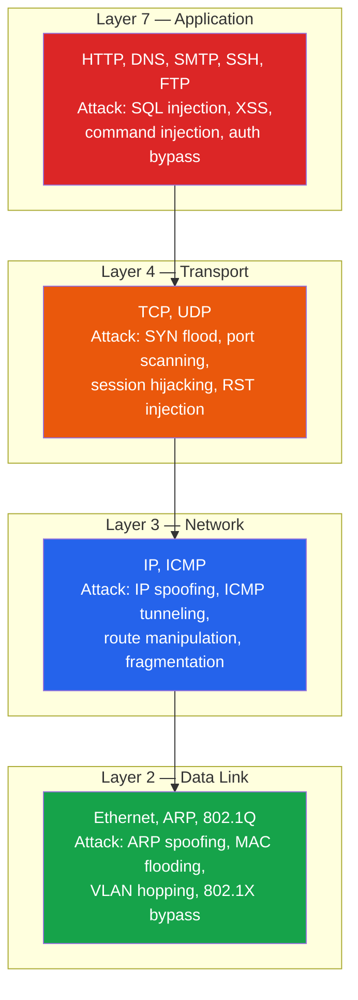
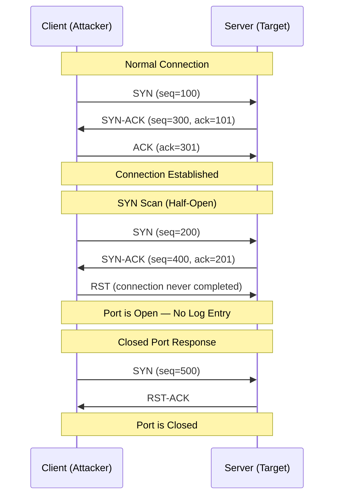
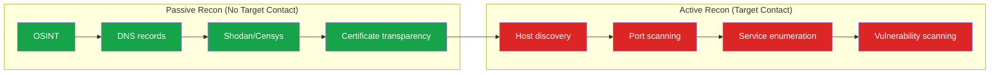

# Networking for Security

Every cyberattack traverses a network. Before you can exploit a web application, crack a password, or pivot through an internal network, you need to understand how packets move, how services listen, and how network protocols reveal information to anyone who knows how to look. This page teaches TCP/IP from the perspective of someone who needs to find, probe, and map targets — the attacker's perspective — so that you can also defend against these exact techniques.

**Related**: [Cybersecurity Overview](/cybersecurity/) | [Network Attacks & Defense](/cybersecurity/network-attacks) | [OSINT](/cybersecurity/osint) | [Security Tools](/cybersecurity/security-tools)

---

## The TCP/IP Stack from an Attacker's Perspective

Attackers think about the network stack differently than developers. Each layer exposes information and attack surface.



### What Each Layer Reveals to an Attacker

| Layer | Information Leaked | How Attacker Uses It |
|-------|-------------------|---------------------|
| **Application (7)** | Server banners, error messages, HTML comments, API responses | Identify software versions, find misconfigurations, discover hidden endpoints |
| **Transport (4)** | Open ports, TCP window size, ISN patterns | Map services, fingerprint OS, identify firewall rules |
| **Network (3)** | TTL values, IP addresses, routing paths | Map network topology, identify OS, trace paths to target |
| **Data Link (2)** | MAC addresses, ARP tables, VLAN tags | Identify vendors (OUI lookup), perform MITM, bypass network segmentation |

---

## TCP Three-Way Handshake — Why Attackers Care

The TCP handshake is the foundation of port scanning. Understanding it explains why different scan types exist and what information they reveal.



### Port States and What They Mean

| Response to SYN | Port State | Meaning |
|-----------------|-----------|---------|
| SYN-ACK | **Open** | A service is listening and accepting connections |
| RST | **Closed** | No service is listening, but the host is reachable |
| No response / ICMP unreachable | **Filtered** | A firewall is blocking the probe |
| SYN-ACK but connection resets after ACK | **Open\|Filtered** | Stateful firewall or IDS may be interfering |

---

## Ports, Protocols, and Services

Knowing common ports is fundamental. Attackers use this knowledge to quickly identify what services are running and prioritize targets.

### Critical Ports for Security Professionals

| Port | Protocol | Service | Security Relevance |
|------|----------|---------|-------------------|
| 21 | TCP | FTP | Anonymous login, cleartext creds, bounce attacks |
| 22 | TCP | SSH | Brute force, key-based auth bypass, tunneling |
| 23 | TCP | Telnet | Cleartext everything, should never be exposed |
| 25 | TCP | SMTP | Open relay, email spoofing, user enumeration |
| 53 | TCP/UDP | DNS | Zone transfers, cache poisoning, tunneling |
| 80/443 | TCP | HTTP/HTTPS | Web app attacks, see [Web App Pentesting](/cybersecurity/web-app-pentesting) |
| 88 | TCP | Kerberos | Kerberoasting, AS-REP roasting, golden/silver tickets |
| 110/995 | TCP | POP3/POP3S | Email credential theft |
| 135 | TCP | MSRPC | Windows RPC enumeration, lateral movement |
| 139/445 | TCP | SMB | EternalBlue, share enumeration, relay attacks |
| 389/636 | TCP | LDAP/LDAPS | Active Directory enumeration |
| 1433 | TCP | MSSQL | xp_cmdshell, credential extraction |
| 1521 | TCP | Oracle DB | TNS listener attacks |
| 3306 | TCP | MySQL | UDF injection, credential brute force |
| 3389 | TCP | RDP | Brute force, BlueKeep, session hijacking |
| 5432 | TCP | PostgreSQL | COPY TO/FROM for file read/write |
| 5985/5986 | TCP | WinRM | Remote PowerShell, lateral movement |
| 6379 | TCP | Redis | Unauthenticated access, RCE via SLAVEOF |
| 8080/8443 | TCP | HTTP Alt | Admin panels, development servers |
| 27017 | TCP | MongoDB | Default no-auth, data exfiltration |

---

## Nmap — The Network Scanner

Nmap is the single most important tool in a security professional's toolkit. It discovers hosts, maps ports, identifies services, fingerprints operating systems, and runs vulnerability detection scripts.

### Essential Scan Types

```bash
# Host discovery — find live hosts on a subnet
nmap -sn 192.168.1.0/24

# SYN scan (default, requires root) — fast, stealthy
sudo nmap -sS 192.168.1.100

# TCP connect scan — no root required, but logged
nmap -sT 192.168.1.100

# UDP scan — slow but critical (DNS, SNMP, DHCP)
sudo nmap -sU --top-ports 100 192.168.1.100

# Version detection — identify service and version
nmap -sV 192.168.1.100

# OS fingerprinting — identify operating system
sudo nmap -O 192.168.1.100

# Aggressive scan — OS, version, scripts, traceroute
nmap -A 192.168.1.100

# Full port scan with version detection
nmap -sV -p- 192.168.1.100

# Scan specific ports
nmap -p 22,80,443,8080 192.168.1.100

# Scan a range
nmap -p 1-1000 192.168.1.100
```

### Nmap Scan Comparison

| Scan Type | Flag | Root Required | Speed | Stealth | Use Case |
|-----------|------|---------------|-------|---------|----------|
| SYN scan | `-sS` | Yes | Fast | High | Default for root users |
| Connect scan | `-sT` | No | Moderate | Low | When root is unavailable |
| UDP scan | `-sU` | Yes | Slow | N/A | Find DNS, SNMP, DHCP |
| FIN scan | `-sF` | Yes | Moderate | High | Bypass simple firewalls |
| NULL scan | `-sN` | Yes | Moderate | High | Bypass simple firewalls |
| Xmas scan | `-sX` | Yes | Moderate | High | Bypass simple firewalls |
| ACK scan | `-sA` | Yes | Fast | Medium | Map firewall rules |
| Idle scan | `-sI` | Yes | Slow | Very high | Completely blind scan |

### Nmap Scripting Engine (NSE)

NSE transforms Nmap from a port scanner into a vulnerability scanner. Scripts are organized by category.

```bash
# Run default scripts against open ports
nmap -sC 192.168.1.100

# Combine version detection + default scripts (most common combo)
nmap -sV -sC 192.168.1.100

# Run specific vulnerability scripts
nmap --script vuln 192.168.1.100

# SMB enumeration
nmap --script smb-enum-shares,smb-enum-users -p 445 192.168.1.100

# HTTP enumeration
nmap --script http-enum,http-headers,http-methods -p 80,443 192.168.1.100

# Check for EternalBlue
nmap --script smb-vuln-ms17-010 -p 445 192.168.1.100

# DNS zone transfer
nmap --script dns-zone-transfer --script-args dns-zone-transfer.domain=target.com -p 53 ns.target.com

# Brute force SSH
nmap --script ssh-brute -p 22 192.168.1.100

# List all available scripts
ls /usr/share/nmap/scripts/ | wc -l  # ~600+ scripts
```

::: tip NSE Script Categories
Use `--script <category>` with: `auth`, `broadcast`, `brute`, `default`, `discovery`, `dos`, `exploit`, `external`, `fuzzer`, `intrusive`, `malware`, `safe`, `version`, `vuln`. Start with `safe` and `discovery` during initial recon.
:::

### Real-World Nmap Workflow

```bash
# Phase 1: Quick host discovery
sudo nmap -sn -T4 10.10.10.0/24 -oG hosts.txt

# Phase 2: Fast port scan on discovered hosts
sudo nmap -sS -T4 --top-ports 1000 -iL live_hosts.txt -oA quick_scan

# Phase 3: Full port scan on interesting targets
sudo nmap -sS -p- -T4 10.10.10.50 -oA full_ports

# Phase 4: Deep service enumeration on open ports
sudo nmap -sV -sC -p 22,80,443,8080 10.10.10.50 -oA detailed_scan

# Phase 5: Targeted vulnerability scanning
sudo nmap --script vuln -p 22,80,443,8080 10.10.10.50 -oA vuln_scan
```

### Nmap Output Formats

```bash
# Normal output
nmap -oN scan.txt 192.168.1.100

# Grepable output — easy to parse with grep/awk
nmap -oG scan.gnmap 192.168.1.100

# XML output — for tools like searchsploit
nmap -oX scan.xml 192.168.1.100

# All formats at once
nmap -oA scan_results 192.168.1.100
```

---

## Wireshark Packet Analysis

Wireshark captures and decodes network traffic at every layer. It is essential for understanding what is actually happening on the wire, verifying exploits, and performing network forensics.

### Essential Display Filters

```
# Filter by IP address
ip.addr == 192.168.1.100
ip.src == 192.168.1.100
ip.dst == 10.0.0.1

# Filter by protocol
tcp
udp
dns
http
tls

# Filter by port
tcp.port == 443
tcp.dstport == 80
udp.port == 53

# Filter TCP flags
tcp.flags.syn == 1 && tcp.flags.ack == 0    # SYN only (scan detection)
tcp.flags.rst == 1                            # RST packets (closed ports)

# Filter HTTP
http.request.method == "POST"
http.response.code == 200
http.request.uri contains "admin"
http.host == "target.com"

# Filter DNS
dns.qry.name == "evil.com"
dns.flags.response == 1

# Filter by frame length (find anomalies)
frame.len > 1500

# Combine filters
ip.addr == 192.168.1.100 && tcp.port == 80 && http.request.method == "POST"
```

### What to Look For in Captures

| Pattern | Wireshark Filter | Indicates |
|---------|-----------------|-----------|
| Port scan | `tcp.flags.syn==1 && tcp.flags.ack==0` from one source to many ports | Nmap SYN scan in progress |
| ARP spoofing | `arp.duplicate-address-detected` | Someone is poisoning ARP cache |
| DNS tunneling | `dns` with unusually large queries or many TXT records | Data exfiltration via DNS |
| Cleartext credentials | `http.request.method=="POST"` with `ftp` or `telnet` | Unencrypted authentication |
| TLS downgrade | `ssl.handshake.version` showing SSLv3 or TLS 1.0 | Possible POODLE / BEAST attack |
| Beaconing | Regular interval connections to same external IP | C2 communication |

::: warning Capture Permissions
On Linux, Wireshark needs root or the `dumpcap` group to capture packets. Alternatively, use `tcpdump` to capture and analyze in Wireshark later:
```bash
sudo tcpdump -i eth0 -w capture.pcap -c 10000
```
:::

---

## Network Reconnaissance Methodology

Reconnaissance is the first and most important phase of any security assessment. The more you know about the target before you touch it, the more effective your testing will be.



### Passive Reconnaissance Checklist

Passive recon never touches the target directly. It uses publicly available information.

```bash
# DNS enumeration
dig target.com ANY
dig target.com MX
dig target.com NS
dig target.com TXT
host -t axfr target.com ns1.target.com  # Zone transfer attempt

# WHOIS
whois target.com

# Certificate transparency logs
# Search crt.sh for all certificates issued to the domain
curl -s "https://crt.sh/?q=%25.target.com&output=json" | jq '.[].name_value' | sort -u

# Shodan CLI
shodan search hostname:target.com
shodan host 93.184.216.34

# theHarvester — gather emails, subdomains, IPs
theHarvester -d target.com -b google,bing,linkedin,dnsdumpster

# Subfinder — fast subdomain discovery
subfinder -d target.com -o subdomains.txt
```

### Active Reconnaissance Workflow

::: danger Authorization Required
Active reconnaissance involves sending packets to target systems. This is only legal with explicit written authorization or on systems you own.
:::

```bash
# Step 1: Discover live hosts
sudo nmap -sn 10.10.10.0/24 -oG - | grep "Up" | awk '{print $2}' > live_hosts.txt

# Step 2: Quick port scan all live hosts
sudo nmap -sS -T4 --top-ports 1000 -iL live_hosts.txt -oA initial_scan

# Step 3: Parse results — find open ports
grep "open" initial_scan.gnmap | sort -u

# Step 4: Service version detection on interesting hosts
sudo nmap -sV -sC -p 22,80,443,445,3389 -iL priority_targets.txt -oA service_scan

# Step 5: Screenshot web services
# Use tools like Aquatone or EyeWitness
cat web_targets.txt | aquatone -ports 80,443,8080,8443

# Step 6: Vulnerability assessment
sudo nmap --script vuln -p 80,443 target.com -oA vuln_scan
```

---

## Key Protocols for Security Testing

### DNS — The Internet's Phone Book

DNS is a goldmine for reconnaissance and a common attack vector.

```bash
# Forward lookup
dig +short target.com A

# Reverse lookup
dig +short -x 93.184.216.34

# Find mail servers
dig +short target.com MX

# Find nameservers
dig +short target.com NS

# Attempt zone transfer (information disclosure if allowed)
dig axfr @ns1.target.com target.com

# Query specific record types
dig target.com TXT    # SPF, DKIM, DMARC records
dig target.com AAAA   # IPv6 addresses
dig target.com CNAME  # Aliases
```

### SMB — Windows File Sharing (Port 445)

SMB is one of the most attacked protocols in internal networks.

```bash
# Enumerate shares
smbclient -L //target -N

# Null session enumeration
rpcclient -U "" -N target

# Enum4linux — automated SMB enumeration
enum4linux -a target

# Check for EternalBlue (MS17-010)
nmap --script smb-vuln-ms17-010 -p 445 target
```

### SNMP — Simple Network Management Protocol (Port 161/UDP)

SNMP with default community strings is a common finding in network assessments.

```bash
# Brute force community strings
onesixtyone -c /usr/share/seclists/Discovery/SNMP/common-snmp-community-strings.txt target

# Walk SNMP tree with known community string
snmpwalk -v2c -c public target

# Get system info
snmpwalk -v2c -c public target 1.3.6.1.2.1.1
```

---

## Defense: Detecting Reconnaissance

Understanding how recon works means you can detect and block it.

| Technique | Detection Method | Prevention |
|-----------|-----------------|------------|
| Port scanning | IDS rules (Snort/Suricata), firewall rate limiting | Limit exposed ports, use port knocking |
| Banner grabbing | Log analysis, honeypots | Customize or remove banners |
| DNS enumeration | DNS query logging, rate limiting | Disable zone transfers, use split DNS |
| SNMP sniffing | SNMPv3 auth logs | Use SNMPv3 with authentication and encryption |
| OS fingerprinting | Detect unusual TCP flag combinations | Use TCP/IP stack fingerprint scrubbing |

::: tip For Blue Teamers
Set up Suricata or Snort with the ET OPEN ruleset to detect common scanning patterns:
```bash
# Suricata rule to detect Nmap SYN scan
alert tcp any any -> $HOME_NET any (msg:"Possible Nmap SYN Scan"; \
  flags:S; threshold: type both, track by_src, count 50, seconds 10; \
  classtype:attempted-recon; sid:1000001; rev:1;)
```
:::

---

## Further Reading

- [Cybersecurity Overview](/cybersecurity/) — career paths, certifications, learning roadmap
- [Network Attacks & Defense](/cybersecurity/network-attacks) — ARP spoofing, MITM, Wi-Fi attacks
- [OSINT](/cybersecurity/osint) — passive recon, Shodan, Google dorking
- [Security Tools Encyclopedia](/cybersecurity/security-tools) — comprehensive tool reference
- [Web App Pentesting](/cybersecurity/web-app-pentesting) — testing web services found during recon

---

::: tip Key Takeaway
- Every cyberattack starts with network reconnaissance — understanding TCP/IP, ports, and protocols is the foundation of both offense and defense
- Nmap is the single most important tool; master its scan types, NSE scripts, and output formats before moving to any other tool
- Wireshark turns invisible network traffic into readable evidence — learn its display filters to detect scans, MITM attacks, and data exfiltration
:::

::: details Hands-On Lab
**Lab: Build a Network Reconnaissance Pipeline**

1. Set up a target network using VulnHub (e.g., Metasploitable 2) or TryHackMe's "Network Services" room
2. Perform passive recon: run `whois`, `dig`, and certificate transparency lookups against a test domain
3. Perform active recon with Nmap:
   - Run a host discovery scan (`-sn`) on the subnet
   - Run a SYN scan on discovered hosts (`-sS --top-ports 1000`)
   - Run version detection + default scripts (`-sV -sC`) on open ports
   - Run a vulnerability scan (`--script vuln`) on interesting services
4. Capture 5 minutes of traffic with Wireshark while running your scans
5. Use Wireshark display filters to identify your own SYN scan traffic, then write a Suricata rule to detect it
6. Save all Nmap output in all three formats (`-oA`) and practice parsing the grepable output with `grep` and `awk`
:::

::: details CTF Challenge
**Challenge: The Hidden Service**

A server at `10.10.10.42` has a secret web application running on an unusual port. The standard top-1000 Nmap scan returns only SSH (22) and HTTP (80). The HTTP server on port 80 shows a default page. Your mission: find the hidden service, identify the software and version, and retrieve the flag from its landing page.

**Hints:**
1. A top-1000 scan misses over 64,000 ports
2. The service runs on a port above 40000
3. The service requires a specific `Host` header to respond

::: details Answer
Run a full port scan: `nmap -sS -p- -T4 10.10.10.42`. This reveals port 41337 open. Then run `nmap -sV -sC -p 41337 10.10.10.42` to identify the service. Use `curl -H "Host: secret.target.local" http://10.10.10.42:41337/` to access the hidden application and find the flag. The flag is `CTF{full_port_scans_save_lives}`.
:::
:::

::: warning Common Misconceptions
- **"A SYN scan is invisible to the target"** — SYN scans are stealthier than connect scans but still generate network traffic. Modern IDS/IPS (Suricata, Snort) detect SYN scans easily by monitoring for rapid SYN packets from a single source.
- **"Filtered ports mean there is no service"** — Filtered means a firewall is blocking your probe. The service may still be running and accessible from a different network or through a different protocol.
- **"Nmap is only for attackers"** — Network defenders use Nmap for asset discovery, compliance auditing, and verifying firewall rules. It is a universal network tool.
- **"UDP scanning is not important"** — Critical services like DNS (53), SNMP (161), and DHCP (67/68) run on UDP. Ignoring UDP means missing major attack surfaces.
- **"Wireshark can only capture live traffic"** — Wireshark excels at analyzing saved PCAP files, making it invaluable for post-incident forensics.
:::

::: details Quiz
**1. What TCP flag combination indicates an open port during a SYN scan?**

a) RST
b) SYN-ACK
c) FIN-ACK
d) ACK only

::: details Answer
b) SYN-ACK. The target responds with SYN-ACK to indicate the port is open and accepting connections.
:::

**2. Which Nmap scan type requires root/admin privileges?**

a) TCP connect scan (-sT)
b) SYN scan (-sS)
c) Both require root
d) Neither requires root

::: details Answer
b) SYN scan (-sS) requires root because it crafts raw packets. TCP connect scan (-sT) uses the operating system's connect() call and works without root.
:::

**3. What does Wireshark filter `tcp.flags.syn==1 && tcp.flags.ack==0` detect?**

a) Established connections
b) Port scan SYN packets
c) Connection teardown
d) UDP traffic

::: details Answer
b) Port scan SYN packets. This filter shows packets with the SYN flag set but not the ACK flag — the initial packet in a TCP handshake, which is exactly what a SYN scan sends.
:::

**4. Why would an attacker use an idle scan (-sI)?**

a) It is faster than a SYN scan
b) It hides the attacker's IP address completely
c) It works through firewalls
d) It detects UDP services

::: details Answer
b) An idle scan uses a zombie host to send the scan packets, so the target only sees the zombie's IP address, not the attacker's. The attacker's IP never touches the target.
:::

**5. What Nmap output format is best for parsing with automated tools?**

a) Normal output (-oN)
b) Grepable output (-oG)
c) XML output (-oX)
d) Script kiddie output (-oS)

::: details Answer
c) XML output (-oX) is the most structured format and is best for automated parsing by tools like searchsploit, Metasploit, and custom scripts. Grepable (-oG) is useful for quick command-line parsing but lacks detail.
:::
:::

> **One-Liner Summary:** Every attack starts with a packet — master how they move, and you control both offense and defense.
